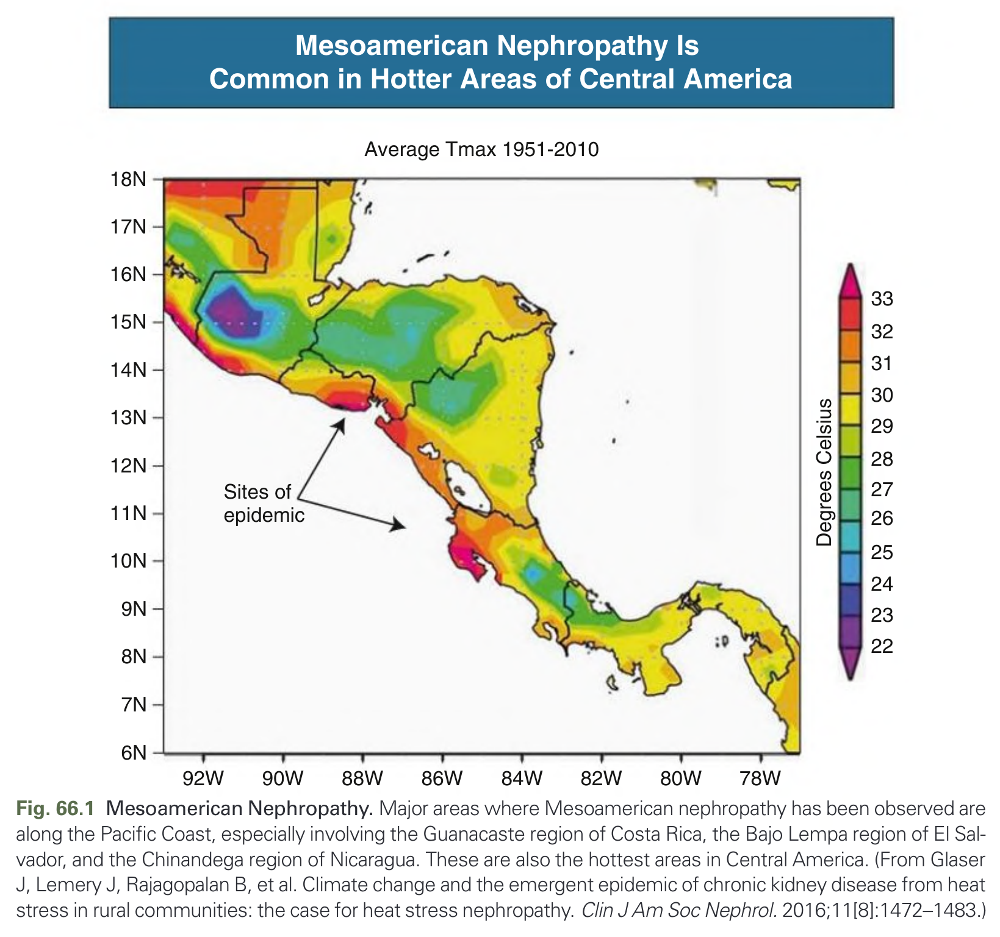
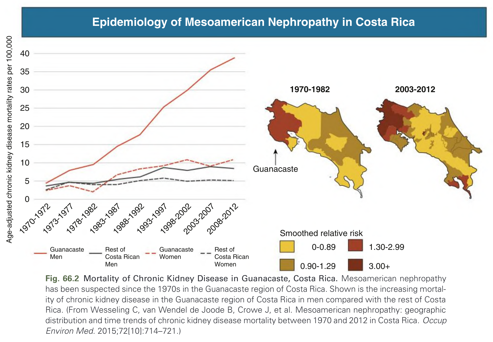
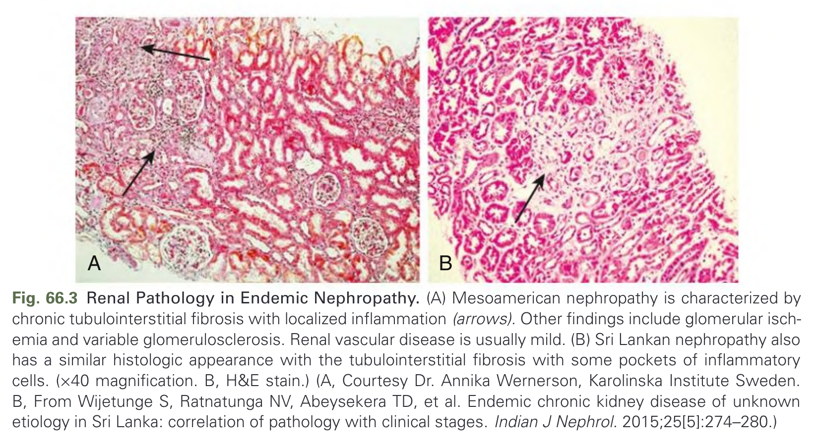
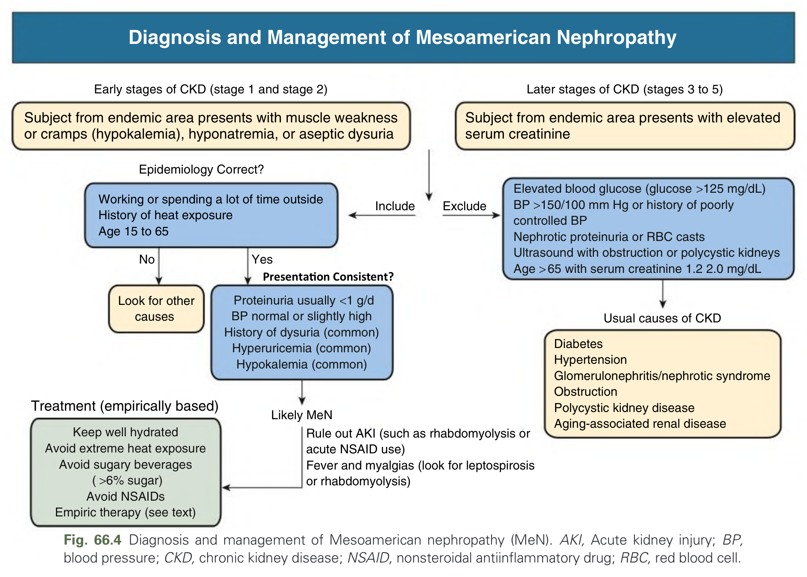
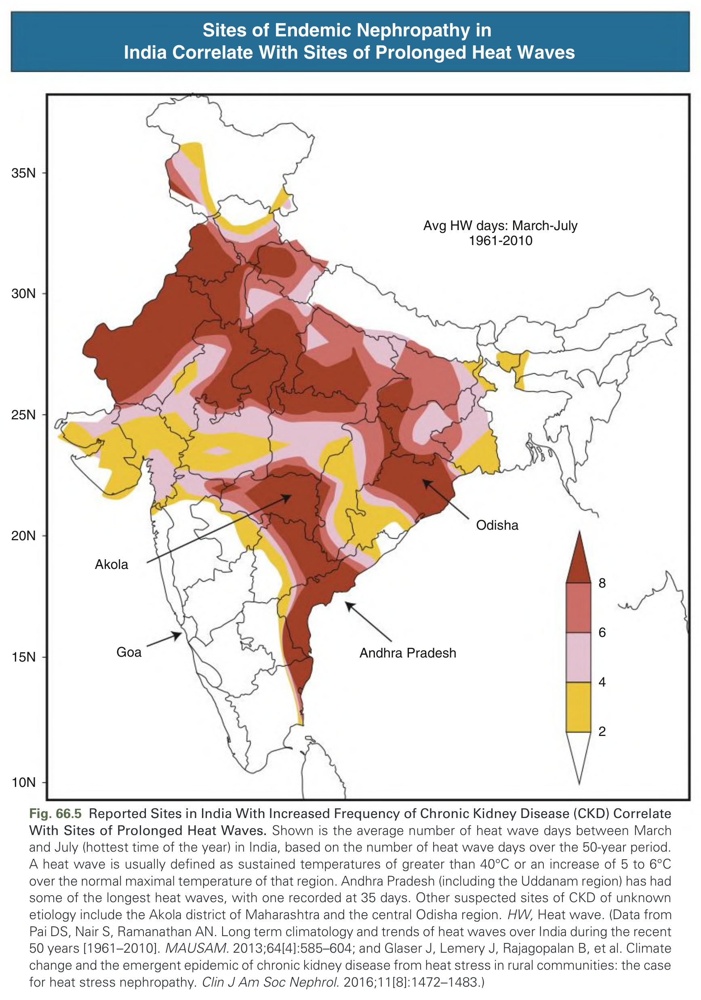
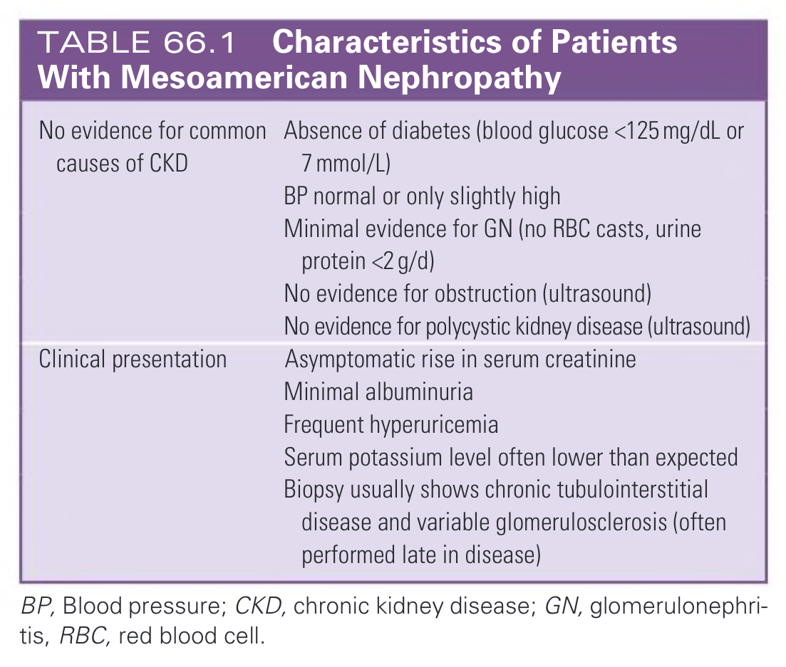

# 066. Endemic Nephropathies - Figures and Tables Index

This document lists all figures, tables and boxes extracted from `066. Endemic Nephropathies.pdf`.

## Table of Contents
- [Figures](#figures)
- [Tables](#tables)
- [Boxes](#boxes)

---

## Figures

### Fig_66_1



Fig. 66.1 Mesoamerican Nephropathy. Major areas where Mesoamerican nephropathy has been observed are shown in red. (From Johnson RJ, Wesseling C, Newman LS. Chronic kidney disease of unknown cause in agricultural communities. N Engl J Med. 2019;380[19]:1843–1852; and Glaser J, Lemery J, Rajagopalan B, et al. Climate change and the emergent epidemic of CKD from heat stress in rural communities: the case for heat stress nephropathy. Clin J Am Soc Nephrol. 2016;11[8]:1472–1483.)

---

### Fig_66_2



Fig. 66.2 Mortality of Chronic Kidney Disease in Guanacaste, Costa Rica. Mesoamerican nephropathy has had a dramatic effect on mortality in male individuals in Guanacaste, Costa Rica. (From Wesseling C, van Wendel de Joode B, Crowe J, et al. Mesoamerican nephropathy in Costa Rica: a dynamic analysis of mortality [1970–2012] in the global context. Occup Environ Med. 2015;72[10]:714–721.)

---

### Fig_66_3



Fig. 66.3 Renal Pathology in Endemic Nephropathy. (A) Mesoamerican nephropathy is characterized by chronic tubulointerstitial disease and chronic glomerular ischemia with signs of glomerulosclerosis. (Jones silver stain; original magnification ×100.) (B) Electron microscopy showing severe chronic ischemic injury with severe corrugation and folding of the glomerular basement membrane (GBM) as well as subendothelial new basement membrane formation (neomembrane) and duplication of the GBM. (Courtesy Dr. Julia Wijkström, Karolinska Institutet, Stockholm.) (C) Sri Lankan nephropathy is characterized by chronic tubulointerstitial disease and secondary glomerulosclerosis. (Jones silver stain; original magnification ×200.) (D) Low-power electron microscopy showing chronic ischemic changes. (Courtesy Dr. V. Ratnayake, Kandy General Hospital, Kandy, Sri Lanka.)

---

### Fig_66_4



Fig. 66.4 Diagnosis and management of Mesoamerican nephropathy (MeN). AKI, Acute kidney injury; BP, blood pressure; CKD, chronic kidney disease; NSAID, nonsteroidal antiinflammatory drug; RBC, red blood cell.

---

### Fig_66_5



Fig. 66.5 Reported Sites in India With Increased Frequency of Chronic Kidney Disease (CKD) Correlate with Mean Heat Index. (A) Reported sites of CKD. (B) High-resolution heat index data for India. (From Glaser J, Lemery J, Rajagopalan B, et al. Climate change and the emergent epidemic of CKD from heat stress in rural communities: the case for heat stress nephropathy. Clin J Am Soc Nephrol. 2016;11[8]:1472–1483.)

---

## Tables

### Table_66_1

#### Table Image



#### Table Data (CSV: [Table_66_1.csv](Table_66_1.csv))

```markdown
| | |
| :--- | :--- |
| No evidence for common causes of CKD | Absence of diabetes (blood glucose <125 mg/dL or 7 mmol/L)<br>BP normal or only slightly high<br>Minimal evidence for GN (no RBC casts, urine protein <2 g/d)<br>No evidence for obstruction (ultrasound)<br>No evidence for polycystic kidney disease (ultrasound) |
| Clinical presentation | Asymptomatic rise in serum creatinine<br>Minimal albuminuria<br>Frequent hyperuricemia<br>Serum potassium level often lower than expected<br>Biopsy usually shows chronic tubulointerstitial disease and variable glomerulosclerosis (often performed late in disease) |

BP, Blood pressure; CKD, chronic kidney disease; GN, glomerulonephritis; RBC, red blood cell.
```

TABLE 66.1 Characteristics of Patients With Mesoamerican Nephropathy

---

## Boxes

*No boxes resolved for this chapter.*
