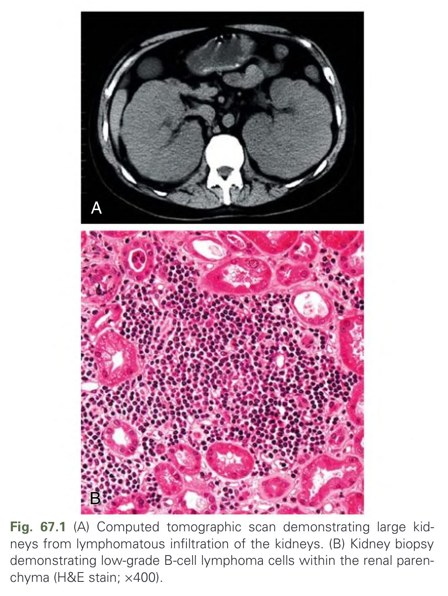
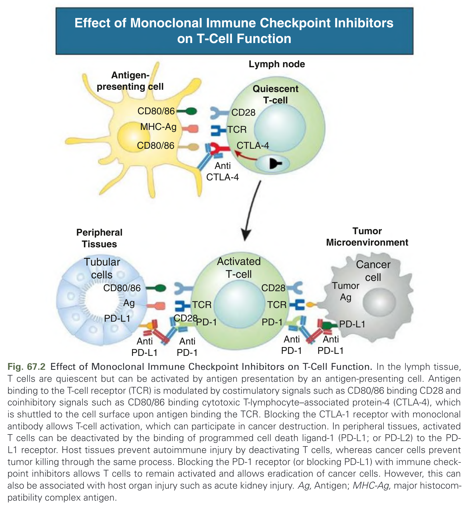
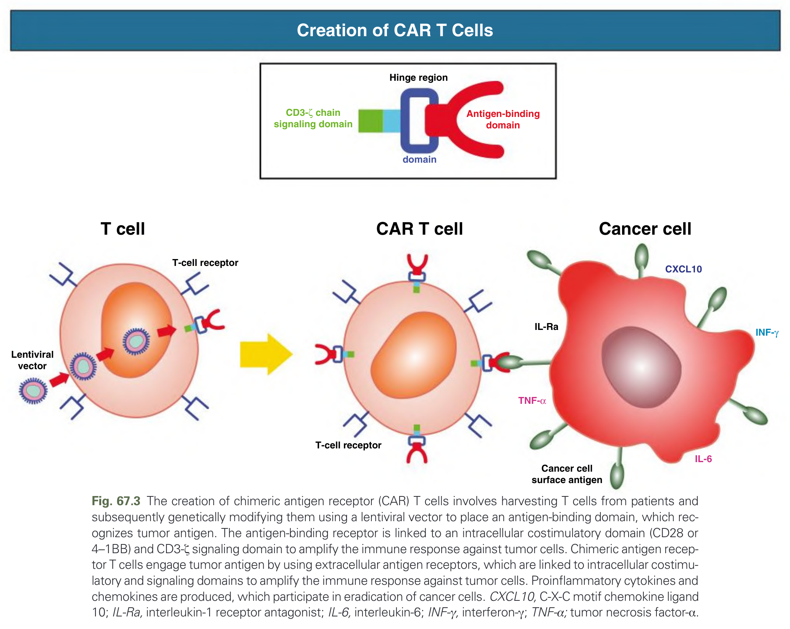
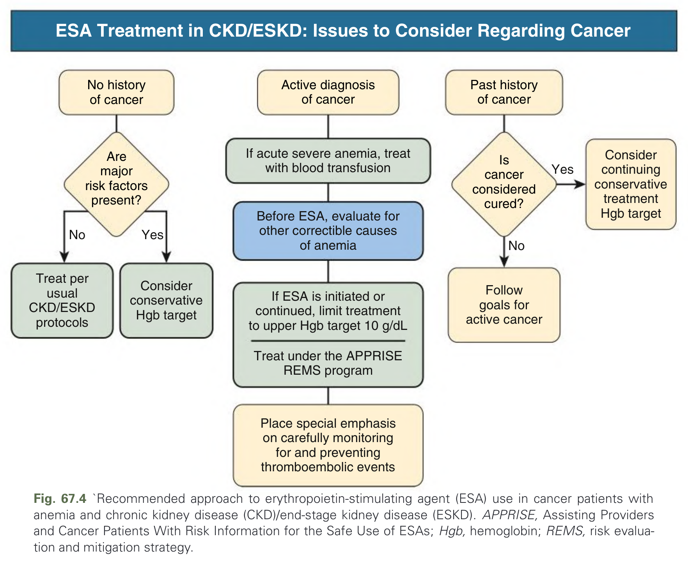
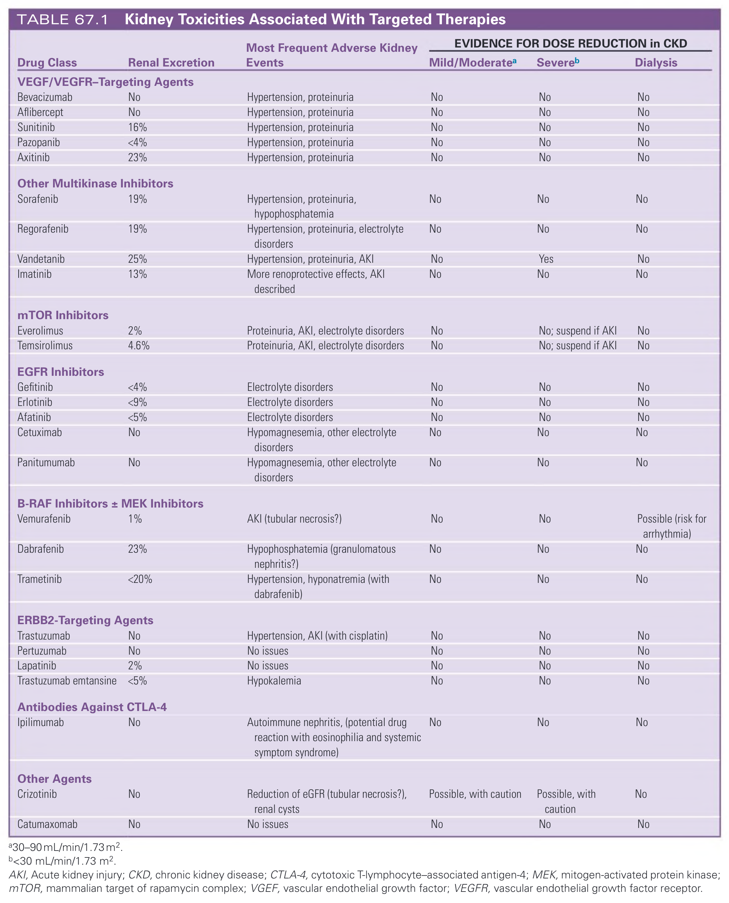
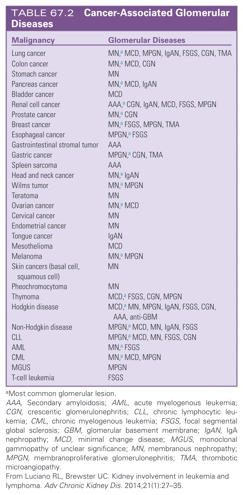
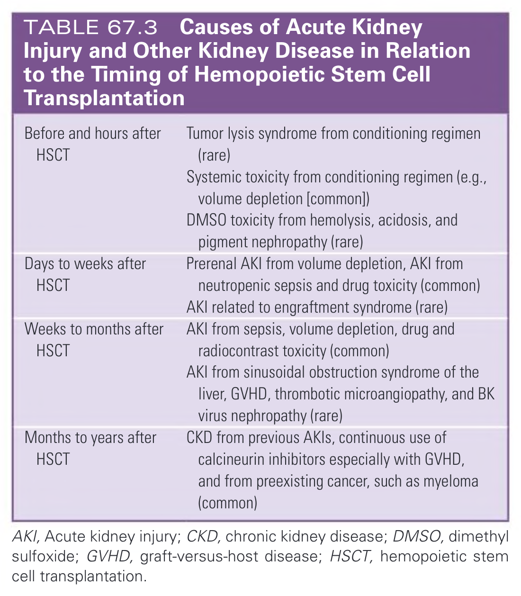
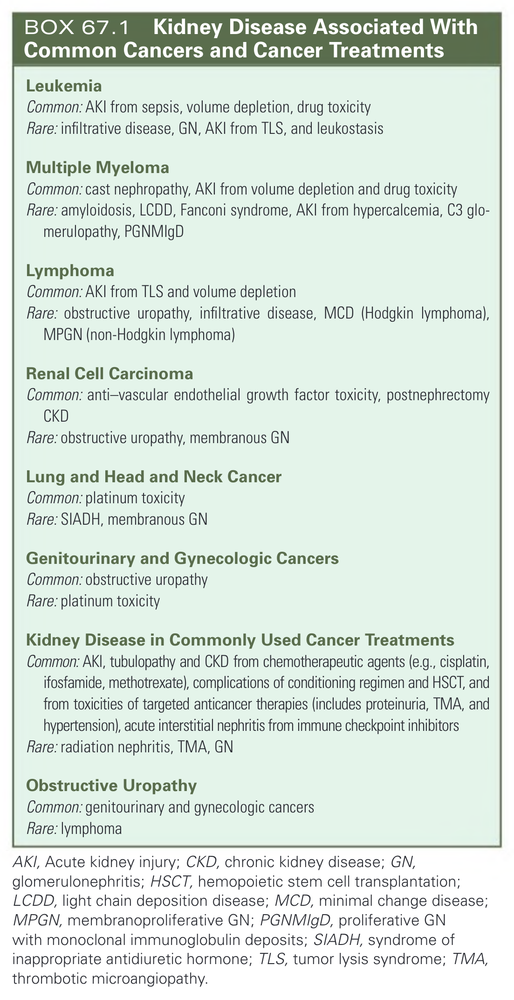
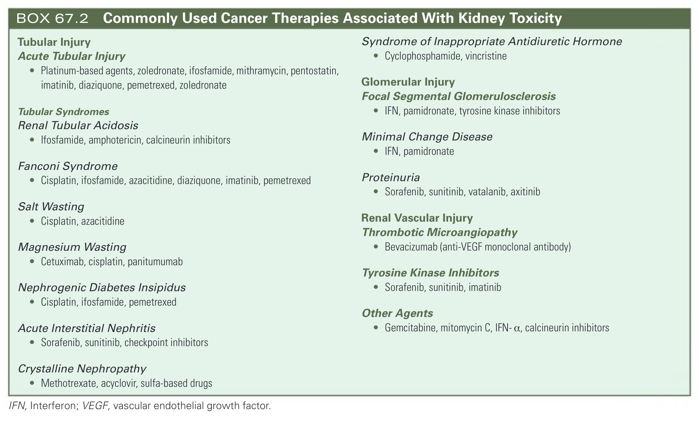
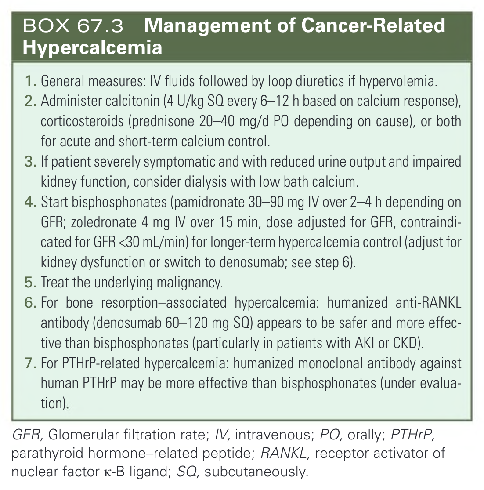

# 067. Oncology- Kidney Disease in Cancer Patients - Figures and Tables Index

This document lists all figures, tables and boxes extracted from `067. Oncology- Kidney Disease in Cancer Patients.pdf`.

## Table of Contents
- [Figures](#figures)
- [Tables](#tables)
- [Boxes](#boxes)

---

## Figures

### Fig_67_1



Fig. 67.1 (A) Computed tomographic scan demonstrating large kidneys from lymphomatous infiltration of the kidneys. (B) Kidney biopsy demonstrating low-grade B-cell lymphoma cells within the renal parenchyma (H&E stain; ×400).

---

### Fig_67_2



Fig. 67.2 Effect of Monoclonal Immune Checkpoint Inhibitors on T-Cell Function. In the lymph tissue, T cells are quiescent but can be activated by antigen presentation by an antigen-presenting cell. Antigen binding to the T-cell receptor (TCR) is modulated by costimulatory signals such as CD80/86 binding CD28 and coinhibitory signals such as CD80/86 binding cytotoxic T-lymphocyte–associated protein-4 (CTLA-4), which is shuttled to the cell surface upon antigen binding the TCR. Blocking the CTLA-1 receptor with monoclonal antibody allows T-cell activation, which can participate in cancer destruction. In peripheral tissues, activated T cells can be deactivated by the binding of programmed cell death ligand-1 (PD-L1; or PD-L2) to the PD-L1 receptor. Host tissues prevent autoimmune injury by deactivating T cells, whereas cancer cells prevent tumor killing through the same process. Blocking the PD-1 receptor (or blocking PD-L1) with immune checkpoint inhibitors allows T cells to remain activated and allows eradication of cancer cells. However, this can also be associated with host organ injury such as acute kidney injury. Ag, Antigen; MHC-Ag, major histocompatibility complex antigen.

---

### Fig_67_3



Fig. 67.3 The creation of chimeric antigen receptor (CAR) T cells involves harvesting T cells from patients and subsequently genetically modifying them using a lentiviral vector to place an antigen-binding domain, which recognizes tumor antigen. The antigen-binding receptor is linked to an intracellular costimulatory domain (CD28 or 4–1BB) and CD3-ζ signaling domain to amplify the immune response against tumor cells. Chimeric antigen receptor T cells engage tumor antigen by using extracellular antigen receptors, which are linked to intracellular costimulatory and signaling domains to amplify the immune response against tumor cells. Proinflammatory cytokines and chemokines are produced, which participate in eradication of cancer cells. CXCL10, C-X-C motif chemokine ligand 10; IL-Ra, interleukin-1 receptor antagonist; IL-6, interleukin-6; INF-γ, interferon-γ; TNF-α; tumor necrosis factor-α.

---

### Fig_67_4



Fig. 67.4 ‘Recommended approach to erythropoietin-stimulating agent (ESA) use in cancer patients with anemia and chronic kidney disease (CKD)/end-stage kidney disease (ESKD). APPRISE, Assisting Providers and Cancer Patients With Risk Information for the Safe Use of ESAs; Hgb, hemoglobin; REMS, risk evaluation and mitigation strategy.

---

## Tables

### Table_67_1

#### Table Image



#### Table Data (CSV: [Table_67_1.csv](Table_67_1.csv))

```markdown
| Drug Class | Renal Excretion | Most Frequent Adverse Kidney Events | EVIDENCE FOR DOSE REDUCTION in CKD | | |
| :--- | :--- | :--- | :--- | :--- | :--- |
| | | | **Mild/Moderatea** | **Severeb** | **Dialysis** |
| **VEGF/VEGFR-Targeting Agents** | | | | | |
| Bevacizumab | No | Hypertension, proteinuria | No | No | No |
| Aflibercept | No | Hypertension, proteinuria | No | No | No |
| Sunitinib | 16% | Hypertension, proteinuria | No | No | No |
| Pazopanib | <4% | Hypertension, proteinuria | No | No | No |
| Axitinib | 23% | Hypertension, proteinuria | No | No | No |
| **Other Multikinase Inhibitors** | | | | | |
| Sorafenib | 19% | Hypertension, proteinuria, hypophosphatemia | No | No | No |
| Regorafenib | 19% | Hypertension, proteinuria, electrolyte disorders | No | No | No |
| Vandetanib | 25% | Hypertension, proteinuria, AKI | No | Yes | No |
| Imatinib | 13% | More renoprotective effects, AKI described | No | No | No |
| **mTOR Inhibitors** | | | | | |
| Everolimus | 2% | Proteinuria, AKI, electrolyte disorders | No | No; suspend if AKI | No |
| Temsirolimus | 4.6% | Proteinuria, AKI, electrolyte disorders | No | No; suspend if AKI | No |
| **EGFR Inhibitors** | | | | | |
| Gefitinib | <4% | Electrolyte disorders | No | No | No |
| Erlotinib | <9% | Electrolyte disorders | No | No | No |
| Afatinib | <5% | Electrolyte disorders | No | No | No |
| Cetuximab | No | Hypomagnesemia, other electrolyte disorders | No | No | No |
| Panitumumab | No | Hypomagnesemia, other electrolyte disorders | No | No | No |
| **B-RAF Inhibitors ± MEK Inhibitors** | | | | | |
| Vemurafenib | 1% | AKI (tubular necrosis?) | No | No | Possible (risk for arrhythmia) |
| Dabrafenib | 23% | Hypophosphatemia (granulomatous nephritis?) | No | No | No |
| Trametinib | <20% | Hypertension, hyponatremia (with dabrafenib) | No | No | No |
| **ERBB2-Targeting Agents** | | | | | |
| Trastuzumab | No | Hypertension, AKI (with cisplatin) | No | No | No |
| Pertuzumab | No | No issues | No | No | No |
| Lapatinib | 2% | No issues | No | No | No |
| Trastuzumab emtansine | <5% | Hypokalemia | No | No | No |
| **Antibodies Against CTLA-4** | | | | | |
| Ipilimumab | No | Autoimmune nephritis, (potential drug reaction with eosinophilia and systemic symptom syndrome) | No | No | No |
| **Other Agents** | | | | | |
| Crizotinib | No | Reduction of eGFR (tubular necrosis?), renal cysts | Possible, with caution | Possible, with caution | No |
| Catumaxomab | No | No issues | No | No | No |

a30-90 mL/min/1.73m².
b<30 mL/min/1.73 m².
AKI, Acute kidney injury; CKD, chronic kidney disease; CTLA-4, cytotoxic T-lymphocyte-associated antigen-4; MEK, mitogen-activated protein kinase; mTOR, mammalian target of rapamycin complex; VGEF, vascular endothelial growth factor; VEGFR, vascular endothelial growth factor receptor.
```

TABLE 67.1 Kidney Toxicities Associated With Targeted Therapies

---

### Table_67_2

#### Table Image



#### Table Data (CSV: [Table_67_2.csv](Table_67_2.csv))

```markdown
| Malignancy | Glomerular Diseases |
| :--- | :--- |
| Lung cancer | MN,^a MCD, MPGN, IgAN, FSGS, CGN, TMA |
| Colon cancer | MN,^a MCD, CGN |
| Stomach cancer | MN |
| Pancreas cancer | MN,^a MCD, IgAN |
| Bladder cancer | MCD |
| Renal cell cancer | AAA,^a CGN, IgAN, MCD, FSGS, MPGN |
| Prostate cancer | MN,^a CGN |
| Breast cancer | MN,^a FSGS, MPGN, TMA |
| Esophageal cancer | MPGN,^a FSGS |
| Gastrointestinal stromal tumor | AAA |
| Gastric cancer | MPGN,^a CGN, TMA |
| Spleen sarcoma | AAA |
| Head and neck cancer | MN,^a IgAN |
| Wilms tumor | MN,^a MPGN |
| Teratoma | MN |
| Ovarian cancer | MN,^a MCD |
| Cervical cancer | MN |
| Endometrial cancer | MN |
| Tongue cancer | IgAN |
| Mesothelioma | MCD |
| Melanoma | MN,^a MPGN |
| Skin cancers (basal cell, squamous cell) | MN |
| Pheochromocytoma | MN |
| Thymoma | MCD,^a FSGS, CGN, MPGN |
| Hodgkin disease | MCD,^a MN, MPGN, IgAN, FSGS, CGN, AAA, anti-GBM |
| Non-Hodgkin disease | MPGN,^a MCD, MN, IgAN, FSGS |
| CLL | MPGN,^a MCD, MN, FSGS, CGN |
| AML | MN,^a FSGS |
| CML | MN,^a MCD, MPGN |
| MGUS | MPGN |
| T-cell leukemia | FSGS |

^aMost common glomerular lesion.
AAA, Secondary amyloidosis; AML, acute myelogenous leukemia; CGN, crescentic glomerulonephritis; CLL, chronic lymphocytic leukemia; CML, chronic myelogenous leukemia; FSGS, focal segmental global sclerosis; GBM, glomerular basement membrane; IgAN, IgA nephropathy; MCD, minimal change disease; MGUS, monoclonal gammopathy of unclear significance; MN, membranous nephropathy; MPGN, membranoproliferative glomerulonephritis; TMA, thrombotic microangiopathy.
From Luciano RL, Brewster UC. Kidney involvement in leukemia and lymphoma. Adv Chronic Kidney Dis. 2014;21(1):27-35.
```

TABLE 67.2 Cancer-Associated Glomerular Diseases

---

### Table_67_3

#### Table Image



#### Table Data (CSV: [Table_67_3.csv](Table_67_3.csv))

```markdown
| | |
| :--- | :--- |
| Before and hours after HSCT | Tumor lysis syndrome from conditioning regimen (rare) |
| | Systemic toxicity from conditioning regimen (e.g., volume depletion [common]) |
| | DMSO toxicity from hemolysis, acidosis, and pigment nephropathy (rare) |
| Days to weeks after HSCT | Prerenal AKI from volume depletion, AKI from neutropenic sepsis and drug toxicity (common) |
| | AKI related to engraftment syndrome (rare) |
| Weeks to months after HSCT | AKI from sepsis, volume depletion, drug and radiocontrast toxicity (common) |
| | AKI from sinusoidal obstruction syndrome of the liver, GVHD, thrombotic microangiopathy, and BK virus nephropathy (rare) |
| Months to years after HSCT | CKD from previous AKIs, continuous use of calcineurin inhibitors especially with GVHD, and from preexisting cancer, such as myeloma (common) |

AKI, Acute kidney injury; CKD, chronic kidney disease; DMSO, dimethyl sulfoxide; GVHD, graft-versus-host disease; HSCT, hemopoietic stem cell transplantation.
```

TABLE 67.3 Causes of Acute Kidney Injury and Other Kidney Disease in Relation to the Timing of Hemopoietic Stem Cell Transplantation

---

## Boxes

### Box_67_1



#### Box Text

```markdown
**Leukemia**
Common: AKI from sepsis, volume depletion, drug toxicity
Rare: infiltrative disease, GN, AKI from TLS, and leukostasis

**Multiple Myeloma**
Common: cast nephropathy, AKI from volume depletion and drug toxicity
Rare: amyloidosis, LCDD, Fanconi syndrome, AKI from hypercalcemia, C3 glomerulopathy, PGNMIgD

**Lymphoma**
Common: AKI from TLS and volume depletion
Rare: obstructive uropathy, infiltrative disease, MCD (Hodgkin lymphoma), MPGN (non-Hodgkin lymphoma)

**Renal Cell Carcinoma**
Common: anti-vascular endothelial growth factor toxicity, postnephrectomy CKD
Rare: obstructive uropathy, membranous GN

**Lung and Head and Neck Cancer**
Common: platinum toxicity
Rare: SIADH, membranous GN

**Genitourinary and Gynecologic Cancers**
Common: obstructive uropathy
Rare: platinum toxicity

**Kidney Disease in Commonly Used Cancer Treatments**
Common: AKI, tubulopathy and CKD from chemotherapeutic agents (e.g., cisplatin, ifosfamide, methotrexate), complications of conditioning regimen and HSCT, and from toxicities of targeted anticancer therapies (includes proteinuria, TMA, and hypertension), acute interstitial nephritis from immune checkpoint inhibitors
Rare: radiation nephritis, TMA, GN

**Obstructive Uropathy**
Common: genitourinary and gynecologic cancers
Rare: lymphoma

AKI, Acute kidney injury; CKD, chronic kidney disease; GN, glomerulonephritis; HSCT, hemopoietic stem cell transplantation; LCDD, light chain deposition disease; MCD, minimal change disease; MPGN, membranoproliferative GN; PGNMIgD, proliferative GN with monoclonal immunoglobulin deposits; SIADH, syndrome of inappropriate antidiuretic hormone; TLS, tumor lysis syndrome; TMA, thrombotic microangiopathy.
```

BOX 67.1 Kidney Disease Associated With Common Cancers and Cancer Treatments

---

### Box_67_2



#### Box Text

```markdown
**Tubular Injury**
**Acute Tubular Injury**
* Platinum-based agents, zoledronate, ifosfamide, mithramycin, pentostatin, imatinib, diaziquone, pemetrexed, zoledronate

**Tubular Syndromes**
**Renal Tubular Acidosis**
* Ifosfamide, amphotericin, calcineurin inhibitors

**Fanconi Syndrome**
* Cisplatin, ifosfamide, azacitidine, diaziquone, imatinib, pemetrexed

**Salt Wasting**
* Cisplatin, azacitidine

**Magnesium Wasting**
* Cetuximab, cisplatin, panitumumab

**Nephrogenic Diabetes Insipidus**
* Cisplatin, ifosfamide, pemetrexed

**Acute Interstitial Nephritis**
* Sorafenib, sunitinib, checkpoint inhibitors

**Crystalline Nephropathy**
* Methotrexate, acyclovir, sulfa-based drugs

**Syndrome of Inappropriate Antidiuretic Hormone**
* Cyclophosphamide, vincristine

**Glomerular Injury**
**Focal Segmental Glomerulosclerosis**
* IFN, pamidronate, tyrosine kinase inhibitors

**Minimal Change Disease**
* IFN, pamidronate

**Proteinuria**
* Sorafenib, sunitinib, vatalanib, axitinib

**Renal Vascular Injury**
**Thrombotic Microangiopathy**
* Bevacizumab (anti-VEGF monoclonal antibody)

**Tyrosine Kinase Inhibitors**
* Sorafenib, sunitinib, imatinib

**Other Agents**
* Gemcitabine, mitomycin C, IFN-a, calcineurin inhibitors

IFN, Interferon; VEGF, vascular endothelial growth factor.
```

BOX 67.2 Commonly Used Cancer Therapies Associated With Kidney Toxicity

---

### Box_67_3



#### Box Text

```markdown
1. General measures: IV fluids followed by loop diuretics if hypervolemia.
2. Administer calcitonin (4 U/kg SQ every 6-12 h based on calcium response), corticosteroids (prednisone 20-40 mg/d PO depending on cause), or both for acute and short-term calcium control.
3. If patient severely symptomatic and with reduced urine output and impaired kidney function, consider dialysis with low bath calcium.
4. Start bisphosphonates (pamidronate 30-90 mg IV over 2-4 h depending on GFR; zoledronate 4 mg IV over 15 min, dose adjusted for GFR, contraindicated for GFR <30 mL/min) for longer-term hypercalcemia control (adjust for kidney dysfunction or switch to denosumab; see step 6).
5. Treat the underlying malignancy.
6. For bone resorption-associated hypercalcemia: humanized anti-RANKL antibody (denosumab 60-120 mg SQ) appears to be safer and more effective than bisphosphonates (particularly in patients with AKI or CKD).
7. For PTHrP-related hypercalcemia: humanized monoclonal antibody against human PTHrP may be more effective than bisphosphonates (under evaluation).

GFR, Glomerular filtration rate; IV, intravenous; PO, orally; PTHrP, parathyroid hormone-related peptide; RANKL, receptor activator of nuclear factor K-B ligand; SQ, subcutaneously.
```

BOX 67.3 Management of Cancer-Related Hypercalcemia

---
