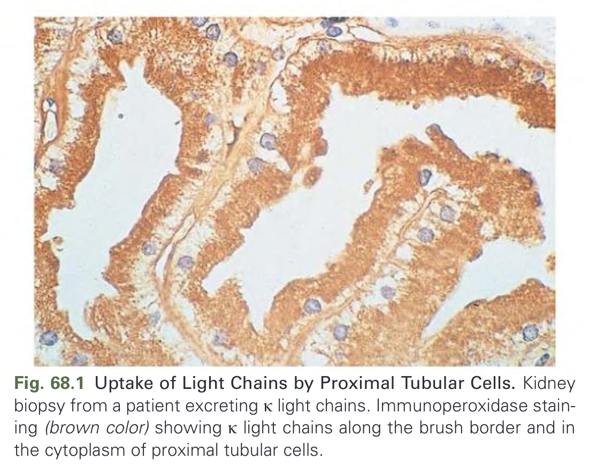
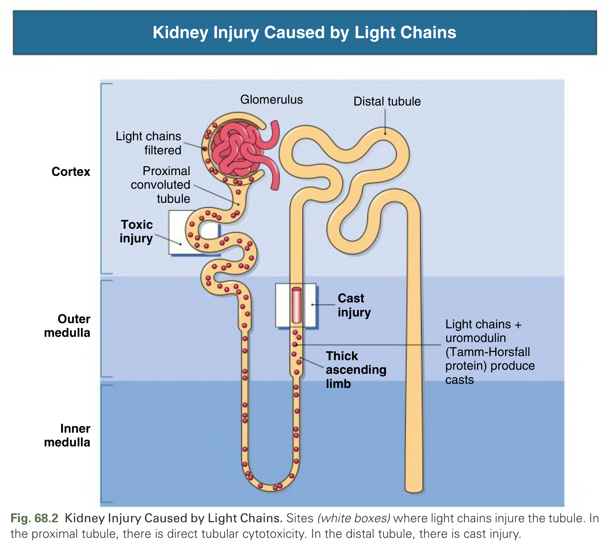
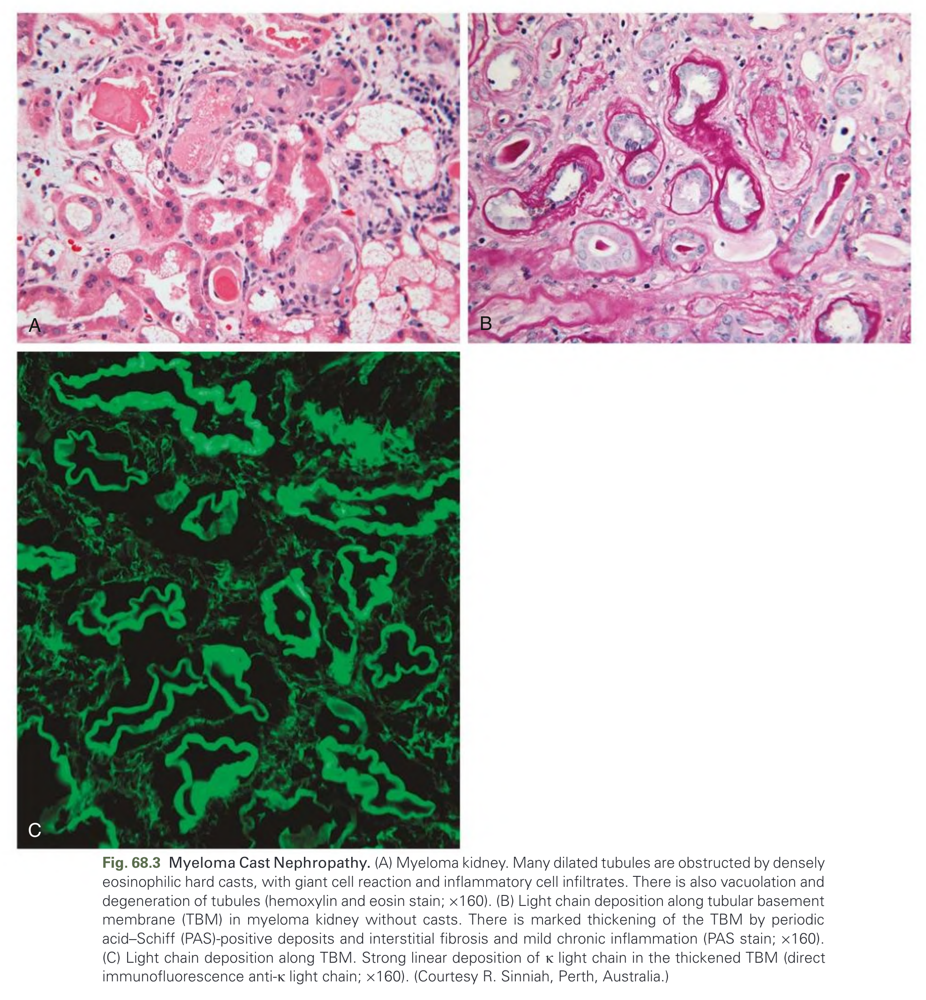
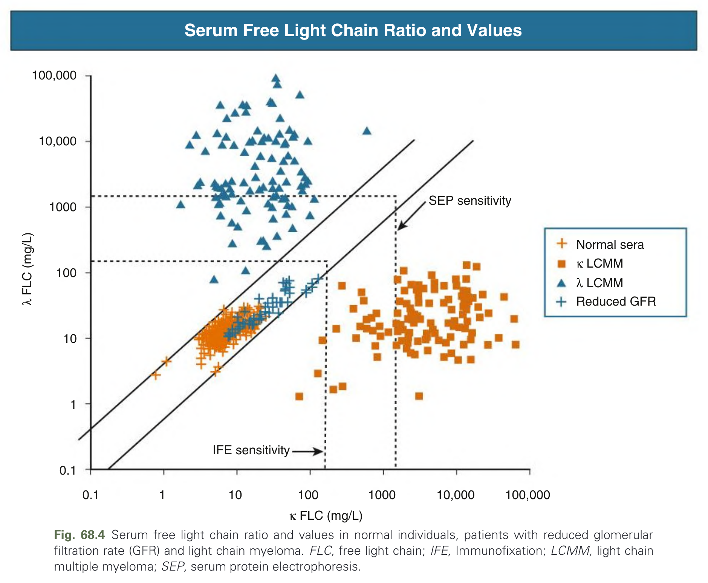
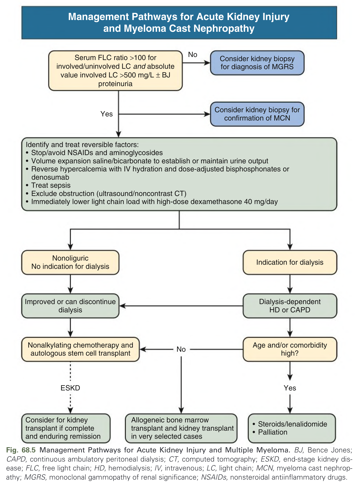
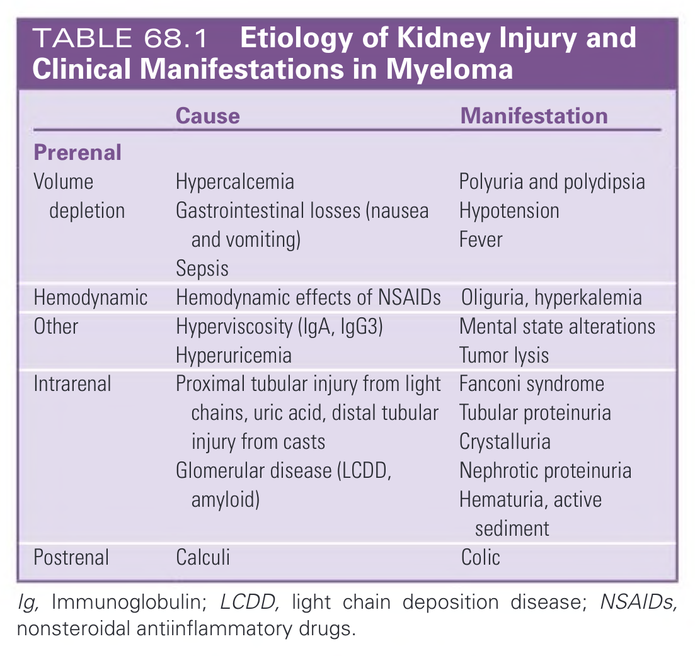
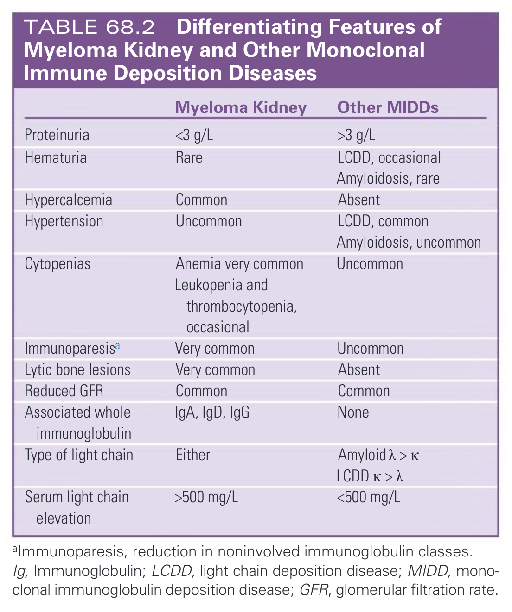
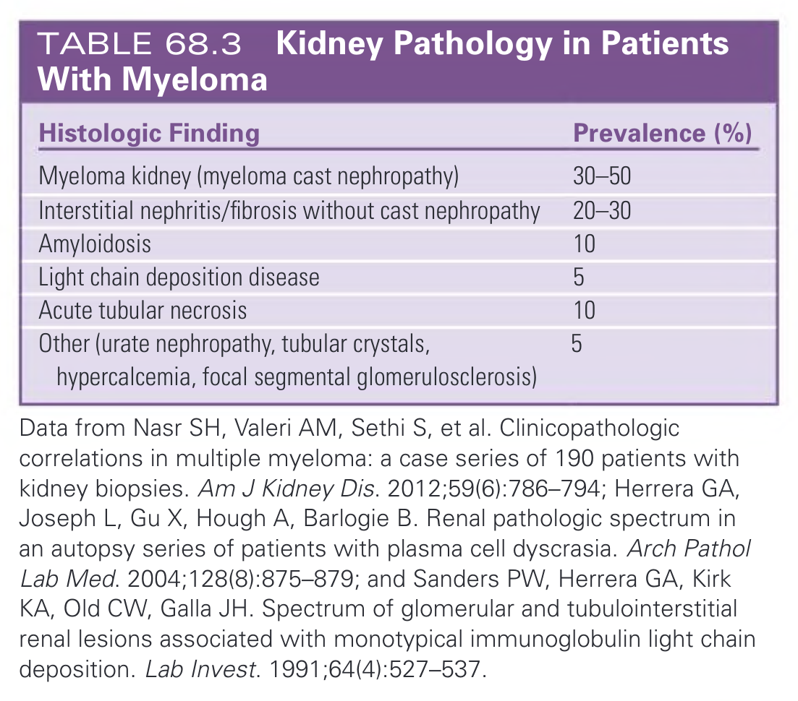
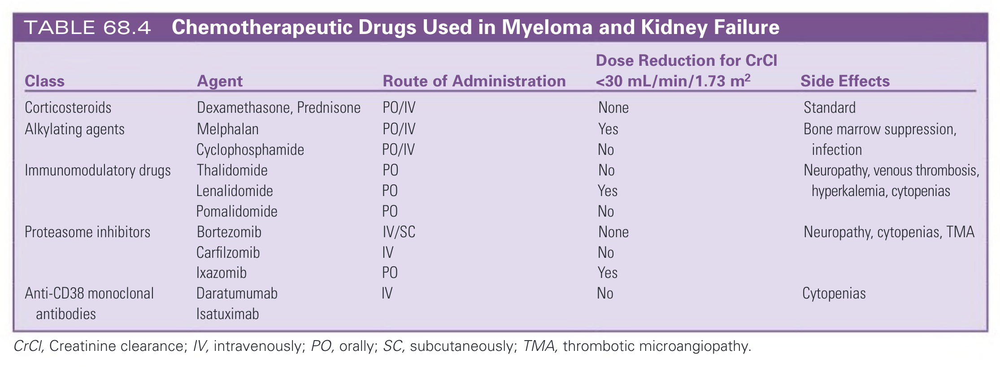
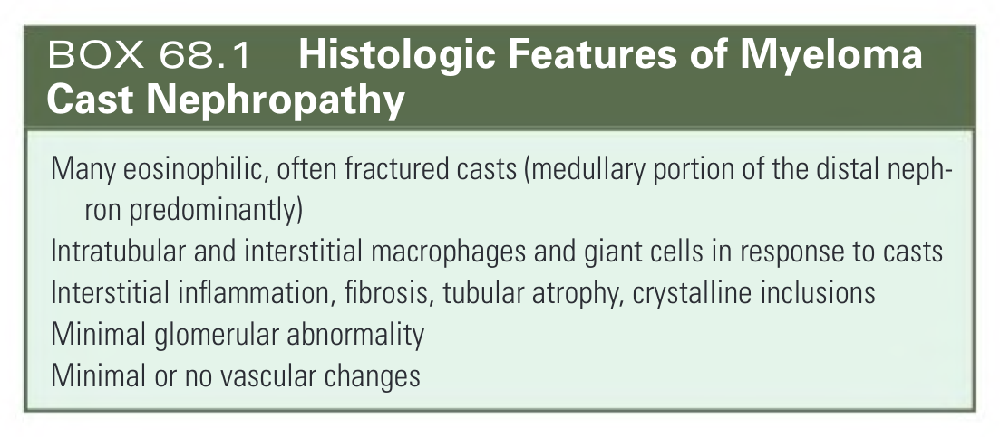

# 068. Myeloma and the Kidney - Figures and Tables Index

This document lists all figures, tables and boxes extracted from `068. Myeloma and the Kidney.pdf`.

## Table of Contents
- [Figures](#figures)
- [Tables](#tables)
- [Boxes](#boxes)

---

## Figures

### Fig_68_1



Fig. 68.1 Uptake of Light Chains by Proximal Tubular Cells. Kidney biopsy from a patient excreting κ light chains. Immunoperoxidase staining (brown color) showing κ light chains along the brush border and in the cytoplasm of proximal tubular cells.

---

### Fig_68_2



Fig. 68.2 Kidney Injury Caused by Light Chains. Sites (white boxes) where light chains injure the tubule. In the proximal tubule, there is direct tubular cytotoxicity. In the distal tubule, there is cast injury.

---

### Fig_68_3



Fig. 68.3 Myeloma Cast Nephropathy. (A) Myeloma kidney. Many dilated tubules are obstructed by densely eosinophilic hard casts, with giant cell reaction and inflammatory cell infiltrates. There is also vacuolation and degeneration of tubules (hemoxylin and eosin stain; ×160). (B) Light chain deposition along tubular basement membrane (TBM) in myeloma kidney without casts. There is marked thickening of the TBM by periodic acid–Schiff (PAS)-positive deposits and interstitial fibrosis and mild chronic inflammation (PAS stain; ×160). (C) Light chain deposition along TBM. Strong linear deposition of κ light chain in the thickened TBM (direct immunofluorescence anti-κ light chain; ×160). (Courtesy R. Sinniah, Perth, Australia.)

---

### Fig_68_4



Fig. 68.4 Serum free light chain ratio and values in normal individuals, patients with reduced glomerular filtration rate (GFR) and light chain myeloma. FLC, free light chain; IFE, Immunofixation; LCMM, light chain multiple myeloma; SEP, serum protein electrophoresis.

---

### Fig_68_5



Fig. 68.5 Management Pathways for Acute Kidney Injury and Multiple Myeloma. BJ, Bence Jones; CAPD, continuous ambulatory peritoneal dialysis; CT, computed tomography; ESKD, end-stage kidney disease; FLC, free light chain; HD, hemodialysis; IV, intravenous; LC, light chain; MCN, myeloma cast nephropathy; MGRS, monoclonal gammopathy of renal significance; NSAIDs, nonsteroidal antiinflammatory drugs.

---

## Tables

### Table_68_1

#### Table Image



#### Table Data (CSV: [Table_68_1.csv](Table_68_1.csv))

```markdown
| | Cause | Manifestation |
| :--- | :--- | :--- |
| **Prerenal** | | |
| Volume depletion | Hypercalcemia<br>Gastrointestinal losses (nausea and vomiting)<br>Sepsis | Polyuria and polydipsia<br>Hypotension<br>Fever |
| Hemodynamic | Hemodynamic effects of NSAIDs | Oliguria, hyperkalemia |
| Other | Hyperviscosity (IgA, IgG3)<br>Hyperuricemia | Mental state alterations<br>Tumor lysis |
| **Intrarenal** | Proximal tubular injury from light chains, uric acid, distal tubular injury from casts<br>Glomerular disease (LCDD, amyloid) | Fanconi syndrome<br>Tubular proteinuria<br>Crystalluria<br>Nephrotic proteinuria<br>Hematuria, active sediment |
| **Postrenal** | Calculi | Colic |
*Ig, Immunoglobulin; LCDD, light chain deposition disease; NSAIDs, nonsteroidal antiinflammatory drugs.*
```

TABLE 68.1 Etiology of Kidney Injury and Clinical Manifestations in Myeloma

---

### Table_68_2

#### Table Image



#### Table Data (CSV: [Table_68_2.csv](Table_68_2.csv))

```markdown
| | Myeloma Kidney | Other MIDDs |
| :--- | :--- | :--- |
| **Proteinuria** | <3 g/L | >3 g/L |
| **Hematuria** | Rare | LCDD, occasional<br>Amyloidosis, rare |
| **Hypercalcemia** | Common | Absent |
| **Hypertension** | Uncommon | LCDD, common<br>Amyloidosis, uncommon |
| **Cytopenias** | Anemia very common<br>Leukopenia and<br>thrombocytopenia, occasional | Uncommon |
| **Immunoparesis^a** | Very common | Uncommon |
| **Lytic bone lesions** | Very common | Absent |
| **Reduced GFR** | Common | Common |
| **Associated whole immunoglobulin** | IgA, IgD, IgG | None |
| **Type of light chain** | Either | Amyloid λ > κ<br>LCDD κ > λ |
| **Serum light chain elevation** | >500 mg/L | <500 mg/L |
*^aImmunoparesis, reduction in noninvolved immunoglobulin classes. Ig, Immunoglobulin; LCDD, light chain deposition disease; MIDD, monoclonal immunoglobulin deposition disease; GFR, glomerular filtration rate.*
```

TABLE 68.2 Differentiating Features of Myeloma Kidney and Other Monoclonal Immune Deposition Diseases

---

### Table_68_3

#### Table Image



#### Table Data (CSV: [Table_68_3.csv](Table_68_3.csv))

```markdown
| Histologic Finding | Prevalence (%) |
| :--- | :--- |
| Myeloma kidney (myeloma cast nephropathy) | 30–50 |
| Interstitial nephritis/fibrosis without cast nephropathy | 20–30 |
| Amyloidosis | 10 |
| Light chain deposition disease | 5 |
| Acute tubular necrosis | 10 |
| Other (urate nephropathy, tubular crystals, hypercalcemia, focal segmental glomerulosclerosis) | 5 |
*Data from Nasr SH, Valeri AM, Sethi S, et al. Clinicopathologic correlations in multiple myeloma: a case series of 190 patients with kidney biopsies. Am J Kidney Dis. 2012;59(6):786-794; Herrera GA, Joseph L, Gu X, Hough A, Barlogie B. Renal pathologic spectrum in an autopsy series of patients with plasma cell dyscrasia. Arch Pathol Lab Med. 2004;128(8):875-879; and Sanders PW, Herrera GA, Kirk KA, Old CW, Galla JH. Spectrum of glomerular and tubulointerstitial renal lesions associated with monotypical immunoglobulin light chain deposition. Lab Invest. 1991;64(4):527-537.*
```

TABLE 68.3 Kidney Pathology in Patients With Myeloma

---

### Table_68_4

#### Table Image



#### Table Data (CSV: [Table_68_4.csv](Table_68_4.csv))

```markdown
| Class | Agent | Route of Administration | Dose Reduction for CrCl <30 mL/min/1.73 m² | Side Effects |
| :--- | :--- | :--- | :--- | :--- |
| Corticosteroids | Dexamethasone, Prednisone | PO/IV | None | Standard |
| Alkylating agents | Melphalan | PO/IV | Yes | Bone marrow suppression, infection |
| | Cyclophosphamide | PO/IV | No | |
| Immunomodulatory drugs | Thalidomide | PO | No | Neuropathy, venous thrombosis, hyperkalemia, cytopenias |
| | Lenalidomide | PO | Yes | |
| | Pomalidomide | PO | No | |
| Proteasome inhibitors | Bortezomib | IV/SC | None | Neuropathy, cytopenias, TMA |
| | Carfilzomib | IV | No | |
| | Ixazomib | PO | Yes | |
| Anti-CD38 monoclonal antibodies | Daratumumab | IV | No | Cytopenias |
| | Isatuximab | | | |
*CrCl, Creatinine clearance; IV, intravenously; PO, orally; SC, subcutaneously; TMA, thrombotic microangiopathy.*
```

TABLE 68.4 Chemotherapeutic Drugs Used in Myeloma and Kidney Failure

---

## Boxes

### Box_68_1



#### Box Text

```markdown
Many eosinophilic, often fractured casts (medullary portion of the distal nephron predominantly)
Intratubular and interstitial macrophages and giant cells in response to casts
Interstitial inflammation, fibrosis, tubular atrophy, crystalline inclusions
Minimal glomerular abnormality
Minimal or no vascular changes
```

BOX 68.1 Histologic Features of Myeloma Cast Nephropathy

---
