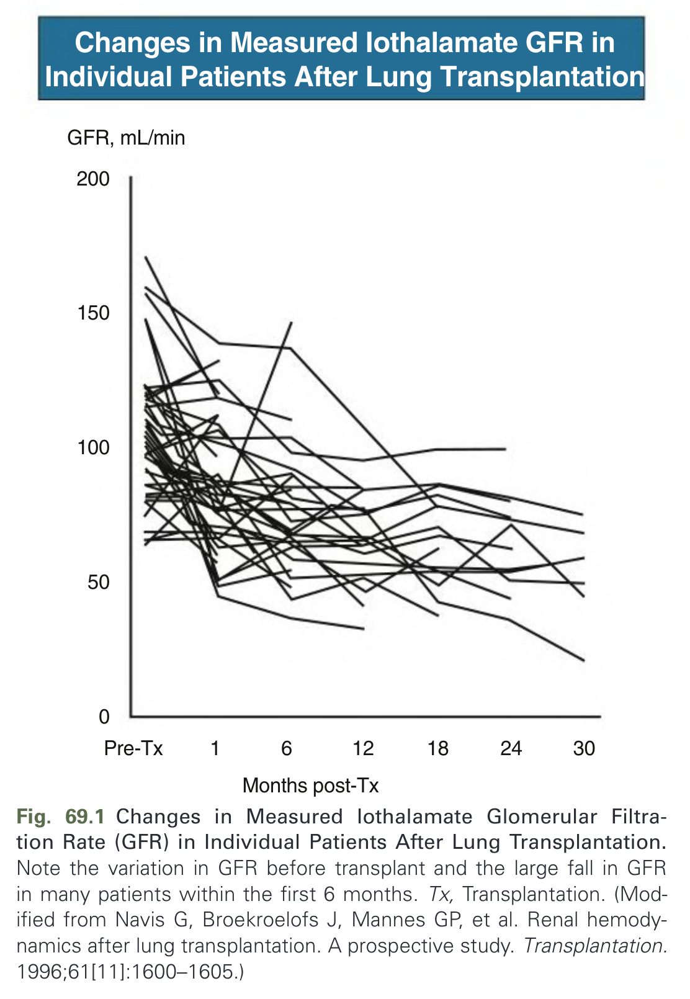
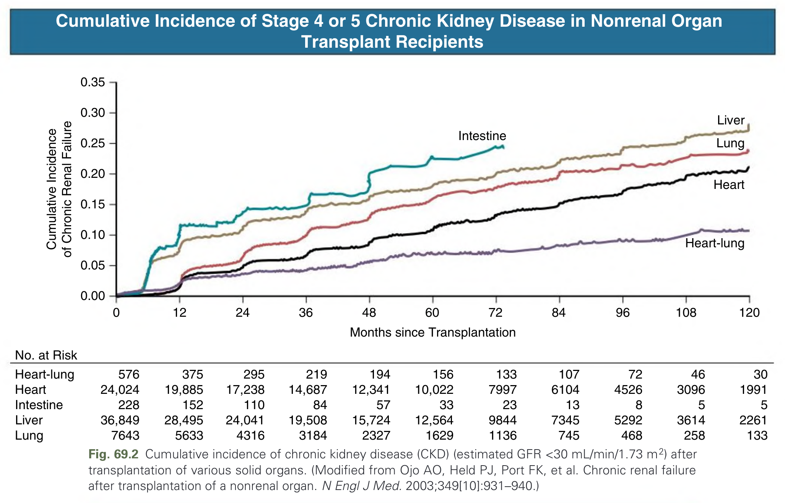
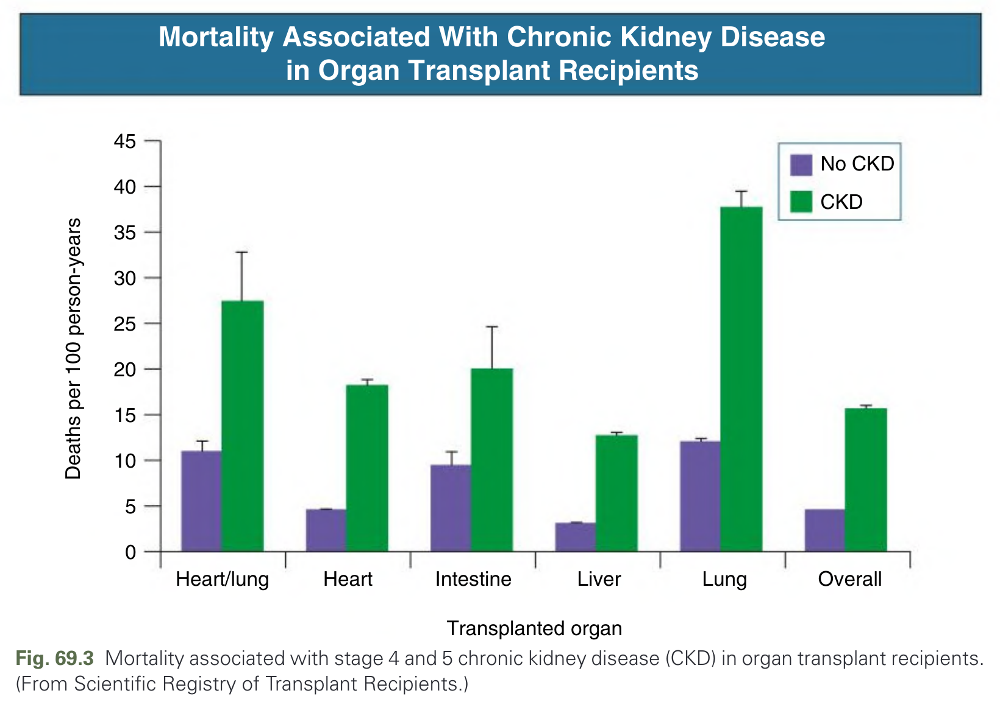
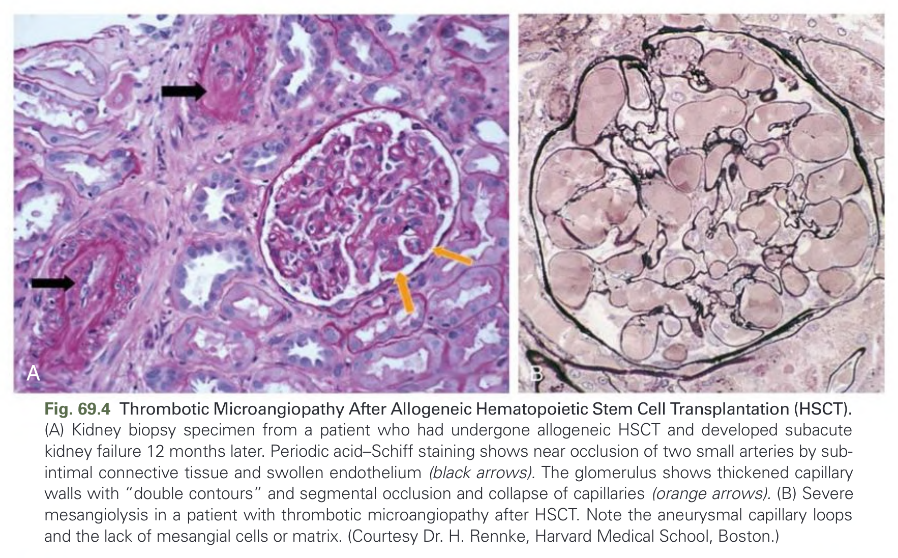
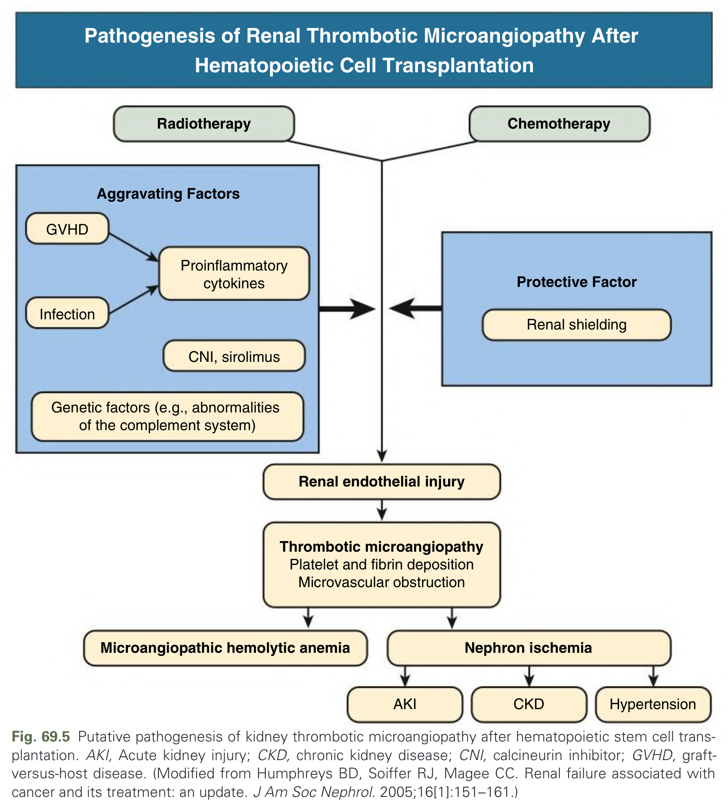
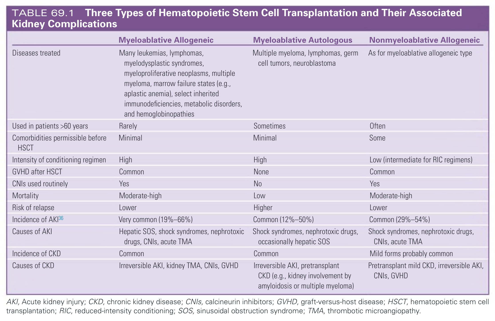
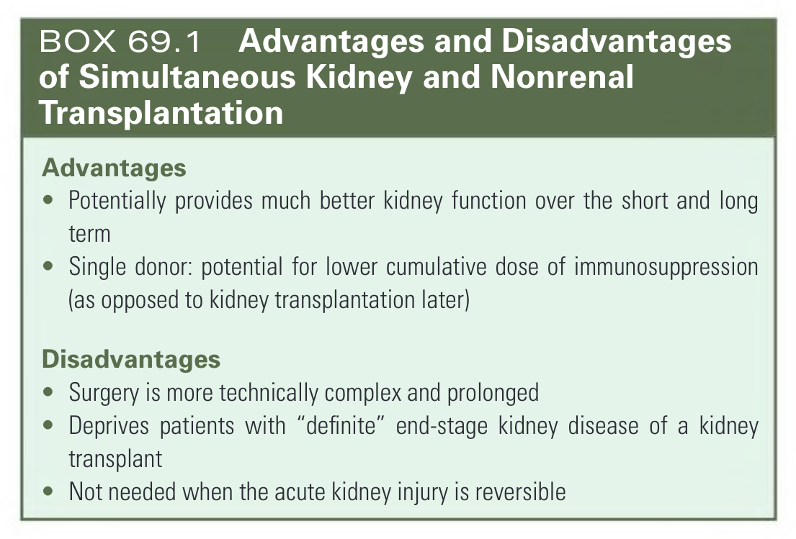
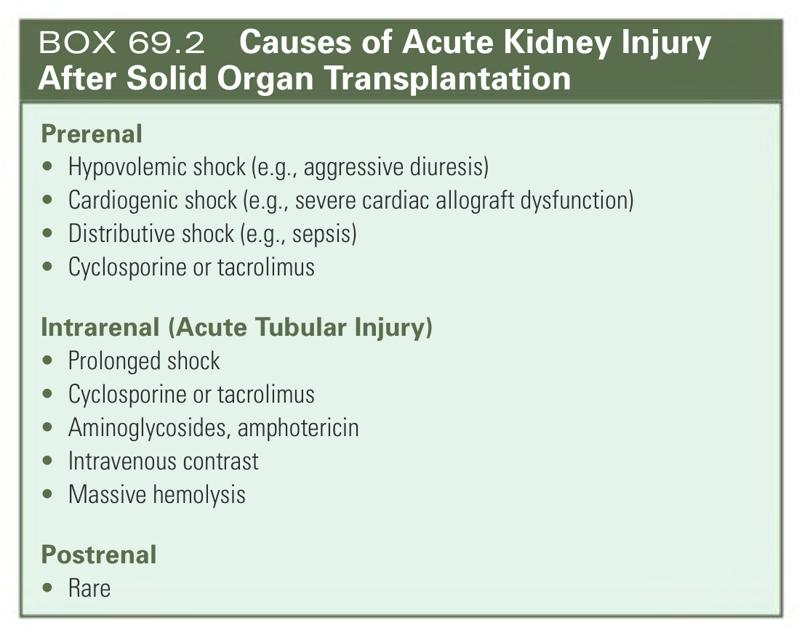
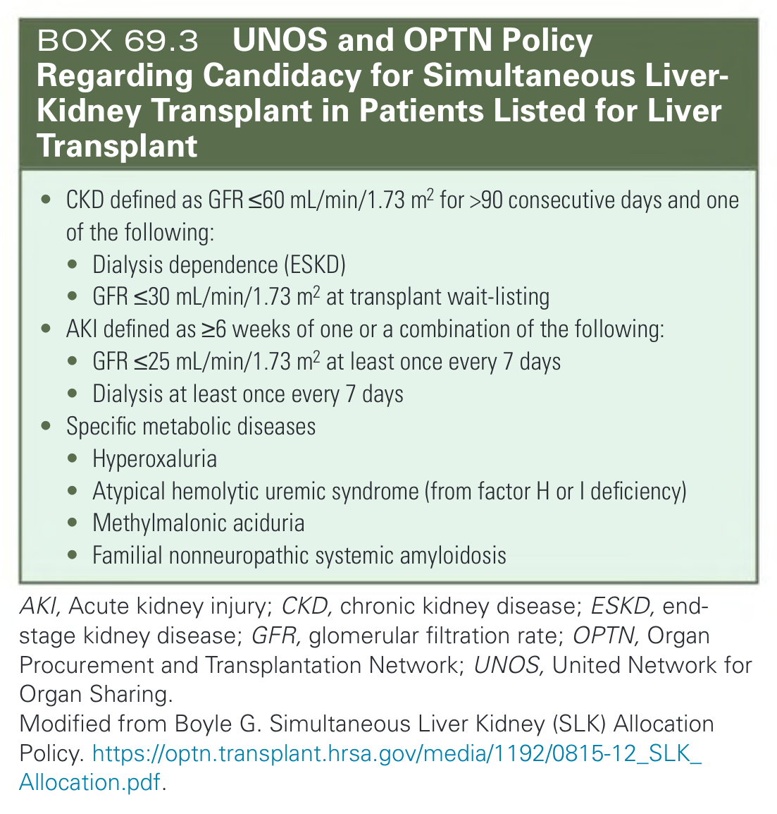
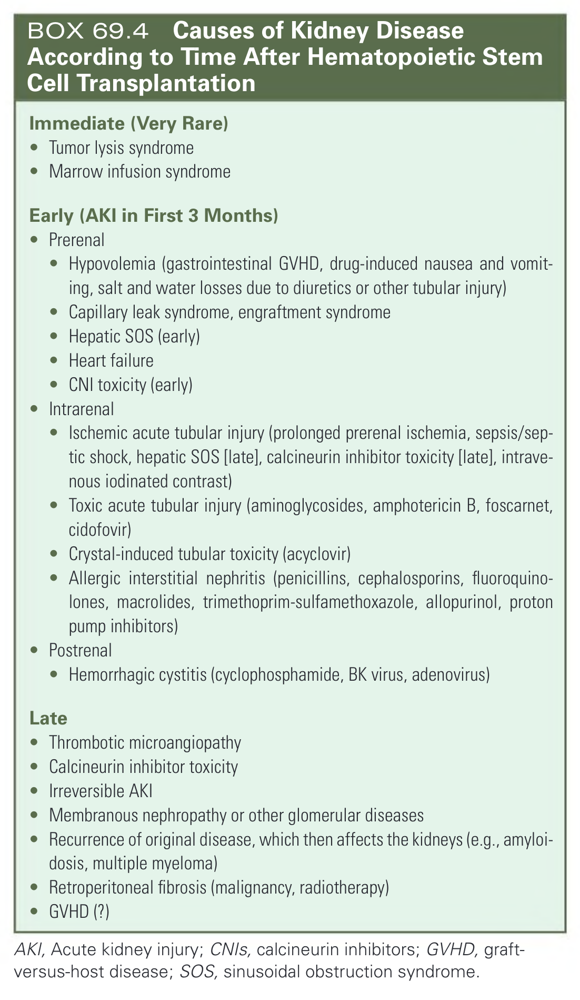

# 069. Kidney Disease in Liver, Cardiac, Lung, and Hematopoietic Stem Cell Transplantation - Figures and Tables Index

This document lists all figures, tables and boxes extracted from `069. Kidney Disease in Liver, Cardiac, Lung, and Hematopoietic Stem Cell Transplantation.pdf`.

## Table of Contents
- [Figures](#figures)
- [Tables](#tables)
- [Boxes](#boxes)

---

## Figures

### Fig_69_1



Fig. 69.1 Changes in Measured Iothalamate Glomerular Filtration Rate (GFR) in Individual Patients After Lung Transplantation. Note the variation in GFR before transplant and the large fall in GFR in many patients within the first 6 months. Tx, Transplantation. (Modified from Navis G, Broekroelofs J, Mannes GP, et al. Renal hemodynamics after lung transplantation. A prospective study. Transplantation. 1996;61[11]:1600–1605.)

---

### Fig_69_2



Fig. 69.2 Cumulative incidence of chronic kidney disease (CKD) (estimated GFR <30 mL/min/1.73 m2) after transplantation of various solid organs. (Modified from Ojo AO, Held PJ, Port FK, et al. Chronic renal failure after transplantation of a nonrenal organ. N Engl J Med. 2003;349[10]:931–940.)

---

### Fig_69_3



Fig. 69.3 Mortality associated with stage 4 and 5 chronic kidney disease (CKD) in organ transplant recipients. (From Scientific Registry of Transplant Recipients.)

---

### Fig_69_4



Fig. 69.4 Thrombotic Microangiopathy After Allogeneic Hematopoietic Stem Cell Transplantation (HSCT). (A) Kidney biopsy specimen from a patient who had undergone allogeneic HSCT and developed subacute kidney failure 12 months later. Periodic acid–Schiff staining shows near occlusion of two small arteries by subintimal connective tissue and swollen endothelium (black arrows). The glomerulus shows thickened capillary walls with “double contours” and segmental occlusion and collapse of capillaries (orange arrows). (B) Severe mesangiolysis in a patient with thrombotic microangiopathy after HSCT. Note the aneurysmal capillary loops and the lack of mesangial cells or matrix. (Courtesy Dr. H. Rennke, Harvard Medical School, Boston.)

---

### Fig_69_5



Fig. 69.5 Putative pathogenesis of kidney thrombotic microangiopathy after hematopoietic stem cell transplantation. AKI, Acute kidney injury; CKD, chronic kidney disease; CNI, calcineurin inhibitor; GVHD, graft-versus-host disease. (Modified from Humphreys BD, Soiffer RJ, Magee CC. Renal failure associated with cancer and its treatment: an update. J Am Soc Nephrol. 2005;16[1]:151–161.)

---

## Tables

### Table_69_1

#### Table Image



#### Table Data (CSV: [Table_69_1.csv](Table_69_1.csv))

```markdown
| | Myeloablative Allogeneic | Myeloablative Autologous | Nonmyeloablative Allogeneic |
| :--- | :--- | :--- | :--- |
| **Diseases treated** | Many leukemias, lymphomas, myelodysplastic syndromes, myeloproliferative neoplasms, multiple myeloma, marrow failure states (e.g., aplastic anemia), select inherited immunodeficiencies, metabolic disorders, and hemoglobinopathies | Multiple myeloma, lymphomas, germ cell tumors, neuroblastoma | As for myeloablative allogeneic type |
| **Used in patients >60 years** | Rarely | Sometimes | Often |
| **Comorbidities permissible before HSCT** | Minimal | Minimal | Some |
| **Intensity of conditioning regimen** | High | High | Low (intermediate for RIC regimens) |
| **GVHD after HSCT** | Common | None | Common |
| **CNIs used routinely** | Yes | No | Yes |
| **Mortality** | Moderate-high | Low | Moderate-high |
| **Risk of relapse** | Lower | Higher | Lower |
| **Incidence of AKI** | Very common (19%-66%) | Common (12%-50%) | Common (29%-54%) |
| **Causes of AKI** | Hepatic SOS, shock syndromes, nephrotoxic drugs, CNIs, acute TMA | Shock syndromes, nephrotoxic drugs, occasionally hepatic SOS | Shock syndromes, nephrotoxic drugs, CNIs, acute TMA |
| **Incidence of CKD** | Common | Common | Mild forms probably common |
| **Causes of CKD** | Irreversible AKI, kidney TMA, CNIs, GVHD | Irreversible AKI, pretransplant CKD (e.g., kidney involvement by amyloidosis or multiple myeloma) | Pretransplant mild CKD, irreversible AKI, CNIs, GVHD |

AKI, Acute kidney injury; CKD, chronic kidney disease; CNIs, calcineurin inhibitors; GVHD, graft-versus-host disease; HSCT, hematopoietic stem cell transplantation; RIC, reduced-intensity conditioning; SOS, sinusoidal obstruction syndrome; TMA, thrombotic microangiopathy.
```

TABLE 69.1 Three Types of Hematopoietic Stem Cell Transplantation and Their Associated Kidney Complications

---

## Boxes

### Box_69_1



#### Box Text

```markdown
**Advantages**
* Potentially provides much better kidney function over the short and long term
* Single donor: potential for lower cumulative dose of immunosuppression (as opposed to kidney transplantation later)

**Disadvantages**
* Surgery is more technically complex and prolonged
* Deprives patients with "definite" end-stage kidney disease of a kidney transplant
* Not needed when the acute kidney injury is reversible
```

BOX 69.1 Advantages and Disadvantages of Simultaneous Kidney and Nonrenal Transplantation

---

### Box_69_2



#### Box Text

```markdown
**Prerenal**
* Hypovolemic shock (e.g., aggressive diuresis)
* Cardiogenic shock (e.g., severe cardiac allograft dysfunction)
* Distributive shock (e.g., sepsis)
* Cyclosporine or tacrolimus

**Intrarenal (Acute Tubular Injury)**
* Prolonged shock
* Cyclosporine or tacrolimus
* Aminoglycosides, amphotericin
* Intravenous contrast
* Massive hemolysis

**Postrenal**
* Rare
```

BOX 69.2 Causes of Acute Kidney Injury After Solid Organ Transplantation

---

### Box_69_3



#### Box Text

```markdown
* CKD defined as GFR ≤60 mL/min/1.73 m² for >90 consecutive days and one of the following:
    * Dialysis dependence (ESKD)
    * GFR ≤30 mL/min/1.73 m² at transplant wait-listing
* AKI defined as ≥6 weeks of one or a combination of the following:
    * GFR ≤25 mL/min/1.73 m² at least once every 7 days
    * Dialysis at least once every 7 days
* Specific metabolic diseases
    * Hyperoxaluria
    * Atypical hemolytic uremic syndrome (from factor H or I deficiency)
    * Methylmalonic aciduria
    * Familial nonneuropathic systemic amyloidosis

AKI, Acute kidney injury; CKD, chronic kidney disease; ESKD, end-stage kidney disease; GFR, glomerular filtration rate; OPTN, Organ Procurement and Transplantation Network; UNOS, United Network for Organ Sharing.
Modified from Boyle G. Simultaneous Liver Kidney (SLK) Allocation Policy. https://optn.transplant.hrsa.gov/media/1192/0815-12_SLK_Allocation.pdf.
```

BOX 69.3 UNOS and OPTN Policy Regarding Candidacy for Simultaneous Liver-Kidney Transplant in Patients Listed for Liver Transplant

---

### Box_69_4



#### Box Text

```markdown
**Immediate (Very Rare)**
* Tumor lysis syndrome
* Marrow infusion syndrome

**Early (AKI in First 3 Months)**
* **Prerenal**
    * Hypovolemia (gastrointestinal GVHD, drug-induced nausea and vomiting, salt and water losses due to diuretics or other tubular injury)
    * Capillary leak syndrome, engraftment syndrome
    * Hepatic SOS (early)
    * Heart failure
    * CNI toxicity (early)
* **Intrarenal**
    * Ischemic acute tubular injury (prolonged prerenal ischemia, sepsis/septic shock, hepatic SOS [late], calcineurin inhibitor toxicity [late], intravenous iodinated contrast)
    * Toxic acute tubular injury (aminoglycosides, amphotericin B, foscarnet, cidofovir)
    * Crystal-induced tubular toxicity (acyclovir)
    * Allergic interstitial nephritis (penicillins, cephalosporins, fluoroquinolones, macrolides, trimethoprim-sulfamethoxazole, allopurinol, proton pump inhibitors)
* **Postrenal**
    * Hemorrhagic cystitis (cyclophosphamide, BK virus, adenovirus)

**Late**
* Thrombotic microangiopathy
* Calcineurin inhibitor toxicity
* Irreversible AKI
* Membranous nephropathy or other glomerular diseases
* Recurrence of original disease, which then affects the kidneys (e.g., amyloidosis, multiple myeloma)
* Retroperitoneal fibrosis (malignancy, radiotherapy)
* GVHD (?)

AKI, Acute kidney injury; CNIs, calcineurin inhibitors; GVHD, graft-versus-host disease; SOS, sinusoidal obstruction syndrome.
```

BOX 69.4 Causes of Kidney Disease According to Time After Hematopoietic Stem Cell Transplantation

---
