# 070. Pathophysiology and Etiology of Acute Kidney Injury - Figures and Tables Index

This document lists all figures, tables and boxes extracted from `070. Pathophysiology and Etiology of Acute Kidney Injury.pdf`.

## Table of Contents
- [Figures](#figures)
- [Tables](#tables)
- [Boxes](#boxes)

---

## Figures

### Fig_70_1

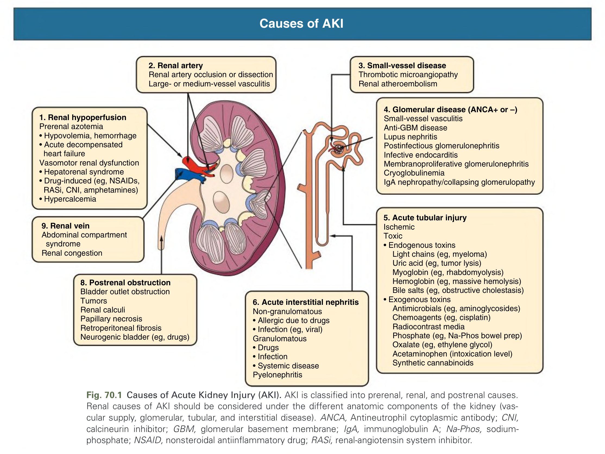

Fig. 70.1 Causes of Acute Kidney Injury (AKI). AKI is classified into prerenal, renal, and postrenal causes. Renal causes of AKI should be considered under the different anatomic components of the kidney (vascular supply, glomerular, tubular, and interstitial disease). ANCA, Antineutrophil cytoplasmic antibody; CNI, calcineurin inhibitor; GBM, glomerular basement membrane; IgA, immunoglobulin A; Na-Phos, sodium-phosphate; NSAID, nonsteroidal antiinflammatory drug; RASi, renal-angiotensin system inhibitor.

---

### Fig_70_2

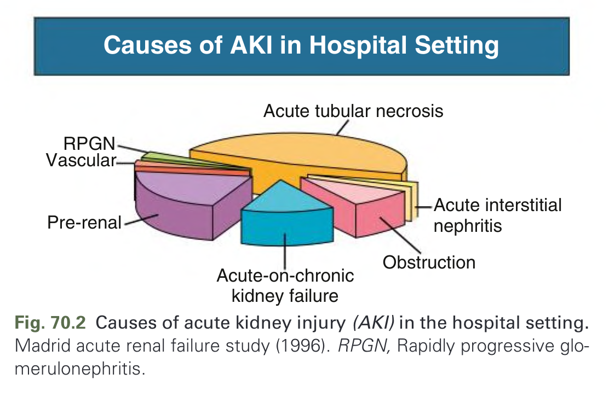

Fig. 70.2 Causes of acute kidney injury (AKI) in the hospital setting. Madrid acute renal failure study (1996). RPGN, Rapidly progressive glomerulonephritis.

---

### Fig_70_3

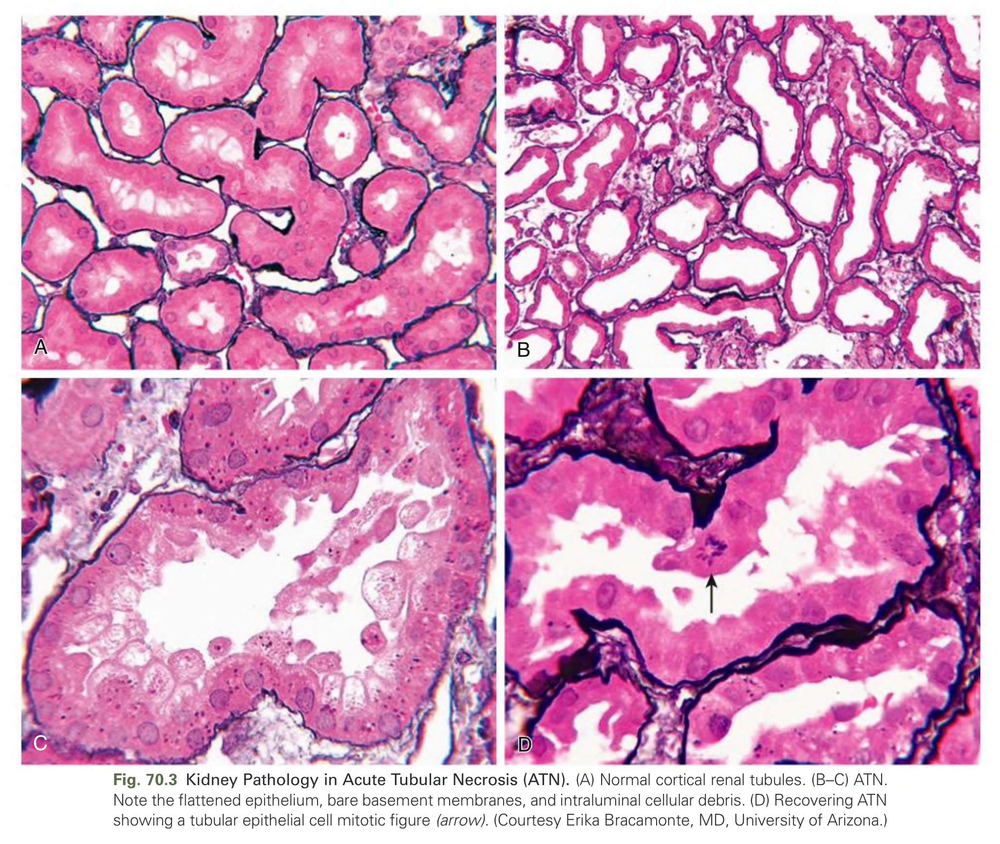

Fig. 70.3 Kidney Pathology in Acute Tubular Necrosis (ATN). (A) Normal cortical renal tubules. (B–C) ATN. Note the flattened epithelium, bare basement membranes, and intraluminal cellular debris. (D) Recovering ATN showing a tubular epithelial cell mitotic figure (arrow). (Courtesy Erika Bracamonte, MD, University of Arizona.)

---

### Fig_70_4

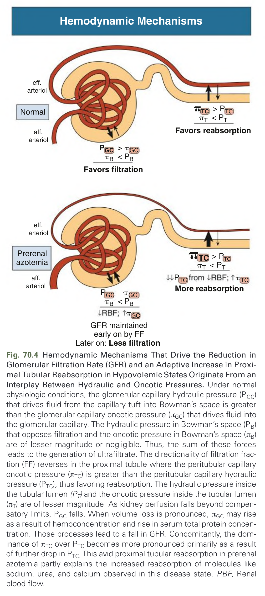

Fig. 70.4 Hemodynamic Mechanisms That Drive the Reduction in Glomerular Filtration Rate (GFR) and an Adaptive Increase in Proximal Tubular Reabsorption in Hypovolemic States Originate From an Interplay Between Hydraulic and Oncotic Pressures. Under normal physiologic conditions, the glomerular capillary hydraulic pressure (PGC) that drives fluid from the capillary tuft into Bowman’s space is greater than the glomerular capillary oncotic pressure (πGC) that drives fluid into the glomerular capillary. The hydraulic pressure in Bowman’s space (PB) that opposes filtration and the oncotic pressure in Bowman’s space (πB) are of lesser magnitude or negligible. Thus, the sum of these forces leads to the generation of ultrafiltrate. The directionality of filtration fraction (FF) reverses in the proximal tubule where the peritubular capillary oncotic pressure (πTC) is greater than the peritubular capillary hydraulic pressure (PTC), thus favoring reabsorption. The hydraulic pressure inside the tubular lumen (PT) and the oncotic pressure inside the tubular lumen (πT) are of lesser magnitude. As kidney perfusion falls beyond compensatory limits, PGC falls. When volume loss is pronounced, πGC may rise as a result of hemoconcentration and rise in serum total protein concentration. Those processes lead to a fall in GFR. Concomitantly, the dominance of πTC over PTC becomes more pronounced primarily as a result of further drop in PTC. This avid proximal tubular reabsorption in prerenal azotemia partly explains the increased reabsorption of molecules like sodium, urea, and calcium observed in this disease state. RBF, Renal blood flow.

---

### Fig_70_5

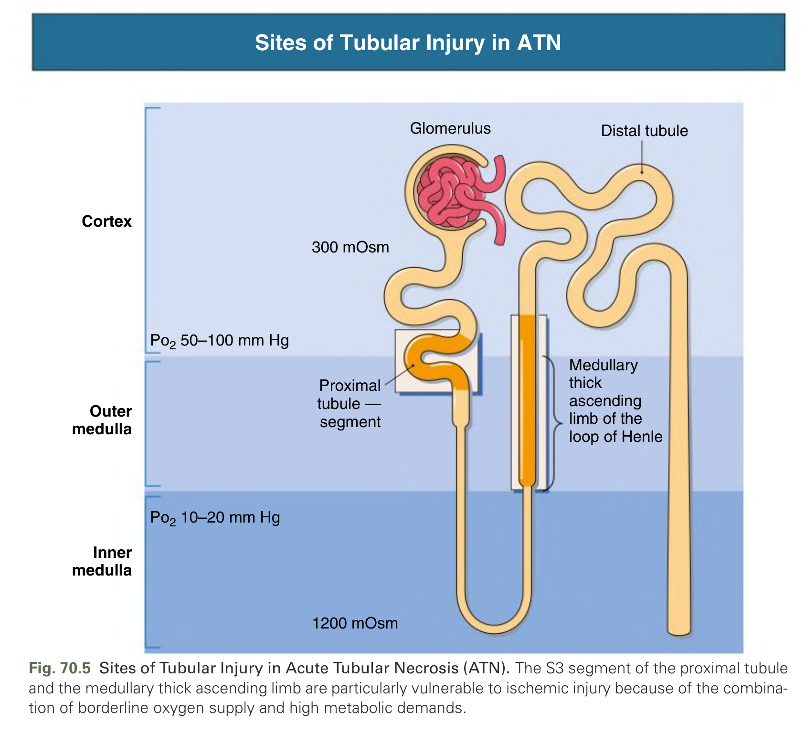

Fig. 70.5 Sites of Tubular Injury in Acute Tubular Necrosis (ATN). The S3 segment of the proximal tubule and the medullary thick ascending limb are particularly vulnerable to ischemic injury because of the combination of borderline oxygen supply and high metabolic demands.

---

### Fig_70_6

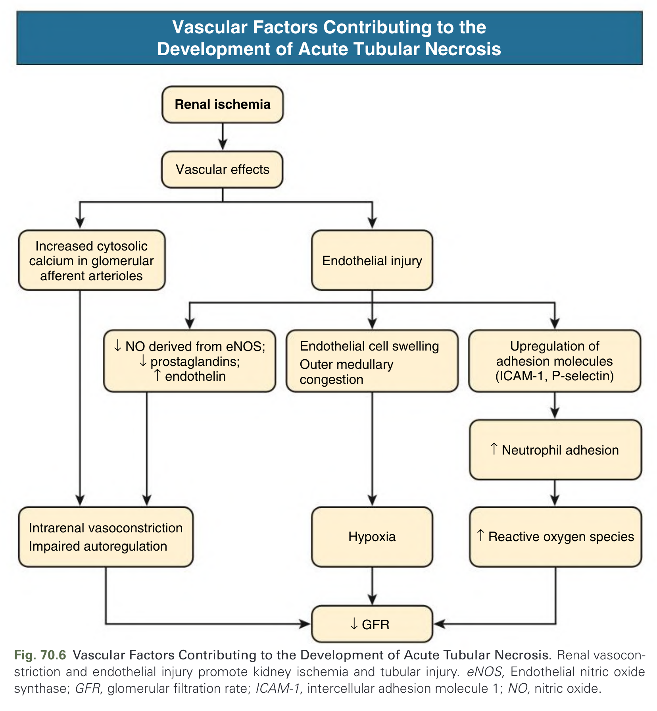

Fig. 70.6 Vascular Factors Contributing to the Development of Acute Tubular Necrosis. Renal vasoconstriction and endothelial injury promote kidney ischemia and tubular injury. eNOS, Endothelial nitric oxide synthase; GFR, glomerular filtration rate; ICAM-1, intercellular adhesion molecule 1; NO, nitric oxide.

---

### Fig_70_7

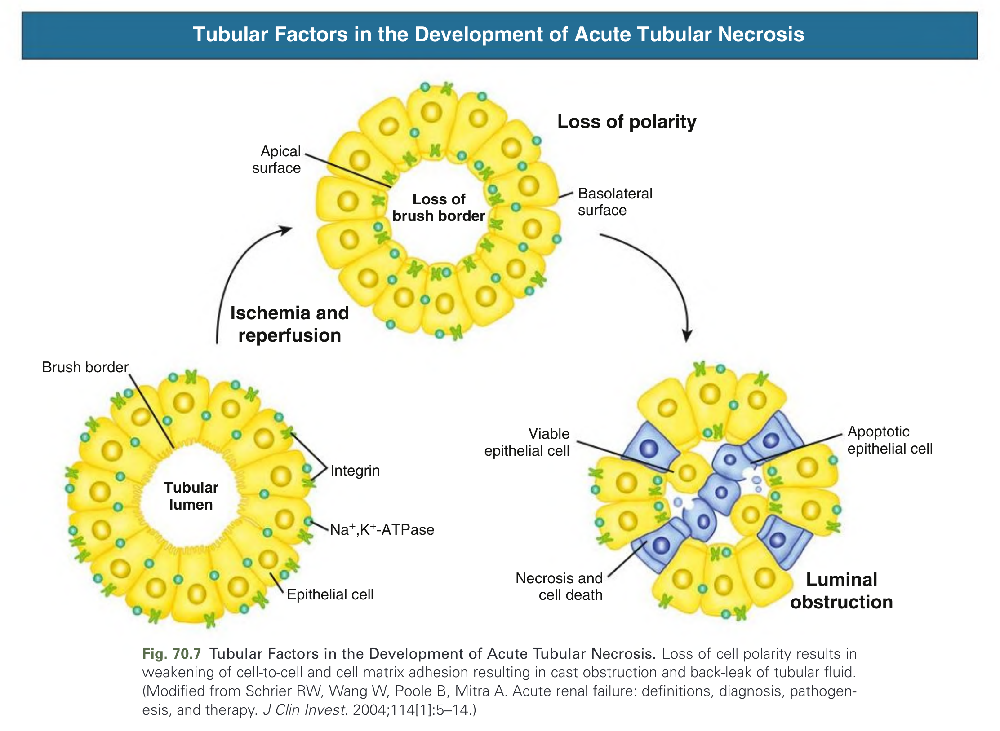

Fig. 70.7 Tubular Factors in the Development of Acute Tubular Necrosis. Loss of cell polarity results in weakening of cell-to-cell and cell matrix adhesion resulting in cast obstruction and back-leak of tubular fluid. (Modified from Schrier RW, Wang W, Poole B, Mitra A. Acute renal failure: definitions, diagnosis, pathogen-esis, and therapy. J Clin Invest. 2004;114[1]:5–14.)

---

### Fig_70_8

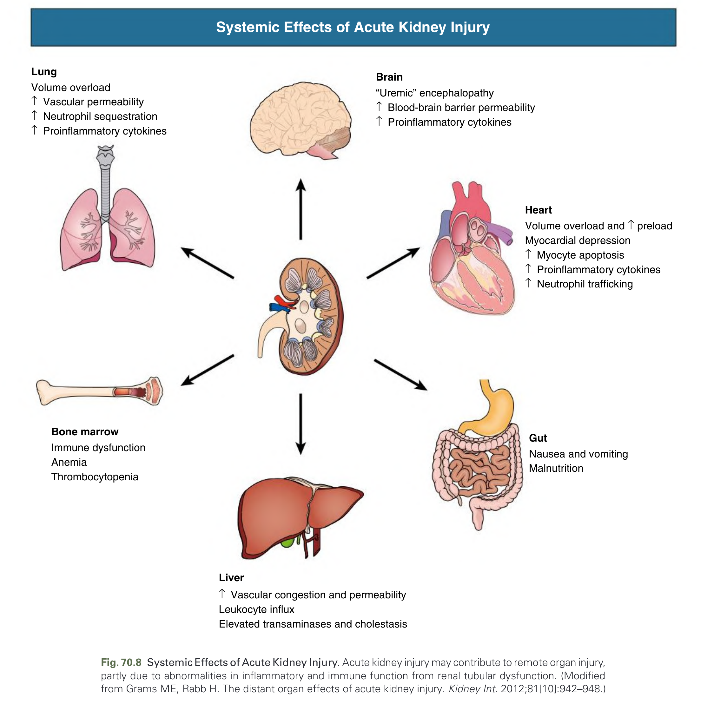

Fig. 70.8 Systemic Effects of Acute Kidney Injury. Acute kidney injury may contribute to remote organ injury, partly due to abnormalities in inflammatory and immune function from renal tubular dysfunction. (Modified from Grams ME, Rabb H. The distant organ effects of acute kidney injury. Kidney Int. 2012;81[10]:942–948.)

---

### Fig_70_9

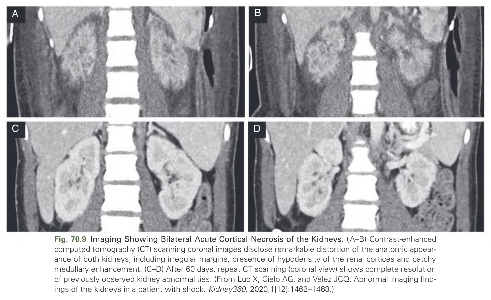

Fig. 70.9 Imaging Showing Bilateral Acute Cortical Necrosis of the Kidneys. (A–B) Contrast-enhanced computed tomography (CT) scanning coronal images disclose remarkable distortion of the anatomic appearance of both kidneys, including irregular margins, presence of hypodensity of the renal cortices and patchy medullary enhancement. (C–D) After 60 days, repeat CT scanning (coronal view) shows complete resolution of previously observed kidney abnormalities. (From Luo X, Cielo AG, and Velez JCQ. Abnormal imaging findings of the kidneys in a patient with shock. Kidney360. 2020;1[12]:1462–1463.)

---

### Fig_70_10

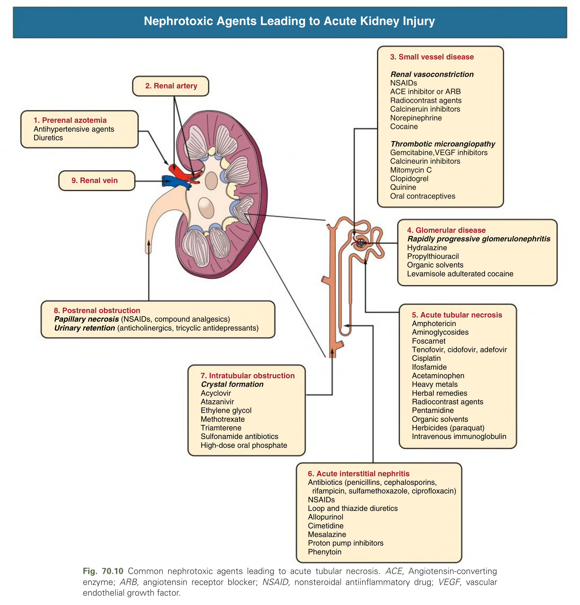

Fig. 70.10 Common nephrotoxic agents leading to acute tubular necrosis. ACE, Angiotensin-converting enzyme; ARB, angiotensin receptor blocker; NSAID, nonsteroidal antiinflammatory drug; VEGF, vascular endothelial growth factor.

---

### Fig_70_11

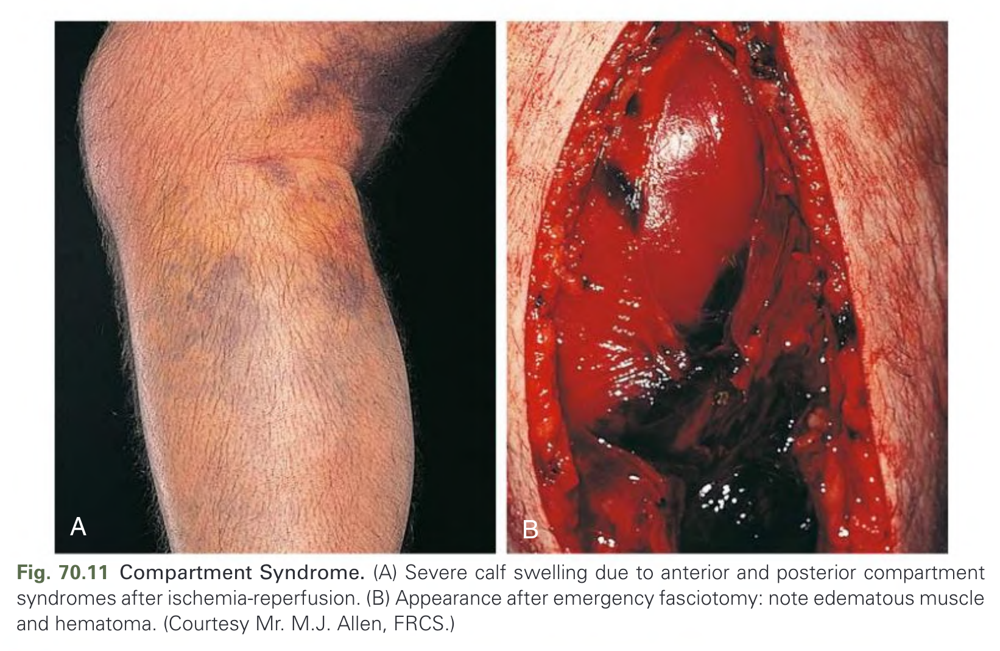

Fig. 70.11 Compartment Syndrome. (A) Severe calf swelling due to anterior and posterior compartment syndromes after ischemia-reperfusion. (B) Appearance after emergency fasciotomy: note edematous muscle and hematoma. (Courtesy Mr. M.J. Allen, FRCS.)

---

### Fig_70_12

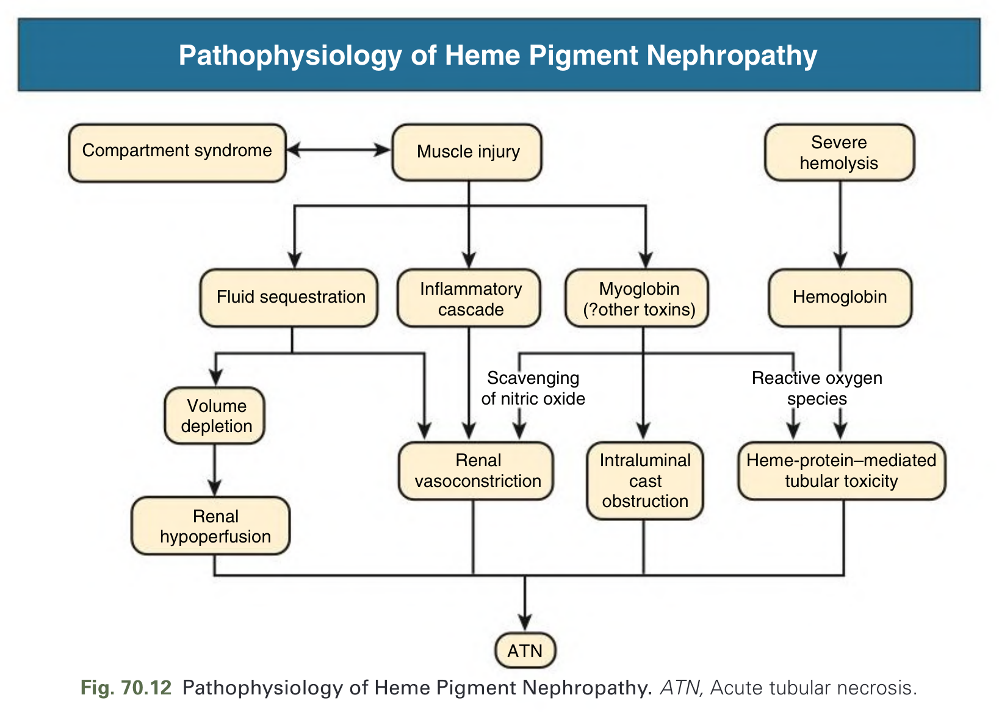

Fig. 70.12 Pathophysiology of Heme Pigment Nephropathy. ATN, Acute tubular necrosis.

---

## Tables

### Table_70_1

#### Table Image

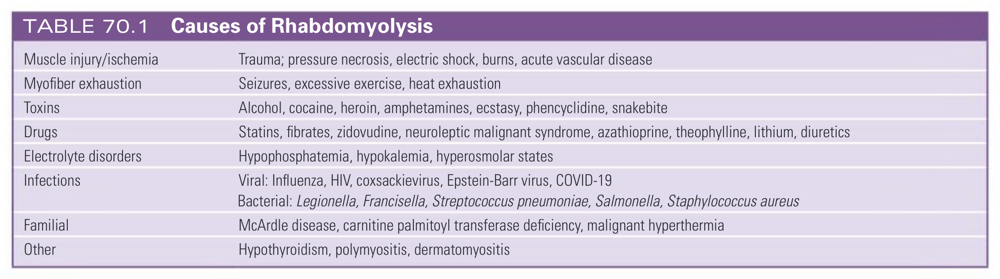

#### Table Data (CSV: [Table_70_1.csv](Table_70_1.csv))

```markdown
| | |
| :--- | :--- |
| **Muscle injury/ischemia** | Trauma; pressure necrosis, electric shock, burns, acute vascular disease |
| **Myofiber exhaustion** | Seizures, excessive exercise, heat exhaustion |
| **Toxins** | Alcohol, cocaine, heroin, amphetamines, ecstasy, phencyclidine, snakebite |
| **Drugs** | Statins, fibrates, zidovudine, neuroleptic malignant syndrome, azathioprine, theophylline, lithium, diuretics |
| **Electrolyte disorders** | Hypophosphatemia, hypokalemia, hyperosmolar states |
| **Infections** | Viral: Influenza, HIV, coxsackievirus, Epstein-Barr virus, COVID-19<br>Bacterial: Legionella, Francisella, Streptococcus pneumoniae, Salmonella, Staphylococcus aureus |
| **Familial** | McArdle disease, carnitine palmitoyl transferase deficiency, malignant hyperthermia |
| **Other** | Hypothyroidism, polymyositis, dermatomyositis |
```

TABLE 70.1 Causes of Rhabdomyolysis

---

### Table_70_2

#### Table Image

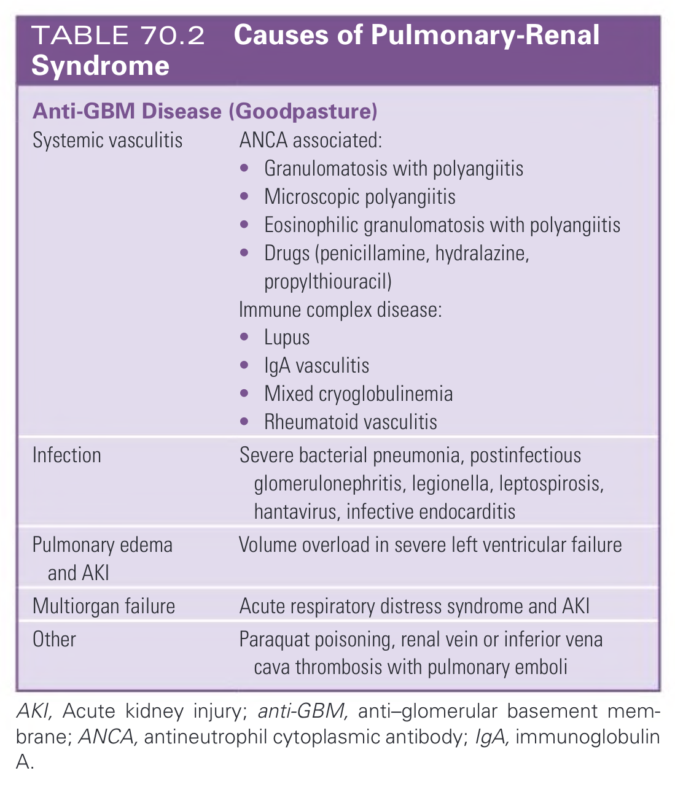

#### Table Data (CSV: [Table_70_2.csv](Table_70_2.csv))

```markdown
| | |
| :--- | :--- |
| **Anti-GBM Disease (Goodpasture)** | |
| **Systemic vasculitis** | **ANCA associated:**<br>• Granulomatosis with polyangiitis<br>• Microscopic polyangiitis<br>• Eosinophilic granulomatosis with polyangiitis<br>• Drugs (penicillamine, hydralazine, propylthiouracil)<br>**Immune complex disease:**<br>• Lupus<br>• IgA vasculitis<br>• Mixed cryoglobulinemia<br>• Rheumatoid vasculitis |
| **Infection** | Severe bacterial pneumonia, postinfectious glomerulonephritis, legionella, leptospirosis, hantavirus, infective endocarditis |
| **Pulmonary edema and AKI** | Volume overload in severe left ventricular failure |
| **Multiorgan failure** | Acute respiratory distress syndrome and AKI |
| **Other** | Paraquat poisoning, renal vein or inferior vena cava thrombosis with pulmonary emboli |
AKI, Acute kidney injury; anti-GBM, anti-glomerular basement membrane; ANCA, antineutrophil cytoplasmic antibody; IgA, immunoglobulin A.
```

TABLE 70.2 Causes of Pulmonary-Renal Syndrome

---

### Table_70_3

#### Table Image

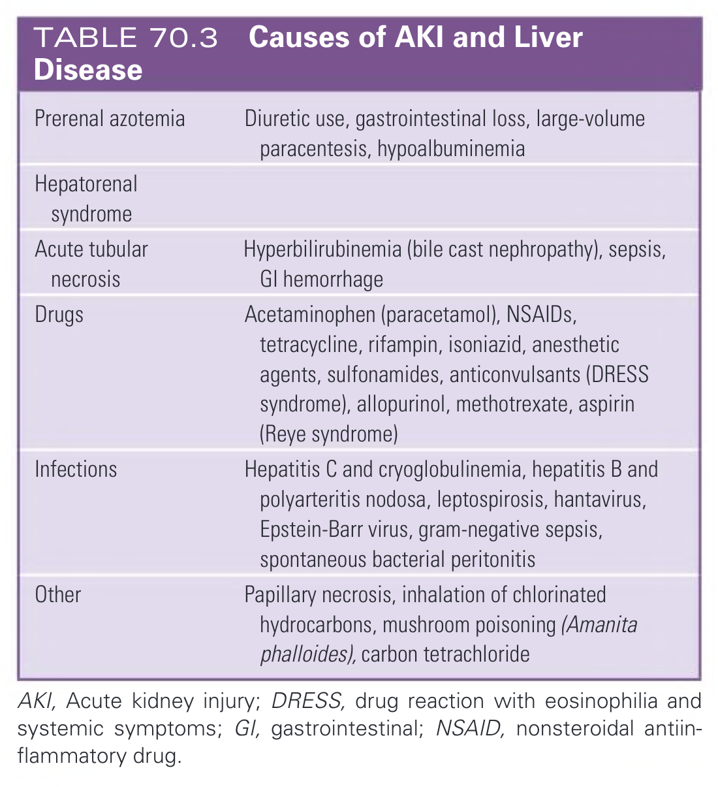

#### Table Data (CSV: [Table_70_3.csv](Table_70_3.csv))

```markdown
| | |
| :--- | :--- |
| **Prerenal azotemia** | Diuretic use, gastrointestinal loss, large-volume paracentesis, hypoalbuminemia |
| **Hepatorenal syndrome** | |
| **Acute tubular necrosis** | Hyperbilirubinemia (bile cast nephropathy), sepsis, GI hemorrhage |
| **Drugs** | Acetaminophen (paracetamol), NSAIDs, tetracycline, rifampin, isoniazid, anesthetic agents, sulfonamides, anticonvulsants (DRESS syndrome), allopurinol, methotrexate, aspirin (Reye syndrome) |
| **Infections** | Hepatitis C and cryoglobulinemia, hepatitis B and polyarteritis nodosa, leptospirosis, hantavirus, Epstein-Barr virus, gram-negative sepsis, spontaneous bacterial peritonitis |
| **Other** | Papillary necrosis, inhalation of chlorinated hydrocarbons, mushroom poisoning (Amanita phalloides), carbon tetrachloride |
AKI, Acute kidney injury; DRESS, drug reaction with eosinophilia and systemic symptoms; GI, gastrointestinal; NSAID, nonsteroidal antiinflammatory drug.
```

TABLE 70.3 Causes of AKI and Liver Disease

---

### Table_70_4

#### Table Image

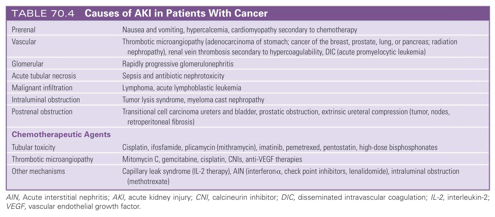

#### Table Data (CSV: [Table_70_4.csv](Table_70_4.csv))

```markdown
| | |
| :--- | :--- |
| **Prerenal** | Nausea and vomiting, hypercalcemia, cardiomyopathy secondary to chemotherapy |
| **Vascular** | Thrombotic microangiopathy (adenocarcinoma of stomach; cancer of the breast, prostate, lung, or pancreas; radiation nephropathy), renal vein thrombosis secondary to hypercoagulability, DIC (acute promyelocytic leukemia) |
| **Glomerular** | Rapidly progressive glomerulonephritis |
| **Acute tubular necrosis** | Sepsis and antibiotic nephrotoxicity |
| **Malignant infiltration** | Lymphoma, acute lymphoblastic leukemia |
| **Intraluminal obstruction** | Tumor lysis syndrome, myeloma cast nephropathy |
| **Postrenal obstruction** | Transitional cell carcinoma ureters and bladder, prostatic obstruction, extrinsic ureteral compression (tumor, nodes, retroperitoneal fibrosis) |
| **Chemotherapeutic Agents** | |
| *Tubular toxicity* | Cisplatin, ifosfamide, plicamycin (mithramycin), imatinib, pemetrexed, pentostatin, high-dose bisphosphonates |
| *Thrombotic microangiopathy* | Mitomycin C, gemcitabine, cisplatin, CNIs, anti-VEGF therapies |
| *Other mechanisms* | Capillary leak syndrome (IL-2 therapy), AIN (interferon α, check point inhibitors, lenalidomide), intraluminal obstruction (methotrexate) |
AIN, Acute interstitial nephritis; AKI, acute kidney injury; CNI, calcineurin inhibitor; DIC, disseminated intravascular coagulation; IL-2, interleukin-2; VEGF, vascular endothelial growth factor.
```

TABLE 70.4 Causes of AKI in Patients With Cancer

---

## Boxes

*No boxes resolved for this chapter.*
