# 071. Acute Kidney Injury in the Tropics - Figures and Tables Index

This document lists all figures, tables and boxes extracted from `071. Acute Kidney Injury in the Tropics.pdf`.

## Table of Contents
- [Figures](#figures)
- [Tables](#tables)
- [Boxes](#boxes)

---

## Figures

### Fig_71_1

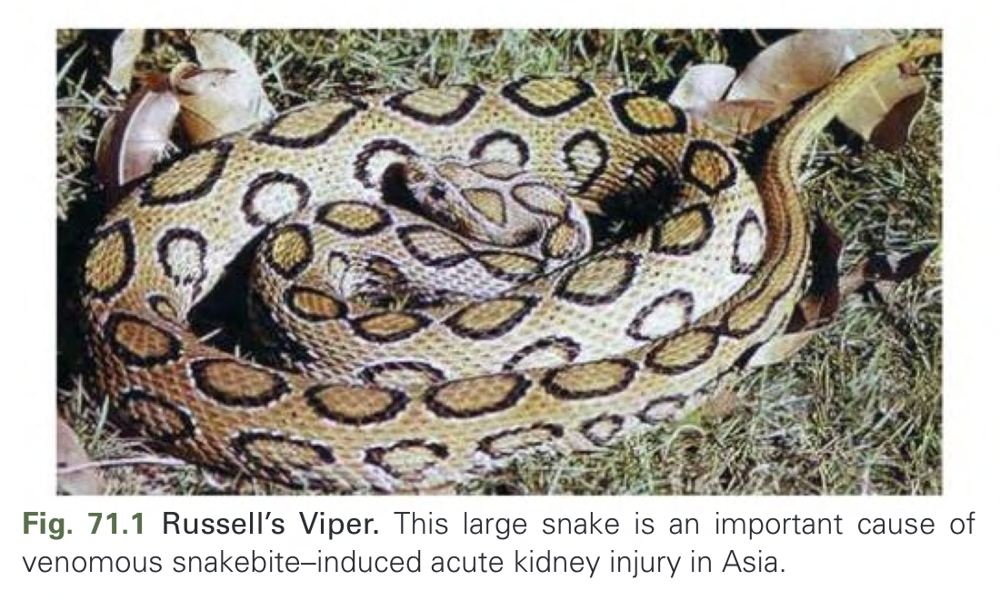

Fig. 71.1 Russell’s Viper. This large snake is an important cause of venomous snakebite–induced acute kidney injury in Asia.

---

### Fig_71_2

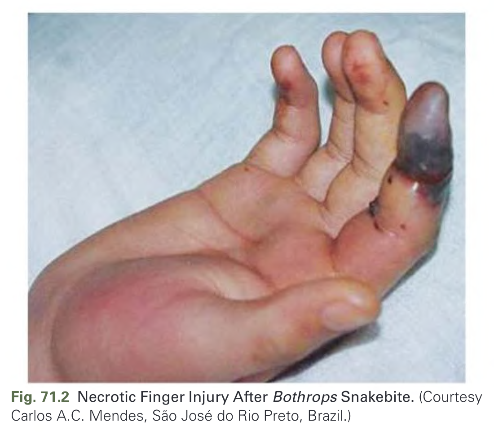

Fig. 71.2 Necrotic Finger Injury After Bothrops Snakebite. (Courtesy Carlos A.C. Mendes, São José do Rio Preto, Brazil.)

---

### Fig_71_3

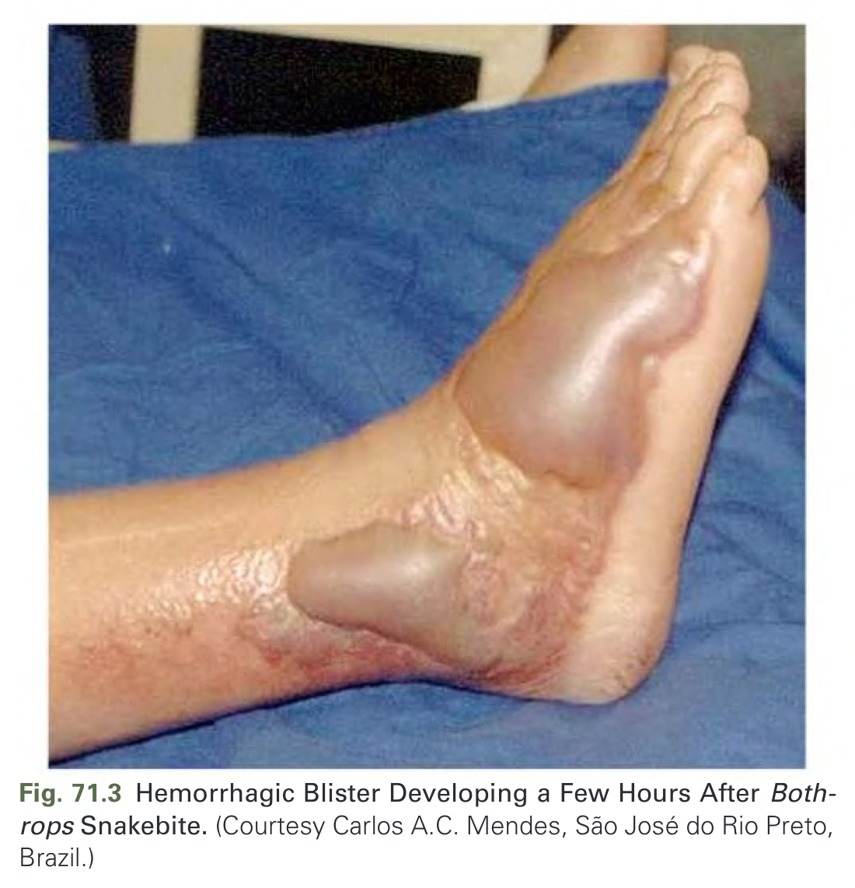

Fig. 71.3 Hemorrhagic Blister Developing a Few Hours After Bothrops Snakebite. (Courtesy Carlos A.C. Mendes, São José do Rio Preto, Brazil.)

---

### Fig_71_4

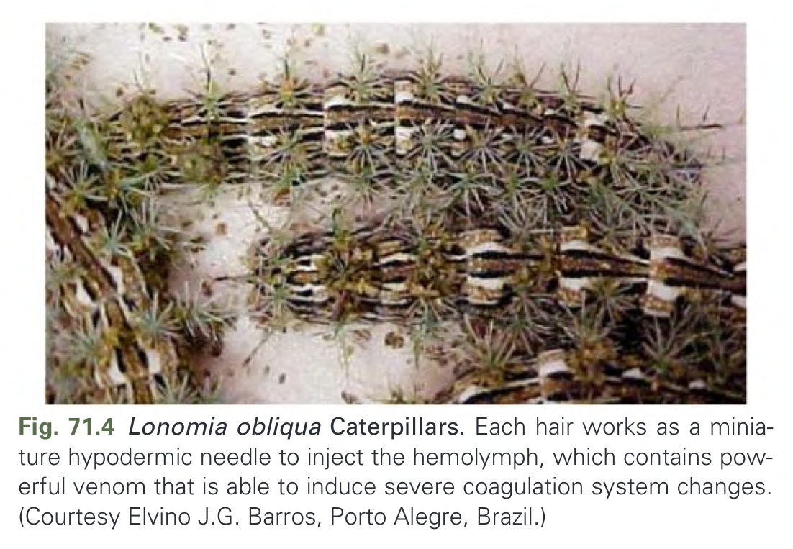

Fig. 71.4 Lonomia obliqua Caterpillars. Each hair works as a miniature hypodermic needle to inject the hemolymph, which contains powerful venom that is able to induce severe coagulation system changes. (Courtesy Elvino J.G. Barros, Porto Alegre, Brazil.)

---

### Fig_71_5

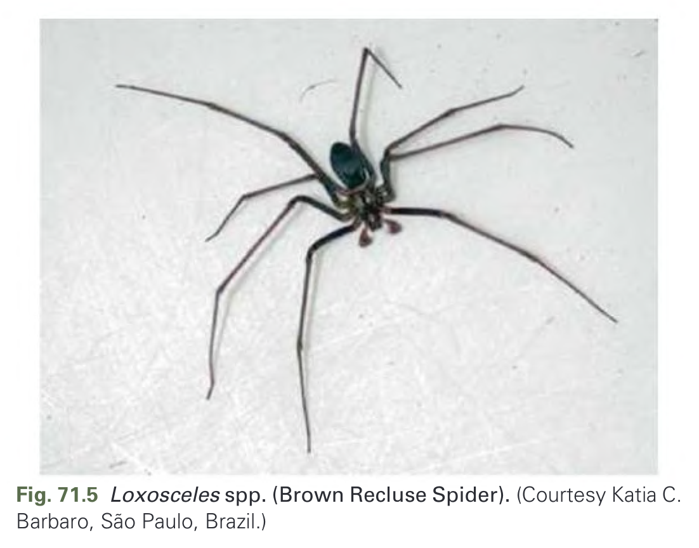

Fig. 71.5 Loxosceles spp. (Brown Recluse Spider). (Courtesy Katia C. Barbaro, São Paulo, Brazil.)

---

### Fig_71_6

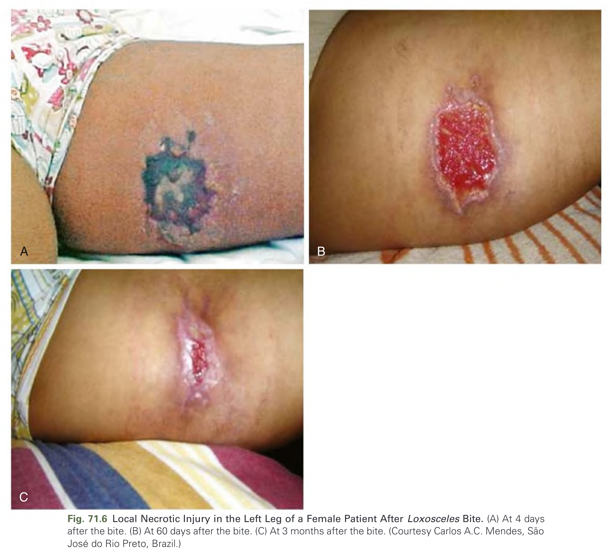

Fig. 71.6 Local Necrotic Injury in the Left Leg of a Female Patient After Loxosceles Bite. (A) At 4 days after the bite. (B) At 60 days after the bite. (C) At 3 months after the bite. (Courtesy Carlos A.C. Mendes, São José do Rio Preto, Brazil.)

---

### Fig_71_7

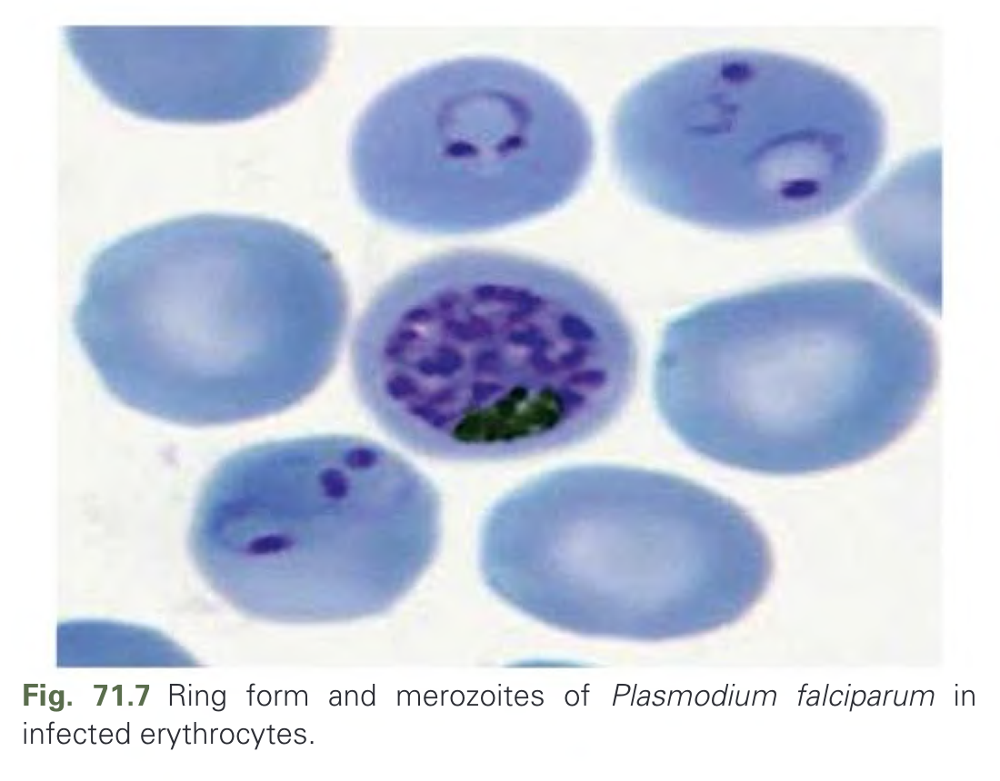

Fig. 71.7 Ring form and merozoites of Plasmodium falciparum in infected erythrocytes.

---

### Fig_71_8

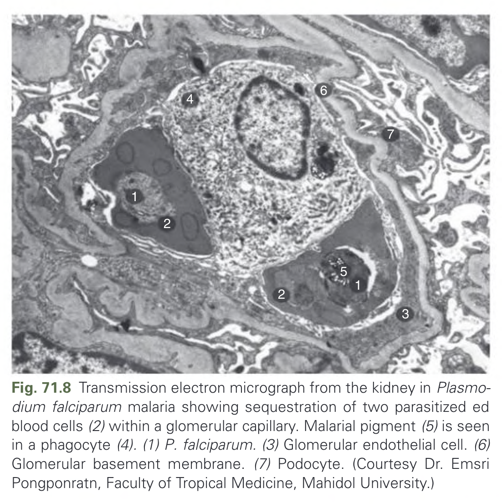

Fig. 71.8 Transmission electron micrograph from the kidney in Plasmodium falciparum malaria showing sequestration of two parasitized ed blood cells (2) within a glomerular capillary. Malarial pigment (5) is seen in a phagocyte (4). (1) P. falciparum. (3) Glomerular endothelial cell. (6) Glomerular basement membrane. (7) Podocyte. (Courtesy Dr. Emsri Pongponratn, Faculty of Tropical Medicine, Mahidol University.)

---

### Fig_71_9

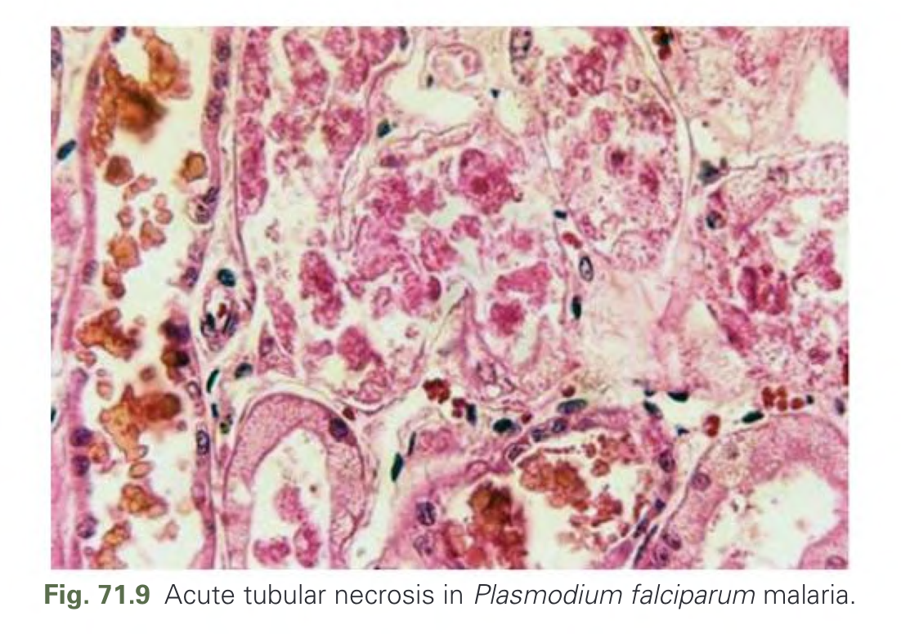

Fig. 71.9 Acute tubular necrosis in Plasmodium falciparum malaria.

---

### Fig_71_10

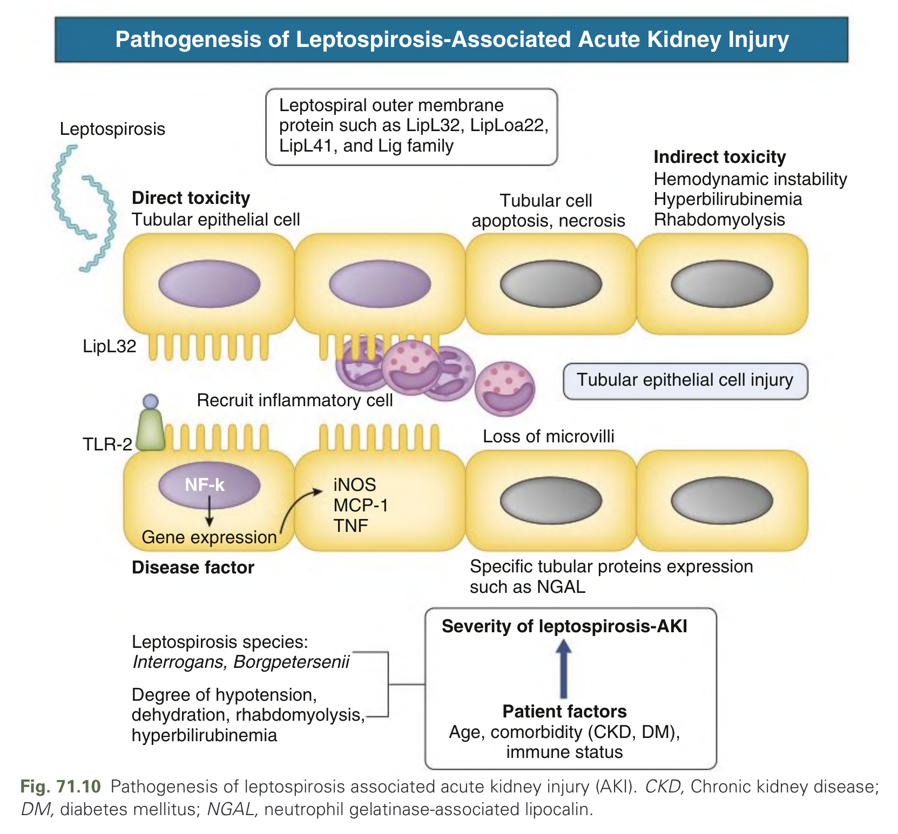

Fig. 71.10 Pathogenesis of leptospirosis associated acute kidney injury (AKI). CKD, Chronic kidney disease; DM, diabetes mellitus; NGAL, neutrophil gelatinase-associated lipocalin.

---

### Fig_71_11

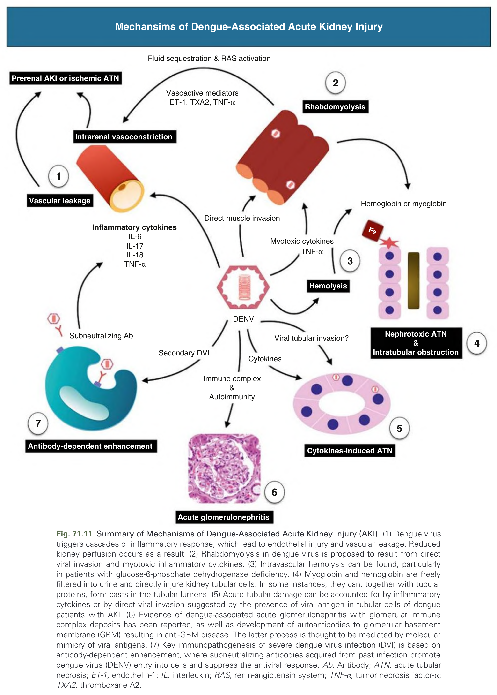

Fig. 71.11 Summary of Mechanisms of Dengue-Associated Acute Kidney Injury (AKI). (1) Dengue virus triggers cascades of inflammatory response, which lead to endothelial injury and vascular leakage. Reduced kidney perfusion occurs as a result. (2) Rhabdomyolysis in dengue virus is proposed to result from direct viral invasion and myotoxic inflammatory cytokines. (3) Intravascular hemolysis can be found, particularly in patients with glucose-6-phosphate dehydrogenase deficiency. (4) Myoglobin and hemoglobin are freely filtered into urine and directly injure kidney tubular cells. In some instances, they can, together with tubular proteins, form casts in the tubular lumens. (5) Acute tubular damage can be accounted for by inflammatory cytokines or by direct viral invasion suggested by the presence of viral antigen in tubular cells of dengue patients with AKI. (6) Evidence of dengue-associated acute glomerulonephritis with glomerular immune complex deposits has been reported, as well as development of autoantibodies to glomerular basement membrane (GBM) resulting in anti-GBM disease. The latter process is thought to be mediated by molecular mimicry of viral antigens. (7) Key immunopathogenesis of severe dengue virus infection (DVI) is based on antibody-dependent enhancement, where subneutralizing antibodies acquired from past infection promote dengue virus (DENV) entry into cells and suppress the antiviral response. Ab, Antibody; ATN, acute tubular necrosis; ET-1, endothelin-1; IL, interleukin; RAS, renin-angiotensin system; TNF-α, tumor necrosis factor-α; TXA2, thromboxane A2.

---

## Tables

*No tables resolved for this chapter.*

## Boxes

*No boxes resolved for this chapter.*
