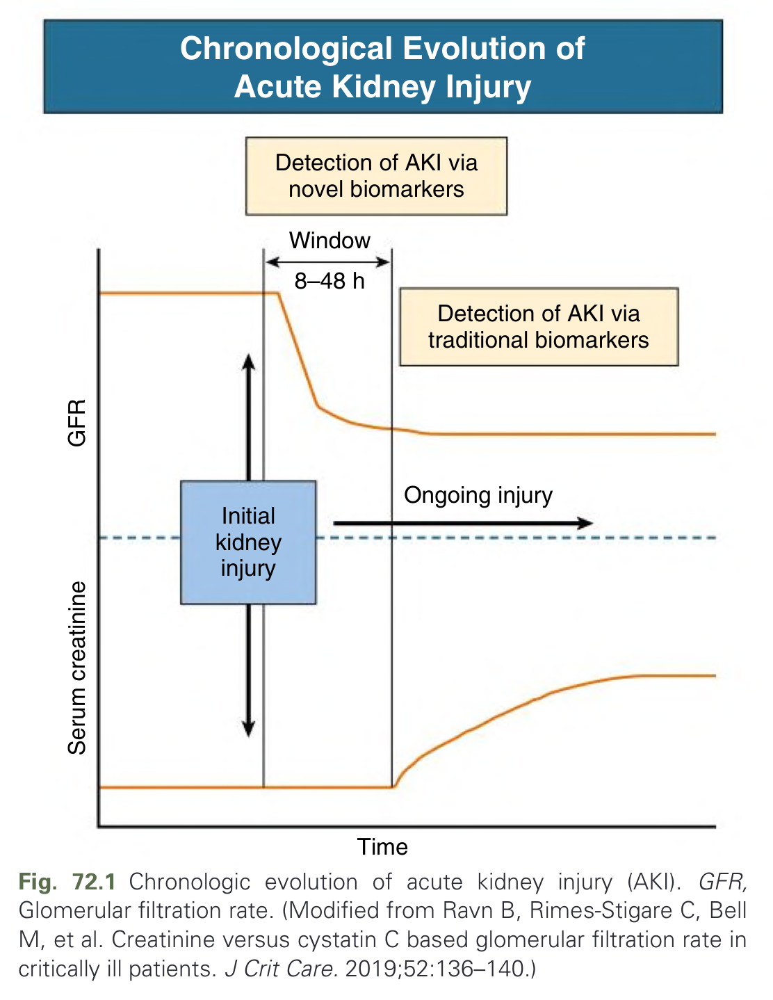
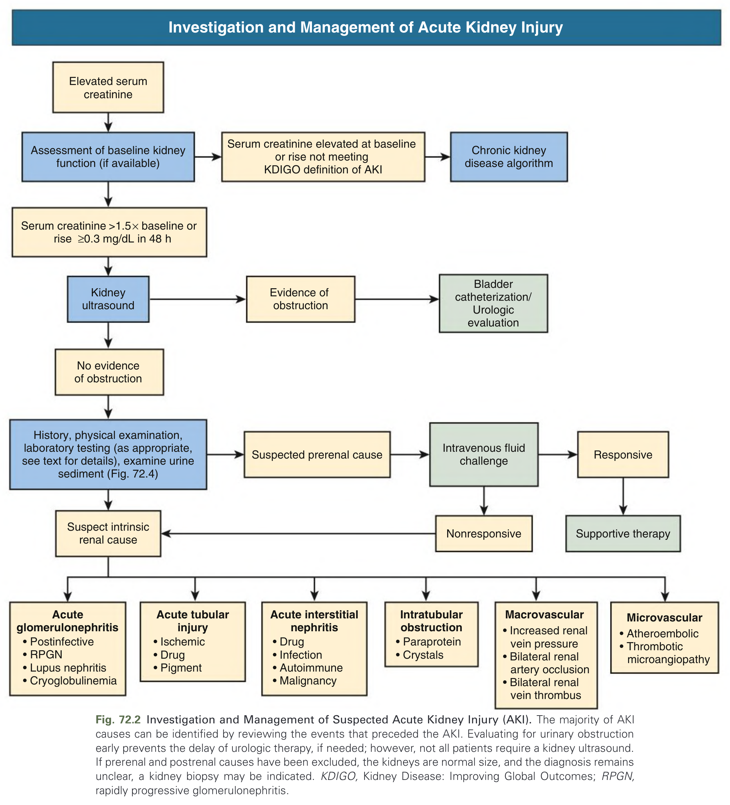
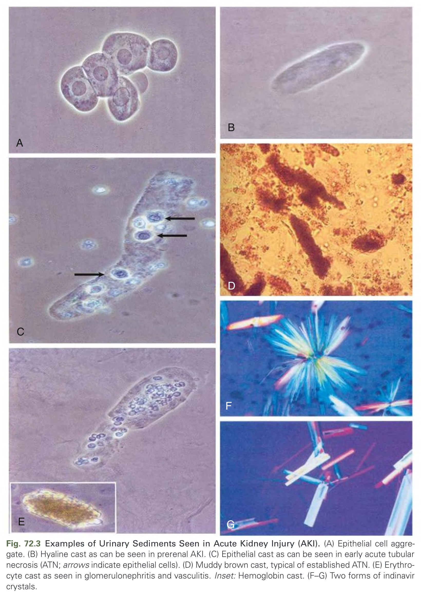
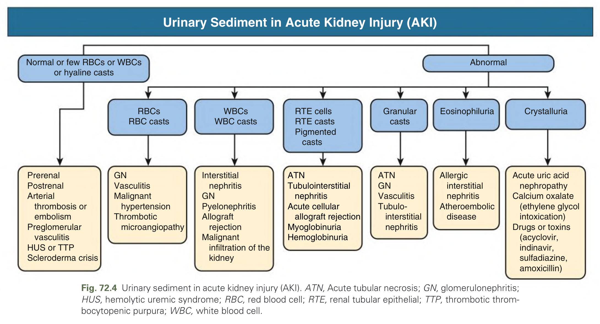
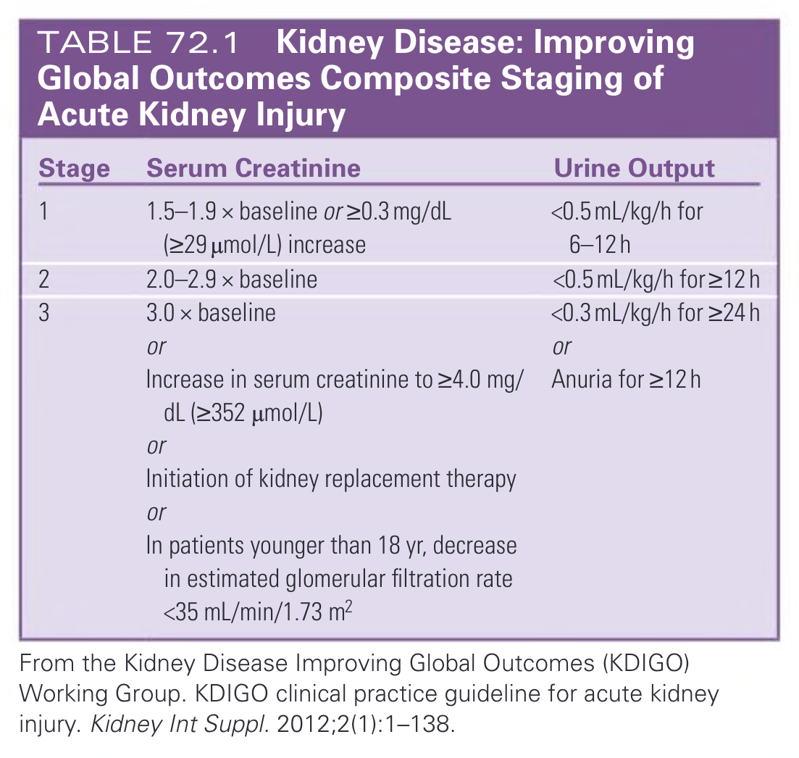
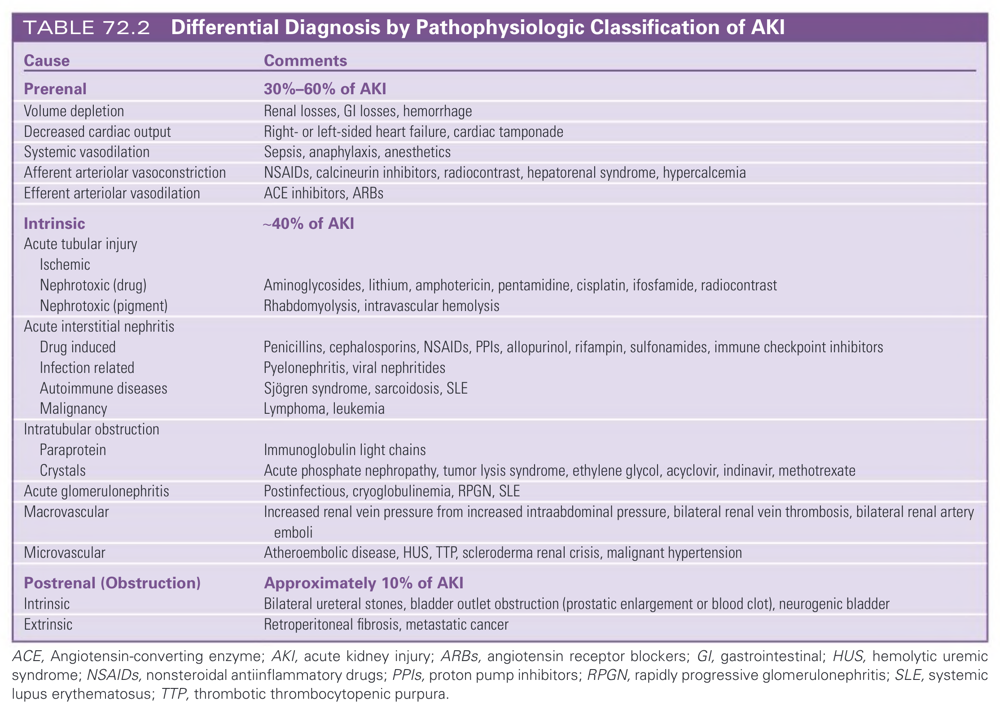
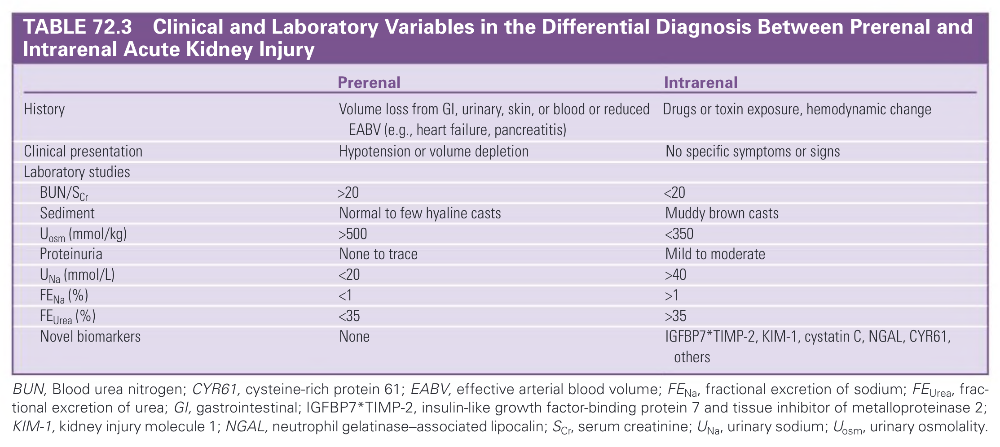
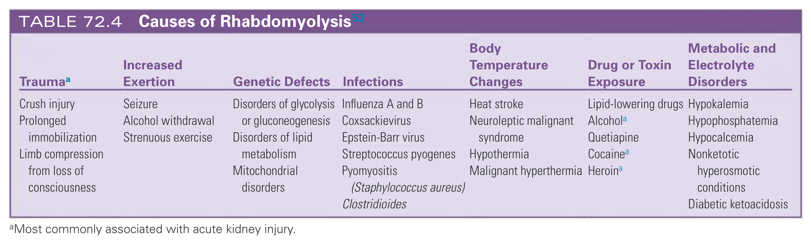

# 072. Diagnosis and Clinical Evaluation of Acute Kidney Injury - Figures and Tables Index

This document lists all figures, tables and boxes extracted from `072. Diagnosis and Clinical Evaluation of Acute Kidney Injury.pdf`.

## Table of Contents
- [Figures](#figures)
- [Tables](#tables)
- [Boxes](#boxes)

---

## Figures

### Fig_72_1



Fig. 72.1 Chronologic evolution of acute kidney injury (AKI). GFR, Glomerular filtration rate. (Modified from Ravn B, Rimes-Stigare C, Bell M, et al. Creatinine versus cystatin C based glomerular filtration rate in critically ill patients. J Crit Care. 2019;52:136–140.)

---

### Fig_72_2



Fig. 72.2 Investigation and Management of Suspected Acute Kidney Injury (AKI). The majority of AKI causes can be identified by reviewing the events that preceded the AKI. Evaluating for urinary obstruction early prevents the delay of urologic therapy, if needed; however, not all patients require a kidney ultrasound. If prerenal and postrenal causes have been excluded, the kidneys are normal size, and the diagnosis remains unclear, a kidney biopsy may be indicated. KDIGO, Kidney Disease: Improving Global Outcomes; RPGN, rapidly progressive glomerulonephritis.

---

### Fig_72_3



Fig. 72.3 Examples of Urinary Sediments Seen in Acute Kidney Injury (AKI). (A) Epithelial cell aggregate. (B) Hyaline cast as can be seen in prerenal AKI. (C) Epithelial cast as can be seen in early acute tubular necrosis (ATN; arrows indicate epithelial cells). (D) Muddy brown cast, typical of established ATN. (E) Erythrocyte cast as seen in glomerulonephritis and vasculitis. Inset: Hemoglobin cast. (F–G) Two forms of indinavir crystals.

---

### Fig_72_4



Fig. 72.4 Urinary sediment in acute kidney injury (AKI). ATN, Acute tubular necrosis; GN, glomerulonephritis; HUS, hemolytic uremic syndrome; RBC, red blood cell; RTE, renal tubular epithelial; TTP, thrombotic thrombocytopenic purpura; WBC, white blood cell.

---

## Tables

### Table_72_1

#### Table Image



#### Table Data (CSV: [Table_72_1.csv](Table_72_1.csv))

```markdown
| Stage | Serum Creatinine | Urine Output |
| :--- | :--- | :--- |
| 1 | 1.5-1.9x baseline or ≥0.3mg/dL (≥29 µmol/L) increase | <0.5 mL/kg/h for 6-12h |
| 2 | 2.0-2.9 x baseline | <0.5 mL/kg/h for≥12h |
| 3 | 3.0 x baseline or Increase in serum creatinine to ≥4.0 mg/dL (≥352 µmol/L) or Initiation of kidney replacement therapy or In patients younger than 18 yr, decrease in estimated glomerular filtration rate <35 mL/min/1.73 m² | <0.3 mL/kg/h for ≥24h or Anuria for ≥12h |

From the Kidney Disease Improving Global Outcomes (KDIGO) Working Group. KDIGO clinical practice guideline for acute kidney injury. Kidney Int Suppl. 2012;2(1):1-138.
```

TABLE 72.1 Kidney Disease: Improving Global Outcomes Composite Staging of Acute Kidney Injury

---

### Table_72_2

#### Table Image



#### Table Data (CSV: [Table_72_2.csv](Table_72_2.csv))

```markdown
| Cause | Comments |
| :--- | :--- |
| **Prerenal** | **30%-60% of AKI** |
| Volume depletion | Renal losses, GI losses, hemorrhage |
| Decreased cardiac output | Right- or left-sided heart failure, cardiac tamponade |
| Systemic vasodilation | Sepsis, anaphylaxis, anesthetics |
| Afferent arteriolar vasoconstriction | NSAIDs, calcineurin inhibitors, radiocontrast, hepatorenal syndrome, hypercalcemia |
| Efferent arteriolar vasodilation | ACE inhibitors, ARBs |
| **Intrinsic** | **~40% of AKI** |
| Acute tubular injury | |
| Ischemic | |
| Nephrotoxic (drug) | Aminoglycosides, lithium, amphotericin, pentamidine, cisplatin, ifosfamide, radiocontrast |
| Nephrotoxic (pigment) | Rhabdomyolysis, intravascular hemolysis |
| Acute interstitial nephritis | |
| Drug induced | Penicillins, cephalosporins, NSAIDs, PPIs, allopurinol, rifampin, sulfonamides, immune checkpoint inhibitors |
| Infection related | Pyelonephritis, viral nephritides |
| Autoimmune diseases | Sjögren syndrome, sarcoidosis, SLE |
| Malignancy | Lymphoma, leukemia |
| Intratubular obstruction | |
| Paraprotein | Immunoglobulin light chains |
| Crystals | Acute phosphate nephropathy, tumor lysis syndrome, ethylene glycol, acyclovir, indinavir, methotrexate |
| Acute glomerulonephritis | Postinfectious, cryoglobulinemia, RPGN, SLE |
| Macrovascular | Increased renal vein pressure from increased intraabdominal pressure, bilateral renal vein thrombosis, bilateral renal artery emboli |
| Microvascular | Atheroembolic disease, HUS, TTP, scleroderma renal crisis, malignant hypertension |
| **Postrenal (Obstruction)** | **Approximately 10% of AKI** |
| Intrinsic | Bilateral ureteral stones, bladder outlet obstruction (prostatic enlargement or blood clot), neurogenic bladder |
| Extrinsic | Retroperitoneal fibrosis, metastatic cancer |

ACE, Angiotensin-converting enzyme; AKI, acute kidney injury; ARBs, angiotensin receptor blockers; GI, gastrointestinal; HUS, hemolytic uremic syndrome; NSAIDs, nonsteroidal antiinflammatory drugs; PPIs, proton pump inhibitors; RPGN, rapidly progressive glomerulonephritis; SLE, systemic lupus erythematosus; TTP, thrombotic thrombocytopenic purpura.
```

TABLE 72.2 Differential Diagnosis by Pathophysiologic Classification of AKI

---

### Table_72_3

#### Table Image



#### Table Data (CSV: [Table_72_3.csv](Table_72_3.csv))

```markdown
| | Prerenal | Intrarenal |
| :--- | :--- | :--- |
| History | Volume loss from GI, urinary, skin, or blood or reduced EABV (e.g., heart failure, pancreatitis) | Drugs or toxin exposure, hemodynamic change |
| Clinical presentation | Hypotension or volume depletion | No specific symptoms or signs |
| **Laboratory studies** | | |
| BUN/SCr | >20 | <20 |
| Sediment | Normal to few hyaline casts | Muddy brown casts |
| Uosm (mmol/kg) | >500 | <350 |
| Proteinuria | None to trace | Mild to moderate |
| UNa (mmol/L) | <20 | >40 |
| FENa (%) | <1 | >1 |
| FEUrea (%) | <35 | >35 |
| Novel biomarkers | None | IGFBP7*TIMP-2, KIM-1, cystatin C, NGAL, CYR61, others |

BUN, Blood urea nitrogen; CYR61, cysteine-rich protein 61; EABV, effective arterial blood volume; FENa, fractional excretion of sodium; FEUrea, fractional excretion of urea; GI, gastrointestinal; IGFBP7*TIMP-2, insulin-like growth factor-binding protein 7 and tissue inhibitor of metalloproteinase 2; KIM-1, kidney injury molecule 1; NGAL, neutrophil gelatinase-associated lipocalin; SCr, serum creatinine; UNa, urinary sodium; Uosm, urinary osmolality.
```

TABLE 72.3 Clinical and Laboratory Variables in the Differential Diagnosis Between Prerenal and Intrarenal Acute Kidney Injury

---

### Table_72_4

#### Table Image



#### Table Data (CSV: [Table_72_4.csv](Table_72_4.csv))

```markdown
| Traumaa | Increased Exertion | Genetic Defects | Infections | Body Temperature Changes | Drug or Toxin Exposure | Metabolic and Electrolyte Disorders |
| :--- | :--- | :--- | :--- | :--- | :--- | :--- |
| Crush injury | Seizure | Disorders of glycolysis or gluconeogenesis | Influenza A and B | Heat stroke | Lipid-lowering drugs | Hypokalemia |
| Prolonged immobilization | Alcohol withdrawal | Disorders of lipid metabolism | Coxsackievirus | Neuroleptic malignant syndrome | Alcohola | Hypophosphatemia |
| Limb compression from loss of consciousness | Strenuous exercise | Mitochondrial disorders | Epstein-Barr virus | Hypothermia | Quetiapine | Hypocalcemia |
| | | | Streptococcus pyogenes | Malignant hyperthermia | Cocainea | Nonketotic hyperosmotic conditions |
| | | | Pyomyositis (Staphylococcus aureus) | | Heroina | Diabetic ketoacidosis |
| | | | Clostridioides | | | |

aMost commonly associated with acute kidney injury.
```

TABLE 72.4 Causes of Rhabdomyolysis52

---

## Boxes

*No boxes resolved for this chapter.*
