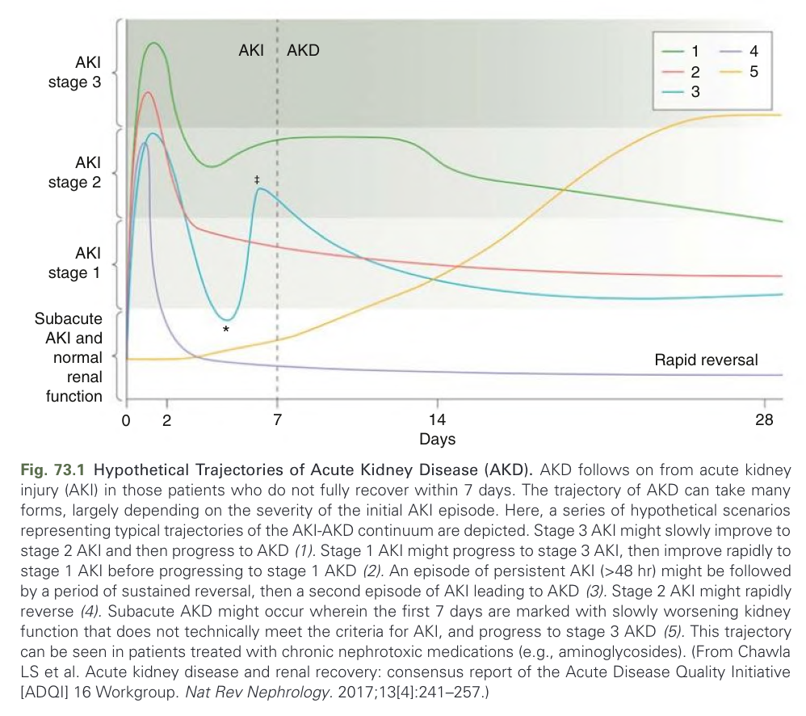
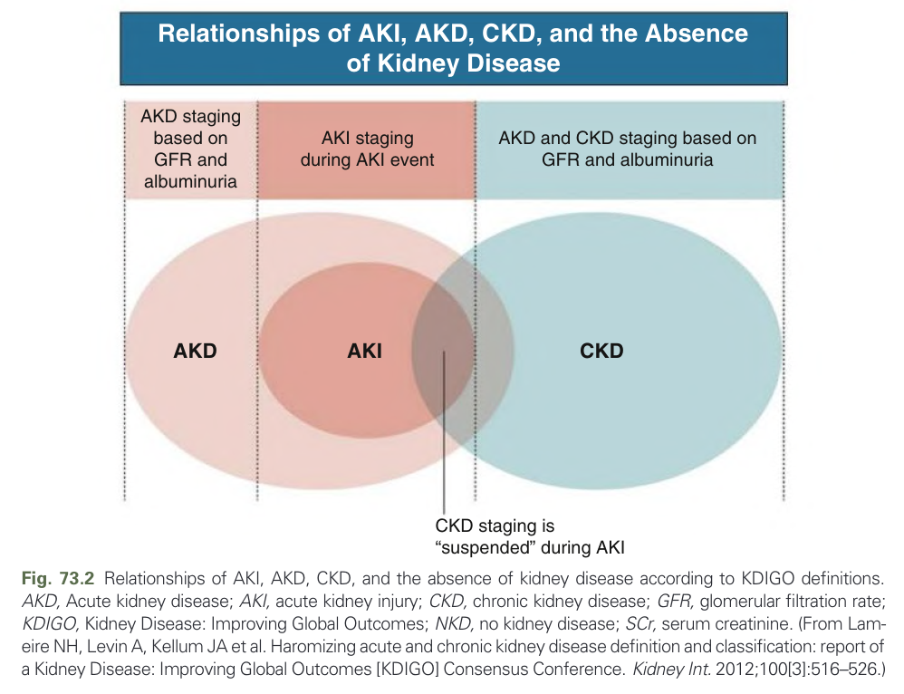
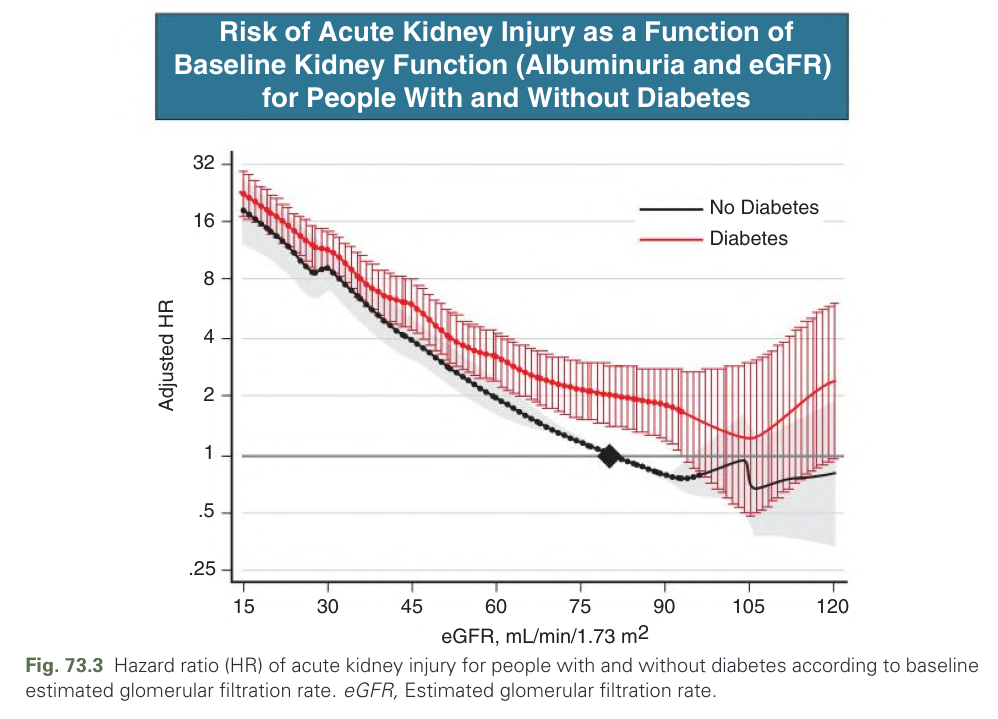
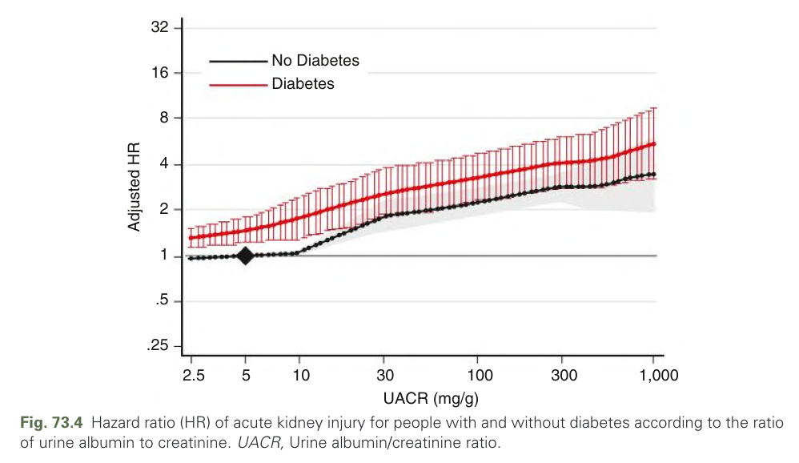
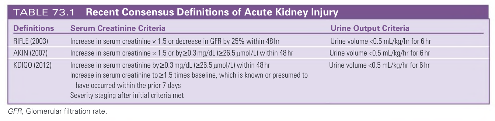
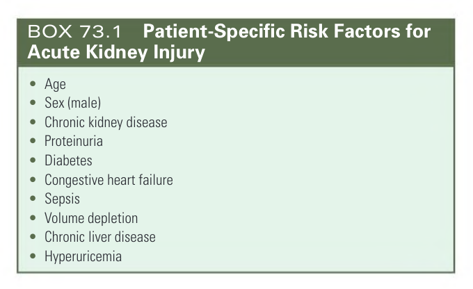
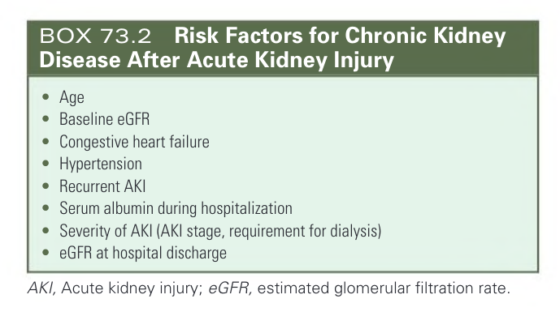

# 073. Epidemiology and Prognostic Impact of Acute Kidney Injury and Acute Kidney Disease - Figures and Tables Index

This document lists all figures, tables and boxes extracted from `073. Epidemiology and Prognostic Impact of Acute Kidney Injury and Acute Kidney Disease.pdf`.

## Table of Contents
- [Figures](#figures)
- [Tables](#tables)
- [Boxes](#boxes)

---

## Figures

### Fig_73_1



Fig. 73.1 Hypothetical Trajectories of Acute Kidney Disease (AKD). AKD follows on from acute kidney injury (AKI) in those patients who do not fully recover within 7 days. The trajectory of AKD can take many forms, largely depending on the severity of the initial AKI episode. Here, a series of hypothetical scenarios representing typical trajectories of the AKI-AKD continuum are depicted. Stage 3 AKI might slowly improve to stage 2 AKI and then progress to AKD (1). Stage 1 AKI might progress to stage 3 AKI, then improve rapidly to stage 1 AKI before progressing to stage 1 AKD (2). An episode of persistent AKI (>48 hr) might be followed by a period of sustained reversal, then a second episode of AKI leading to AKD (3). Stage 2 AKI might rapidly reverse (4). Subacute AKD might occur wherein the first 7 days are marked with slowly worsening kidney function that does not technically meet the criteria for AKI, and progress to stage 3 AKD (5). This trajectory can be seen in patients treated with chronic nephrotoxic medications (e.g., aminoglycosides). (From Chawla LS et al. Acute kidney disease and renal recovery: consensus report of the Acute Disease Quality Initiative [ADQI] 16 Workgroup. Nat Rev Nephrology. 2017;13[4]:241–257.)

---

### Fig_73_2



Fig. 73.2 Relationships of AKI, AKD, CKD, and the absence of kidney disease according to KDIGO definitions. AKD, Acute kidney disease; AKI, acute kidney injury; CKD, chronic kidney disease; GFR, glomerular filtration rate; KDIGO, Kidney Disease: Improving Global Outcomes; NKD, no kidney disease; SCr, serum creatinine. (From Lameire NH, Levin A, Kellum JA et al. Haromizing acute and chronic kidney disease definition and classification: report of a Kidney Disease: Improving Global Outcomes [KDIGO] Consensus Conference. Kidney Int. 2012;100[3]:516–526.)

---

### Fig_73_3



Fig. 73.3 Risk of Acute Kidney Injury as a Function of Baseline Kidney Function (Albuminuria and eGFR) for People With and Without Diabetes Fig. 73.3 Hazard ratio (HR) of acute kidney injury for people with and without diabetes according to baseline estimated glomerular filtration rate. eGFR, Estimated glomerular filtration rate.

---

### Fig_73_4



Fig. 73.4 Hazard ratio (HR) of acute kidney injury for people with and without diabetes according to the ratio of urine albumin to creatinine. UACR, Urine albumin/creatinine ratio.

---

## Tables

### Table_73_1

#### Table Image



#### Table Data (CSV: [Table_73_1.csv](Table_73_1.csv))

```markdown
| Definitions | Serum Creatinine Criteria | Urine Output Criteria |
| :--- | :--- | :--- |
| RIFLE (2003) | Increase in serum creatinine × 1.5 or decrease in GFR by 25% within 48 hr | Urine volume <0.5 mL/kg/hr for 6 hr |
| ΑΚΙΝ (2007) | Increase in serum creatinine × 1.5 or by ≥0.3 mg/dL (≥26.5 µmol/L) within 48 hr | Urine volume <0.5 mL/kg/hr for 6 hr |
| KDIGO (2012) | Increase in serum creatinine by ≥0.3 mg/dL (≥26.5 µmol/L) within 48 hr<br>Increase in serum creatinine to ≥1.5 times baseline, which is known or presumed to have occurred within the prior 7 days<br>Severity staging after initial criteria met | Urine volume <0.5 mL/kg/hr for 6 hr |

GFR, Glomerular filtration rate.
```

TABLE 73.1 Recent Consensus Definitions of Acute Kidney Injury

---

## Boxes

### Box_73_1



#### Box Text

```markdown
* Age
* Sex (male)
* Chronic kidney disease
* Proteinuria
* Diabetes
* Congestive heart failure
* Sepsis
* Volume depletion
* Chronic liver disease
* Hyperuricemia
```

BOX 73.1 Patient-Specific Risk Factors for Acute Kidney Injury • Age • Sex (male) • Chronic kidney disease • Proteinuria • Diabetes • Congestive heart failure • Sepsis • Volume depletion • Chronic liver disease • Hyperuricemia

---

### Box_73_2



#### Box Text

```markdown
* Age
* Baseline eGFR
* Congestive heart failure
* Hypertension
* Recurrent AKI
* Serum albumin during hospitalization
* Severity of AKI (AKI stage, requirement for dialysis)
* eGFR at hospital discharge

AKI, Acute kidney injury; eGFR, estimated glomerular filtration rate.
```

BOX 73.2 Risk Factors for Chronic Kidney Disease After Acute Kidney Injury • Age • Baseline eGFR • Congestive heart failure • Hypertension • Recurrent AKI • Serum albumin during hospitalization • Severity of AKI (AKI stage, requirement for dialysis) • eGFR at hospital discharge AKI, Acute kidney injury; eGFR, estimated glomerular filtration rate.

---
