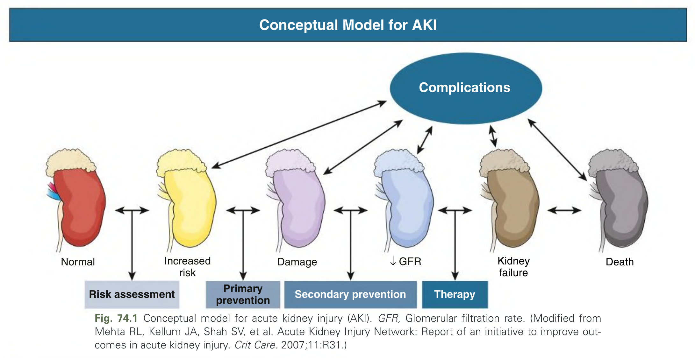
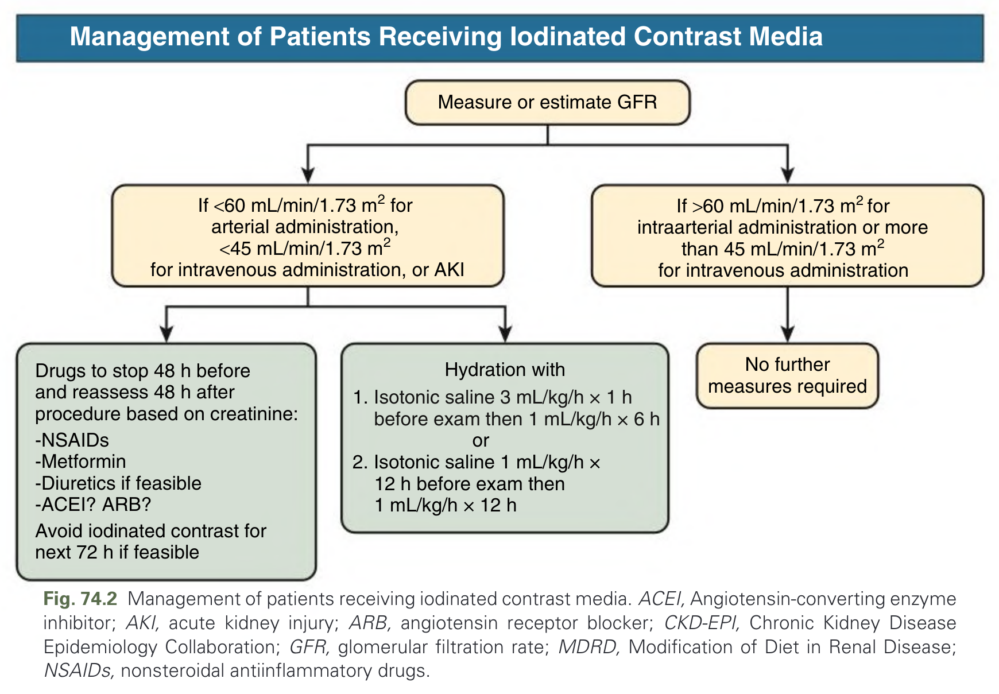
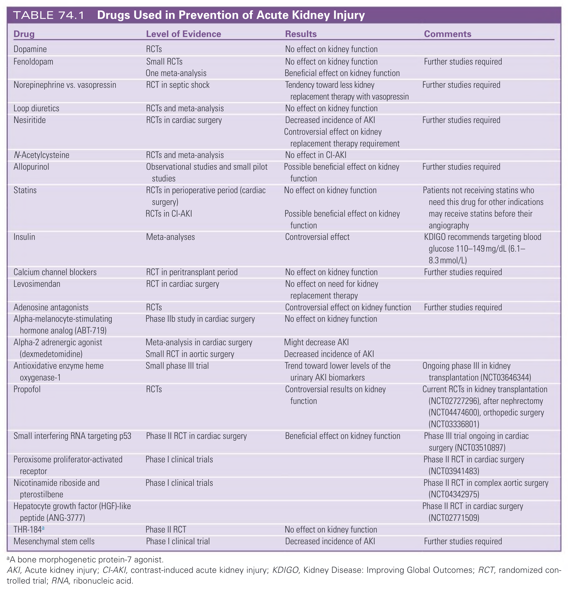
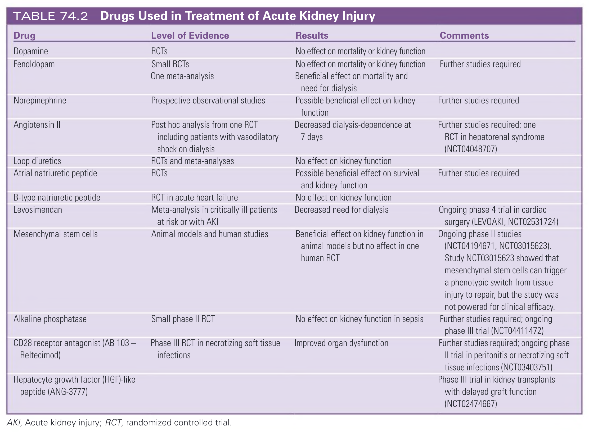
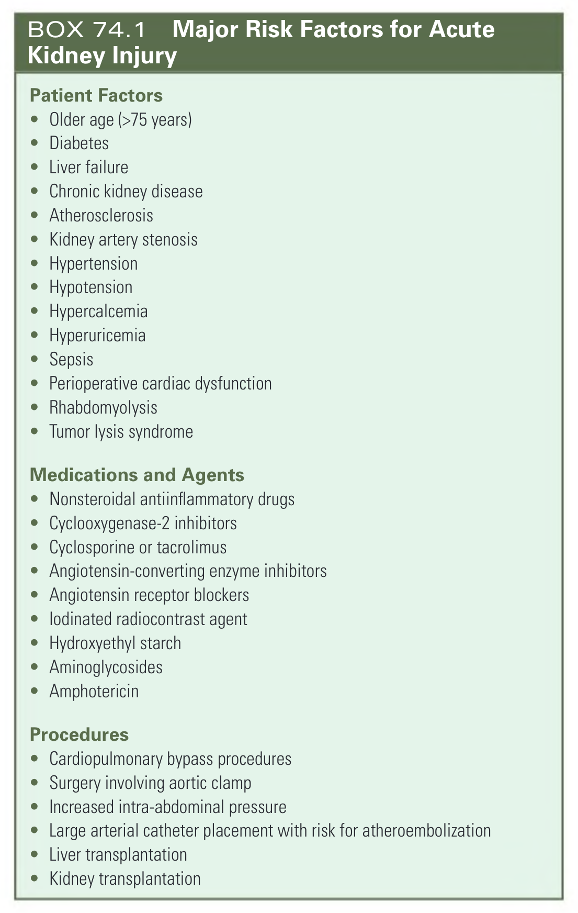
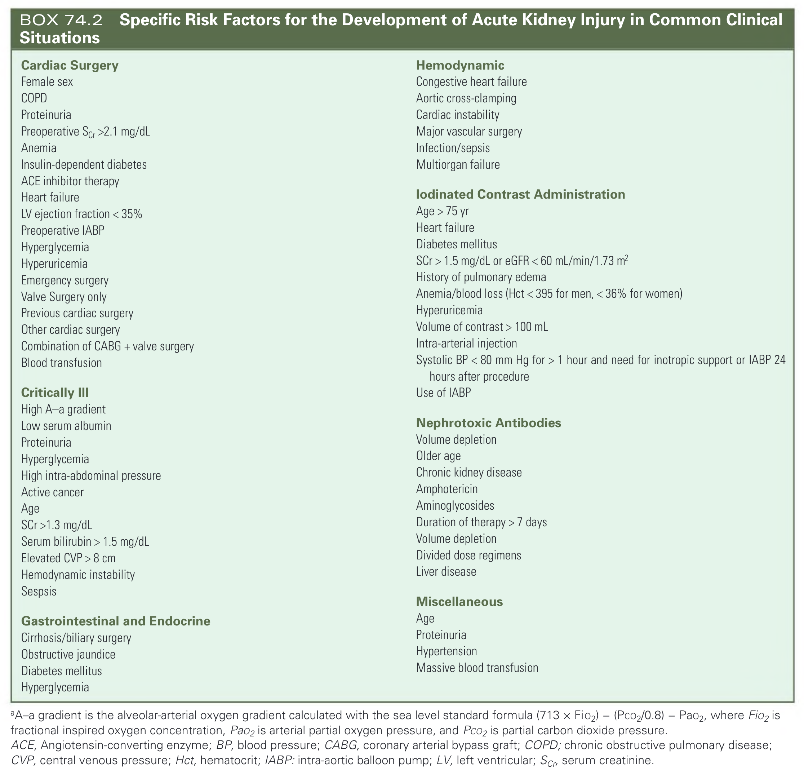

# 074. Prevention and Nondialytic Management of Acute Kidney Injury - Figures and Tables Index

This document lists all figures, tables and boxes extracted from `074. Prevention and Nondialytic Management of Acute Kidney Injury.pdf`.

## Table of Contents
- [Figures](#figures)
- [Tables](#tables)
- [Boxes](#boxes)

---

## Figures

### Fig_74_1



Fig. 74.1 Conceptual model for acute kidney injury (AKI). GFR, Glomerular filtration rate. (Modified from Mehta RL, Kellum JA, Shah SV, et al. Acute Kidney Injury Network: Report of an initiative to improve outcomes in acute kidney injury. Crit Care. 2007;11:R31.)

---

### Fig_74_2



Fig. 74.2 Management of patients receiving iodinated contrast media. ACEI, Angiotensin-converting enzyme inhibitor; AKI, acute kidney injury; ARB, angiotensin receptor blocker; CKD-EPI, Chronic Kidney Disease Epidemiology Collaboration; GFR, glomerular filtration rate; MDRD, Modification of Diet in Renal Disease; NSAIDs, nonsteroidal antiinflammatory drugs.

---

## Tables

### Table_74_1

#### Table Image



#### Table Data (CSV: [Table_74_1.csv](Table_74_1.csv))

```markdown
| Drug | Level of Evidence | Results | Comments |
| :--- | :--- | :--- | :--- |
| Dopamine | RCTs | No effect on kidney function | |
| Fenoldopam | Small RCTs | No effect on kidney function | Further studies required |
| | One meta-analysis | Beneficial effect on kidney function | |
| Norepinephrine vs. vasopressin | RCT in septic shock | Tendency toward less kidney replacement therapy with vasopressin | Further studies required |
| Loop diuretics | RCTs and meta-analysis | No effect on kidney function | |
| Nesiritide | RCTs in cardiac surgery | Decreased incidence of AKI | Further studies required |
| | | Controversial effect on kidney replacement therapy requirement | |
| N-Acetylcysteine | RCTs and meta-analysis | No effect in CI-AKI | |
| Allopurinol | Observational studies and small pilot studies | Possible beneficial effect on kidney function | Further studies required |
| Statins | RCTs in perioperative period (cardiac surgery) | No effect on kidney function | Patients not receiving statins who need this drug for other indications may receive statins before their angiography |
| | RCTs in CI-AKI | Possible beneficial effect on kidney function | |
| Insulin | Meta-analyses | Controversial effect | KDIGO recommends targeting blood glucose 110-149 mg/dL (6.1-8.3 mmol/L) |
| Calcium channel blockers | RCT in peritransplant period | No effect on kidney function | Further studies required |
| Levosimendan | RCT in cardiac surgery | No effect on need for kidney replacement therapy | |
| Adenosine antagonists | RCTs | Controversial effect on kidney function | Further studies required |
| Alpha-melanocyte-stimulating hormone analog (ABT-719) | Phase IIb study in cardiac surgery | No effect on kidney function | |
| Alpha-2 adrenergic agonist (dexmedetomidine) | Meta-analysis in cardiac surgery | Might decrease AKI | |
| | Small RCT in aortic surgery | Decreased incidence of AKI | |
| Antioxidative enzyme heme oxygenase-1 | Small phase III trial | Trend toward lower levels of the urinary AKI biomarkers | Ongoing phase III in kidney transplantation (NCT03646344) |
| Propofol | RCTs | Controversial results on kidney function | Current RCTs in kidney transplantation (NCT02727296), after nephrectomy (NCT04474600), orthopedic surgery (NCT03336801) |
| Small interfering RNA targeting p53 | Phase II RCT in cardiac surgery | Beneficial effect on kidney function | Phase III trial ongoing in cardiac surgery (NCT03510897) |
| Peroxisome proliferator-activated receptor | Phase I clinical trials | | Phase II RCT in cardiac surgery (NCT03941483) |
| Nicotinamide riboside and pterostilbene | Phase I clinical trials | | Phase II RCT in complex aortic surgery (NCT04342975) |
| Hepatocyte growth factor (HGF)-like peptide (ANG-3777) | | | Phase II RCT in cardiac surgery (NCT02771509) |
| THR-184a | Phase II RCT | No effect on kidney function | |
| Mesenchymal stem cells | Phase I clinical trial | Decreased incidence of AKI | Further studies required |

aA bone morphogenetic protein-7 agonist.
AKI, Acute kidney injury; CI-AKI, contrast-induced acute kidney injury; KDIGO, Kidney Disease: Improving Global Outcomes; RCT, randomized controlled trial; RNA, ribonucleic acid.
```

TABLE 74.1 Drugs Used in Prevention of Acute Kidney Injury

---

### Table_74_2

#### Table Image



#### Table Data (CSV: [Table_74_2.csv](Table_74_2.csv))

```markdown
| Drug | Level of Evidence | Results | Comments |
| :--- | :--- | :--- | :--- |
| Dopamine | RCTs | No effect on mortality or kidney function | |
| Fenoldopam | Small RCTs | No effect on mortality or kidney function | Further studies required |
| | One meta-analysis | Beneficial effect on mortality and need for dialysis | |
| Norepinephrine | Prospective observational studies | Possible beneficial effect on kidney function | Further studies required |
| Angiotensin II | Post hoc analysis from one RCT including patients with vasodilatory shock on dialysis | Decreased dialysis-dependence at 7 days | Further studies required; one RCT in hepatorenal syndrome (NCT04048707) |
| Loop diuretics | RCTs and meta-analyses | No effect on kidney function | |
| Atrial natriuretic peptide | RCTs | Possible beneficial effect on survival and kidney function | Further studies required |
| B-type natriuretic peptide | RCT in acute heart failure | No effect on kidney function | |
| Levosimendan | Meta-analysis in critically ill patients at risk or with AKI | Decreased need for dialysis | Ongoing phase 4 trial in cardiac surgery (LEVOAKI, NCT02531724) |
| Mesenchymal stem cells | Animal models and human studies | Beneficial effect on kidney function in animal models but no effect in one human RCT | Ongoing phase II studies (NCT04194671, NCT03015623). Study NCT03015623 showed that mesenchymal stem cells can trigger a phenotypic switch from tissue injury to repair, but the study was not powered for clinical efficacy. |
| Alkaline phosphatase | Small phase II RCT | No effect on kidney function in sepsis | Further studies required; ongoing phase III trial (NCT04411472) |
| CD28 receptor antagonist (AB 103 Reltecimod) | Phase III RCT in necrotizing soft tissue infections | Improved organ dysfunction | Further studies required; ongoing phase II trial in peritonitis or necrotizing soft tissue infections (NCT03403751) |
| Hepatocyte growth factor (HGF)-like peptide (ANG-3777) | | | Phase III trial in kidney transplants with delayed graft function (NCT02474667) |

AKI, Acute kidney injury; RCT, randomized controlled trial.
```

TABLE 74.2 Drugs Used in Treatment of Acute Kidney Injury

---

## Boxes

### Box_74_1



#### Box Text

```markdown
**Patient Factors**
* Older age (>75 years)
* Diabetes
* Liver failure
* Chronic kidney disease
* Atherosclerosis
* Kidney artery stenosis
* Hypertension
* Hypotension
* Hypercalcemia
* Hyperuricemia
* Sepsis
* Perioperative cardiac dysfunction
* Rhabdomyolysis
* Tumor lysis syndrome

**Medications and Agents**
* Nonsteroidal antiinflammatory drugs
* Cyclooxygenase-2 inhibitors
* Cyclosporine or tacrolimus
* Angiotensin-converting enzyme inhibitors
* Angiotensin receptor blockers
* lodinated radiocontrast agent
* Hydroxyethyl starch
* Aminoglycosides
* Amphotericin

**Procedures**
* Cardiopulmonary bypass procedures
* Surgery involving aortic clamp
* Increased intra-abdominal pressure
* Large arterial catheter placement with risk for atheroembolization
* Liver transplantation
* Kidney transplantation
```

BOX 74.1 Major Risk Factors for Acute Kidney Injury

---

### Box_74_2



#### Box Text

```markdown
**Cardiac Surgery**
Female sex
COPD
Proteinuria
Preoperative Scr >2.1 mg/dL
Anemia
Insulin-dependent diabetes
ACE inhibitor therapy
Heart failure
LV ejection fraction < 35%
Preoperative IABP
Hyperglycemia
Hyperuricemia
Emergency surgery
Valve Surgery only
Previous cardiac surgery
Other cardiac surgery
Combination of CABG + valve surgery
Blood transfusion

**Critically Ill**
High A-a gradient
Low serum albumin
Proteinuria
Hyperglycemia
High intra-abdominal pressure
Active cancer
Age
SCr >1.3 mg/dL
Serum bilirubin > 1.5 mg/dL
Elevated CVP > 8 cm
Hemodynamic instability
Sespsis

**Gastrointestinal and Endocrine**
Cirrhosis/biliary surgery
Obstructive jaundice
Diabetes mellitus
Hyperglycemia

**Hemodynamic**
Congestive heart failure
Aortic cross-clamping
Cardiac instability
Major vascular surgery
Infection/sepsis
Multiorgan failure

**lodinated Contrast Administration**
Age > 75 yr
Heart failure
Diabetes mellitus
SCr > 1.5 mg/dL or eGFR < 60 mL/min/1.73 m²
History of pulmonary edema
Anemia/blood loss (Hct < 395 for men, < 36% for women)
Hyperuricemia
Volume of contrast > 100 mL
Intra-arterial injection
Systolic BP < 80 mm Hg for > 1 hour and need for inotropic support or IABP 24 hours after procedure
Use of IABP

**Nephrotoxic Antibodies**
Volume depletion
Older age
Chronic kidney disease
Amphotericin
Aminoglycosides
Duration of therapy > 7 days
Volume depletion
Divided dose regimens
Liver disease

**Miscellaneous**
Age
Proteinuria
Hypertension
Massive blood transfusion

aA-a gradient is the alveolar-arterial oxygen gradient calculated with the sea level standard formula (713 × FiO2) - (PC02/0.8) - Pa02, where Fio2 is fractional inspired oxygen concentration, Pao2 is arterial partial oxygen pressure, and Pco2 is partial carbon dioxide pressure.
ACE, Angiotensin-converting enzyme; BP, blood pressure; CABG, coronary arterial bypass graft; COPD; chronic obstructive pulmonary disease; CVP, central venous pressure; Hct, hematocrit; IABP: intra-aortic balloon pump; LV, left ventricular; Scr, serum creatinine.
```

BOX 74.2 Specific Risk Factors for the Development of Acute Kidney Injury in Common Clinical Situations

---
