# 075. Extracorporeal Therapies for Acute Kidney Injury and Heart Failure - Figures and Tables Index

This document lists all figures, tables and boxes extracted from `075. Extracorporeal Therapies for Acute Kidney Injury and Heart Failure.pdf`.

## Table of Contents
- [Figures](#figures)
- [Tables](#tables)
- [Boxes](#boxes)

---

## Figures

### Fig_75_1

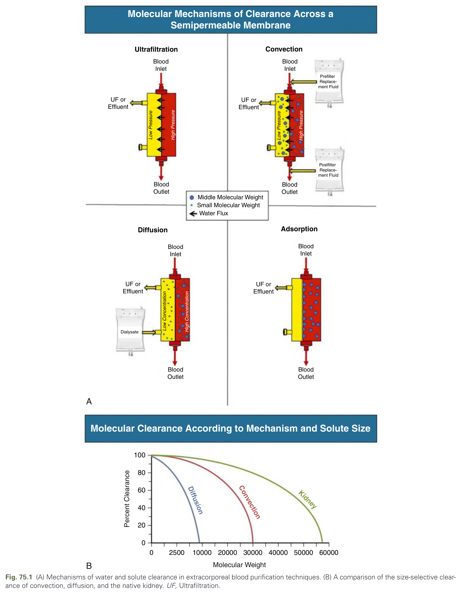

Fig. 75.1 (A) Mechanisms of water and solute clearance in extracorporeal blood purification techniques. (B) A comparison of the size-selective clearance of convection, diffusion, and the native kidney. UF, Ultrafiltration.

---

### Fig_75_2

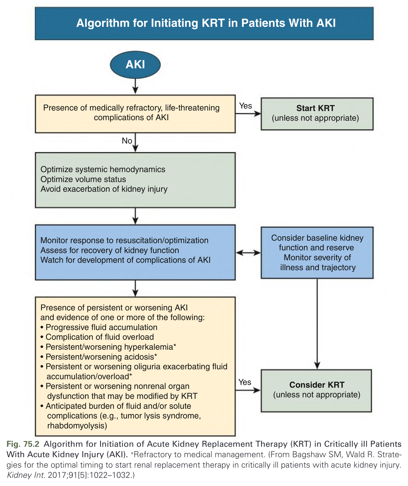

Fig. 75.2 Algorithm for Initiation of Acute Kidney Replacement Therapy (KRT) in Critically ill Patients With Acute Kidney Injury (AKI). *Refractory to medical management. (From Bagshaw SM, Wald R. Strategies for the optimal timing to start renal replacement therapy in critically ill patients with acute kidney injury. Kidney Int. 2017;91[5]:1022–1032.)

---

### Fig_75_3

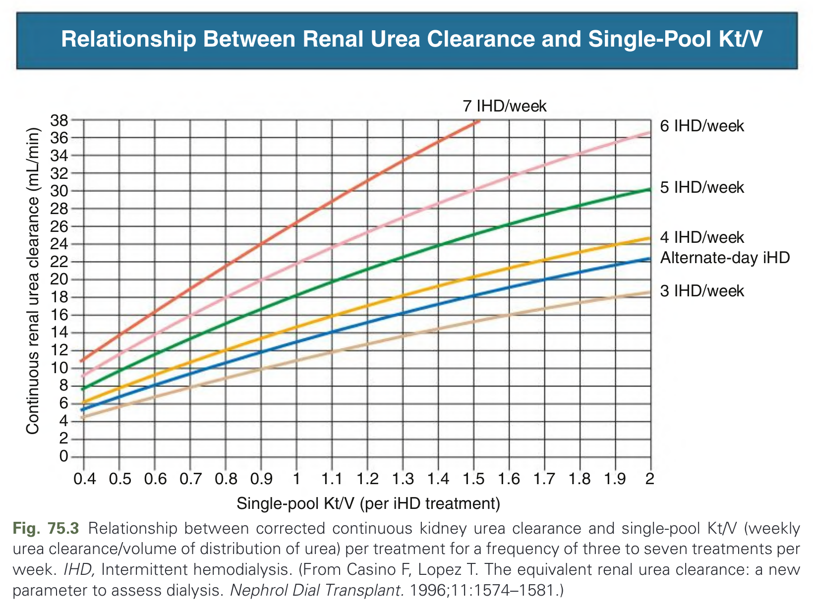

Fig. 75.3 Relationship between corrected continuous kidney urea clearance and single-pool Kt/V (weekly urea clearance/volume of distribution of urea) per treatment for a frequency of three to seven treatments per week. IHD, Intermittent hemodialysis. (From Casino F, Lopez T. The equivalent renal urea clearance: a new parameter to assess dialysis. Nephrol Dial Transplant. 1996;11:1574–1581.)

---

### Fig_75_4

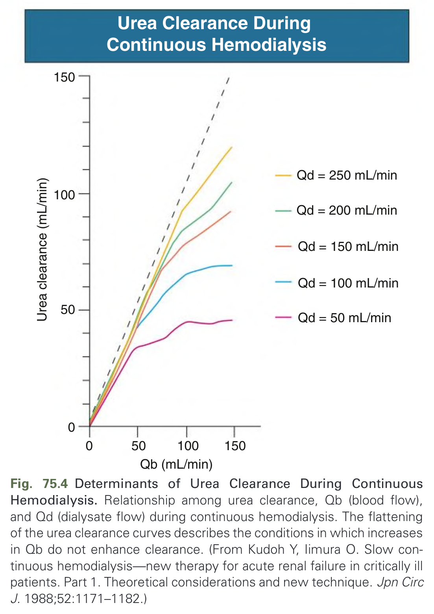

Fig. 75.4 Determinants of Urea Clearance During Continuous Hemodialysis. Relationship among urea clearance, Qb (blood flow), and Qd (dialysate flow) during continuous hemodialysis. The flattening of the urea clearance curves describes the conditions in which increases in Qb do not enhance clearance. (From Kudoh Y, Iimura O. Slow continuous hemodialysis—new therapy for acute renal failure in critically ill patients. Part 1. Theoretical considerations and new technique. Jpn Circ J. 1988;52:1171–1182.)

---

### Fig_75_5

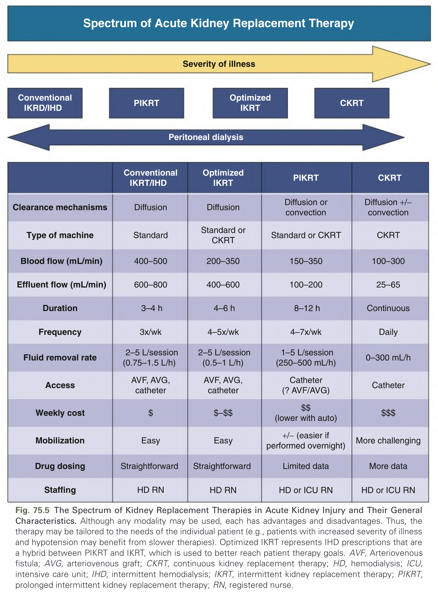

Fig. 75.5 The Spectrum of Kidney Replacement Therapies in Acute Kidney Injury and Their General Characteristics. Although any modality may be used, each has advantages and disadvantages. Thus, the therapy may be tailored to the needs of the individual patient (e.g., patients with increased severity of illness and hypotension may benefit from slower therapies). Optimized IKRT represents IHD prescriptions that are a hybrid between PIKRT and IKRT, which is used to better reach patient therapy goals. AVF, Arteriovenous fistula; AVG, arteriovenous graft; CKRT, continuous kidney replacement therapy; HD, hemodialysis; ICU, intensive care unit; IHD, intermittent hemodialysis; IKRT, intermittent kidney replacement therapy; PIKRT, prolonged intermittent kidney replacement therapy; RN, registered nurse.

---

### Fig_75_6

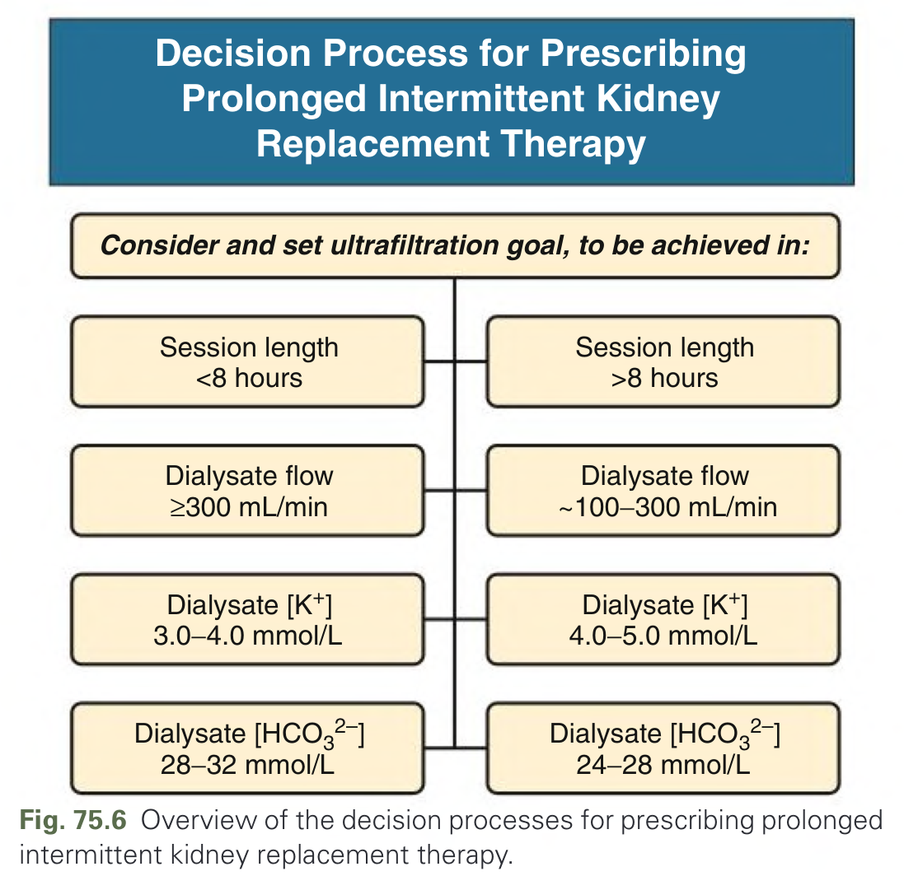

Fig. 75.6 Overview of the decision processes for prescribing prolonged intermittent kidney replacement therapy.

---

### Fig_75_7

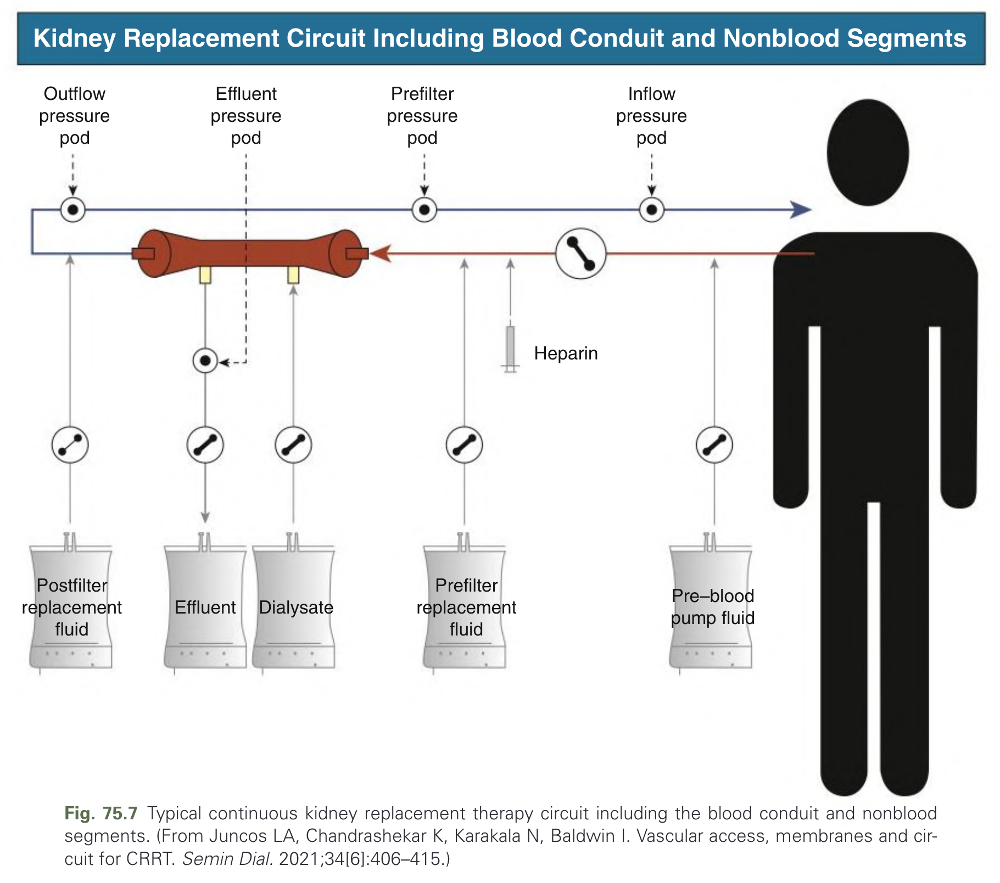

Fig. 75.7 Typical continuous kidney replacement therapy circuit including the blood conduit and nonblood segments. (From Juncos LA, Chandrashekar K, Karakala N, Baldwin I. Vascular access, membranes and circuit for CRRT. Semin Dial. 2021;34[6]:406–415.)

---

### Fig_75_8

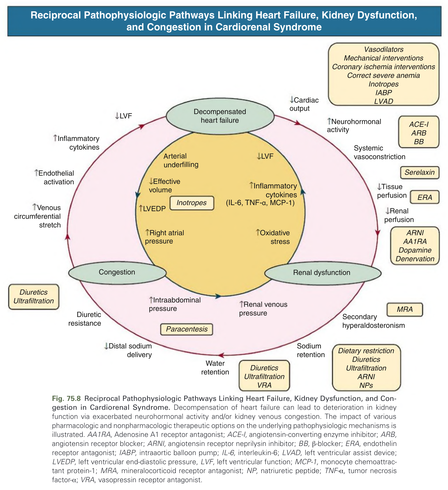

Fig. 75.8 Reciprocal Pathophysiologic Pathways Linking Heart Failure, Kidney Dysfunction, and Congestion in Cardiorenal Syndrome. Decompensation of heart failure can lead to deterioration in kidney function via exacerbated neurohormonal activity and/or kidney venous congestion. The impact of various pharmacologic and nonpharmacologic therapeutic options on the underlying pathophysiologic mechanisms is illustrated. AA1RA, Adenosine A1 receptor antagonist; ACE-I, angiotensin-converting enzyme inhibitor; ARB, angiotensin receptor blocker; ARNI, angiotensin receptor neprilysin inhibitor; BB, β-blocker; ERA, endothelin receptor antagonist; IABP, intraaortic balloon pump; IL-6, interleukin-6; LVAD, left ventricular assist device; LVEDP, left ventricular end-diastolic pressure, LVF, left ventricular function; MCP-1, monocyte chemoattractant protein-1; MRA, mineralocorticoid receptor antagonist; NP, natriuretic peptide; TNF-α, tumor necrosis factor-α; VRA, vasopressin receptor antagonist.

---

### Fig_75_9

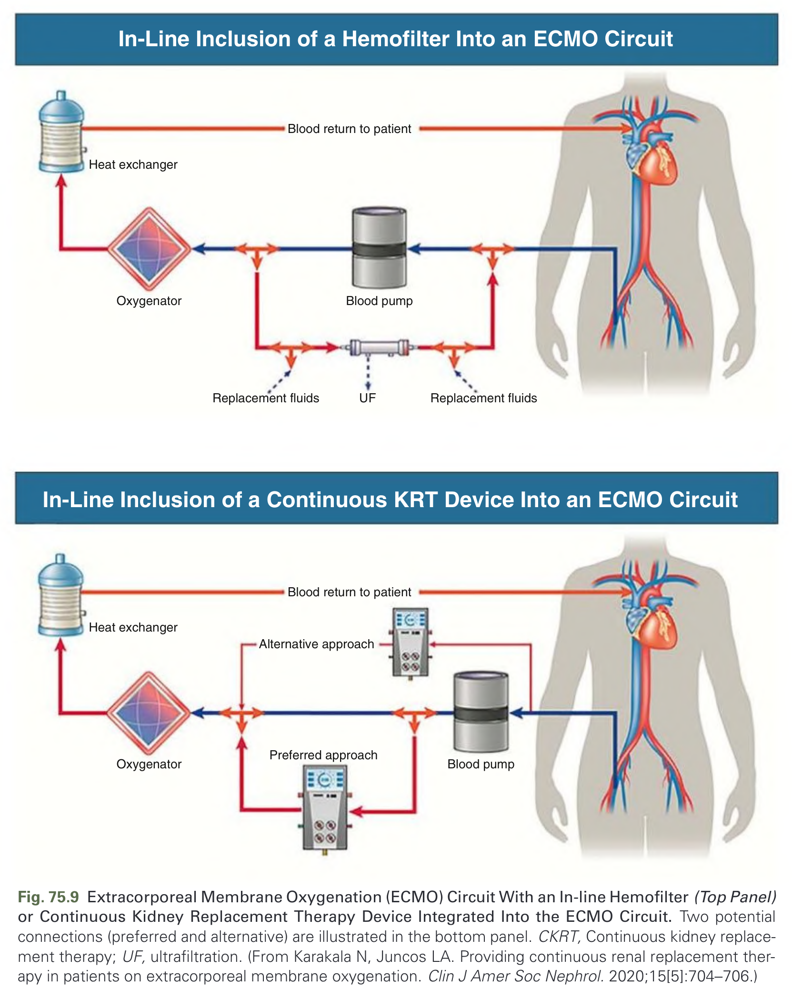

Fig. 75.9 Extracorporeal Membrane Oxygenation (ECMO) Circuit With an In-line Hemofilter (Top Panel) or Continuous Kidney Replacement Therapy Device Integrated Into the ECMO Circuit. Two potential connections (preferred and alternative) are illustrated in the bottom panel. CKRT, Continuous kidney replacement therapy; UF, ultrafiltration. (From Karakala N, Juncos LA. Providing continuous renal replacement therapy in patients on extracorporeal membrane oxygenation. Clin J Amer Soc Nephrol. 2020;15[5]:704–706.)

---

## Tables

### Table_75_1

#### Table Image

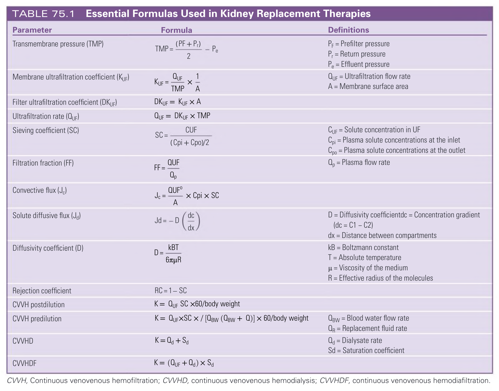

#### Table Data (CSV: [Table_75_1.csv](Table_75_1.csv))

```markdown
| Parameter | Formula | Definitions |
| :--- | :--- | :--- |
| Transmembrane pressure (TMP) | TMP = (PF + Pᵣ)/2 - Pₑ | P<sub>F</sub> = Prefilter pressure, Pᵣ = Return pressure, Pₑ = Effluent pressure |
| Membrane ultrafiltration coefficient (KUF) | KUF = QUF / (TMP x A) | Q<sub>UF</sub> = Ultrafiltration flow rate, A = Membrane surface area |
| Filter ultrafiltration coefficient (DKUF) | DKUF = KUF X A | |
| Ultrafiltration rate (QUF) | QUF = DKUF X TMP | |
| Sieving coefficient (SC) | SC = CUF / ((Cpi + Cpo)/2) | CUF = Solute concentration in UF, Cpi = Plasma solute concentrations at the inlet, Cpo = Plasma solute concentrations at the outlet |
| Filtration fraction (FF) | FF = QUF / Qp | Qₚ = Plasma flow rate |
| Convective flux (J<sub>c</sub>) | Jc = (QUFO / A) × Cpi x SC | |
| Solute diffusive flux (J<sub>d</sub>) | Jd = - D (dc/dx) | D = Diffusivity coefficientdc = Concentration gradient (dc = C1 - C2), dx = Distance between compartments |
| Diffusivity coefficient (D) | D = kBT / 6πμR | kB = Boltzmann constant, T = Absolute temperature, μ = Viscosity of the medium, R = Effective radius of the molecules |
| Rejection coefficient | RC=1-SC | |
| CVVH postdilution | K = QUF SC×60/body weight | |
| CVVH predilution | K= QUFXSC X/ [QBW (QBW + Q)] × 60/body weight | QBW = Blood water flow rate, QR = Replacement fluid rate |
| CVVHD | K = Qd + Sd | Q<sub>d</sub> = Dialysate rate, Sd = Saturation coefficient |
| CVVHDF | K= (QUF+Qd) × Sd | |
CVVH, Continuous venovenous hemofiltration; CVVHD, continuous venovenous hemodialysis; CVVHDF, continuous venovenous hemodiafiltration.
```

TABLE 75.1 Essential Formulas Used in Kidney Replacement Therapies

---

### Table_75_2

#### Table Image

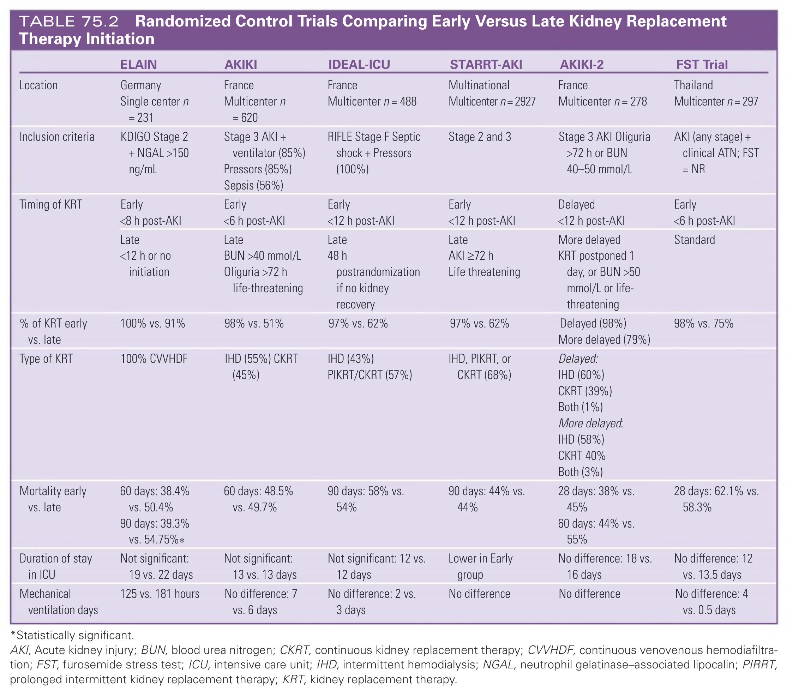

#### Table Data (CSV: [Table_75_2.csv](Table_75_2.csv))

```markdown
| | ELAIN | AKIKI | IDEAL-ICU | STARRT-AKI | AKIKI-2 | FST Trial |
| :--- | :--- | :--- | :--- | :--- | :--- | :--- |
| **Location** | Germany Single center n = 231 | France Multicenter n = 620 | France Multicenter n = 488 | Multinational Multicenter n = 2927 | France Multicenter n = 278 | Thailand Multicenter n = 297 |
| **Inclusion criteria** | KDIGO Stage 2 + NGAL >150 ng/mL | Stage 3 AKI + ventilator (85%) Pressors (85%) Sepsis (56%) | RIFLE Stage F Septic shock + Pressors (100%) | Stage 2 and 3 | Stage 3 AKI Oliguria >72 h or BUN 40-50 mmol/L | AKI (any stage) + clinical ATN; FST = NR |
| **Timing of KRT** | Early <8 h post-AKI; Late <12 h or no initiation | Early <6 h post-AKI; Late BUN >40 mmol/L Oliguria >72 h life-threatening | Early <12 h post-AKI; Late 48 h postrandomization if no kidney recovery | Early <12 h post-AKI; Late AKI ≥72 h Life threatening | Delayed <12 h post-AKI; More delayed KRT postponed 1 day, or BUN >50 mmol/L or life-threatening | Early <6 h post-AKI; Standard |
| **% of KRT early vs. late** | 100% vs. 91% | 98% vs. 51% | 97% vs. 62% | 97% vs. 62% | Delayed (98%); More delayed (79%) | 98% vs. 75% |
| **Type of KRT** | 100% CVVHDF | IHD (55%) CKRT (45%) | IHD (43%) PIKRT/CKRT (57%) | IHD, PIKRT, or CKRT (68%) | Delayed: IHD (60%), CKRT (39%), Both (1%); More delayed: IHD (58%), CKRT 40%, Both (3%) | |
| **Mortality early vs. late** | 60 days: 38.4% vs. 50.4%; 90 days: 39.3% vs. 54.75%* | 60 days: 48.5% vs. 49.7% | 90 days: 58% vs. 54% | 90 days: 44% vs. 44% | 28 days: 38% vs. 45%; 60 days: 44% vs. 55% | 28 days: 62.1% vs. 58.3% |
| **Duration of stay in ICU** | Not significant: 19 vs. 22 days | Not significant: 13 vs. 13 days | Not significant: 12 vs. 12 days | Lower in Early group | No difference: 18 vs. 16 days | No difference: 12 vs. 13.5 days |
| **Mechanical ventilation days** | 125 vs. 181 hours | No difference: 7 vs. 6 days | No difference: 2 vs. 3 days | No difference | No difference | No difference: 4 vs. 0.5 days |
*Statistically significant.
AKI, Acute kidney injury; BUN, blood urea nitrogen; CKRT, continuous kidney replacement therapy; CVVHDF, continuous venovenous hemodiafiltra- tion; FST, furosemide stress test; ICU, intensive care unit; IHD, intermittent hemodialysis; NGAL, neutrophil gelatinase-associated lipocalin; PIRRT, prolonged intermittent kidney replacement therapy; KRT, kidney replacement therapy.
```

TABLE 75.2 Randomized Control Trials Comparing Early Versus Late Kidney Replacement Therapy Initiation

---

### Table_75_3

#### Table Image

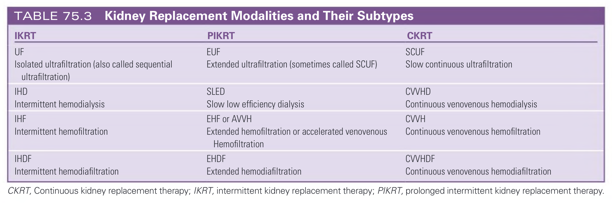

#### Table Data (CSV: [Table_75_3.csv](Table_75_3.csv))

```markdown
| IKRT | PIKRT | CKRT |
| :--- | :--- | :--- |
| **UF** | **EUF** | **SCUF** |
| Isolated ultrafiltration (also called sequential ultrafiltration) | Extended ultrafiltration (sometimes called SCUF) | Slow continuous ultrafiltration |
| **IHD** | **SLED** | **CVVHD** |
| Intermittent hemodialysis | Slow low efficiency dialysis | Continuous venovenous hemodialysis |
| **IHF** | **EHF or AVVH** | **CVVH** |
| Intermittent hemofiltration | Extended hemofiltration or accelerated venovenous Hemofiltration | Continuous venovenous hemofiltration |
| **IHDF** | **EHDF** | **CVVHDF** |
| Intermittent hemodiafiltration | Extended hemodiafiltration | Continuous venovenous hemodiafiltration |
CKRT, Continuous kidney replacement therapy; IKRT, intermittent kidney replacement therapy; PIKRT, prolonged intermittent kidney replacement therapy.
```

TABLE 75.3 Kidney Replacement Modalities and Their Subtypes

---

### Table_75_4

#### Table Image

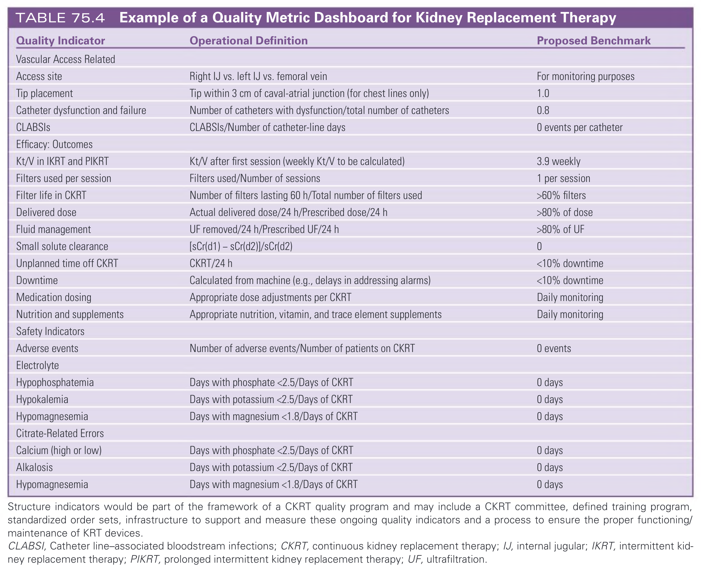

#### Table Data (CSV: [Table_75_4.csv](Table_75_4.csv))

```markdown
| Quality Indicator | Operational Definition | Proposed Benchmark |
| :--- | :--- | :--- |
| **Vascular Access Related** | | |
| Access site | Right IJ vs. left IJ vs. femoral vein | For monitoring purposes |
| Tip placement | Tip within 3 cm of caval-atrial junction (for chest lines only) | 1.0 |
| Catheter dysfunction and failure | Number of catheters with dysfunction/total number of catheters | 0.8 |
| CLABSIs | CLABSIs/Number of catheter-line days | 0 events per catheter |
| **Efficacy: Outcomes** | | |
| Kt/V in IKRT and PIKRT | Kt/V after first session (weekly Kt/V to be calculated) | 3.9 weekly |
| Filters used per session | Filters used/Number of sessions | 1 per session |
| Filter life in CKRT | Number of filters lasting 60 h/Total number of filters used | >60% filters |
| Delivered dose | Actual delivered dose/24 h/Prescribed dose/24 h | >80% of dose |
| Fluid management | UF removed/24 h/Prescribed UF/24 h | >80% of UF |
| Small solute clearance | [sCr(d1) - sCr(d2)]/sCr(d2) | 0 |
| Unplanned time off CKRT | CKRT/24 h | <10% downtime |
| Downtime | Calculated from machine (e.g., delays in addressing alarms) | <10% downtime |
| Medication dosing | Appropriate dose adjustments per CKRT | Daily monitoring |
| Nutrition and supplements | Appropriate nutrition, vitamin, and trace element supplements | Daily monitoring |
| **Safety Indicators** | | |
| Adverse events | Number of adverse events/Number of patients on CKRT | 0 events |
| **Electrolyte** | | |
| Hypophosphatemia | Days with phosphate <2.5/Days of CKRT | 0 days |
| Hypokalemia | Days with potassium <2.5/Days of CKRT | 0 days |
| Hypomagnesemia | Days with magnesium <1.8/Days of CKRT | 0 days |
| **Citrate-Related Errors** | | |
| Calcium (high or low) | Days with phosphate <2.5/Days of CKRT | 0 days |
| Alkalosis | Days with potassium <2.5/Days of CKRT | 0 days |
| Hypomagnesemia | Days with magnesium <1.8/Days of CKRT | 0 days |
Structure indicators would be part of the framework of a CKRT quality program and may include a CKRT committee, defined training program, standardized order sets, infrastructure to support and measure these ongoing quality indicators and a process to ensure the proper functioning/ maintenance of KRT devices.
CLABSI, Catheter line-associated bloodstream infections; CKRT, continuous kidney replacement therapy; IJ, internal jugular; IKRT, intermittent kidney replacement therapy; PIKRT, prolonged intermittent kidney replacement therapy; UF, ultrafiltration.
```

TABLE 75.4 Example of a Quality Metric Dashboard for Kidney Replacement Therapy

---

### Table_75_5

#### Table Image

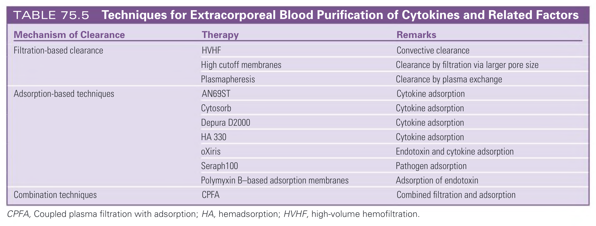

#### Table Data (CSV: [Table_75_5.csv](Table_75_5.csv))

```markdown
| Mechanism of Clearance | Therapy | Remarks |
| :--- | :--- | :--- |
| Filtration-based clearance | HVHF | Convective clearance |
| | High cutoff membranes | Clearance by filtration via larger pore size |
| | Plasmapheresis | Clearance by plasma exchange |
| Adsorption-based techniques | AN69ST | Cytokine adsorption |
| | Cytosorb | Cytokine adsorption |
| | Depura D2000 | Cytokine adsorption |
| | HA 330 | Cytokine adsorption |
| | oXiris | Endotoxin and cytokine adsorption |
| | Seraph100 | Pathogen adsorption |
| | Polymyxin B-based adsorption membranes | Adsorption of endotoxin |
| Combination techniques | CPFA | Combined filtration and adsorption |
CPFA, Coupled plasma filtration with adsorption; HA, hemadsorption; HVHF, high-volume hemofiltration.
```

TABLE 75.5 Techniques for Extracorporeal Blood Purification of Cytokines and Related Factors

---

### Table_75_6

#### Table Image

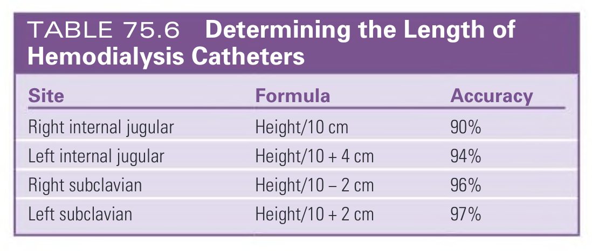

#### Table Data (CSV: [Table_75_6.csv](Table_75_6.csv))

```markdown
| Site | Formula | Accuracy |
| :--- | :--- | :--- |
| Right internal jugular | Height/10 cm | 90% |
| Left internal jugular | Height/10 + 4 cm | 94% |
| Right subclavian | Height/10 - 2 cm | 96% |
| Left subclavian | Height/10 + 2 cm | 97% |
```

TABLE 75.6 Determining the Length of Hemodialysis Catheters

---

## Boxes

### Box_75_1

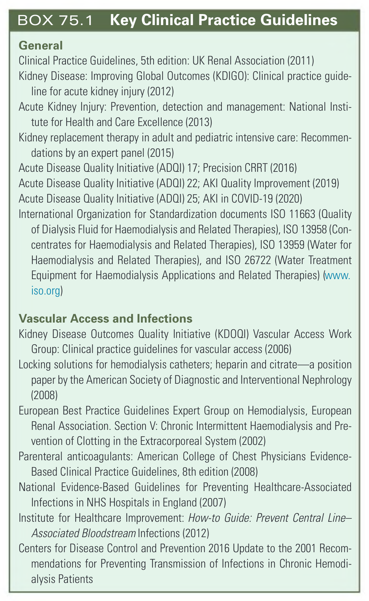

#### Box Text

```markdown
**General**
Clinical Practice Guidelines, 5th edition: UK Renal Association (2011)
Kidney Disease: Improving Global Outcomes (KDIGO): Clinical practice guideline for acute kidney injury (2012)
Acute Kidney Injury: Prevention, detection and management: National Institute for Health and Care Excellence (2013)
Kidney replacement therapy in adult and pediatric intensive care: Recommendations by an expert panel (2015)
Acute Disease Quality Initiative (ADQI) 17; Precision CRRT (2016)
Acute Disease Quality Initiative (ADQI) 22; AKI Quality Improvement (2019)
Acute Disease Quality Initiative (ADQI) 25; AKI in COVID-19 (2020)
International Organization for Standardization documents ISO 11663 (Quality of Dialysis Fluid for Haemodialysis and Related Therapies), ISO 13958 (Concentrates for Haemodialysis and Related Therapies), ISO 13959 (Water for Haemodialysis and Related Therapies), and ISO 26722 (Water Treatment Equipment for Haemodialysis Applications and Related Therapies) (www.iso.org)

**Vascular Access and Infections**
Kidney Disease Outcomes Quality Initiative (KDOQI) Vascular Access Work Group: Clinical practice guidelines for vascular access (2006)
Locking solutions for hemodialysis catheters; heparin and citrate a position paper by the American Society of Diagnostic and Interventional Nephrology (2008)
European Best Practice Guidelines Expert Group on Hemodialysis, European Renal Association. Section V: Chronic Intermittent Haemodialysis and Prevention of Clotting in the Extracorporeal System (2002)
Parenteral anticoagulants: American College of Chest Physicians Evidence-Based Clinical Practice Guidelines, 8th edition (2008)
National Evidence-Based Guidelines for Preventing Healthcare-Associated Infections in NHS Hospitals in England (2007)
Institute for Healthcare Improvement: How-to Guide: Prevent Central Line-Associated Bloodstream Infections (2012)
Centers for Disease Control and Prevention 2016 Update to the 2001 Recommendations for Preventing Transmission of Infections in Chronic Hemodialysis Patients
```

BOX 75.1 Key Clinical Practice Guidelines

---

### Box_75_2

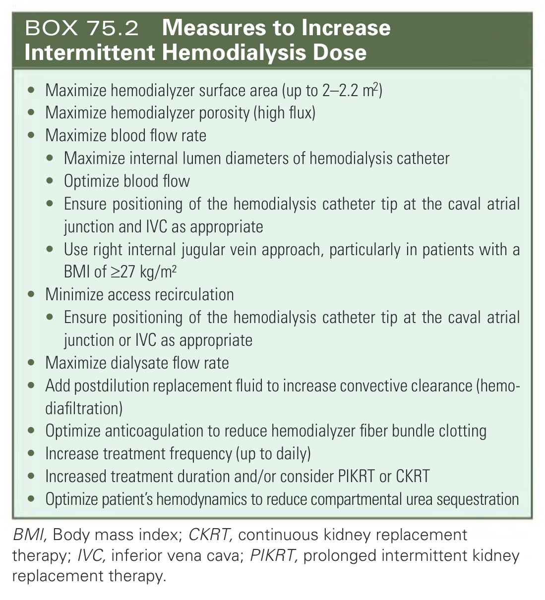

#### Box Text

```markdown
* Maximize hemodialyzer surface area (up to 2-2.2 m²)
* Maximize hemodialyzer porosity (high flux)
* Maximize blood flow rate
    * Maximize internal lumen diameters of hemodialysis catheter
    * Optimize blood flow
    * Ensure positioning of the hemodialysis catheter tip at the caval atrial junction and IVC as appropriate
    * Use right internal jugular vein approach, particularly in patients with a BMI of ≥27 kg/m²
* Minimize access recirculation
    * Ensure positioning of the hemodialysis catheter tip at the caval atrial junction or IVC as appropriate
* Maximize dialysate flow rate
* Add postdilution replacement fluid to increase convective clearance (hemodiafiltration)
* Optimize anticoagulation to reduce hemodialyzer fiber bundle clotting
* Increase treatment frequency (up to daily)
* Increased treatment duration and/or consider PIKRT or CKRT
* Optimize patient's hemodynamics to reduce compartmental urea sequestration
BMI, Body mass index; CKRT, continuous kidney replacement therapy; IVC, inferior vena cava; PIKRT, prolonged intermittent kidney replacement therapy.
```

BOX 75.2 Measures to Increase Intermittent Hemodialysis Dose

---

### Box_75_3

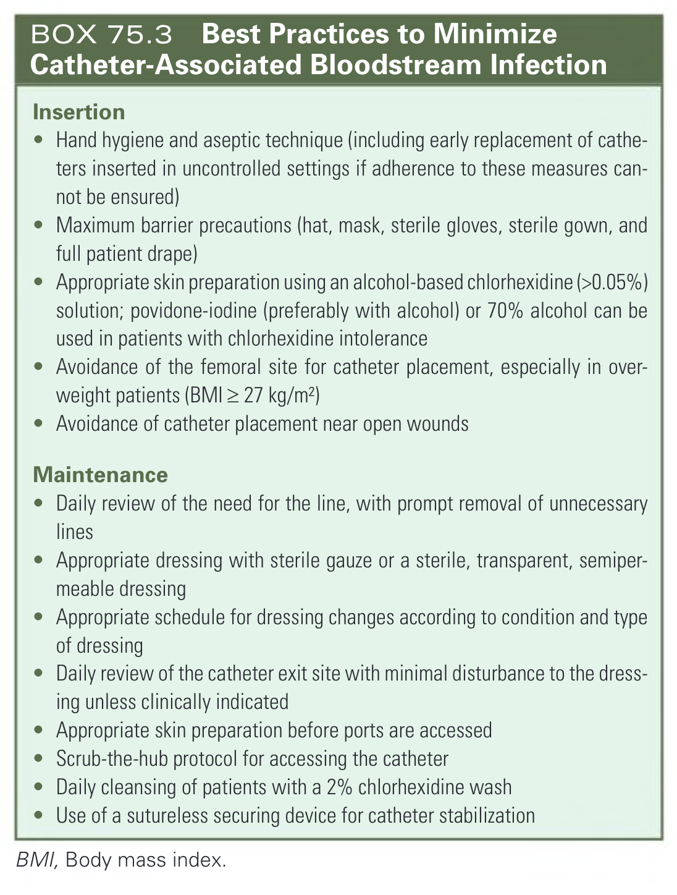

#### Box Text

```markdown
**Insertion**
* Hand hygiene and aseptic technique (including early replacement of catheters inserted in uncontrolled settings if adherence to these measures cannot be ensured)
* Maximum barrier precautions (hat, mask, sterile gloves, sterile gown, and full patient drape)
* Appropriate skin preparation using an alcohol-based chlorhexidine (>0.05%) solution; povidone-iodine (preferably with alcohol) or 70% alcohol can be used in patients with chlorhexidine intolerance
* Avoidance of the femoral site for catheter placement, especially in overweight patients (BMI ≥ 27 kg/m²)
* Avoidance of catheter placement near open wounds

**Maintenance**
* Daily review of the need for the line, with prompt removal of unnecessary lines
* Appropriate dressing with sterile gauze or a sterile, transparent, semipermeable dressing
* Appropriate schedule for dressing changes according to condition and type of dressing
* Daily review of the catheter exit site with minimal disturbance to the dressing unless clinically indicated
* Appropriate skin preparation before ports are accessed
* Scrub-the-hub protocol for accessing the catheter
* Daily cleansing of patients with a 2% chlorhexidine wash
* Use of a sutureless securing device for catheter stabilization
BMI, Body mass index.
```

BOX 75.3 Best Practices to Minimize Catheter-Associated Bloodstream Infection

---
