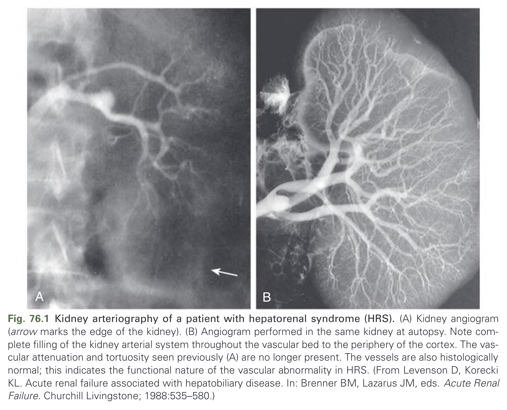
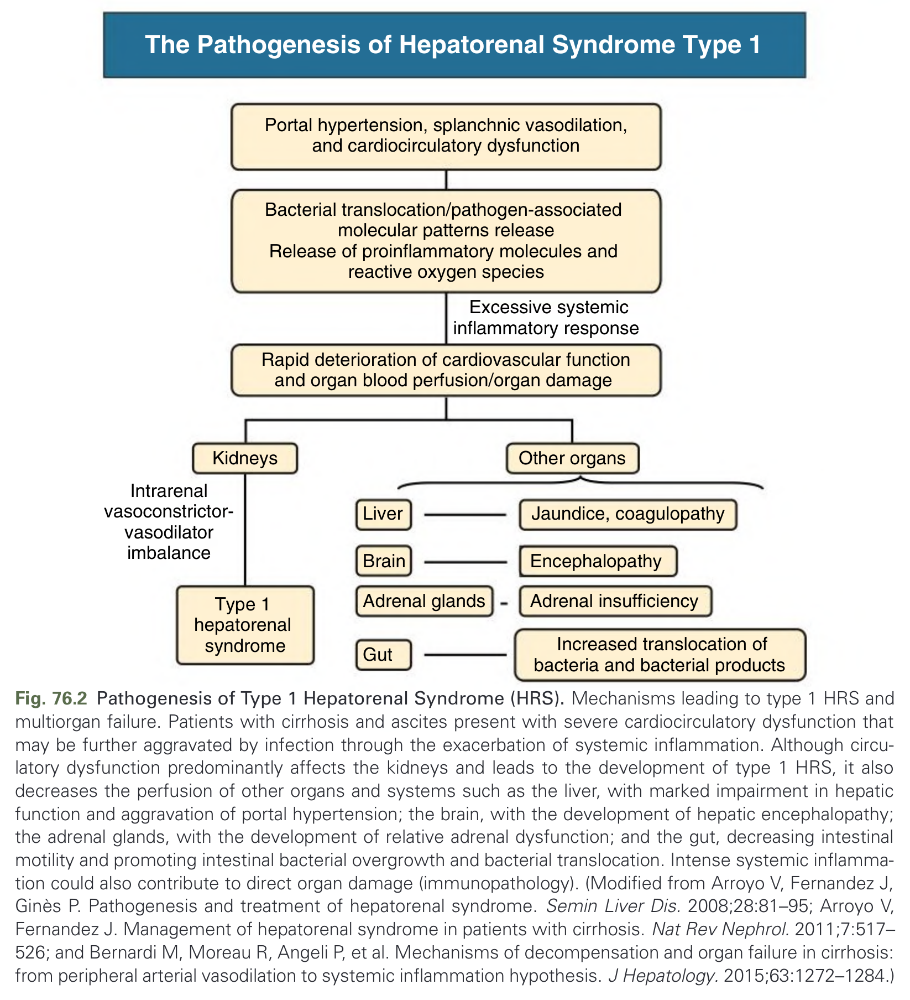
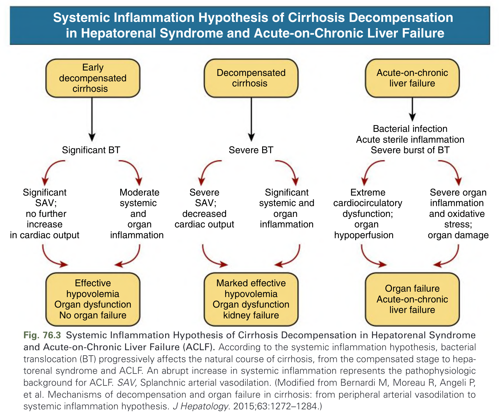
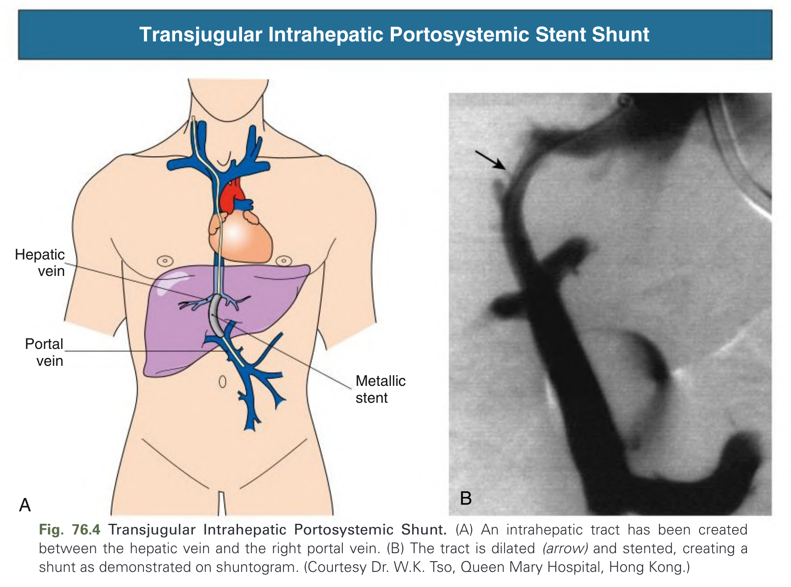
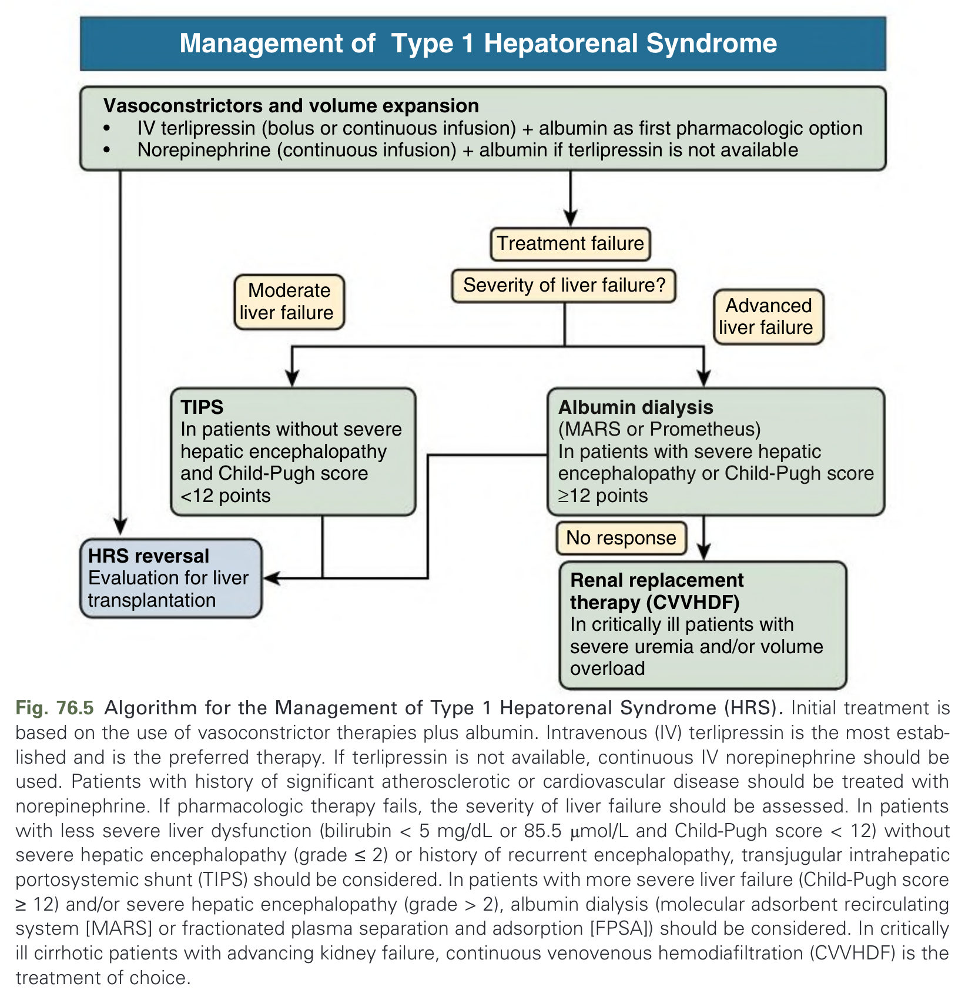
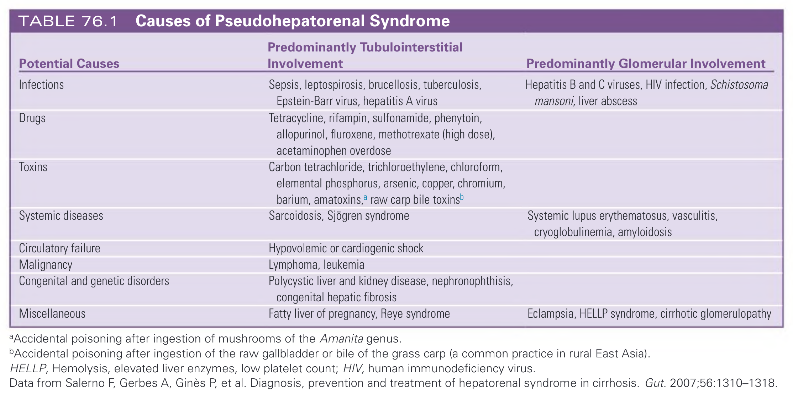
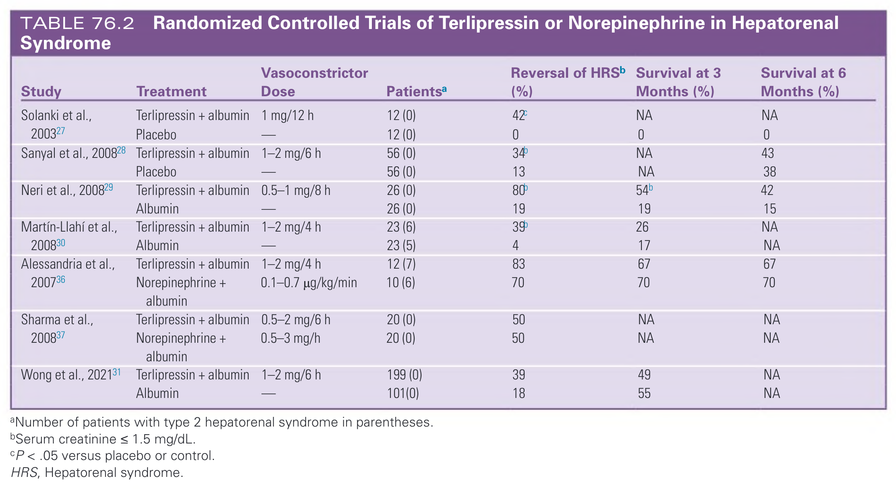
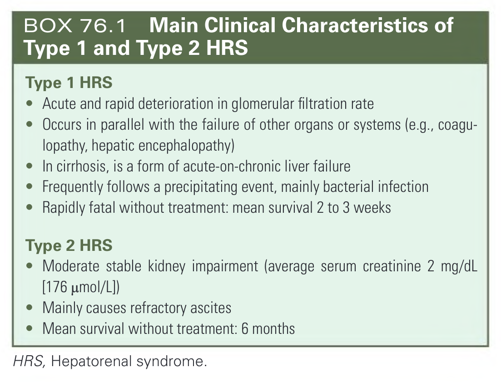
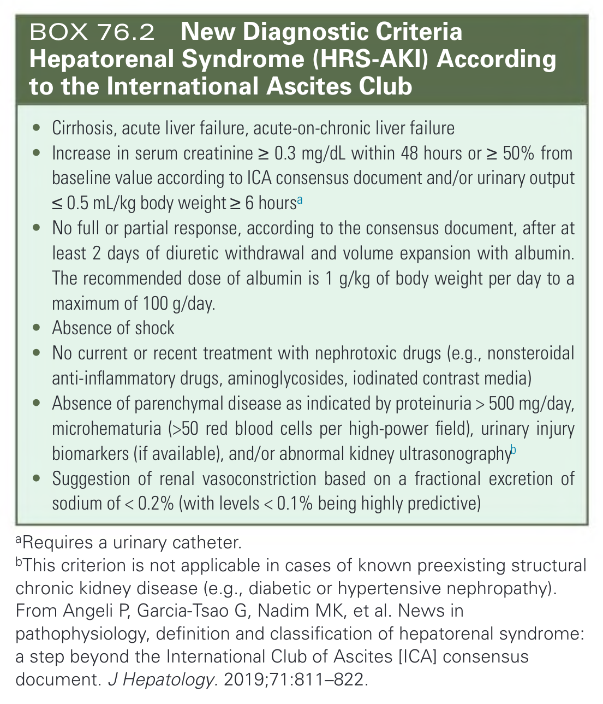
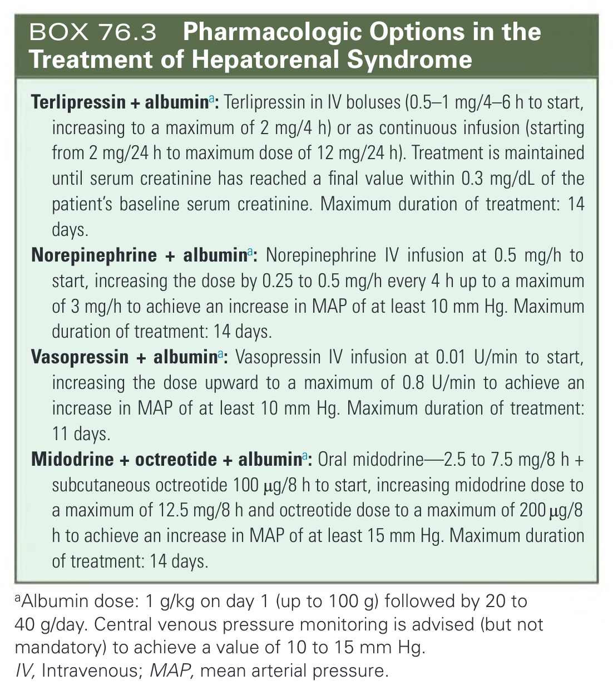

# 076. Hepatorenal Syndrome - Figures and Tables Index

This document lists all figures, tables and boxes extracted from `076. Hepatorenal Syndrome.pdf`.

## Table of Contents
- [Figures](#figures)
- [Tables](#tables)
- [Boxes](#boxes)

---

## Figures

### Fig_76_1



Fig. 76.1 Kidney arteriography of a patient with hepatorenal syndrome (HRS). (A) Kidney angiogram (arrow marks the edge of the kidney). (B) Angiogram performed in the same kidney at autopsy. Note complete filling of the kidney arterial system throughout the vascular bed to the periphery of the cortex. The vascular attenuation and tortuosity seen previously (A) are no longer present. The vessels are also histologically normal; this indicates the functional nature of the vascular abnormality in HRS. (From Levenson D, Korecki KL. Acute renal failure associated with hepatobiliary disease. In: Brenner BM, Lazarus JM, eds. Acute Renal Failure. Churchill Livingstone; 1988:535–580.)

---

### Fig_76_2



Fig. 76.2 Pathogenesis of Type 1 Hepatorenal Syndrome (HRS). Mechanisms leading to type 1 HRS and multiorgan failure. Patients with cirrhosis and ascites present with severe cardiocirculatory dysfunction that may be further aggravated by infection through the exacerbation of systemic inflammation. Although circulatory dysfunction predominantly affects the kidneys and leads to the development of type 1 HRS, it also decreases the perfusion of other organs and systems such as the liver, with marked impairment in hepatic function and aggravation of portal hypertension; the brain, with the development of hepatic encephalopathy; the adrenal glands, with the development of relative adrenal dysfunction; and the gut, decreasing intestinal motility and promoting intestinal bacterial overgrowth and bacterial translocation. Intense systemic inflammation could also contribute to direct organ damage (immunopathology). (Modified from Arroyo V, Fernandez J, Ginés P. Pathogenesis and treatment of hepatorenal syndrome. Semin Liver Dis. 2008;28:81–95; Arroyo V, Fernandez J. Management of hepatorenal syndrome in patients with cirrhosis. Nat Rev Nephrol. 2011;7:517–526; and Bernardi M, Moreau R, Angeli P, et al. Mechanisms of decompensation and organ failure in cirrhosis: from peripheral arterial vasodilation to systemic inflammation hypothesis. J Hepatology. 2015;63:1272–1284.)

---

### Fig_76_3



Fig. 76.3 Systemic Inflammation Hypothesis of Cirrhosis Decompensation in Hepatorenal Syndrome and Acute-on-Chronic Liver Failure (ACLF). According to the systemic inflammation hypothesis, bacterial translocation (BT) progressively affects the natural course of cirrhosis, from the compensated stage to hepatorenal syndrome and ACLF. An abrupt increase in systemic inflammation represents the pathophysiologic background for ACLF. SAV, Splanchnic arterial vasodilation. (Modified from Bernardi M, Moreau R, Angeli P, et al. Mechanisms of decompensation and organ failure in cirrhosis: from peripheral arterial vasodilation to systemic inflammation hypothesis. J Hepatology. 2015;63:1272–1284.)

---

### Fig_76_4



Fig. 76.4 Transjugular Intrahepatic Portosystemic Shunt. (A) An intrahepatic tract has been created between the hepatic vein and the right portal vein. (B) The tract is dilated (arrow) and stented, creating a shunt as demonstrated on shuntogram. (Courtesy Dr. W.K. Tso, Queen Mary Hospital, Hong Kong.)

---

### Fig_76_5



Fig. 76.5 Algorithm for the Management of Type 1 Hepatorenal Syndrome (HRS). Initial treatment is based on the use of vasoconstrictor therapies plus albumin. Intravenous (IV) terlipressin is the most established and is the preferred therapy. If terlipressin is not available, continuous IV norepinephrine should be used. Patients with history of significant atherosclerotic or cardiovascular disease should be treated with norepinephrine. If pharmacologic therapy fails, the severity of liver failure should be assessed. In patients with less severe liver dysfunction (bilirubin < 5 mg/dL or 85.5 μmol/L and Child-Pugh score < 12) without severe hepatic encephalopathy (grade ≤ 2) or history of recurrent encephalopathy, transjugular intrahepatic portosystemic shunt (TIPS) should be considered. In patients with more severe liver failure (Child-Pugh score ≥ 12) and/or severe hepatic encephalopathy (grade > 2), albumin dialysis (molecular adsorbent recirculating system [MARS] or fractionated plasma separation and adsorption [FPSA]) should be considered. In critically ill cirrhotic patients with advancing kidney failure, continuous venovenous hemodiafiltration (CVVHDF) is the treatment of choice.

---

## Tables

### Table_76_1

#### Table Image



#### Table Data (CSV: [Table_76_1.csv](Table_76_1.csv))

```markdown
| Potential Causes | Predominantly Tubulointerstitial Involvement | Predominantly Glomerular Involvement |
| :--- | :--- | :--- |
| **Infections** | Sepsis, leptospirosis, brucellosis, tuberculosis, Epstein-Barr virus, hepatitis A virus | Hepatitis B and C viruses, HIV infection, Schistosoma mansoni, liver abscess |
| **Drugs** | Tetracycline, rifampin, sulfonamide, phenytoin, allopurinol, fluroxene, methotrexate (high dose), acetaminophen overdose | |
| **Toxins** | Carbon tetrachloride, trichloroethylene, chloroform, elemental phosphorus, arsenic, copper, chromium, barium, amatoxins,^a raw carp bile toxins^b | |
| **Systemic diseases** | Sarcoidosis, Sjögren syndrome | Systemic lupus erythematosus, vasculitis, cryoglobulinemia, amyloidosis |
| **Circulatory failure** | Hypovolemic or cardiogenic shock | |
| **Malignancy** | Lymphoma, leukemia | |
| **Congenital and genetic disorders** | Polycystic liver and kidney disease, nephronophthisis, congenital hepatic fibrosis | |
| **Miscellaneous** | Fatty liver of pregnancy, Reye syndrome | Eclampsia, HELLP syndrome, cirrhotic glomerulopathy |

aAccidental poisoning after ingestion of mushrooms of the Amanita genus.
bAccidental poisoning after ingestion of the raw gallbladder or bile of the grass carp (a common practice in rural East Asia).
HELLP, Hemolysis, elevated liver enzymes, low platelet count; HIV, human immunodeficiency virus.
Data from Salerno F, Gerbes A, Ginès P, et al. Diagnosis, prevention and treatment of hepatorenal syndrome in cirrhosis. Gut. 2007;56:1310-1318.
```

TABLE 76.1 Causes of Pseudohepatorenal Syndrome

---

### Table_76_2

#### Table Image



#### Table Data (CSV: [Table_76_2.csv](Table_76_2.csv))

```markdown
| Study | Treatment | Vasoconstrictor Dose | Patients^a | Reversal of HRS^b (%) | Survival at 3 Months (%) | Survival at 6 Months (%) |
| :--- | :--- | :--- | :--- | :--- | :--- | :--- |
| Solanki et al., 2003 | Terlipressin + albumin | 1 mg/12 h | 12 (0) | 42^c | NA | NA |
| | Placebo | | 12 (0) | 0 | 0 | 0 |
| Sanyal et al., 2008 | Terlipressin + albumin | 1-2 mg/6 h | 56 (0) | 34^b | NA | 43 |
| | Placebo | | 56 (0) | 13 | NA | 38 |
| Neri et al., 2008 | Terlipressin + albumin | 0.5-1 mg/8 h | 26 (0) | 80^b | 54^b | 42 |
| | Albumin | | 26 (0) | 19 | 19 | 15 |
| Martín-Llahí et al., 2008 | Terlipressin + albumin | 1-2 mg/4 h | 23 (6) | 39^b | 26 | NA |
| | Albumin | | 23 (5) | 4 | 17 | NA |
| Alessandria et al., 2007 | Terlipressin + albumin | 1-2 mg/4 h | 12 (7) | 83 | 67 | 67 |
| | Norepinephrine + albumin | 0.1-0.7 µg/kg/min | 10 (6) | 70 | 70 | 70 |
| Sharma et al., 2008 | Terlipressin + albumin | 0.5-2 mg/6 h | 20 (0) | 50 | NA | NA |
| | Norepinephrine + albumin | 0.5-3 mg/h | 20 (0) | 50 | NA | NA |
| Wong et al., 2021 | Terlipressin + albumin | 1-2 mg/6 h | 199 (0) | 39 | 49 | NA |
| | Albumin | | 101(0) | 18 | 55 | NA |

aNumber of patients with type 2 hepatorenal syndrome in parentheses.
bSerum creatinine ≤ 1.5 mg/dL.
cP < .05 versus placebo or control.
HRS, Hepatorenal syndrome.
```

TABLE 76.2 Randomized Controlled Trials of Terlipressin or Norepinephrine in Hepatorenal Syndrome

---

## Boxes

### Box_76_1



#### Box Text

```markdown
**Type 1 HRS**
*   Acute and rapid deterioration in glomerular filtration rate
*   Occurs in parallel with the failure of other organs or systems (e.g., coagulopathy, hepatic encephalopathy)
*   In cirrhosis, is a form of acute-on-chronic liver failure
*   Frequently follows a precipitating event, mainly bacterial infection
*   Rapidly fatal without treatment: mean survival 2 to 3 weeks

**Type 2 HRS**
*   Moderate stable kidney impairment (average serum creatinine 2 mg/dL [176 µmol/L])
*   Mainly causes refractory ascites
*   Mean survival without treatment: 6 months

HRS, Hepatorenal syndrome.
```

BOX 76.1 Main Clinical Characteristics of Type 1 and Type 2 HRS

---

### Box_76_2



#### Box Text

```markdown
*   Cirrhosis, acute liver failure, acute-on-chronic liver failure
*   Increase in serum creatinine ≥ 0.3 mg/dL within 48 hours or ≥ 50% from baseline value according to ICA consensus document and/or urinary output ≤ 0.5 mL/kg body weight ≥ 6 hoursa
*   No full or partial response, according to the consensus document, after at least 2 days of diuretic withdrawal and volume expansion with albumin. The recommended dose of albumin is 1 g/kg of body weight per day to a maximum of 100 g/day.
*   Absence of shock
*   No current or recent treatment with nephrotoxic drugs (e.g., nonsteroidal anti-inflammatory drugs, aminoglycosides, iodinated contrast media)
*   Absence of parenchymal disease as indicated by proteinuria > 500 mg/day, microhematuria (>50 red blood cells per high-power field), urinary injury biomarkers (if available), and/or abnormal kidney ultrasonography
*   Suggestion of renal vasoconstriction based on a fractional excretion of sodium of < 0.2% (with levels < 0.1% being highly predictive)

aRequires a urinary catheter.
bThis criterion is not applicable in cases of known preexisting structural chronic kidney disease (e.g., diabetic or hypertensive nephropathy).
From Angeli P, Garcia-Tsao G, Nadim MK, et al. News in pathophysiology, definition and classification of hepatorenal syndrome: a step beyond the International Club of Ascites [ICA] consensus document. J Hepatology. 2019;71:811-822.
```

BOX 76.2 New Diagnostic Criteria Hepatorenal Syndrome (HRS-AKI) According to the International Ascites Club

---

### Box_76_3



#### Box Text

```markdown
**Terlipressin + albumin^a:** Terlipressin in IV boluses (0.5-1 mg/4-6 h to start, increasing to a maximum of 2 mg/4 h) or as continuous infusion (starting from 2 mg/24 h to maximum dose of 12 mg/24 h). Treatment is maintained until serum creatinine has reached a final value within 0.3 mg/dL of the patient's baseline serum creatinine. Maximum duration of treatment: 14 days.

**Norepinephrine + albumin^a:** Norepinephrine IV infusion at 0.5 mg/h to start, increasing the dose by 0.25 to 0.5 mg/h every 4 h up to a maximum of 3 mg/h to achieve an increase in MAP of at least 10 mm Hg. Maximum duration of treatment: 14 days.

**Vasopressin + albumin^a:** Vasopressin IV infusion at 0.01 U/min to start, increasing the dose upward to a maximum of 0.8 U/min to achieve an increase in MAP of at least 10 mm Hg. Maximum duration of treatment: 11 days.

**Midodrine + octreotide + albumin^a:** Oral midodrine-2.5 to 7.5 mg/8 h + subcutaneous octreotide 100 µg/8 h to start, increasing midodrine dose to a maximum of 12.5 mg/8 h and octreotide dose to a maximum of 200 μg/8 h to achieve an increase in MAP of at least 15 mm Hg. Maximum duration of treatment: 14 days.

aAlbumin dose: 1 g/kg on day 1 (up to 100 g) followed by 20 to 40 g/day. Central venous pressure monitoring is advised (but not mandatory) to achieve a value of 10 to 15 mm Hg.
IV, Intravenous; MAP, mean arterial pressure.
```

BOX 76.3 Pharmacologic Options in the Treatment of Hepatorenal Syndrome

---
