# 077. Principles of Drug Therapy, Dosing, and Prescribing in Chronic Kidney Disease and Kidney Replacement Therapy - Figures and Tables Index

This document lists all figures, tables and boxes extracted from `077. Principles of Drug Therapy, Dosing, and Prescribing in Chronic Kidney Disease and Kidney Replacement Therapy.pdf`.

## Table of Contents
- [Figures](#figures)
- [Tables](#tables)
- [Boxes](#boxes)

---

## Figures

### Fig_77_1

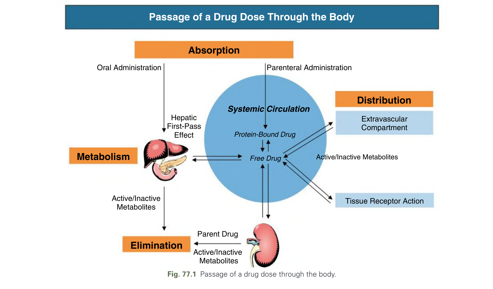

Fig. 77.1 Passage of a drug dose through the body.

---

### Fig_77_2

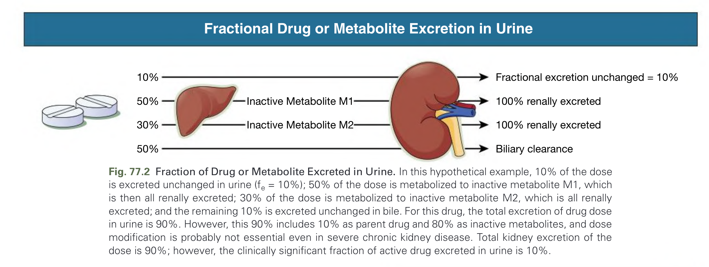

Fig. 77.2 Fraction of Drug or Metabolite Excreted in Urine. In this hypothetical example, 10% of the dose is excreted unchanged in urine (fe = 10%); 50% of the dose is metabolized to inactive metabolite M1, which is then all renally excreted; 30% of the dose is metabolized to inactive metabolite M2, which is all renally excreted; and the remaining 10% is excreted unchanged in bile. For this drug, the total excretion of drug dose in urine is 90% (10% + 50% + 30%), but the elimination of the active parent drug is only 10% dependent on kidney clearance.

---

### Fig_77_3

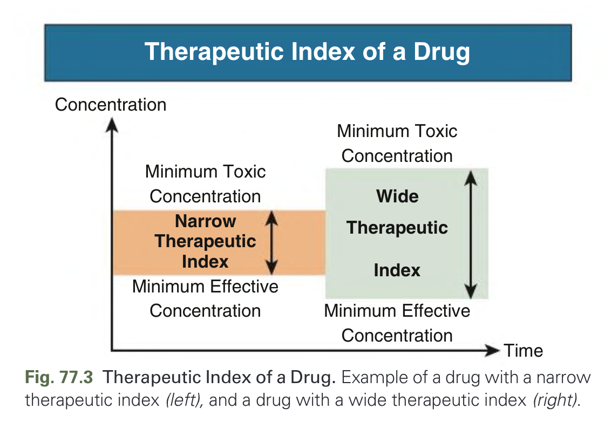

Fig. 77.3 Therapeutic Index of a Drug. Example of a drug with a narrow therapeutic index (left), and a drug with a wide therapeutic index (right).

---

### Fig_77_4

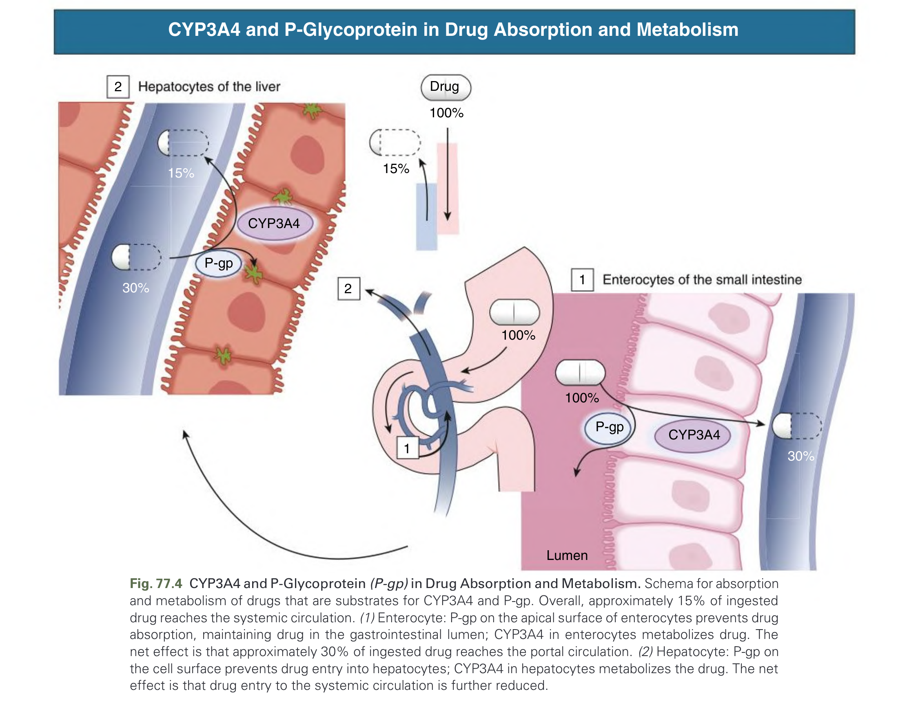

Fig. 77.4 CYP3A4 and P-Glycoprotein (P-gp) in Drug Absorption and Metabolism. Schema for absorption and metabolism of drugs that are substrates for CYP3A4 and P-gp. Overall, approximately 15% of ingested drug reaches the systemic circulation. (1) Enterocyte: P-gp on the apical surface of enterocytes prevents drug absorption, maintaining drug in the gastrointestinal lumen; CYP3A4 in enterocytes metabolizes drug. The remaining drug enters portal circulation. (2) Hepatocyte: CYP3A4 in hepatocytes metabolizes drug; P-gp on canalicular membrane pumps drug into bile. (3) Systemic circulation. GI, Gastrointestinal.

---

### Fig_77_5

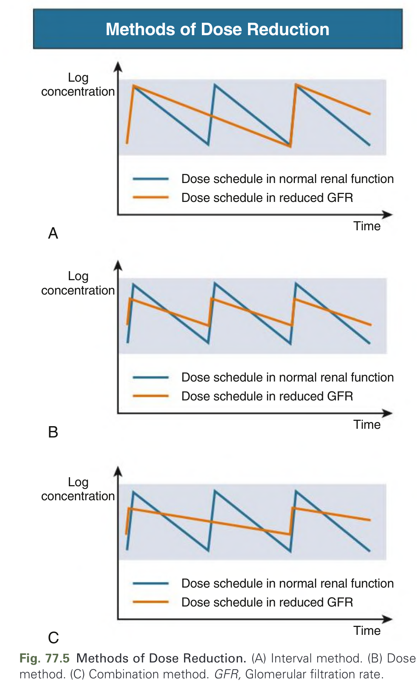

Fig. 77.5 Methods of Dose Reduction. (A) Interval method. (B) Dose method. (C) Combination method. GFR, Glomerular filtration rate.

---

## Tables

### Table_77_1

#### Table Image

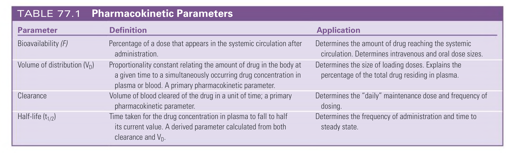

#### Table Data (CSV: [Table_77_1.csv](Table_77_1.csv))

```markdown
| Parameter | Definition | Application |
| :--- | :--- | :--- |
| Bioavailability (F) | Percentage of a dose that appears in the systemic circulation after administration. | Determines the amount of drug reaching the systemic circulation. Determines intravenous and oral dose sizes. |
| Volume of distribution (VD) | Proportionality constant relating the amount of drug in the body at a given time to a simultaneously occurring drug concentration in plasma or blood. A primary pharmacokinetic parameter. | Determines the size of loading doses. Explains the percentage of the total drug residing in plasma. |
| Clearance | Volume of blood cleared of the drug in a unit of time; a primary pharmacokinetic parameter. | Determines the "daily" maintenance dose and frequency of dosing. |
| Half-life (t1/2) | Time taken for the drug concentration in plasma to fall to half its current value. A derived parameter calculated from both clearance and VD. | Determines the frequency of administration and time to steady state. |
```

TABLE 77.1 Pharmacokinetic Parameters

---

### Table_77_2

#### Table Image

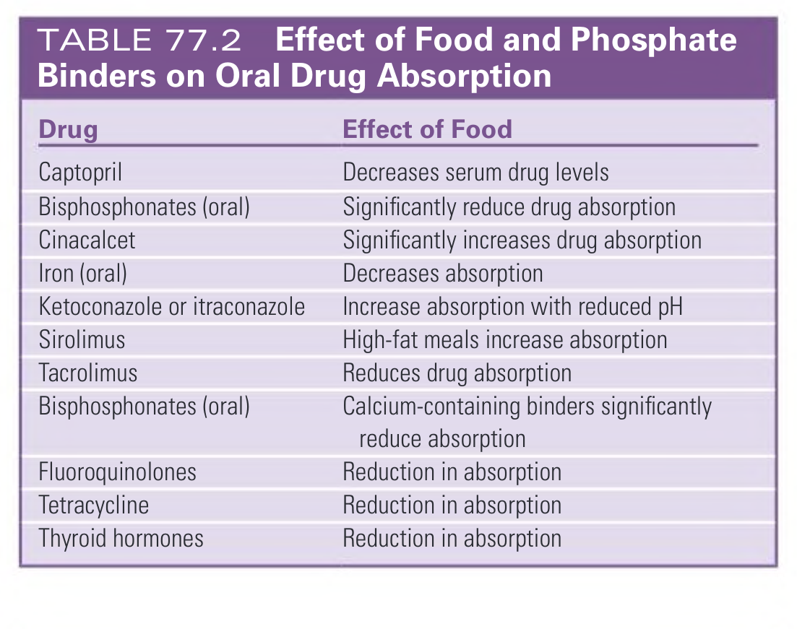

#### Table Data (CSV: [Table_77_2.csv](Table_77_2.csv))

```markdown
| Drug | Effect of Food |
| :--- | :--- |
| Captopril | Decreases serum drug levels |
| Bisphosphonates (oral) | Significantly reduce drug absorption |
| Cinacalcet | Significantly increases drug absorption |
| Iron (oral) | Decreases absorption |
| Ketoconazole or itraconazole | Increase absorption with reduced pH |
| Sirolimus | High-fat meals increase absorption |
| Tacrolimus | Reduces drug absorption |
| Bisphosphonates (oral) | Calcium-containing binders significantly reduce absorption |
| Fluoroquinolones | Reduction in absorption |
| Tetracycline | Reduction in absorption |
| Thyroid hormones | Reduction in absorption |
```

TABLE 77.2 Effect of Food and Phosphate Binders on Oral Drug Absorption

---

### Table_77_3

#### Table Image

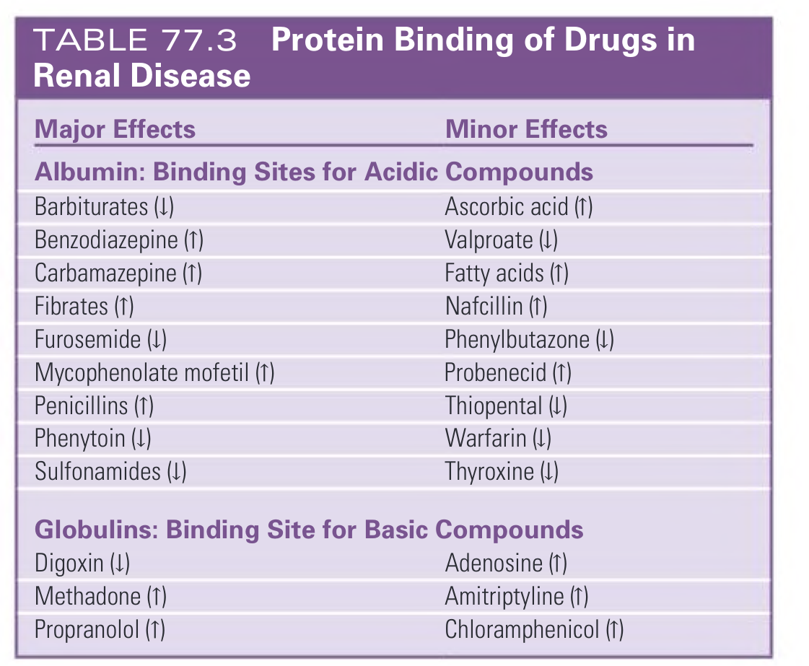

#### Table Data (CSV: [Table_77_3.csv](Table_77_3.csv))

```markdown
| Major Effects | Minor Effects |
| :--- | :--- |
| **Albumin: Binding Sites for Acidic Compounds** | |
| Barbiturates (↓) | Ascorbic acid (↑) |
| Benzodiazepine (↑) | Valproate (↓) |
| Carbamazepine (↑) | Fatty acids (↑) |
| Fibrates (↑) | Nafcillin (↑) |
| Furosemide (↓) | Phenylbutazone (↓) |
| Mycophenolate mofetil (↑) | Probenecid (↑) |
| Penicillins (↑) | Thiopental (↓) |
| Phenytoin (↓) | Warfarin (↓) |
| Sulfonamides (↓) | Thyroxine (↓) |
| **Globulins: Binding Site for Basic Compounds** | |
| Digoxin (↓) | Adenosine (↑) |
| Methadone (↑) | Amitriptyline (↑) |
| Propranolol (↑) | Chloramphenicol (↑) |
*↓ Indicates reduced protein binding in chronic kidney disease (CKD) patients; ↑ indicates increased protein binding in CKD patients. However, the therapeutic effect is not easily predicted (see text).*
```

TABLE 77.3 Protein Binding of Drugs in Renal Disease

---

### Table_77_4

#### Table Image

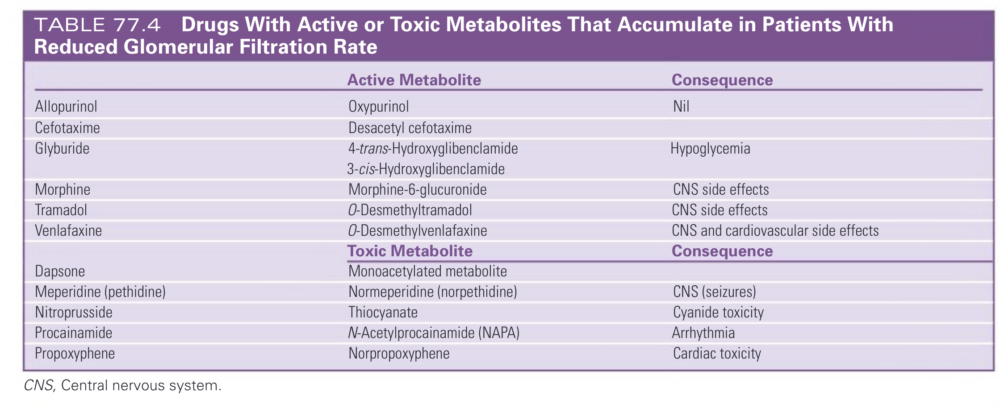

#### Table Data (CSV: [Table_77_4.csv](Table_77_4.csv))

```markdown
| | Active Metabolite | Consequence |
| :--- | :--- | :--- |
| Allopurinol | Oxypurinol | Nil |
| Cefotaxime | Desacetyl cefotaxime | |
| Glyburide | 4-trans-Hydroxyglibenclamide | Hypoglycemia |
| | 3-cis-Hydroxyglibenclamide | |
| Morphine | Morphine-6-glucuronide | CNS side effects |
| Tramadol | O-Desmethyltramadol | CNS side effects |
| Venlafaxine | O-Desmethylvenlafaxine | CNS and cardiovascular side effects |
| | **Toxic Metabolite** | **Consequence** |
| Dapsone | Monoacetylated metabolite | |
| Meperidine (pethidine) | Normeperidine (norpethidine) | CNS (seizures) |
| Nitroprusside | Thiocyanate | Cyanide toxicity |
| Procainamide | N-Acetylprocainamide (NAPA) | Arrhythmia |
| Propoxyphene | Norpropoxyphene | Cardiac toxicity |
*CNS, Central nervous system.*
```

TABLE 77.4 Drugs With Active or Toxic Metabolites That Accumulate in Patients With Reduced Glomerular Filtration Rate

---

### Table_77_5

#### Table Image

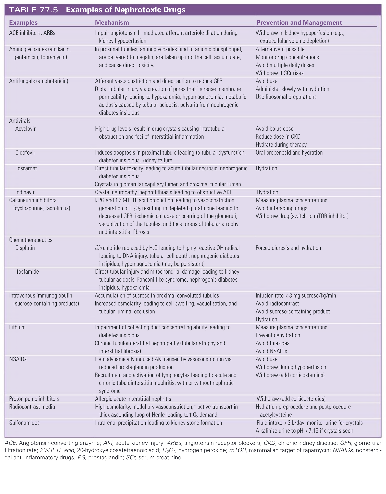

#### Table Data (CSV: [Table_77_5.csv](Table_77_5.csv))

```markdown
| Examples | Mechanism | Prevention and Management |
| :--- | :--- | :--- |
| ACE inhibitors, ARBs | Impair angiotensin II-mediated afferent arteriole dilation during kidney hypoperfusion | Withdraw in kidney hypoperfusion (e.g., extracellular volume depletion) |
| Aminoglycosides (amikacin, gentamicin, tobramycin) | In proximal tubules, aminoglycosides bind to anionic phospholipid, are delivered to megalin, are taken up into the cell, accumulate, and cause direct toxicity. | Alternative if possible; Monitor drug concentrations; Avoid multiple daily doses; Withdraw if SCr rises |
| Antifungals (amphotericin) | Afferent vasoconstriction and direct action to reduce GFR. Distal tubular injury via creation of pores that increase membrane permeability leading to hypokalemia, hypomagnesemia, metabolic acidosis caused by tubular acidosis, polyuria from nephrogenic diabetes insipidus | Avoid use; Administer slowly with hydration; Use liposomal preparations |
| Antivirals | | |
| Acyclovir | High drug levels result in drug crystals causing intratubular obstruction and foci of interstitial inflammation | Avoid bolus dose; Reduce dose in CKD; Hydrate during therapy |
| Cidofovir | Induces apoptosis in proximal tubule leading to tubular dysfunction, diabetes insipidus, kidney failure | Oral probenecid and hydration |
| Foscarnet | Direct tubular toxicity leading to acute tubular necrosis, nephrogenic diabetes insipidus. Crystals in glomerular capillary lumen and proximal tubular lumen | Hydration |
| Indinavir | Crystal neuropathy, nephrolithiasis leading to obstructive AKI | Hydration |
| Calcineurin inhibitors (cyclosporine, tacrolimus) | ↓PG and ↑ 20-HETE acid production leading to vasoconstriction, generation of H2O2 resulting in depleted glutathione leading to decreased GFR, ischemic collapse or scarring of the glomeruli, vacuolization of the tubules, and focal areas of tubular atrophy and interstitial fibrosis | Measure plasma concentrations; Avoid interacting drugs; Withdraw drug (switch to mTOR inhibitor) |
| Chemotherapeutics | | |
| Cisplatin | Cis chloride replaced by H2O leading to highly reactive OH radical leading to DNA injury, tubular cell death, nephrogenic diabetes insipidus, hypomagnesemia (may be persistent) | Forced diuresis and hydration |
| Ifosfamide | Direct tubular injury and mitochondrial damage leading to kidney tubular acidosis, Fanconi-like syndrome, nephrogenic diabetes insipidus, hypokalemia | |
| Intravenous immunoglobulin (sucrose-containing products) | Accumulation of sucrose in proximal convoluted tubules. Increased osmolarity leading to cell swelling, vacuolization, and tubular luminal occlusion | Infusion rate < 3 mg sucrose/kg/min; Avoid radiocontrast; Avoid sucrose-containing product; Hydration |
| Lithium | Impairment of collecting duct concentrating ability leading to diabetes insipidus. Chronic tubulointerstitial nephropathy (tubular atrophy and interstitial fibrosis) | Measure plasma concentrations; Prevent dehydration; Avoid thiazides; Avoid NSAIDs |
| NSAIDs | Hemodynamically induced AKI caused by vasoconstriction via reduced prostaglandin production. Recruitment and activation of lymphocytes leading to acute and chronic tubulointerstitial nephritis, with or without nephrotic syndrome | Avoid use; Withdraw during hypoperfusion; Withdraw (add corticosteroids) |
| Proton pump inhibitors | Allergic acute interstitial nephritis | Withdraw (add corticosteroids) |
| Radiocontrast media | High osmolarity, medullary vasoconstriction, ↑ active transport in thick ascending loop of Henle leading to ↑ O2 demand | Hydration preprocedure and postprocedure; acetylcysteine |
| Sulfonamides | Intrarenal precipitation leading to kidney stone formation | Fluid intake > 3 L/day; monitor urine for crystals; Alkalinize urine to pH > 7.15 if crystals seen |
*ACE, Angiotensin-converting enzyme; AKI, acute kidney injury; ARBs, angiotensin receptor blockers; CKD, chronic kidney disease; GFR, glomerular filtration rate; 20-HETE acid, 20-hydroxyeicosatetraenoic acid; H2O2, hydrogen peroxide; mTOR, mammalian target of rapamycin; NSAIDs, nonsteroidal anti-inflammatory drugs; PG, prostaglandin; SCr, serum creatinine.*
```

TABLE 77.5 Examples of Nephrotoxic Drugs

---

### Table_77_6

#### Table Image

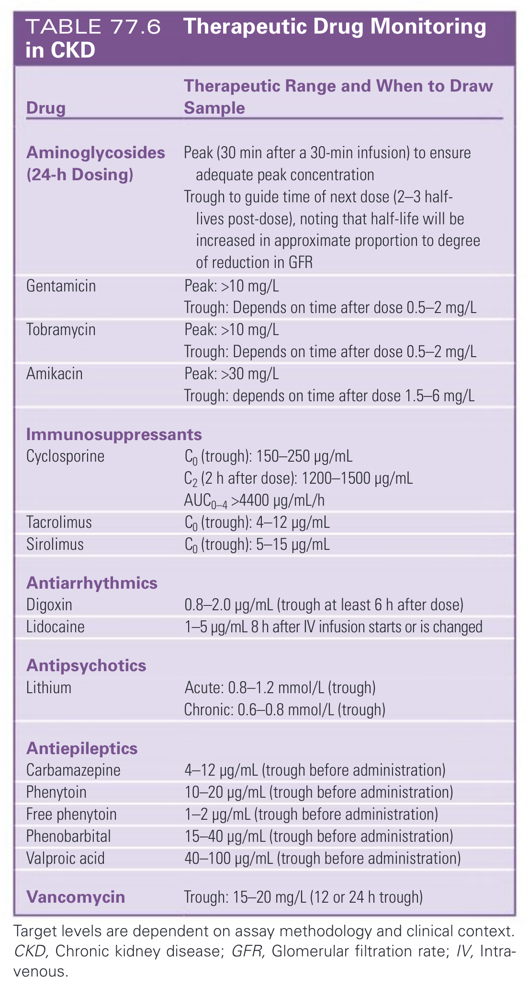

#### Table Data (CSV: [Table_77_6.csv](Table_77_6.csv))

```markdown
| Drug | Therapeutic Range and When to Draw Sample |
| :--- | :--- |
| **Aminoglycosides (24-h Dosing)** | Peak (30 min after a 30-min infusion) to ensure adequate peak concentration. Trough to guide time of next dose (2-3 half-lives post-dose), noting that half-life will be increased in approximate proportion to degree of reduction in GFR |
| Gentamicin | Peak: >10 mg/L. Trough: Depends on time after dose 0.5-2 mg/L |
| Tobramycin | Peak: >10 mg/L. Trough: Depends on time after dose 0.5-2 mg/L |
| Amikacin | Peak: >30 mg/L. Trough: depends on time after dose 1.5-6 mg/L |
| **Immunosuppressants** | |
| Cyclosporine | C₀ (trough): 150-250 µg/mL. C₂ (2 h after dose): 1200-1500 µg/mL. AUC₀₋₄ >4400 µg/mL/h |
| Tacrolimus | C₀ (trough): 4-12 µg/mL |
| Sirolimus | C₀ (trough): 5-15 µg/mL |
| **Antiarrhythmics** | |
| Digoxin | 0.8-2.0 µg/mL (trough at least 6 h after dose) |
| Lidocaine | 1-5 µg/mL 8 h after IV infusion starts or is changed |
| **Antipsychotics** | |
| Lithium | Acute: 0.8-1.2 mmol/L (trough). Chronic: 0.6-0.8 mmol/L (trough) |
| **Antiepileptics** | |
| Carbamazepine | 4-12 µg/mL (trough before administration) |
| Phenytoin | 10-20 µg/mL (trough before administration) |
| Free phenytoin | 1-2 µg/mL (trough before administration) |
| Phenobarbital | 15-40 µg/mL (trough before administration) |
| Valproic acid | 40-100 µg/mL (trough before administration) |
| **Vancomycin** | Trough: 15-20 mg/L (12 or 24 h trough) |
*Target levels are dependent on assay methodology and clinical context. CKD, Chronic kidney disease; GFR, Glomerular filtration rate; IV, Intravenous.*
```

TABLE 77.6 Therapeutic Drug Monitoring in CKD

---

### Table_77_7

#### Table Image

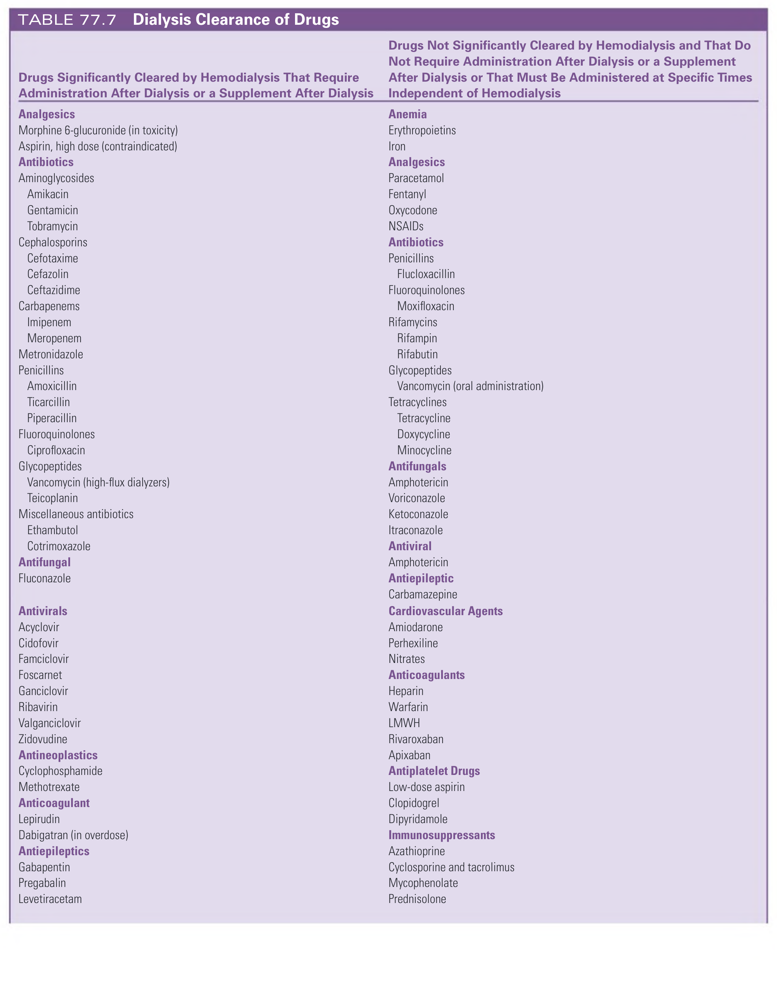

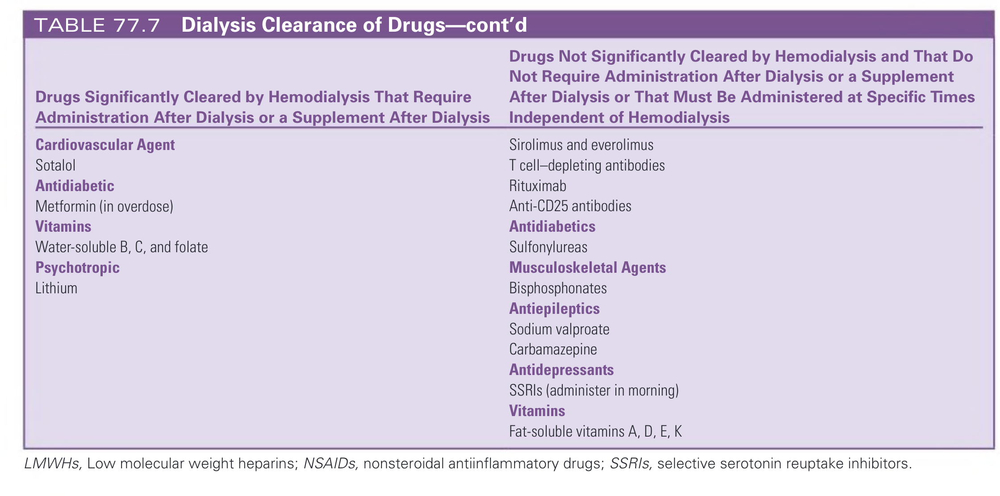

#### Table Data (CSV: [Table_77_7.csv](Table_77_7.csv))

```markdown
| Drugs Significantly Cleared by Hemodialysis That Require Administration After Dialysis or a Supplement After Dialysis | Drugs Not Significantly Cleared by Hemodialysis and That Do Not Require Administration After Dialysis or a Supplement After Dialysis or That Must Be Administered at Specific Times Independent of Hemodialysis |
| :--- | :--- |
| **Analgesics** | **Anemia** |
| Morphine 6-glucuronide (in toxicity) | Erythropoietins |
| Aspirin, high dose (contraindicated) | Iron |
| **Antibiotics** | **Analgesics** |
| Aminoglycosides (Amikacin, Gentamicin, Tobramycin) | Paracetamol, Fentanyl, Oxycodone, NSAIDs |
| Cephalosporins (Cefotaxime, Cefazolin, Ceftazidime) | **Antibiotics** |
| Carbapenems (Imipenem, Meropenem) | Penicillins (Flucloxacillin) |
| Metronidazole | Fluoroquinolones (Moxifloxacin) |
| Penicillins (Amoxicillin, Ticarcillin, Piperacillin) | Rifamycins (Rifampin, Rifabutin) |
| Fluoroquinolones (Ciprofloxacin) | Glycopeptides (Vancomycin (oral administration)) |
| Glycopeptides (Vancomycin (high-flux dialyzers), Teicoplanin) | Tetracyclines (Tetracycline, Doxycycline, Minocycline) |
| Miscellaneous antibiotics (Ethambutol, Cotrimoxazole) | **Antifungals** |
| **Antifungal** | Amphotericin, Voriconazole, Ketoconazole, Itraconazole |
| Fluconazole | **Antiviral** |
| **Antivirals** | Amphotericin |
| Acyclovir, Cidofovir, Famciclovir, Foscarnet, Ganciclovir, Ribavirin, Valganciclovir, Zidovudine | **Antiepileptic** |
| **Antineoplastics** | Carbamazepine |
| Cyclophosphamide, Methotrexate | **Cardiovascular Agents** |
| **Anticoagulant** | Amiodarone, Perhexiline, Nitrates |
| Lepirudin, Dabigatran (in overdose) | **Anticoagulants** |
| **Antiepileptics** | Heparin, Warfarin, LMWH, Rivaroxaban, Apixaban |
| Gabapentin, Pregabalin, Levetiracetam | **Antiplatelet Drugs** |
| **Cardiovascular Agent** | Low-dose aspirin, Clopidogrel, Dipyridamole |
| Sotalol | **Immunosuppressants** |
| **Antidiabetic** | Azathioprine, Cyclosporine and tacrolimus, Mycophenolate, Prednisolone |
| Metformin (in overdose) | Sirolimus and everolimus, T cell-depleting antibodies, Rituximab, Anti-CD25 antibodies |
| **Vitamins** | **Antidiabetics** |
| Water-soluble B, C, and folate | Sulfonylureas |
| **Psychotropic** | **Musculoskeletal Agents** |
| Lithium | Bisphosphonates |
| | **Antiepileptics** |
| | Sodium valproate, Carbamazepine |
| | **Antidepressants** |
| | SSRIs (administer in morning) |
| | **Vitamins** |
| | Fat-soluble vitamins A, D, E, K |
*LMWHs, Low molecular weight heparins; NSAIDs, nonsteroidal antiinflammatory drugs; SSRIs, selective serotonin reuptake inhibitors.*
```

TABLE 77.7 Dialysis Clearance of Drugs

---

## Boxes

### Box_77_1

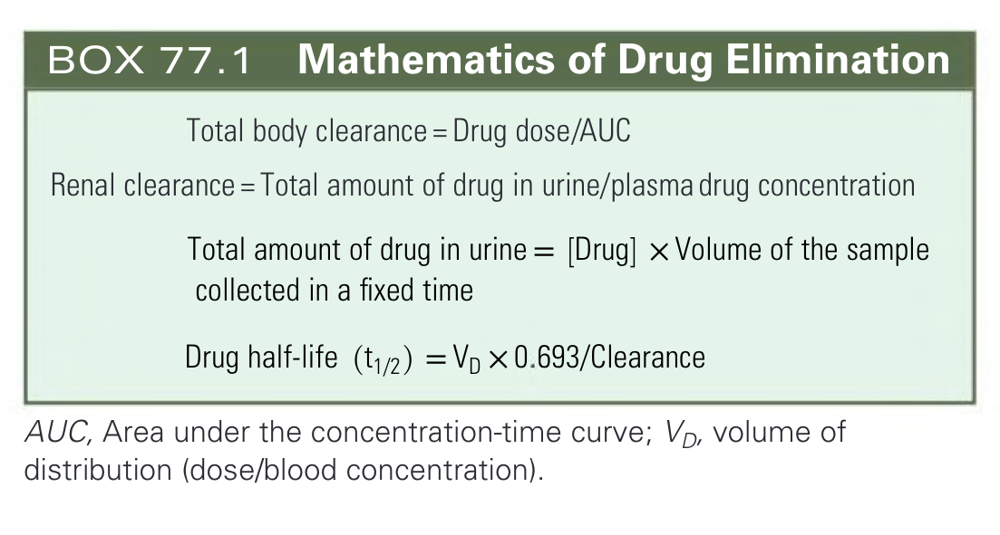

#### Box Text

```markdown
*   Total body clearance = Drug dose/AUC
*   Renal clearance = Total amount of drug in urine/plasma drug concentration
*   Total amount of drug in urine = [Drug] × Volume of the sample collected in a fixed time
*   Drug half-life (t1/2) = VD × 0.693/Clearance

*AUC, Area under the concentration-time curve; VD, volume of distribution (dose/blood concentration).*
```

BOX 77.1 Mathematics of Drug Elimination

---
