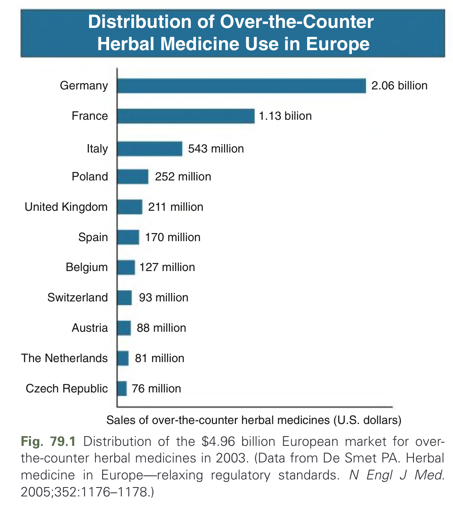
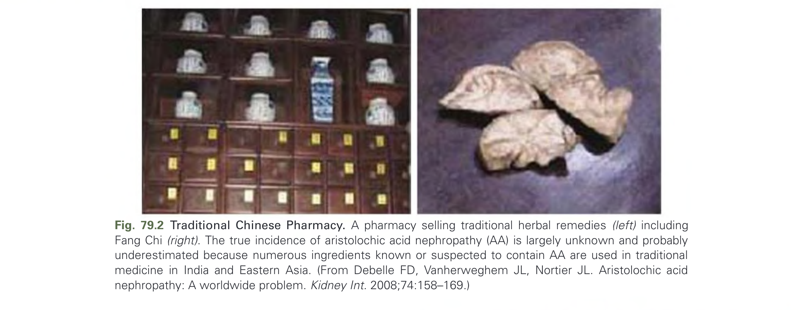
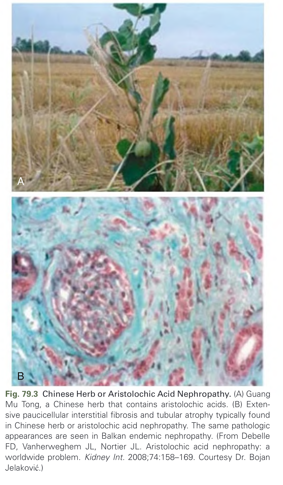
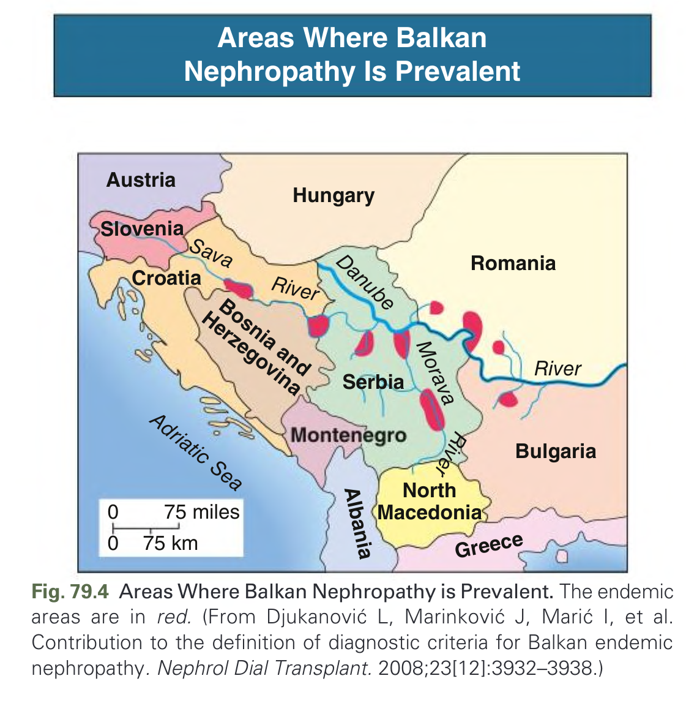
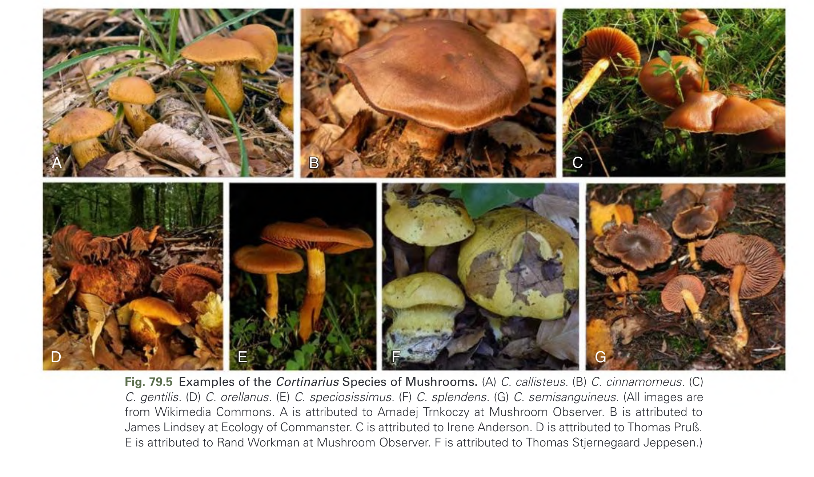
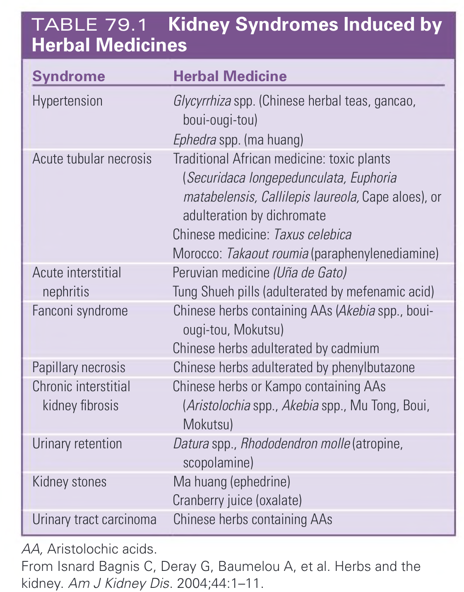
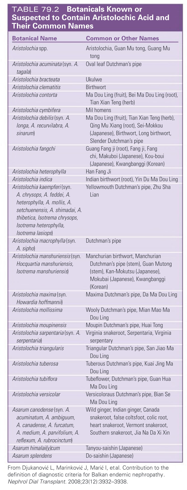
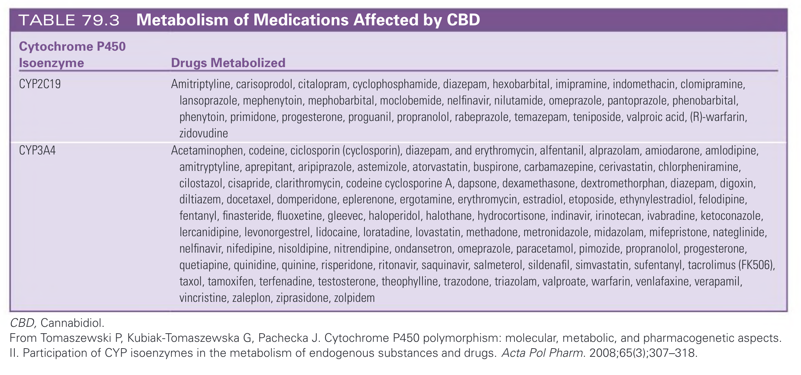
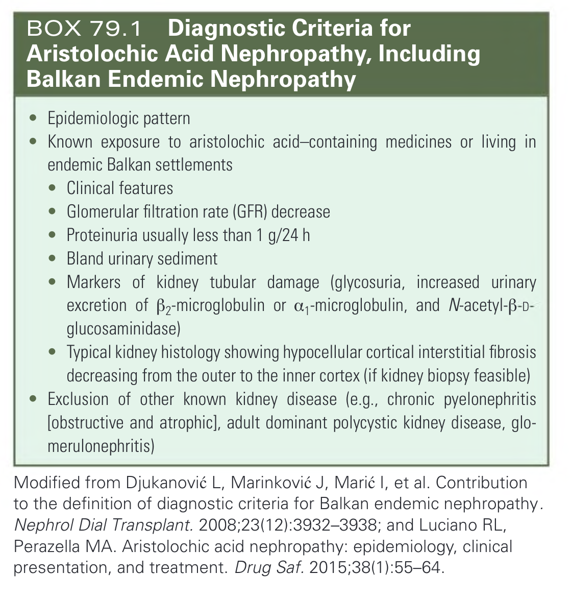

# 079. Herbal and Over-the-Counter Medicines and the Kidney - Figures and Tables Index

This document lists all figures, tables and boxes extracted from `079. Herbal and Over-the-Counter Medicines and the Kidney.pdf`.

## Table of Contents
- [Figures](#figures)
- [Tables](#tables)
- [Boxes](#boxes)

---

## Figures

### Fig_79_1



Fig. 79.1 Distribution of the $4.96 billion European market for over-the-counter herbal medicines in 2003. (Data from De Smet PA. Herbal medicine in Europe—relaxing regulatory standards. N Engl J Med. 2005;352:1176–1178.)

---

### Fig_79_2



Fig. 79.2 Traditional Chinese Pharmacy. A pharmacy selling traditional herbal remedies (left) including Fang Chi (right). The true incidence of aristolochic acid nephropathy (AA) is largely unknown and probably underestimated because numerous ingredients known or suspected to contain AA are used in traditional medicine in India and Eastern Asia. (From Debelle FD, Vanherweghem JL, Nortier JL. Aristolochic acid nephropathy: a worldwide problem. Kidney Int. 2008;74[2]:158–169.)

---

### Fig_79_3



Fig. 79.3 Chinese Herb or Aristolochic Acid Nephropathy. (A) Guang Mu Tong, a Chinese herb that contains aristolochic acids. (B) Extensive paucicellular interstitial fibrosis and tubular atrophy typically found in Chinese herb or aristolochic acid nephropathy. The same pathologic changes are found in patients with Balkan endemic nephropathy. (From Debelle FD, Vanherweghem JL, Nortier JL. Aristolochic acid nephropathy: a worldwide problem. Kidney Int. 2008;74[2]:158–169.)

---

### Fig_79_4



Fig. 79.4 Areas Where Balkan Nephropathy is Prevalent. The endemic areas are in red. (From Djukanović L, Marinković J, Marić I, et al. Contribution to the definition of diagnostic criteria for Balkan endemic nephropathy. Nephrol Dial Transplant. 2008;23[12]:3932–3938.)

---

### Fig_79_5



Fig. 79.5 Examples of the Cortinarius Species of Mushrooms. (A) C. callisteus. (B) C. cinnamomeus. (C) C. gentilis. (D) C. orellanus. (E) C. speciosissimus. (F) C. splendens. (G) C. semisanguineus. (All images are from Wikimedia Commons. A is attributed to Amadej Trnkoczy at Mushroom Observer. B is attributed to James Lindsey at Ecology of Commanster. C is attributed to Irene Anderson. D is attributed to Thomas Pruss. E is attributed to Eric Steinert. F is attributed to Jerzy Opioła. G is attributed to Ron Pastorino at Mushroom Observer.)

---

## Tables

### Table_79_1

#### Table Image



#### Table Data (CSV: [Table_79_1.csv](Table_79_1.csv))

```markdown
| Syndrome | Herbal Medicine |
| :--- | :--- |
| Hypertension | Glycyrrhiza spp. (Chinese herbal teas, gancao, boui-ougi-tou) |
| | Ephedra spp. (ma huang) |
| Acute tubular necrosis | Traditional African medicine: toxic plants (Securidaca longepedunculata, Euphoria matabelensis, Callilepis laureola, Cape aloes), or adulteration by dichromate |
| | Chinese medicine: Taxus celebica |
| | Morocco: Takaout roumia (paraphenylenediamine) |
| Acute interstitial nephritis | Peruvian medicine (Uña de Gato) |
| | Tung Shueh pills (adulterated by mefenamic acid) |
| Fanconi syndrome | Chinese herbs containing AAs (Akebia spp., boui-ougi-tou, Mokutsu) |
| | Chinese herbs adulterated by cadmium |
| Papillary necrosis | Chinese herbs adulterated by phenylbutazone |
| Chronic interstitial kidney fibrosis | Chinese herbs or Kampo containing AAs (Aristolochia spp., Akebia spp., Mu Tong, Boui, Mokutsu) |
| Urinary retention | Datura spp., Rhododendron molle (atropine, scopolamine) |
| Kidney stones | Ma huang (ephedrine) |
| | Cranberry juice (oxalate) |
| Urinary tract carcinoma | Chinese herbs containing AAs |
*AA, Aristolochic acids.*
*From Isnard Bagnis C, Deray G, Baumelou A, et al. Herbs and the kidney. Am J Kidney Dis. 2004;44:1-11.*
```

TABLE 79.1 Kidney Syndromes Induced by Herbal Medicines

---

### Table_79_2

#### Table Image



#### Table Data (CSV: [Table_79_2.csv](Table_79_2.csv))

```markdown
| Botanical Name | Common or Other Names |
| :--- | :--- |
| Aristolochia spp. | Aristolochia, Guan Mu tong, Guang Mu tong |
| Aristolochia acuminata (syn. A. tagala) | Oval leaf Dutchman's pipe |
| Aristolochia bracteata | Ukulwe |
| Aristolochia clematitis | Birthwort |
| Aristolochia contorta | Ma Dou Ling (fruit), Bei Ma Dou Ling (root), Tian Xian Teng (herb) |
| Aristolochia cymbifera | Mil homens |
| Aristolochia debilis (syn. A. longa, A. recurvilabra, A. sinarum) | Ma Dou Ling (fruit), Tian Xian Teng (herb), Qing Mu Xiang (root), Sei-Mokkou (Japanese), Birthwort, Long birthwort, Slender Dutchman's pipe |
| Aristolochia fangchi | Guang Fang ji (root), Fang ji, Fang chi, Makuboi (Japanese), Kou-boui (Japanese), Kwangbanggi (Korean) |
| Aristolochia heterophylla | Han Fang Ji |
| Aristolochia indica | Indian birthwort (root), Yin Du Ma Dou Ling |
| Aristolochia kaempferi (syn. A. chrysops, A. feddei, A. heterophylla, A. mollis, A. setchuenensis, A. shimadai, A. thibetica, Isotrema chrysops, Isotrema heterophylla, Isotrema lasiops) | Yellowmouth Dutchman's pipe, Zhu Sha Lian |
| Aristolochia macrophylla (syn. A. sipho) | Dutchman's pipe |
| Aristolochia manshuriensis (syn. Hocquartia manshuriensis, Isotrema manshuriensis) | Manchurian birthwort, Manchurian Dutchman's pipe (stem), Guan Mutong (stem), Kan-Mokutsu (Japanese), Mokubai (Japanese), Kwangbanggi (Korean) |
| Aristolochia maxima (syn. Howardia hoffmannii) | Maxima Dutchman's pipe, Da Ma Dou Ling |
| Aristolochia mollissima | Wooly Dutchman's pipe, Mian Mao Ma Dou Ling |
| Aristolochia moupinensis | Moupin Dutchman's pipe, Huai Tong |
| Aristolochia sarpentaria (syn. A. serpentaria) | Virginia snakeroot, Serpentaria, Virginia serpentary |
| Aristolochia triangularis | Triangular Dutchman's pipe, San Jiao Ma Dou Ling |
| Aristolochia tuberosa | Tuberous Dutchman's pipe, Kuai Jing Ma Dou Ling |
| Aristolochia tubiflora | Tubeflower, Dutchman's pipe, Guan Hua Ma Dou Ling |
| Aristolochia versicolar | Versicoloraus Dutchman's pipe, Bian Se Ma Dou Ling |
| Asarum canodense (syn. A. acuminatum, A. ambiguum, A. canadense, A. furcatum, A. medium, A. parvifolium, A. reflexum, A. rubrocinctum) | Wild ginger, Indian ginger, Canada snakeroot, false coltsfoot, colic root, heart snakeroot, Vermont snakeroot, Southern snakeroot, Jia Na Da Xi Xin |
| Asarum himalai(y)cum | Tanyou-saishin (Japanese) |
| Asarum splendens | Do-saishin (Japanese) |
*From Djukanović L, Marinković J, Marić I, et al. Contribution to the definition of diagnostic criteria for Balkan endemic nephropathy. Nephrol Dial Transplant. 2008;23(12):3932-3938.*
```

TABLE 79.2 Botanicals Known or Suspected to Contain Aristolochic Acid and Their Common Names

---

### Table_79_3

#### Table Image



#### Table Data (CSV: [Table_79_3.csv](Table_79_3.csv))

```markdown
| Cytochrome P450 Isoenzyme | Drugs Metabolized |
| :--- | :--- |
| CYP2C19 | Amitriptyline, carisoprodol, citalopram, cyclophosphamide, diazepam, hexobarbital, imipramine, indomethacin, clomipramine, lansoprazole, mephenytoin, mephobarbital, moclobemide, nelfinavir, nilutamide, omeprazole, pantoprazole, phenobarbital, phenytoin, primidone, progesterone, proguanil, propranolol, rabeprazole, temazepam, teniposide, valproic acid, (R)-warfarin, zidovudine |
| CYP3A4 | Acetaminophen, codeine, ciclosporin (cyclosporin), diazepam, and erythromycin, alfentanil, alprazolam, amiodarone, amlodipine, amitryptyline, aprepitant, aripiprazole, astemizole, atorvastatin, buspirone, carbamazepine, cerivastatin, chlorpheniramine, cilostazol, cisapride, clarithromycin, codeine cyclosporine A, dapsone, dexamethasone, dextromethorphan, diazepam, digoxin, diltiazem, docetaxel, domperidone, eplerenone, ergotamine, erythromycin, estradiol, etoposide, ethynylestradiol, felodipine, fentanyl, finasteride, fluoxetine, gleevec, haloperidol, halothane, hydrocortisone, indinavir, irinotecan, ivabradine, ketoconazole, lercanidipine, levonorgestrel, lidocaine, loratadine, lovastatin, methadone, metronidazole, midazolam, mifepristone, nateglinide, nelfinavir, nifedipine, nisoldipine, nitrendipine, ondansetron, omeprazole, paracetamol, pimozide, propranolol, progesterone, quetiapine, quinidine, quinine, risperidone, ritonavir, saquinavir, salmeterol, sildenafil, simvastatin, sufentanyl, tacrolimus (FK506), taxol, tamoxifen, terfenadine, testosterone, theophylline, trazodone, triazolam, valproate, warfarin, venlafaxine, verapamil, vincristine, zaleplon, ziprasidone, zolpidem |
*CBD, Cannabidiol.*
*From Tomaszewski P, Kubiak-Tomaszewska G, Pachecka J. Cytochrome P450 polymorphism: molecular, metabolic, and pharmacogenetic aspects. II. Participation of CYP isoenzymes in the metabolism of endogenous substances and drugs. Acta Pol Pharm. 2008;65(3);307-318.*
```

TABLE 79.3 Metabolism of Medications Affected by CBD

---

## Boxes

### Box_79_1



#### Box Text

```markdown
*   Epidemiologic pattern
*   Known exposure to aristolochic acid-containing medicines or living in endemic Balkan settlements
*   Clinical features
*   Glomerular filtration rate (GFR) decrease
*   Proteinuria usually less than 1 g/24 h
*   Bland urinary sediment
*   Markers of kidney tubular damage (glycosuria, increased urinary excretion of β2-microglobulin or α1-microglobulin, and N-acetyl-β-D-glucosaminidase)
*   Typical kidney histology showing hypocellular cortical interstitial fibrosis decreasing from the outer to the inner cortex (if kidney biopsy feasible)
*   Exclusion of other known kidney disease (e.g., chronic pyelonephritis [obstructive and atrophic], adult dominant polycystic kidney disease, glomerulonephritis)

Modified from Djukanović L, Marinković J, Marić I, et al. Contribution to the definition of diagnostic criteria for Balkan endemic nephropathy. Nephrol Dial Transplant. 2008;23(12):3932-3938; and Luciano RL, Perazella MA. Aristolochic acid nephropathy: epidemiology, clinical presentation, and treatment. Drug Saf. 2015;38(1):55-64.
```

BOX 79.1 Diagnostic Criteria for Aristolochic Acid Nephropathy, Including Balkan Endemic Nephropathy

---
