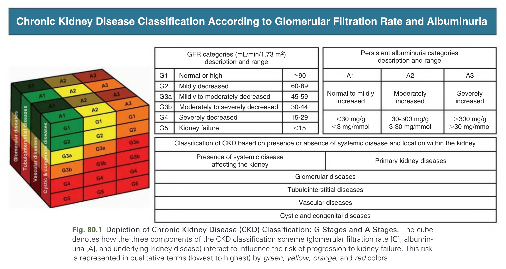
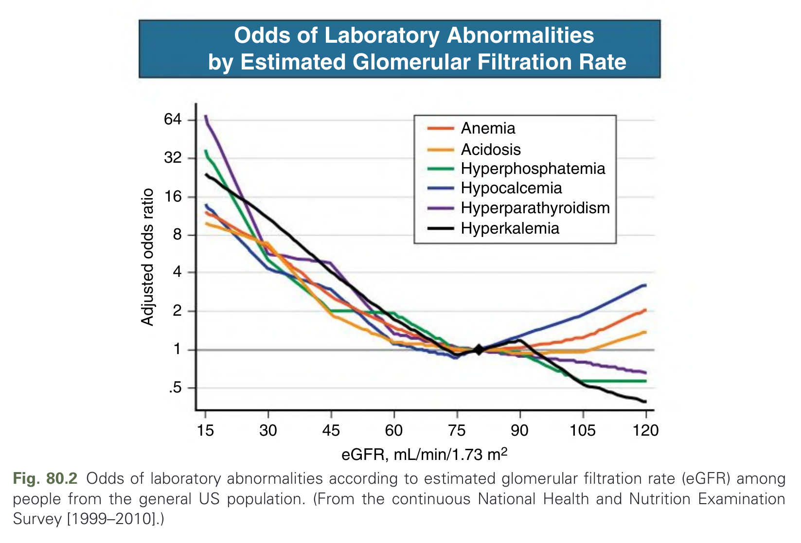
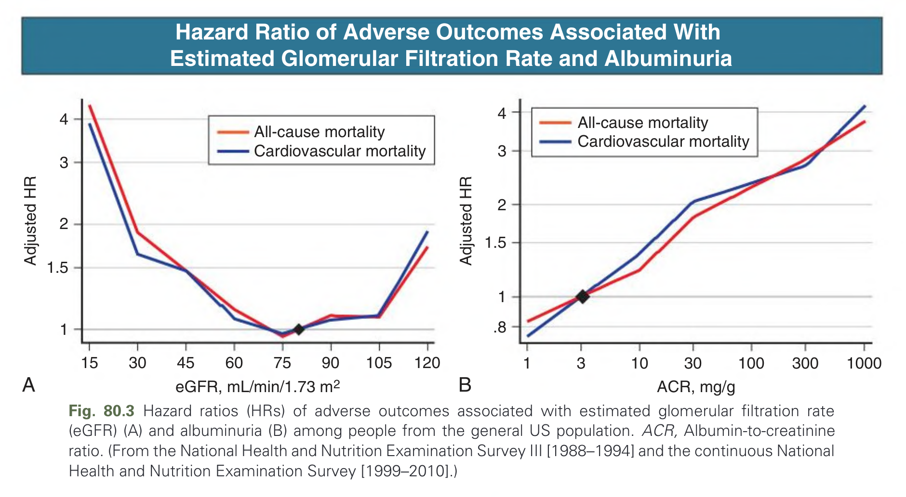
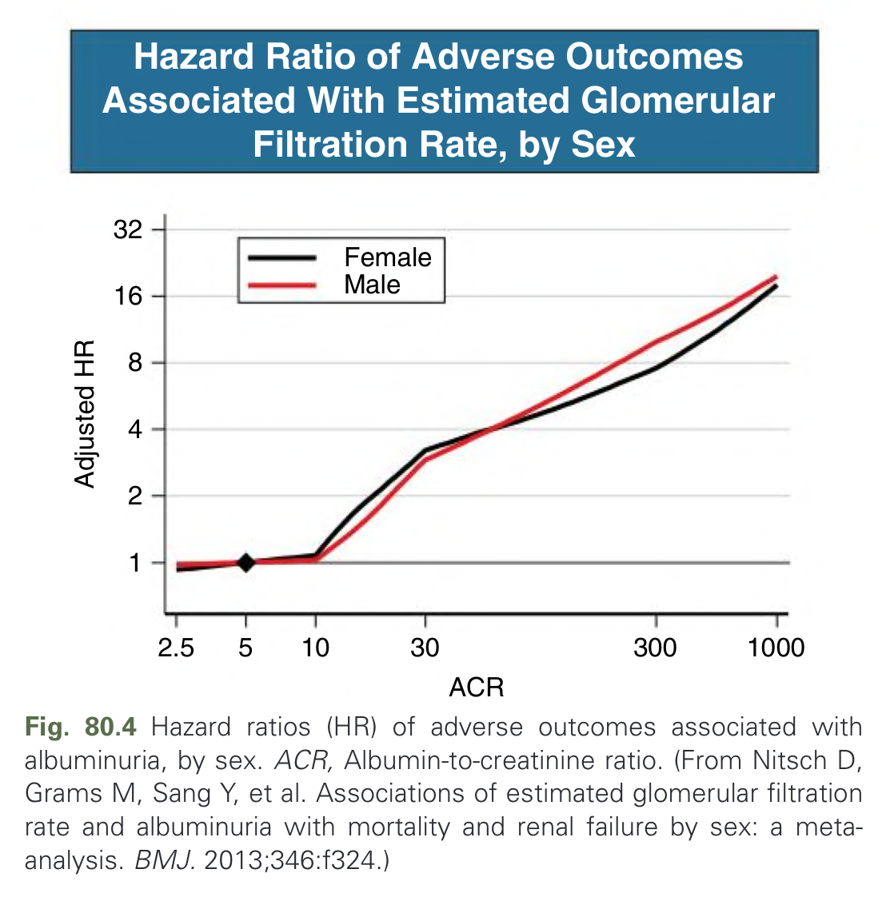
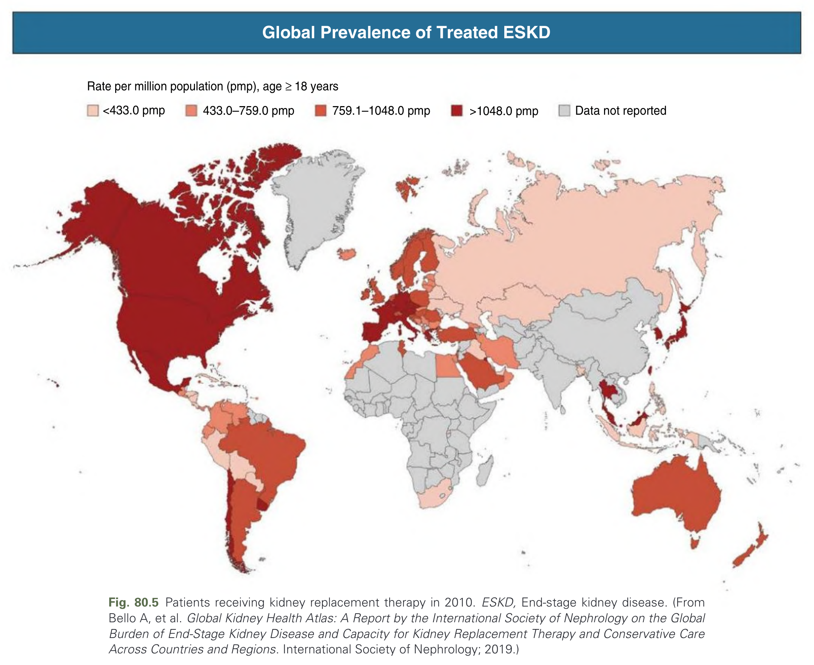
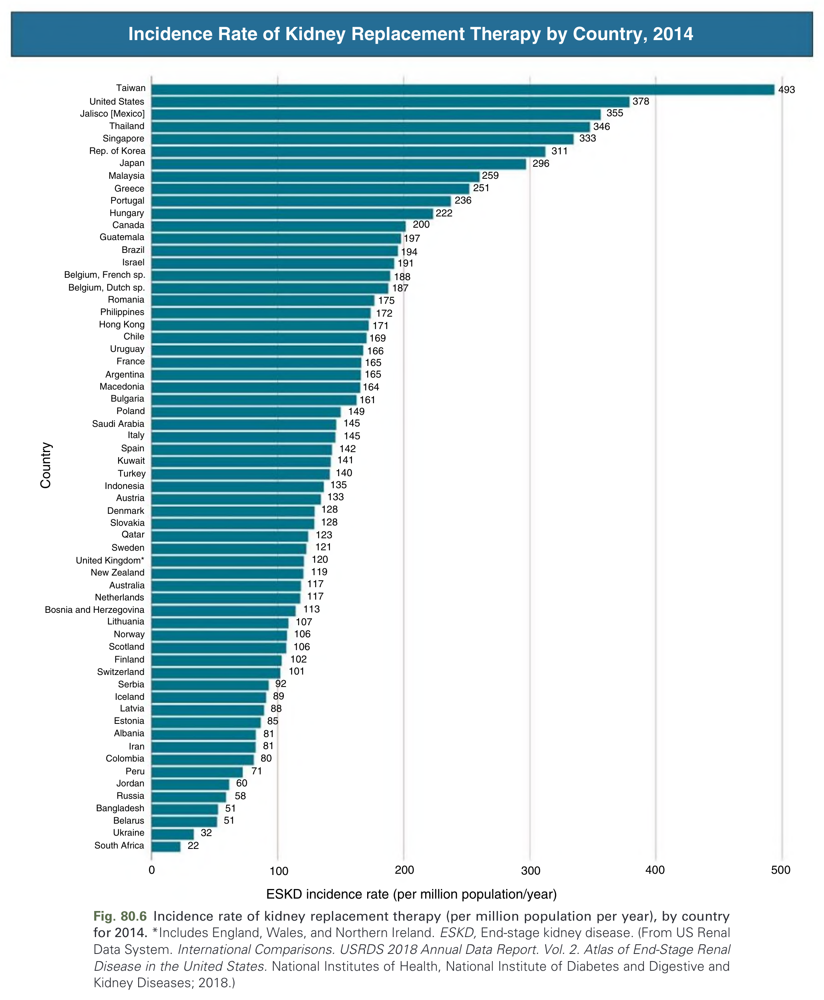
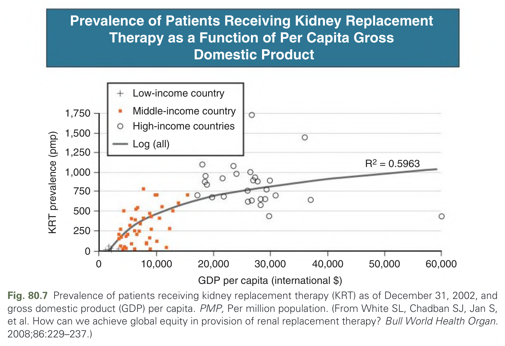
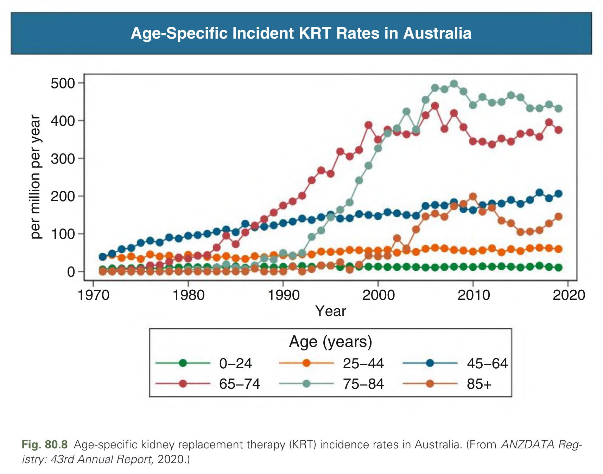
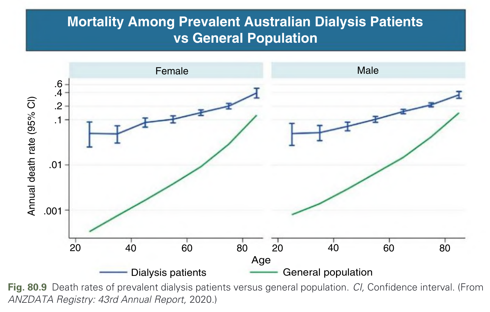
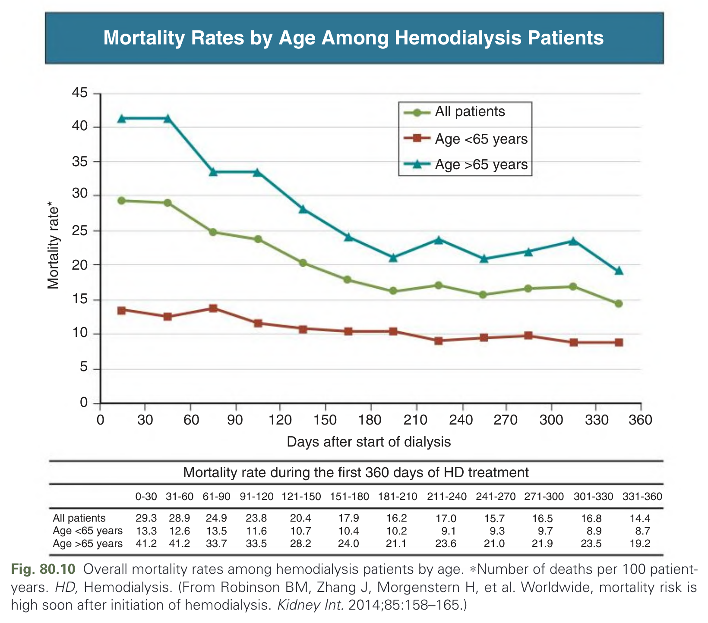

# 080. Epidemiology of Chronic Kidney Disease and Dialysis - Figures and Tables Index

This document lists all figures, tables and boxes extracted from `080. Epidemiology of Chronic Kidney Disease and Dialysis.pdf`.

## Table of Contents
- [Figures](#figures)
- [Tables](#tables)
- [Boxes](#boxes)

---

## Figures

### Fig_80_1

Fig. 80.1 Depiction of Chronic Kidney Disease (CKD) Classification: G Stages and A Stages. The cube denotes how the three components of the CKD classification scheme (glomerular filtration rate [G], albuminuria [A], and underlying kidney disease) interact to influence the risk of progression to kidney failure. This risk is represented in qualitative terms (lowest to highest) by green, yellow, orange, and red colors.

---

### Fig_80_2

Fig. 80.2 Odds of laboratory abnormalities according to estimated glomerular filtration rate (eGFR) among people from the general US population. (From the continuous National Health and Nutrition Examination Survey [1999–2010].)

---

### Fig_80_3

Fig. 80.3 Hazard ratios (HRs) of adverse outcomes associated with estimated glomerular filtration rate (eGFR) (A) and albuminuria (B) among people from the general US population. ACR, Albumin-to-creatinine ratio. (From the National Health and Nutrition Examination Survey III [1988–1994] and the continuous National Health and Nutrition Examination Survey [1999–2010].)

---

### Fig_80_4

Fig. 80.4 Hazard ratios (HR) of adverse outcomes associated with albuminuria, by sex. ACR, Albumin-to-creatinine ratio. (From Nitsch D, Grams M, Sang Y, et al. Associations of estimated glomerular filtration rate and albuminuria with mortality and renal failure by sex: a meta-analysis. BMJ. 2013;346:f324.)

---

### Fig_80_5

Fig. 80.5 Patients receiving kidney replacement therapy in 2010. ESKD, End-stage kidney disease. (From Bello A, et al. Global Kidney Health Atlas: A Report by the International Society of Nephrology on the Global Burden of End-Stage Kidney Disease and Capacity for Kidney Replacement Therapy and Conservative Care Across Countries and Regions. International Society of Nephrology; 2019.)

---

### Fig_80_6

Fig. 80.6 Incidence rate of kidney replacement therapy (per million population per year), by country for 2014. *Includes England, Wales, and Northern Ireland. ESKD, End-stage kidney disease. (From US Renal Data System. International Comparisons. USRDS 2018 Annual Data Report. Vol. 2. Atlas of End-Stage Renal Disease in the United States. National Institutes of Health, National Institute of Diabetes and Digestive and Kidney Diseases; 2018.)

---

### Fig_80_7

Fig. 80.7 Prevalence of patients receiving kidney replacement therapy (KRT) as of December 31, 2002, and gross domestic product (GDP) per capita. PMP, Per million population. (From White SL, Chadban SJ, Jan S, et al. How can we achieve global equity in provision of renal replacement therapy? Bull World Health Organ. 2008;86:229–237.)

---

### Fig_80_8

Fig. 80.8 Age-specific kidney replacement therapy (KRT) incidence rates in Australia. (From ANZDATA Registry: 43rd Annual Report, 2020.)

---

### Fig_80_9

Fig. 80.9 Death rates of prevalent dialysis patients versus general population. CI, Confidence interval. (From ANZDATA Registry: 43rd Annual Report, 2020.)

---

### Fig_80_10

Fig. 80.10 Overall mortality rates among hemodialysis patients by age. *Number of deaths per 100 patient-years. HD, Hemodialysis. (From Robinson BM, Zhang J, Morgenstern H, et al. Worldwide, mortality risk is high soon after initiation of hemodialysis. Kidney Int. 2014;85:158–165.)

---

## Tables

*No tables resolved for this chapter.*

## Boxes

*No boxes resolved for this chapter.*
