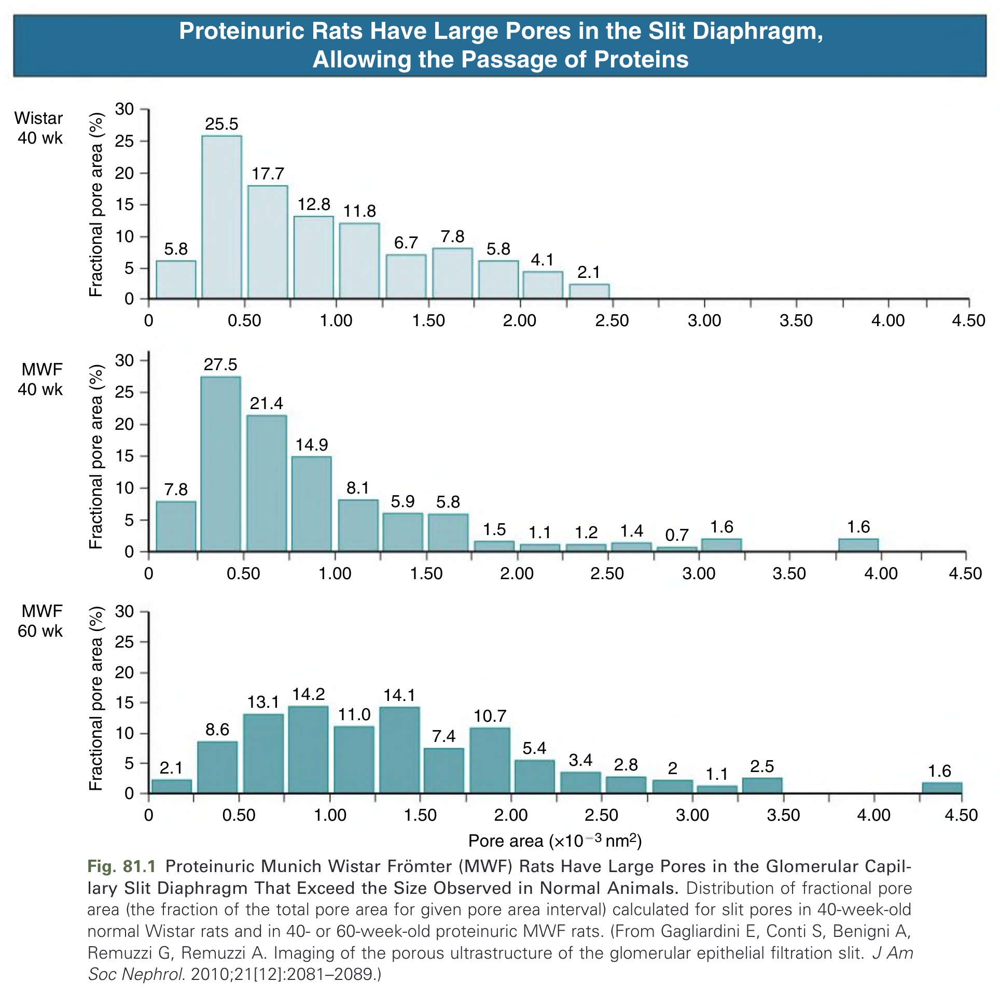
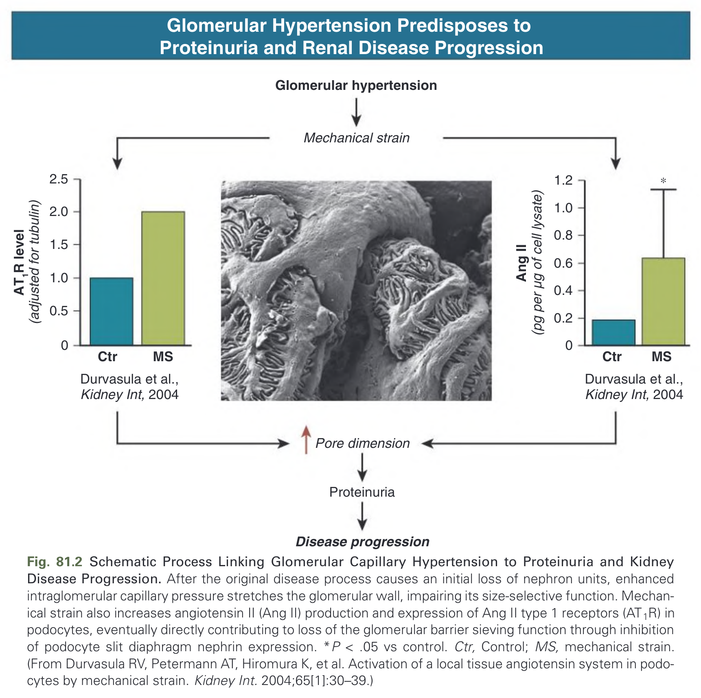
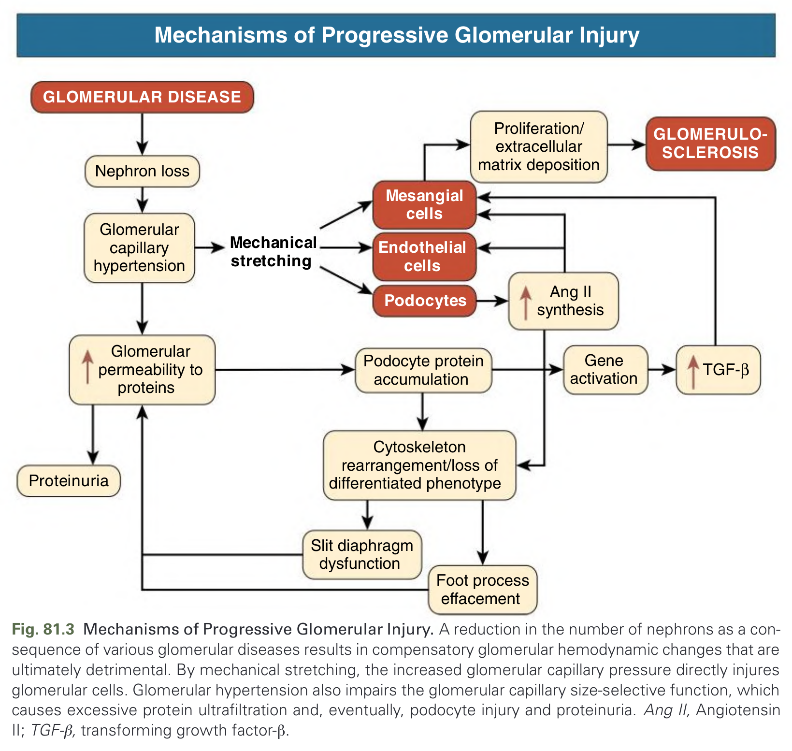
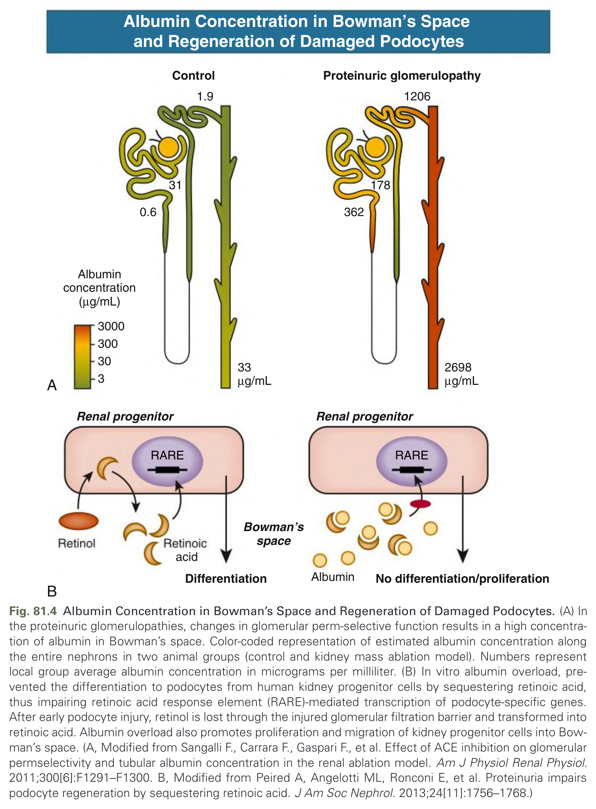
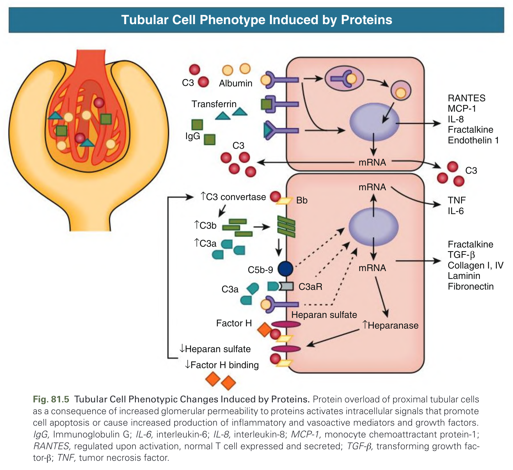
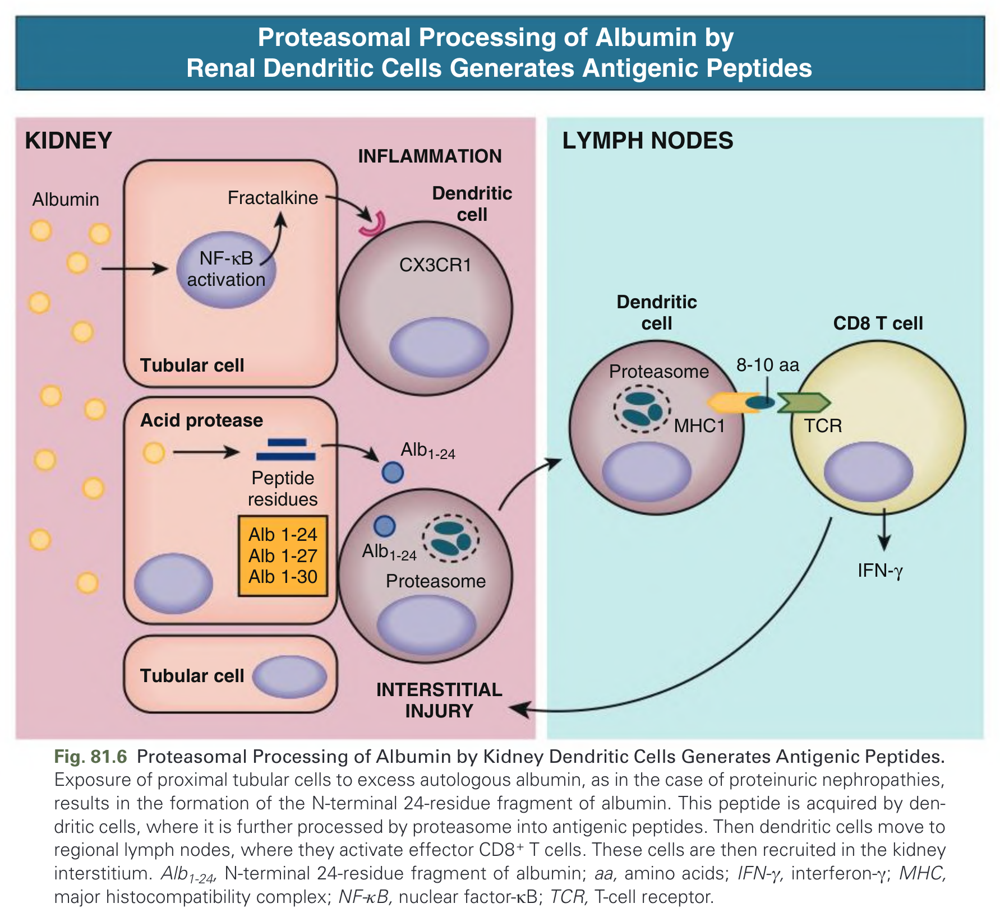
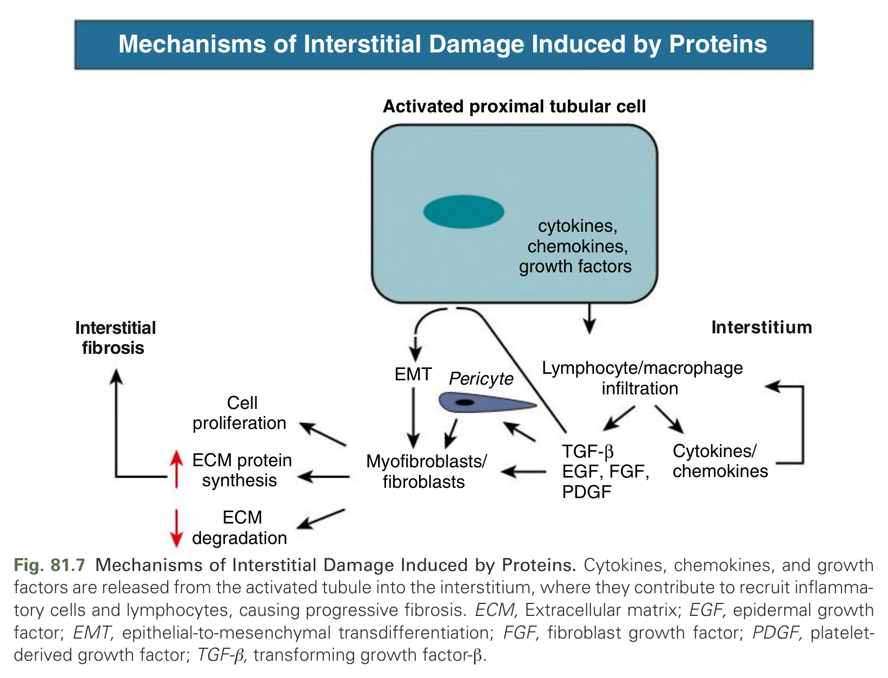

# 081. Pathophysiology of Disease Progression in Proteinuric and Nonproteinuric Kidney Disease - Figures and Tables Index

This document lists all figures, tables and boxes extracted from `081. Pathophysiology of Disease Progression in Proteinuric and Nonproteinuric Kidney Disease.pdf`.

## Table of Contents
- [Figures](#figures)
- [Tables](#tables)
- [Boxes](#boxes)

---

## Figures

### Fig_81_1

Fig. 81.1 Proteinuric Munich Wistar Frömter (MWF) Rats Have Large Pores in the Glomerular Capillary Slit Diaphragm That Exceed the Size Observed in Normal Animals. Distribution of fractional pore area (the fraction of the total pore area for given pore area interval) calculated for slit pores in 40-week-old normal Wistar rats and in 40- or 60-week-old proteinuric MWF rats. (From Gagliardini E, Conti S, Benigni A, Remuzzi G, Remuzzi A. Imaging of the porous ultrastructure of the glomerular epithelial filtration slit. J Am Soc Nephrol. 2010;21[12]:2081–2089.)

---

### Fig_81_2

Fig. 81.2 Schematic Process Linking Glomerular Capillary Hypertension to Proteinuria and Kidney Disease Progression. After the original disease process causes an initial loss of nephron units, enhanced intraglomerular capillary pressure stretches the glomerular wall, impairing its size-selective function. Mechanical strain also increases angiotensin II (Ang II) production and expression of Ang II type 1 receptors (AT1R) in podocytes, eventually directly contributing to loss of the glomerular barrier sieving function through inhibition of podocyte slit diaphragm nephrin expression. *P < .05 vs control. Ctr, Control; MS, mechanical strain. (From Durvasula RV, Petermann AT, Hiromura K, et al. Activation of a local tissue angiotensin system in podocytes by mechanical strain. Kidney Int. 2004;65[1]:30–39.)

---

### Fig_81_3

Fig. 81.3 Mechanisms of Progressive Glomerular Injury. A reduction in the number of nephrons as a consequence of various glomerular diseases results in compensatory glomerular hemodynamic changes that are ultimately detrimental. By mechanical stretching, the increased glomerular capillary pressure directly injures glomerular cells. Glomerular hypertension also impairs the glomerular capillary size-selective function, which causes excessive protein ultrafiltration and, eventually, podocyte injury and proteinuria. Ang II, Angiotensin II; TGF-β, transforming growth factor-β.

---

### Fig_81_4

Fig. 81.4 Albumin Concentration in Bowman’s Space and Regeneration of Damaged Podocytes. (A) In the proteinuric glomerulopathies, changes in glomerular perm-selective function results in a high concentration of albumin in Bowman’s space. Color-coded representation of estimated albumin concentration along the entire nephrons in two animal groups (control and kidney mass ablation model). Numbers represent local group average albumin concentration in micrograms per milliliter. (B) In vitro albumin overload, prevented the differentiation to podocytes from human kidney progenitor cells by sequestering retinoic acid, thus impairing retinoic acid response element (RARE)-mediated transcription of podocyte-specific genes. After early podocyte injury, retinol is lost through the injured glomerular filtration barrier and transformed into retinoic acid. Albumin overload also promotes proliferation and migration of kidney progenitor cells into Bowman’s space. (A, Modified from Sangalli F., Carrara F., Gaspari F., et al. Effect of ACE inhibition on glomerular permselectivity and tubular albumin concentration in the renal ablation model. Am J Physiol Renal Physiol. 2011;300[6]:F1291–F1300. B, Modified from Peired A, Angelotti ML, Ronconi E, et al. Proteinuria impairs podocyte regeneration by sequestering retinoic acid. J Am Soc Nephrol. 2013;24[11]:1756–1768.)

---

### Fig_81_5

Fig. 81.5 Tubular Cell Phenotypic Changes Induced by Proteins. Protein overload of proximal tubular cells as a consequence of increased glomerular permeability to proteins activates intracellular signals that promote cell apoptosis or cause increased production of inflammatory and vasoactive mediators and growth factors. IgG, Immunoglobulin G; IL-6, interleukin-6; IL-8, interleukin-8; MCP-1, monocyte chemoattractant protein-1; RANTES, regulated upon activation, normal T cell expressed and secreted; TGF-β, transforming growth factor-β; TNF, tumor necrosis factor.

---

### Fig_81_6

Fig. 81.6 Proteasomal Processing of Albumin by Kidney Dendritic Cells Generates Antigenic Peptides. Exposure of proximal tubular cells to excess autologous albumin, as in the case of proteinuric nephropathies, results in the formation of the N-terminal 24-residue fragment of albumin. This peptide is acquired by dendritic cells, where it is further processed by proteasome into antigenic peptides. Then dendritic cells move to regional lymph nodes, where they activate effector CD8+ T cells. These cells are then recruited in the kidney interstitium. Alb1-24, N-terminal 24-residue fragment of albumin; aa, amino acids; IFN-γ, interferon-γ; MHC, major histocompatibility complex; NF-κB, nuclear factor-κB; TCR, T-cell receptor.

---

### Fig_81_7

Fig. 81.7 Mechanisms of Interstitial Damage Induced by Proteins. Cytokines, chemokines, and growth factors are released from the activated tubule into the interstitium, where they contribute to recruit inflammatory cells and lymphocytes, causing progressive fibrosis. ECM, Extracellular matrix; EGF, epidermal growth factor; EMT, epithelial-to-mesenchymal transdifferentiation; FGF, fibroblast growth factor; PDGF, platelet-derived growth factor; TGF-β, transforming growth factor-β.

---

## Tables

*No tables resolved for this chapter.*

## Boxes

*No boxes resolved for this chapter.*
