# 082. Slowing the Progression of Kidney Disease - Figures and Tables Index

This document lists all figures, tables and boxes extracted from `082. Slowing the Progression of Kidney Disease.pdf`.

## Table of Contents
- [Figures](#figures)
- [Tables](#tables)
- [Boxes](#boxes)

---

## Figures

### Fig_82_1

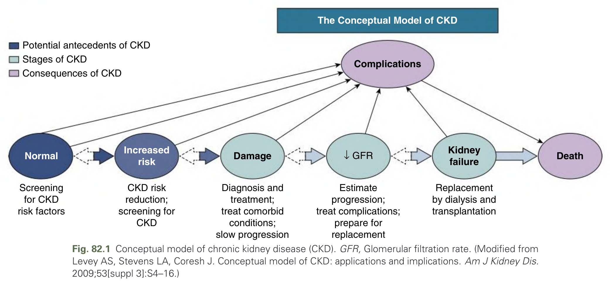

Fig. 82.1 Conceptual model of chronic kidney disease (CKD). GFR, Glomerular filtration rate. (Modified from Levey AS, Stevens LA, Coresh J. Conceptual model of CKD: applications and implications. Am J Kidney Dis. 2009;53[suppl 3]:S4–16.)

---

### Fig_82_2

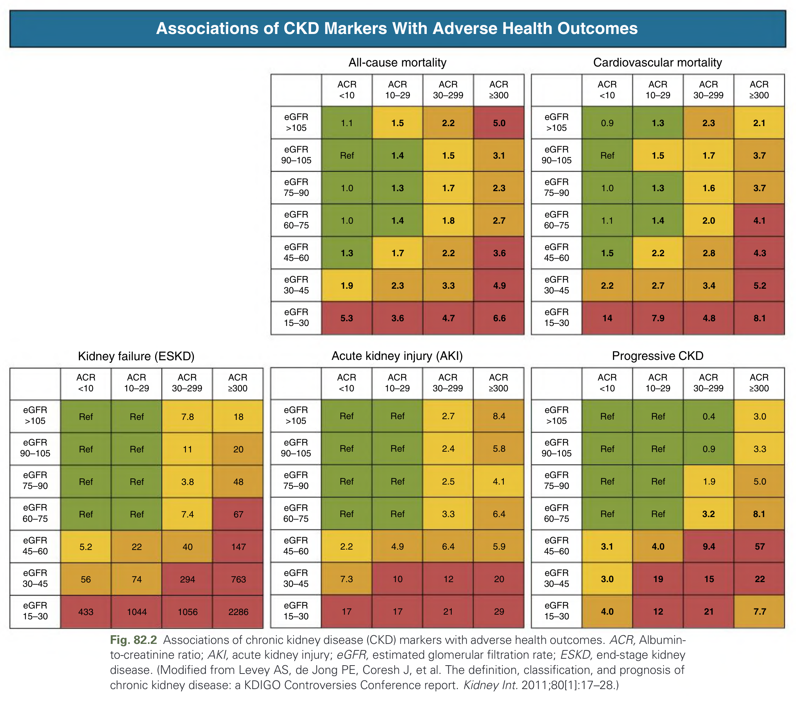

Fig. 82.2 Associations of chronic kidney disease (CKD) markers with adverse health outcomes. ACR, Albumin-to-creatinine ratio; AKI, acute kidney injury; eGFR, estimated glomerular filtration rate; ESKD, end-stage kidney disease. (Modified from Levey AS, de Jong PE, Coresh J, et al. The definition, classification, and prognosis of chronic kidney disease: a KDIGO Controversies Conference report. Kidney Int. 2011;80[1]:17–28.)

---

### Fig_82_3

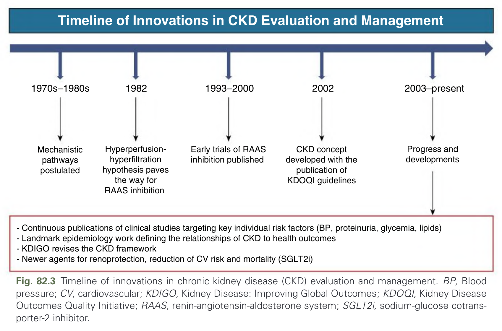

Fig. 82.3 Timeline of innovations in chronic kidney disease (CKD) evaluation and management. BP, Blood pressure; CV, cardiovascular; KDIGO, Kidney Disease: Improving Global Outcomes; KDOQI, Kidney Disease Outcomes Quality Initiative; RAAS, renin-angiotensin-aldosterone system; SGLT2i, sodium-glucose cotransporter-2 inhibitor.

---

### Fig_82_4

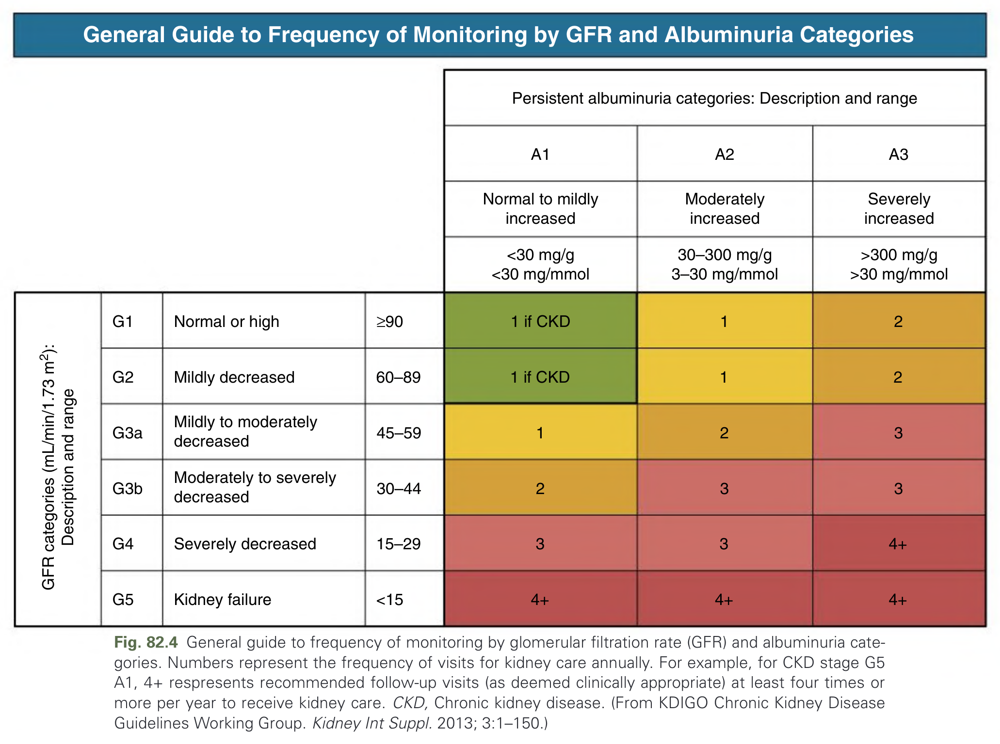

Fig. 82.4 General guide to frequency of monitoring by glomerular filtration rate (GFR) and albuminuria categories. Numbers represent the frequency of visits for kidney care annually. For example, for CKD stage G5 A1, 4+ respresents recommended follow-up visits (as deemed clinically appropriate) at least four times or more per year to receive kidney care. CKD, Chronic kidney disease. (From KDIGO Chronic Kidney Disease Guidelines Working Group. Kidney Int Suppl. 2013; 3:1–150.)

---

### Fig_82_5

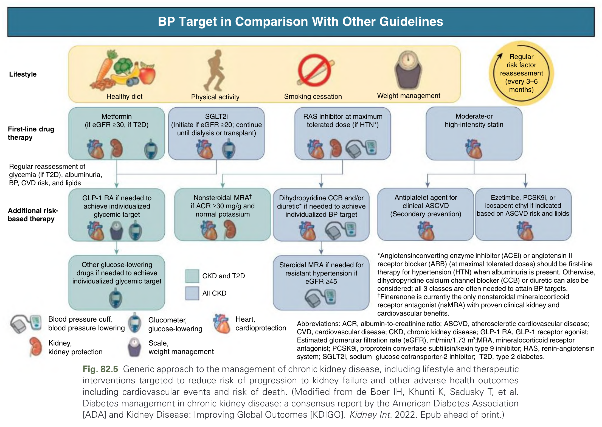

Fig. 82.5 Generic approach to the management of chronic kidney disease, including lifestyle and therapeutic interventions targeted to reduce risk of progression to kidney failure and other adverse health outcomes including cardiovascular events and risk of death. (Modified from de Boer IH, Khunti K, Sadusky T, et al. Diabetes management in chronic kidney disease: a consensus report by the American Diabetes Association [ADA] and Kidney Disease: Improving Global Outcomes [KDIGO]. Kidney Int. 2022. Epub ahead of print.)

---

### Fig_82_6

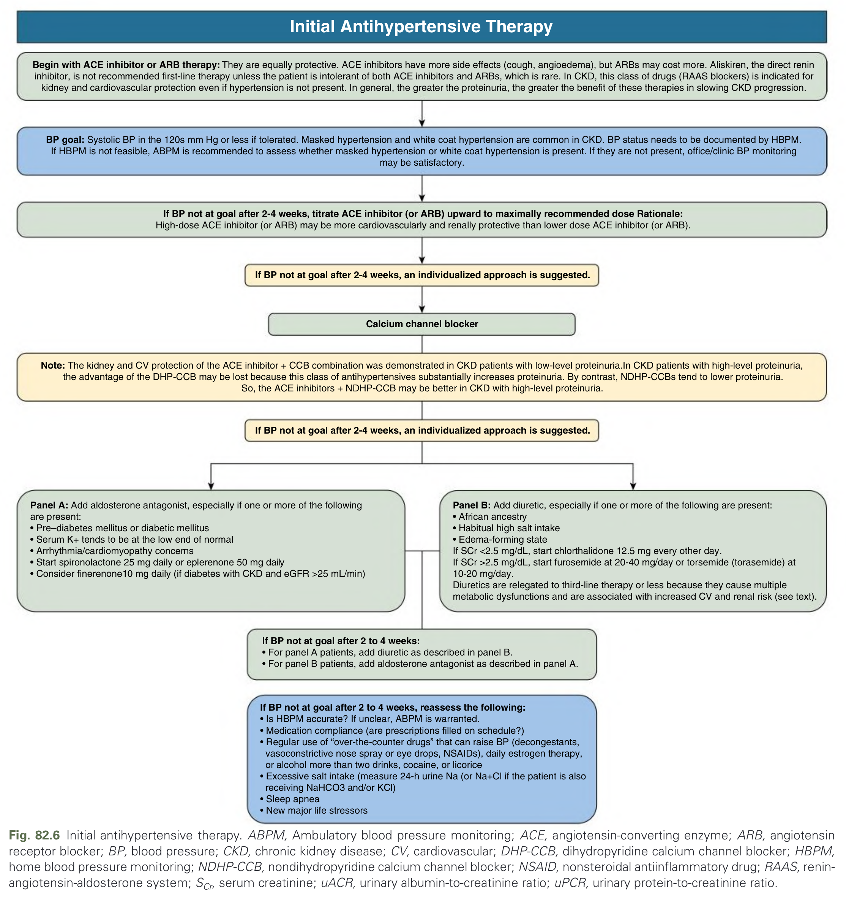

Fig. 82.6 Initial antihypertensive therapy. ABPM, Ambulatory blood pressure monitoring; ACE, angiotensin-converting enzyme; ARB, angiotensin receptor blocker; BP, blood pressure; CKD, chronic kidney disease; CV, cardiovascular; DHP-CCB, dihydropyridine calcium channel blocker; HBPM, home blood pressure monitoring; NDHP-CCB, nondihydropyridine calcium channel blocker; NSAID, nonsteroidal antiinflammatory drug; RAAS, renin-angiotensin-aldosterone system; SCr, serum creatinine; uACR, urinary albumin-to-creatinine ratio; uPCR, urinary protein-to-creatinine ratio.

---

### Fig_82_7

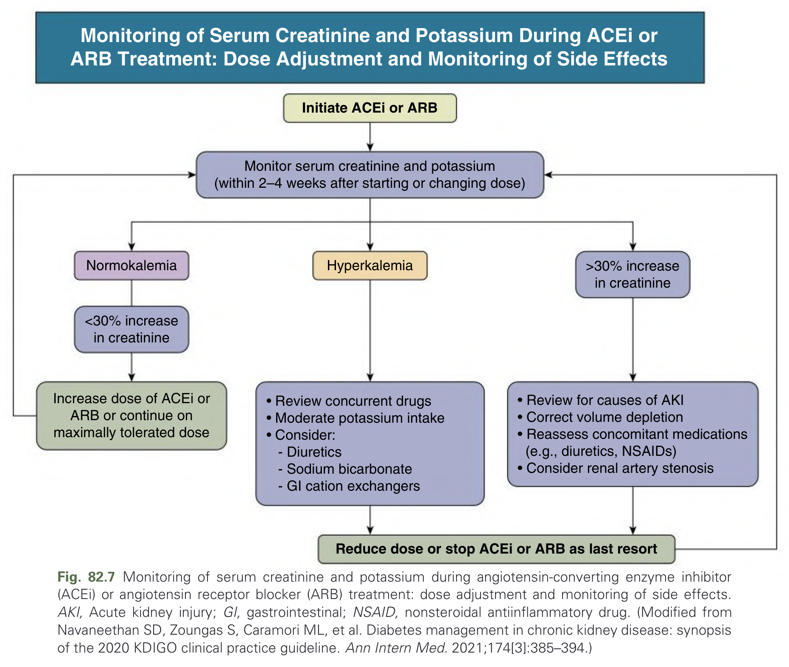

Fig. 82.7 Monitoring of serum creatinine and potassium during angiotensin-converting enzyme inhibitor (ACEi) or angiotensin receptor blocker (ARB) treatment: dose adjustment and monitoring of side effects. AKI, Acute kidney injury; GI, gastrointestinal; NSAID, nonsteroidal antiinflammatory drug. (Modified from Navaneethan SD, Zoungas S, Caramori ML, et al. Diabetes management in chronic kidney disease: synopsis of the 2020 KDIGO clinical practice guideline. Ann Intern Med. 2021;174[3]:385–394.)

---

### Fig_82_8

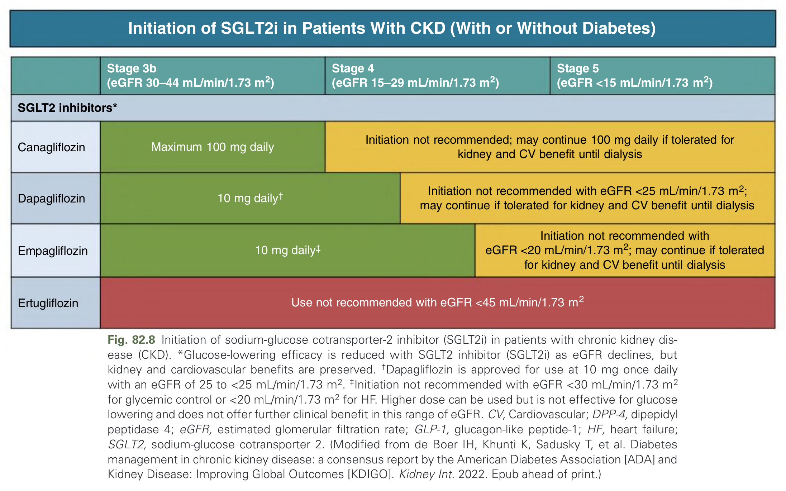

Fig. 82.8 Initiation of sodium-glucose cotransporter-2 inhibitor (SGLT2i) in patients with chronic kidney disease (CKD). *Glucose-lowering efficacy is reduced with SGLT2 inhibitor (SGLT2i) as eGFR declines, but kidney and cardiovascular benefits are preserved. †Dapagliflozin is approved for use at 10 mg once daily with an eGFR of 25 to <25 mL/min/1.73 m2. ‡Initiation not recommended with eGFR <30 mL/min/1.73 m2 for glycemic control or <20 mL/min/1.73 m2 for HF. Higher dose can be used but is not effective for glucose lowering and does not offer further clinical benefit in this range of eGFR. CV, Cardiovascular; DPP-4, dipepidyl peptidase 4; eGFR, estimated glomerular filtration rate; GLP-1, glucagon-like peptide-1; HF, heart failure; SGLT2, sodium-glucose cotransporter 2. (Modified from de Boer IH, Khunti K, Sadusky T, et al. Diabetes management in chronic kidney disease: a consensus report by the American Diabetes Association [ADA] and Kidney Disease: Improving Global Outcomes [KDIGO]. Kidney Int. 2022. Epub ahead of print.)

---

### Fig_82_9

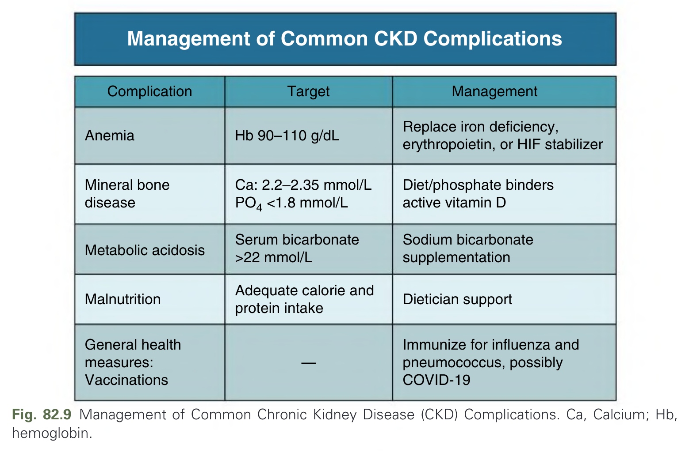

Fig. 82.9 Management of Common Chronic Kidney Disease (CKD) Complications. Ca, Calcium; Hb, hemoglobin.

---

## Tables

### Table_82_1

#### Table Image

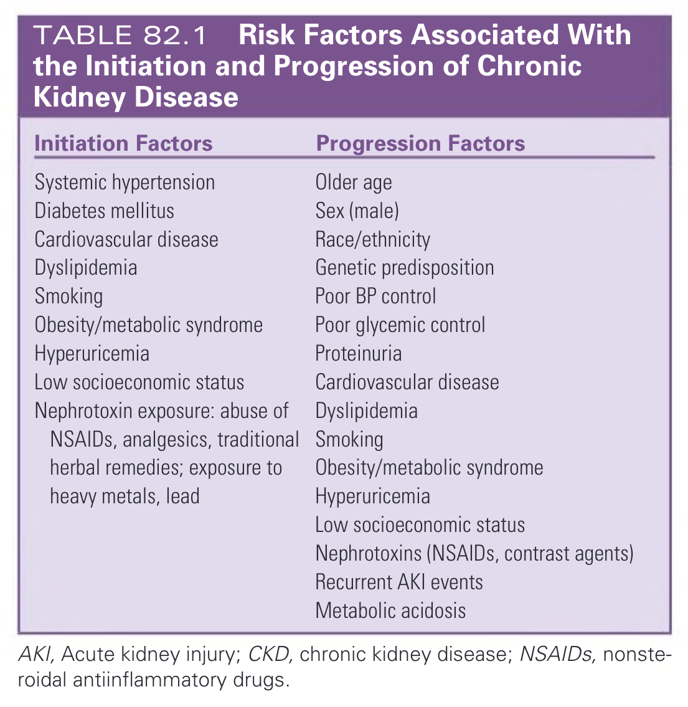

#### Table Data (CSV: [Table_82_1.csv](Table_82_1.csv))

```markdown
| Initiation Factors | Progression Factors |
| :--- | :--- |
| Systemic hypertension | Older age |
| Diabetes mellitus | Sex (male) |
| Cardiovascular disease | Race/ethnicity |
| Dyslipidemia | Genetic predisposition |
| Smoking | Poor BP control |
| Obesity/metabolic syndrome | Poor glycemic control |
| Hyperuricemia | Proteinuria |
| Low socioeconomic status | Cardiovascular disease |
| Nephrotoxin exposure: abuse of NSAIDs, analgesics, traditional herbal remedies; exposure to heavy metals, lead | Dyslipidemia |
| | Smoking |
| | Obesity/metabolic syndrome |
| | Hyperuricemia |
| | Low socioeconomic status |
| | Nephrotoxins (NSAIDs, contrast agents) |
| | Recurrent AKI events |
| | Metabolic acidosis |

AKI, Acute kidney injury; CKD, chronic kidney disease; NSAIDs, nonsteroidal antiinflammatory drugs.
```

TABLE 82.1 Risk Factors Associated With the Initiation and Progression of Chronic Kidney Disease

---

### Table_82_2

#### Table Image

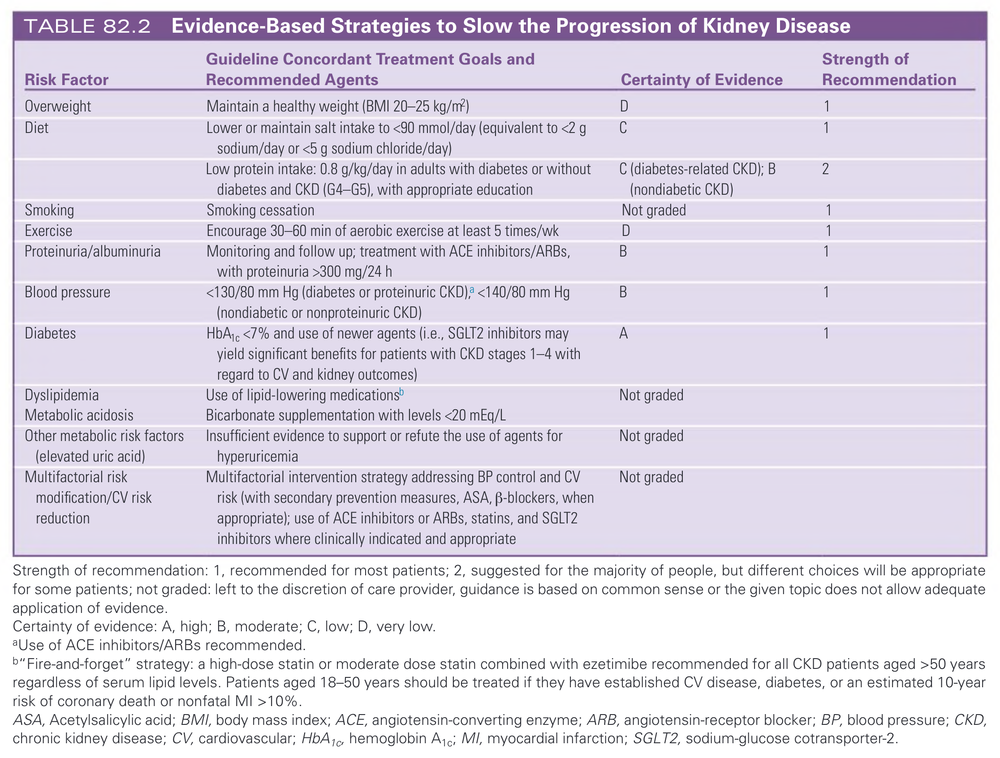

#### Table Data (CSV: [Table_82_2.csv](Table_82_2.csv))

```markdown
| Risk Factor | Guideline Concordant Treatment Goals and Recommended Agents | Certainty of Evidence | Strength of Recommendation |
| :--- | :--- | :--- | :--- |
| **Overweight** | Maintain a healthy weight (BMI 20–25 kg/m²) | D | 1 |
| **Diet** | Lower or maintain salt intake to <90 mmol/day (equivalent to <2 g sodium/day or <5 g sodium chloride/day) | C | 1 |
| | Low protein intake: 0.8 g/kg/day in adults with diabetes or without diabetes and CKD (G4-G5), with appropriate education | C (diabetes-related CKD); B (nondiabetic CKD) | 2 |
| **Smoking** | Smoking cessation | Not graded | 1 |
| **Exercise** | Encourage 30-60 min of aerobic exercise at least 5 times/wk | D | 1 |
| **Proteinuria/albuminuria** | Monitoring and follow up; treatment with ACE inhibitors/ARBs, with proteinuria >300 mg/24 h | B | 1 |
| **Blood pressure** | <130/80 mm Hg (diabetes or proteinuric CKD),^a <140/80 mm Hg (nondiabetic or nonproteinuric CKD) | B | 1 |
| **Diabetes** | HbA1c <7% and use of newer agents (i.e., SGLT2 inhibitors may yield significant benefits for patients with CKD stages 1-4 with regard to CV and kidney outcomes) | A | 1 |
| **Dyslipidemia** | Use of lipid-lowering medications^b | Not graded | |
| **Metabolic acidosis** | Bicarbonate supplementation with levels <20 mEq/L | | |
| **Other metabolic risk factors (elevated uric acid)** | Insufficient evidence to support or refute the use of agents for hyperuricemia | Not graded | |
| **Multifactorial risk modification/CV risk reduction** | Multifactorial intervention strategy addressing BP control and CV risk (with secondary prevention measures, ASA, β-blockers, when appropriate); use of ACE inhibitors or ARBs, statins, and SGLT2 inhibitors where clinically indicated and appropriate | Not graded | |

Strength of recommendation: 1, recommended for most patients; 2, suggested for the majority of people, but different choices will be appropriate for some patients; not graded: left to the discretion of care provider, guidance is based on common sense or the given topic does not allow adequate application of evidence.
Certainty of evidence: A, high; B, moderate; C, low; D, very low.
^aUse of ACE inhibitors/ARBs recommended.
^b"Fire-and-forget" strategy: a high-dose statin or moderate dose statin combined with ezetimibe recommended for all CKD patients aged >50 years regardless of serum lipid levels. Patients aged 18-50 years should be treated if they have established CV disease, diabetes, or an estimated 10-year risk of coronary death or nonfatal MI >10%.
ASA, Acetylsalicylic acid; BMI, body mass index; ACE, angiotensin-converting enzyme; ARB, angiotensin-receptor blocker; BP, blood pressure; CKD, chronic kidney disease; CV, cardiovascular; HbA1c, hemoglobin A1c; MI, myocardial infarction; SGLT2, sodium-glucose cotransporter-2.
```

TABLE 82.2 Evidence-Based Strategies to Slow the Progression of Kidney Disease

---

### Table_82_3

#### Table Image

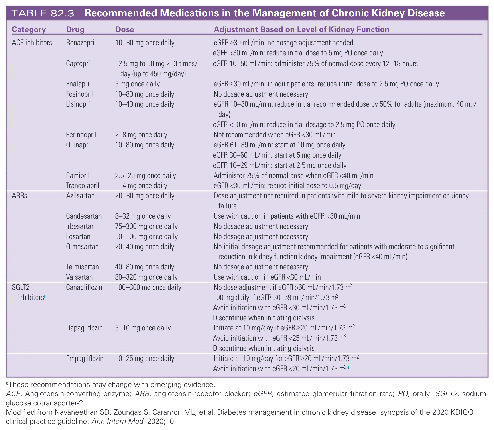

#### Table Data (CSV: [Table_82_3.csv](Table_82_3.csv))

```markdown
| Category | Drug | Dose | Adjustment Based on Level of Kidney Function |
| :--- | :--- | :--- | :--- |
| **ACE inhibitors** | Benazepril | 10-80 mg once daily | eGFR≥30 mL/min: no dosage adjustment needed eGFR <30 mL/min: reduce initial dose to 5 mg PO once daily |
| | Captopril | 12.5 mg to 50 mg 2-3 times/ day (up to 450 mg/day) | eGFR 10-50 mL/min: administer 75% of normal dose every 12-18 hours |
| | Enalapril | 5 mg once daily | eGFR≤30 mL/min: in adult patients, reduce initial dose to 2.5 mg PO once daily |
| | Fosinopril | 10-80 mg once daily | No dosage adjustment necessary |
| | Lisinopril | 10-40 mg once daily | eGFR 10-30 mL/min: reduce initial recommended dose by 50% for adults (maximum: 40 mg/ day) eGFR <10 mL/min: reduce initial dosage to 2.5 mg PO once daily |
| | Perindopril | 2-8 mg once daily | Not recommended when eGFR <30 mL/min |
| | Quinapril | 10-80 mg once daily | eGFR 61-89 mL/min: start at 10 mg once daily eGFR 30-60 mL/min: start at 5 mg once daily eGFR 10-29 mL/min: start at 2.5 mg once daily |
| | Ramipril | 2.5-20 mg once daily | Administer 25% of normal dose when eGFR <40 mL/min |
| | Trandolapril | 1-4 mg once daily | eGFR <30 mL/min: reduce initial dose to 0.5 mg/day |
| **ARBs** | Azilsartan | 20-80 mg once daily | Dose adjustment not required in patients with mild to severe kidney impairment or kidney failure |
| | Candesartan | 8-32 mg once daily | Use with caution in patients with eGFR <30 mL/min |
| | Irbesartan | 75-300 mg once daily | No dosage adjustment necessary |
| | Losartan | 50-100 mg once daily | No dosage adjustment necessary |
| | Olmesartan | 20-40 mg once daily | No initial dosage adjustment recommended for patients with moderate to significant reduction in kidney function kidney impairment (eGFR <40 mL/min) |
| | Telmisartan | 40-80 mg once daily | No dosage adjustment necessary |
| | Valsartan | 80-320 mg once daily | Use with caution in eGFR <30 mL/min |
| **SGLT2 inhibitors^a** | Canagliflozin | 100-300 mg once daily | No dose adjustment if eGFR >60 mL/min/1.73 m² 100 mg daily if eGFR 30-59 mL/min/1.73 m² Avoid initiation with eGFR <30 mL/min/1.73 m² Discontinue when initiating dialysis |
| | Dapagliflozin | 5-10 mg once daily | Initiate at 10 mg/day if eGFR≥20 mL/min/1.73 m² Avoid initiation with eGFR <25 mL/min/1.73 m² Discontinue when initiating dialysis |
| | Empagliflozin | 10-25 mg once daily | Initiate at 10 mg/day for eGFR≥20 mL/min/1.73 m² Avoid initiation with eGFR <20 mL/min/1.73 m²^a |

aThese recommendations may change with emerging evidence.
ACE, Angiotensin-converting enzyme; ARB, angiotensin-receptor blocker; eGFR, estimated glomerular filtration rate; PO, orally; SGLT2, sodium-glucose cotransporter-2.
Modified from Navaneethan SD, Zoungas S, Caramori ML, et al. Diabetes management in chronic kidney disease: synopsis of the 2020 KDIGO clinical practice guideline. Ann Intern Med. 2020;10.
```

TABLE 82.3 Recommended Medications in the Management of Chronic Kidney Disease

---

## Boxes

### Box_82_1

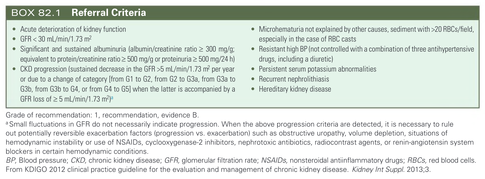

#### Box Text

```markdown
*   Acute deterioration of kidney function
*   GFR < 30 mL/min/1.73 m²
*   Significant and sustained albuminuria (albumin/creatinine ratio ≥ 300 mg/g; equivalent to protein/creatinine ratio ≥ 500 mg/g or proteinuria ≥ 500 mg/24 h)
*   CKD progression (sustained decrease in the GFR >5 mL/min/1.73 m² per year or due to a change of category [from G1 to G2, from G2 to G3a, from G3a to G3b, from G3b to G4, or from G4 to G5] when the latter is accompanied by a GFR loss of ≥ 5 mL/min/1.73 m²)a
*   Microhematuria not explained by other causes, sediment with >20 RBCs/field, especially in the case of RBC casts
*   Resistant high BP (not controlled with a combination of three antihypertensive drugs, including a diuretic)
*   Persistent serum potassium abnormalities
*   Recurrent nephrolithiasis
*   Hereditary kidney disease

Grade of recommendation: 1, recommendation, evidence B.
a Small fluctuations in GFR do not necessarily indicate progression. When the above progression criteria are detected, it is necessary to rule out potentially reversible exacerbation factors (progression vs. exacerbation) such as obstructive uropathy, volume depletion, situations of hemodynamic instability or use of NSAIDs, cyclooxygenase-2 inhibitors, nephrotoxic antibiotics, radiocontrast agents, or renin-angiotensin system blockers in certain hemodynamic conditions.
BP, Blood pressure; CKD, chronic kidney disease; GFR, glomerular filtration rate; NSAIDs, nonsteroidal antiinflammatory drugs; RBCs, red blood cells. From KDIGO 2012 clinical practice guideline for the evaluation and management of chronic kidney disease. Kidney Int Suppl. 2013;3.
```

BOX 82.1 Referral Criteria

---
