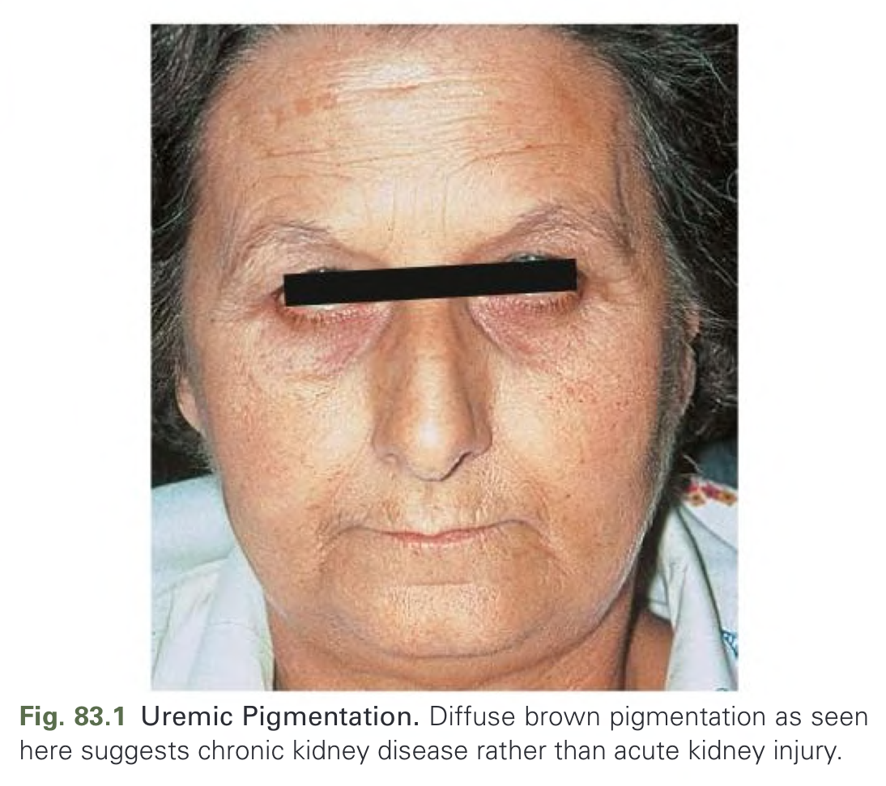
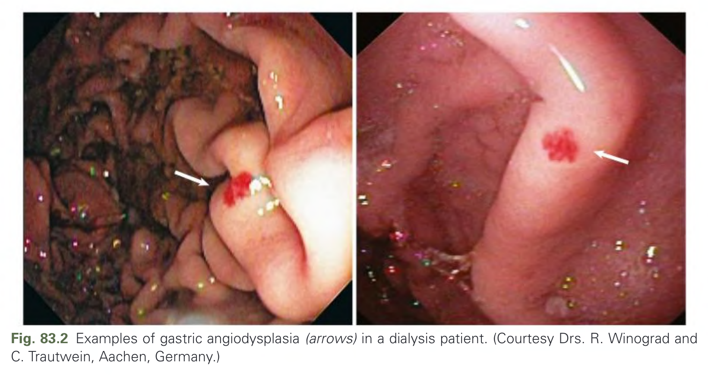
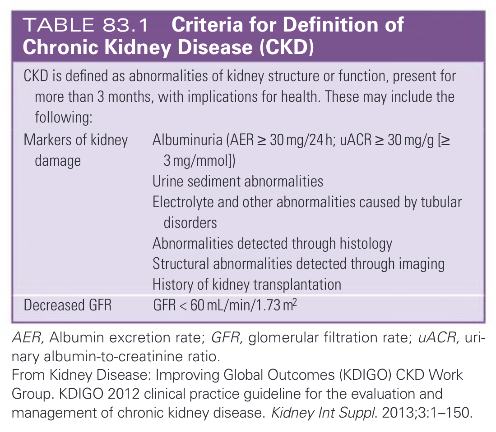
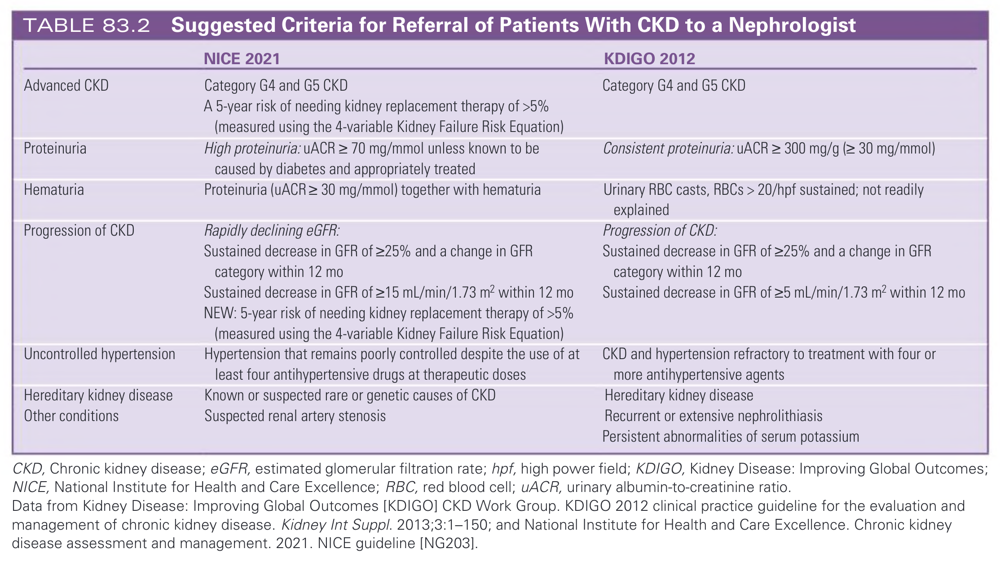
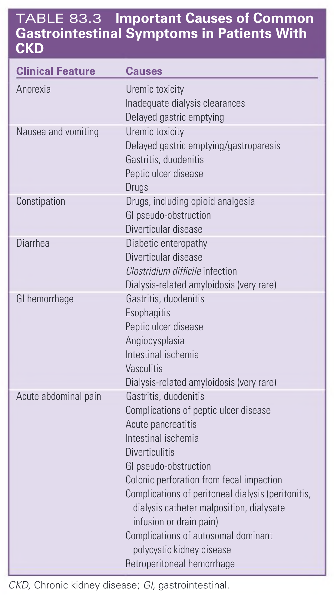
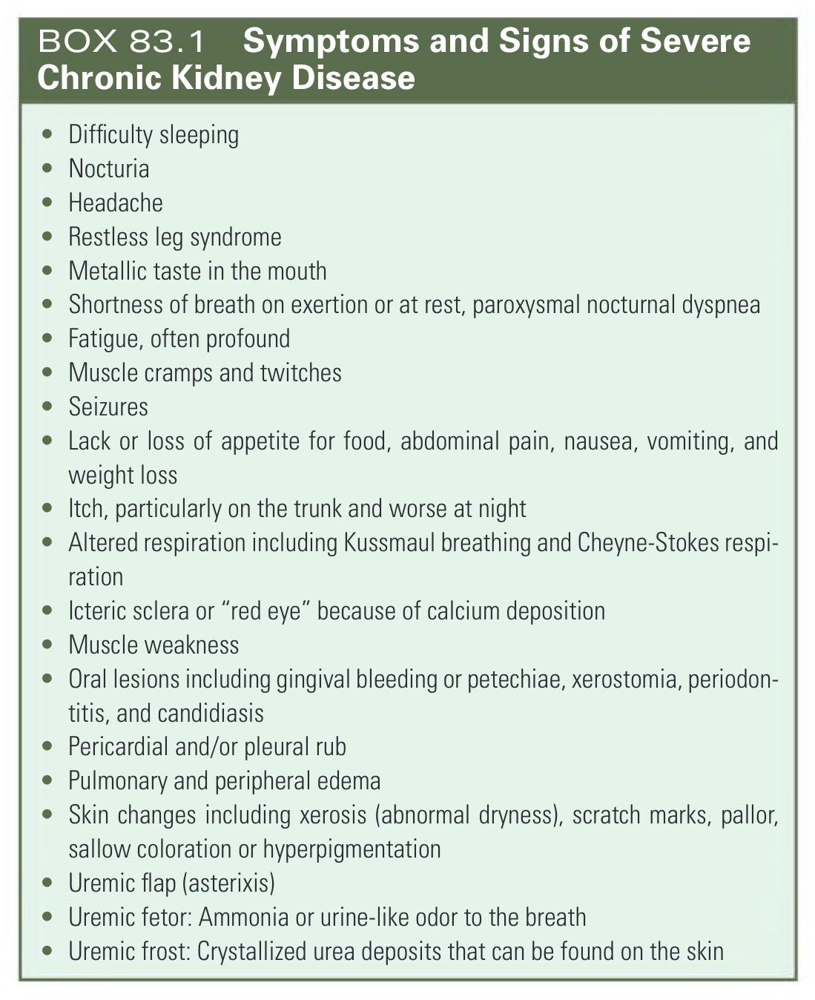

# 083. Clinical Evaluation and Management of Chronic Kidney Disease - Figures and Tables Index

This document lists all figures, tables and boxes extracted from `083. Clinical Evaluation and Management of Chronic Kidney Disease.pdf`.

## Table of Contents
- [Figures](#figures)
- [Tables](#tables)
- [Boxes](#boxes)

---

## Figures

### Fig_83_1



Fig. 83.1 Uremic Pigmentation. Diffuse brown pigmentation as seen here suggests chronic kidney disease rather than acute kidney injury.

---

### Fig_83_2



Fig. 83.2 Examples of gastric angiodysplasia (arrows) in a dialysis patient. (Courtesy Drs. R. Winograd and C. Trautwein, Aachen, Germany.)

---

## Tables

### Table_83_1

#### Table Image



#### Table Data (CSV: [Table_83_1.csv](Table_83_1.csv))

```markdown
| | |
| :--- | :--- |
| **CKD is defined as abnormalities of kidney structure or function, present for more than 3 months, with implications for health. These may include the following:** | |
| Markers of kidney damage | Albuminuria (AER ≥ 30 mg/24 h; uACR ≥ 30 mg/g [≥ 3 mg/mmol])<br>Urine sediment abnormalities<br>Electrolyte and other abnormalities caused by tubular disorders<br>Abnormalities detected through histology<br>Structural abnormalities detected through imaging<br>History of kidney transplantation |
| Decreased GFR | GFR < 60 mL/min/1.73 m<sup>2</sup> |

AER, Albumin excretion rate; GFR, glomerular filtration rate; uACR, urinary albumin-to-creatinine ratio.
From Kidney Disease: Improving Global Outcomes (KDIGO) CKD Work Group. KDIGO 2012 clinical practice guideline for the evaluation and management of chronic kidney disease. Kidney Int Suppl. 2013;3:1–150.
```

TABLE 83.1 Criteria for Definition of Chronic Kidney Disease (CKD)

---

### Table_83_2

#### Table Image



#### Table Data (CSV: [Table_83_2.csv](Table_83_2.csv))

```markdown
| | NICE 2021 | KDIGO 2012 |
| :--- | :--- | :--- |
| **Advanced CKD** | Category G4 and G5 CKD<br>A 5-year risk of needing kidney replacement therapy of >5% (measured using the 4-variable Kidney Failure Risk Equation) | Category G4 and G5 CKD |
| **Proteinuria** | High proteinuria: uACR ≥ 70 mg/mmol unless known to be caused by diabetes and appropriately treated | Consistent proteinuria: uACR ≥ 300 mg/g (≥ 30 mg/mmol) |
| **Hematuria** | Proteinuria (uACR≥ 30 mg/mmol) together with hematuria | Urinary RBC casts, RBCs > 20/hpf sustained; not readily explained |
| **Progression of CKD** | Rapidly declining eGFR:<br>Sustained decrease in GFR of ≥25% and a change in GFR category within 12 mo<br>Sustained decrease in GFR of ≥15 mL/min/1.73 m² within 12 mo<br>NEW: 5-year risk of needing kidney replacement therapy of >5% (measured using the 4-variable Kidney Failure Risk Equation) | Progression of CKD:<br>Sustained decrease in GFR of ≥25% and a change in GFR category within 12 mo<br>Sustained decrease in GFR of ≥5 mL/min/1.73 m² within 12 mo |
| **Uncontrolled hypertension** | Hypertension that remains poorly controlled despite the use of at least four antihypertensive drugs at therapeutic doses | CKD and hypertension refractory to treatment with four or more antihypertensive agents |
| **Hereditary kidney disease** | Known or suspected rare or genetic causes of CKD | Hereditary kidney disease |
| **Other conditions** | Suspected renal artery stenosis | Recurrent or extensive nephrolithiasis<br>Persistent abnormalities of serum potassium |

CKD, Chronic kidney disease; eGFR, estimated glomerular filtration rate; hpf, high power field; KDIGO, Kidney Disease: Improving Global Outcomes; NICE, National Institute for Health and Care Excellence; RBC, red blood cell; uACR, urinary albumin-to-creatinine ratio.
Data from Kidney Disease: Improving Global Outcomes [KDIGO] CKD Work Group. KDIGO 2012 clinical practice guideline for the evaluation and management of chronic kidney disease. Kidney Int Suppl. 2013;3:1-150; and National Institute for Health and Care Excellence. Chronic kidney disease assessment and management. 2021. NICE guideline [NG203].
```

TABLE 83.2 Suggested Criteria for Referral of Patients With CKD to a Nephrologist

---

### Table_83_3

#### Table Image



#### Table Data (CSV: [Table_83_3.csv](Table_83_3.csv))

```markdown
| Clinical Feature | Causes |
| :--- | :--- |
| Anorexia | Uremic toxicity<br>Inadequate dialysis clearances<br>Delayed gastric emptying |
| Nausea and vomiting | Uremic toxicity<br>Delayed gastric emptying/gastroparesis<br>Gastritis, duodenitis<br>Peptic ulcer disease<br>Drugs |
| Constipation | Drugs, including opioid analgesia<br>GI pseudo-obstruction<br>Diverticular disease |
| Diarrhea | Diabetic enteropathy<br>Diverticular disease<br>Clostridium difficile infection<br>Dialysis-related amyloidosis (very rare) |
| GI hemorrhage | Gastritis, duodenitis<br>Esophagitis<br>Peptic ulcer disease<br>Angiodysplasia<br>Intestinal ischemia<br>Vasculitis<br>Dialysis-related amyloidosis (very rare) |
| Acute abdominal pain | Gastritis, duodenitis<br>Complications of peptic ulcer disease<br>Acute pancreatitis<br>Intestinal ischemia<br>Diverticulitis<br>GI pseudo-obstruction<br>Colonic perforation from fecal impaction<br>Complications of peritoneal dialysis (peritonitis, dialysis catheter malposition, dialysate infusion or drain pain)<br>Complications of autosomal dominant polycystic kidney disease<br>Retroperitoneal hemorrhage |

CKD, Chronic kidney disease; GI, gastrointestinal.
```

TABLE 83.3 Important Causes of Common Gastrointestinal Symptoms in Patients With CKD

---

## Boxes

### Box_83_1



#### Box Text

```markdown
*   Difficulty sleeping
*   Nocturia
*   Headache
*   Restless leg syndrome
*   Metallic taste in the mouth
*   Shortness of breath on exertion or at rest, paroxysmal nocturnal dyspnea
*   Fatigue, often profound
*   Muscle cramps and twitches
*   Seizures
*   Lack or loss of appetite for food, abdominal pain, nausea, vomiting, and weight loss
*   Itch, particularly on the trunk and worse at night
*   Altered respiration including Kussmaul breathing and Cheyne-Stokes respiration
*   Icteric sclera or "red eye" because of calcium deposition
*   Muscle weakness
*   Oral lesions including gingival bleeding or petechiae, xerostomia, periodontitis, and candidiasis
*   Pericardial and/or pleural rub
*   Pulmonary and peripheral edema
*   Skin changes including xerosis (abnormal dryness), scratch marks, pallor, sallow coloration or hyperpigmentation
*   Uremic flap (asterixis)
*   Uremic fetor: Ammonia or urine-like odor to the breath
*   Uremic frost: Crystallized urea deposits that can be found on the skin
```

BOX 83.1 Symptoms and Signs of Severe Chronic Kidney Disease

---
