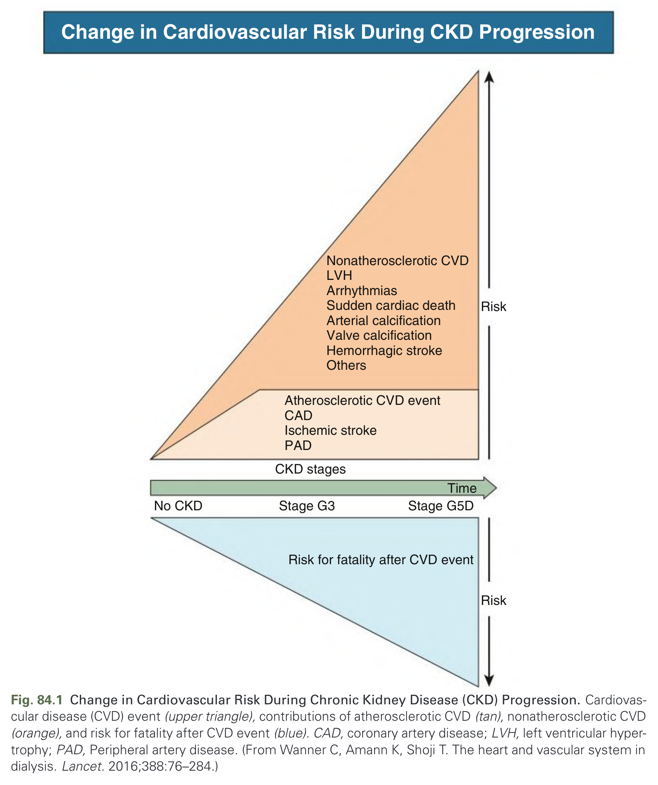
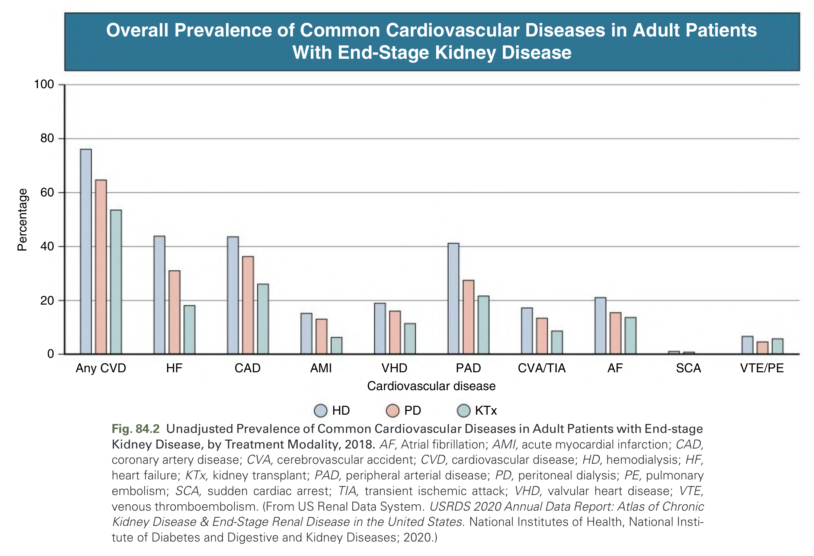
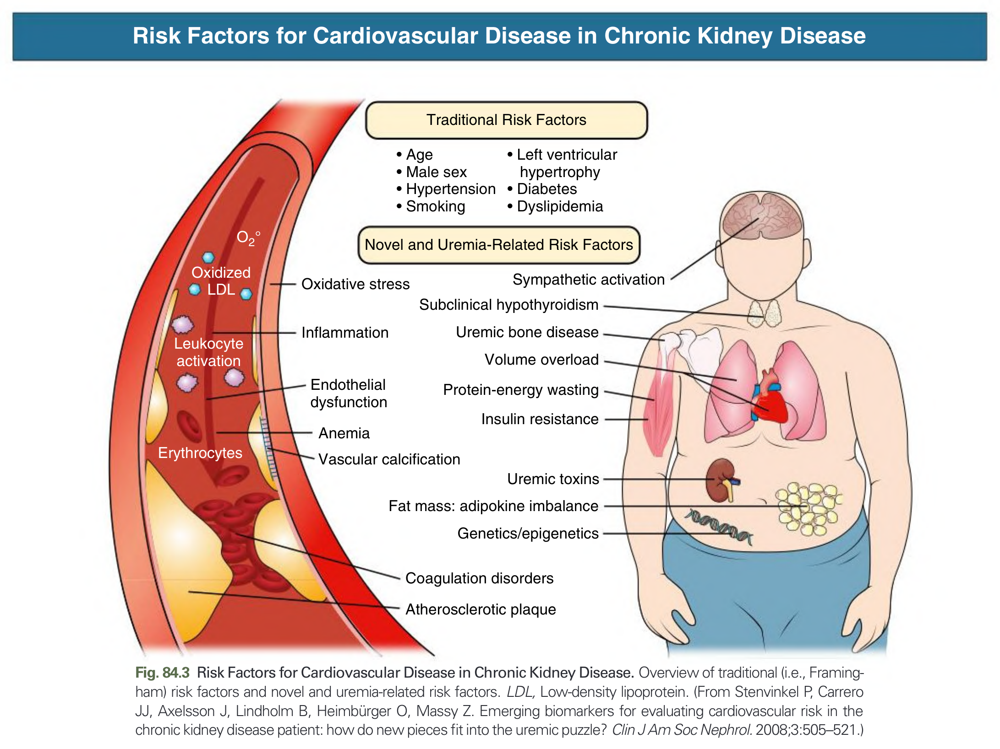
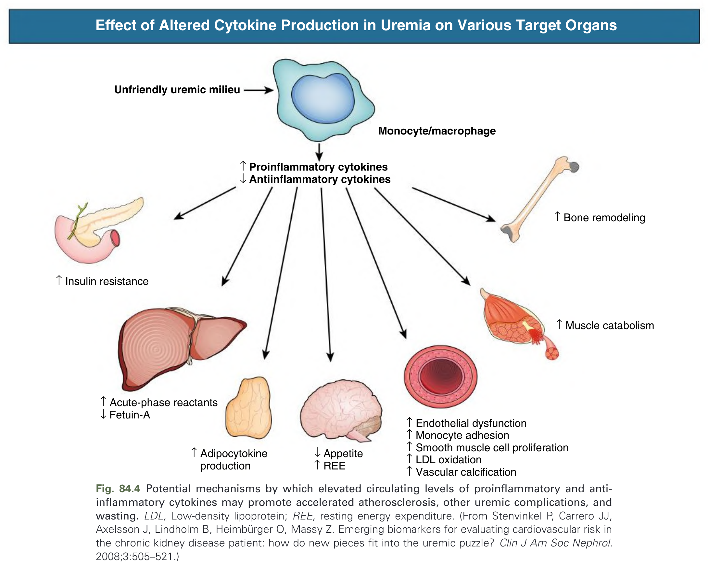
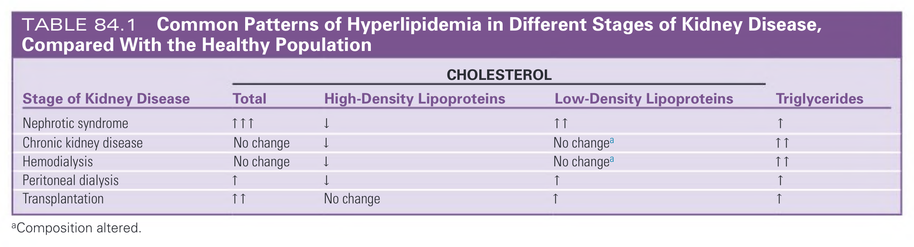

# 084. Pathogenesis and Risk of Cardiovascular Disease in Chronic Kidney Disease - Figures and Tables Index

This document lists all figures, tables and boxes extracted from `084. Pathogenesis and Risk of Cardiovascular Disease in Chronic Kidney Disease.pdf`.

## Table of Contents
- [Figures](#figures)
- [Tables](#tables)
- [Boxes](#boxes)

---

## Figures

### Fig_84_1



Fig. 84.1 Change in Cardiovascular Risk During Chronic Kidney Disease (CKD) Progression. Cardiovascular disease (CVD) event (upper triangle), contributions of atherosclerotic CVD (tan), nonatherosclerotic CVD (orange), and risk for fatality after CVD event (blue). CAD, coronary artery disease; LVH, left ventricular hypertrophy; PAD, Peripheral artery disease. (From Wanner C, Amann K, Shoji T. The heart and vascular system in dialysis. Lancet. 2016;388:76–284.)

---

### Fig_84_2



Fig. 84.2 Unadjusted Prevalence of Common Cardiovascular Diseases in Adult Patients with End-stage Kidney Disease, by Treatment Modality, 2018. AF, Atrial fibrillation; AMI, acute myocardial infarction; CAD, coronary artery disease; CVA, cerebrovascular accident; CVD, cardiovascular disease; HD, hemodialysis; HF, heart failure; KTx, kidney transplant; PAD, peripheral arterial disease; PD, peritoneal dialysis; PE, pulmonary embolism; SCA, sudden cardiac arrest; TIA, transient ischemic attack; VHD, valvular heart disease; VTE, venous thromboembolism. (From US Renal Data System. USRDS 2020 Annual Data Report: Atlas of Chronic Kidney Disease & End-Stage Renal Disease in the United States. National Institutes of Health, National Institute of Diabetes and Digestive and Kidney Diseases; 2020.)

---

### Fig_84_3



Fig. 84.3 Risk Factors for Cardiovascular Disease in Chronic Kidney Disease. Overview of traditional (i.e., Framingham) risk factors and novel and uremia-related risk factors. LDL, Low-density lipoprotein. (From Stenvinkel P, Carrero JJ, Axelsson J, Lindholm B, Heimbürger O, Massy Z. Emerging biomarkers for evaluating cardiovascular risk in the chronic kidney disease patient: how do new pieces fit into the uremic puzzle? Clin J Am Soc Nephrol. 2008;3:505–521.)

---

### Fig_84_4



Fig. 84.4 Potential mechanisms by which elevated circulating levels of proinflammatory and anti-inflammatory cytokines may promote accelerated atherosclerosis, other uremic complications, and wasting. LDL, Low-density lipoprotein; REE, resting energy expenditure. (From Stenvinkel P, Carrero JJ, Axelsson J, Lindholm B, Heimbürger O, Massy Z. Emerging biomarkers for evaluating cardiovascular risk in the chronic kidney disease patient: how do new pieces fit into the uremic puzzle? Clin J Am Soc Nephrol. 2008;3:505–521.)

---

## Tables

### Table_84_1

#### Table Image



#### Table Data (CSV: [Table_84_1.csv](Table_84_1.csv))

```markdown
| Stage of Kidney Disease | Total Cholesterol | High-Density Lipoproteins | Low-Density Lipoproteins | Triglycerides |
| :--- | :--- | :--- | :--- | :--- |
| Nephrotic syndrome | ↑↑↑ | ↓ | ↑↑ | ↑ |
| Chronic kidney disease | No change | ↓ | No change^a | ↑↑ |
| Hemodialysis | No change | ↓ | No change^a | ↑↑ |
| Peritoneal dialysis | ↑ | ↓ | ↑ | ↑ |
| Transplantation | ↑↑ | No change | ↑ | ↑ |
*^aComposition altered.*
```

TABLE 84.1 Common Patterns of Hyperlipidemia in Different Stages of Kidney Disease, Compared With the Healthy Population

---

## Boxes

*No boxes resolved for this chapter.*
