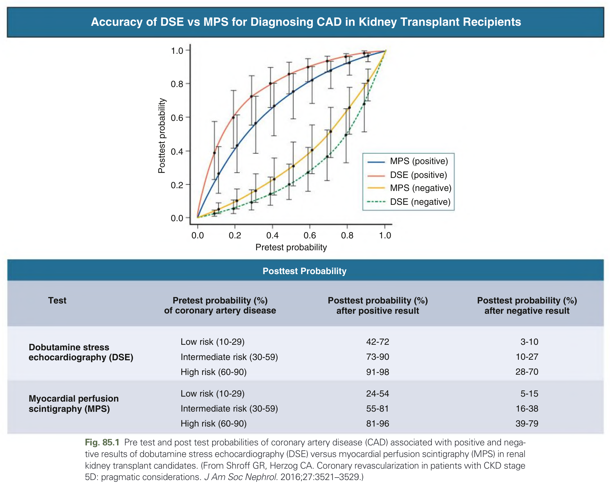
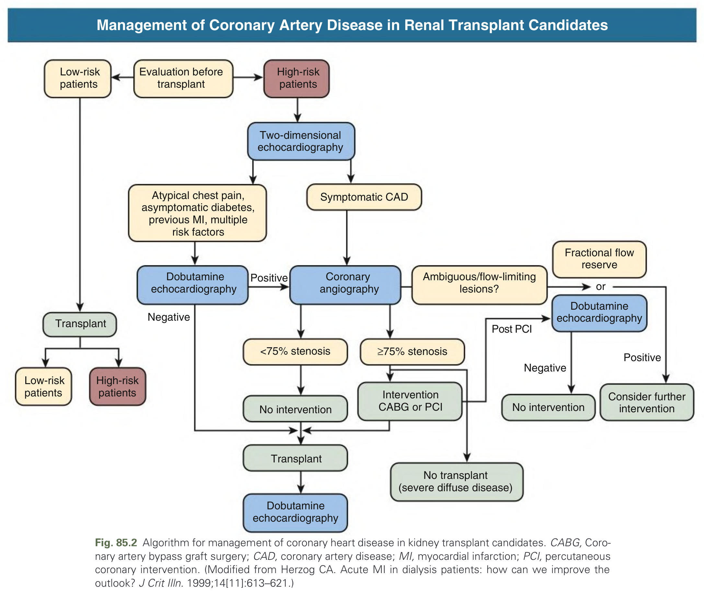
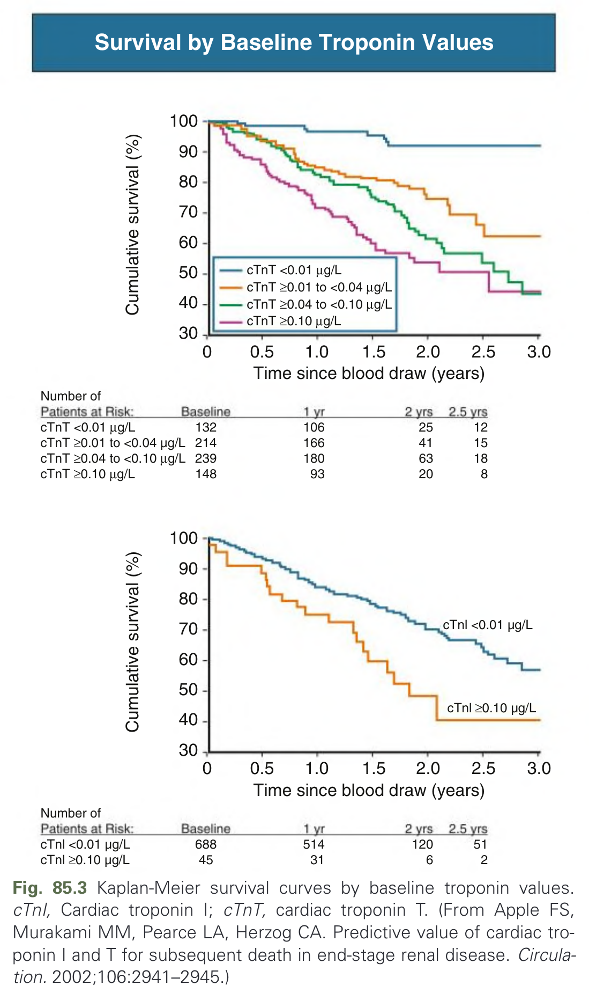
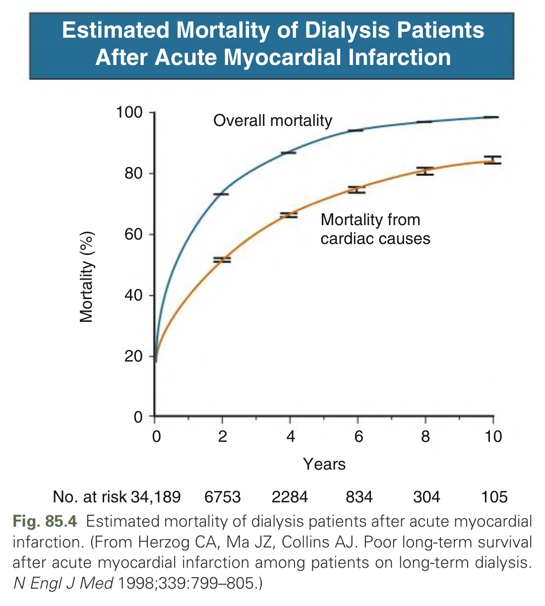
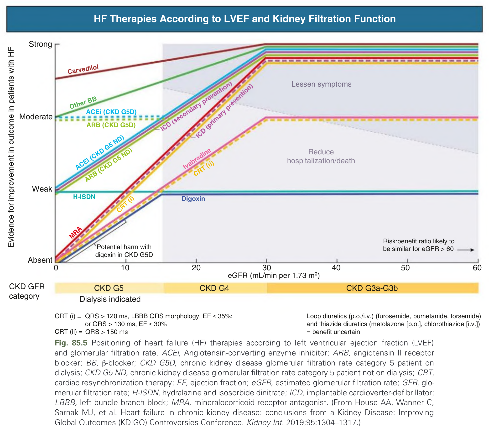
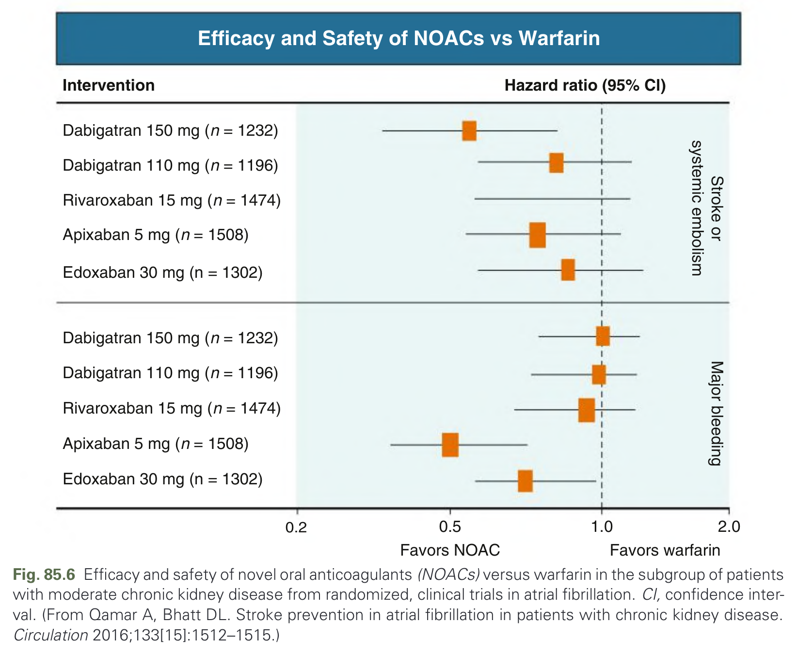
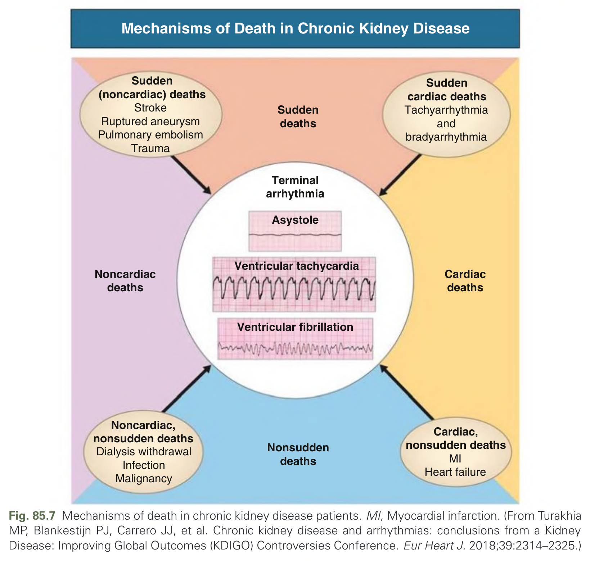
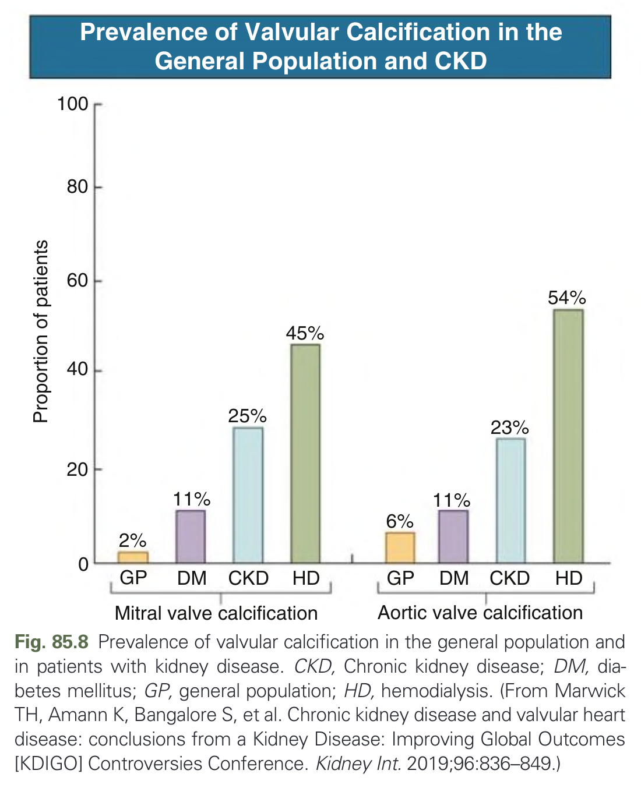

# 085. Practical Management of Cardiovascular Disease in Chronic Kidney Disease - Figures and Tables Index

This document lists all figures, tables and boxes extracted from `085. Practical Management of Cardiovascular Disease in Chronic Kidney Disease.pdf`.

## Table of Contents
- [Figures](#figures)
- [Tables](#tables)
- [Boxes](#boxes)

---

## Figures

### Fig_85_1

Fig. 85.1 Pre test and post test probabilities of coronary artery disease (CAD) associated with positive and negative results of dobutamine stress echocardiography (DSE) versus myocardial perfusion scintigraphy (MPS) in renal kidney transplant candidates. (From Shroff GR, Herzog CA. Coronary revascularization in patients with CKD stage 5D: pragmatic considerations. J Am Soc Nephrol. 2016;27:3521–3529.)

---

### Fig_85_2

Fig. 85.2 Algorithm for management of coronary heart disease in kidney transplant candidates. CABG, Coronary artery bypass graft surgery; CAD, coronary artery disease; MI, myocardial infarction; PCI, percutaneous coronary intervention. (Modified from Herzog CA. Acute MI in dialysis patients: how can we improve the outlook? J Crit Illn. 1999;14[11]:613–621.)

---

### Fig_85_3

Fig. 85.3 Kaplan-Meier survival curves by baseline troponin values. cTnI, Cardiac troponin I; cTnT, cardiac troponin T. (From Apple FS, Murakami MM, Pearce LA, Herzog CA. Predictive value of cardiac troponin I and T for subsequent death in end-stage renal disease. Circulation. 2002;106:2941–2945.)

---

### Fig_85_4

Fig. 85.4 Estimated mortality of dialysis patients after acute myocardial infarction. (From Herzog CA, Ma JZ, Collins AJ. Poor long-term survival after acute myocardial infarction among patients on long-term dialysis. N Engl J Med 1998;339:799–805.)

---

### Fig_85_5

Fig. 85.5 Positioning of heart failure (HF) therapies according to left ventricular ejection fraction (LVEF) and glomerular filtration rate. ACEi, Angiotensin-converting enzyme inhibitor; ARB, angiotensin II receptor blocker; BB, β-blocker; CKD G5D, chronic kidney disease glomerular filtration rate category 5 patient on dialysis; CKD G5 ND, chronic kidney disease glomerular filtration rate category 5 patient not on dialysis; CRT, cardiac resynchronization therapy; EF, ejection fraction; eGFR, estimated glomerular filtration rate; GFR, glomerular filtration rate; H-ISDN, hydralazine and isosorbide dinitrate; ICD, implantable cardioverter-defibrillator; LBBB, left bundle branch block; MRA, mineralocorticoid receptor antagonist. (From House AA, Wanner C, Sarnak MJ, et al. Heart failure in chronic kidney disease: conclusions from a Kidney Disease: Improving Global Outcomes (KDIGO) Controversies Conference. Kidney Int. 2019;95:1304–1317.)

---

### Fig_85_6

Fig. 85.6 Efficacy and safety of novel oral anticoagulants (NOACs) versus warfarin in the subgroup of patients with moderate chronic kidney disease from randomized, clinical trials in atrial fibrillation. CI, confidence interval. (From Qamar A, Bhatt DL. Stroke prevention in atrial fibrillation in patients with chronic kidney disease. Circulation 2016;133[15]:1512–1515.)

---

### Fig_85_7

Fig. 85.7 Mechanisms of death in chronic kidney disease patients. MI, Myocardial infarction. (From Turakhia MP, Blankestijn PJ, Carrero JJ, et al. Chronic kidney disease and arrhythmias: conclusions from a Kidney Disease: Improving Global Outcomes (KDIGO) Controversies Conference. Eur Heart J. 2018;39:2314–2325.)

---

### Fig_85_8

Fig. 85.8 Prevalence of valvular calcification in the general population and in patients with kidney disease. CKD, Chronic kidney disease; DM, diabetes mellitus; GP, general population; HD, hemodialysis. (From Marwick TH, Amann K, Bangalore S, et al. Chronic kidney disease and valvular heart disease: conclusions from a Kidney Disease: Improving Global Outcomes [KDIGO] Controversies Conference. Kidney Int. 2019;96:836–849.)

---

## Tables

*No tables resolved for this chapter.*

## Boxes

*No boxes resolved for this chapter.*
