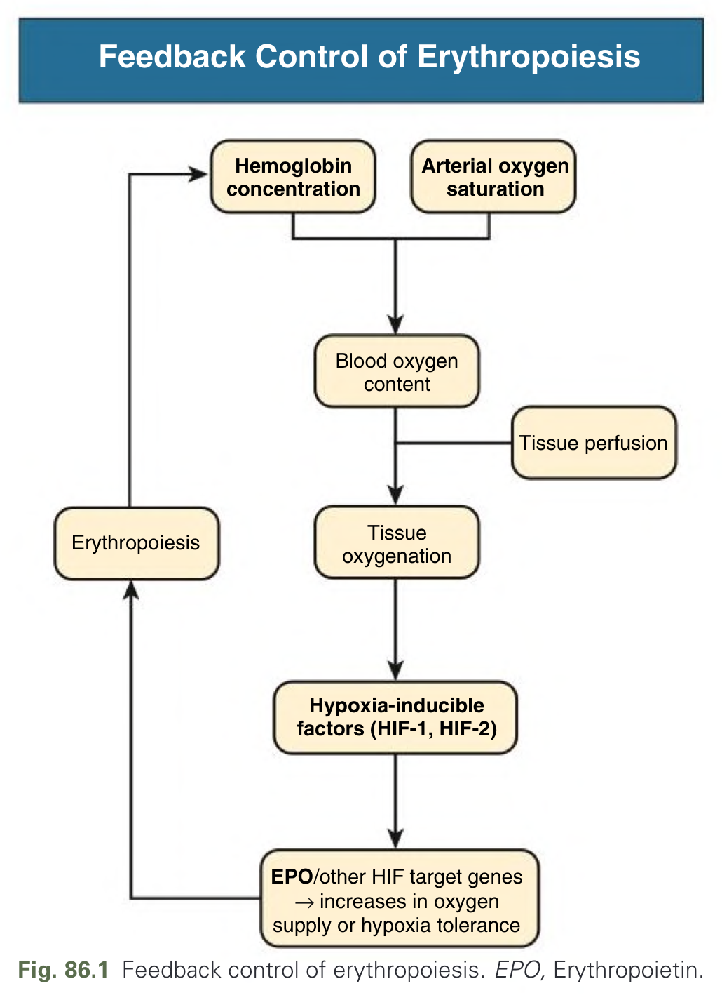
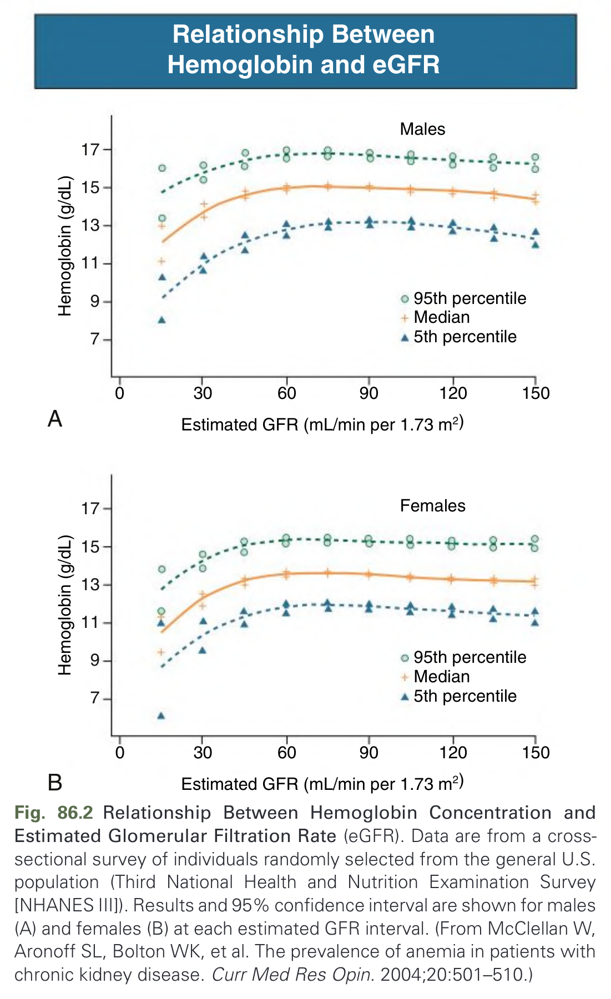
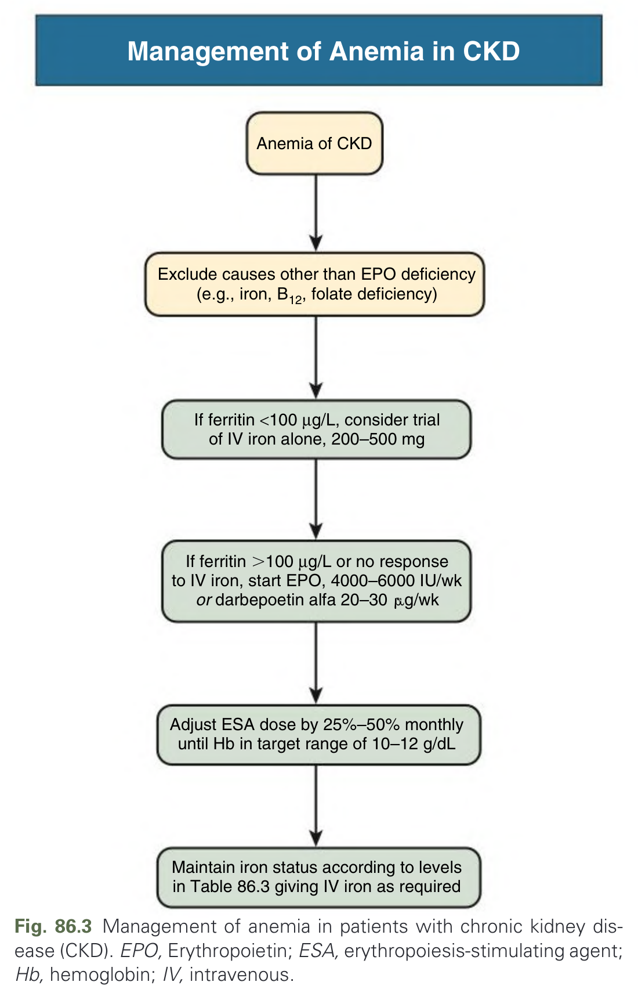
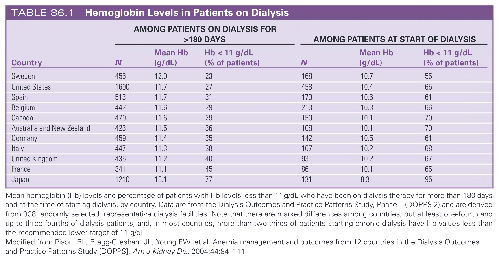
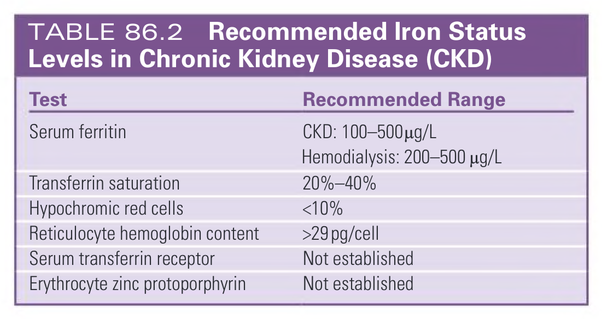
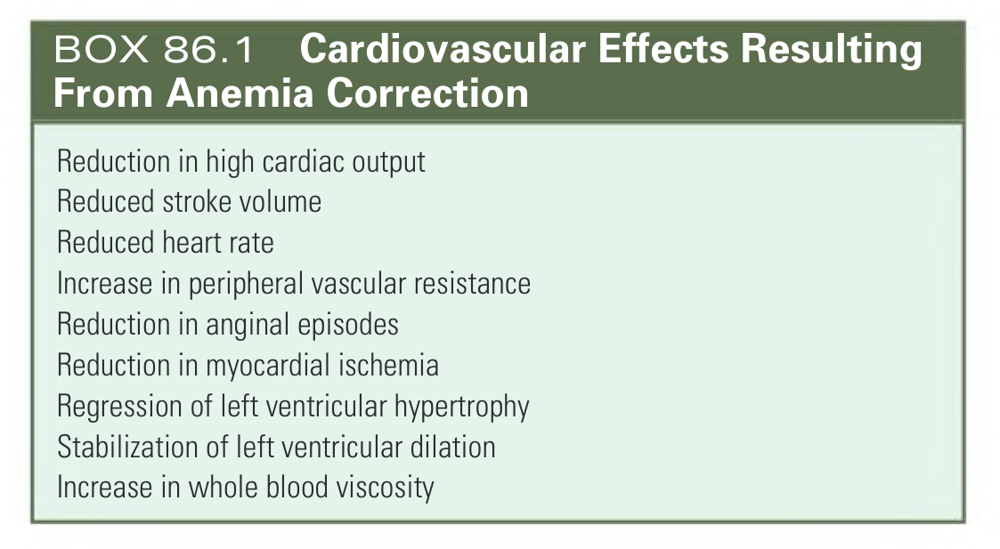
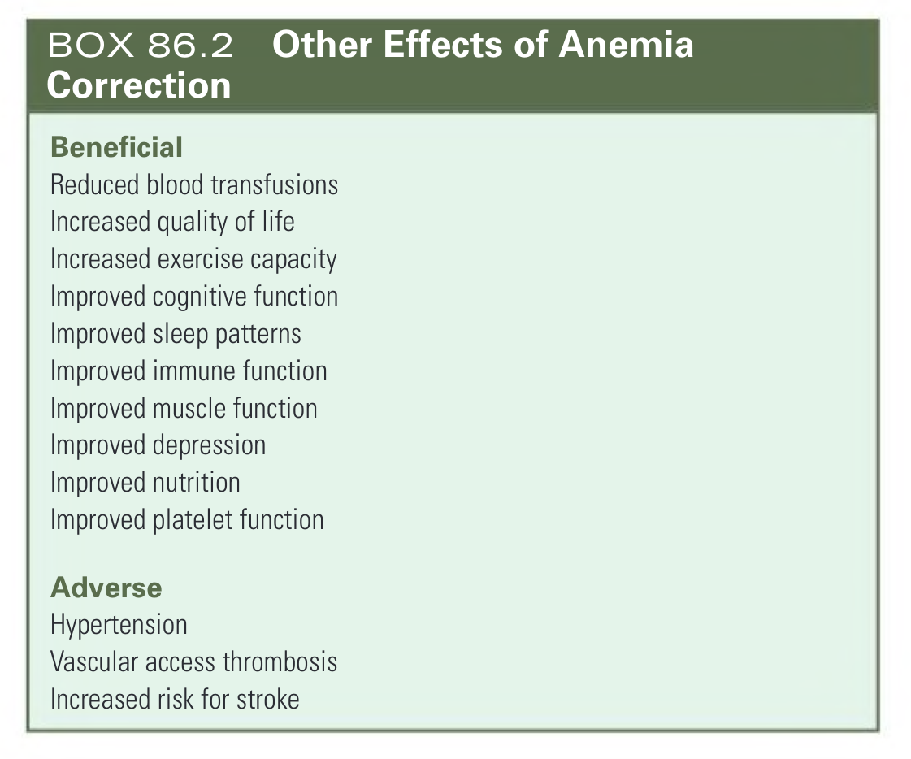
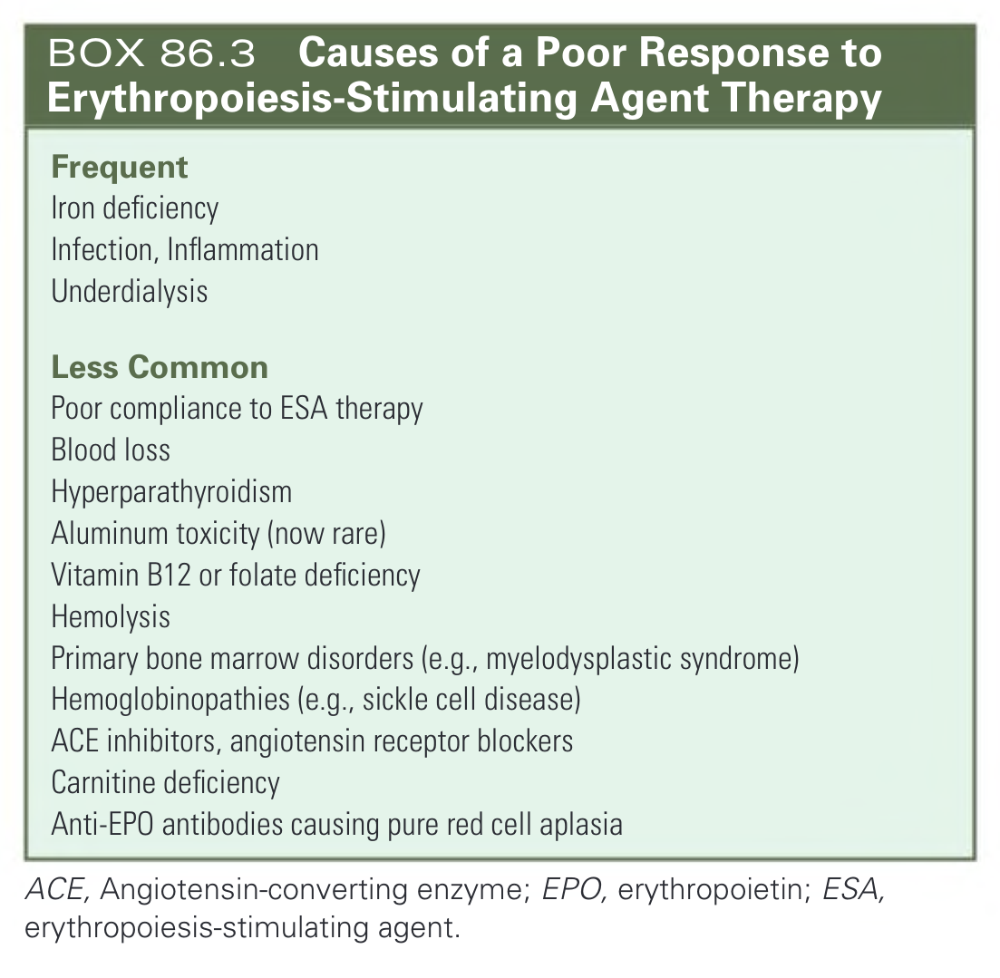

# 086. Anemia in Chronic Kidney Disease - Figures and Tables Index

This document lists all figures, tables and boxes extracted from `086. Anemia in Chronic Kidney Disease.pdf`.

## Table of Contents
- [Figures](#figures)
- [Tables](#tables)
- [Boxes](#boxes)

---

## Figures

### Fig_86_1



Fig. 86.1 Feedback control of erythropoiesis. EPO, Erythropoietin.

---

### Fig_86_2



Fig. 86.2 Relationship Between Hemoglobin Concentration and Estimated Glomerular Filtration Rate (eGFR). Data are from a cross-sectional survey of individuals randomly selected from the general U.S. population (Third National Health and Nutrition Examination Survey [NHANES III]). Results and 95% confidence interval are shown for males (A) and females (B) at each estimated GFR interval. (From McClellan W, Aronoff SL, Bolton WK, et al. The prevalence of anemia in patients with chronic kidney disease. Curr Med Res Opin. 2004;20:501–510.)

---

### Fig_86_3



Fig. 86.3 Management of anemia in patients with chronic kidney disease (CKD). EPO, Erythropoietin; ESA, erythropoiesis-stimulating agent; Hb, hemoglobin; IV, intravenous.

---

## Tables

### Table_86_1

#### Table Image



#### Table Data (CSV: [Table_86_1.csv](Table_86_1.csv))

```markdown
| | AMONG PATIENTS ON DIALYSIS FOR >180 DAYS | | | AMONG PATIENTS AT START OF DIALYSIS | | |
| Country | N | Mean Hb (g/dL) | Hb < 11 g/dL (% of patients) | N | Mean Hb (g/dL) | Hb < 11 g/dL (% of patients) |
| :--- | :--- | :--- | :--- | :--- | :--- | :--- |
| Sweden | 456 | 12.0 | 23 | 168 | 10.7 | 55 |
| United States | 1690 | 11.7 | 27 | 458 | 10.4 | 65 |
| Spain | 513 | 11.7 | 31 | 170 | 10.6 | 61 |
| Belgium | 442 | 11.6 | 29 | 213 | 10.3 | 66 |
| Canada | 479 | 11.6 | 29 | 150 | 10.1 | 70 |
| Australia and New Zealand | 423 | 11.5 | 36 | 108 | 10.1 | 70 |
| Germany | 459 | 11.4 | 35 | 142 | 10.5 | 61 |
| Italy | 447 | 11.3 | 38 | 167 | 10.2 | 68 |
| United Kingdom | 436 | 11.2 | 40 | 93 | 10.2 | 67 |
| France | 341 | 11.1 | 45 | 86 | 10.1 | 65 |
| Japan | 1210 | 10.1 | 77 | 131 | 8.3 | 95 |

Mean hemoglobin (Hb) levels and percentage of patients with Hb levels less than 11 g/dL who have been on dialysis therapy for more than 180 days and at the time of starting dialysis, by country. Data are from the Dialysis Outcomes and Practice Patterns Study, Phase II (DOPPS 2) and are derived from 308 randomly selected, representative dialysis facilities. Note that there are marked differences among countries, but at least one-fourth and up to three-fourths of dialysis patients, and, in most countries, more than two-thirds of patients starting chronic dialysis have Hb values less than the recommended lower target of 11 g/dL.
Modified from Pisoni RL, Bragg-Gresham JL, Young EW, et al. Anemia management and outcomes from 12 countries in the Dialysis Outcomes and Practice Patterns Study [DOPPS]. Am J Kidney Dis. 2004;44:94–111.
```

TABLE 86.1 Hemoglobin Levels in Patients on Dialysis

---

### Table_86_2

#### Table Image



#### Table Data (CSV: [Table_86_2.csv](Table_86_2.csv))

```markdown
| Test | Recommended Range |
| :--- | :--- |
| Serum ferritin | CKD: 100–500 μg/L<br>Hemodialysis: 200–500 μg/L |
| Transferrin saturation | 20%–40% |
| Hypochromic red cells | <10% |
| Reticulocyte hemoglobin content | >29 pg/cell |
| Serum transferrin receptor | Not established |
| Erythrocyte zinc protoporphyrin | Not established |
```

TABLE 86.2 Recommended Iron Status Levels in Chronic Kidney Disease (CKD)

---

## Boxes

### Box_86_1



#### Box Text

```markdown
- Reduction in high cardiac output
- Reduced stroke volume
- Reduced heart rate
- Increase in peripheral vascular resistance
- Reduction in anginal episodes
- Reduction in myocardial ischemia
- Regression of left ventricular hypertrophy
- Stabilization of left ventricular dilation
- Increase in whole blood viscosity
```

BOX 86.1 Cardiovascular Effects Resulting From Anemia Correction

---

### Box_86_2



#### Box Text

```markdown
**Beneficial**
- Reduced blood transfusions
- Increased quality of life
- Increased exercise capacity
- Improved cognitive function
- Improved sleep patterns
- Improved immune function
- Improved muscle function
- Improved depression
- Improved nutrition
- Improved platelet function

**Adverse**
- Hypertension
- Vascular access thrombosis
- Increased risk for stroke
```

BOX 86.2 Other Effects of Anemia Correction

---

### Box_86_3



#### Box Text

```markdown
**Frequent**
- Iron deficiency
- Infection, Inflammation
- Underdialysis

**Less Common**
- Poor compliance to ESA therapy
- Blood loss
- Hyperparathyroidism
- Aluminum toxicity (now rare)
- Vitamin B12 or folate deficiency
- Hemolysis
- Primary bone marrow disorders (e.g., myelodysplastic syndrome)
- Hemoglobinopathies (e.g., sickle cell disease)
- ACE inhibitors, angiotensin receptor blockers
- Carnitine deficiency
- Anti-EPO antibodies causing pure red cell aplasia

ACE, Angiotensin-converting enzyme; EPO, erythropoietin; ESA, erythropoiesis-stimulating agent.
```

BOX 86.3 Causes of a Poor Response to Erythropoiesis-Stimulating Agent Therapy

---
