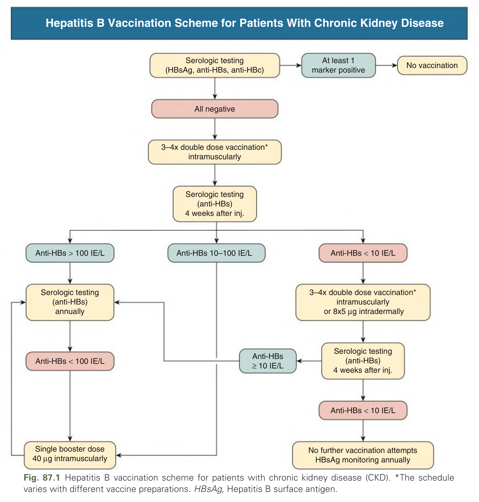
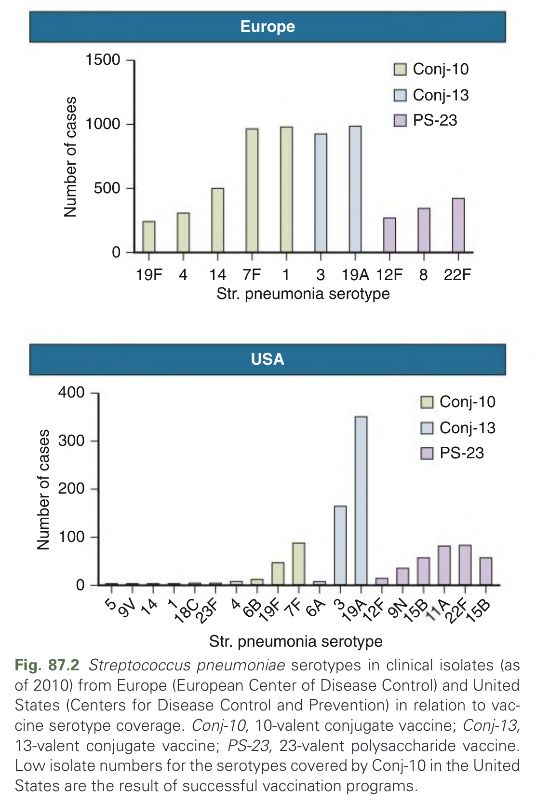
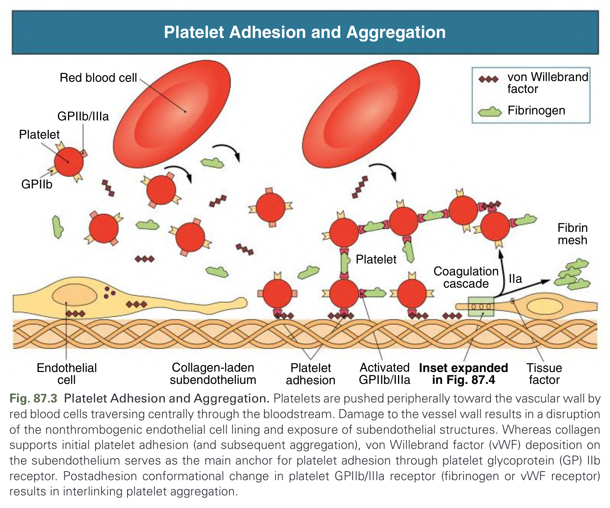
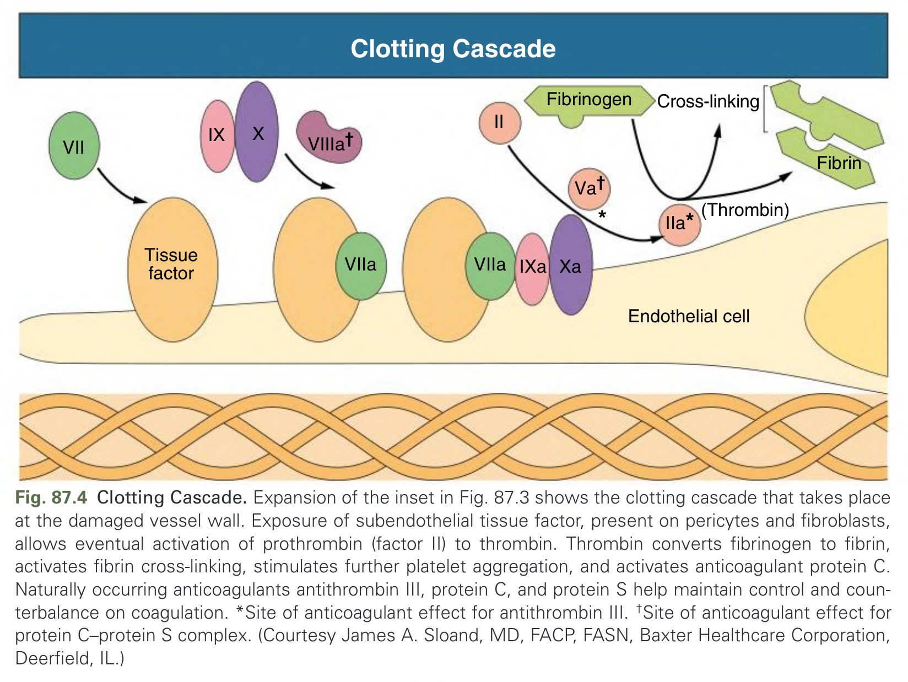
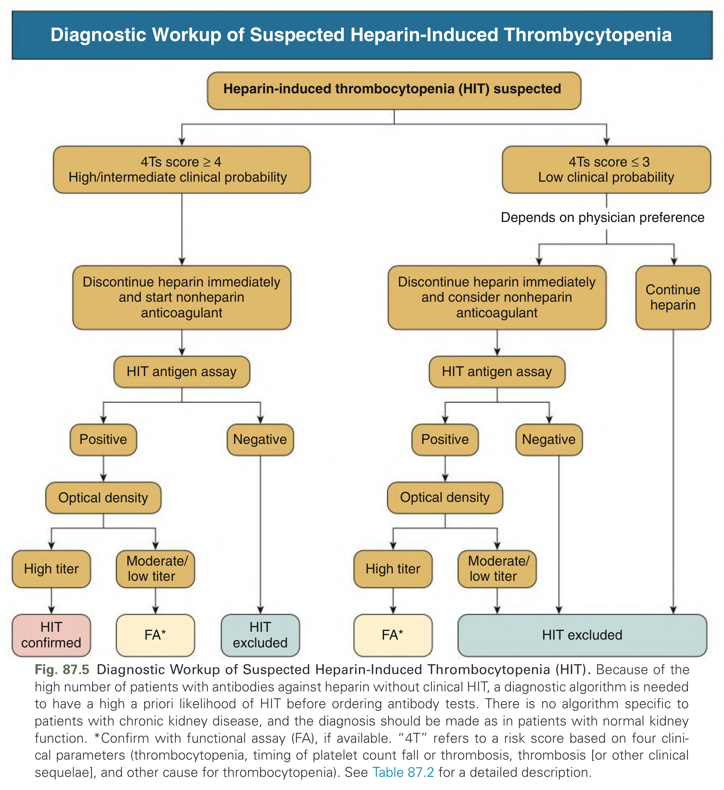
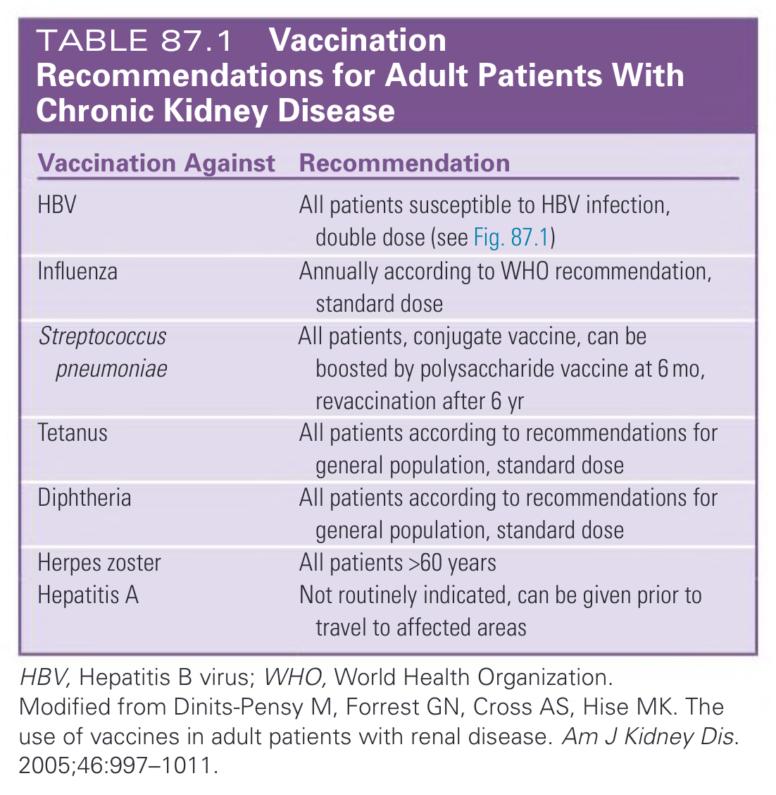
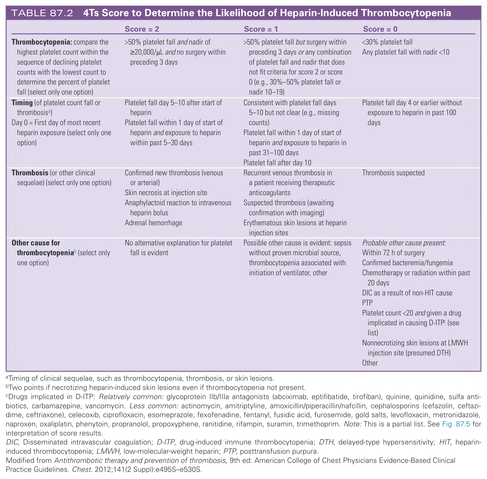
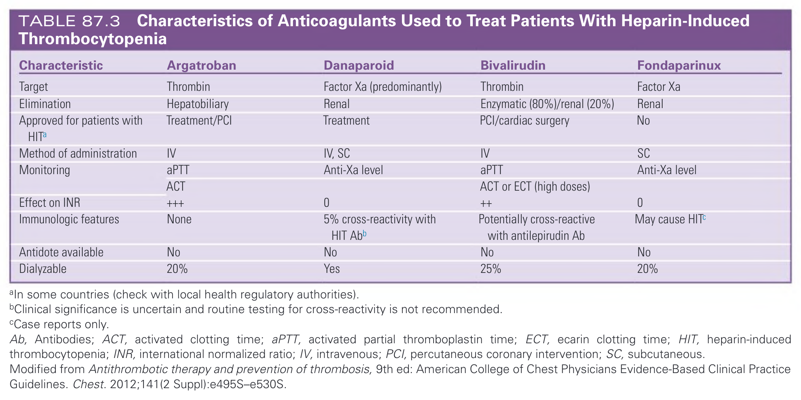
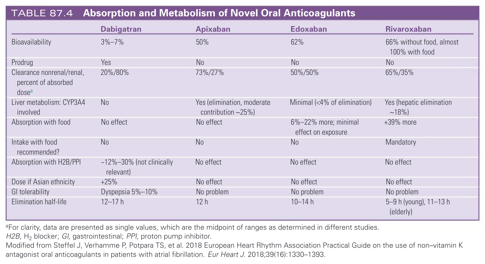
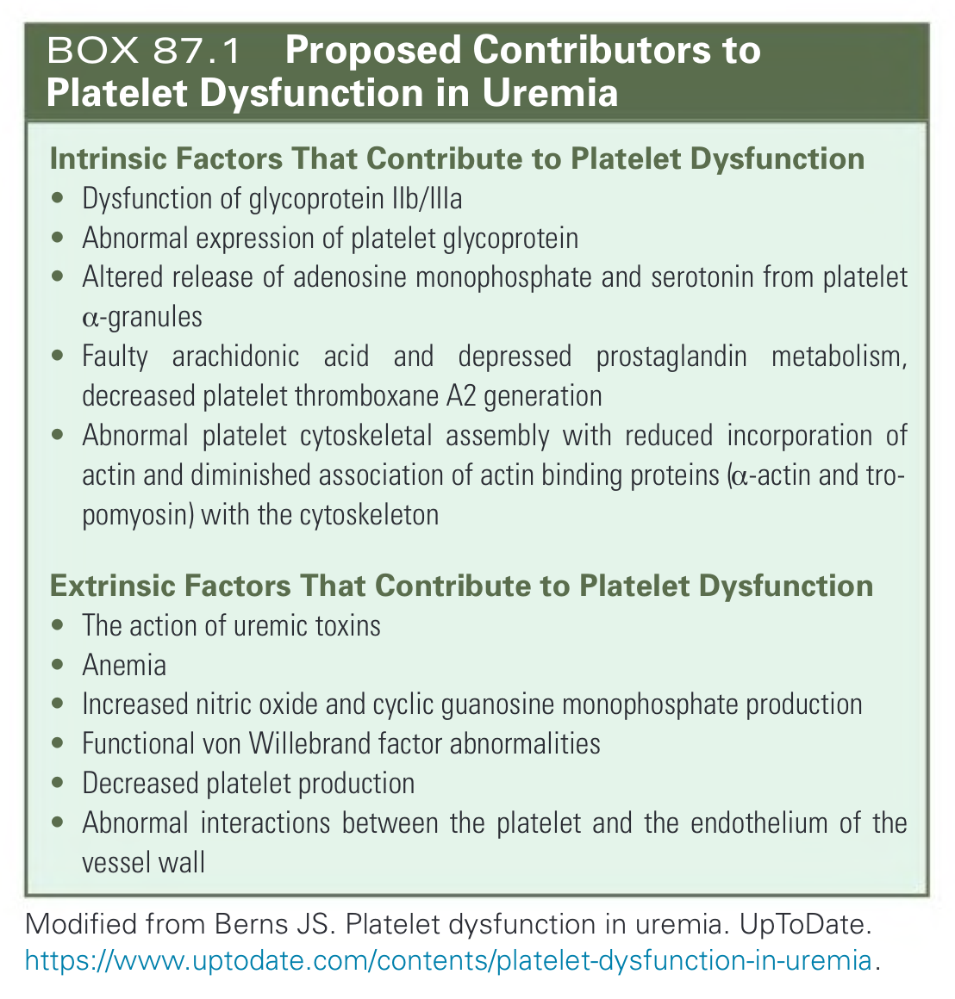

# 087. Other Blood and Immune Disorders in Chronic Kidney Disease - Figures and Tables Index

This document lists all figures, tables and boxes extracted from `087. Other Blood and Immune Disorders in Chronic Kidney Disease.pdf`.

## Table of Contents
- [Figures](#figures)
- [Tables](#tables)
- [Boxes](#boxes)

---

## Figures

### Fig_87_1



Fig. 87.1 Hepatitis B vaccination scheme for patients with chronic kidney disease (CKD). *The schedule varies with different vaccine preparations. HBsAg, Hepatitis B surface antigen.

---

### Fig_87_2



Fig. 87.2 Streptococcus pneumoniae serotypes in clinical isolates (as of 2010) from Europe (European Center of Disease Control) and United States (Centers for Disease Control and Prevention) in relation to vaccine serotype coverage. Conj-10, 10-valent conjugate vaccine; Conj-13, 13-valent conjugate vaccine; PS-23, 23-valent polysaccharide vaccine. Low isolate numbers for the serotypes covered by Conj-10 in the United States are the result of successful vaccination programs.

---

### Fig_87_3



Fig. 87.3 Platelet Adhesion and Aggregation. Platelets are pushed peripherally toward the vascular wall by red blood cells traversing centrally through the bloodstream. Damage to the vessel wall results in a disruption of the nonthrombogenic endothelial cell lining and exposure of subendothelial structures. Whereas collagen supports initial platelet adhesion (and subsequent aggregation), von Willebrand factor (vWF) deposition on the subendothelium serves as the main anchor for platelet adhesion through platelet glycoprotein (GP) IIb receptor. Postadhesion conformational change in platelet GPIIb/IIIa receptor (fibrinogen or vWF receptor) results in interlinking platelet aggregation.

---

### Fig_87_4



Fig. 87.4 Clotting Cascade. Expansion of the inset in Fig. 87.3 shows the clotting cascade that takes place at the damaged vessel wall. Exposure of subendothelial tissue factor, present on pericytes and fibroblasts, allows eventual activation of prothrombin (factor II) to thrombin. Thrombin converts fibrinogen to fibrin, activates fibrin cross-linking, stimulates further platelet aggregation, and activates anticoagulant protein C. Naturally occurring anticoagulants antithrombin III, protein C, and protein S help maintain control and counterbalance on coagulation. *Site of anticoagulant effect for antithrombin III. †Site of anticoagulant effect for protein C–protein S complex. (Courtesy James A. Sloand, MD, FACP, FASN, Baxter Healthcare Corporation, Deerfield, IL.)

---

### Fig_87_5



Fig. 87.5 Diagnostic Workup of Suspected Heparin-Induced Thrombocytopenia (HIT). Because of the high number of patients with antibodies against heparin without clinical HIT, a diagnostic algorithm is needed to have a high a priori likelihood of HIT before ordering antibody tests. There is no algorithm specific to patients with chronic kidney disease, and the diagnosis should be made as in patients with normal kidney function. *Confirm with functional assay (FA), if available. “4T” refers to a risk score based on four clinical parameters (thrombocytopenia, timing of platelet count fall or thrombosis, thrombosis [or other clinical sequelae], and other cause for thrombocytopenia). See Table 87.2 for a detailed description.

---

## Tables

### Table_87_1

#### Table Image



#### Table Data (CSV: [Table_87_1.csv](Table_87_1.csv))

```markdown
| Vaccination Against | Recommendation |
| :--- | :--- |
| **HBV** | All patients susceptible to HBV infection, double dose (see Fig. 87.1) |
| **Influenza** | Annually according to WHO recommendation, standard dose |
| **Streptococcus pneumoniae** | All patients, conjugate vaccine, can be boosted by polysaccharide vaccine at 6 mo, revaccination after 6 yr |
| **Tetanus** | All patients according to recommendations for general population, standard dose |
| **Diphtheria** | All patients according to recommendations for general population, standard dose |
| **Herpes zoster** | All patients >60 years |
| **Hepatitis A** | Not routinely indicated, can be given prior to travel to affected areas |
*HBV, Hepatitis B virus; WHO, World Health Organization.*
*Modified from Dinits-Pensy M, Forrest GN, Cross AS, Hise MK. The use of vaccines in adult patients with renal disease. Am J Kidney Dis. 2005;46:997-1011.*
```

TABLE 87.1 Vaccination Recommendations for Adult Patients With Chronic Kidney Disease

---

### Table_87_2

#### Table Image



#### Table Data (CSV: [Table_87_2.csv](Table_87_2.csv))

```markdown
| | Score = 2 | Score = 1 | Score = 0 |
| :--- | :--- | :--- | :--- |
| **Thrombocytopenia:** compare the highest platelet count within the sequence of declining platelet counts with the lowest count to determine the percent of platelet fall (select only one option) | >50% platelet fall and nadir of ≥20,000/μL and no surgery within preceding 3 days | >50% platelet fall but surgery within preceding 3 days or any combination of platelet fall and nadir that does not fit criteria for score 2 or score 0 (e.g., 30%-50% platelet fall or nadir 10-19) | <30% platelet fall<br>Any platelet fall with nadir <10 |
| **Timing** (of platelet count fall or thrombosisa)<br>Day 0 = First day of most recent heparin exposure (select only one option) | Platelet fall day 5-10 after start of heparin<br>Platelet fall within 1 day of start of heparin and exposure to heparin within past 5-30 days | Consistent with platelet fall days 5-10 but not clear (e.g., missing counts)<br>Platelet fall within 1 day of start of heparin and exposure to heparin in past 31-100 days<br>Platelet fall after day 10 | Platelet fall day 4 or earlier without exposure to heparin in past 100 days |
| **Thrombosis** (or other clinical sequelae) (select only one option) | Confirmed new thrombosis (venous or arterial)<br>Skin necrosis at injection site<br>Anaphylactoid reaction to intravenous heparin bolus<br>Adrenal hemorrhage | Recurrent venous thrombosis in a patient receiving therapeutic anticoagulants<br>Suspected thrombosis (awaiting confirmation with imaging)<br>Erythematous skin lesions at heparin injection sites | Thrombosis suspected |
| **Other cause for thrombocytopeniab** (select only one option) | No alternative explanation for platelet fall is evident | Possible other cause is evident: sepsis without proven microbial source, thrombocytopenia associated with initiation of ventilator, other | Probable other cause present:<br>Within 72 h of surgery<br>Confirmed bacteremia/fungemia<br>Chemotherapy or radiation within past 20 days<br>DIC as a result of non-HIT cause<br>PTP<br>Platelet count <20 and given a drug implicated in causing D-ITP^c (see list)<br>Nonnecrotizing skin lesions at LMWH injection site (presumed DTH)<br>Other |

aTiming of clinical sequelae, such as thrombocytopenia, thrombosis, or skin lesions.
bTwo points if necrotizing heparin-induced skin lesions even if thrombocytopenia not present.
^cDrugs implicated in D-ITP: Relatively common: glycoprotein IIb/IIIa antagonists (abciximab, eptifibatide, tirofiban), quinine, quinidine, sulfa antibiotics, carbamazepine, vancomycin. Less common: actinomycin, amitriptyline, amoxicillin/piperacillin/nafcillin, cephalosporins (cefazolin, ceftazidime, ceftriaxone), celecoxib, ciprofloxacin, esomeprazole, fexofenadine, fentanyl, fusidic acid, furosemide, gold salts, levofloxacin, metronidazole, naproxen, oxaliplatin, phenytoin, propranolol, propoxyphene, ranitidine, rifampin, suramin, trimethoprim. Note: This is a partial list. See Fig. 87.5 for interpretation of score results.
DIC, Disseminated intravascular coagulation; D-ITP, drug-induced immune thrombocytopenia; DTH, delayed-type hypersensitivity; HIT, heparin-induced thrombocytopenia; LMWH, low-molecular-weight heparin; PTP, posttransfusion purpura.
Modified from Antithrombotic therapy and prevention of thrombosis, 9th ed: American College of Chest Physicians Evidence-Based Clinical Practice Guidelines. Chest. 2012;141(2 Suppl):e495S-e530S.
```

TABLE 87.2 4Ts Score to Determine the Likelihood of Heparin-Induced Thrombocytopenia

---

### Table_87_3

#### Table Image



#### Table Data (CSV: [Table_87_3.csv](Table_87_3.csv))

```markdown
| Characteristic | Argatroban | Danaparoid | Bivalirudin | Fondaparinux |
| :--- | :--- | :--- | :--- | :--- |
| **Target** | Thrombin | Factor Xa (predominantly) | Thrombin | Factor Xa |
| **Elimination** | Hepatobiliary | Renal | Enzymatic (80%)/renal (20%) | Renal |
| **Approved for patients with HITa** | Treatment/PCI | Treatment | PCI/cardiac surgery | No |
| **Method of administration** | IV | IV, SC | IV | SC |
| **Monitoring** | aPTT | Anti-Xa level | aPTT | Anti-Xa level |
| | ACT | | ACT or ECT (high doses) | |
| **Effect on INR** | +++ | 0 | ++ | 0 |
| **Immunologic features** | None | 5% cross-reactivity with HIT Abb | Potentially cross-reactive with antilepirudin Ab | May cause HIT^c |
| **Antidote available** | No | No | No | No |
| **Dialyzable** | 20% | Yes | 25% | 20% |

aIn some countries (check with local health regulatory authorities).
bClinical significance is uncertain and routine testing for cross-reactivity is not recommended.
^cCase reports only.
Ab, Antibodies; ACT, activated clotting time; aPTT, activated partial thromboplastin time; ECT, ecarin clotting time; HIT, heparin-induced thrombocytopenia; INR, international normalized ratio; IV, intravenous; PCI, percutaneous coronary intervention; SC, subcutaneous.
Modified from Antithrombotic therapy and prevention of thrombosis, 9th ed: American College of Chest Physicians Evidence-Based Clinical Practice Guidelines. Chest. 2012;141(2 Suppl):e495S-e530S.
```

TABLE 87.3 Characteristics of Anticoagulants Used to Treat Patients With Heparin-Induced Thrombocytopenia

---

### Table_87_4

#### Table Image



#### Table Data (CSV: [Table_87_4.csv](Table_87_4.csv))

```markdown
| | Dabigatran | Apixaban | Edoxaban | Rivaroxaban |
| :--- | :--- | :--- | :--- | :--- |
| **Bioavailability** | 3%-7% | 50% | 62% | 66% without food, almost 100% with food |
| **Prodrug** | Yes | No | No | No |
| **Clearance nonrenal/renal, percent of absorbed dosea** | 20%/80% | 73%/27% | 50%/50% | 65%/35% |
| **Liver metabolism: CYP3A4 involved**| No | Yes (elimination, moderate contribution~25%) | Minimal (<4% of elimination) | Yes (hepatic elimination ~18%) |
| **Absorption with food** | No effect | No effect | 6%-22% more; minimal effect on exposure | +39% more |
| **Intake with food recommended?** | No | No | No | Mandatory |
| **Absorption with H2B/PPI** | -12%-30% (not clinically relevant) | No effect | No effect | No effect |
| **Dose if Asian ethnicity** | +25% | No effect | No effect | No effect |
| **GI tolerability** | Dyspepsia 5%-10% | No problem | No problem | No problem |
| **Elimination half-life** | 12-17 h | 12 h | 10-14 h | 5-9 h (young), 11-13 h (elderly) |

aFor clarity, data are presented as single values, which are the midpoint of ranges as determined in different studies.
H2B, H2 blocker; GI, gastrointestinal; PPI, proton pump inhibitor.
Modified from Steffel J, Verhamme P, Potpara TS, et al. 2018 European Heart Rhythm Association Practical Guide on the use of non-vitamin K antagonist oral anticoagulants in patients with atrial fibrillation. Eur Heart J. 2018;39(16):1330-1393.
```

TABLE 87.4 Absorption and Metabolism of Novel Oral Anticoagulants

---

## Boxes

### Box_87_1



#### Box Text

```markdown
> **Intrinsic Factors That Contribute to Platelet Dysfunction**
> * Dysfunction of glycoprotein IIb/Illa
> * Abnormal expression of platelet glycoprotein
> * Altered release of adenosine monophosphate and serotonin from platelet a-granules
> * Faulty arachidonic acid and depressed prostaglandin metabolism, decreased platelet thromboxane A2 generation
> * Abnormal platelet cytoskeletal assembly with reduced incorporation of actin and diminished association of actin binding proteins (a-actin and tropomyosin) with the cytoskeleton
> 
> **Extrinsic Factors That Contribute to Platelet Dysfunction**
> * The action of uremic toxins
> * Anemia
> * Increased nitric oxide and cyclic guanosine monophosphate production
> * Functional von Willebrand factor abnormalities
> * Decreased platelet production
> * Abnormal interactions between the platelet and the endothelium of the vessel wall
> 
> *Modified from Berns JS. Platelet dysfunction in uremia. UpToDate. https://www.uptodate.com/contents/platelet-dysfunction-in-uremia.*
```

BOX 87.1 Proposed Contributors to Platelet Dysfunction in Uremia

---
