# 088. Bone and Mineral Disorders in Chronic Kidney Disease - Figures and Tables Index

This document lists all figures, tables and boxes extracted from `088. Bone and Mineral Disorders in Chronic Kidney Disease.pdf`.

## Table of Contents
- [Figures](#figures)
- [Tables](#tables)
- [Boxes](#boxes)

---

## Figures

### Fig_88_1

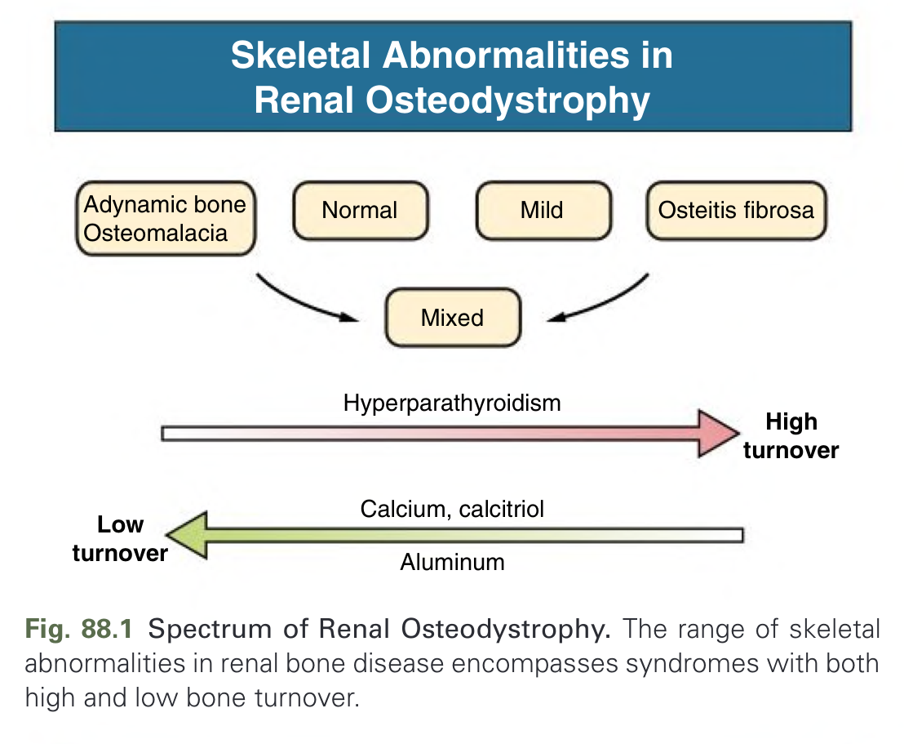

Fig. 88.1 Spectrum of Renal Osteodystrophy. The range of skeletal abnormalities in renal bone disease encompasses syndromes with both high and low bone turnover.

---

### Fig_88_2

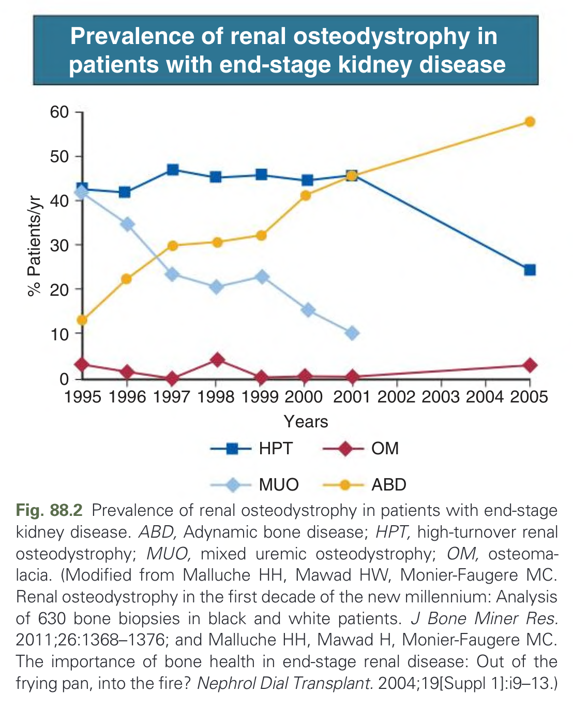

Fig. 88.2 Prevalence of renal osteodystrophy in patients with end-stage kidney disease. ABD, Adynamic bone disease; HPT, high-turnover renal osteodystrophy; MUO, mixed uremic osteodystrophy; OM, osteomalacia. (Modified from Malluche HH, Mawad HW, Monier-Faugere MC. Renal osteodystrophy in the first decade of the new millennium: Analysis of 630 bone biopsies in black and white patients. J Bone Miner Res. 2011;26:1368–1376; and Malluche HH, Mawad H, Monier-Faugere MC. The importance of bone health in end-stage renal disease: Out of the frying pan, into the fire? Nephrol Dial Transplant. 2004;19[Suppl 1]:i9–13.)

---

### Fig_88_3

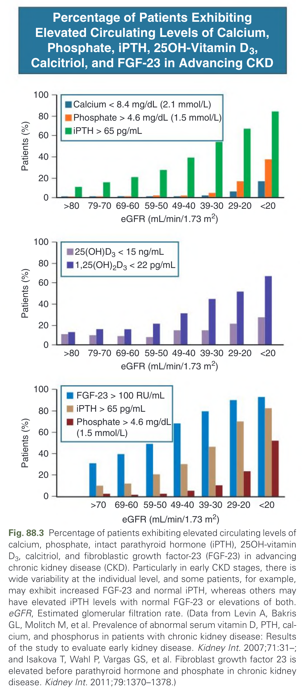

Fig. 88.3 Percentage of patients exhibiting elevated circulating levels of calcium, phosphate, intact parathyroid hormone (iPTH), 25OH-vitamin D3, calcitriol, and fibroblastic growth factor-23 (FGF-23) in advancing chronic kidney disease (CKD). Particularly in early CKD stages, there is wide variability at the individual level, and some patients, for example, may exhibit increased FGF-23 and normal iPTH, whereas others may have elevated iPTH levels with normal FGF-23 or elevations of both. eGFR, Estimated glomerular filtration rate. (Data from Levin A, Bakris GL, Molitch M, et al. Prevalence of abnormal serum vitamin D, PTH, calcium, and phosphorus in patients with chronic kidney disease: Results of the study to evaluate early kidney disease. Kidney Int. 2007;71:31–; and Isakova T, Wahl P, Vargas GS, et al. Fibroblast growth factor 23 is elevated before parathyroid hormone and phosphate in chronic kidney disease. Kidney Int. 2011;79:1370–1378.)

---

### Fig_88_4

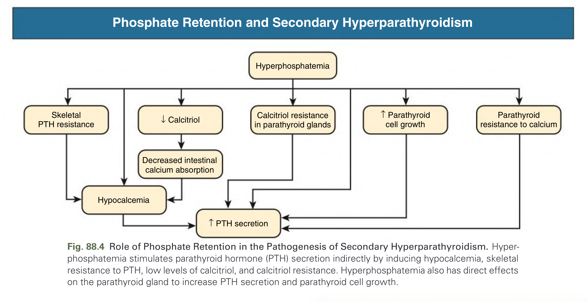

Fig. 88.4 Role of Phosphate Retention in the Pathogenesis of Secondary Hyperparathyroidism. Hyperphosphatemia stimulates parathyroid hormone (PTH) secretion indirectly by inducing hypocalcemia, skeletal resistance to PTH, low levels of calcitriol, and calcitriol resistance. Hyperphosphatemia also has direct effects on the parathyroid gland to increase PTH secretion and parathyroid cell growth.

---

### Fig_88_5

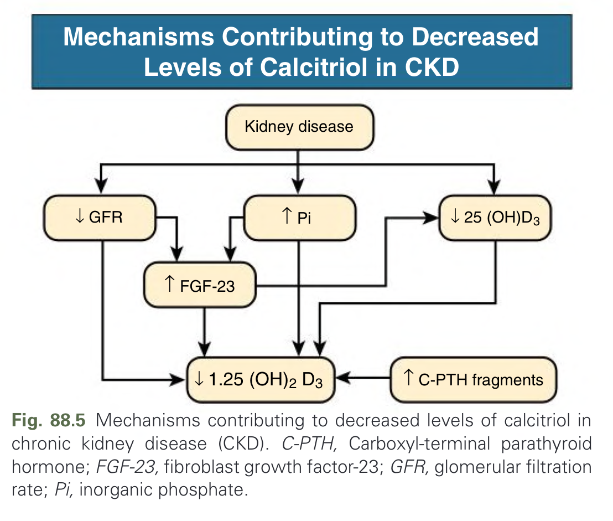

Fig. 88.5 Mechanisms contributing to decreased levels of calcitriol in chronic kidney disease (CKD). C-PTH, Carboxyl-terminal parathyroid hormone; FGF-23, fibroblast growth factor-23; GFR, glomerular filtration rate; Pi, inorganic phosphate.

---

### Fig_88_6

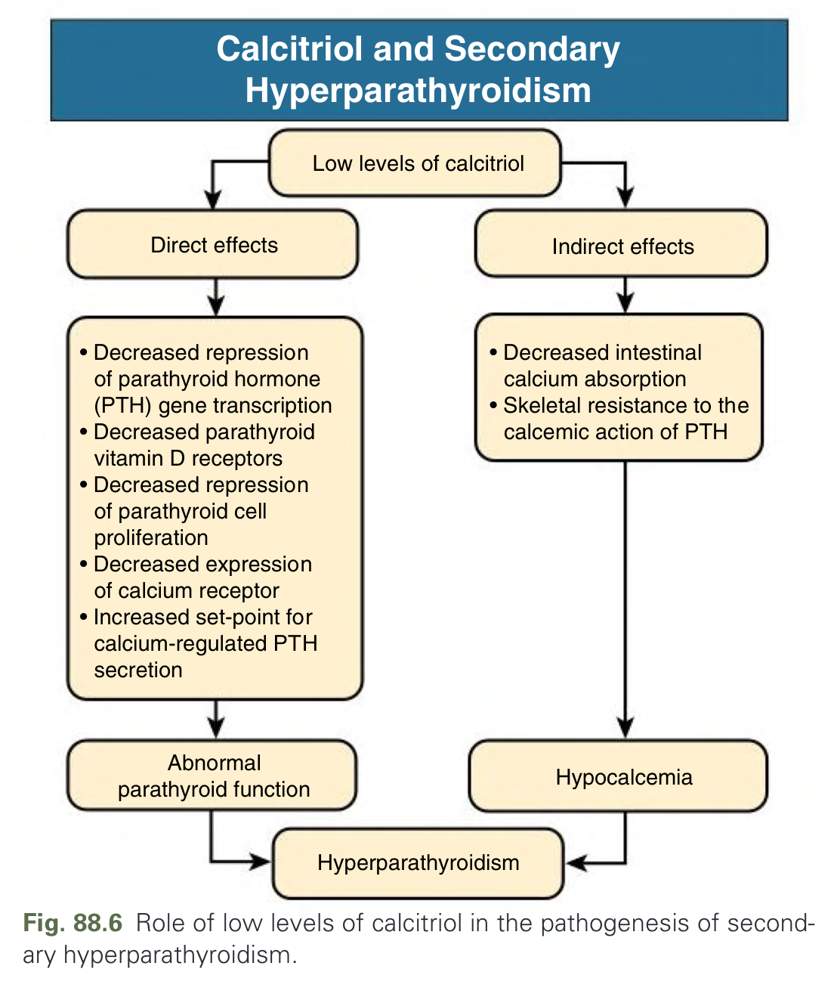

Fig. 88.6 Role of low levels of calcitriol in the pathogenesis of secondary hyperparathyroidism.

---

### Fig_88_7

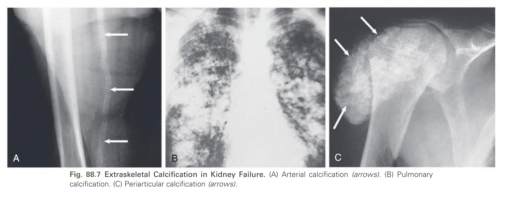

Fig. 88.7 Extraskeletal Calcification in Kidney Failure. (A) Arterial calcification (arrows). (B) Pulmonary calcification. (C) Periarticular calcification (arrows).

---

### Fig_88_8

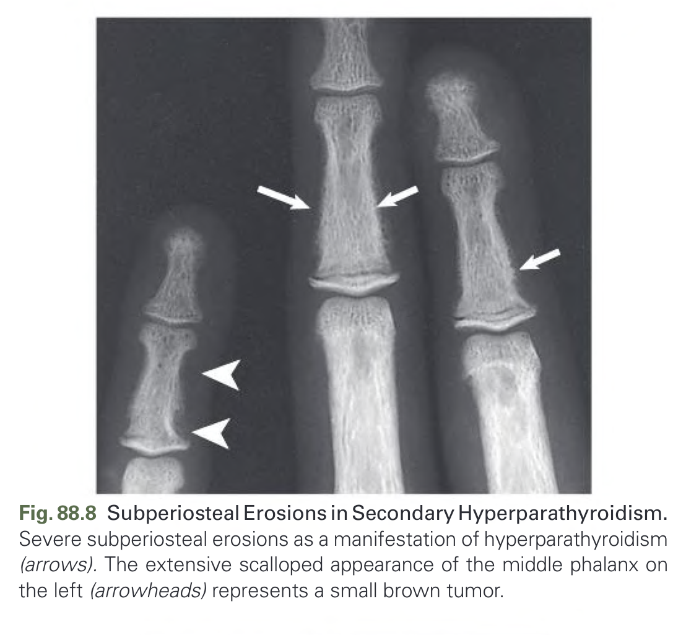

Fig. 88.8 Subperiosteal Erosions in Secondary Hyperparathyroidism. Severe subperiosteal erosions as a manifestation of hyperparathyroidism (arrows). The extensive scalloped appearance of the middle phalanx on the left (arrowheads) represents a small brown tumor.

---

### Fig_88_9

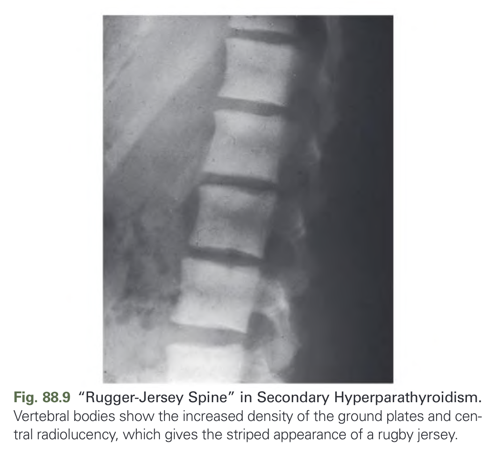

Fig. 88.9 “Rugger-Jersey Spine” in Secondary Hyperparathyroidism. Vertebral bodies show the increased density of the ground plates and central radiolucency, which gives the striped appearance of a rugby jersey.

---

### Fig_88_10

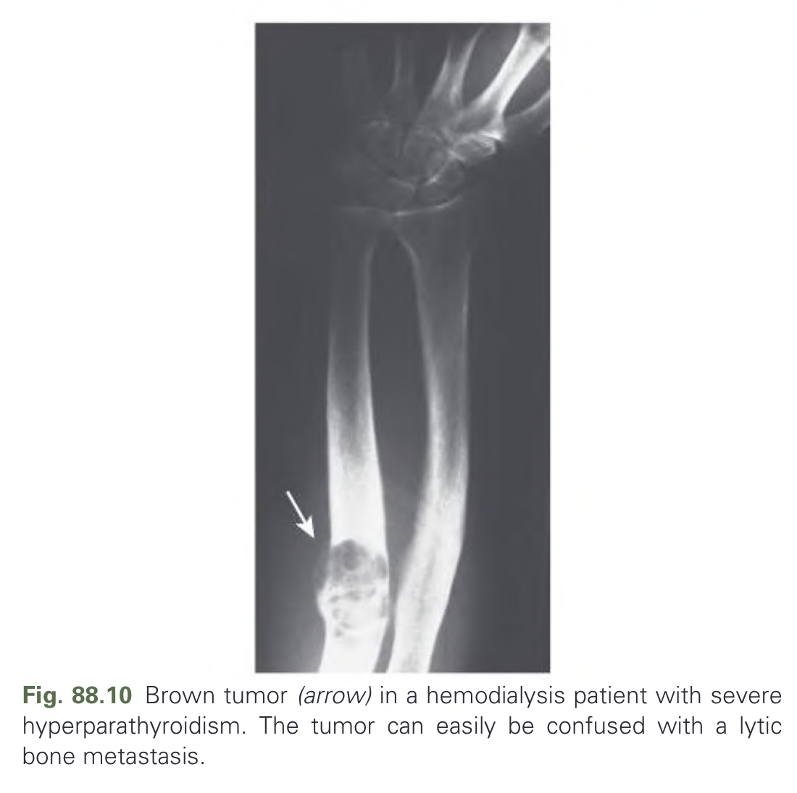

Fig. 88.10 Brown tumor (arrow) in a hemodialysis patient with severe hyperparathyroidism. The tumor can easily be confused with a lytic bone metastasis.

---

### Fig_88_11

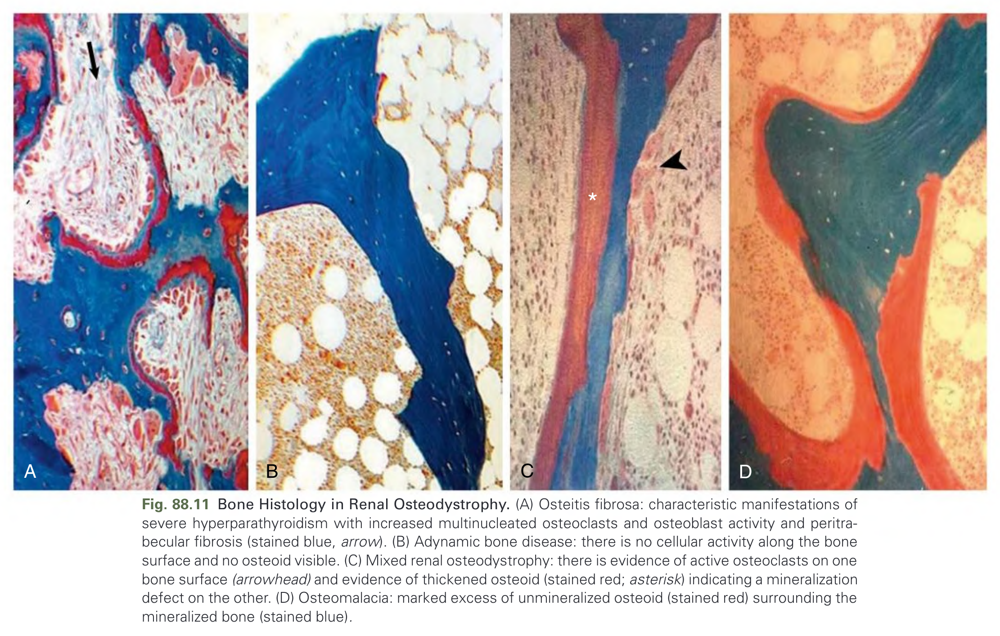

Fig. 88.11 Bone Histology in Renal Osteodystrophy. (A) Osteitis fibrosa: characteristic manifestations of severe hyperparathyroidism with increased multinucleated osteoclasts and osteoblast activity and peritrabecular fibrosis (stained blue, arrow). (B) Adynamic bone disease: there is no cellular activity along the bone surface and no osteoid visible. (C) Mixed renal osteodystrophy: there is evidence of active osteoclasts on one bone surface (arrowhead) and evidence of thickened osteoid (stained red; asterisk) indicating a mineralization defect on the other. (D) Osteomalacia: marked excess of unmineralized osteoid (stained red) surrounding the mineralized bone (stained blue).

---

### Fig_88_12

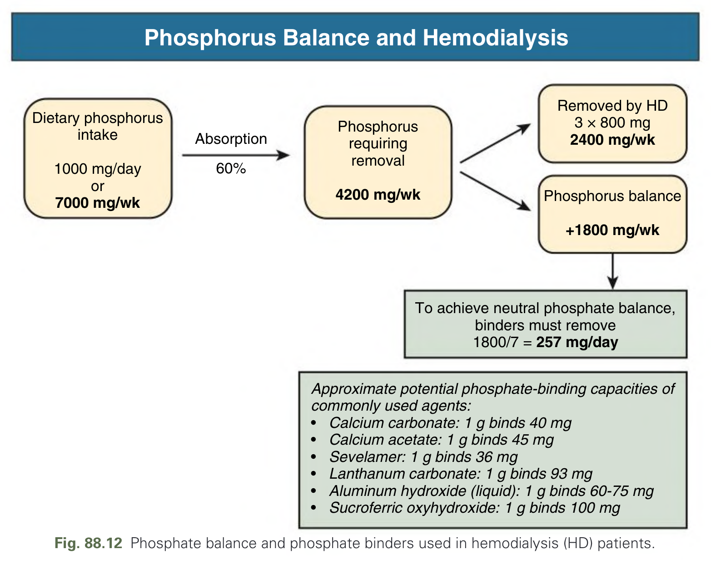

Fig. 88.12 Phosphate balance and phosphate binders used in hemodialysis (HD) patients.

---

### Fig_88_13

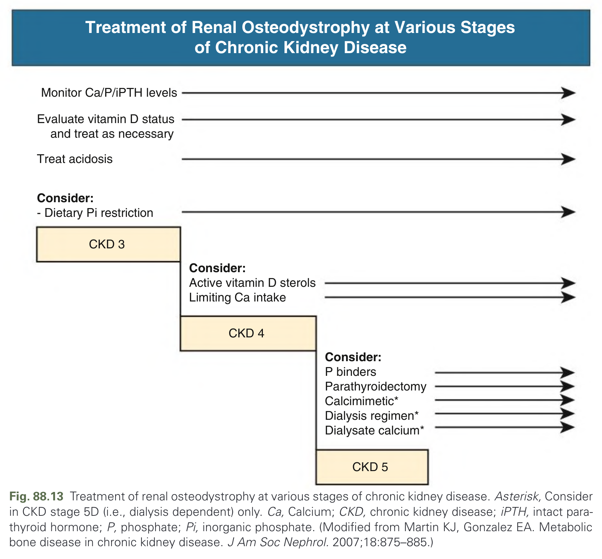

Fig. 88.13 Treatment of renal osteodystrophy at various stages of chronic kidney disease. Asterisk, Consider in CKD stage 5D (i.e., dialysis dependent) only. Ca, Calcium; CKD, chronic kidney disease; iPTH, intact parathyroid hormone; P, phosphate; Pi, inorganic phosphate. (Modified from Martin KJ, Gonzalez EA. Metabolic bone disease in chronic kidney disease. J Am Soc Nephrol. 2007;18:875–885.)

---

### Fig_88_14

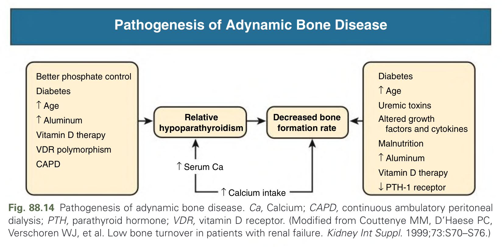

Fig. 88.14 Pathogenesis of adynamic bone disease. Ca, Calcium; CAPD, continuous ambulatory peritoneal dialysis; PTH, parathyroid hormone; VDR, vitamin D receptor. (Modified from Couttenye MM, D'Haese PC, Verschoren WJ, et al. Low bone turnover in patients with renal failure. Kidney Int Suppl. 1999;73:S70–S76.)

---

### Fig_88_15

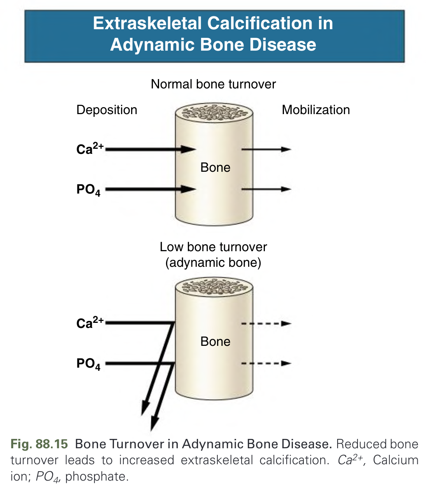

Fig. 88.15 Bone Turnover in Adynamic Bone Disease. Reduced bone turnover leads to increased extraskeletal calcification. Ca2+, Calcium ion; PO4, phosphate.

---

### Fig_88_16

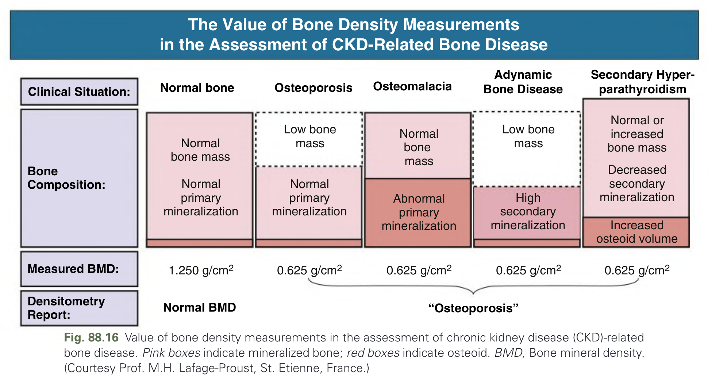

Fig. 88.16 Value of bone density measurements in the assessment of chronic kidney disease (CKD)-related bone disease. Pink boxes indicate mineralized bone; red boxes indicate osteoid. BMD, Bone mineral density. (Courtesy Prof. M.H. Lafage-Proust, St. Etienne, France.)

---

### Fig_88_17

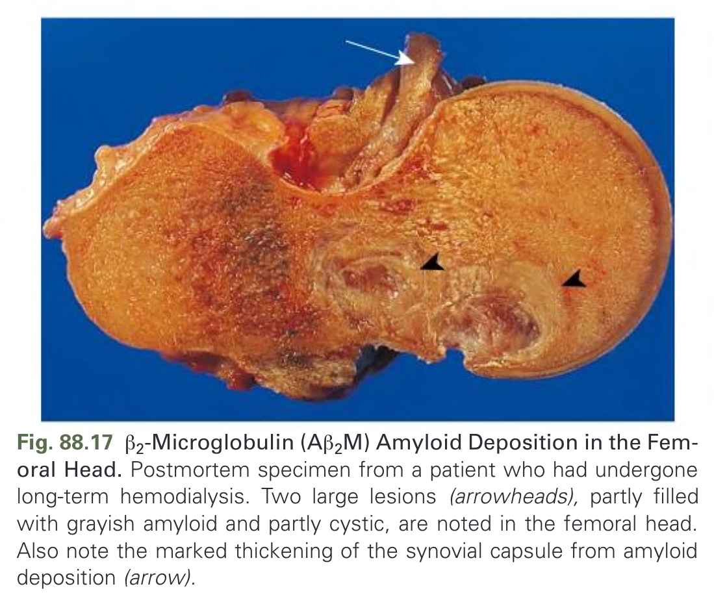

Fig. 88.17 β2-Microglobulin (Aβ2M) Amyloid Deposition in the Femoral Head. Postmortem specimen from a patient who had undergone long-term hemodialysis. Two large lesions (arrowheads), partly filled with grayish amyloid and partly cystic, are noted in the femoral head. Also note the marked thickening of the synovial capsule from amyloid deposition (arrow).

---

### Fig_88_18

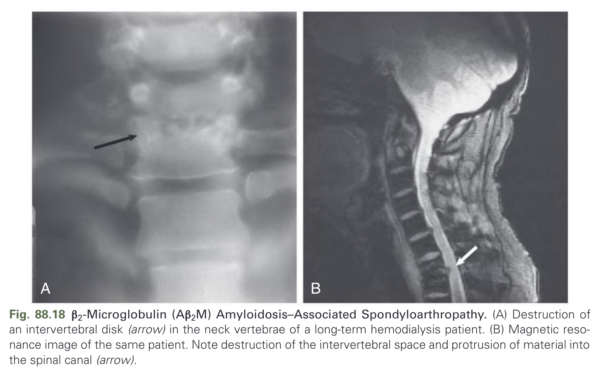

Fig. 88.18 β2-Microglobulin (Aβ2M) Amyloidosis–Associated Spondyloarthropathy. (A) Destruction of an intervertebral disk (arrow) in the neck vertebrae of a long-term hemodialysis patient. (B) Magnetic resonance image of the same patient. Note destruction of the intervertebral space and protrusion of material into the spinal canal (arrow).

---

### Fig_88_19

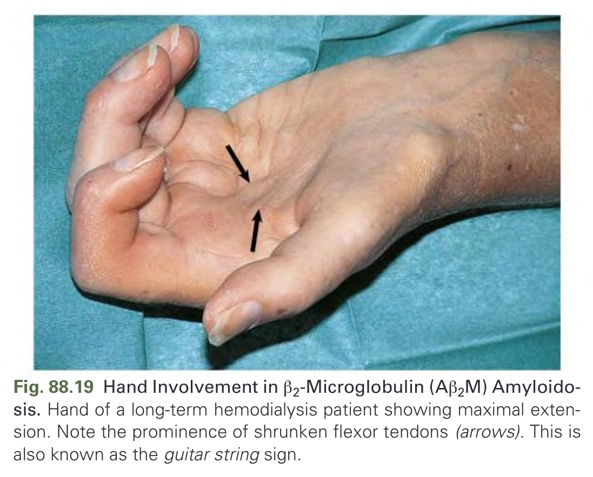

Fig. 88.19 Hand Involvement in β2-Microglobulin (Aβ2M) Amyloidosis. Hand of a long-term hemodialysis patient showing maximal extension. Note the prominence of shrunken flexor tendons (arrows). This is also known as the guitar string sign.

---

### Fig_88_20

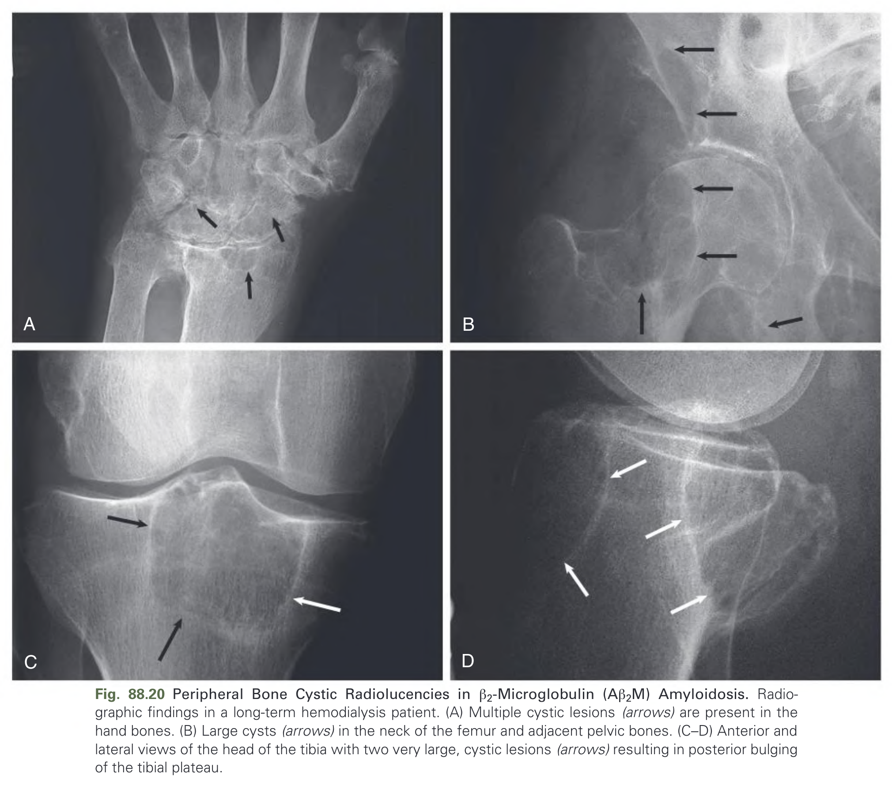

Fig. 88.20 Peripheral Bone Cystic Radiolucencies in β2-Microglobulin (Aβ2M) Amyloidosis. Radiographic findings in a long-term hemodialysis patient. (A) Multiple cystic lesions (arrows) are present in the hand bones. (B) Large cysts (arrows) in the neck of the femur and adjacent pelvic bones. (C–D) Anterior and lateral views of the head of the tibia with two very large, cystic lesions (arrows) resulting in posterior bulging of the tibial plateau.

---

## Tables

*No tables resolved for this chapter.*

## Boxes

### Box_88_1

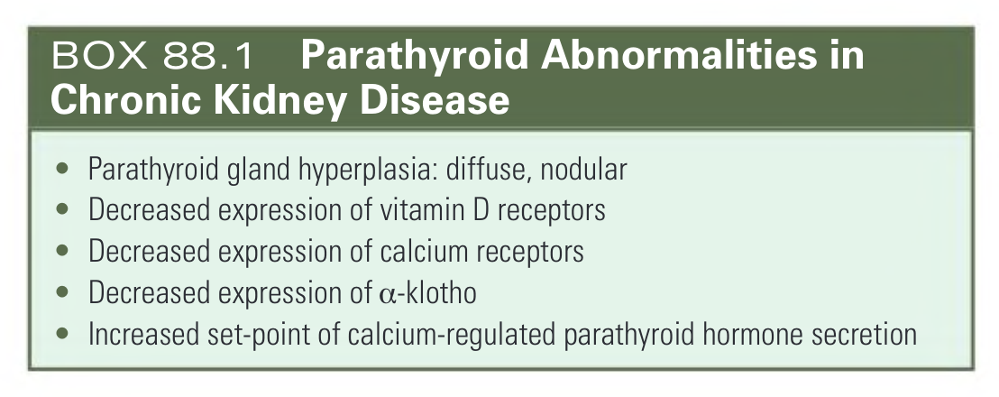

#### Box Text

```markdown
* Parathyroid gland hyperplasia: diffuse, nodular
* Decreased expression of vitamin D receptors
* Decreased expression of calcium receptors
* Decreased expression of α-klotho
* Increased set-point of calcium-regulated parathyroid hormone secretion
```

BOX 88.1 Parathyroid Abnormalities in Chronic Kidney Disease

---

### Box_88_2

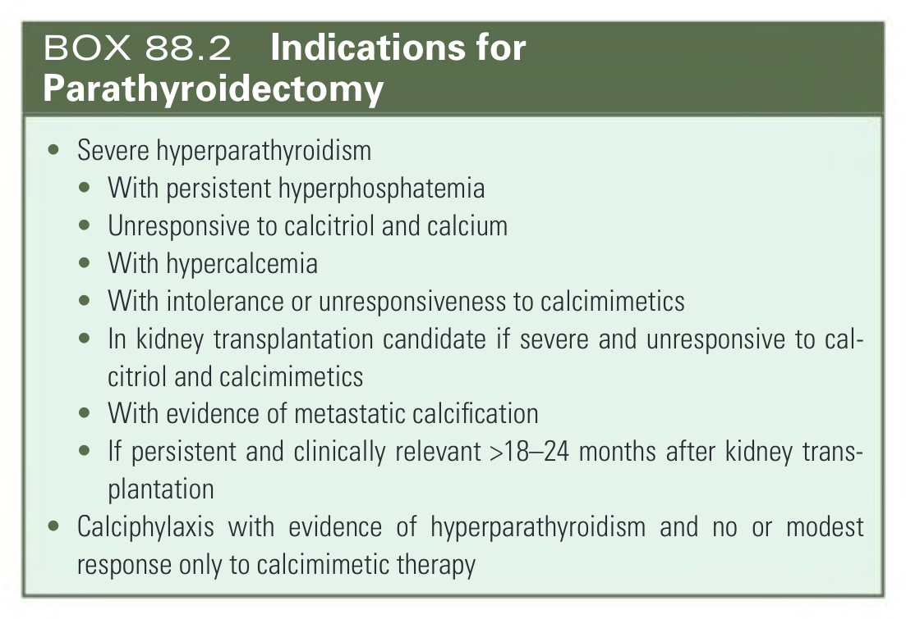

#### Box Text

```markdown
* Severe hyperparathyroidism
* With persistent hyperphosphatemia
* Unresponsive to calcitriol and calcium
* With hypercalcemia
* With intolerance or unresponsiveness to calcimimetics
* In kidney transplantation candidate if severe and unresponsive to calcitriol and calcimimetics
* With evidence of metastatic calcification
* If persistent and clinically relevant >18-24 months after kidney transplantation
* Calciphylaxis with evidence of hyperparathyroidism and no or modest response only to calcimimetic therapy
```

BOX 88.2 Indications for Parathyroidectomy

---
