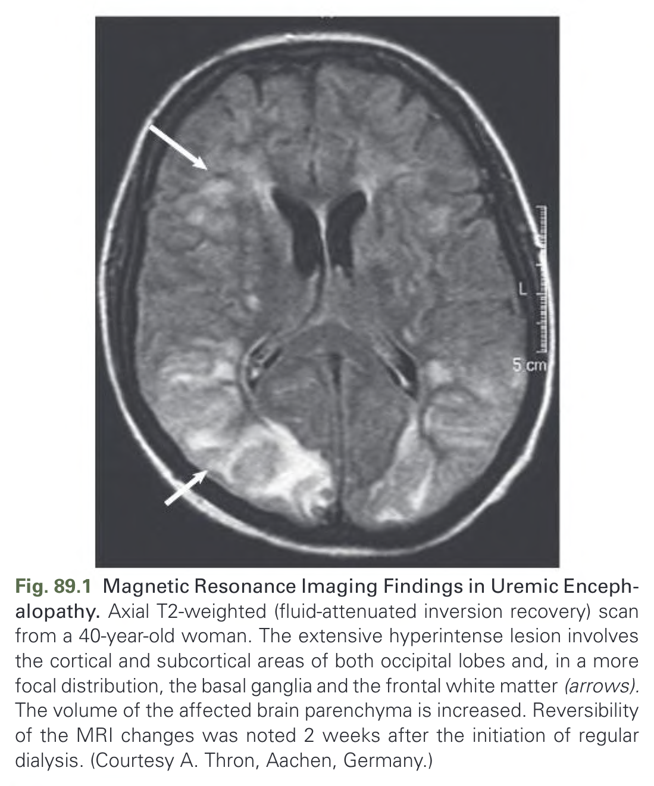
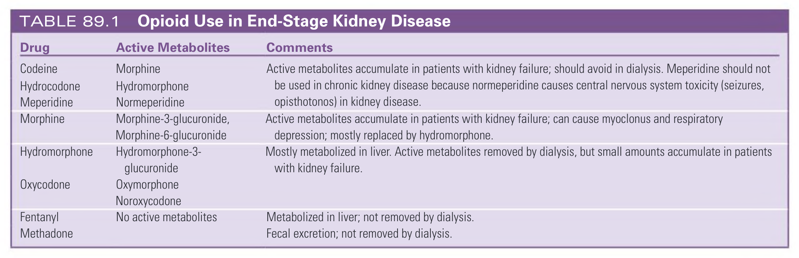
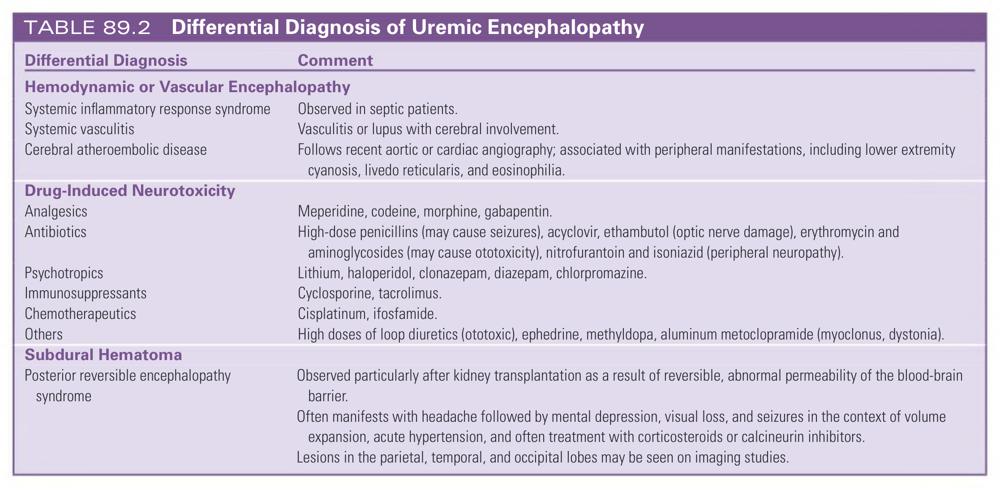
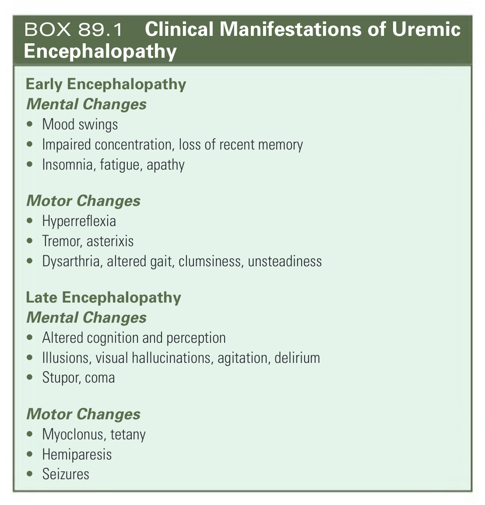

# 089. Neurologic Complications of Chronic Kidney Disease - Figures and Tables Index

This document lists all figures, tables and boxes extracted from `089. Neurologic Complications of Chronic Kidney Disease.pdf`.

## Table of Contents
- [Figures](#figures)
- [Tables](#tables)
- [Boxes](#boxes)

---

## Figures

### Fig_89_1



Fig. 89.1 Magnetic Resonance Imaging Findings in Uremic Encephalopathy. Axial T2-weighted (fluid-attenuated inversion recovery) scan from a 40-year-old woman. The extensive hyperintense lesion involves the cortical and subcortical areas of both occipital lobes and, in a more focal distribution, the basal ganglia and the frontal white matter (arrows). The volume of the affected brain parenchyma is increased. Reversibility of the MRI changes was noted 2 weeks after the initiation of regular dialysis. (Courtesy A. Thron, Aachen, Germany.)

---

## Tables

### Table_89_1

#### Table Image



#### Table Data (CSV: [Table_89_1.csv](Table_89_1.csv))

```markdown
| Drug | Active Metabolites | Comments |
| :--- | :--- | :--- |
| Codeine | Morphine | Active metabolites accumulate in patients with kidney failure; should avoid in dialysis. Meperidine should not be used in chronic kidney disease because normeperidine causes central nervous system toxicity (seizures, opisthotonos) in kidney disease. |
| Hydrocodone | Hydromorphone | |
| Meperidine | Normeperidine | |
| Morphine | Morphine-3-glucuronide, Morphine-6-glucuronide | Active metabolites accumulate in patients with kidney failure; can cause myoclonus and respiratory depression; mostly replaced by hydromorphone. |
| Hydromorphone | Hydromorphone-3-glucuronide | Mostly metabolized in liver. Active metabolites removed by dialysis, but small amounts accumulate in patients with kidney failure. |
| Oxycodone | Oxymorphone, Noroxycodone | |
| Fentanyl | No active metabolites | Metabolized in liver; not removed by dialysis. |
| Methadone | | Fecal excretion; not removed by dialysis. |
```

TABLE 89.1 Opioid Use in End-Stage Kidney Disease

---

### Table_89_2

#### Table Image



#### Table Data (CSV: [Table_89_2.csv](Table_89_2.csv))

```markdown
| Differential Diagnosis | Comment |
| :--- | :--- |
| **Hemodynamic or Vascular Encephalopathy** | |
| Systemic inflammatory response syndrome | Observed in septic patients. |
| Systemic vasculitis | Vasculitis or lupus with cerebral involvement. |
| Cerebral atheroembolic disease | Follows recent aortic or cardiac angiography; associated with peripheral manifestations, including lower extremity cyanosis, livedo reticularis, and eosinophilia. |
| **Drug-Induced Neurotoxicity** | |
| Analgesics | Meperidine, codeine, morphine, gabapentin. |
| Antibiotics | High-dose penicillins (may cause seizures), acyclovir, ethambutol (optic nerve damage), erythromycin and aminoglycosides (may cause ototoxicity), nitrofurantoin and isoniazid (peripheral neuropathy). |
| Psychotropics | Lithium, haloperidol, clonazepam, diazepam, chlorpromazine. |
| Immunosuppressants | Cyclosporine, tacrolimus. |
| Chemotherapeutics | Cisplatinum, ifosfamide. |
| Others | High doses of loop diuretics (ototoxic), ephedrine, methyldopa, aluminum metoclopramide (myoclonus, dystonia). |
| **Subdural Hematoma** | |
| Posterior reversible encephalopathy syndrome | Observed particularly after kidney transplantation as a result of reversible, abnormal permeability of the blood-brain barrier. Often manifests with headache followed by mental depression, visual loss, and seizures in the context of volume expansion, acute hypertension, and often treatment with corticosteroids or calcineurin inhibitors. Lesions in the parietal, temporal, and occipital lobes may be seen on imaging studies. |
```

TABLE 89.2 Differential Diagnosis of Uremic Encephalopathy

---

## Boxes

### Box_89_1



#### Box Text

```markdown
**Early Encephalopathy**
**Mental Changes**
* Mood swings
* Impaired concentration, loss of recent memory
* Insomnia, fatigue, apathy

**Motor Changes**
* Hyperreflexia
* Tremor, asterixis
* Dysarthria, altered gait, clumsiness, unsteadiness

**Late Encephalopathy**
**Mental Changes**
* Altered cognition and perception
* Illusions, visual hallucinations, agitation, delirium
* Stupor, coma

**Motor Changes**
* Myoclonus, tetany
* Hemiparesis
* Seizures
```

BOX 89.1 Clinical Manifestations of Uremic Encephalopathy

---
