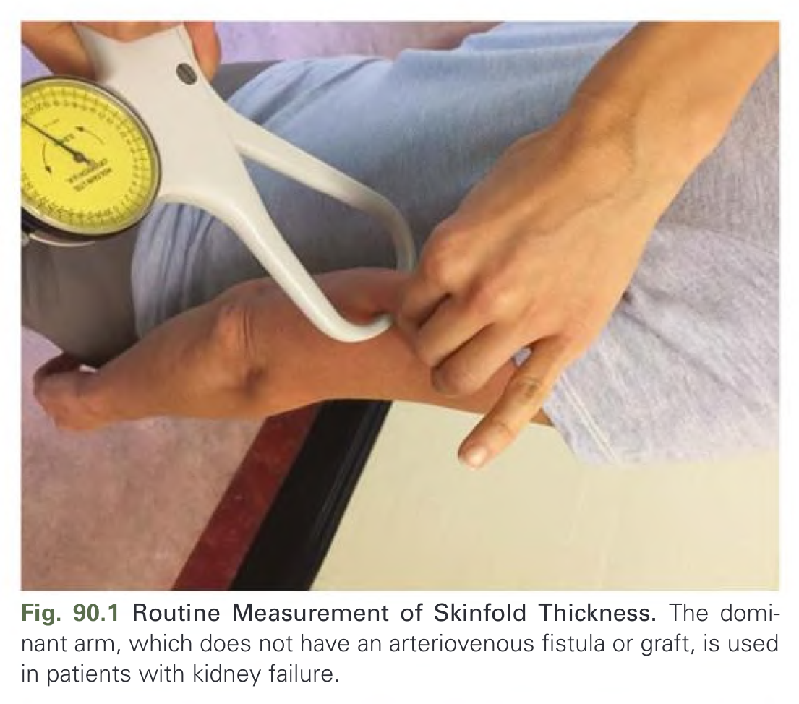
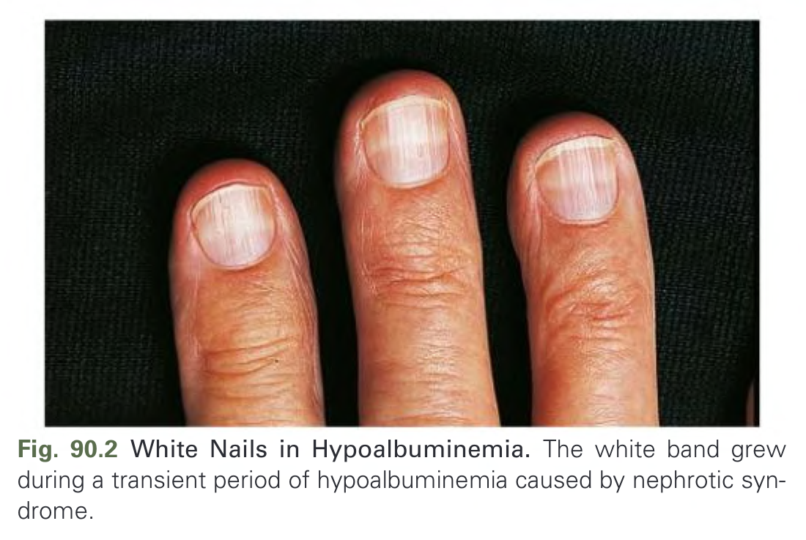
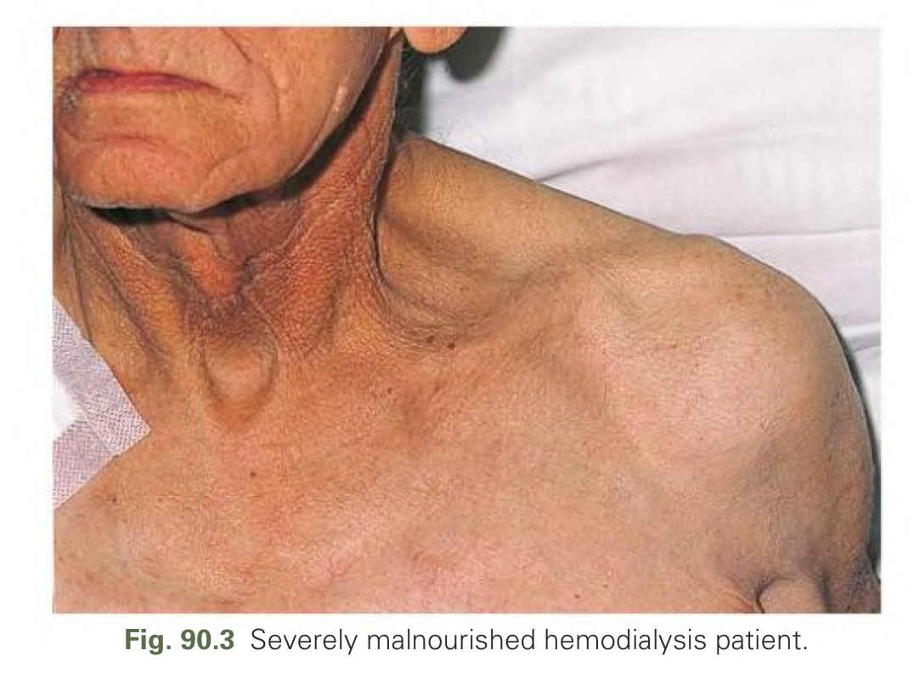
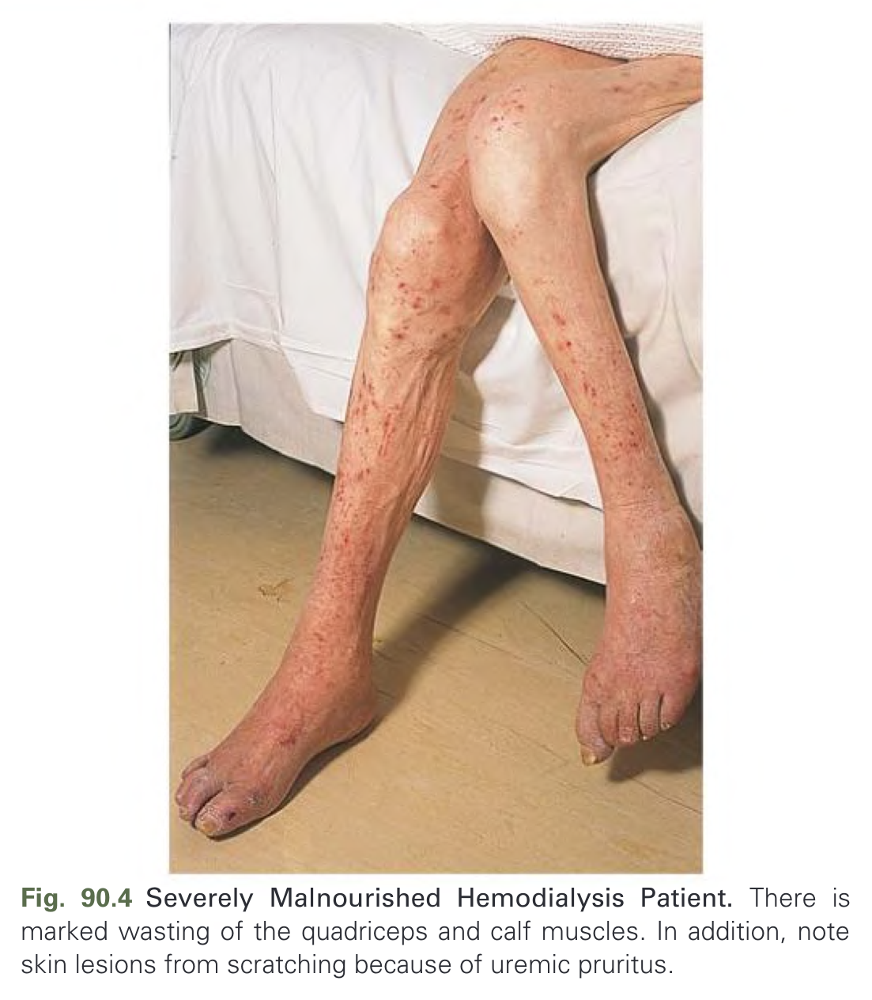
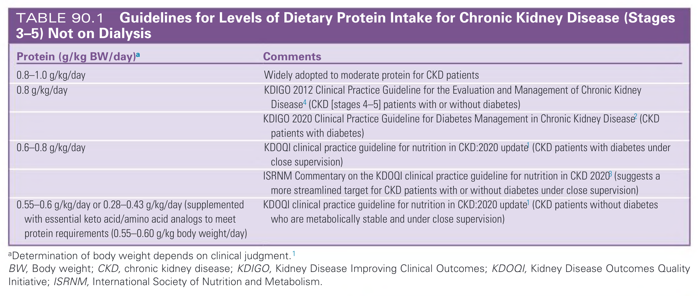
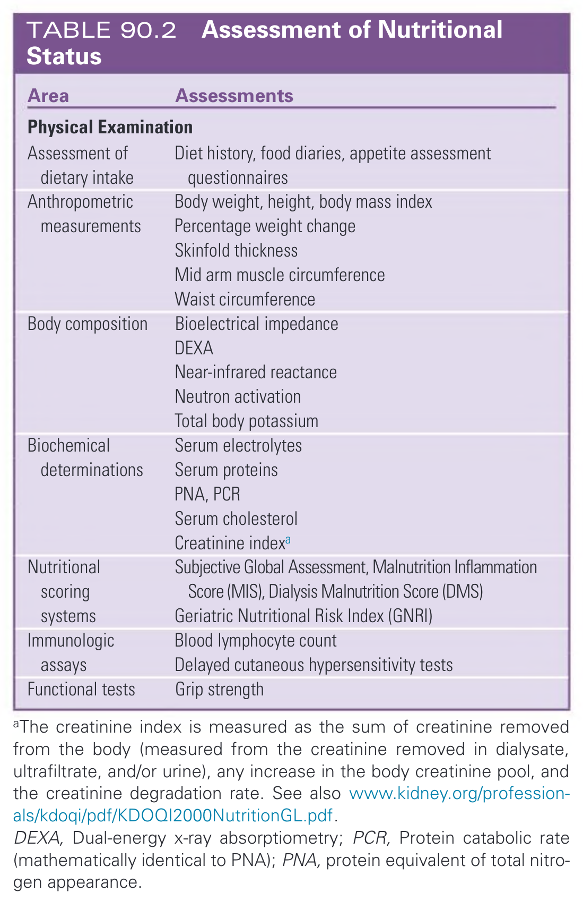
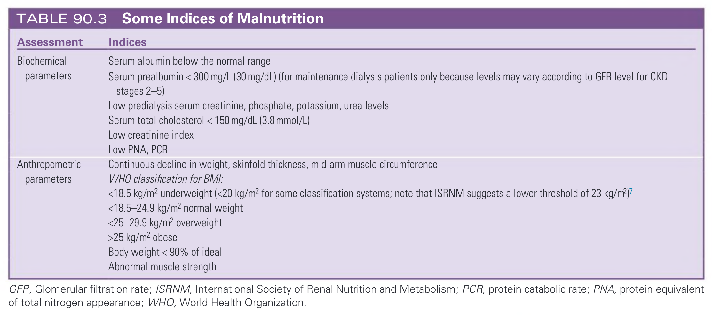
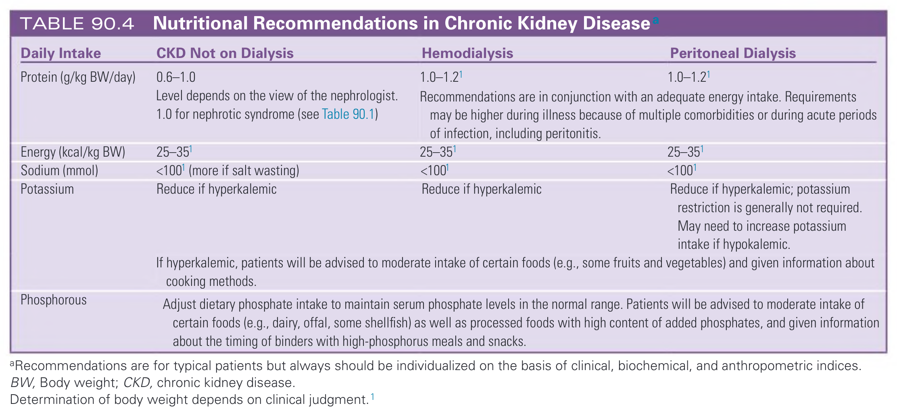

# 090. Nutrition in Chronic Kidney Disease - Figures and Tables Index

This document lists all figures, tables and boxes extracted from `090. Nutrition in Chronic Kidney Disease.pdf`.

## Table of Contents
- [Figures](#figures)
- [Tables](#tables)
- [Boxes](#boxes)

---

## Figures

### Fig_90_1



Fig. 90.1 Routine Measurement of Skinfold Thickness. The dominant arm, which does not have an arteriovenous fistula or graft, is used in patients with kidney failure.

---

### Fig_90_2



Fig. 90.2 White Nails in Hypoalbuminemia. The white band grew during a transient period of hypoalbuminemia caused by nephrotic syndrome.

---

### Fig_90_3



Fig. 90.3 Severely malnourished hemodialysis patient.

---

### Fig_90_4



Fig. 90.4 Severely Malnourished Hemodialysis Patient. There is marked wasting of the quadriceps and calf muscles. In addition, note skin lesions from scratching because of uremic pruritus.

---

## Tables

### Table_90_1

#### Table Image



#### Table Data (CSV: [Table_90_1.csv](Table_90_1.csv))

```markdown
| Protein (g/kg BW/day)^a | Comments |
| :--- | :--- |
| 0.8-1.0 g/kg/day | Widely adopted to moderate protein for CKD patients |
| 0.8 g/kg/day | KDIGO 2012 Clinical Practice Guideline for the Evaluation and Management of Chronic Kidney Disease (CKD [stages 4-5] patients with or without diabetes)<br>KDIGO 2020 Clinical Practice Guideline for Diabetes Management in Chronic Kidney Disease (CKD patients with diabetes) |
| 0.6-0.8 g/kg/day | KDOQI clinical practice guideline for nutrition in CKD:2020 update (CKD patients with diabetes under close supervision)<br>ISRNM Commentary on the KDOQI clinical practice guideline for nutrition in CKD 2020 (suggests a more streamlined target for CKD patients with or without diabetes under close supervision) |
| 0.55-0.6 g/kg/day or 0.28-0.43 g/kg/day (supplemented with essential keto acid/amino acid analogs to meet protein requirements (0.55-0.60 g/kg body weight/day) | KDOQI clinical practice guideline for nutrition in CKD:2020 update (CKD patients without diabetes who are metabolically stable and under close supervision) |

^aDetermination of body weight depends on clinical judgment.
BW, Body weight; CKD, chronic kidney disease; KDIGO, Kidney Disease Improving Clinical Outcomes; KDOQI, Kidney Disease Outcomes Quality Initiative; ISRNM, International Society of Nutrition and Metabolism.
```

TABLE 90.1 Guidelines for Levels of Dietary Protein Intake for Chronic Kidney Disease (Stages 3–5) Not on Dialysis

---

### Table_90_2

#### Table Image



#### Table Data (CSV: [Table_90_2.csv](Table_90_2.csv))

```markdown
| Area | Assessments |
| :--- | :--- |
| **Physical Examination** | |
| Assessment of dietary intake | Diet history, food diaries, appetite assessment questionnaires |
| Anthropometric measurements | Body weight, height, body mass index<br>Percentage weight change<br>Skinfold thickness<br>Mid arm muscle circumference<br>Waist circumference |
| Body composition | Bioelectrical impedance<br>DEXA<br>Near-infrared reactance<br>Neutron activation<br>Total body potassium |
| Biochemical determinations | Serum electrolytes<br>Serum proteins<br>PNA, PCR<br>Serum cholesterol<br>Creatinine indexa |
| Nutritional scoring systems | Subjective Global Assessment, Malnutrition Inflammation Score (MIS), Dialysis Malnutrition Score (DMS)<br>Geriatric Nutritional Risk Index (GNRI) |
| Immunologic assays | Blood lymphocyte count<br>Delayed cutaneous hypersensitivity tests |
| Functional tests | Grip strength |

aThe creatinine index is measured as the sum of creatinine removed from the body (measured from the creatinine removed in dialysate, ultrafiltrate, and/or urine), any increase in the body creatinine pool, and the creatinine degradation rate. See also www.kidney.org/professionals/kdoqi/pdf/KDOQI2000NutritionGL.pdf.
DEXA, Dual-energy x-ray absorptiometry; PCR, Protein catabolic rate (mathematically identical to PNA); PNA, protein equivalent of total nitrogen appearance.
```

TABLE 90.2 Assessment of Nutritional Status

---

### Table_90_3

#### Table Image



#### Table Data (CSV: [Table_90_3.csv](Table_90_3.csv))

```markdown
| Assessment | Indices |
| :--- | :--- |
| Biochemical parameters | Serum albumin below the normal range<br>Serum prealbumin < 300 mg/L (30 mg/dL) (for maintenance dialysis patients only because levels may vary according to GFR level for CKD stages 2-5)<br>Low predialysis serum creatinine, phosphate, potassium, urea levels<br>Serum total cholesterol < 150 mg/dL (3.8 mmol/L)<br>Low creatinine index<br>Low PNA, PCR |
| Anthropometric parameters | Continuous decline in weight, skinfold thickness, mid-arm muscle circumference<br>WHO classification for BMI:<br><18.5 kg/m² underweight (<20 kg/m² for some classification systems; note that ISRNM suggests a lower threshold of 23 kg/m²)<br><18.5-24.9 kg/m² normal weight<br><25-29.9 kg/m² overweight<br>>25 kg/m² obese<br>Body weight < 90% of ideal<br>Abnormal muscle strength |

GFR, Glomerular filtration rate; ISRNM, International Society of Renal Nutrition and Metabolism; PCR, protein catabolic rate; PNA, protein equivalent of total nitrogen appearance; WHO, World Health Organization.
```

TABLE 90.3 Some Indices of Malnutrition

---

### Table_90_4

#### Table Image



#### Table Data (CSV: [Table_90_4.csv](Table_90_4.csv))

```markdown
| Daily Intake | CKD Not on Dialysis | Hemodialysis | Peritoneal Dialysis |
| :--- | :--- | :--- | :--- |
| Protein (g/kg BW/day) | 0.6-1.0<br>Level depends on the view of the nephrologist.<br>1.0 for nephrotic syndrome (see Table 90.1) | 1.0-1.2<br>Recommendations are in conjunction with an adequate energy intake. Requirements may be higher during illness because of multiple comorbidities or during acute periods of infection, including peritonitis. | 1.0-1.2 |
| Energy (kcal/kg BW) | 25-35 | 25-35 | 25-35 |
| Sodium (mmol) | <100 (more if salt wasting) | <100 | <100 |
| Potassium | Reduce if hyperkalemic<br>If hyperkalemic, patients will be advised to moderate intake of certain foods (e.g., some fruits and vegetables) and given information about cooking methods. | Reduce if hyperkalemic | Reduce if hyperkalemic; potassium restriction is generally not required. May need to increase potassium intake if hypokalemic. |
| Phosphorous | Adjust dietary phosphate intake to maintain serum phosphate levels in the normal range. Patients will be advised to moderate intake of certain foods (e.g., dairy, offal, some shellfish) as well as processed foods with high content of added phosphates, and given information about the timing of binders with high-phosphorus meals and snacks. | | |

aRecommendations are for typical patients but always should be individualized on the basis of clinical, biochemical, and anthropometric indices.
BW, Body weight; CKD, chronic kidney disease.
Determination of body weight depends on clinical judgment.
```

TABLE 90.4 Nutritional Recommendations in Chronic Kidney Disease

---

## Boxes

*No boxes resolved for this chapter.*
