# 091. Dermatologic Manifestations of Chronic Kidney Disease - Figures and Tables Index

This document lists all figures, tables and boxes extracted from `091. Dermatologic Manifestations of Chronic Kidney Disease.pdf`.

## Table of Contents
- [Figures](#figures)
- [Tables](#tables)
- [Boxes](#boxes)

---

## Figures

### Fig_91_1

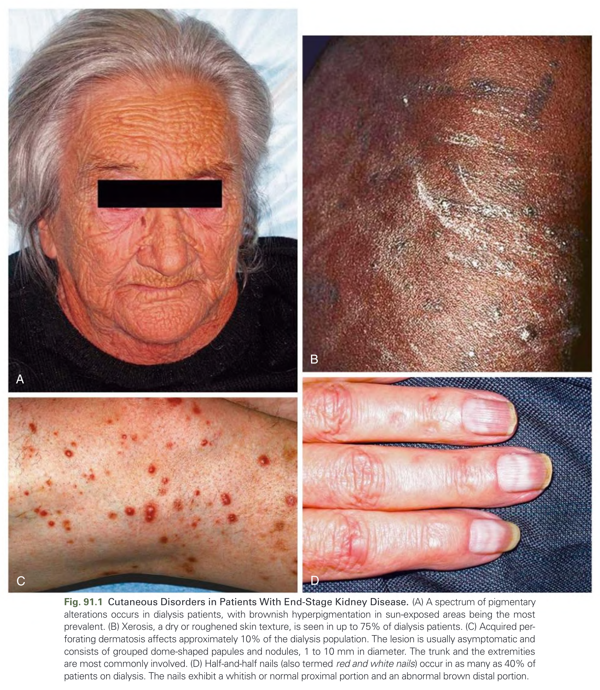

Fig. 91.1 Cutaneous Disorders in Patients With End-Stage Kidney Disease. (A) A spectrum of pigmentary alterations occurs in dialysis patients, with brownish hyperpigmentation in sun-exposed areas being the most prevalent. (B) Xerosis, a dry or roughened skin texture, is seen in up to 75% of dialysis patients. (C) Acquired perforating dermatosis affects approximately 10% of the dialysis population. The lesion is usually asymptomatic and consists of grouped dome-shaped papules and nodules, 1 to 10 mm in diameter. The trunk and the extremities are most commonly involved. (D) Half-and-half nails (also termed red and white nails) occur in as many as 40% of patients on dialysis. The nails exhibit a whitish or normal proximal portion and an abnormal brown distal portion.

---

### Fig_91_2

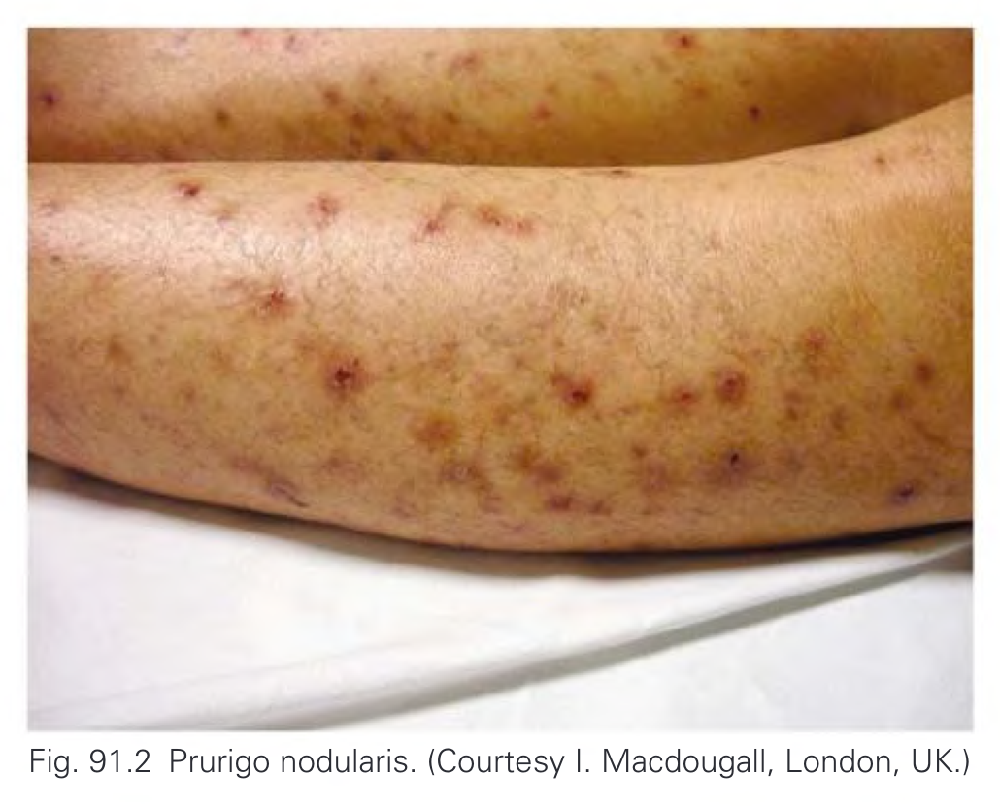

Fig. 91.2 Prurigo nodularis. (Courtesy I. Macdougall, London, UK.)

---

### Fig_91_3

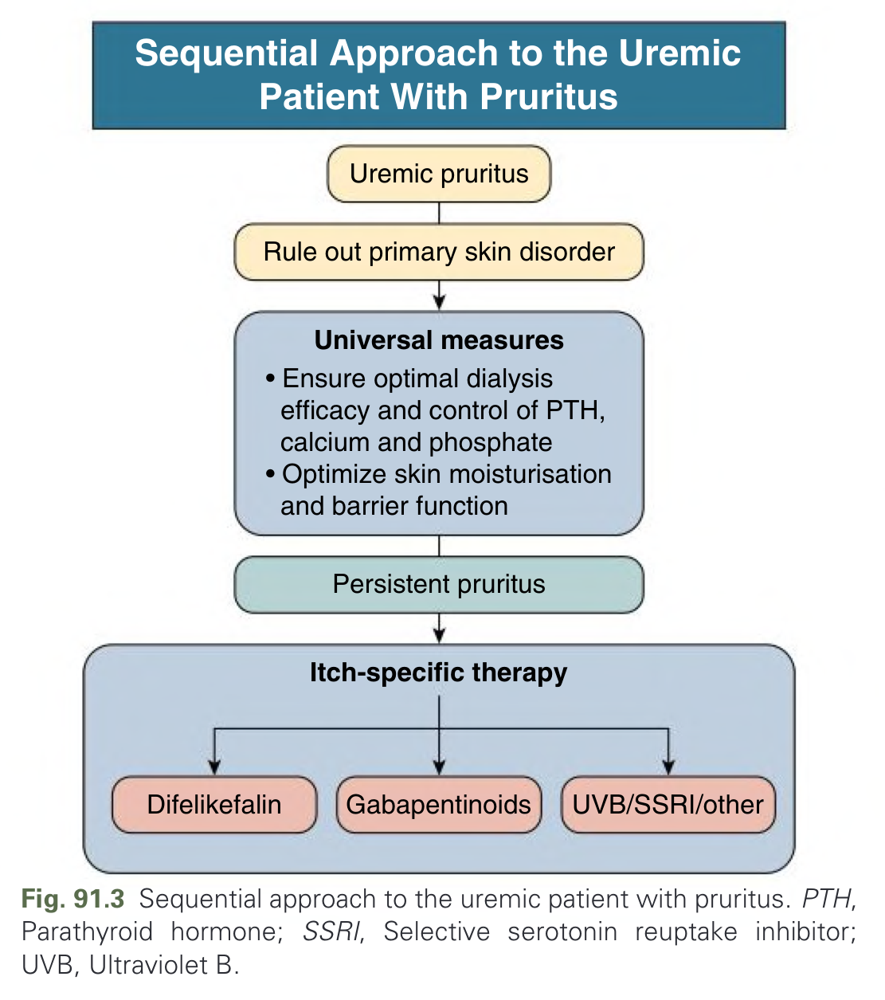

Fig. 91.3 Sequential approach to the uremic patient with pruritus. PTH, Parathyroid hormone; SSRI, Selective serotonin reuptake inhibitor; UVB, Ultraviolet B.

---

### Fig_91_4

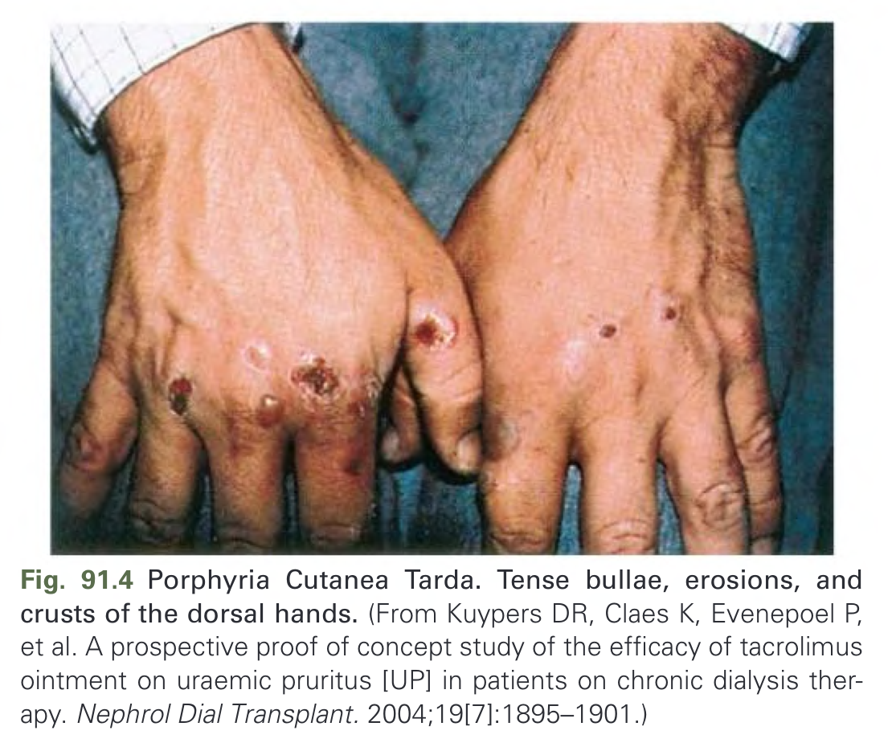

Fig. 91.4 Porphyria Cutanea Tarda. Tense bullae, erosions, and crusts of the dorsal hands. (From Kuypers DR, Claes K, Evenepoel P, et al. A prospective proof of concept study of the efficacy of tacrolimus ointment on uraemic pruritus [UP] in patients on chronic dialysis therapy. Nephrol Dial Transplant. 2004;19[7]:1895–1901.)

---

### Fig_91_5

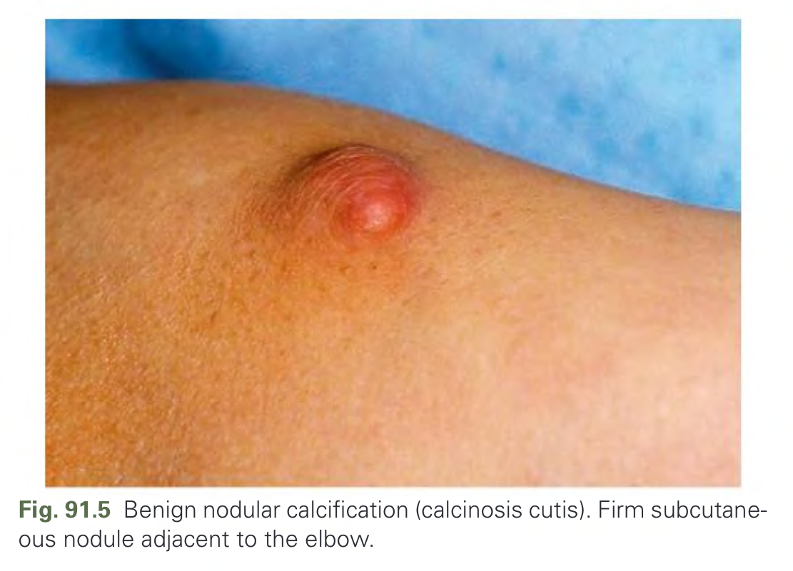

Fig. 91.5 Benign nodular calcification (calcinosis cutis). Firm subcutaneous nodule adjacent to the elbow.

---

### Fig_91_6

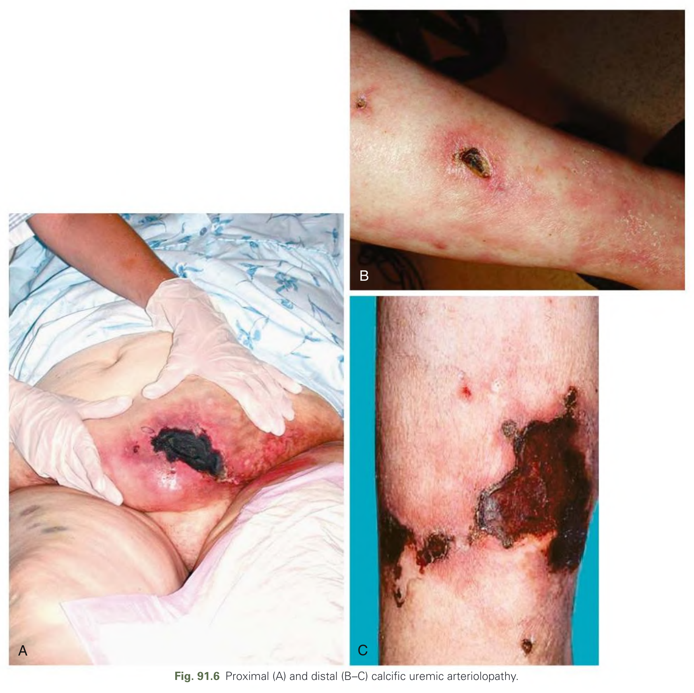

Fig. 91.6 Proximal (A) and distal (B–C) calcific uremic arteriolopathy.

---

### Fig_91_7

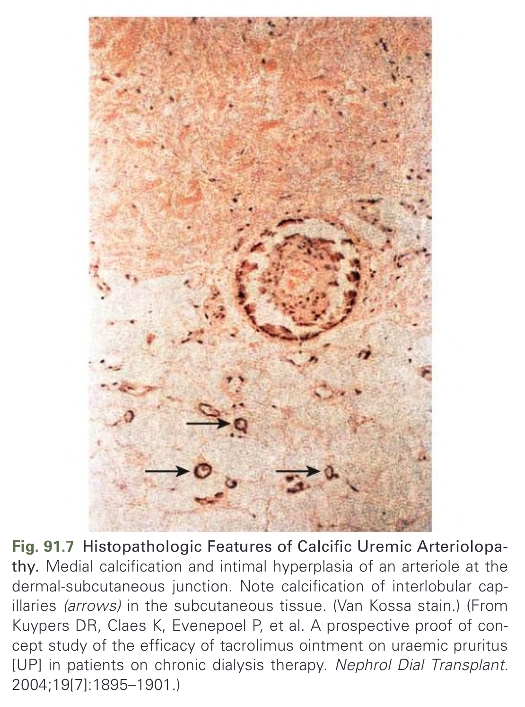

Fig. 91.7 Histopathologic Features of Calcific Uremic Arteriolopathy. Medial calcification and intimal hyperplasia of an arteriole at the dermal-subcutaneous junction. Note calcification of interlobular capillaries (arrows) in the subcutaneous tissue. (Van Kossa stain.) (From Kuypers DR, Claes K, Evenepoel P, et al. A prospective proof of concept study of the efficacy of tacrolimus ointment on uraemic pruritus [UP] in patients on chronic dialysis therapy. Nephrol Dial Transplant. 2004;19[7]:1895–1901.)

---

### Fig_91_8

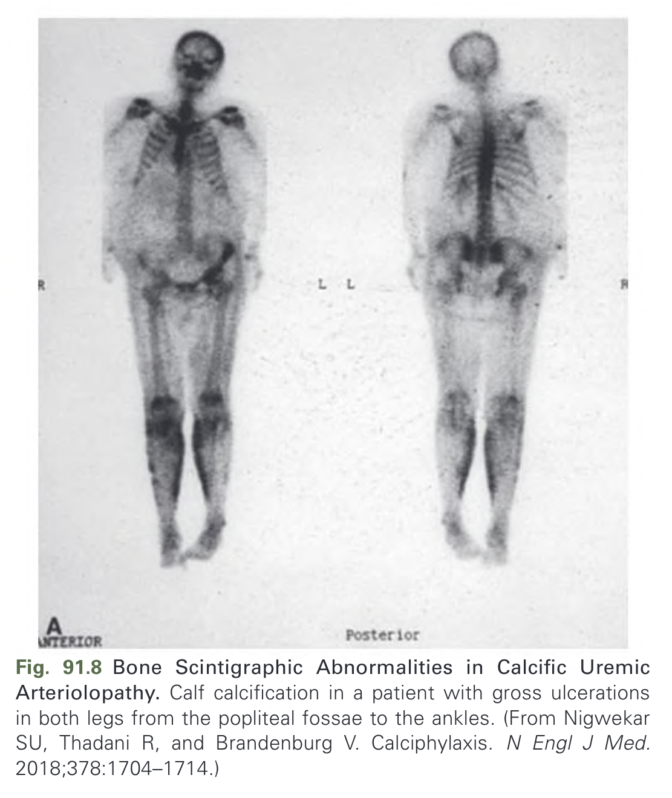

Fig. 91.8 Bone Scintigraphic Abnormalities in Calcific Uremic Arteriolopathy. Calf calcification in a patient with gross ulcerations in both legs from the popliteal fossae to the ankles. (From Nigwekar SU, Thadani R, and Brandenburg V. Calciphylaxis. N Engl J Med. 2018;378:1704–1714.)

---

### Fig_91_9

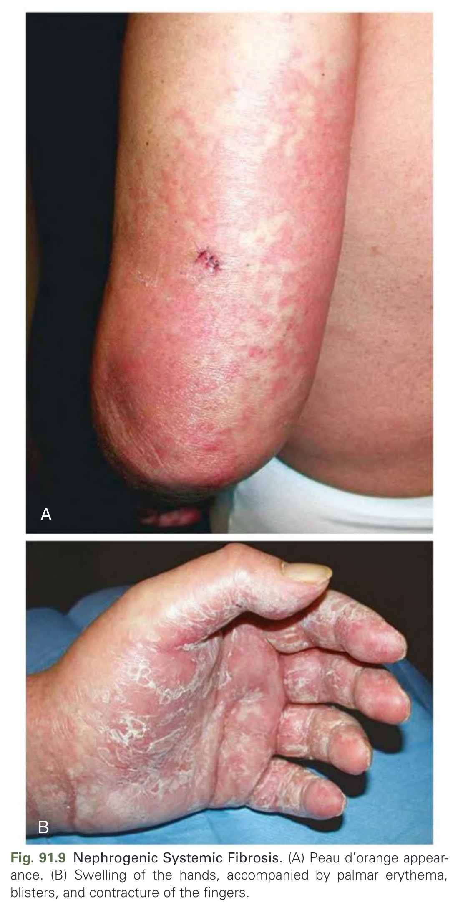

Fig. 91.9 Nephrogenic Systemic Fibrosis. (A) Peau d’orange appearance. (B) Swelling of the hands, accompanied by palmar erythema, blisters, and contracture of the fingers.

---

### Fig_91_10

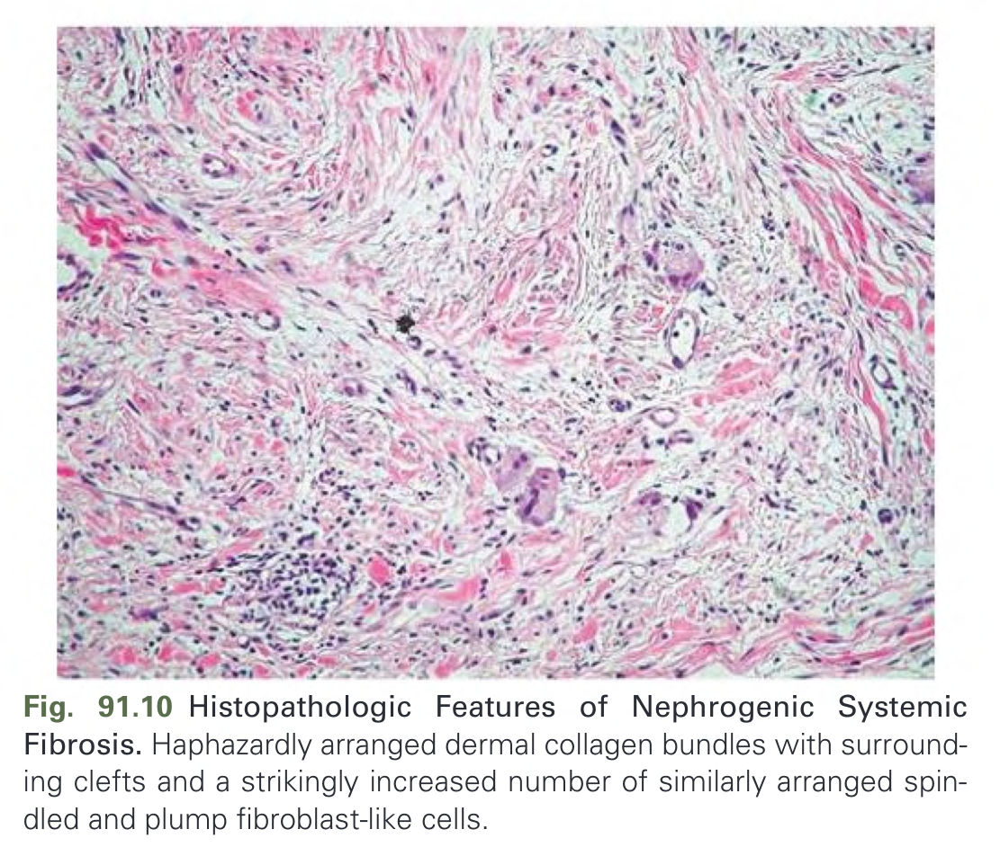

Fig. 91.10 Histopathologic Features of Nephrogenic Systemic Fibrosis. Haphazardly arranged dermal collagen bundles with surrounding clefts and a strikingly increased number of similarly arranged spindled and plump fibroblast-like cells.

---

## Tables

*No tables resolved for this chapter.*

## Boxes

### Box_91_1

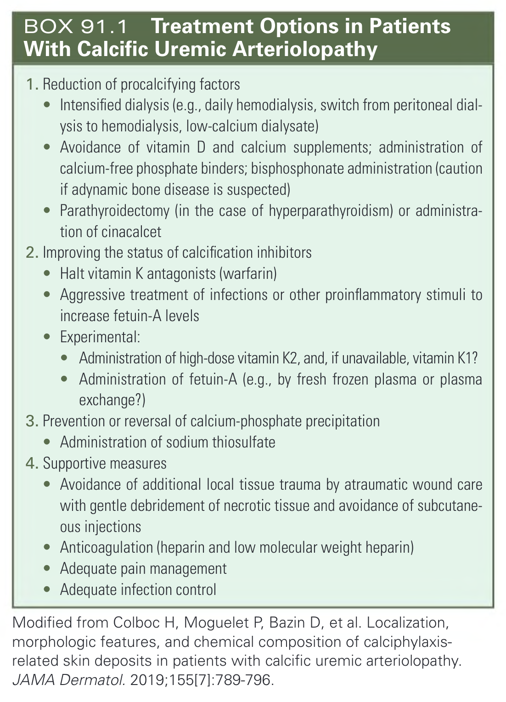

#### Box Text

```markdown
**1. Reduction of procalcifying factors**
* Intensified dialysis (e.g., daily hemodialysis, switch from peritoneal dialysis to hemodialysis, low-calcium dialysate)
* Avoidance of vitamin D and calcium supplements; administration of calcium-free phosphate binders; bisphosphonate administration (caution if adynamic bone disease is suspected)
* Parathyroidectomy (in the case of hyperparathyroidism) or administration of cinacalcet

**2. Improving the status of calcification inhibitors**
* Halt vitamin K antagonists (warfarin)
* Aggressive treatment of infections or other proinflammatory stimuli to increase fetuin-A levels
* Experimental:
    * Administration of high-dose vitamin K2, and, if unavailable, vitamin K1?
    * Administration of fetuin-A (e.g., by fresh frozen plasma or plasma exchange?)

**3. Prevention or reversal of calcium-phosphate precipitation**
* Administration of sodium thiosulfate

**4. Supportive measures**
* Avoidance of additional local tissue trauma by atraumatic wound care with gentle debridement of necrotic tissue and avoidance of subcutaneous injections
* Anticoagulation (heparin and low molecular weight heparin)
* Adequate pain management
* Adequate infection control

Modified from Colboc H, Moguelet P, Bazin D, et al. Localization, morphologic features, and chemical composition of calciphylaxis-related skin deposits in patients with calcific uremic arteriolopathy. JAMA Dermatol. 2019;155[7]:789-796.
```

BOX 91.1  Treatment Options in Patients With Calcific Uremic Arteriolopathy

---
