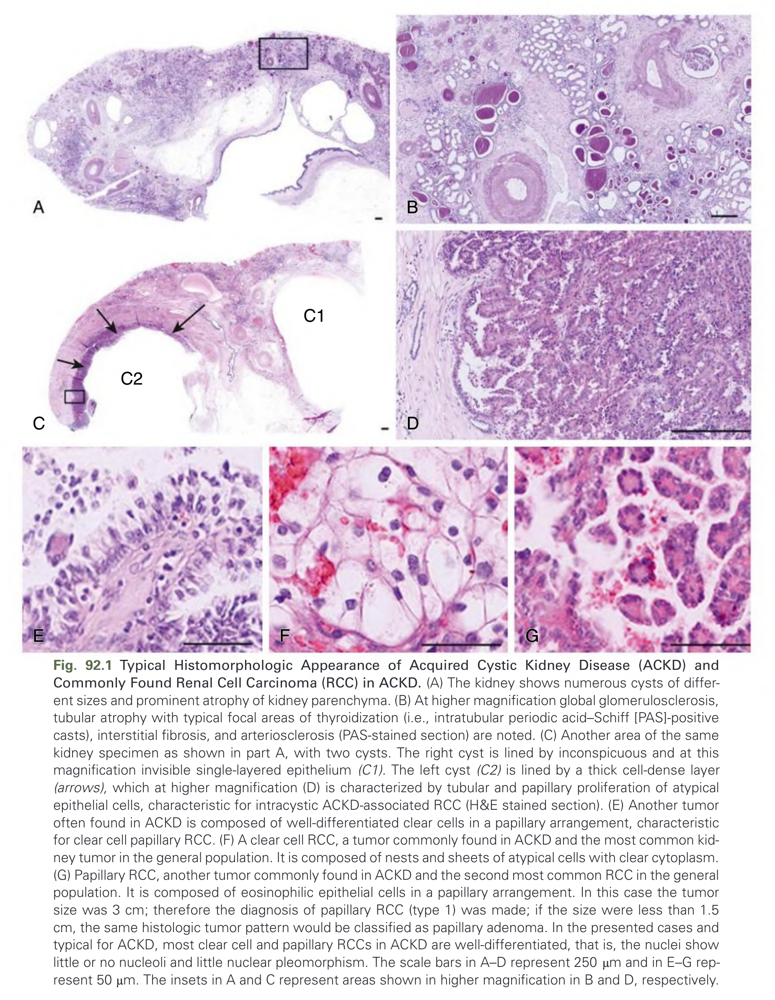
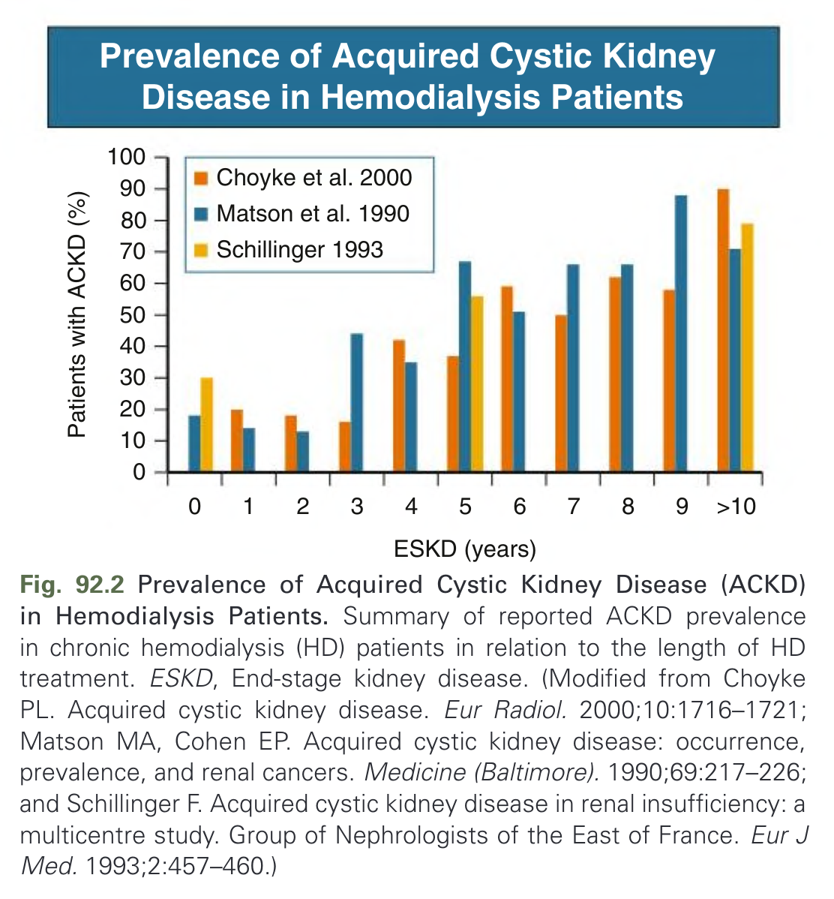
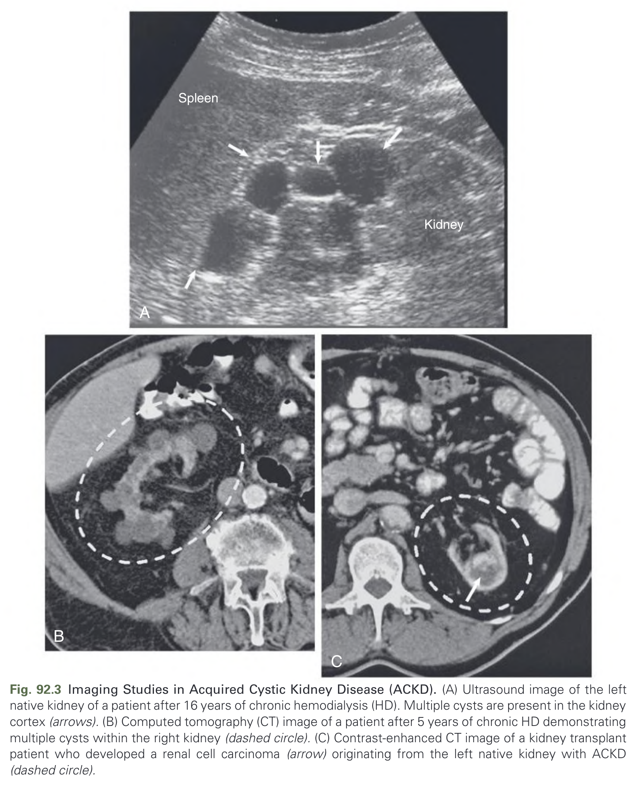
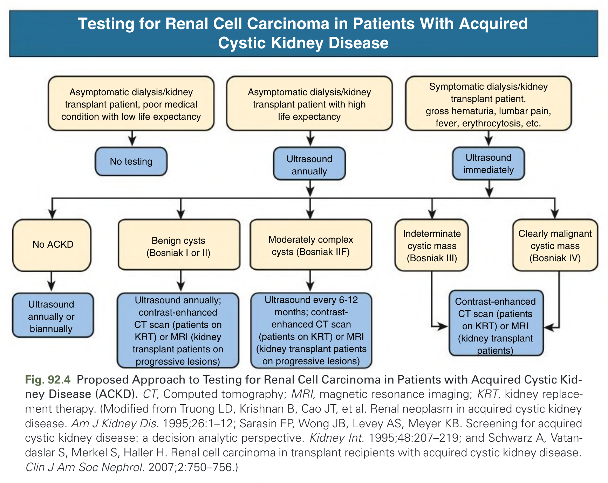
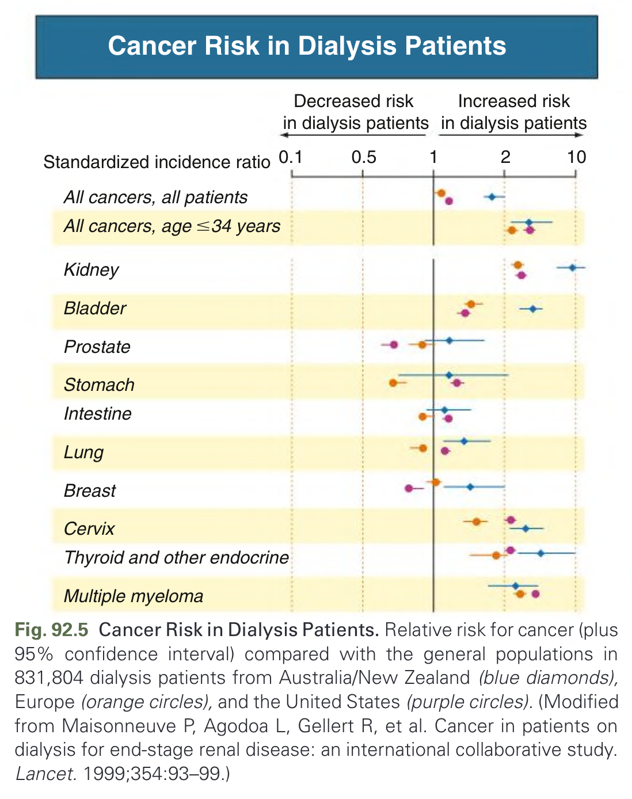

# 092. Acquired Cystic Kidney Disease and Malignant Neoplasms - Figures and Tables Index

This document lists all figures, tables and boxes extracted from `092. Acquired Cystic Kidney Disease and Malignant Neoplasms.pdf`.

## Table of Contents
- [Figures](#figures)
- [Tables](#tables)
- [Boxes](#boxes)

---

## Figures

### Fig_92_1

Fig. 92.1 Typical Histomorphologic Appearance of Acquired Cystic Kidney Disease (ACKD) and Commonly Found Renal Cell Carcinoma (RCC) in ACKD. (A) The kidney shows numerous cysts of different sizes and prominent atrophy of kidney parenchyma. (B) At higher magnification global glomerulosclerosis, tubular atrophy with typical focal areas of thyroidization (i.e., intratubular periodic acid–Schiff [PAS]-positive casts), interstitial fibrosis, and arteriosclerosis (PAS-stained section) are noted. (C) Another area of the same kidney specimen as shown in part A, with two cysts. The right cyst is lined by inconspicuous and at this magnification invisible single-layered epithelium (C1). The left cyst (C2) is lined by a thick cell-dense layer (arrows), which at higher magnification (D) is characterized by tubular and papillary proliferation of atypical epithelial cells, characteristic for intracystic ACKD-associated RCC (H&E stained section). (E) Another tumor often found in ACKD is composed of well-differentiated clear cells in a papillary arrangement, characteristic for clear cell papillary RCC. (F) A clear cell RCC, a tumor commonly found in ACKD and the most common kidney tumor in the general population. It is composed of nests and sheets of atypical cells with clear cytoplasm. (G) Papillary RCC, another tumor commonly found in ACKD and the second most common RCC in the general population. It is composed of eosinophilic epithelial cells in a papillary arrangement. In this case the tumor size was 3 cm; therefore the diagnosis of papillary RCC (type 1) was made; if the size were less than 1.5 cm, the same histologic tumor pattern would be classified as papillary adenoma. In the presented cases and typical for ACKD, most clear cell and papillary RCCs in ACKD are well-differentiated, that is, the nuclei show little or no nucleoli and little nuclear pleomorphism. The scale bars in A–D represent 250 μm and in E–G represent 50 μm. The insets in A and C represent areas shown in higher magnification in B and D, respectively.

---

### Fig_92_2

Fig. 92.2 Prevalence of Acquired Cystic Kidney Disease (ACKD) in Hemodialysis Patients. Summary of reported ACKD prevalence in chronic hemodialysis (HD) patients in relation to the length of HD treatment. ESKD, End-stage kidney disease. (Modified from Choyke PL. Acquired cystic kidney disease. Eur Radiol. 2000;10:1716–1721; Matson MA, Cohen EP. Acquired cystic kidney disease: occurrence, prevalence, and renal cancers. Medicine (Baltimore). 1990;69:217–226; and Schillinger F. Acquired cystic kidney disease in renal insufficiency: a multicentre study. Group of Nephrologists of the East of France. Eur J Med. 1993;2:457–460.)

---

### Fig_92_3

Fig. 92.3 Imaging Studies in Acquired Cystic Kidney Disease (ACKD). (A) Ultrasound image of the left native kidney of a patient after 16 years of chronic hemodialysis (HD). Multiple cysts are present in the kidney cortex (arrows). (B) Computed tomography (CT) image of a patient after 5 years of chronic HD demonstrating multiple cysts within the right kidney (dashed circle). (C) Contrast-enhanced CT image of a kidney transplant patient who developed a renal cell carcinoma (arrow) originating from the left native kidney with ACKD (dashed circle).

---

### Fig_92_4

Fig. 92.4 Proposed Approach to Testing for Renal Cell Carcinoma in Patients with Acquired Cystic Kidney Disease (ACKD). CT, Computed tomography; MRI, magnetic resonance imaging; KRT, kidney replacement therapy. (Modified from Truong LD, Krishnan B, Cao JT, et al. Renal neoplasm in acquired cystic kidney disease. Am J Kidney Dis. 1995;26:1–12; Sarasin FP, Wong JB, Levey AS, Meyer KB. Screening for acquired cystic kidney disease: a decision analytic perspective. Kidney Int. 1995;48:207–219; and Schwarz A, Vatandaslar S, Merkel S, Haller H. Renal cell carcinoma in transplant recipients with acquired cystic kidney disease. Clin J Am Soc Nephrol. 2007;2:750–756.)

---

### Fig_92_5

Fig. 92.5 Cancer Risk in Dialysis Patients. Relative risk for cancer (plus 95% confidence interval) compared with the general populations in 831,804 dialysis patients from Australia/New Zealand (blue diamonds), Europe (orange circles), and the United States (purple circles). (Modified from Maisonneuve P, Agodoa L, Gellert R, et al. Cancer in patients on dialysis for end-stage renal disease: an international collaborative study. Lancet. 1999;354:93–99.)

---

## Tables

*No tables resolved for this chapter.*

## Boxes

*No boxes resolved for this chapter.*
