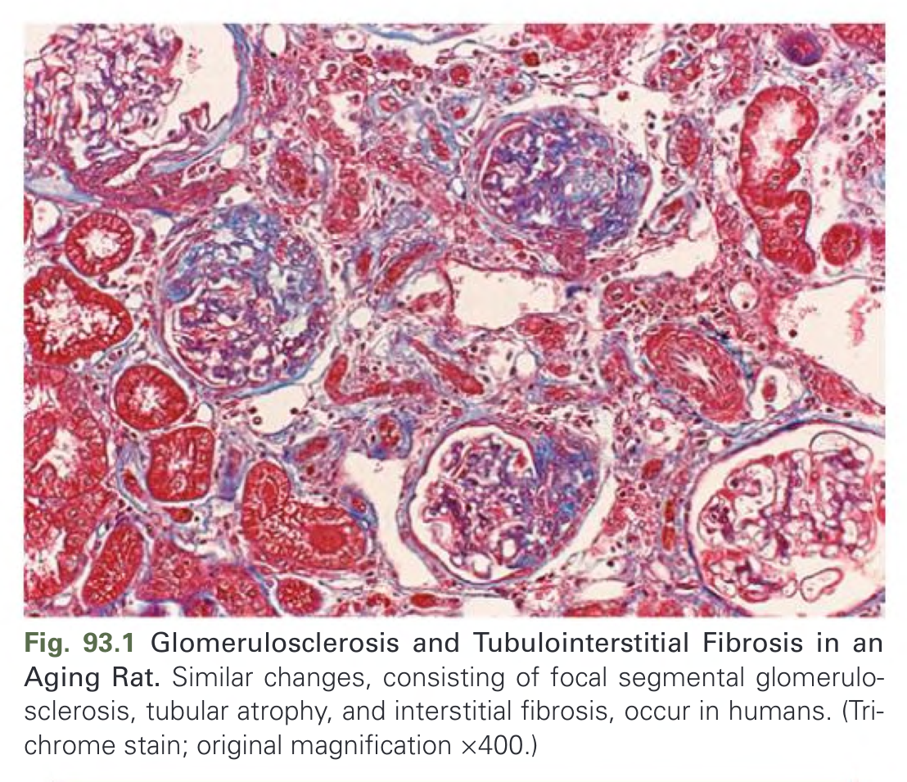
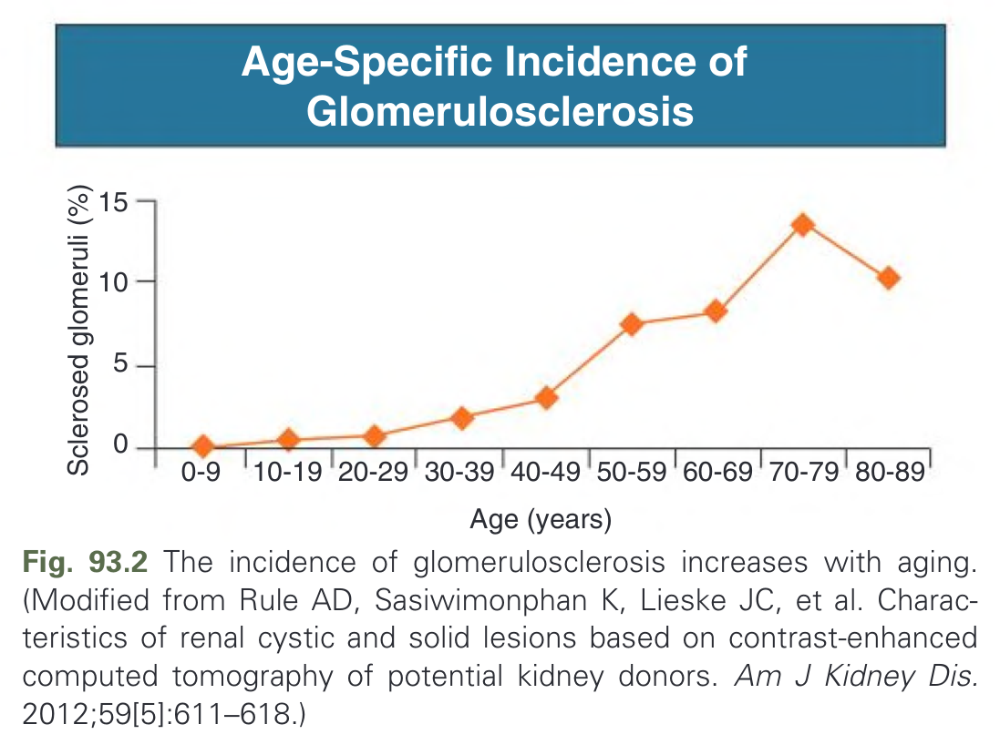
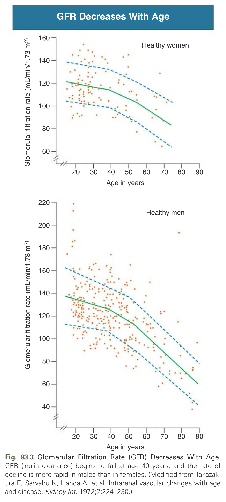
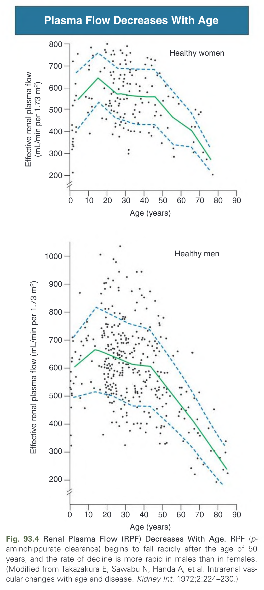
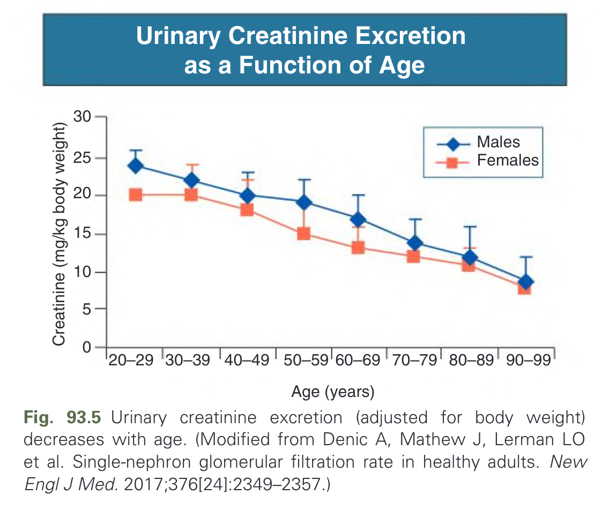
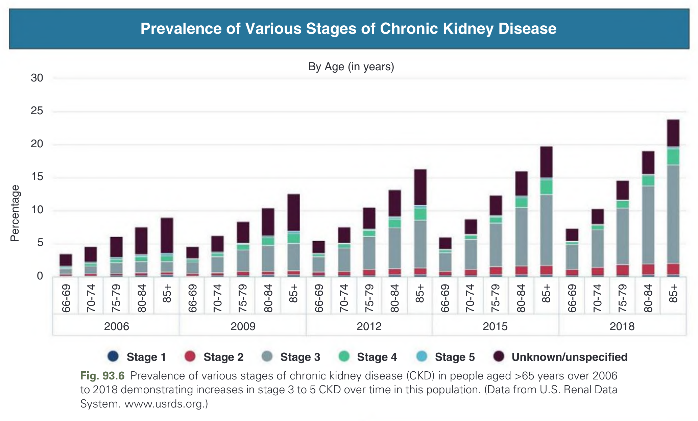
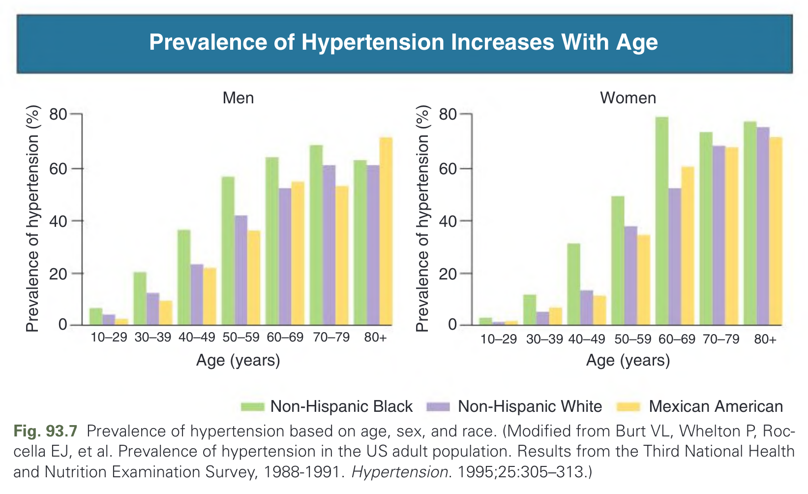
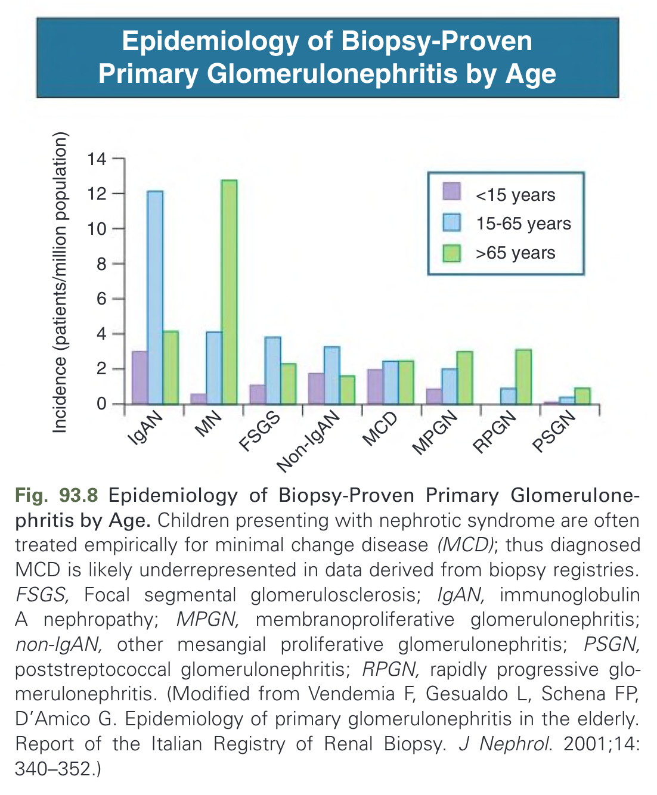
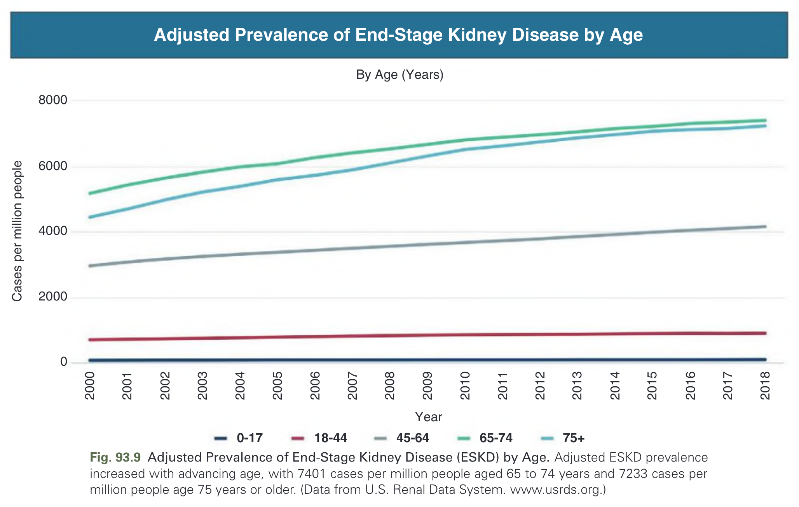
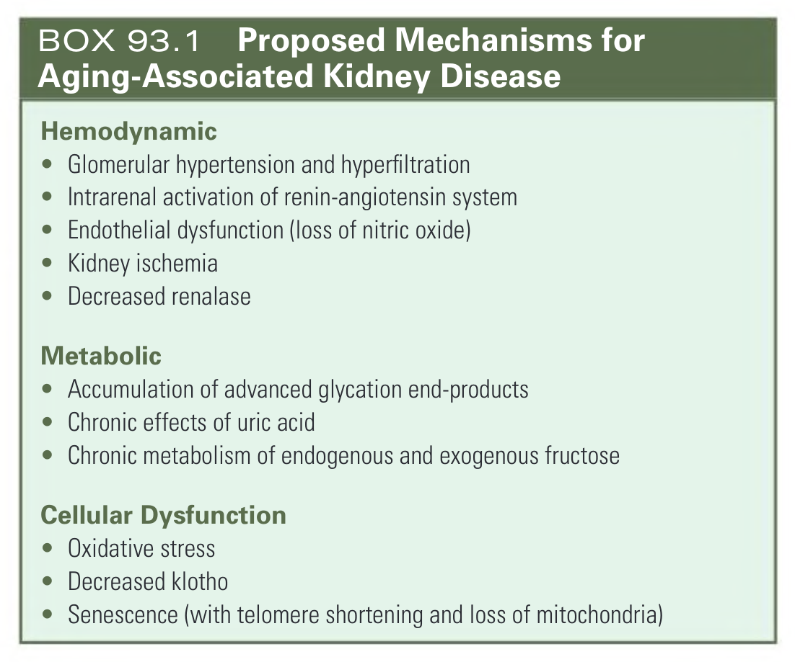

# 093. Geriatric Nephrology - Figures and Tables Index

This document lists all figures, tables and boxes extracted from `093. Geriatric Nephrology.pdf`.

## Table of Contents
- [Figures](#figures)
- [Tables](#tables)
- [Boxes](#boxes)

---

## Figures

### Fig_93_1



Fig. 93.1 Glomerulosclerosis and Tubulointerstitial Fibrosis in an Aging Rat. Similar changes, consisting of focal segmental glomerulosclerosis, tubular atrophy, and interstitial fibrosis, occur in humans. (Trichrome stain; original magnification ×400.)

---

### Fig_93_2



Fig. 93.2 The incidence of glomerulosclerosis increases with aging. (Modified from Rule AD, Sasiwimonphan K, Lieske JC, et al. Characteristics of renal cystic and solid lesions based on contrast-enhanced computed tomography of potential kidney donors. Am J Kidney Dis. 2012;59[5]:611–618.)

---

### Fig_93_3



Fig. 93.3 Glomerular Filtration Rate (GFR) Decreases With Age. GFR (inulin clearance) begins to fall at age 40 years, and the rate of decline is more rapid in males than in females. (Modified from Takazakura E, Sawabu N, Handa A, et al. Intrarenal vascular changes with age and disease. Kidney Int. 1972;2:224–230.)

---

### Fig_93_4



Fig. 93.4 Renal Plasma Flow (RPF) Decreases With Age. RPF (p-aminohippurate clearance) begins to fall rapidly after the age of 50 years, and the rate of decline is more rapid in males than in females. (Modified from Takazakura E, Sawabu N, Handa A, et al. Intrarenal vascular changes with age and disease. Kidney Int. 1972;2:224–230.)

---

### Fig_93_5



Fig. 93.5 Urinary creatinine excretion (adjusted for body weight) decreases with age. (Modified from Denic A, Mathew J, Lerman LO et al. Single-nephron glomerular filtration rate in healthy adults. New Engl J Med. 2017;376[24]:2349–2357.)

---

### Fig_93_6



Fig. 93.6 Prevalence of various stages of chronic kidney disease (CKD) in people aged >65 years over 2006 to 2018 demonstrating increases in stage 3 to 5 CKD over time in this population. (Data from U.S. Renal Data System. www.usrds.org.)

---

### Fig_93_7



Fig. 93.7 Prevalence of hypertension based on age, sex, and race. (Modified from Burt VL, Whelton P, Roccella EJ, et al. Prevalence of hypertension in the US adult population. Results from the Third National Health and Nutrition Examination Survey, 1988-1991. Hypertension. 1995;25:305–313.)

---

### Fig_93_8



Fig. 93.8 Epidemiology of Biopsy-Proven Primary Glomerulonephritis by Age. Children presenting with nephrotic syndrome are often treated empirically for minimal change disease (MCD); thus diagnosed MCD is likely underrepresented in data derived from biopsy registries. FSGS, Focal segmental glomerulosclerosis; IgAN, immunoglobulin A nephropathy; MPGN, membranoproliferative glomerulonephritis; non-IgAN, other mesangial proliferative glomerulonephritis; PSGN, poststreptococcal glomerulonephritis; RPGN, rapidly progressive glomerulonephritis. (Modified from Vendemia F, Gesualdo L, Schena FP, D’Amico G. Epidemiology of primary glomerulonephritis in the elderly. Report of the Italian Registry of Renal Biopsy. J Nephrol. 2001;14:340–352.)

---

### Fig_93_9



Fig. 93.9 Adjusted Prevalence of End-Stage Kidney Disease (ESKD) by Age. Adjusted ESKD prevalence increased with advancing age, with 7401 cases per million people aged 65 to 74 years and 7233 cases per million people age 75 years or older. (Data from U.S. Renal Data System. www.usrds.org.)

---

## Tables

*No tables resolved for this chapter.*

## Boxes

### Box_93_1



#### Box Text

```markdown
**Hemodynamic**
* Glomerular hypertension and hyperfiltration
* Intrarenal activation of renin-angiotensin system
* Endothelial dysfunction (loss of nitric oxide)
* Kidney ischemia
* Decreased renalase

**Metabolic**
* Accumulation of advanced glycation end-products
* Chronic effects of uric acid
* Chronic metabolism of endogenous and exogenous fructose

**Cellular Dysfunction**
* Oxidative stress
* Decreased klotho
* Senescence (with telomere shortening and loss of mitochondria)
```

BOX 93.1 Proposed Mechanisms for Aging-Associated Kidney Disease

---
