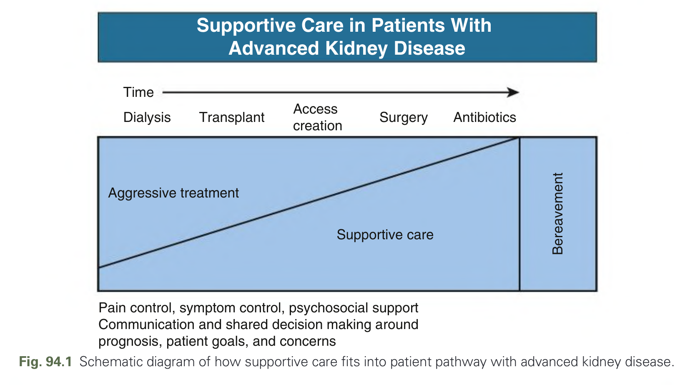
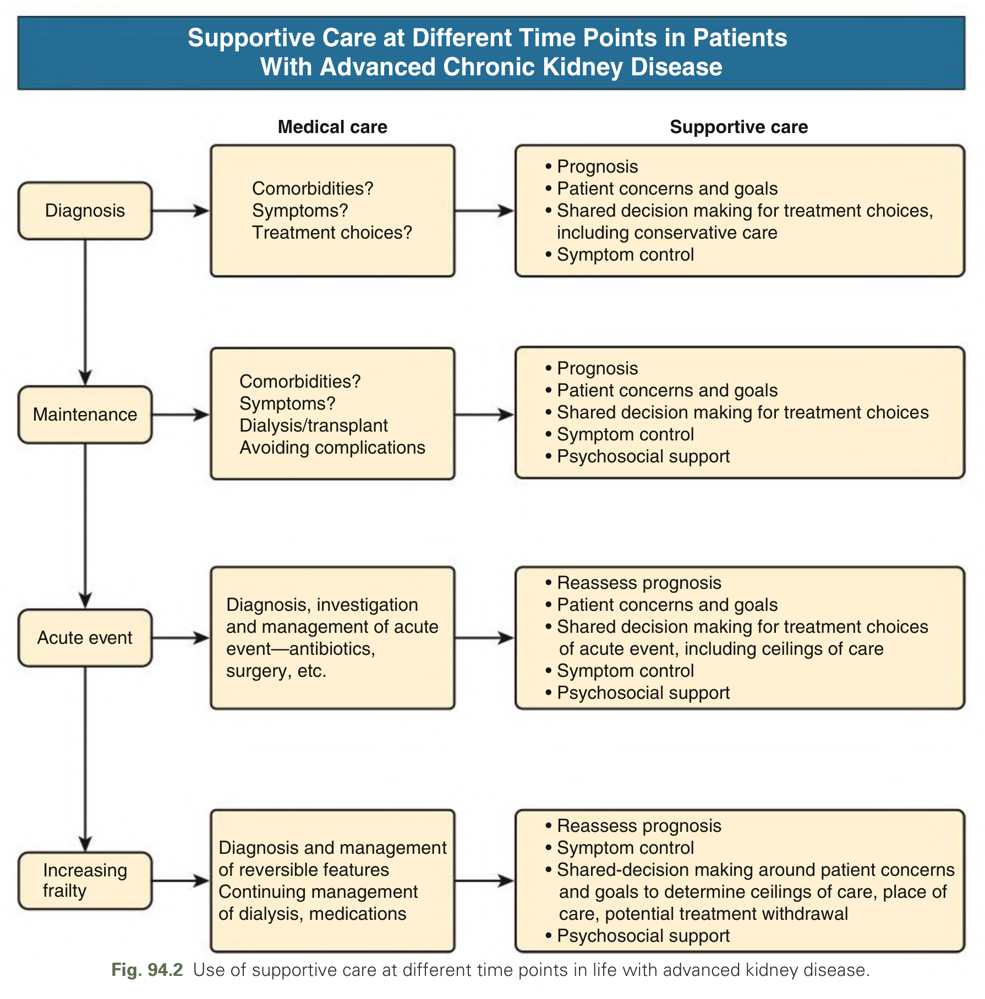
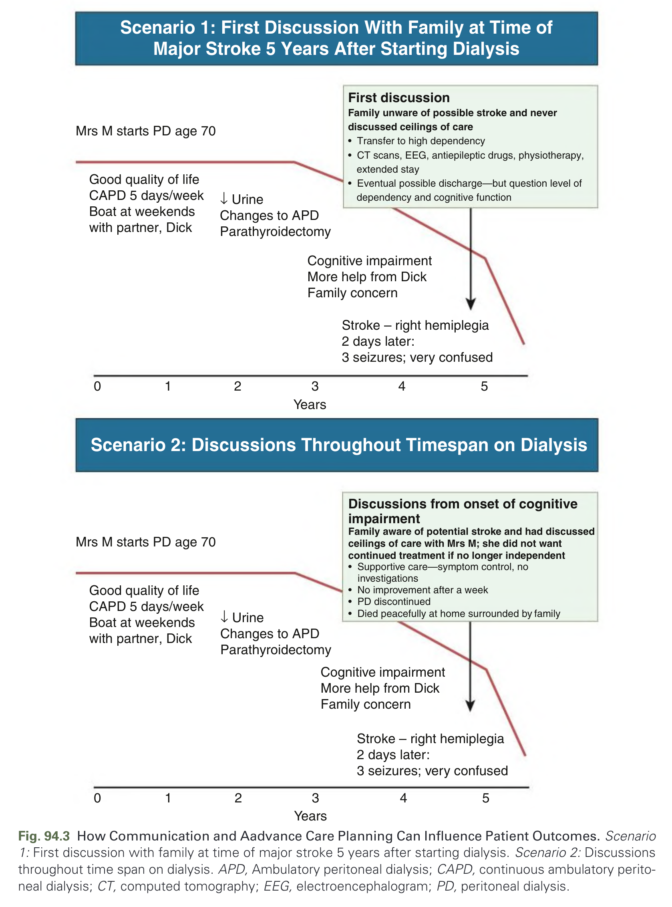
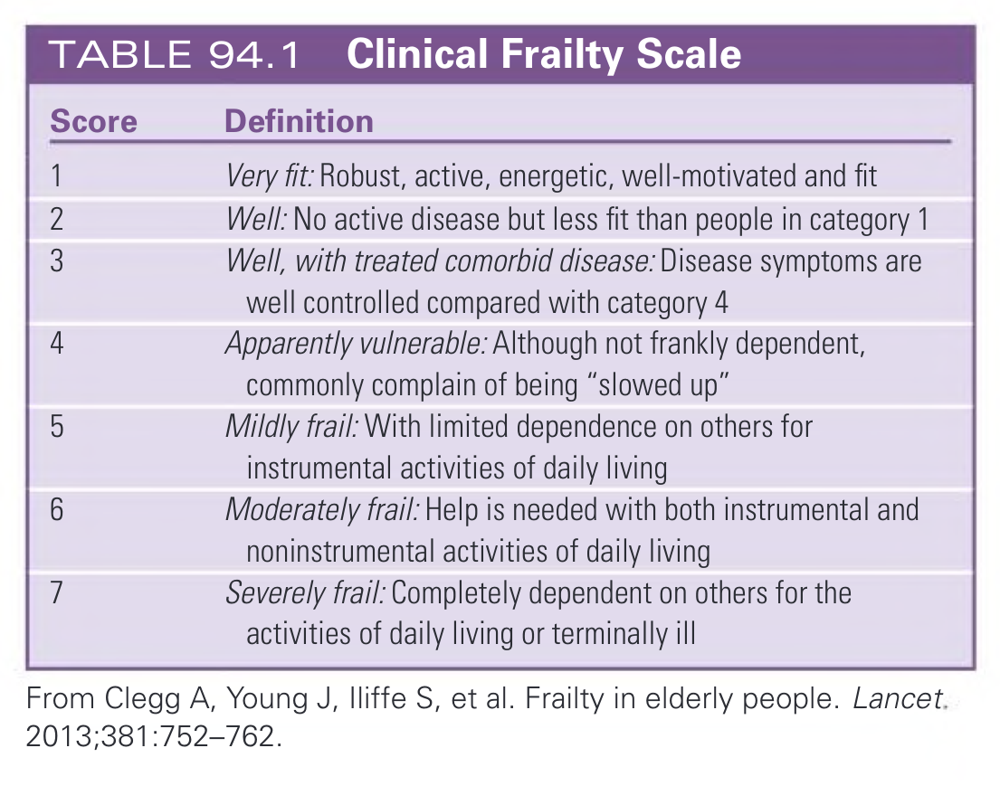
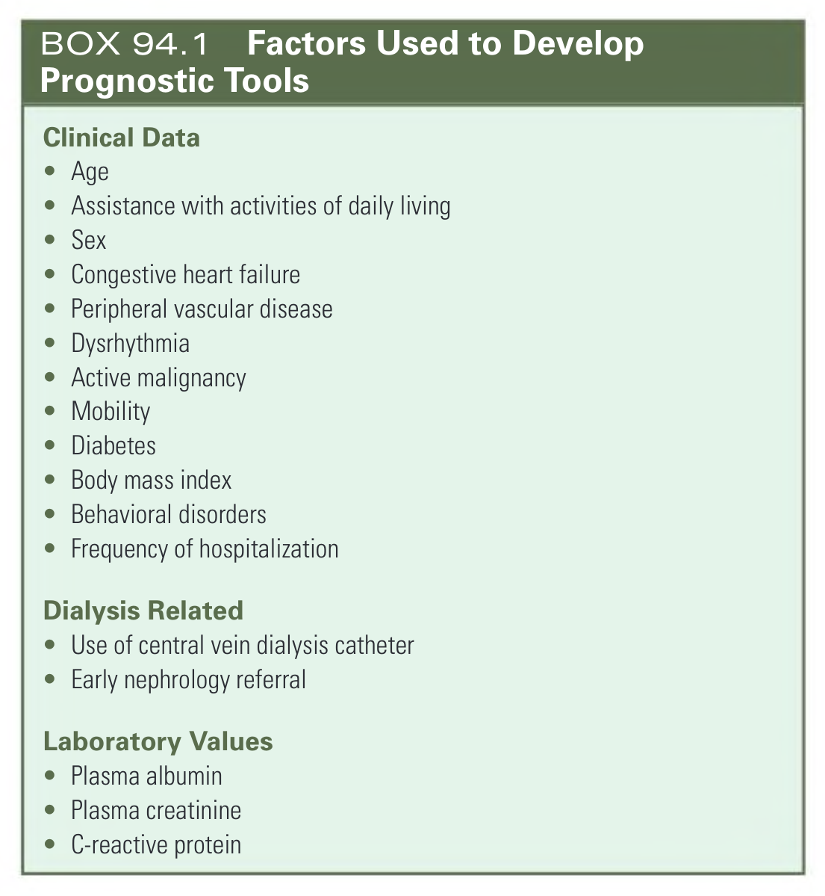
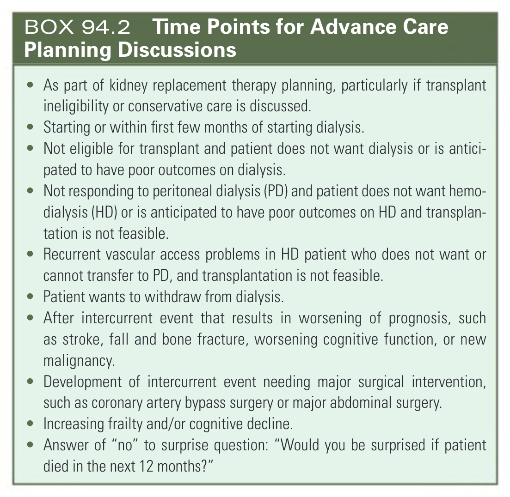
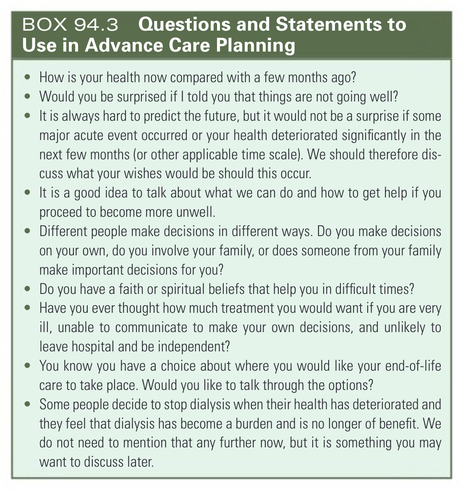
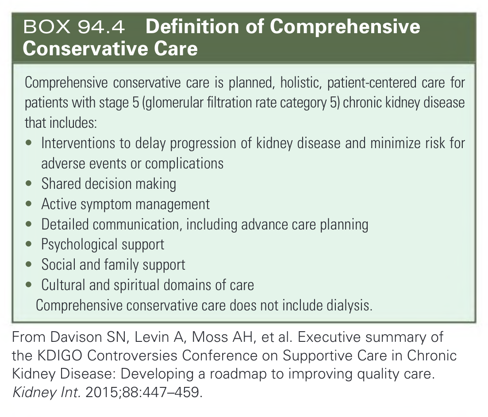
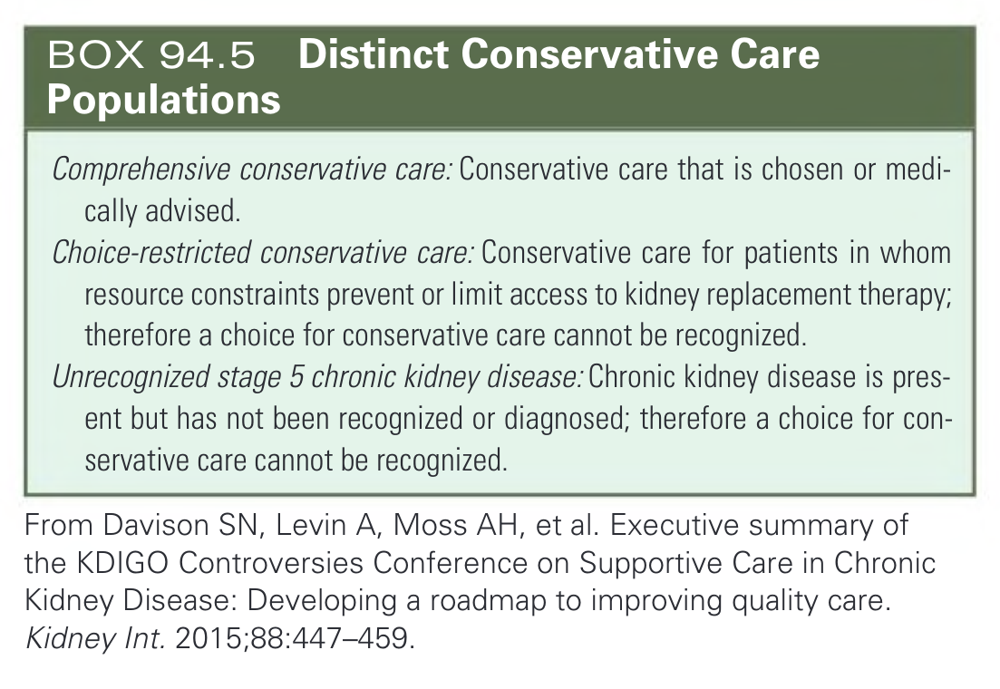
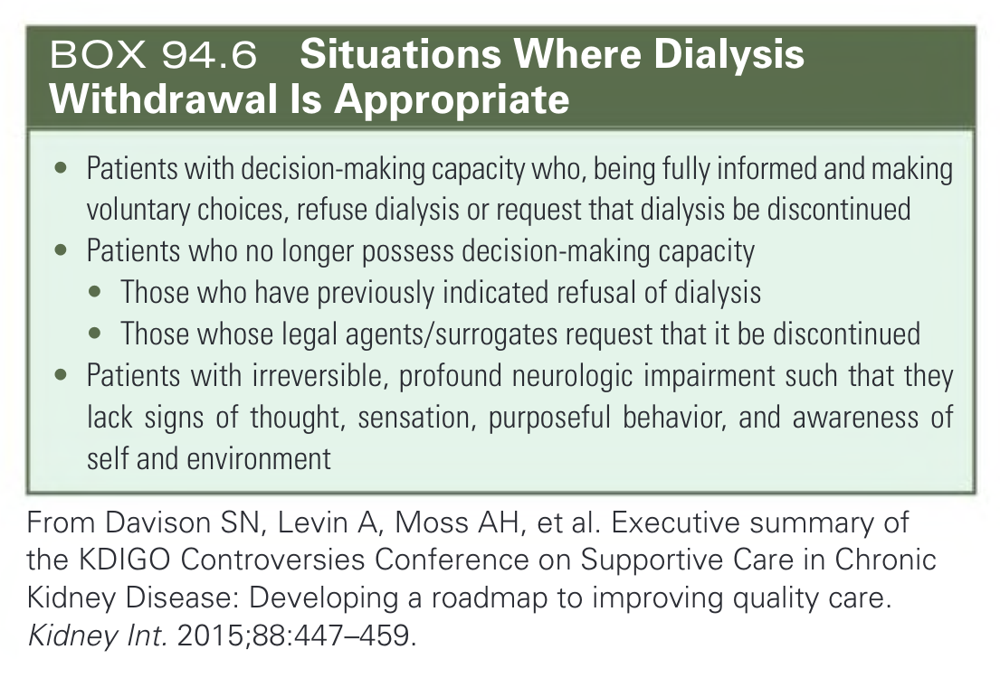

# 094. Palliative Nephrology - Figures and Tables Index

This document lists all figures, tables and boxes extracted from `094. Palliative Nephrology.pdf`.

## Table of Contents
- [Figures](#figures)
- [Tables](#tables)
- [Boxes](#boxes)

---

## Figures

### Fig_94_1



Fig. 94.1 Schematic diagram of how supportive care fits into patient pathway with advanced kidney disease.

---

### Fig_94_2



Fig. 94.2 Use of supportive care at different time points in life with advanced kidney disease.

---

### Fig_94_3



Fig. 94.3 How Communication and Aadvance Care Planning Can Influence Patient Outcomes. Scenario 1: First discussion with family at time of major stroke 5 years after starting dialysis. Scenario 2: Discussions throughout time span on dialysis. APD, Ambulatory peritoneal dialysis; CAPD, continuous ambulatory peritoneal dialysis; CT, computed tomography; EEG, electroencephalogram; PD, peritoneal dialysis.

---

## Tables

### Table_94_1

#### Table Image



#### Table Data (CSV: [Table_94_1.csv](Table_94_1.csv))

```markdown
| Score | Definition |
| :--- | :--- |
| 1 | Very fit: Robust, active, energetic, well-motivated and fit |
| 2 | Well: No active disease but less fit than people in category 1 |
| 3 | Well, with treated comorbid disease: Disease symptoms are well controlled compared with category 4 |
| 4 | Apparently vulnerable: Although not frankly dependent, commonly complain of being "slowed up" |
| 5 | Mildly frail: With limited dependence on others for instrumental activities of daily living |
| 6 | Moderately frail: Help is needed with both instrumental and noninstrumental activities of daily living |
| 7 | Severely frail: Completely dependent on others for the activities of daily living or terminally ill |
From Clegg A, Young J, Iliffe S, et al. Frailty in elderly people. Lancet. 2013;381:752-762.
```

TABLE 94.1 Clinical Frailty Scale

---

## Boxes

### Box_94_1



#### Box Text

```markdown
**Clinical Data**
* Age
* Assistance with activities of daily living
* Sex
* Congestive heart failure
* Peripheral vascular disease
* Dysrhythmia
* Active malignancy
* Mobility
* Diabetes
* Body mass index
* Behavioral disorders
* Frequency of hospitalization

**Dialysis Related**
* Use of central vein dialysis catheter
* Early nephrology referral

**Laboratory Values**
* Plasma albumin
* Plasma creatinine
* C-reactive protein
```

BOX 94.1 Factors Used to Develop Prognostic Tools

---

### Box_94_2



#### Box Text

```markdown
* As part of kidney replacement therapy planning, particularly if transplant ineligibility or conservative care is discussed.
* Starting or within first few months of starting dialysis.
* Not eligible for transplant and patient does not want dialysis or is anticipated to have poor outcomes on dialysis.
* Not responding to peritoneal dialysis (PD) and patient does not want hemodialysis (HD) or is anticipated to have poor outcomes on HD and transplantation is not feasible.
* Recurrent vascular access problems in HD patient who does not want or cannot transfer to PD, and transplantation is not feasible.
* Patient wants to withdraw from dialysis.
* After intercurrent event that results in worsening of prognosis, such as stroke, fall and bone fracture, worsening cognitive function, or new malignancy.
* Development of intercurrent event needing major surgical intervention, such as coronary artery bypass surgery or major abdominal surgery.
* Increasing frailty and/or cognitive decline.
* Answer of "no" to surprise question: "Would you be surprised if patient died in the next 12 months?"
```

BOX 94.2 Time Points for Advance Care Planning Discussions

---

### Box_94_3



#### Box Text

```markdown
* How is your health now compared with a few months ago?
* Would you be surprised if I told you that things are not going well?
* It is always hard to predict the future, but it would not be a surprise if some major acute event occurred or your health deteriorated significantly in the next few months (or other applicable time scale). We should therefore discuss what your wishes would be should this occur.
* It is a good idea to talk about what we can do and how to get help if you proceed to become more unwell.
* Different people make decisions in different ways. Do you make decisions on your own, do you involve your family, or does someone from your family make important decisions for you?
* Do you have a faith or spiritual beliefs that help you in difficult times?
* Have you ever thought how much treatment you would want if you are very ill, unable to communicate to make your own decisions, and unlikely to leave hospital and be independent?
* You know you have a choice about where you would like your end-of-life care to take place. Would you like to talk through the options?
* Some people decide to stop dialysis when their health has deteriorated and they feel that dialysis has become a burden and is no longer of benefit. We do not need to mention that any further now, but it is something you may want to discuss later.
```

BOX 94.3 Questions and Statements to Use in Advance Care Planning

---

### Box_94_4



#### Box Text

```markdown
Comprehensive conservative care is planned, holistic, patient-centered care for patients with stage 5 (glomerular filtration rate category 5) chronic kidney disease that includes:
* Interventions to delay progression of kidney disease and minimize risk for adverse events or complications
* Shared decision making
* Active symptom management
* Detailed communication, including advance care planning
* Psychological support
* Social and family support
* Cultural and spiritual domains of care
Comprehensive conservative care does not include dialysis.
From Davison SN, Levin A, Moss AH, et al. Executive summary of the KDIGO Controversies Conference on Supportive Care in Chronic Kidney Disease: Developing a roadmap to improving quality care. Kidney Int. 2015;88:447-459.
```

BOX 94.4 Definition of Comprehensive Conservative Care

---

### Box_94_5



#### Box Text

```markdown
Comprehensive conservative care: Conservative care that is chosen or medically advised.
Choice-restricted conservative care: Conservative care for patients in whom resource constraints prevent or limit access to kidney replacement therapy; therefore a choice for conservative care cannot be recognized.
Unrecognized stage 5 chronic kidney disease: Chronic kidney disease is present but has not been recognized or diagnosed; therefore a choice for conservative care cannot be recognized.
From Davison SN, Levin A, Moss AH, et al. Executive summary of the KDIGO Controversies Conference on Supportive Care in Chronic Kidney Disease: Developing a roadmap to improving quality care. Kidney Int. 2015;88:447-459.
```

BOX 94.5 Distinct Conservative Care Populations

---

### Box_94_6



#### Box Text

```markdown
* Patients with decision-making capacity who, being fully informed and making voluntary choices, refuse dialysis or request that dialysis be discontinued
* Patients who no longer possess decision-making capacity
* Those who have previously indicated refusal of dialysis
* Those whose legal agents/surrogates request that it be discontinued
* Patients with irreversible, profound neurologic impairment such that they lack signs of thought, sensation, purposeful behavior, and awareness of self and environment
From Davison SN, Levin A, Moss AH, et al. Executive summary of the KDIGO Controversies Conference on Supportive Care in Chronic Kidney Disease: Developing a roadmap to improving quality care. Kidney Int. 2015;88:447-459.
```

BOX 94.6 Situations Where Dialysis Withdrawal Is Appropriate

---
