# 095. Approach to Kidney Replacement Therapy - Figures and Tables Index

This document lists all figures, tables and boxes extracted from `095. Approach to Kidney Replacement Therapy.pdf`.

## Table of Contents
- [Figures](#figures)
- [Tables](#tables)
- [Boxes](#boxes)

---

## Figures

### Fig_95_1

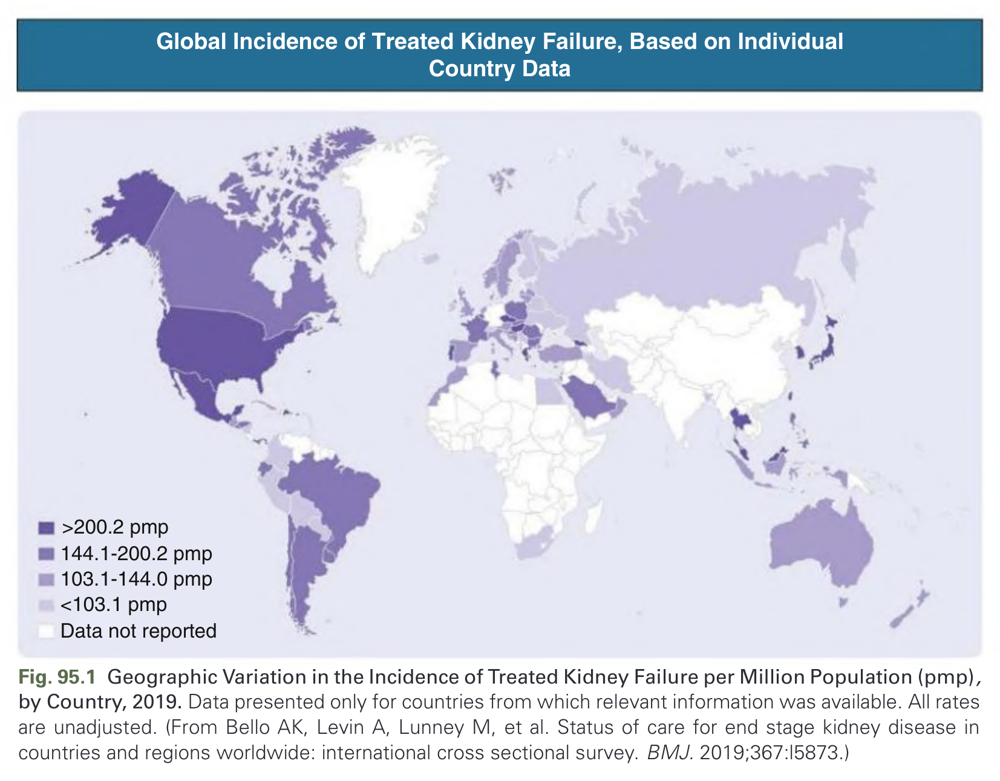

Fig. 95.1 Geographic Variation in the Incidence of Treated Kidney Failure per Million Population (pmp), by Country, 2019. Data presented only for countries from which relevant information was available. All rates are unadjusted. (From Bello AK, Levin A, Lunney M, et al. Status of care for end stage kidney disease in countries and regions worldwide: international cross sectional survey. BMJ. 2019;367:l5873.)

---

### Fig_95_2

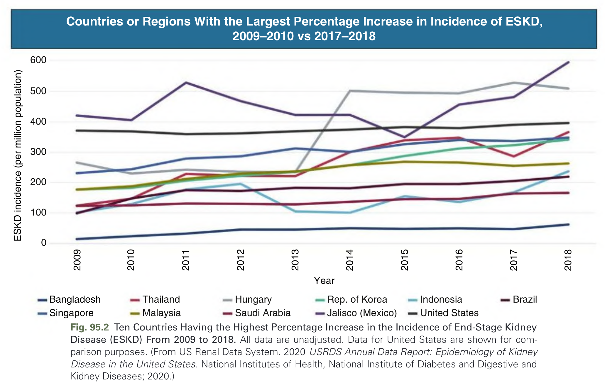

Fig. 95.2 Ten Countries Having the Highest Percentage Increase in the Incidence of End-Stage Kidney Disease (ESKD) From 2009 to 2018. All data are unadjusted. Data for United States are shown for comparison purposes. (From US Renal Data System. 2020 USRDS Annual Data Report: Epidemiology of Kidney Disease in the United States. National Institutes of Health, National Institute of Diabetes and Digestive and Kidney Diseases; 2020.)

---

### Fig_95_3

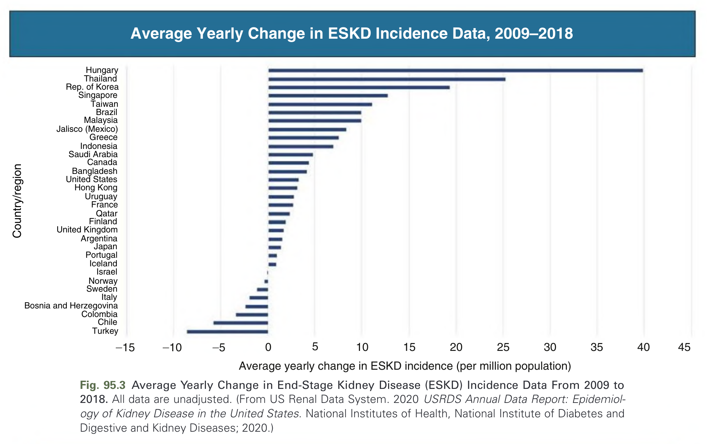

Fig. 95.3 Average Yearly Change in End-Stage Kidney Disease (ESKD) Incidence Data From 2009 to 2018. All data are unadjusted. (From US Renal Data System. 2020 USRDS Annual Data Report: Epidemiology of Kidney Disease in the United States. National Institutes of Health, National Institute of Diabetes and Digestive and Kidney Diseases; 2020.)

---

### Fig_95_4

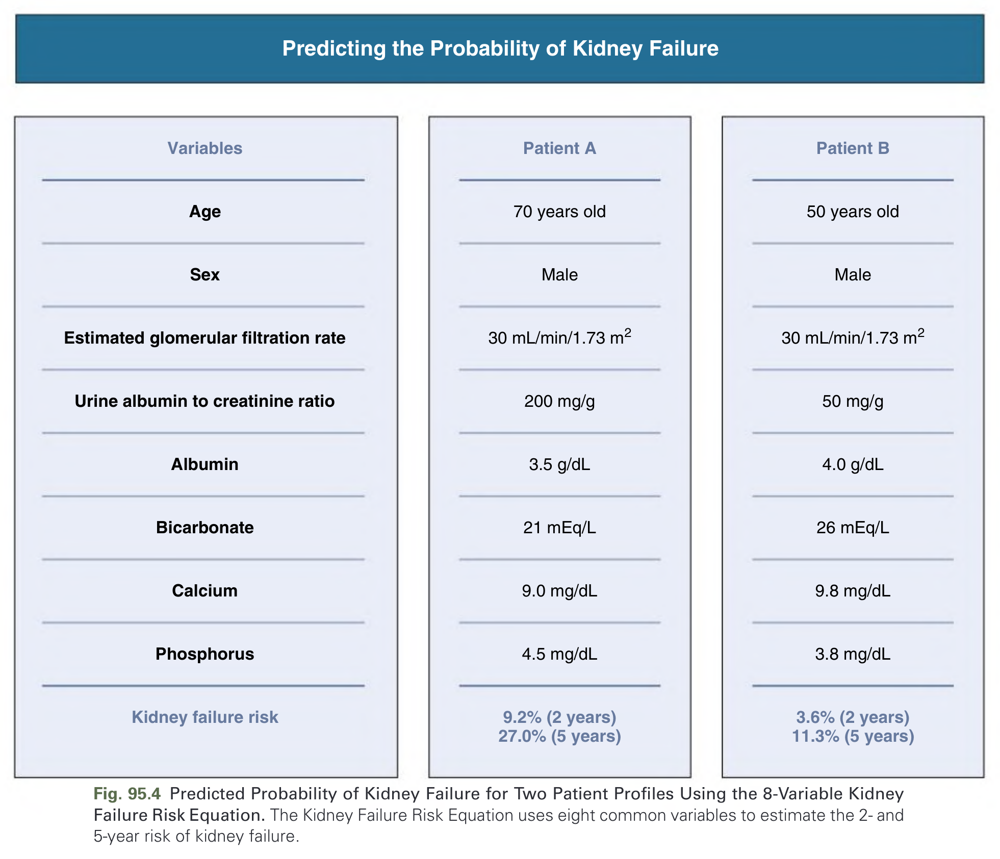

Fig. 95.4 Predicted Probability of Kidney Failure for Two Patient Profiles Using the 8-Variable Kidney Failure Risk Equation. The Kidney Failure Risk Equation uses eight common variables to estimate the 2- and 5-year risk of kidney failure.

---

### Fig_95_5

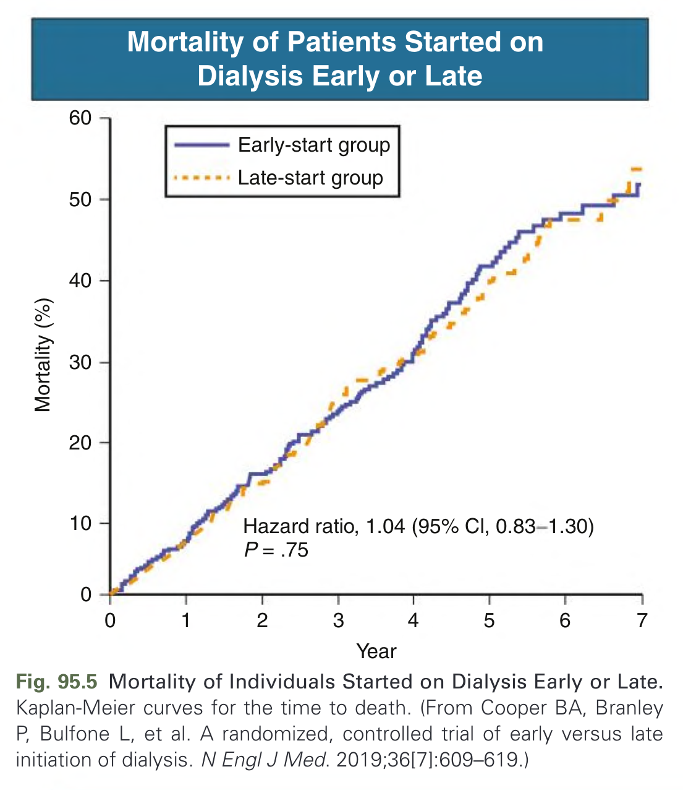

Fig. 95.5 Mortality of Individuals Started on Dialysis Early or Late. Kaplan-Meier curves for the time to death. (From Cooper BA, Branley P, Bulfone L, et al. A randomized, controlled trial of early versus late initiation of dialysis. N Engl J Med. 2019;36[7]:609–619.)

---

### Fig_95_6

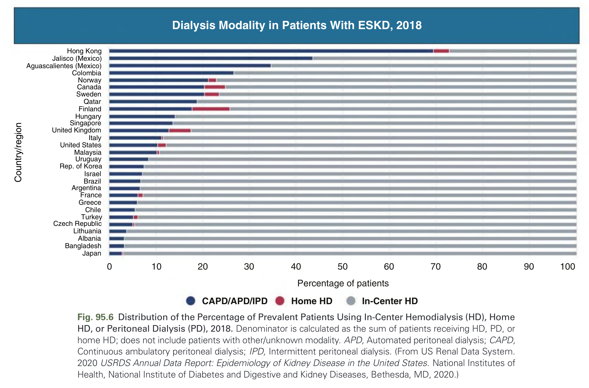

Fig. 95.6 Distribution of the Percentage of Prevalent Patients Using In-Center Hemodialysis (HD), Home HD, or Peritoneal Dialysis (PD), 2018. Denominator is calculated as the sum of patients receiving HD, PD, or home HD; does not include patients with other/unknown modality. APD, Automated peritoneal dialysis; CAPD, Continuous ambulatory peritoneal dialysis; IPD, Intermittent peritoneal dialysis. (From US Renal Data System. 2020 USRDS Annual Data Report: Epidemiology of Kidney Disease in the United States. National Institutes of Health, National Institute of Diabetes and Digestive and Kidney Diseases, Bethesda, MD, 2020.)

---

### Fig_95_7

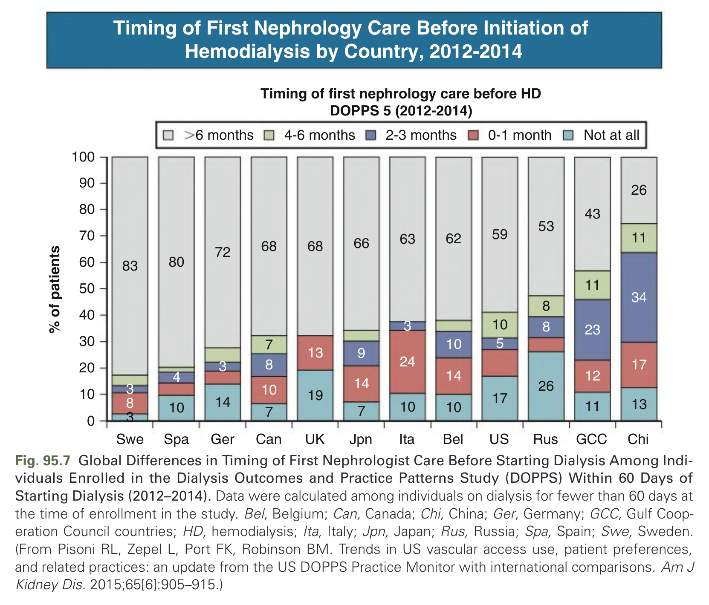

Fig. 95.7 Global Differences in Timing of First Nephrologist Care Before Starting Dialysis Among Individuals Enrolled in the Dialysis Outcomes and Practice Patterns Study (DOPPS) Within 60 Days of Starting Dialysis (2012–2014). Data were calculated among individuals on dialysis for fewer than 60 days at the time of enrollment in the study. Bel, Belgium; Can, Canada; Chi, China; Ger, Germany; GCC, Gulf Cooperation Council countries; HD, hemodialysis; Ita, Italy; Jpn, Japan; Rus, Russia; Spa, Spain; Swe, Sweden. (From Pisoni RL, Zepel L, Port FK, Robinson BM. Trends in US vascular access use, patient preferences, and related practices: an update from the US DOPPS Practice Monitor with international comparisons. Am J Kidney Dis. 2015;65[6]:905–915.)

---

### Fig_95_8

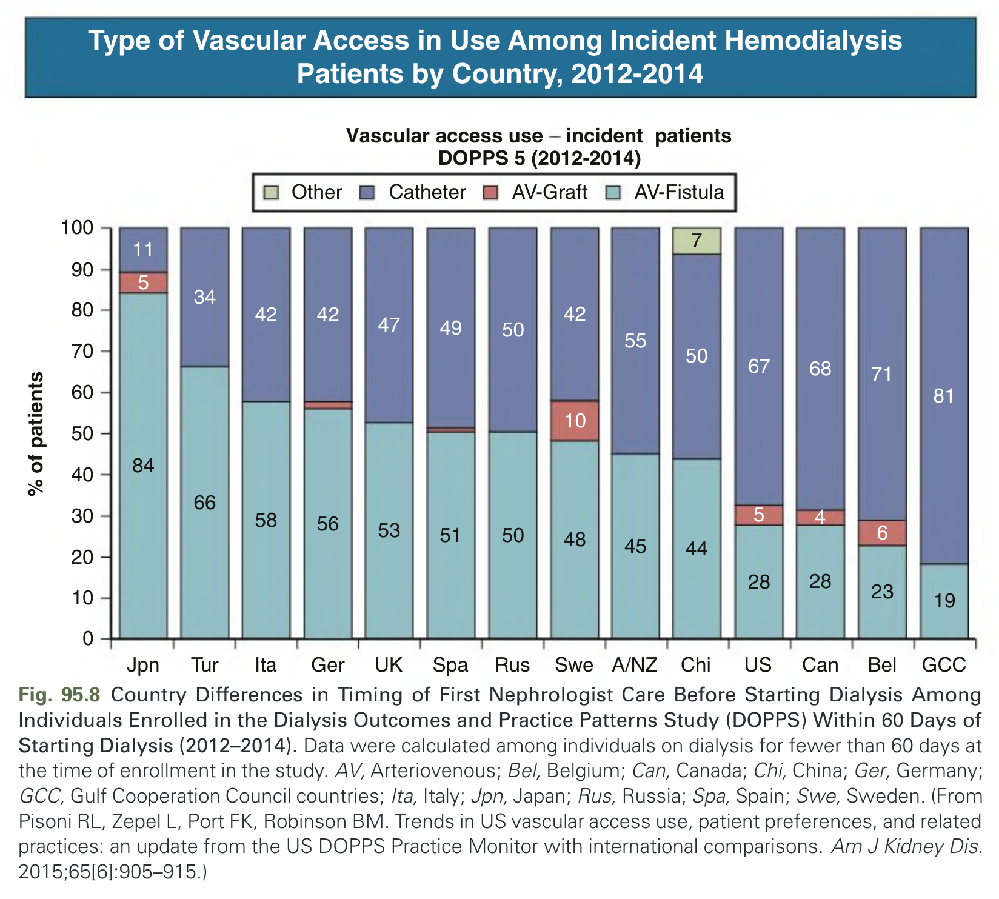

Fig. 95.8 Country Differences in Timing of First Nephrologist Care Before Starting Dialysis Among Individuals Enrolled in the Dialysis Outcomes and Practice Patterns Study (DOPPS) Within 60 Days of Starting Dialysis (2012–2014). Data were calculated among individuals on dialysis for fewer than 60 days at the time of enrollment in the study. AV, Arteriovenous; Bel, Belgium; Can, Canada; Chi, China; Ger, Germany; GCC, Gulf Cooperation Council countries; Ita, Italy; Jpn, Japan; Rus, Russia; Spa, Spain; Swe, Sweden. (From Pisoni RL, Zepel L, Port FK, Robinson BM. Trends in US vascular access use, patient preferences, and related practices: an update from the US DOPPS Practice Monitor with international comparisons. Am J Kidney Dis. 2015;65[6]:905–915.)

---

### Fig_95_9

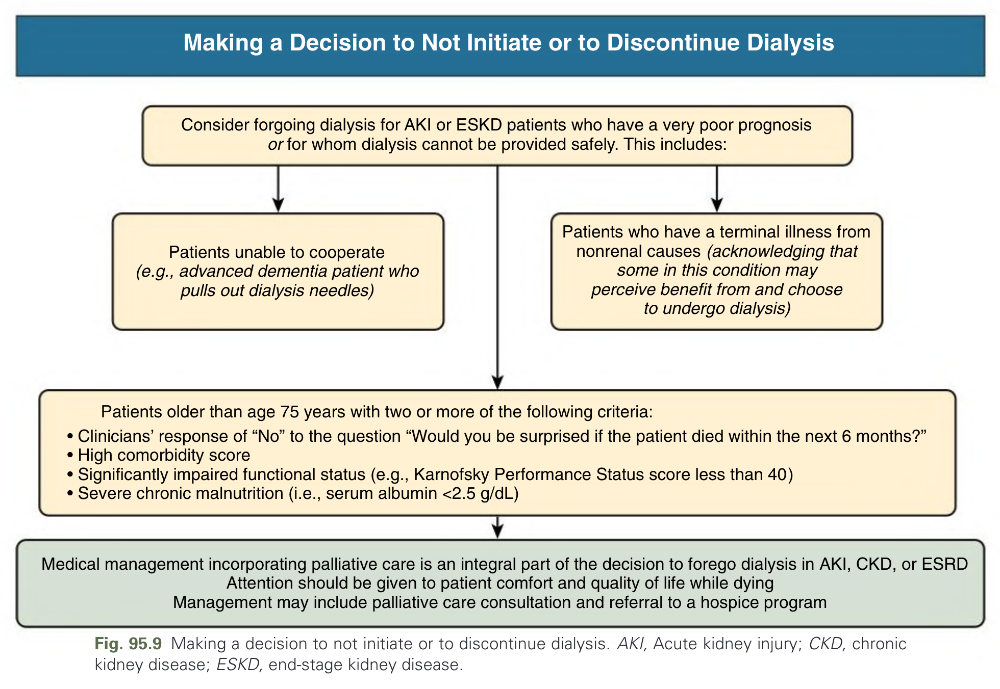

Fig. 95.9 Making a decision to not initiate or to discontinue dialysis. AKI, Acute kidney injury; CKD, chronic kidney disease; ESKD, end-stage kidney disease.

---

### Fig_95_10

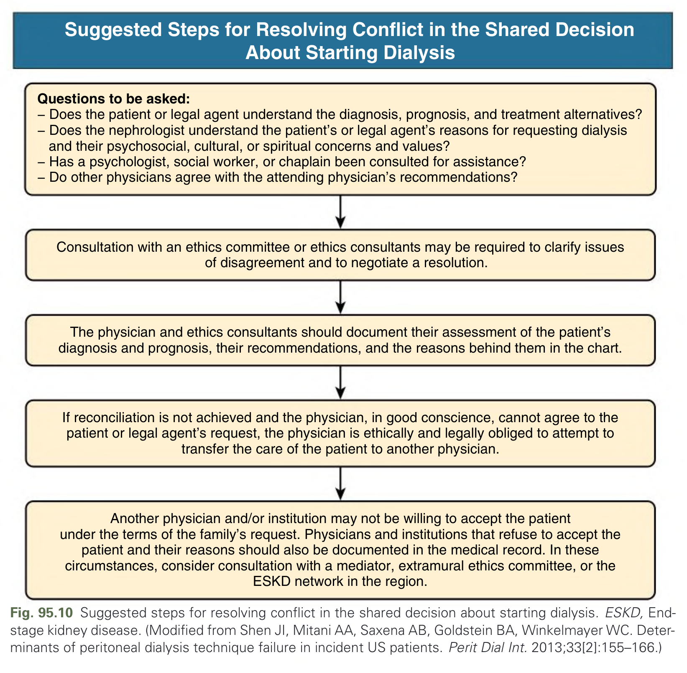

Fig. 95.10 Suggested steps for resolving conflict in the shared decision about starting dialysis. ESKD, End-stage kidney disease. (Modified from Shen JI, Mitani AA, Saxena AB, Goldstein BA, Winkelmayer WC. Determinants of peritoneal dialysis technique failure in incident US patients. Perit Dial Int. 2013;33[2]:155–166.)

---

## Tables

*No tables resolved for this chapter.*

## Boxes

### Box_95_1

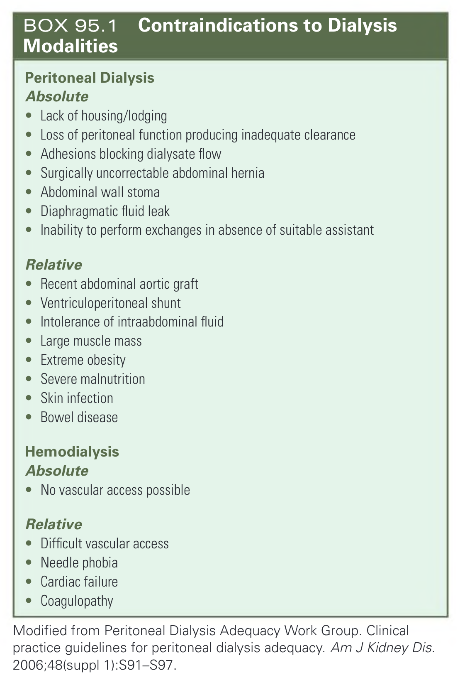

#### Box Text

```markdown
**Peritoneal Dialysis**
**Absolute**
* Lack of housing/lodging
* Loss of peritoneal function producing inadequate clearance
* Adhesions blocking dialysate flow
* Surgically uncorrectable abdominal hernia
* Abdominal wall stoma
* Diaphragmatic fluid leak
* Inability to perform exchanges in absence of suitable assistant
**Relative**
* Recent abdominal aortic graft
* Ventriculoperitoneal shunt
* Intolerance of intraabdominal fluid
* Large muscle mass
* Extreme obesity
* Severe malnutrition
* Skin infection
* Bowel disease
**Hemodialysis**
**Absolute**
* No vascular access possible
**Relative**
* Difficult vascular access
* Needle phobia
* Cardiac failure
* Coagulopathy
Modified from Peritoneal Dialysis Adequacy Work Group. Clinical practice guidelines for peritoneal dialysis adequacy. Am J Kidney Dis. 2006;48(suppl 1):S91-S97.
```

BOX 95.1 Contraindications to Dialysis Modalities

---

### Box_95_2

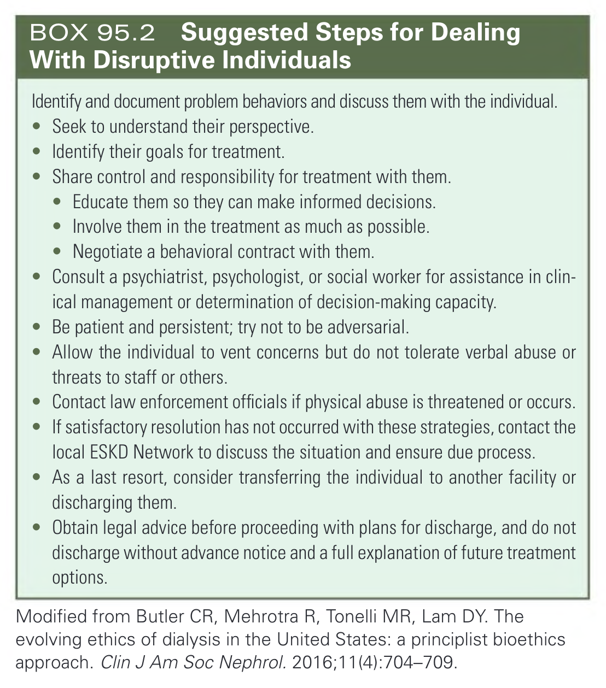

#### Box Text

```markdown
Identify and document problem behaviors and discuss them with the individual.
* Seek to understand their perspective.
* Identify their goals for treatment.
* Share control and responsibility for treatment with them.
* Educate them so they can make informed decisions.
* Involve them in the treatment as much as possible.
* Negotiate a behavioral contract with them.
* Consult a psychiatrist, psychologist, or social worker for assistance in clinical management or determination of decision-making capacity.
* Be patient and persistent; try not to be adversarial.
* Allow the individual to vent concerns but do not tolerate verbal abuse or threats to staff or others.
* Contact law enforcement officials if physical abuse is threatened or occurs.
* If satisfactory resolution has not occurred with these strategies, contact the local ESKD Network to discuss the situation and ensure due process.
* As a last resort, consider transferring the individual to another facility or discharging them.
* Obtain legal advice before proceeding with plans for discharge, and do not discharge without advance notice and a full explanation of future treatment options.
Modified from Butler CR, Mehrotra R, Tonelli MR, Lam DY. The evolving ethics of dialysis in the United States: a principlist bioethics approach. Clin J Am Soc Nephrol. 2016;11(4):704-709.
```

BOX 95.2 Suggested Steps for Dealing With Disruptive Individuals

---

### Box_95_3

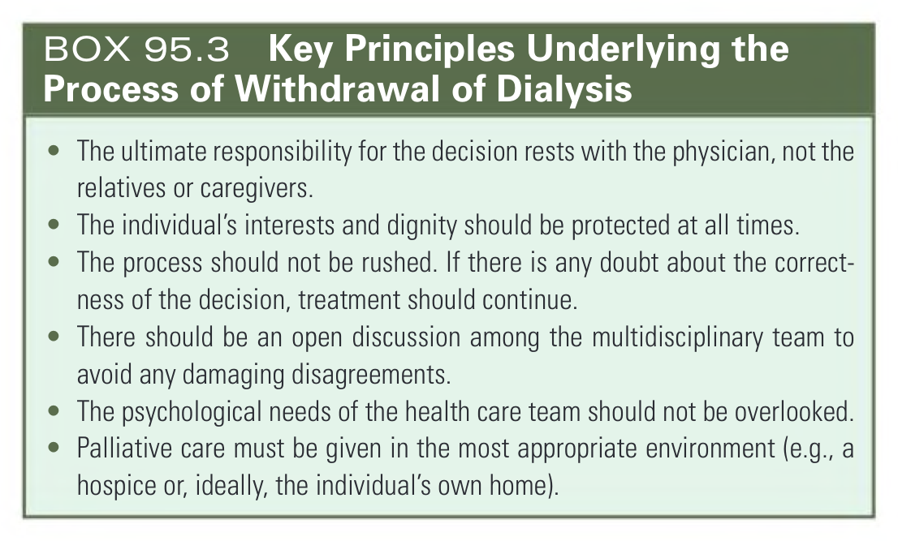

#### Box Text

```markdown
* The ultimate responsibility for the decision rests with the physician, not the relatives or caregivers.
* The individual's interests and dignity should be protected at all times.
* The process should not be rushed. If there is any doubt about the correctness of the decision, treatment should continue.
* There should be an open discussion among the multidisciplinary team to avoid any damaging disagreements.
* The psychological needs of the health care team should not be overlooked.
* Palliative care must be given in the most appropriate environment (e.g., a hospice or, ideally, the individual's own home).
```

BOX 95.3 Key Principles Underlying the Process of Withdrawal of Dialysis

---
