# 096. Vascular Access for Hemodialysis - Figures and Tables Index

This document lists all figures, tables and boxes extracted from `096. Vascular Access for Hemodialysis.pdf`.

## Table of Contents
- [Figures](#figures)
- [Tables](#tables)
- [Boxes](#boxes)

---

## Figures

### Fig_96_1

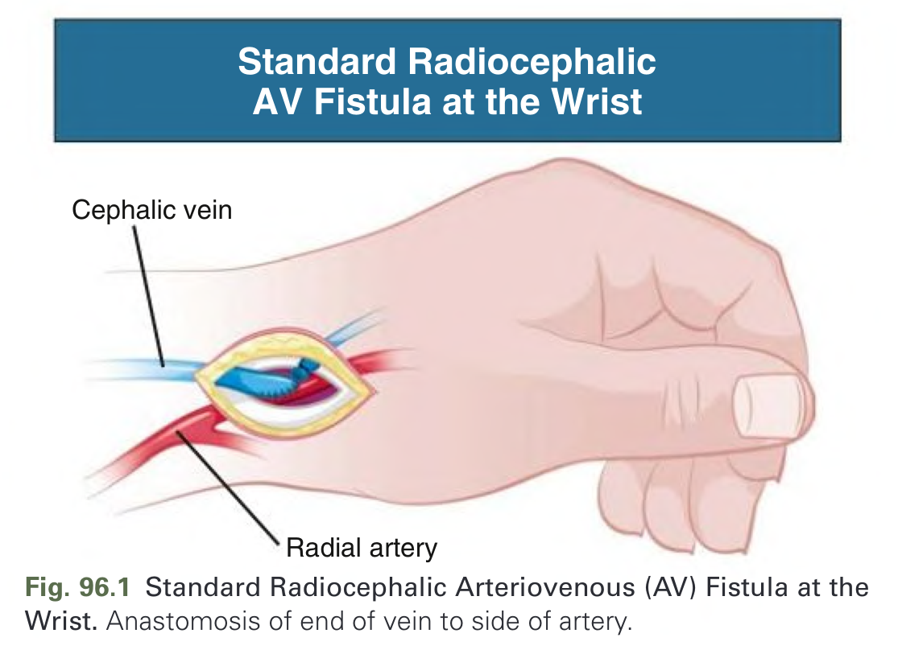

Fig. 96.1 Standard Radiocephalic Arteriovenous (AV) Fistula at the Wrist. Anastomosis of end of vein to side of artery.

---

### Fig_96_2

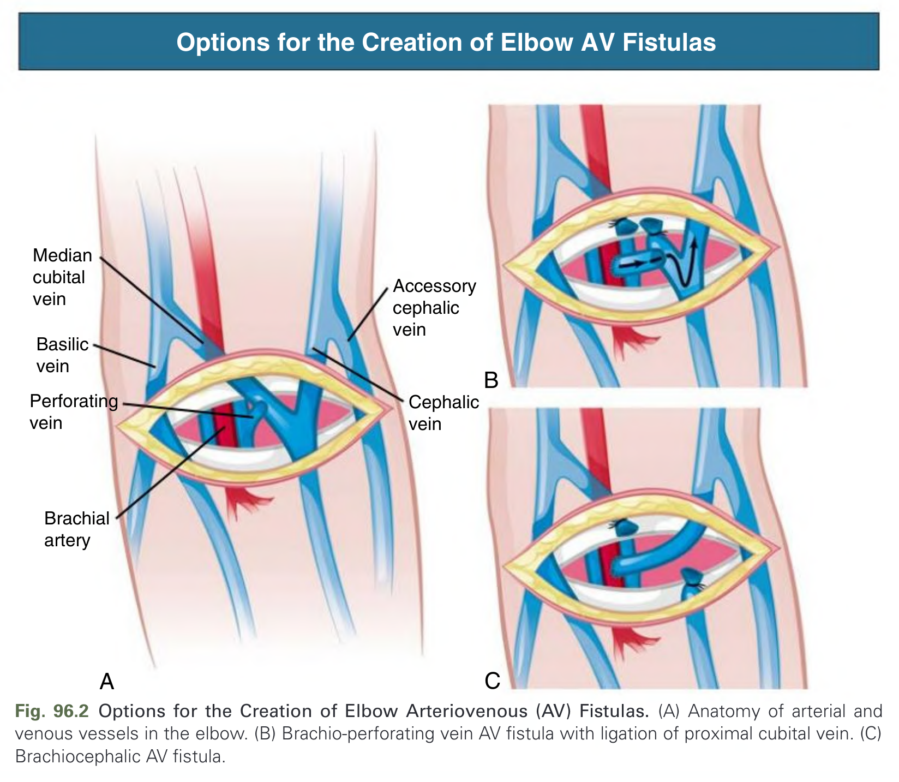

Fig. 96.2 Options for the Creation of Elbow Arteriovenous (AV) Fistulas. (A) Anatomy of arterial and venous vessels in the elbow. (B) Brachio-perforating vein AV fistula with ligation of proximal cubital vein. (C) Brachiocephalic AV fistula.

---

### Fig_96_3

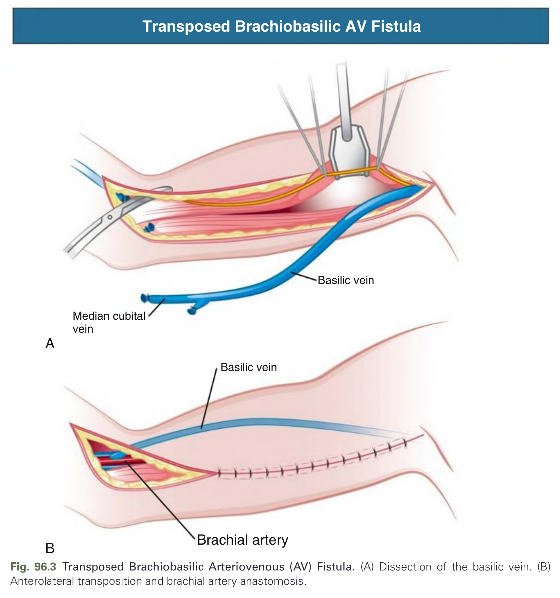

Fig. 96.3 Transposed Brachiobasilic Arteriovenous (AV) Fistula. (A) Dissection of the basilic vein. (B) Anterolateral transposition and brachial artery anastomosis.

---

### Fig_96_4

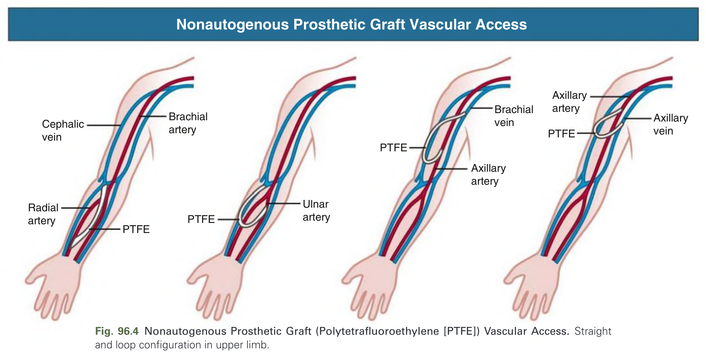

Fig. 96.4 Nonautogenous Prosthetic Graft (Polytetrafluoroethylene [PTFE]) Vascular Access. Straight and loop configuration in upper limb.

---

### Fig_96_5

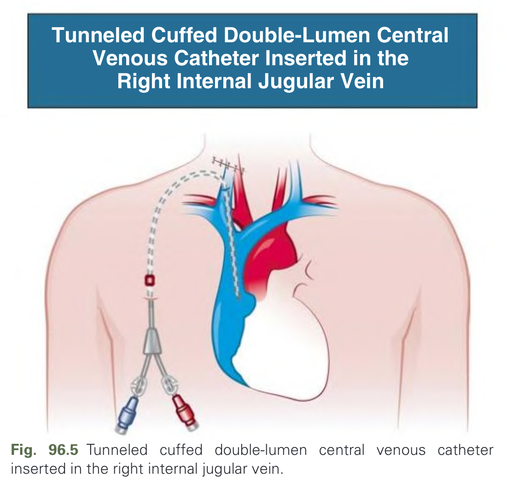

Fig. 96.5 Tunneled cuffed double-lumen central venous catheter inserted in the right internal jugular vein.

---

### Fig_96_6

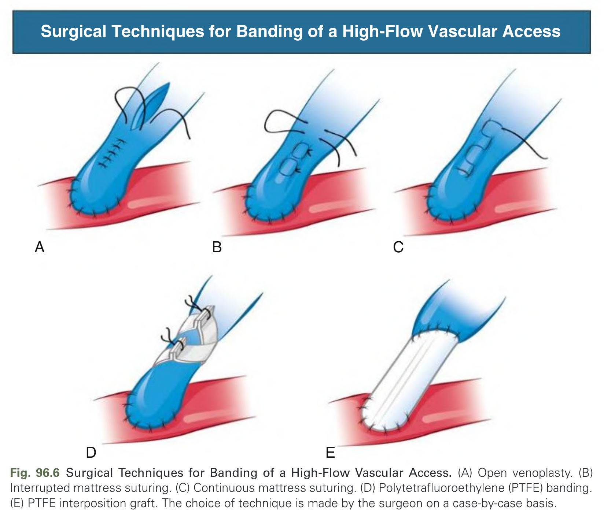

Fig. 96.6 Surgical Techniques for Banding of a High-Flow Vascular Access. (A) Open venoplasty. (B) Interrupted mattress suturing. (C) Continuous mattress suturing. (D) Polytetrafluoroethylene (PTFE) banding. (E) PTFE interposition graft. The choice of technique is made by the surgeon on a case-by-case basis.

---

### Fig_96_7

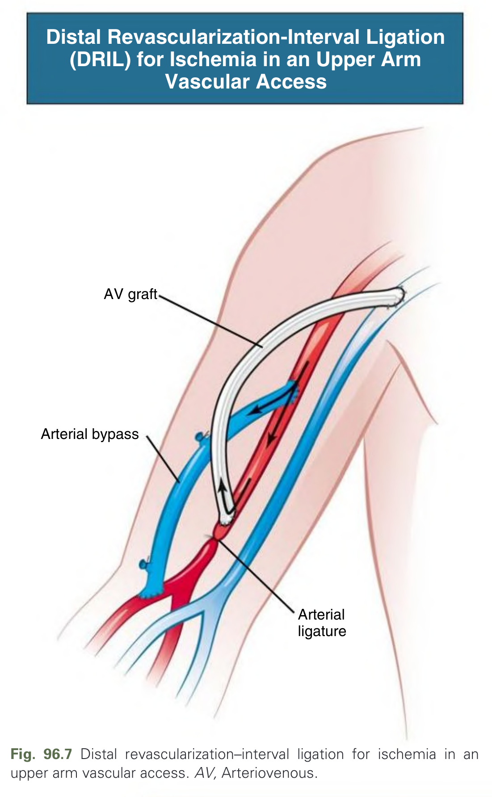

Fig. 96.7 Distal revascularization–interval ligation for ischemia in an upper arm vascular access. AV, Arteriovenous.

---

### Fig_96_8

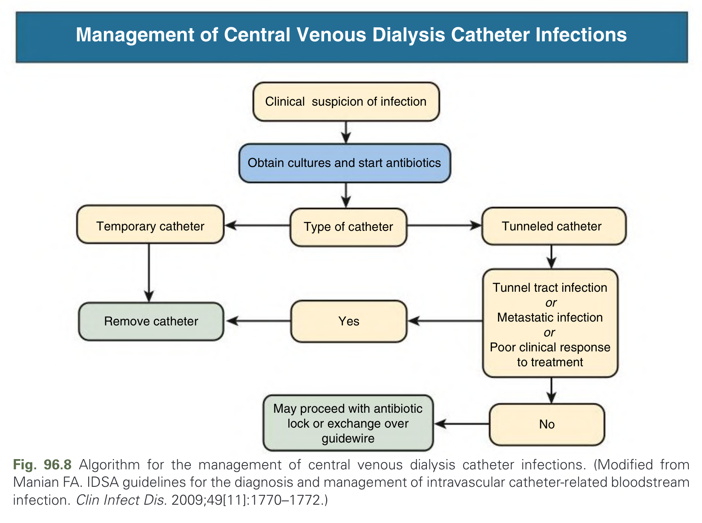

Fig. 96.8 Algorithm for the management of central venous dialysis catheter infections. (Modified from Manian FA. IDSA guidelines for the diagnosis and management of intravascular catheter-related bloodstream infection. Clin Infect Dis. 2009;49[11]:1770–1772.)

---

### Fig_96_9

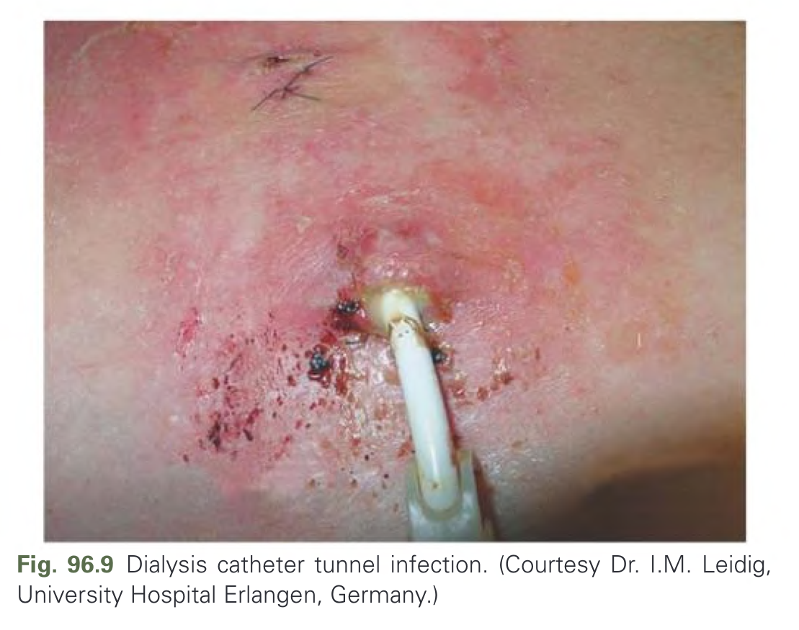

Fig. 96.9 Dialysis catheter tunnel infection. (Courtesy Dr. I.M. Leidig, University Hospital Erlangen, Germany.)

---

## Tables

### Table_96_1

#### Table Image

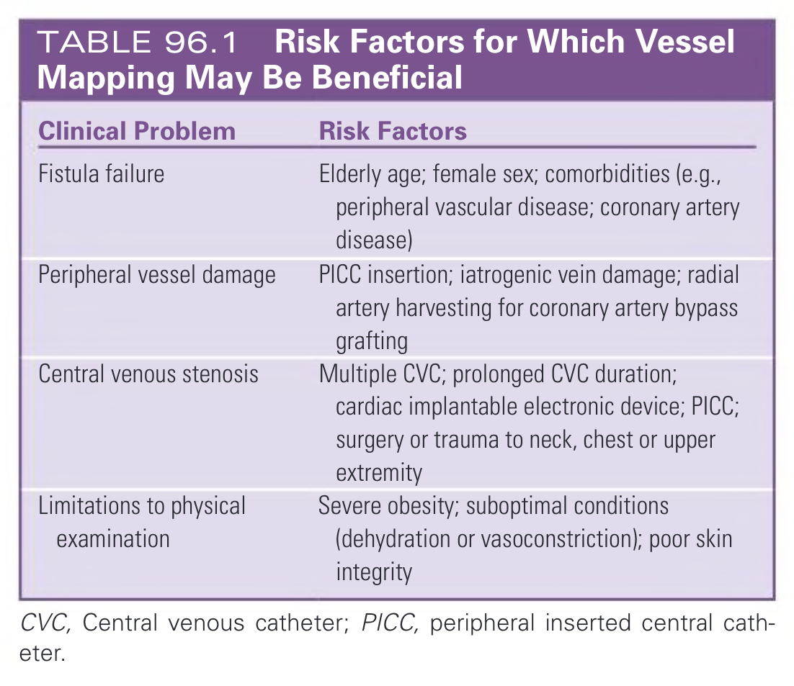

#### Table Data (CSV: [Table_96_1.csv](Table_96_1.csv))

```markdown
| Clinical Problem | Risk Factors |
| :--- | :--- |
| Fistula failure | Elderly age; female sex; comorbidities (e.g., peripheral vascular disease; coronary artery disease) |
| Peripheral vessel damage | PICC insertion; iatrogenic vein damage; radial artery harvesting for coronary artery bypass grafting |
| Central venous stenosis | Multiple CVC; prolonged CVC duration; cardiac implantable electronic device; PICC; surgery or trauma to neck, chest or upper extremity |
| Limitations to physical examination | Severe obesity; suboptimal conditions (dehydration or vasoconstriction); poor skin integrity |
CVC, Central venous catheter; PICC, peripheral inserted central catheter.
```

TABLE 96.1 Risk Factors for Which Vessel Mapping May Be Beneficial

---

### Table_96_2

#### Table Image

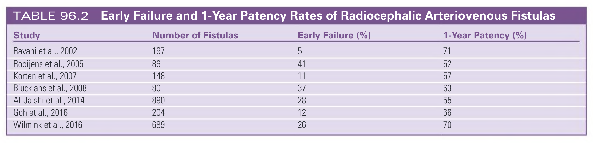

#### Table Data (CSV: [Table_96_2.csv](Table_96_2.csv))

```markdown
| Study | Number of Fistulas | Early Failure (%) | 1-Year Patency (%) |
| :--- | :--- | :--- | :--- |
| Ravani et al., 2002 | 197 | 5 | 71 |
| Rooijens et al., 2005 | 86 | 41 | 52 |
| Korten et al., 2007 | 148 | 11 | 57 |
| Biuckians et al., 2008 | 80 | 37 | 63 |
| Al-Jaishi et al., 2014 | 890 | 28 | 55 |
| Goh et al., 2016 | 204 | 12 | 66 |
| Wilmink et al., 2016 | 689 | 26 | 70 |
```

TABLE 96.2 Early Failure and 1-Year Patency Rates of Radiocephalic Arteriovenous Fistulas

---

### Table_96_3

#### Table Image

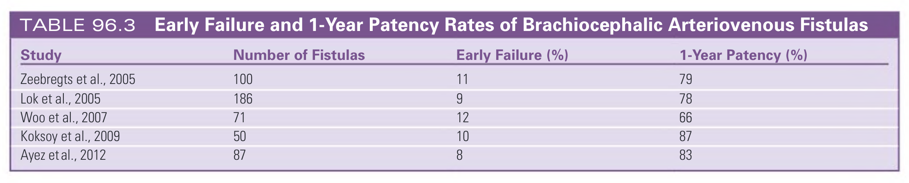

#### Table Data (CSV: [Table_96_3.csv](Table_96_3.csv))

```markdown
| Study | Number of Fistulas | Early Failure (%) | 1-Year Patency (%) |
| :--- | :--- | :--- | :--- |
| Zeebregts et al., 2005 | 100 | 11 | 79 |
| Lok et al., 2005 | 186 | 9 | 78 |
| Woo et al., 2007 | 71 | 12 | 66 |
| Koksoy et al., 2009 | 50 | 10 | 87 |
| Ayez et al., 2012 | 87 | 8 | 83 |
```

TABLE 96.3 Early Failure and 1-Year Patency Rates of Brachiocephalic Arteriovenous Fistulas

---

### Table_96_4

#### Table Image

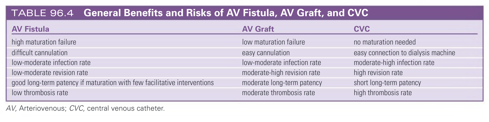

#### Table Data (CSV: [Table_96_4.csv](Table_96_4.csv))

```markdown
| AV Fistula | AV Graft | CVC |
| :--- | :--- | :--- |
| high maturation failure | low maturation failure | no maturation needed |
| difficult cannulation | easy cannulation | easy connection to dialysis machine |
| low-moderate infection rate | low-moderate infection rate | moderate-high infection rate |
| low-moderate revision rate | moderate-high revision rate | high revision rate |
| good long-term patency if maturation with few facilitative interventions | moderate long-term patency | short long-term patency |
| low thrombosis rate | moderate thrombosis rate | high thrombosis rate |
AV, Arteriovenous; CVC, central venous catheter.
```

TABLE 96.4 General Benefits and Risks of AV Fistula, AV Graft, and CVC

---

## Boxes

### Box_96_1

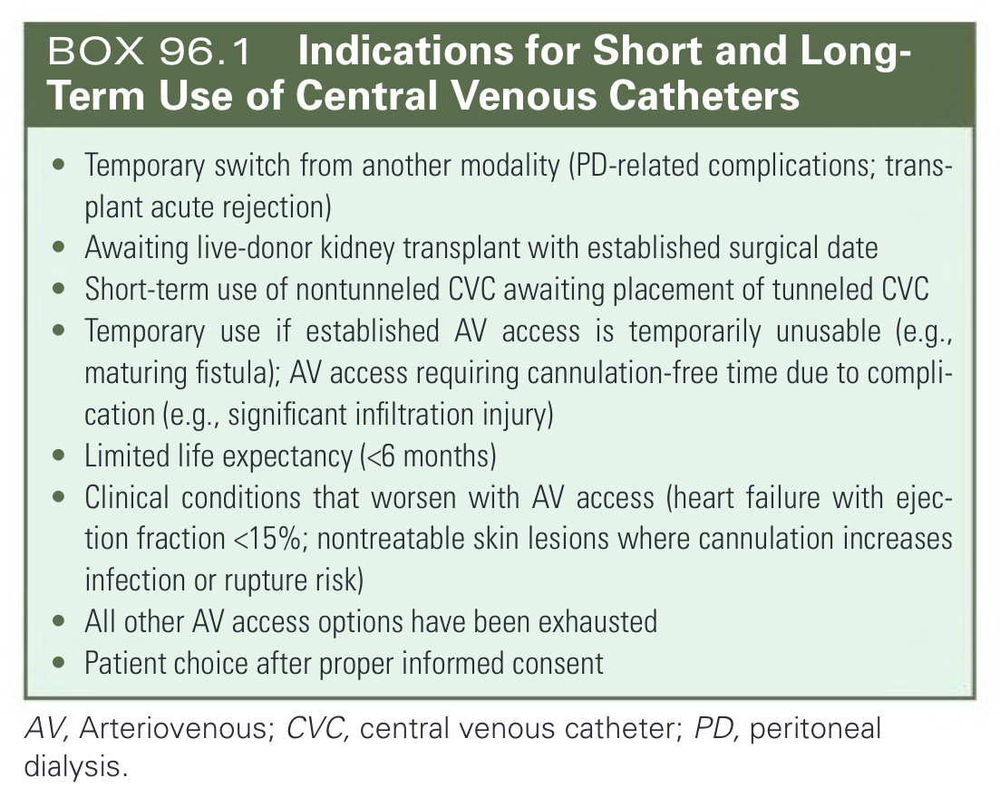

#### Box Text

```markdown
* Temporary switch from another modality (PD-related complications; transplant acute rejection)
* Awaiting live-donor kidney transplant with established surgical date
* Short-term use of nontunneled CVC awaiting placement of tunneled CVC
* Temporary use if established AV access is temporarily unusable (e.g., maturing fistula); AV access requiring cannulation-free time due to complication (e.g., significant infiltration injury)
* Limited life expectancy (<6 months)
* Clinical conditions that worsen with AV access (heart failure with ejection fraction <15%; nontreatable skin lesions where cannulation increases infection or rupture risk)
* All other AV access options have been exhausted
* Patient choice after proper informed consent
AV, Arteriovenous; CVC, central venous catheter; PD, peritoneal dialysis.
```

BOX 96.1 Indications for Short and Long-Term Use of Central Venous Catheters

---

### Box_96_2

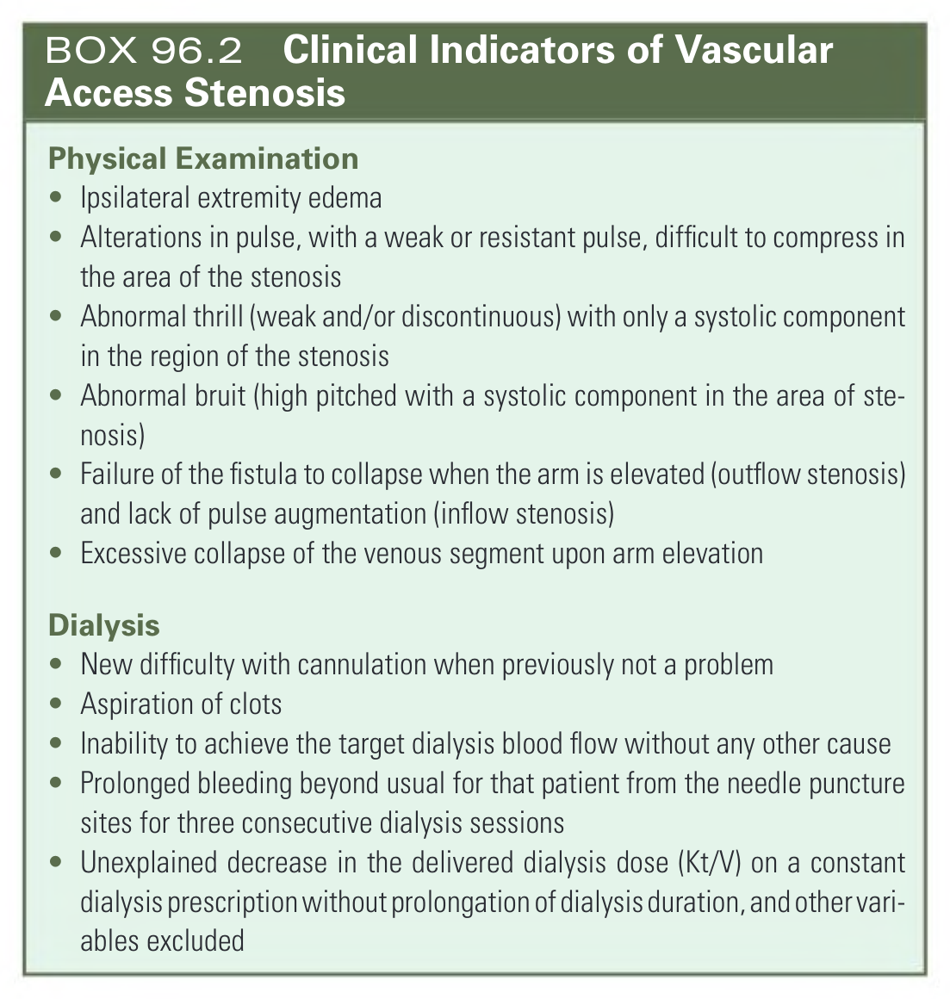

#### Box Text

```markdown
**Physical Examination**
* Ipsilateral extremity edema
* Alterations in pulse, with a weak or resistant pulse, difficult to compress in the area of the stenosis
* Abnormal thrill (weak and/or discontinuous) with only a systolic component in the region of the stenosis
* Abnormal bruit (high pitched with a systolic component in the area of stenosis)
* Failure of the fistula to collapse when the arm is elevated (outflow stenosis) and lack of pulse augmentation (inflow stenosis)
* Excessive collapse of the venous segment upon arm elevation

**Dialysis**
* New difficulty with cannulation when previously not a problem
* Aspiration of clots
* Inability to achieve the target dialysis blood flow without any other cause
* Prolonged bleeding beyond usual for that patient from the needle puncture sites for three consecutive dialysis sessions
* Unexplained decrease in the delivered dialysis dose (Kt/V) on a constant dialysis prescription without prolongation of dialysis duration, and other variables excluded
```

BOX 96.2 Clinical Indicators of Vascular Access Stenosis

---
