# 097. Diagnostic and Interventional Nephrology - Figures and Tables Index

This document lists all figures, tables and boxes extracted from `097. Diagnostic and Interventional Nephrology.pdf`.

## Table of Contents
- [Figures](#figures)
- [Tables](#tables)
- [Boxes](#boxes)

---

## Figures

### Fig_97_1

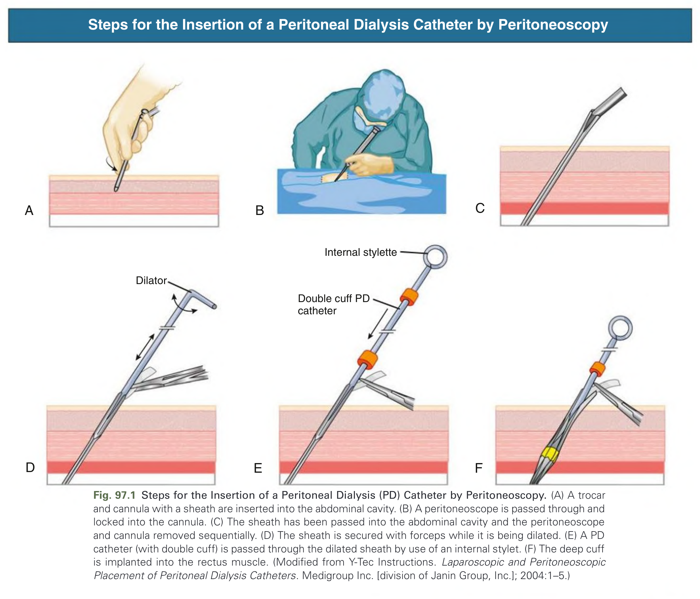

Fig. 97.1 Steps for the Insertion of a Peritoneal Dialysis (PD) Catheter by Peritoneoscopy. (A) A trocar and cannula with a sheath are inserted into the abdominal cavity. (B) A peritoneoscope is passed through and locked into the cannula. (C) The sheath has been passed into the abdominal cavity and the peritoneoscope and cannula removed sequentially. (D) The sheath is secured with forceps while it is being dilated. (E) A PD catheter (with double cuff) is passed through the dilated sheath by use of an internal stylet. (F) The deep cuff is implanted into the rectus muscle. (Modified from Y-Tec Instructions. Laparoscopic and Peritoneoscopic Placement of Peritoneal Dialysis Catheters. Medigroup Inc. [division of Janin Group, Inc.]; 2004:1–5.)

---

### Fig_97_2

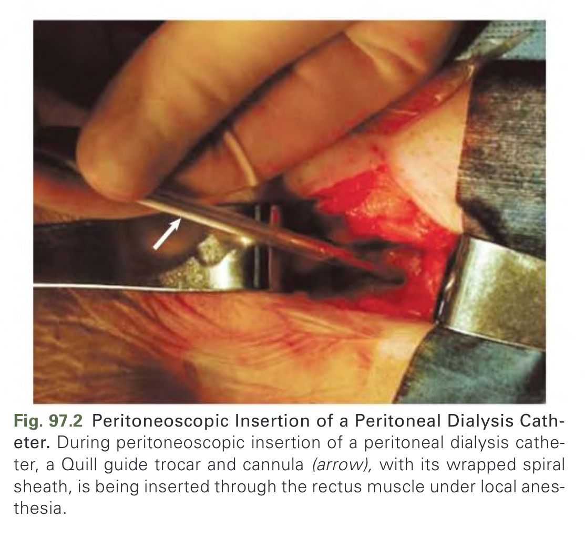

Fig. 97.2 Peritoneoscopic Insertion of a Peritoneal Dialysis Catheter. During peritoneoscopic insertion of a peritoneal dialysis catheter, a Quill guide trocar and cannula (arrow), with its wrapped spiral sheath, is being inserted through the rectus muscle under local anesthesia.

---

### Fig_97_3

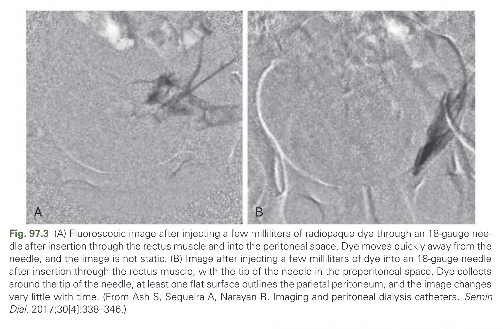

Fig. 97.3 (A) Fluoroscopic image after injecting a few milliliters of radiopaque dye through an 18-gauge needle after insertion through the rectus muscle and into the peritoneal space. Dye moves quickly away from the needle, and the image is not static. (B) Image after injecting a few milliliters of dye into an 18-gauge needle after insertion through the rectus muscle, with the tip of the needle in the preperitoneal space. Dye collects around the tip of the needle, at least one flat surface outlines the parietal peritoneum, and the image changes very little with time. (From Ash S, Sequeira A, Narayan R. Imaging and peritoneal dialysis catheters. Semin Dial. 2017;30[4]:338–346.)

---

### Fig_97_4

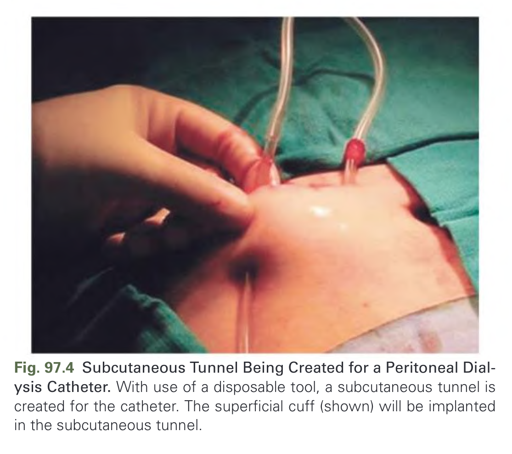

Fig. 97.4 Subcutaneous Tunnel Being Created for a Peritoneal Dialysis Catheter. With use of a disposable tool, a subcutaneous tunnel is created for the catheter. The superficial cuff (shown) will be implanted in the subcutaneous tunnel.

---

### Fig_97_5

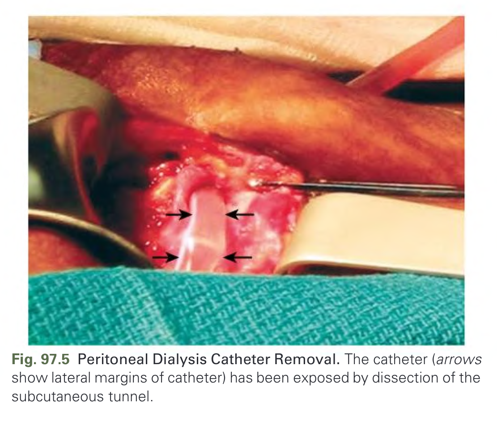

Fig. 97.5 Peritoneal Dialysis Catheter Removal. The catheter (arrows show lateral margins of catheter) has been exposed by dissection of the subcutaneous tunnel.

---

### Fig_97_6

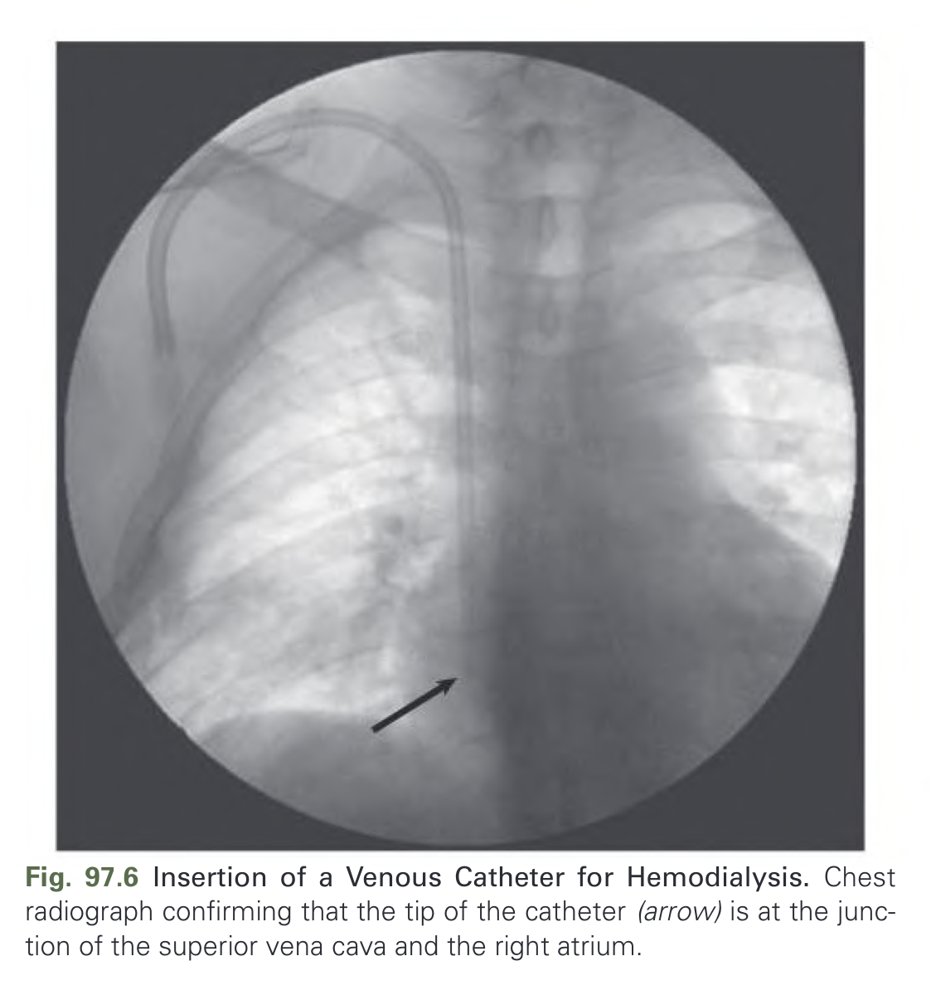

Fig. 97.6 Insertion of a Venous Catheter for Hemodialysis. Chest radiograph confirming that the tip of the catheter (arrow) is at the junction of the superior vena cava and the right atrium.

---

### Fig_97_7

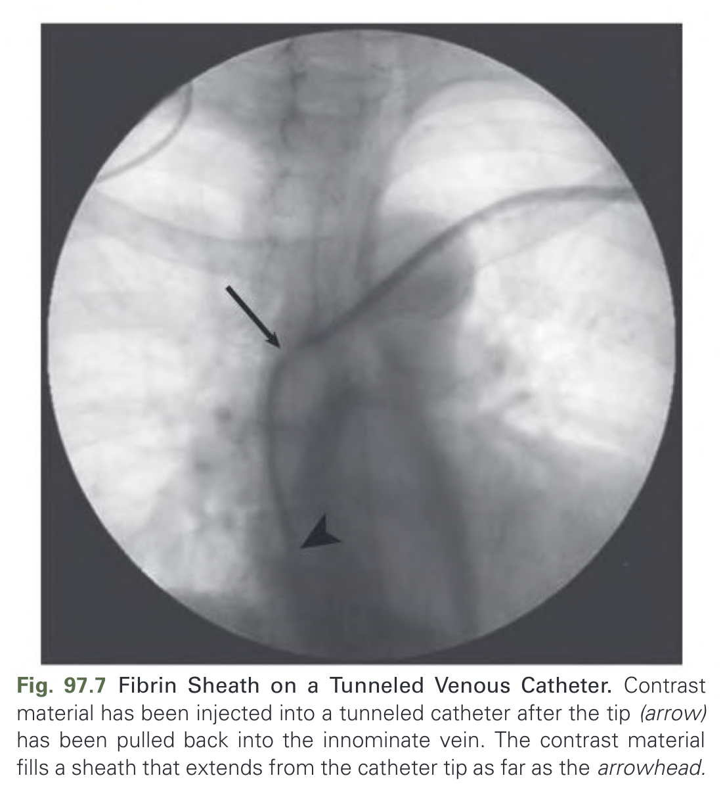

Fig. 97.7 Fibrin Sheath on a Tunneled Venous Catheter. Contrast material has been injected into a tunneled catheter after the tip (arrow) has been pulled back into the innominate vein. The contrast material fills a sheath that extends from the catheter tip as far as the arrowhead.

---

### Fig_97_8

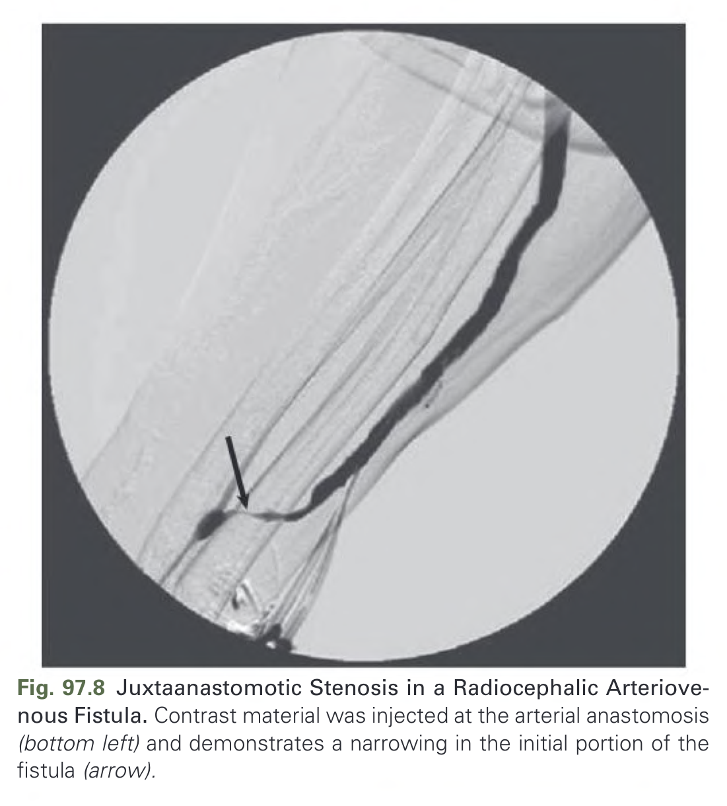

Fig. 97.8 Juxtaanastomotic Stenosis in a Radiocephalic Arteriovenous Fistula. Contrast material was injected at the arterial anastomosis (bottom left) and demonstrates a narrowing in the initial portion of the fistula (arrow).

---

### Fig_97_9

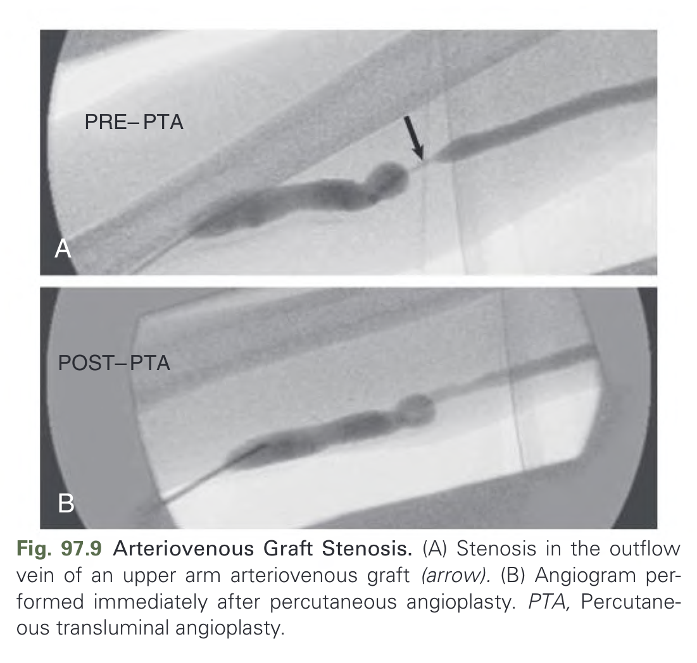

Fig. 97.9 Arteriovenous Graft Stenosis. (A) Stenosis in the outflow vein of an upper arm arteriovenous graft (arrow). (B) Angiogram performed immediately after percutaneous angioplasty. PTA, Percutaneous transluminal angioplasty.

---

### Fig_97_10

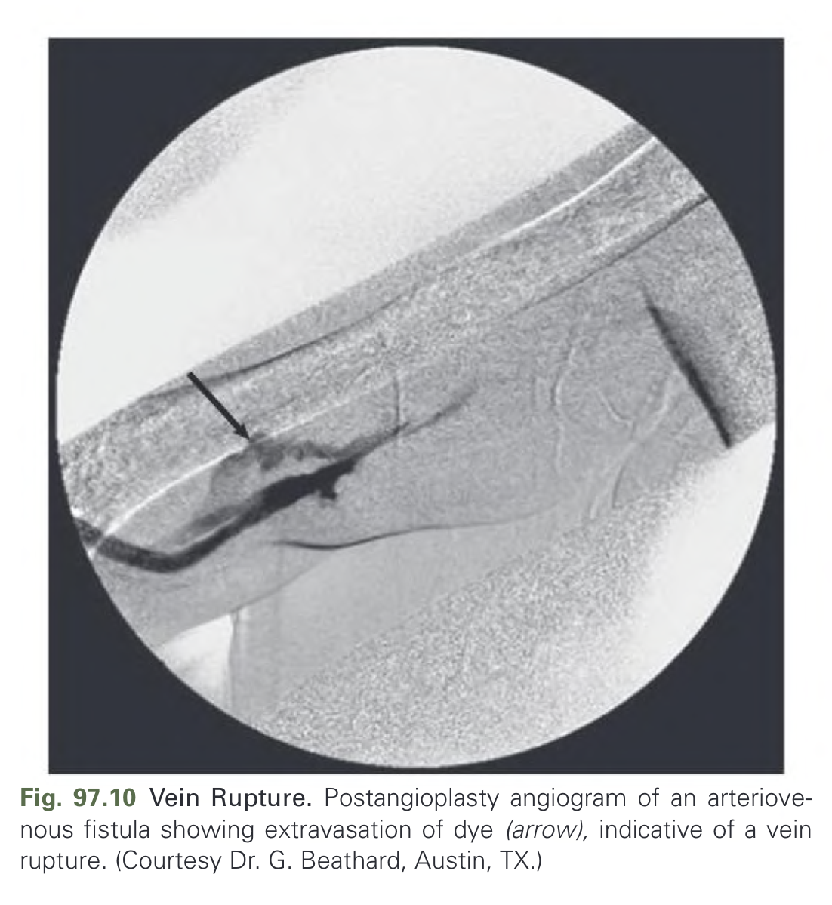

Fig. 97.10 Vein Rupture. Postangioplasty angiogram of an arteriovenous fistula showing extravasation of dye (arrow), indicative of a vein rupture. (Courtesy Dr. G. Beathard, Austin, TX.)

---

### Fig_97_11

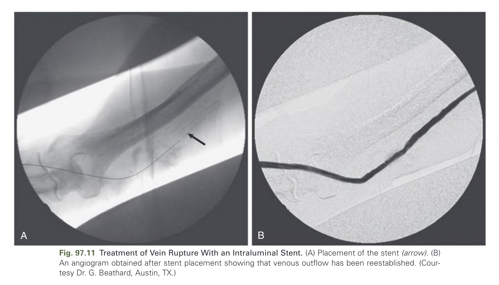

Fig. 97.11 Treatment of Vein Rupture With an Intraluminal Stent. (A) Placement of the stent (arrow). (B) An angiogram obtained after stent placement showing that venous outflow has been reestablished. (Courtesy Dr. G. Beathard, Austin, TX.)

---

## Tables

*No tables resolved for this chapter.*

## Boxes

*No boxes resolved for this chapter.*
