# 098. Hemodialysis- Principles and Techniques - Figures and Tables Index

This document lists all figures, tables and boxes extracted from `098. Hemodialysis- Principles and Techniques.pdf`.

## Table of Contents
- [Figures](#figures)
- [Tables](#tables)
- [Boxes](#boxes)

---

## Figures

### Fig_98_1

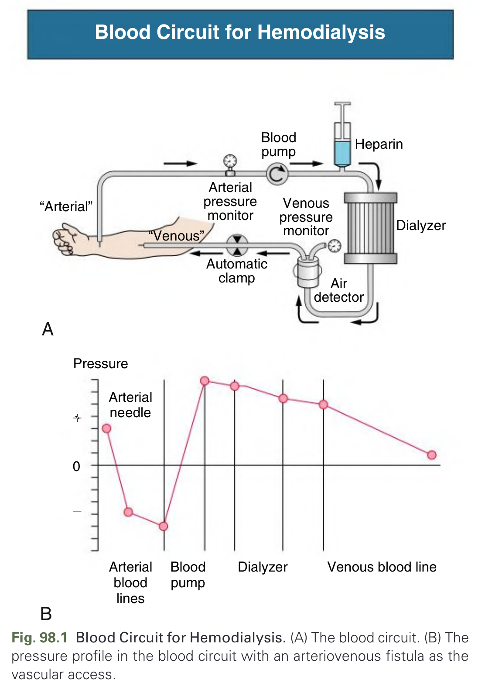

Fig. 98.1 Blood Circuit for Hemodialysis. (A) The blood circuit. (B) The pressure profile in the blood circuit with an arteriovenous fistula as the vascular access.

---

### Fig_98_2

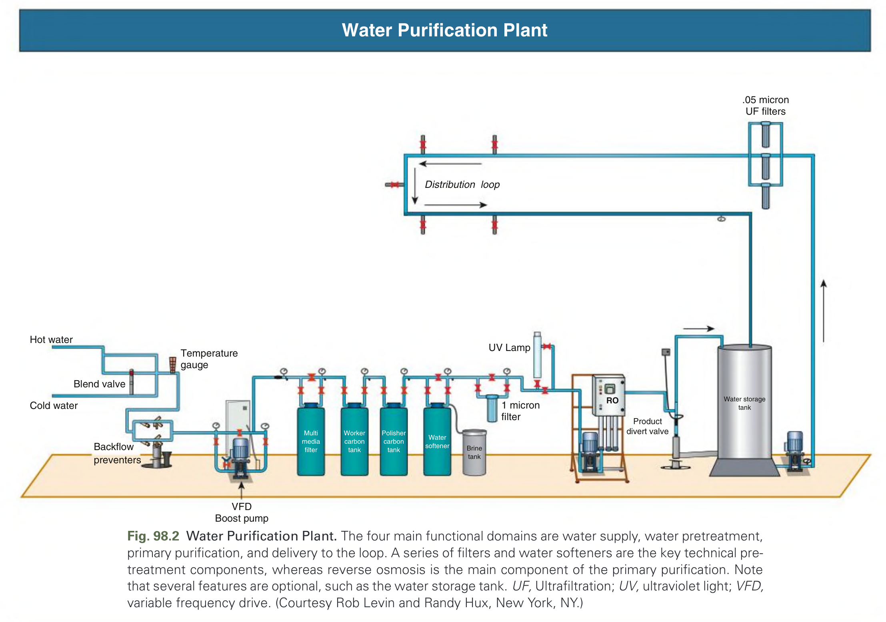

Fig. 98.2 Water Purification Plant. The four main functional domains are water supply, water pretreatment, primary purification, and delivery to the loop. A series of filters and water softeners are the key technical pre-treatment components, whereas reverse osmosis is the main component of the primary purification. Note that several features are optional, such as the water storage tank. UF, Ultrafiltration; UV, ultraviolet light; VFD, variable frequency drive. (Courtesy Rob Levin and Randy Hux, New York, NY.)

---

### Fig_98_3

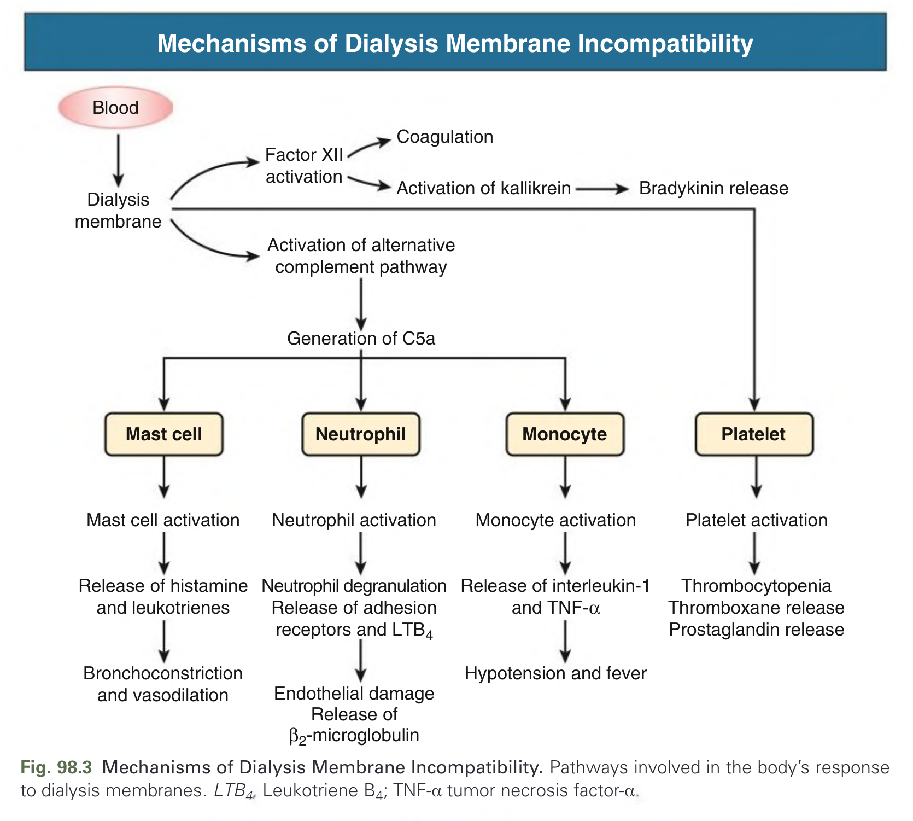

Fig. 98.3 Mechanisms of Dialysis Membrane Incompatibility. Pathways involved in the body’s response to dialysis membranes. LTB4, Leukotriene B4; TNF-α tumor necrosis factor-α.

---

### Fig_98_4

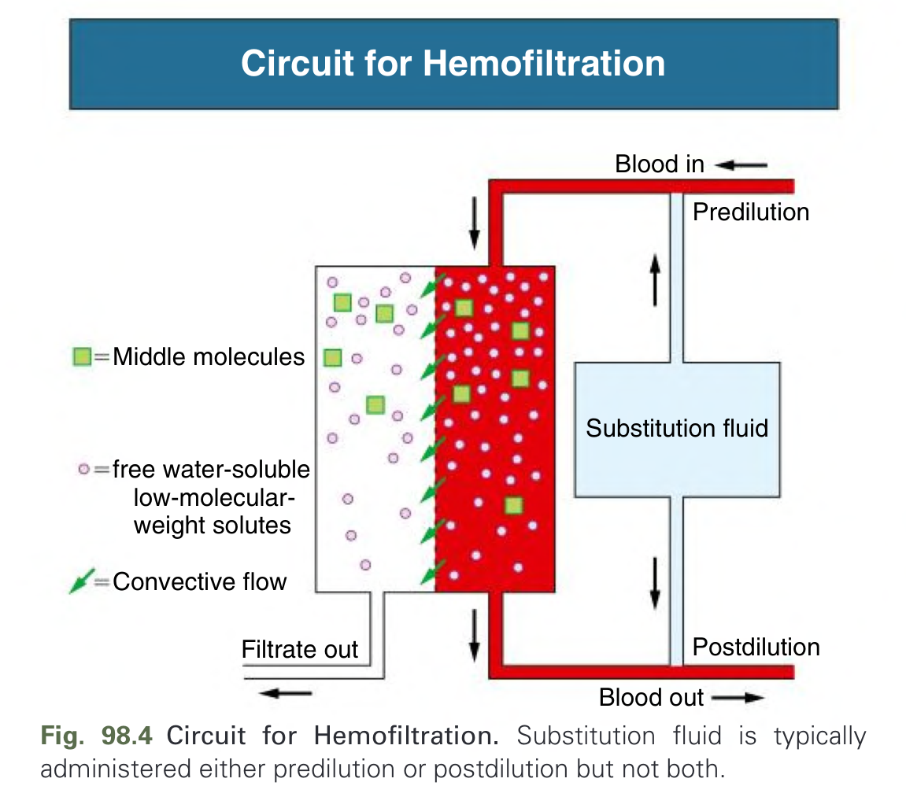

Fig. 98.4 Circuit for Hemofiltration. Substitution fluid is typically administered either predilution or postdilution but not both.

---

### Fig_98_5

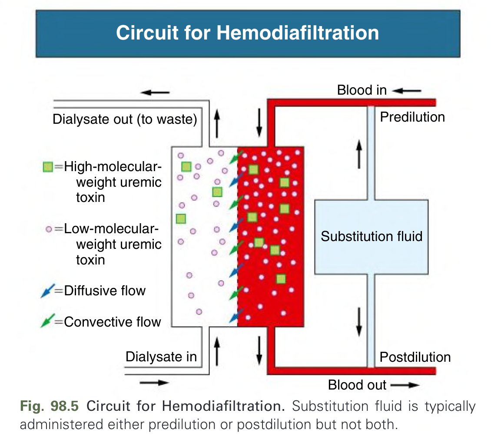

Fig. 98.5 Circuit for Hemodiafiltration. Substitution fluid is typically administered either predilution or postdilution but not both.

---

## Tables

### Table_98_1

#### Table Image

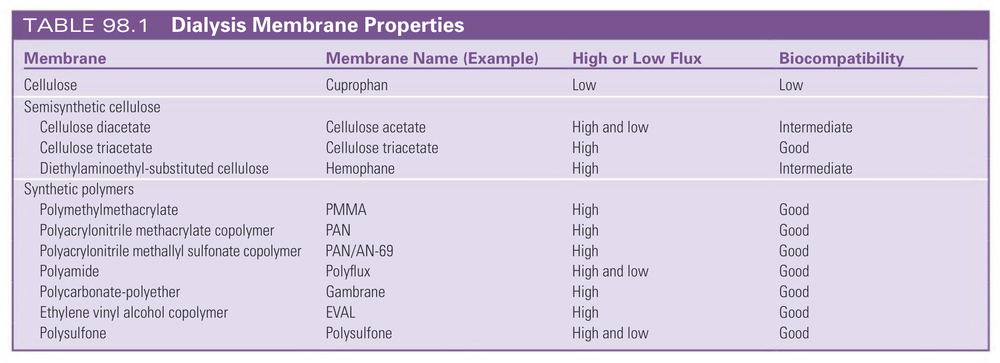

#### Table Data (CSV: [Table_98_1.csv](Table_98_1.csv))

```markdown
| Membrane | Membrane Name (Example) | High or Low Flux | Biocompatibility |
| :--- | :--- | :--- | :--- |
| **Cellulose** | | | |
| Cellulose | Cuprophan | Low | Low |
| **Semisynthetic cellulose** | | | |
| Cellulose diacetate | Cellulose acetate | High and low | Intermediate |
| Cellulose triacetate | Cellulose triacetate | High | Good |
| Diethylaminoethyl-substituted cellulose | Hemophane | High | Intermediate |
| **Synthetic polymers** | | | |
| Polymethylmethacrylate | PMMA | High | Good |
| Polyacrylonitrile methacrylate copolymer | PAN | High | Good |
| Polyacrylonitrile methallyl sulfonate copolymer | PAN/AN-69 | High | Good |
| Polyamide | Polyflux | High and low | Good |
| Polycarbonate-polyether | Gambrane | High | Good |
| Ethylene vinyl alcohol copolymer | EVAL | High | Good |
| Polysulfone | Polysulfone | High and low | Good |
```

TABLE 98.1 Dialysis Membrane Properties

---

### Table_98_2

#### Table Image

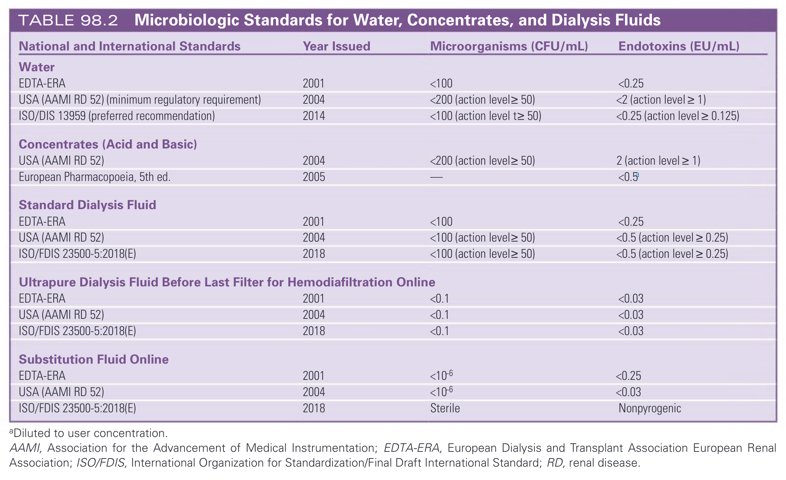

#### Table Data (CSV: [Table_98_2.csv](Table_98_2.csv))

```markdown
| National and International Standards | Year Issued | Microorganisms (CFU/mL) | Endotoxins (EU/mL) |
| :--- | :--- | :--- | :--- |
| **Water** | | | |
| EDTA-ERA | 2001 | <100 | <0.25 |
| USA (AAMI RD 52) (minimum regulatory requirement) | 2004 | <200 (action level≥ 50) | <2 (action level ≥ 1) |
| ISO/DIS 13959 (preferred recommendation) | 2014 | <100 (action level t≥ 50) | <0.25 (action level ≥ 0.125) |
| **Concentrates (Acid and Basic)** | | | |
| USA (AAMI RD 52) | 2004 | <200 (action level≥ 50) | 2 (action level ≥ 1) |
| European Pharmacopoeia, 5th ed. | 2005 | — | <0.5^a |
| **Standard Dialysis Fluid** | | | |
| EDTA-ERA | 2001 | <100 | <0.25 |
| USA (AAMI RD 52) | 2004 | <100 (action level≥ 50) | <0.5 (action level ≥ 0.25) |
| ISO/FDIS 23500-5:2018(E) | 2018 | <100 (action level≥ 50) | <0.5 (action level ≥ 0.25) |
| **Ultrapure Dialysis Fluid Before Last Filter for Hemodiafiltration Online** | | | |
| EDTA-ERA | 2001 | <0.1 | <0.03 |
| USA (AAMI RD 52) | 2004 | <0.1 | <0.03 |
| ISO/FDIS 23500-5:2018(E) | 2018 | <0.1 | <0.03 |
| **Substitution Fluid Online** | | | |
| EDTA-ERA | 2001 | <10⁻⁶ | <0.25 |
| USA (AAMI RD 52) | 2004 | <10⁻⁶ | <0.03 |
| ISO/FDIS 23500-5:2018(E) | 2018 | Sterile | Nonpyrogenic |
*^aDiluted to user concentration.*
AAMI, Association for the Advancement of Medical Instrumentation; EDTA-ERA, European Dialysis and Transplant Association European Renal Association; ISO/FDIS, International Organization for Standardization/Final Draft International Standard; RD, renal disease.
```

TABLE 98.2 Microbiologic Standards for Water, Concentrates, and Dialysis Fluids

---

### Table_98_3

#### Table Image

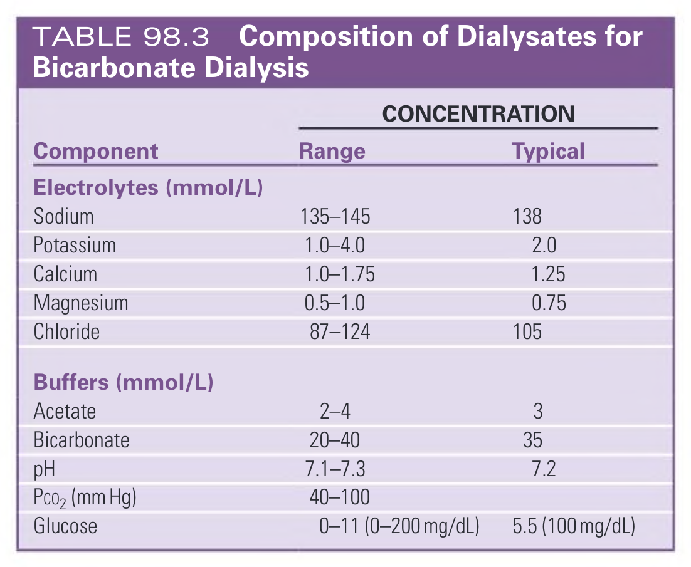

#### Table Data (CSV: [Table_98_3.csv](Table_98_3.csv))

```markdown
| Component | CONCENTRATION | |
| :--- | :--- | :--- |
| | **Range** | **Typical** |
| **Electrolytes (mmol/L)** | | |
| Sodium | 135-145 | 138 |
| Potassium | 1.0-4.0 | 2.0 |
| Calcium | 1.0-1.75 | 1.25 |
| Magnesium | 0.5-1.0 | 0.75 |
| Chloride | 87-124 | 105 |
| **Buffers (mmol/L)** | | |
| Acetate | 2-4 | 3 |
| Bicarbonate | 20-40 | 35 |
| pH | 7.1-7.3 | 7.2 |
| Pco2 (mm Hg) | 40-100 | |
| Glucose | 0-11 (0-200 mg/dL) | 5.5 (100 mg/dL) |
```

TABLE 98.3 Composition of Dialysates for Bicarbonate Dialysis

---

### Table_98_4

#### Table Image

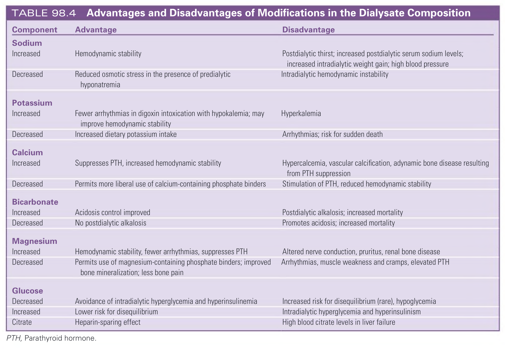

#### Table Data (CSV: [Table_98_4.csv](Table_98_4.csv))

```markdown
| Component | Advantage | Disadvantage |
| :--- | :--- | :--- |
| **Sodium** | | |
| Increased | Hemodynamic stability | Postdialytic thirst; increased postdialytic serum sodium levels; increased intradialytic weight gain; high blood pressure |
| Decreased | Reduced osmotic stress in the presence of predialytic hyponatremia | Intradialytic hemodynamic instability |
| **Potassium** | | |
| Increased | Fewer arrhythmias in digoxin intoxication with hypokalemia; may improve hemodynamic stability | Hyperkalemia |
| Decreased | Increased dietary potassium intake | Arrhythmias; risk for sudden death |
| **Calcium** | | |
| Increased | Suppresses PTH, increased hemodynamic stability | Hypercalcemia, vascular calcification, adynamic bone disease resulting from PTH suppression |
| Decreased | Permits more liberal use of calcium-containing phosphate binders | Stimulation of PTH, reduced hemodynamic stability |
| **Bicarbonate** | | |
| Increased | Acidosis control improved | Postdialytic alkalosis; increased mortality |
| Decreased | No postdialytic alkalosis | Promotes acidosis; increased mortality |
| **Magnesium** | | |
| Increased | Hemodynamic stability, fewer arrhythmias, suppresses PTH | Altered nerve conduction, pruritus, renal bone disease |
| Decreased | Permits use of magnesium-containing phosphate binders; improved bone mineralization; less bone pain | Arrhythmias, muscle weakness and cramps, elevated PTH |
| **Glucose** | | |
| Decreased | Avoidance of intradialytic hyperglycemia and hyperinsulinemia | Increased risk for disequilibrium (rare), hypoglycemia |
| Increased | Lower risk for disequilibrium | Intradialytic hyperglycemia and hyperinsulinism |
| Citrate | Heparin-sparing effect | High blood citrate levels in liver failure |
*PTH, Parathyroid hormone.*
```

TABLE 98.4 Advantages and Disadvantages of Modifications in the Dialysate Composition

---

### Table_98_5

#### Table Image

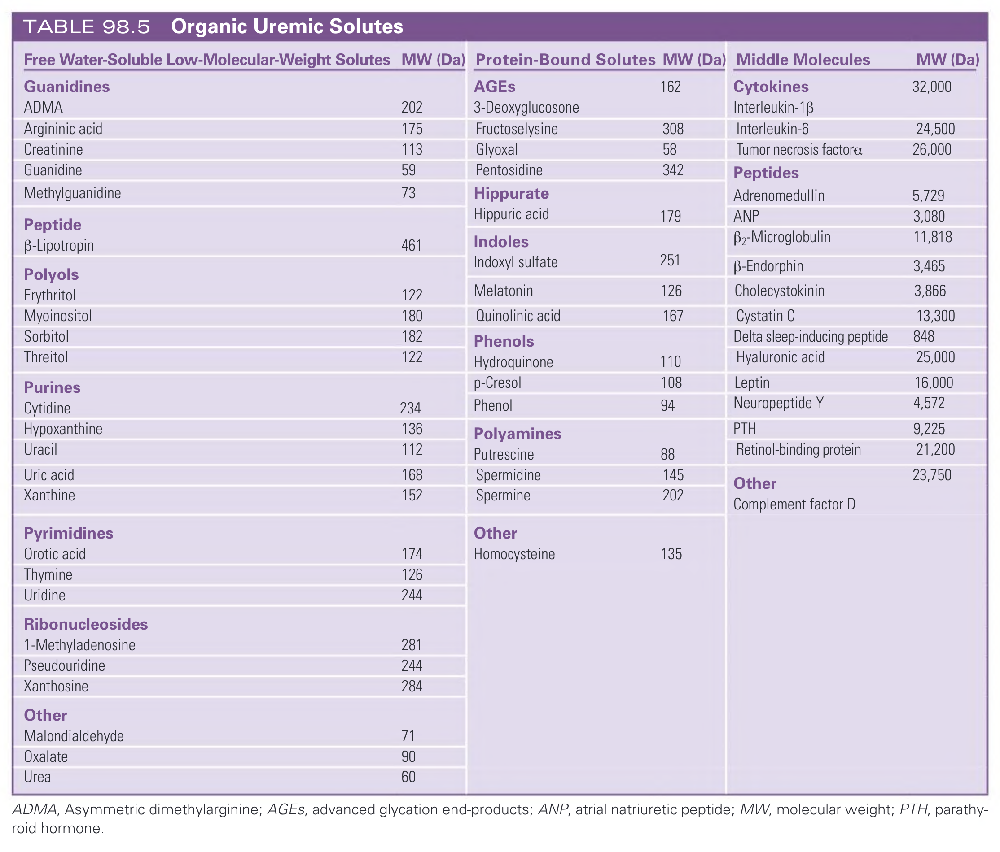

#### Table Data (CSV: [Table_98_5.csv](Table_98_5.csv))

```markdown
| Free Water-Soluble Low-Molecular-Weight Solutes | MW (Da) | Protein-Bound Solutes | MW (Da) | Middle Molecules | MW (Da) |
| :--- | :--- | :--- | :--- | :--- | :--- |
| **Guanidines** | | **AGEs** | 162 | **Cytokines** | 32,000 |
| ADMA | 202 | 3-Deoxyglucosone | | Interleukin-1β | |
| Argininic acid | 175 | Fructoselysine | 308 | Interleukin-6 | 24,500 |
| Creatinine | 113 | Glyoxal | 58 | Tumor necrosis factor-α | 26,000 |
| Guanidine | 59 | Pentosidine | 342 | **Peptides** | |
| Methylguanidine | 73 | **Hippurate** | | Adrenomedullin | 5,729 |
| | | Hippuric acid | 179 | ANP | 3,080 |
| **Peptide** | | **Indoles** | | β2-Microglobulin | 11,818 |
| β-Lipotropin | 461 | Indoxyl sulfate | 251 | β-Endorphin | 3,465 |
| **Polyols** | | Melatonin | 126 | Cholecystokinin | 3,866 |
| Erythritol | 122 | Quinolinic acid | 167 | Cystatin C | 13,300 |
| Myoinositol | 180 | **Phenols** | | Delta sleep-inducing peptide | 848 |
| Sorbitol | 182 | Hydroquinone | 110 | Hyaluronic acid | 25,000 |
| Threitol | 122 | p-Cresol | 108 | Leptin | 16,000 |
| **Purines** | | Phenol | 94 | Neuropeptide Y | 4,572 |
| Cytidine | 234 | **Polyamines** | | PTH | 9,225 |
| Hypoxanthine | 136 | Putrescine | 88 | Retinol-binding protein | 21,200 |
| Uracil | 112 | Spermidine | 145 | **Other** | 23,750 |
| Uric acid | 168 | Spermine | 202 | Complement factor D | |
| Xanthine | 152 | | | | |
| **Pyrimidines** | | **Other** | | | |
| Orotic acid | 174 | Homocysteine | 135 | | |
| Thymine | 126 | | | | |
| Uridine | 244 | | | | |
| **Ribonucleosides** | | | | | |
| 1-Methyladenosine | 281 | | | | |
| Pseudouridine | 244 | | | | |
| Xanthosine | 284 | | | | |
| **Other** | | | | | |
| Malondialdehyde | 71 | | | | |
| Oxalate | 90 | | | | |
| Urea | 60 | | | | |
*ADMA, Asymmetric dimethylarginine; AGEs, advanced glycation end-products; ANP, atrial natriuretic peptide; MW, molecular weight; PTH, parathyroid hormone.*
```

TABLE 98.5 Organic Uremic Solutes

---

### Table_98_6

#### Table Image

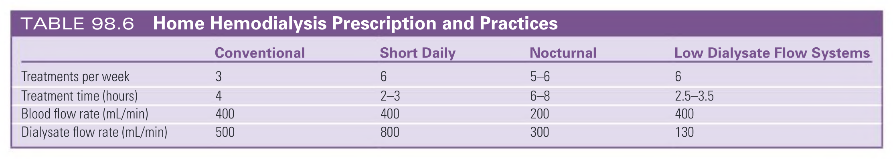

#### Table Data (CSV: [Table_98_6.csv](Table_98_6.csv))

```markdown
| | Conventional | Short Daily | Nocturnal | Low Dialysate Flow Systems |
| :--- | :--- | :--- | :--- | :--- |
| Treatments per week | 3 | 6 | 5-6 | 6 |
| Treatment time (hours) | 4 | 2-3 | 6-8 | 2.5-3.5 |
| Blood flow rate (mL/min) | 400 | 400 | 200 | 400 |
| Dialysate flow rate (mL/min) | 500 | 800 | 300 | 130 |
```

TABLE 98.6 Home Hemodialysis Prescription and Practices

---

## Boxes

### Box_98_1

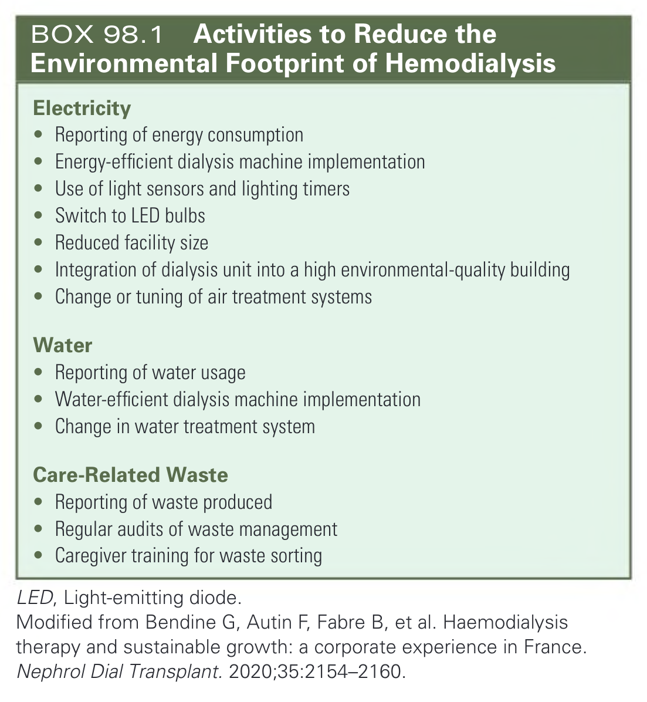

#### Box Text

```markdown
**Electricity**
* Reporting of energy consumption
* Energy-efficient dialysis machine implementation
* Use of light sensors and lighting timers
* Switch to LED bulbs
* Reduced facility size
* Integration of dialysis unit into a high environmental-quality building
* Change or tuning of air treatment systems

**Water**
* Reporting of water usage
* Water-efficient dialysis machine implementation
* Change in water treatment system

**Care-Related Waste**
* Reporting of waste produced
* Regular audits of waste management
* Caregiver training for waste sorting

*LED, Light-emitting diode.*
*Modified from Bendine G, Autin F, Fabre B, et al. Haemodialysis therapy and sustainable growth: a corporate experience in France. Nephrol Dial Transplant. 2020;35:2154-2160.*
```

BOX 98.1 Activities to Reduce the Environmental Footprint of Hemodialysis

---
