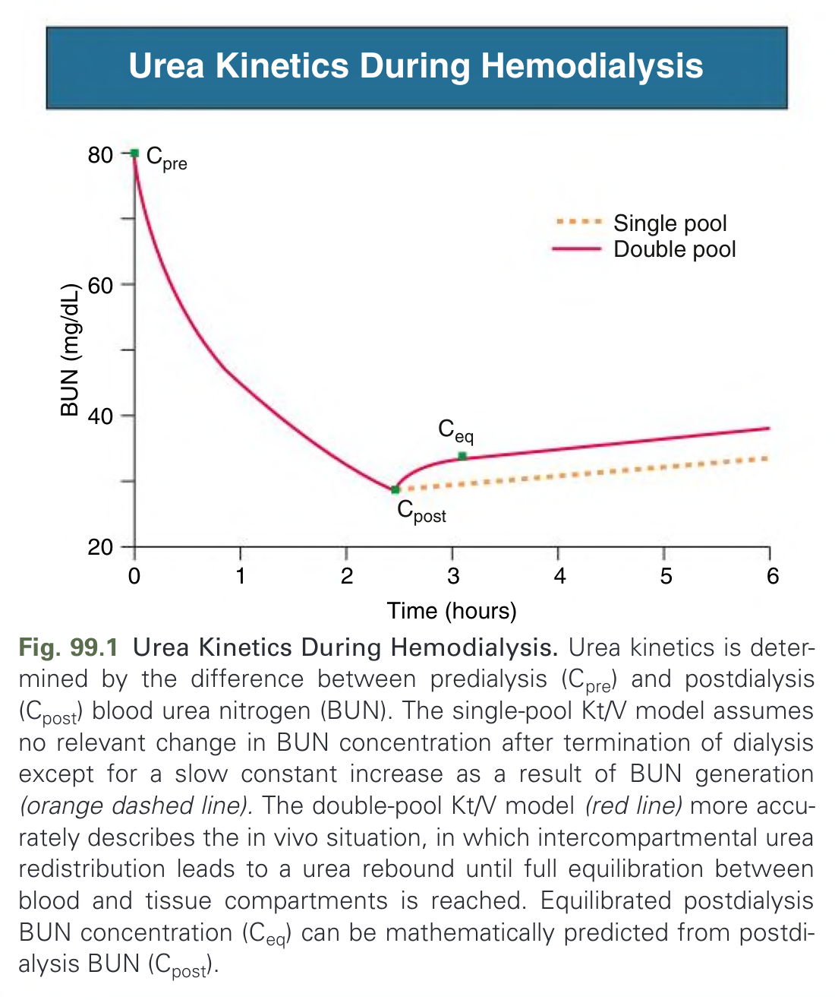
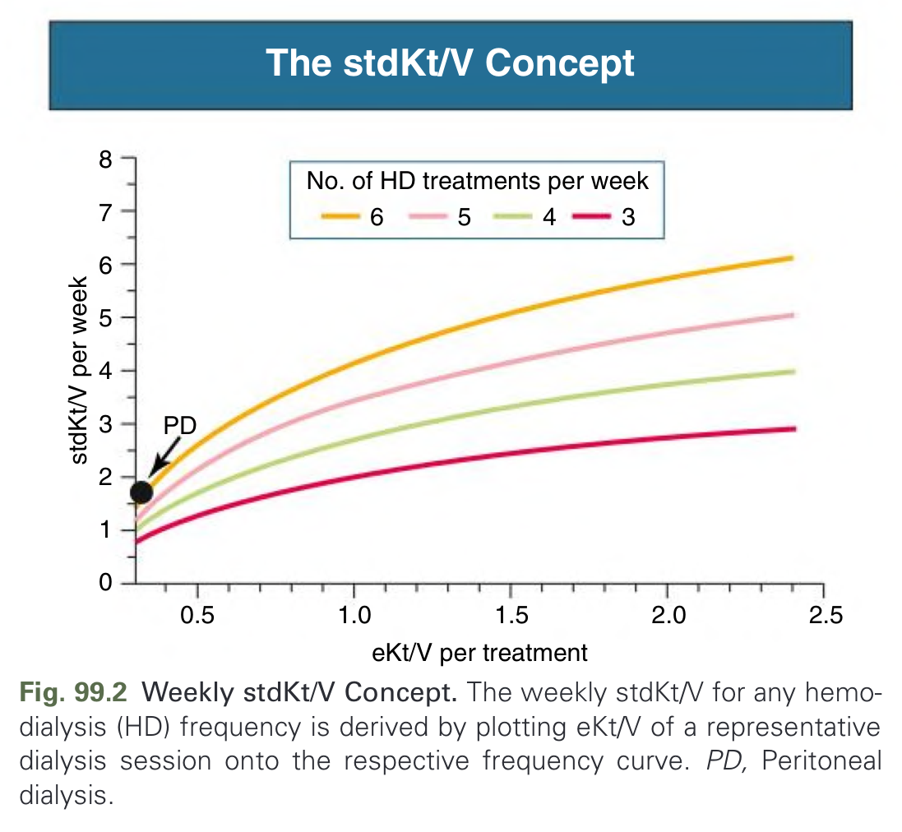
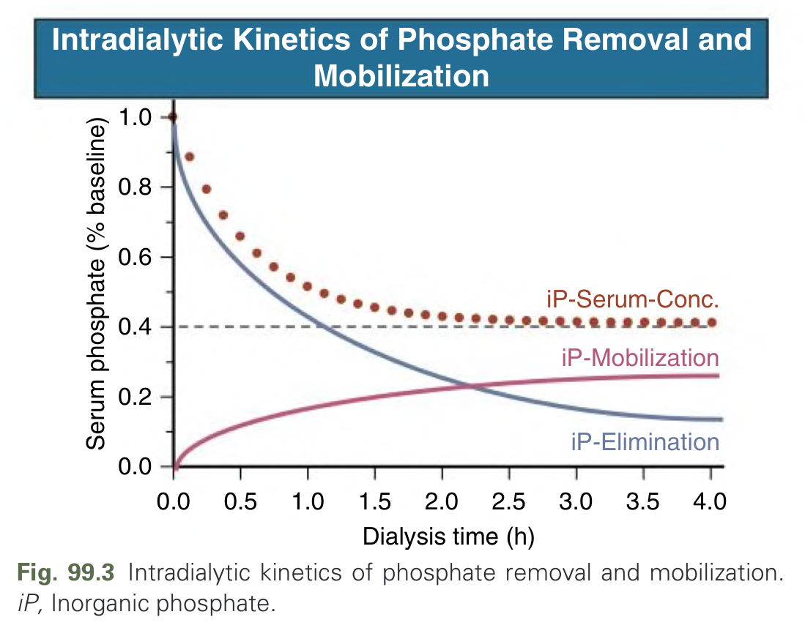
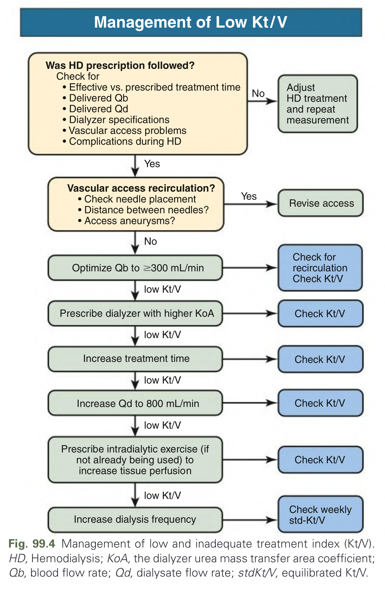
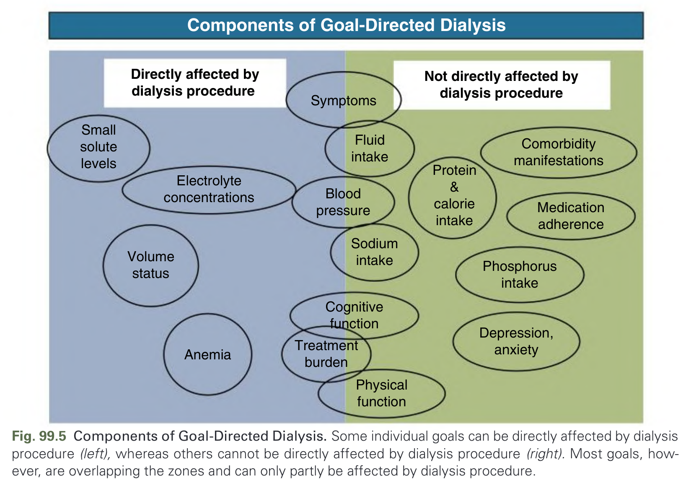
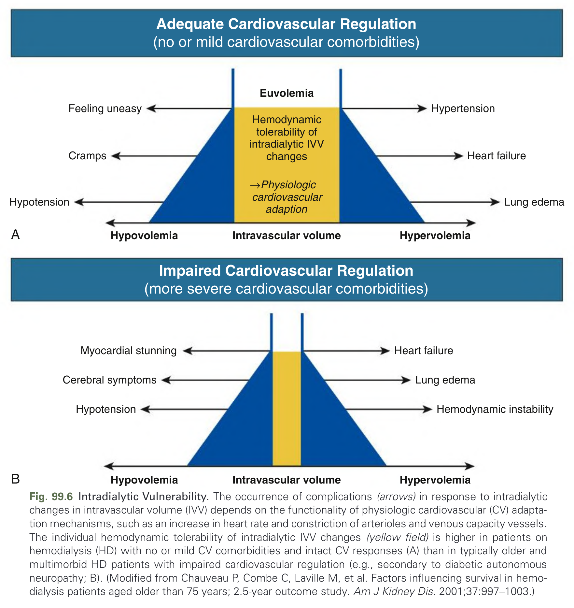
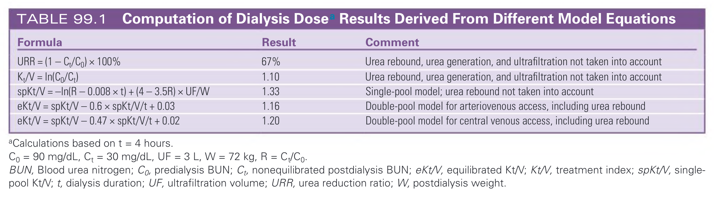

# 099. Hemodialysis- Dialysis Prescription and Adequacy - Figures and Tables Index

This document lists all figures, tables and boxes extracted from `099. Hemodialysis- Dialysis Prescription and Adequacy.pdf`.

## Table of Contents
- [Figures](#figures)
- [Tables](#tables)
- [Boxes](#boxes)

---

## Figures

### Fig_99_1



Fig. 99.1 Urea Kinetics During Hemodialysis. Urea kinetics is determined by the difference between predialysis (Cpre) and postdialysis (Cpost) blood urea nitrogen (BUN). The single-pool Kt/V model assumes no relevant change in BUN concentration after termination of dialysis except for a slow constant increase as a result of BUN generation (orange dashed line). The double-pool Kt/V model (red line) more accurately describes the in vivo situation, in which intercompartmental urea redistribution leads to a urea rebound until full equilibration between blood and tissue compartments is reached. Equilibrated postdialysis BUN concentration (Ceq) can be mathematically predicted from postdialysis BUN (Cpost).

---

### Fig_99_2



Fig. 99.2 Weekly stdKt/V Concept. The weekly stdKt/V for any hemodialysis (HD) frequency is derived by plotting eKt/V of a representative dialysis session onto the respective frequency curve. PD, Peritoneal dialysis.

---

### Fig_99_3



Fig. 99.3 Intradialytic kinetics of phosphate removal and mobilization. iP, Inorganic phosphate.

---

### Fig_99_4



Fig. 99.4 Management of low and inadequate treatment index (Kt/V). HD, Hemodialysis; KoA, the dialyzer urea mass transfer area coefficient; Qb, blood flow rate; Qd, dialysate flow rate; stdKt/V, equilibrated Kt/V.

---

### Fig_99_5



Fig. 99.5 Components of Goal-Directed Dialysis. Some individual goals can be directly affected by dialysis procedure (left), whereas others cannot be directly affected by dialysis procedure (right). Most goals, however, are overlapping the zones and can only partly be affected by dialysis procedure.

---

### Fig_99_6



Fig. 99.6 Intradialytic Vulnerability. The occurrence of complications (arrows) in response to intradialytic changes in intravascular volume (IVV) depends on the functionality of physiologic cardiovascular (CV) adaptation mechanisms, such as an increase in heart rate and constriction of arterioles and venous capacity vessels. The individual hemodynamic tolerability of intradialytic IVV changes (yellow field) is higher in patients on hemodialysis (HD) with no or mild CV comorbidities and intact CV responses (A) than in typically older and multimorbid HD patients with impaired cardiovascular regulation (e.g., secondary to diabetic autonomous neuropathy; B). (Modified from Chauveau P, Combe C, Laville M, et al. Factors influencing survival in hemodialysis patients aged older than 75 years; 2.5-year outcome study. Am J Kidney Dis. 2001;37:997–1003.)

---

## Tables

### Table_99_1

#### Table Image



#### Table Data (CSV: [Table_99_1.csv](Table_99_1.csv))

```markdown
| Formula | Result | Comment |
| :--- | :--- | :--- |
| URR = (1 – Ct/C0) × 100% | 67% | Urea rebound, urea generation, and ultrafiltration not taken into account |
| Kt/V = ln(C0/Ct) | 1.10 | Urea rebound, urea generation, and ultrafiltration not taken into account |
| spKt/V = –ln(R – 0.008 × t) + (4 – 3.5R) × UF/W | 1.33 | Single-pool model; urea rebound not taken into account |
| eKt/V = spKt/V – 0.6 × spKt/V/t + 0.03 | 1.16 | Double-pool model for arteriovenous access, including urea rebound |
| eKt/V = spKt/V – 0.47 × spKt/V/t + 0.02 | 1.20 | Double-pool model for central venous access, including urea rebound |

*^a Calculations based on t = 4 hours. C0 = 90 mg/dL, Ct = 30 mg/dL, UF = 3 L, W = 72 kg, R = Ct/C0.*
*BUN, Blood urea nitrogen; C0, predialysis BUN; Ct, nonequilibrated postdialysis BUN; eKt/V, equilibrated Kt/V; Kt/V, treatment index; spKt/V, single-pool Kt/V; t, dialysis duration; UF, ultrafiltration volume; URR, urea reduction ratio; W, postdialysis weight.*
```

TABLE 99.1 Computation of Dialysis Dosea Results Derived From Different Model Equations

---

## Boxes

*No boxes resolved for this chapter.*
