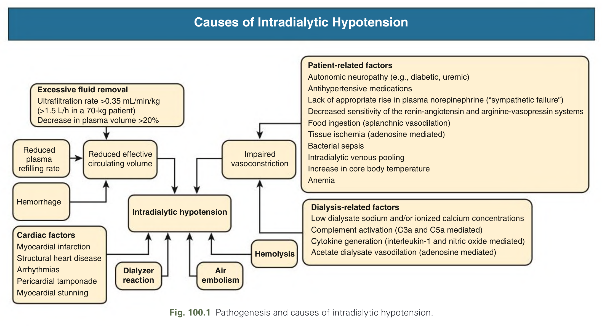
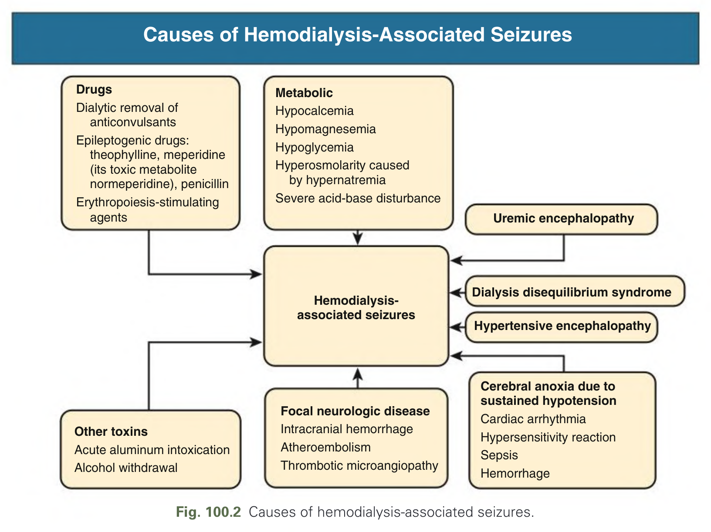
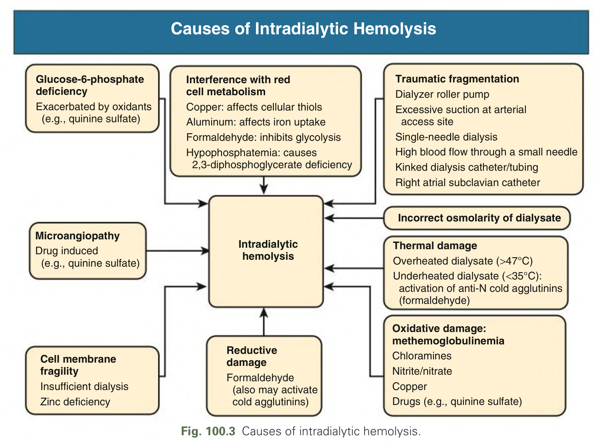
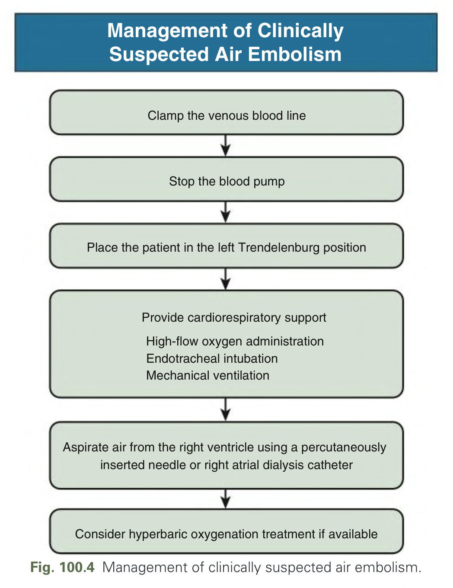
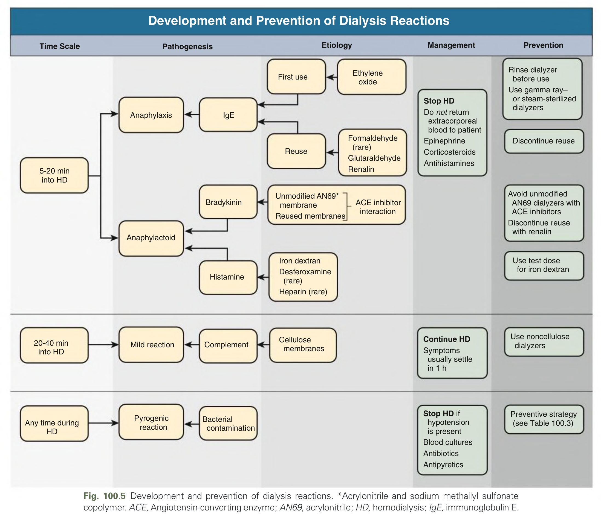
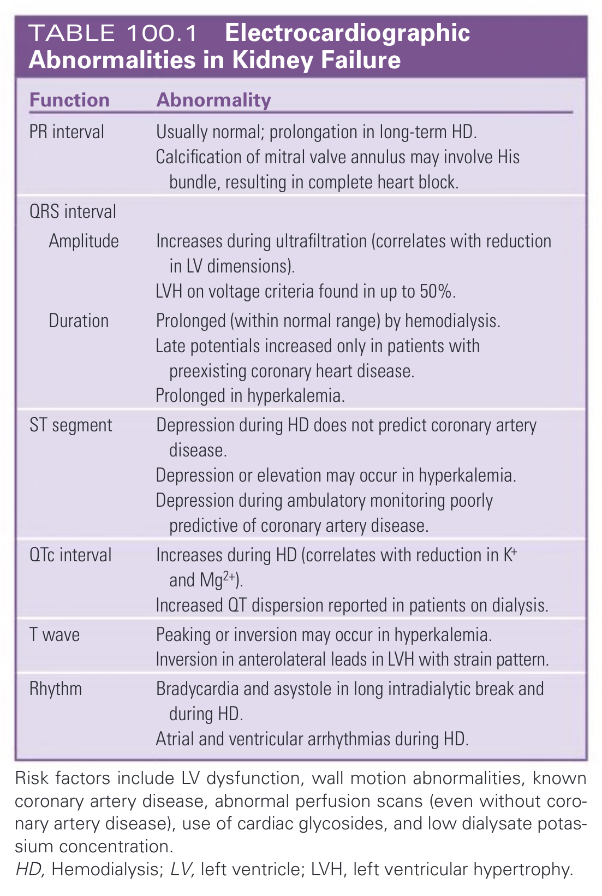
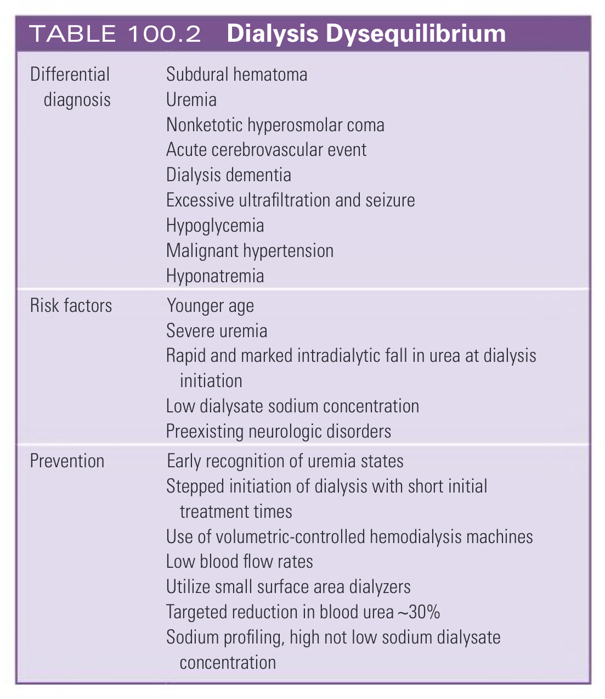
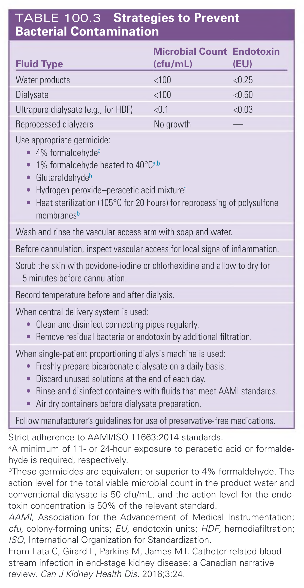
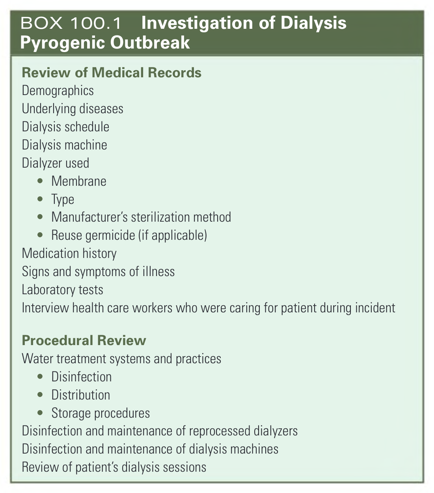

# 100. Acute Complications During Hemodialysis - Figures and Tables Index

This document lists all figures, tables and boxes extracted from `100. Acute Complications During Hemodialysis.pdf`.

## Table of Contents
- [Figures](#figures)
- [Tables](#tables)
- [Boxes](#boxes)

---

## Figures

### Fig_100_1



Fig. 100.1 Pathogenesis and causes of intradialytic hypotension.

---

### Fig_100_2



Fig. 100.2 Causes of hemodialysis-associated seizures.

---

### Fig_100_3



Fig. 100.3 Causes of intradialytic hemolysis.

---

### Fig_100_4



Fig. 100.4 Management of clinically suspected air embolism.

---

### Fig_100_5



Fig. 100.5 Development and prevention of dialysis reactions. *Acrylonitrile and sodium methallyl sulfonate copolymer. ACE, Angiotensin-converting enzyme; AN69, acrylonitrile; HD, hemodialysis; IgE, immunoglobulin E.

---

## Tables

### Table_100_1

#### Table Image



#### Table Data (CSV: [Table_100_1.csv](Table_100_1.csv))

```markdown
| Function | Abnormality |
| :--- | :--- |
| **PR interval** | Usually normal; prolongation in long-term HD. Calcification of mitral valve annulus may involve His bundle, resulting in complete heart block. |
| **QRS interval** | |
| Amplitude | Increases during ultrafiltration (correlates with reduction in LV dimensions). LVH on voltage criteria found in up to 50%. |
| Duration | Prolonged (within normal range) by hemodialysis. Late potentials increased only in patients with preexisting coronary heart disease. Prolonged in hyperkalemia. |
| **ST segment** | Depression during HD does not predict coronary artery disease. Depression or elevation may occur in hyperkalemia. Depression during ambulatory monitoring poorly predictive of coronary artery disease. |
| **QTc interval** | Increases during HD (correlates with reduction in K+ and Mg2+). Increased QT dispersion reported in patients on dialysis. |
| **T wave** | Peaking or inversion may occur in hyperkalemia. Inversion in anterolateral leads in LVH with strain pattern. |
| **Rhythm** | Bradycardia and asystole in long intradialytic break and during HD. Atrial and ventricular arrhythmias during HD. |
*Risk factors include LV dysfunction, wall motion abnormalities, known coronary artery disease, abnormal perfusion scans (even without coronary artery disease), use of cardiac glycosides, and low dialysate potassium concentration.*
*HD, Hemodialysis; LV, left ventricle; LVH, left ventricular hypertrophy.*
```

TABLE 100.1 Electrocardiographic Abnormalities in Kidney Failure

---

### Table_100_2

#### Table Image



#### Table Data (CSV: [Table_100_2.csv](Table_100_2.csv))

```markdown
| | |
| :--- | :--- |
| **Differential diagnosis** | Subdural hematoma<br>Uremia<br>Nonketotic hyperosmolar coma<br>Acute cerebrovascular event<br>Dialysis dementia<br>Excessive ultrafiltration and seizure<br>Hypoglycemia<br>Malignant hypertension<br>Hyponatremia |
| **Risk factors** | Younger age<br>Severe uremia<br>Rapid and marked intradialytic fall in urea at dialysis initiation<br>Low dialysate sodium concentration<br>Preexisting neurologic disorders |
| **Prevention** | Early recognition of uremia states<br>Stepped initiation of dialysis with short initial treatment times<br>Use of volumetric-controlled hemodialysis machines<br>Low blood flow rates<br>Utilize small surface area dialyzers<br>Targeted reduction in blood urea ~30%<br>Sodium profiling, high not low sodium dialysate concentration |
```

TABLE 100.2 Dialysis Dysequilibrium

---

### Table_100_3

#### Table Image



#### Table Data (CSV: [Table_100_3.csv](Table_100_3.csv))

```markdown
| Fluid Type | Microbial Count (cfu/mL) | Endotoxin (EU) |
| :--- | :--- | :--- |
| Water products | <100 | <0.25 |
| Dialysate | <100 | <0.50 |
| Ultrapure dialysate (e.g., for HDF) | <0.1 | <0.03 |
| Reprocessed dialyzers | No growth | — |

**Use appropriate germicide:**
* 4% formaldehyde^a
* 1% formaldehyde heated to 40°C^a,b
* Glutaraldehyde^b
* Hydrogen peroxide-peracetic acid mixture^b
* Heat sterilization (105°C for 20 hours) for reprocessing of polysulfone membranes^b

**Additional Strategies:**
* Wash and rinse the vascular access arm with soap and water.
* Before cannulation, inspect vascular access for local signs of inflammation.
* Scrub the skin with povidone-iodine or chlorhexidine and allow to dry for 5 minutes before cannulation.
* Record temperature before and after dialysis.
* When central delivery system is used: Clean and disinfect connecting pipes regularly; Remove residual bacteria or endotoxin by additional filtration.
* When single-patient proportioning dialysis machine is used: Freshly prepare bicarbonate dialysate on a daily basis; Discard unused solutions at the end of each day; Rinse and disinfect containers with fluids that meet AAMI standards; Air dry containers before dialysate preparation.
* Follow manufacturer's guidelines for use of preservative-free medications.

*Strict adherence to AAMI/ISO 11663:2014 standards.*
*^aA minimum of 11- or 24-hour exposure to peracetic acid or formaldehyde is required, respectively.*
*^bThese germicides are equivalent or superior to 4% formaldehyde. The action level for the total viable microbial count in the product water and conventional dialysate is 50 cfu/mL, and the action level for the endotoxin concentration is 50% of the relevant standard.*
*AAMI, Association for the Advancement of Medical Instrumentation; cfu, colony-forming units; EU, endotoxin units; HDF, hemodiafiltration; ISO, International Organization for Standardization.*
*From Lata C, Girard L, Parkins M, James MT. Catheter-related blood stream infection in end-stage kidney disease: a Canadian narrative review. Can J Kidney Health Dis. 2016;3:24.*
```

TABLE 100.3 Strategies to Prevent Bacterial Contamination

---

## Boxes

### Box_100_1



#### Box Text

```markdown
**Review of Medical Records**
* Demographics
* Underlying diseases
* Dialysis schedule
* Dialysis machine
* Dialyzer used (Membrane, Type, Manufacturer's sterilization method, Reuse germicide)
* Medication history
* Signs and symptoms of illness
* Laboratory tests
* Interview health care workers who were caring for patient during incident

**Procedural Review**
* Water treatment systems and practices (Disinfection, Distribution, Storage procedures)
* Disinfection and maintenance of reprocessed dialyzers
* Disinfection and maintenance of dialysis machines
* Review of patient's dialysis sessions
```

BOX 100.1 Investigation of Dialysis Pyrogenic Outbreak

---
