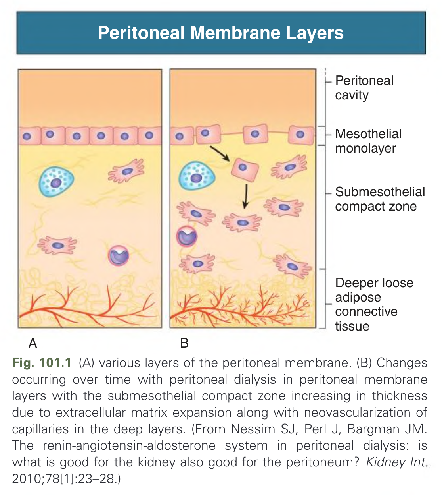
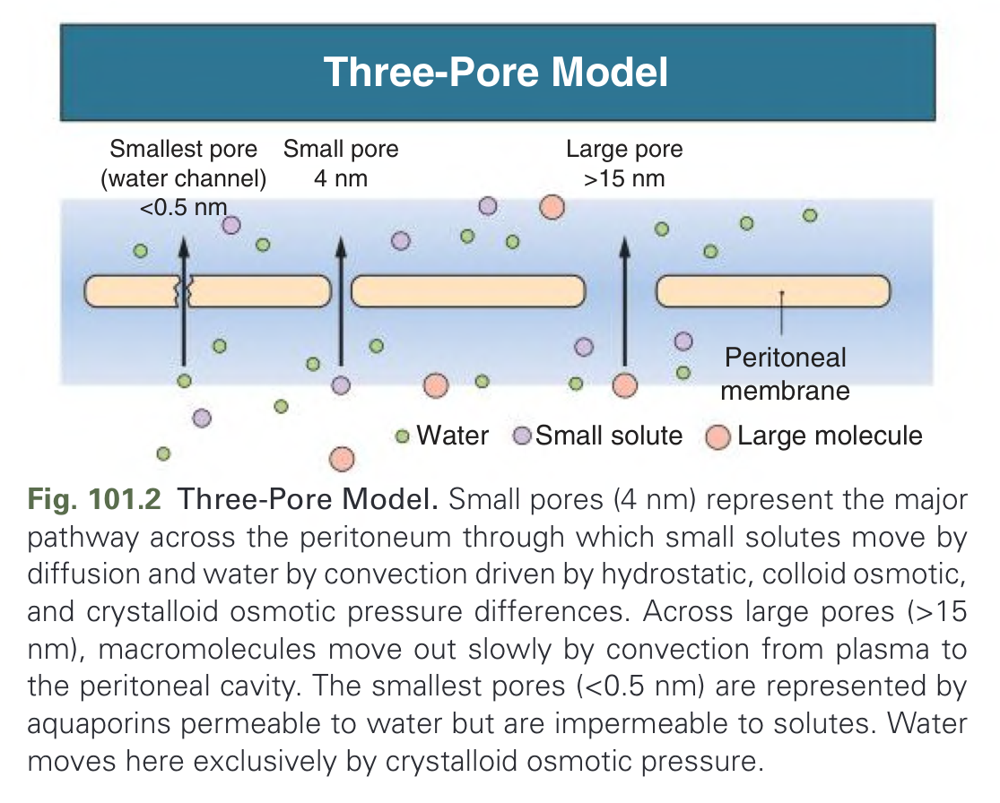
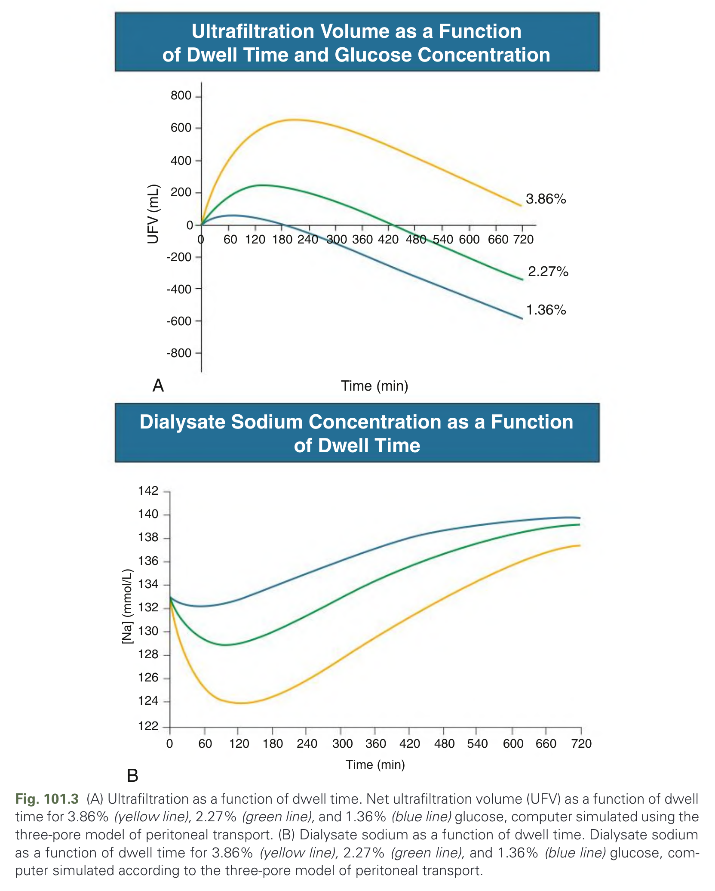
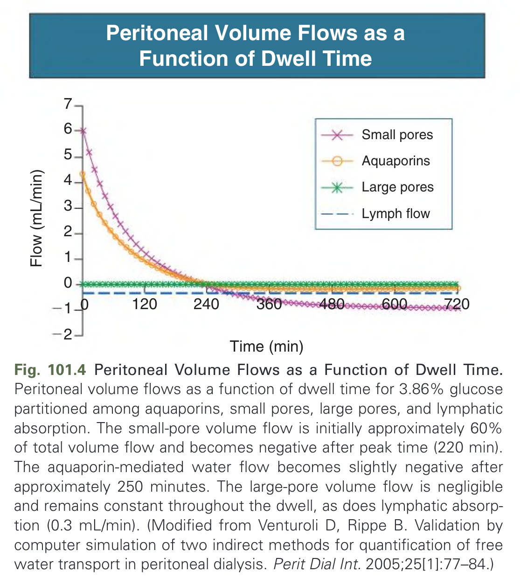
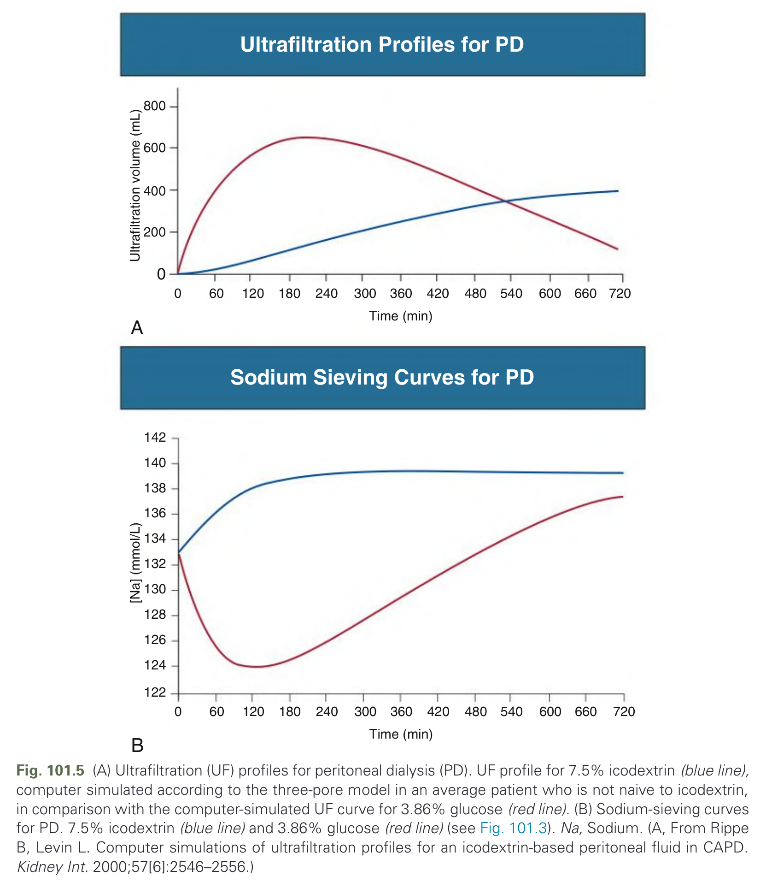
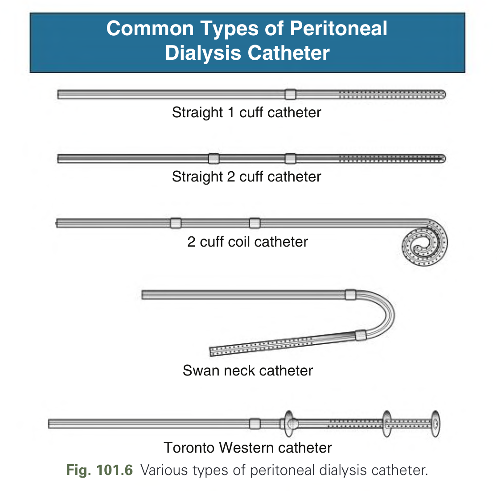
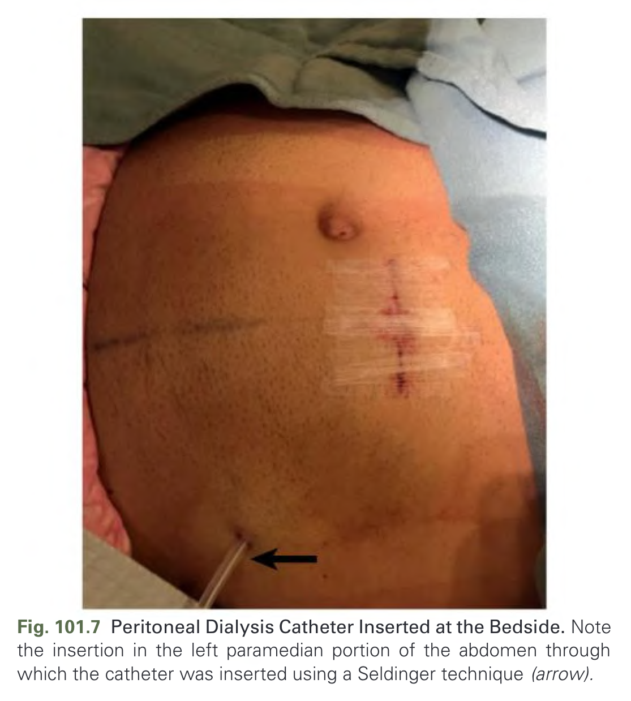
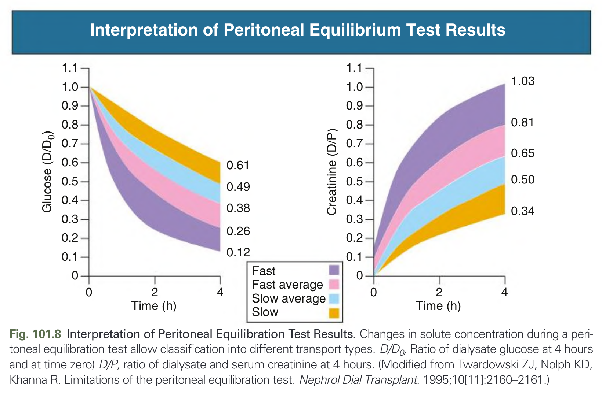
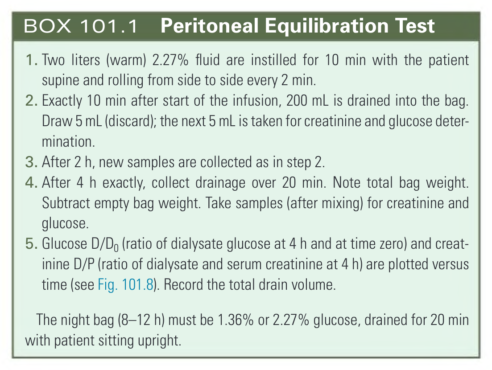

# 101. Peritoneal Dialysis- Principles, Techniques, and Adequacy - Figures and Tables Index

This document lists all figures, tables and boxes extracted from `101. Peritoneal Dialysis- Principles, Techniques, and Adequacy.pdf`.

## Table of Contents
- [Figures](#figures)
- [Tables](#tables)
- [Boxes](#boxes)

---

## Figures

### Fig_101_1



Fig. 101.1 (A) various layers of the peritoneal membrane. (B) Changes occurring over time with peritoneal dialysis in peritoneal membrane layers with the submesothelial compact zone increasing in thickness due to extracellular matrix expansion along with neovascularization of capillaries in the deep layers. (From Nessim SJ, Perl J, Bargman JM. The renin-angiotensin-aldosterone system in peritoneal dialysis: is what is good for the kidney also good for the peritoneum? Kidney Int. 2010;78[1]:23–28.)

---

### Fig_101_2



Fig. 101.2 Three-Pore Model. Small pores (4 nm) represent the major pathway across the peritoneum through which small solutes move by diffusion and water by convection driven by hydrostatic, colloid osmotic, and crystalloid osmotic pressure differences. Across large pores (>15 nm), macromolecules move out slowly by convection from plasma to the peritoneal cavity. The smallest pores (<0.5 nm) are represented by aquaporins permeable to water but are impermeable to solutes. Water moves here exclusively by crystalloid osmotic pressure.

---

### Fig_101_3



Fig. 101.3 (A) Ultrafiltration as a function of dwell time. Net ultrafiltration volume (UFV) as a function of dwell time for 3.86% (yellow line), 2.27% (green line), and 1.36% (blue line) glucose, computer simulated using the three-pore model of peritoneal transport. (B) Dialysate sodium as a function of dwell time. Dialysate sodium as a function of dwell time for 3.86% (yellow line), 2.27% (green line), and 1.36% (blue line) glucose, computer simulated according to the three-pore model of peritoneal transport.

---

### Fig_101_4



Fig. 101.4 Peritoneal Volume Flows as a Function of Dwell Time. Peritoneal volume flows as a function of dwell time for 3.86% glucose partitioned among aquaporins, small pores, large pores, and lymphatic absorption. The small-pore volume flow is initially approximately 60% of total volume flow and becomes negative after peak time (220 min). The aquaporin-mediated water flow becomes slightly negative after approximately 250 minutes. The large-pore volume flow is negligible and remains constant throughout the dwell, as does lymphatic absorption (0.3 mL/min). (Modified from Venturoli D, Rippe B. Validation by computer simulation of two indirect methods for quantification of free water transport in peritoneal dialysis. Perit Dial Int. 2005;25[1]:77–84.)

---

### Fig_101_5



Fig. 101.5 (A) Ultrafiltration (UF) profiles for peritoneal dialysis (PD). UF profile for 7.5% icodextrin (blue line), computer simulated according to the three-pore model in an average patient who is not naive to icodextrin, in comparison with the computer-simulated UF curve for 3.86% glucose (red line). (B) Sodium-sieving curves for PD. 7.5% icodextrin (blue line) and 3.86% glucose (red line) (see Fig. 101.3). Na, Sodium. (A, From Rippe B, Levin L. Computer simulations of ultrafiltration profiles for an icodextrin-based peritoneal fluid in CAPD. Kidney Int. 2000;57[6]:2546–2556.)

---

### Fig_101_6



Fig. 101.6 Various types of peritoneal dialysis catheter.

---

### Fig_101_7



Fig. 101.7 Peritoneal Dialysis Catheter Inserted at the Bedside. Note the insertion in the left paramedian portion of the abdomen through which the catheter was inserted using a Seldinger technique (arrow).

---

### Fig_101_8



Fig. 101.8 Interpretation of Peritoneal Equilibration Test Results. Changes in solute concentration during a peritoneal equilibration test allow classification into different transport types. D/D0, Ratio of dialysate glucose at 4 hours and at time zero) D/P, ratio of dialysate and serum creatinine at 4 hours. (Modified from Twardowski ZJ, Nolph KD, Khanna R. Limitations of the peritoneal equilibration test. Nephrol Dial Transplant. 1995;10[11]:2160–2161.)

---

## Tables

*No tables resolved for this chapter.*

## Boxes

### Box_101_1



#### Box Text

```markdown
1. Two liters (warm) 2.27% fluid are instilled for 10 min with the patient supine and rolling from side to side every 2 min.
2. Exactly 10 min after start of the infusion, 200 mL is drained into the bag. Draw 5 mL (discard); the next 5 mL is taken for creatinine and glucose determination.
3. After 2 h, new samples are collected as in step 2.
4. After 4 h exactly, collect drainage over 20 min. Note total bag weight. Subtract empty bag weight. Take samples (after mixing) for creatinine and glucose.
5. Glucose D/Do (ratio of dialysate glucose at 4 h and at time zero) and creatinine D/P (ratio of dialysate and serum creatinine at 4 h) are plotted versus time (see Fig. 101.8). Record the total drain volume.
The night bag (8-12 h) must be 1.36% or 2.27% glucose, drained for 20 min with patient sitting upright.
```

BOX 101.1 Peritoneal Equilibration Test

---
