# 102. Complications of Peritoneal Dialysis - Figures and Tables Index

This document lists all figures, tables and boxes extracted from `102. Complications of Peritoneal Dialysis.pdf`.

## Table of Contents
- [Figures](#figures)
- [Tables](#tables)
- [Boxes](#boxes)

---

## Figures

### Fig_102_1

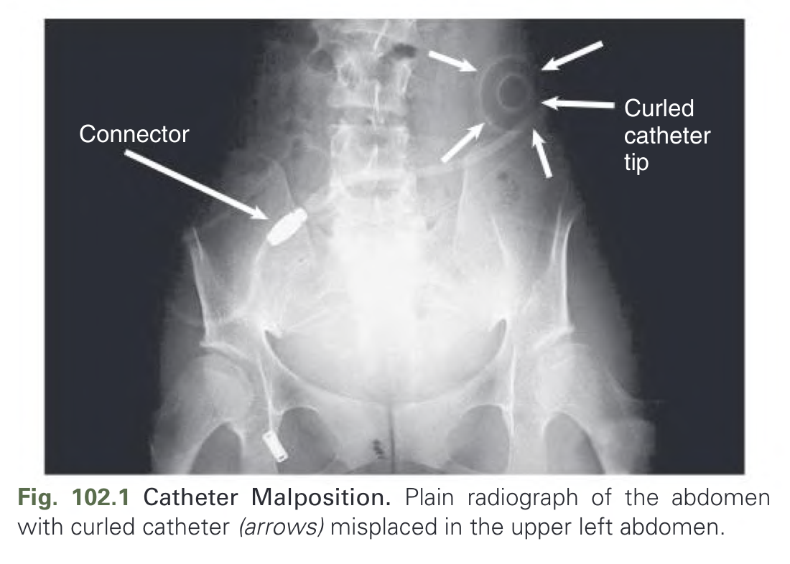

Fig. 102.1 Catheter Malposition. Plain radiograph of the abdomen with curled catheter (arrows) misplaced in the upper left abdomen.

---

### Fig_102_2

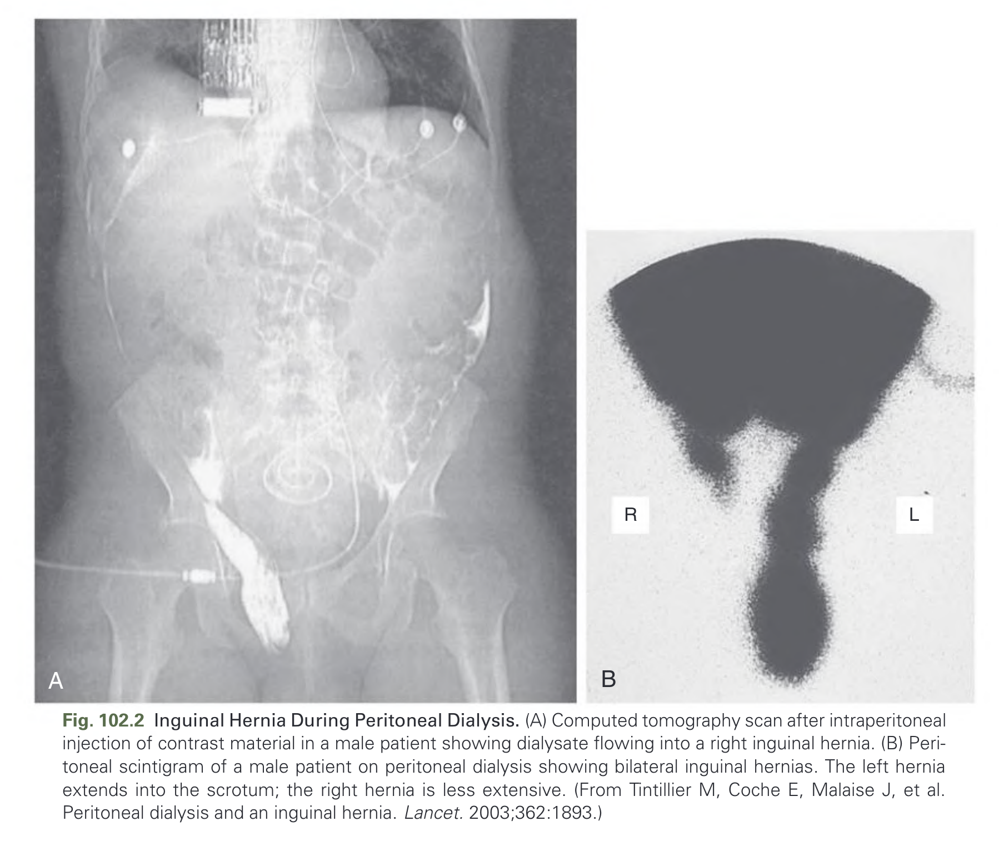

Fig. 102.2 Inguinal Hernia During Peritoneal Dialysis. (A) Computed tomography scan after intraperitoneal injection of contrast material in a male patient showing dialysate flowing into a right inguinal hernia. (B) Peritoneal scintigram of a male patient on peritoneal dialysis showing bilateral inguinal hernias. The left hernia extends into the scrotum; the right hernia is less extensive. (From Tintillier M, Coche E, Malaise J, et al. Peritoneal dialysis and an inguinal hernia. Lancet. 2003;362:1893.)

---

### Fig_102_3

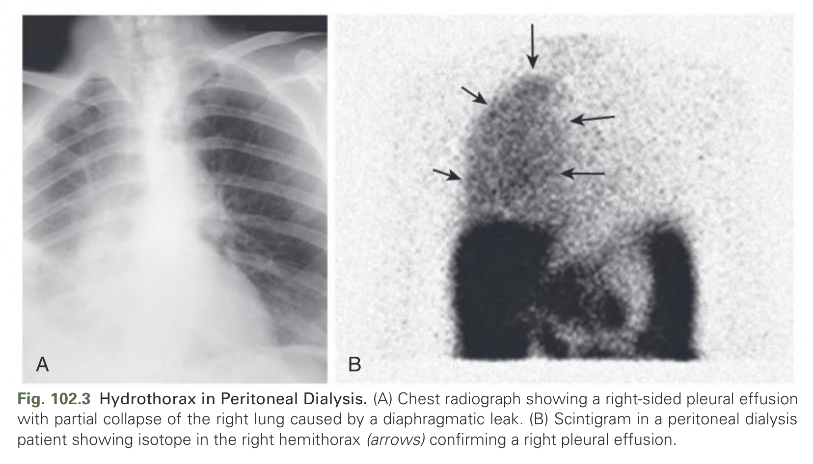

Fig. 102.3 Hydrothorax in Peritoneal Dialysis. (A) Chest radiograph showing a right-sided pleural effusion with partial collapse of the right lung caused by a diaphragmatic leak. (B) Scintigram in a peritoneal dialysis patient showing isotope in the right hemithorax (arrows) confirming a right pleural effusion.

---

### Fig_102_4

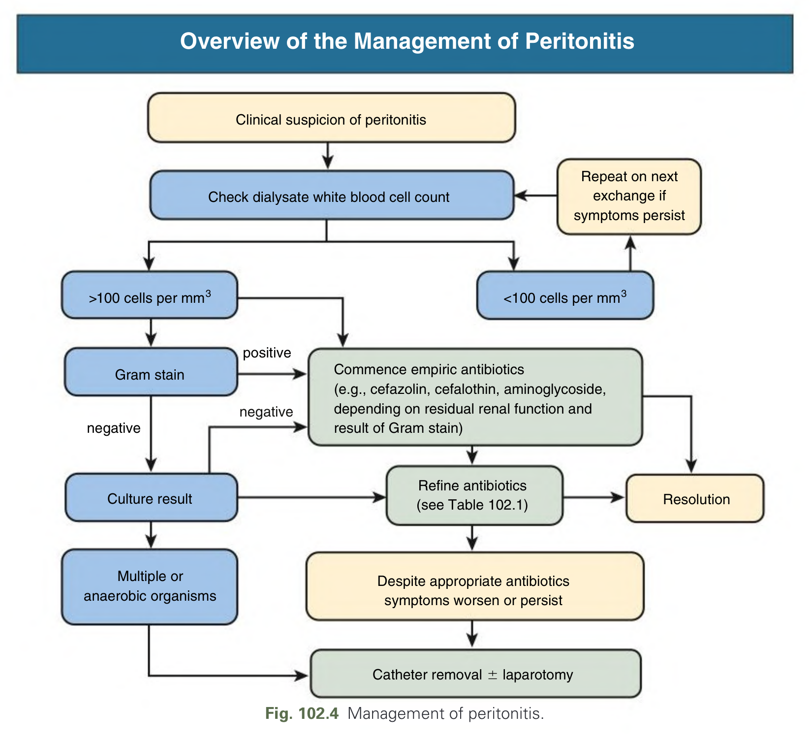

Fig. 102.4 Management of peritonitis.

---

### Fig_102_5

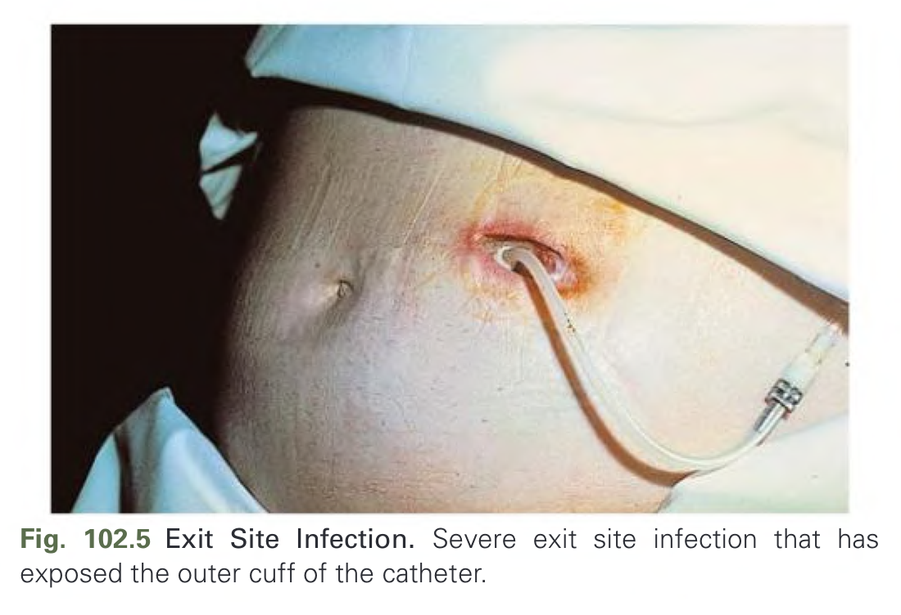

Fig. 102.5 Exit Site Infection. Severe exit site infection that has exposed the outer cuff of the catheter.

---

### Fig_102_6

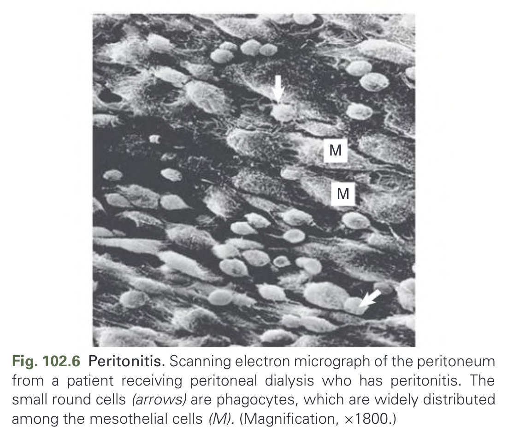

Fig. 102.6 Peritonitis. Scanning electron micrograph of the peritoneum from a patient receiving peritoneal dialysis who has peritonitis. The small round cells (arrows) are phagocytes, which are widely distributed among the mesothelial cells (M). (Magnification, ×1800.)

---

### Fig_102_7

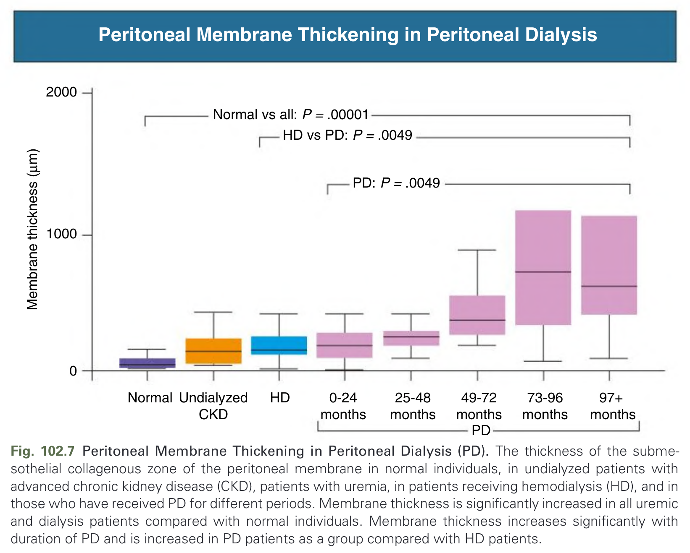

Fig. 102.7 Peritoneal Membrane Thickening in Peritoneal Dialysis (PD). The thickness of the submesothelial collagenous zone of the peritoneal membrane in normal individuals, in undialyzed patients with advanced chronic kidney disease (CKD), patients with uremia, in patients receiving hemodialysis (HD), and in those who have received PD for different periods. Membrane thickness is significantly increased in all uremic and dialysis patients compared with normal individuals. Membrane thickness increases significantly with duration of PD and is increased in PD patients as a group compared with HD patients.

---

### Fig_102_8

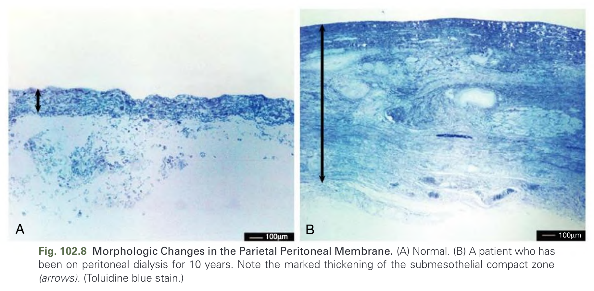

Fig. 102.8 Morphologic Changes in the Parietal Peritoneal Membrane. (A) Normal. (B) A patient who has been on peritoneal dialysis for 10 years. Note the marked thickening of the submesothelial compact zone (arrows). (Toluidine blue stain.)

---

### Fig_102_9

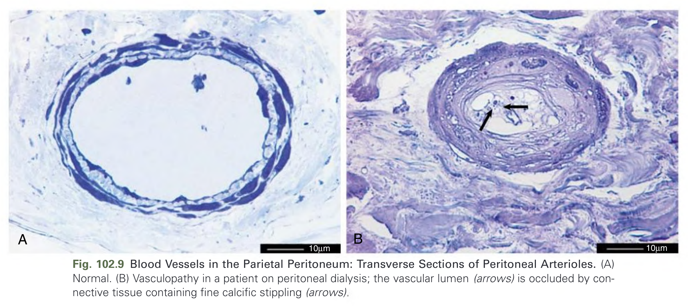

Fig. 102.9 Blood Vessels in the Parietal Peritoneum: Transverse Sections of Peritoneal Arterioles. (A) Normal. (B) Vasculopathy in a patient on peritoneal dialysis; the vascular lumen (arrows) is occluded by connective tissue containing fine calcific stippling (arrows).

---

### Fig_102_10

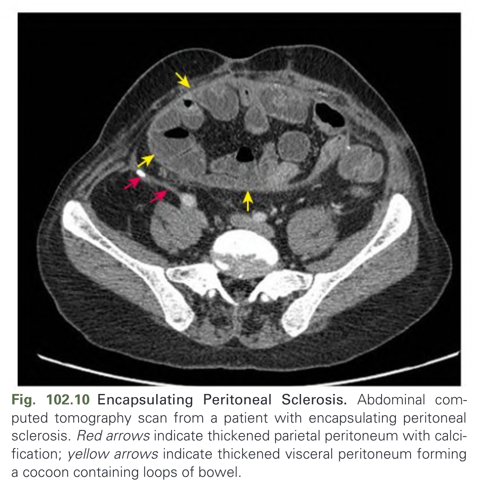

Fig. 102.10 Encapsulating Peritoneal Sclerosis. Abdominal computed tomography scan from a patient with encapsulating peritoneal sclerosis. Red arrows indicate thickened parietal peritoneum with calcification; yellow arrows indicate thickened visceral peritoneum forming a cocoon containing loops of bowel.

---

## Tables

### Table_102_1

#### Table Image

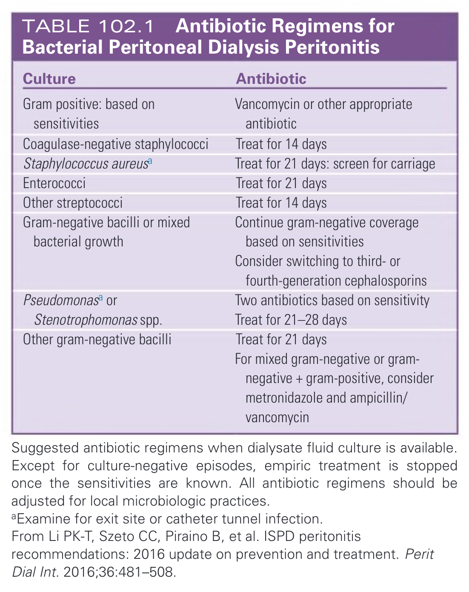

#### Table Data (CSV: [Table_102_1.csv](Table_102_1.csv))

```markdown
| Culture | Antibiotic |
| :--- | :--- |
| Gram positive: based on sensitivities | Vancomycin or other appropriate antibiotic |
| Coagulase-negative staphylococci | Treat for 14 days |
| Staphylococcus aureusa | Treat for 21 days: screen for carriage |
| Enterococci | Treat for 21 days |
| Other streptococci | Treat for 14 days |
| Gram-negative bacilli or mixed bacterial growth | Continue gram-negative coverage based on sensitivities |
| | Consider switching to third- or fourth-generation cephalosporins |
| Pseudomonasa or Stenotrophomonas spp. | Two antibiotics based on sensitivity Treat for 21-28 days |
| Other gram-negative bacilli | Treat for 21 days |
| | For mixed gram-negative or gram-negative + gram-positive, consider metronidazole and ampicillin/vancomycin |

Suggested antibiotic regimens when dialysate fluid culture is available. Except for culture-negative episodes, empiric treatment is stopped once the sensitivities are known. All antibiotic regimens should be adjusted for local microbiologic practices.
aExamine for exit site or catheter tunnel infection.
From Li PK-T, Szeto CC, Piraino B, et al. ISPD peritonitis recommendations: 2016 update on prevention and treatment. Perit Dial Int. 2016;36:481-508.
```

TABLE 102.1 Antibiotic Regimens for Bacterial Peritoneal Dialysis Peritonitis

---

## Boxes

### Box_102_1

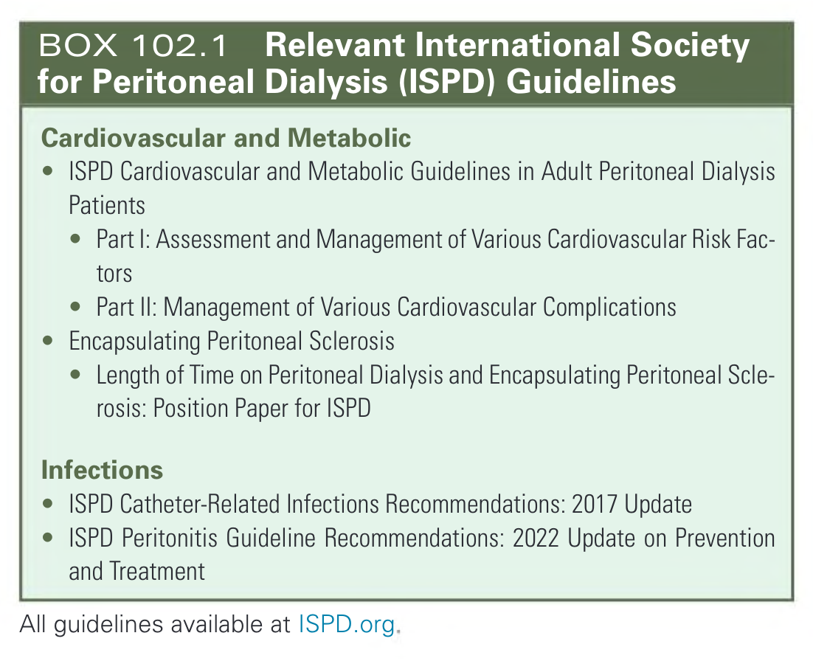

#### Box Text

```markdown
**Cardiovascular and Metabolic**
* ISPD Cardiovascular and Metabolic Guidelines in Adult Peritoneal Dialysis Patients
* Part I: Assessment and Management of Various Cardiovascular Risk Factors
* Part II: Management of Various Cardiovascular Complications
* Encapsulating Peritoneal Sclerosis
* Length of Time on Peritoneal Dialysis and Encapsulating Peritoneal Sclerosis: Position Paper for ISPD

**Infections**
* ISPD Catheter-Related Infections Recommendations: 2017 Update
* ISPD Peritonitis Guideline Recommendations: 2022 Update on Prevention and Treatment

All guidelines available at ISPD.org.
```

BOX 102.1 Relevant International Society for Peritoneal Dialysis (ISPD) Guidelines

---
