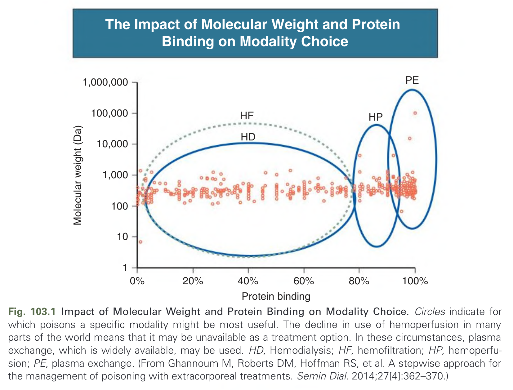
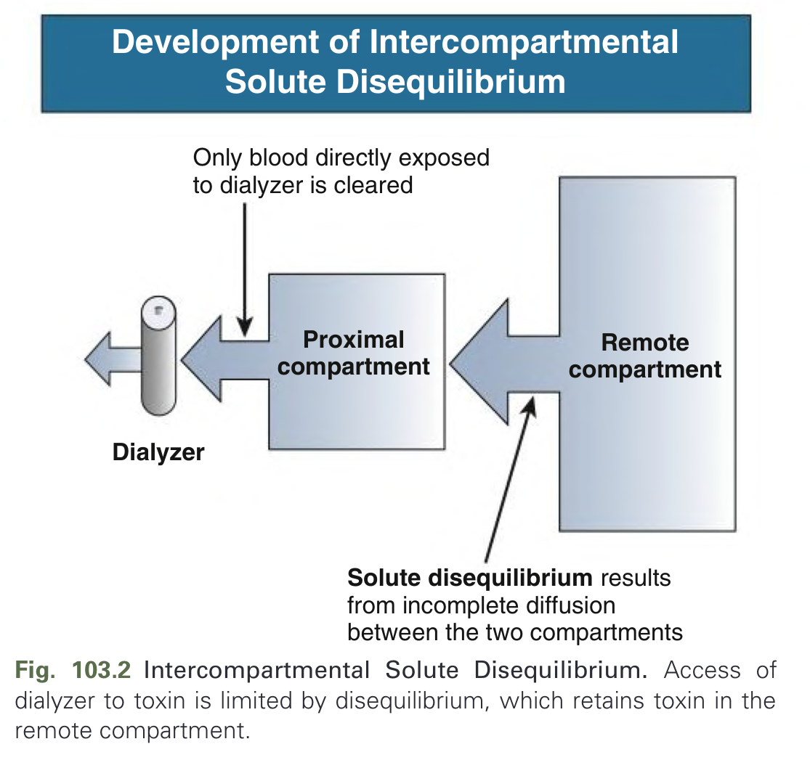
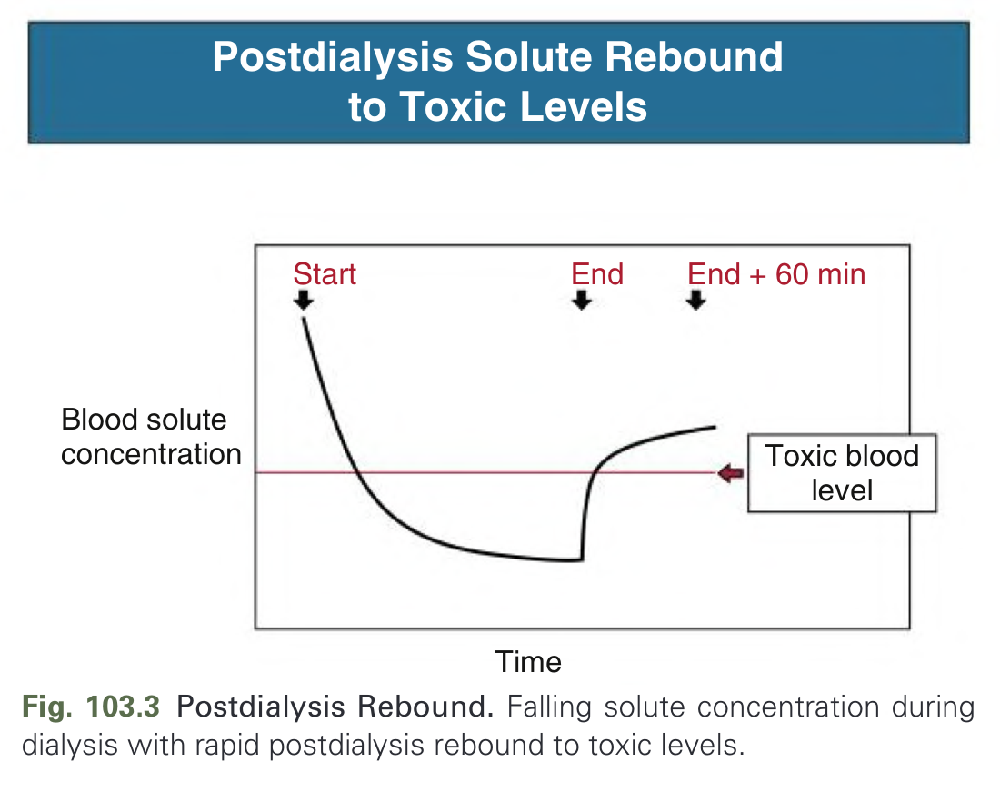
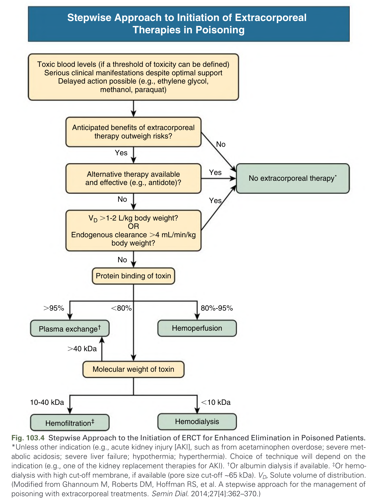
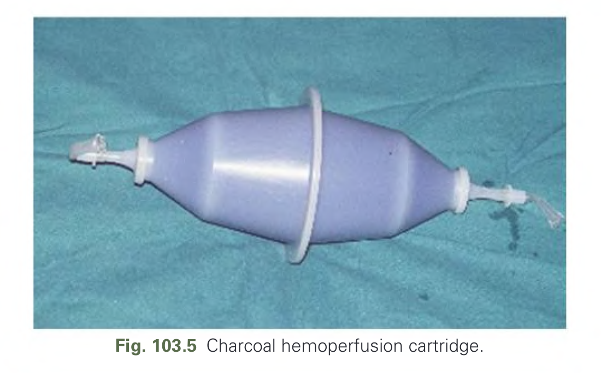
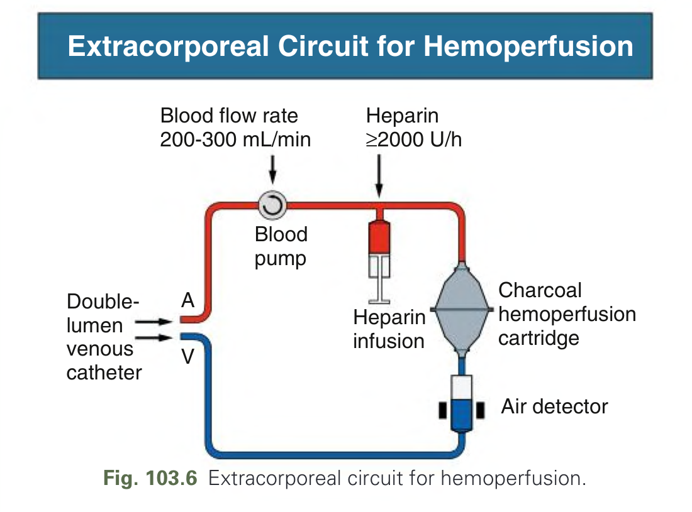
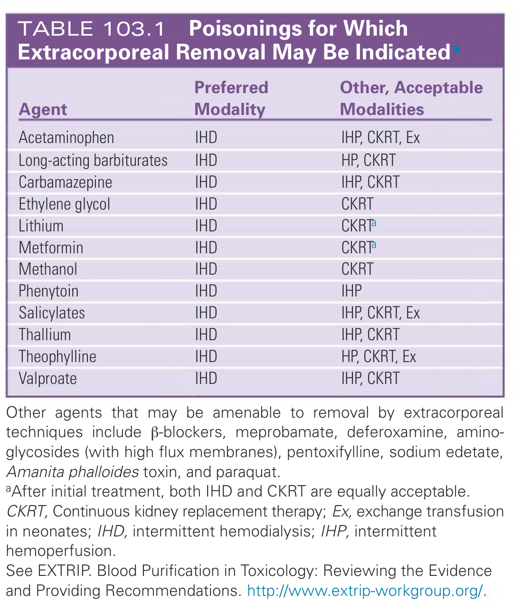
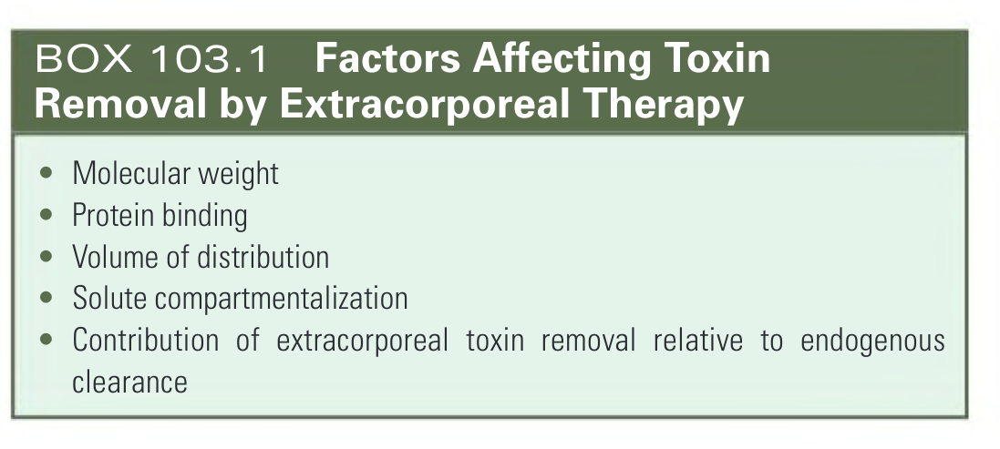
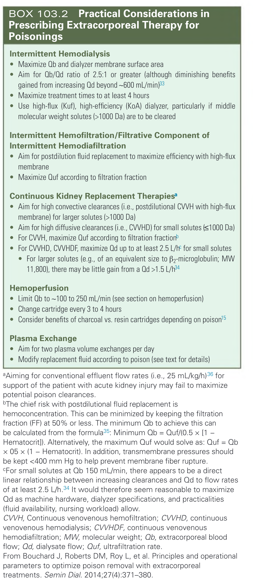

# 103. Extracorporeal Therapies for Drug Overdose and Poisoning - Figures and Tables Index

This document lists all figures, tables and boxes extracted from `103. Extracorporeal Therapies for Drug Overdose and Poisoning.pdf`.

## Table of Contents
- [Figures](#figures)
- [Tables](#tables)
- [Boxes](#boxes)

---

## Figures

### Fig_103_1



Fig. 103.1 Impact of Molecular Weight and Protein Binding on Modality Choice. Circles indicate for which poisons a specific modality might be most useful. The decline in use of hemoperfusion in many parts of the world means that it may be unavailable as a treatment option. In these circumstances, plasma exchange, which is widely available, may be used. HD, Hemodialysis; HF, hemofiltration; HP, hemoperfusion; PE, plasma exchange. (From Ghannoum M, Roberts DM, Hoffman RS, et al. A stepwise approach for the management of poisoning with extracorporeal treatments. Semin Dial. 2014;27[4]:362–370.)

---

### Fig_103_2



Fig. 103.2 Intercompartmental Solute Disequilibrium. Access of dialyzer to toxin is limited by disequilibrium, which retains toxin in the remote compartment.

---

### Fig_103_3



Fig. 103.3 Postdialysis Rebound. Falling solute concentration during dialysis with rapid postdialysis rebound to toxic levels.

---

### Fig_103_4



Fig. 103.4 Stepwise Approach to the Initiation of ERCT for Enhanced Elimination in Poisoned Patients. *Unless other indication (e.g., acute kidney injury [AKI], such as from acetaminophen overdose; severe metabolic acidosis; severe liver failure; hypothermia; hyperthermia). Choice of technique will depend on the indication (e.g., one of the kidney replacement therapies for AKI). †Or albumin dialysis if available. ‡Or hemodialysis with high cut-off membrane, if available (pore size cut-off ~65 kDa). VD, Solute volume of distribution. (Modified from Ghannoum M, Roberts DM, Hoffman RS, et al. A stepwise approach for the management of poisoning with extracorporeal treatments. Semin Dial. 2014;27[4]:362–370.)

---

### Fig_103_5



Fig. 103.5 Charcoal hemoperfusion cartridge.

---

### Fig_103_6



Fig. 103.6 Extracorporeal circuit for hemoperfusion.

---

## Tables

### Table_103_1

#### Table Image



#### Table Data (CSV: [Table_103_1.csv](Table_103_1.csv))

```markdown
| Agent | Preferred Modality | Other, Acceptable Modalities |
| :--- | :--- | :--- |
| Acetaminophen | IHD | IHP, CKRT, Ex |
| Long-acting barbiturates | IHD | HP, CKRT |
| Carbamazepine | IHD | IHP, CKRT |
| Ethylene glycol | IHD | CKRT |
| Lithium | IHD | CKRTa |
| Metformin | IHD | CKRTa |
| Methanol | IHD | CKRT |
| Phenytoin | IHD | IHP |
| Salicylates | IHD | IHP, CKRT, Ex |
| Thallium | IHD | IHP, CKRT |
| Theophylline | IHD | HP, CKRT, Ex |
| Valproate | IHD | IHP, CKRT |

Other agents that may be amenable to removal by extracorporeal techniques include β-blockers, meprobamate, deferoxamine, aminoglycosides (with high flux membranes), pentoxifylline, sodium edetate, Amanita phalloides toxin, and paraquat.
aAfter initial treatment, both IHD and CKRT are equally acceptable.
CKRT, Continuous kidney replacement therapy; Ex, exchange transfusion in neonates; IHD, intermittent hemodialysis; IHP, intermittent hemoperfusion.
See EXTRIP. Blood Purification in Toxicology: Reviewing the Evidence and Providing Recommendations. http://www.extrip-workgroup.org/.
```

TABLE 103.1 Poisonings for Which Extracorporeal Removal May Be Indicateda

---

## Boxes

### Box_103_1



#### Box Text

```markdown
* Molecular weight
* Protein binding
* Volume of distribution
* Solute compartmentalization
* Contribution of extracorporeal toxin removal relative to endogenous clearance
```

BOX 103.1 Factors Affecting Toxin Removal by Extracorporeal Therapy

---

### Box_103_2



#### Box Text

```markdown
**Intermittent Hemodialysis**
* Maximize Qb and dialyzer membrane surface area
* Aim for Qb/Qd ratio of 2.5:1 or greater (although diminishing benefits gained from increasing Qd beyond ~600 mL/min)
* Maximize treatment times to at least 4 hours
* Use high-flux (Kuf), high-efficiency (KoA) dialyzer, particularly if middle molecular weight solutes (>1000 Da) are to be cleared

**Intermittent Hemofiltration/Filtrative Component of Intermittent Hemodiafiltration**
* Aim for postdilution fluid replacement to maximize efficiency with high-flux membrane
* Maximize Quf according to filtration fraction

**Continuous Kidney Replacement Therapies**
* Aim for high convective clearances (i.e., postdilutional CVVH with high-flux membrane) for larger solutes (>1000 Da)
* Aim for high diffusive clearances (i.e., CVVHD) for small solutes (≤1000 Da)
* For CVVH, maximize Quf according to filtration fraction
* For CVVHD, CVVHDF, maximize Qd up to at least 2.5 L/h for small solutes
* For larger solutes (e.g., of an equivalent size to β2-microglobulin; MW 11,800), there may be little gain from a Qd >1.5 L/h

**Hemoperfusion**
* Limit Qb to ~100 to 250 mL/min (see section on hemoperfusion)
* Change cartridge every 3 to 4 hours
* Consider benefits of charcoal vs. resin cartridges depending on poison

**Plasma Exchange**
* Aim for two plasma volume exchanges per day
* Modify replacement fluid according to poison (see text for details)

aAiming for conventional effluent flow rates (i.e., 25 mL/kg/h) for support of the patient with acute kidney injury may fail to maximize potential poison clearances.
bThe chief risk with postdilutional fluid replacement is hemoconcentration. This can be minimized by keeping the filtration fraction (FF) at 50% or less. The minimum Qb to achieve this can be calculated from the formula: Minimum Qb = Quf/(0.5 x [1 - Hematocrit]). Alternatively, the maximum Quf would solve as: Quf = Qb × 0.5 x (1 - Hematocrit). In addition, transmembrane pressures should be kept <400 mm Hg to help prevent membrane fiber rupture.
For small solutes at Qb 150 mL/min, there appears to be a direct linear relationship between increasing clearances and Qd to flow rates of at least 2.5 L/h. It would therefore seem reasonable to maximize Qd as machine hardware, dialyzer specifications, and practicalities (fluid availability, nursing workload) allow.
CVVH, Continuous venovenous hemofiltration; CVVHD, continuous venovenous hemodialysis; CVVHDF, continuous venovenous hemodiafiltration; MW, molecular weight; Qb, extracorporeal blood flow; Qd, dialysate flow; Quf, ultrafiltration rate.
From Bouchard J, Roberts DM, Roy L, et al. Principles and operational parameters to optimize poison removal with extracorporeal treatments. Semin Dial. 2014;27(4):371-380.
```

BOX 103.2 Practical Considerations in Prescribing Extracorporeal Therapy for Poisonings

---
