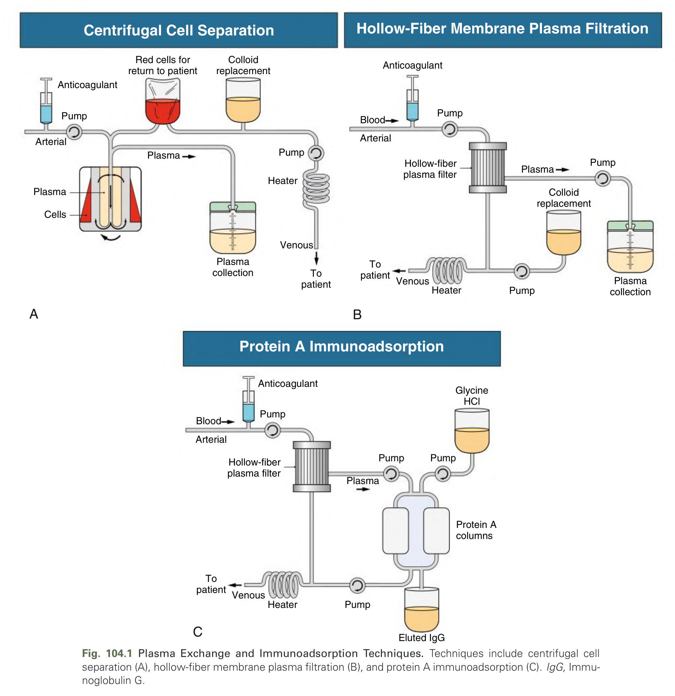
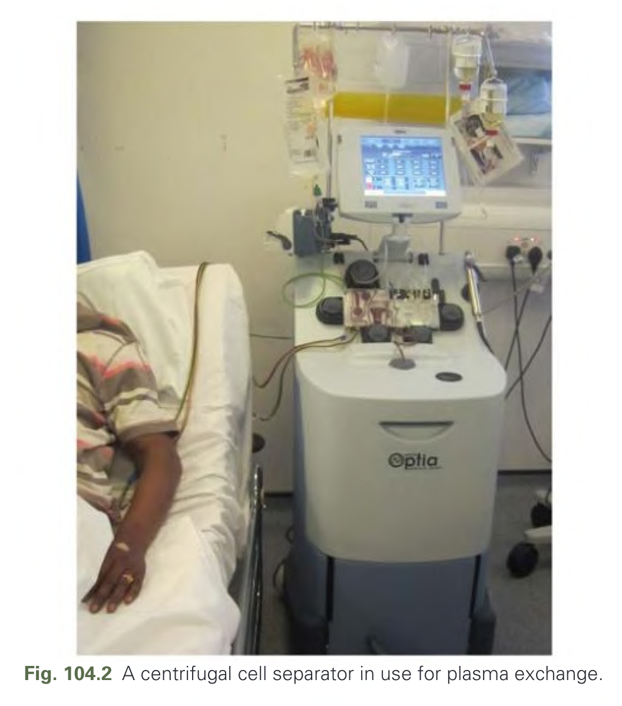
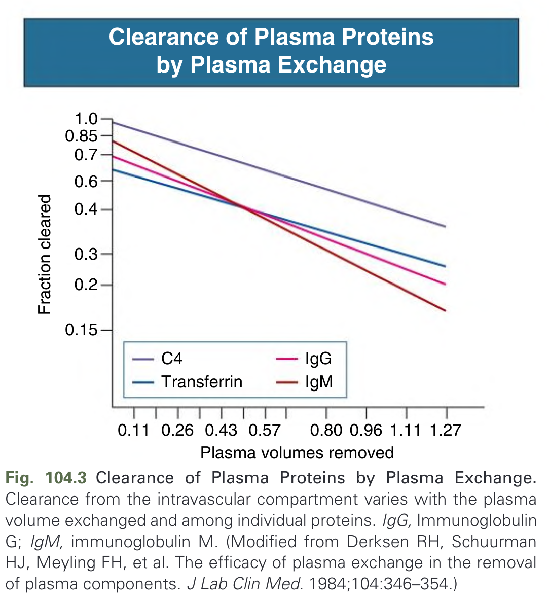
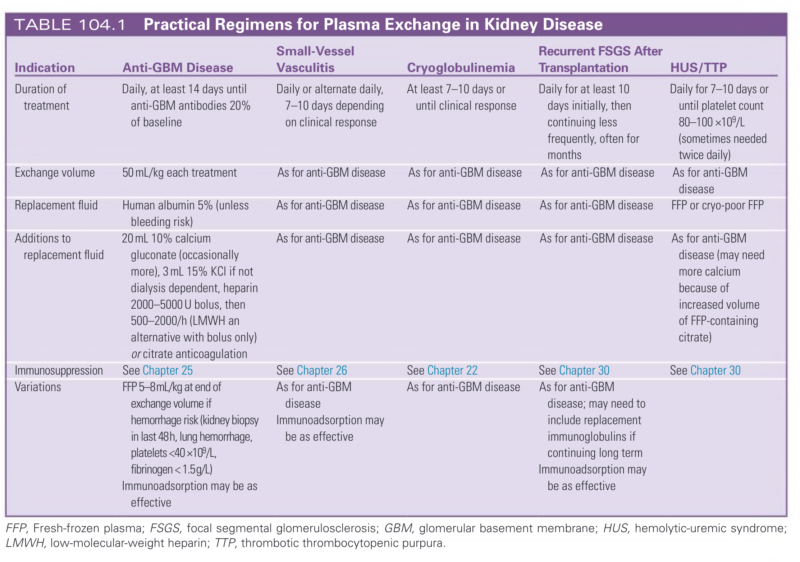
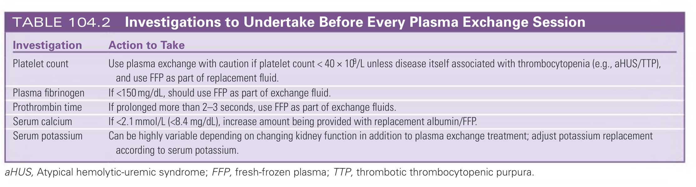
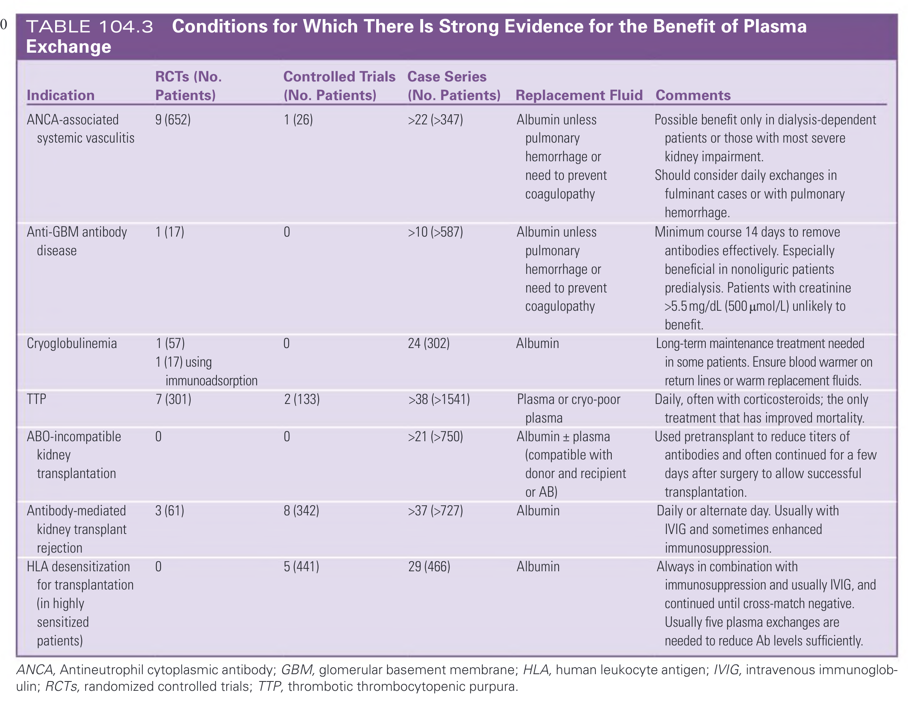
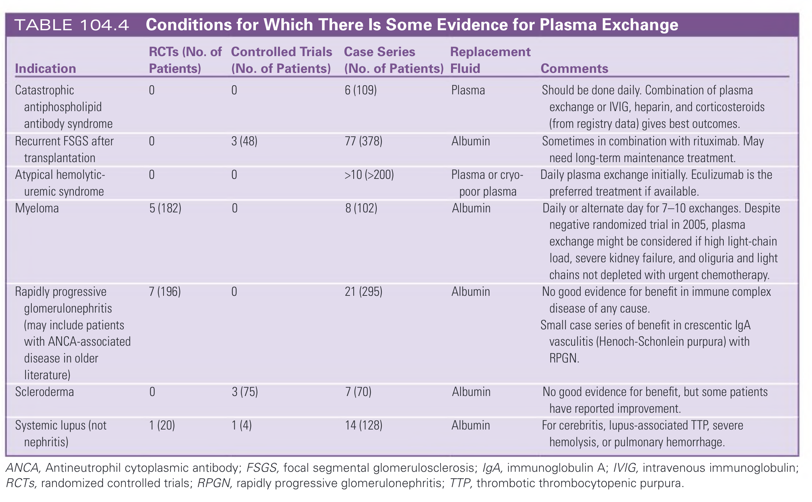

# 104. Plasma Exchange - Figures and Tables Index

This document lists all figures, tables and boxes extracted from `104. Plasma Exchange.pdf`.

## Table of Contents
- [Figures](#figures)
- [Tables](#tables)
- [Boxes](#boxes)

---

## Figures

### Fig_104_1



Fig. 104.1 Plasma Exchange and Immunoadsorption Techniques. Techniques include centrifugal cell separation (A), hollow-fiber membrane plasma filtration (B), and protein A immunoadsorption (C). IgG, Immunoglobulin G.

---

### Fig_104_2



Fig. 104.2 A centrifugal cell separator in use for plasma exchange.

---

### Fig_104_3



Fig. 104.3 Clearance of Plasma Proteins by Plasma Exchange. Clearance from the intravascular compartment varies with the plasma volume exchanged and among individual proteins. IgG, Immunoglobulin G; IgM, immunoglobulin M. (Modified from Derksen RH, Schuurman HJ, Meyling FH, et al. The efficacy of plasma exchange in the removal of plasma components. J Lab Clin Med. 1984;104:346–354.)

---

## Tables

### Table_104_1

#### Table Image



#### Table Data (CSV: [Table_104_1.csv](Table_104_1.csv))

```markdown
| Indication | Anti-GBM Disease | Small-Vessel Vasculitis | Cryoglobulinemia | Recurrent FSGS After Transplantation | HUS/TTP |
| :--- | :--- | :--- | :--- | :--- | :--- |
| **Duration of treatment** | Daily, at least 14 days until anti-GBM antibodies 20% of baseline | Daily or alternate daily, 7-10 days depending on clinical response | At least 7-10 days or until clinical response | Daily for at least 10 days initially, then continuing less frequently, often for months | Daily for 7-10 days or until platelet count 80-100 ×10⁹/L (sometimes needed twice daily) |
| **Exchange volume** | 50 mL/kg each treatment | As for anti-GBM disease | As for anti-GBM disease | As for anti-GBM disease | As for anti-GBM disease |
| **Replacement fluid** | Human albumin 5% (unless bleeding risk) | As for anti-GBM disease | As for anti-GBM disease | As for anti-GBM disease | FFP or cryo-poor FFP |
| **Additions to replacement fluid** | 20 mL 10% calcium gluconate (occasionally more), 3 mL 15% KCl if not dialysis dependent, heparin 2000-5000 U bolus, then 500-2000/h (LMWH an alternative with bolus only) or citrate anticoagulation | As for anti-GBM disease | As for anti-GBM disease | As for anti-GBM disease | As for anti-GBM disease (may need more calcium because of increased volume of FFP-containing citrate) |
| **Immunosuppression** | See Chapter 25 | See Chapter 26 | See Chapter 22 | See Chapter 30 | See Chapter 30 |
| **Variations** | FFP 5-8mL/kg at end of exchange volume if hemorrhage risk (kidney biopsy in last 48h, lung hemorrhage, platelets <40×10⁹/L, fibrinogen <1.5g/L) Immunoadsorption may be as effective | As for anti-GBM disease Immunoadsorption may be as effective | As for anti-GBM disease | As for anti-GBM disease; may need to include replacement immunoglobulins if continuing long term Immunoadsorption may be as effective |  |
*FFP, Fresh-frozen plasma; FSGS, focal segmental glomerulosclerosis; GBM, glomerular basement membrane; HUS, hemolytic-uremic syndrome; LMWH, low-molecular-weight heparin; TTP, thrombotic thrombocytopenic purpura.*
```

TABLE 104.1 Practical Regimens for Plasma Exchange in Kidney Disease

---

### Table_104_2

#### Table Image



#### Table Data (CSV: [Table_104_2.csv](Table_104_2.csv))

```markdown
| Investigation | Action to Take |
| :--- | :--- |
| **Platelet count** | Use plasma exchange with caution if platelet count < 40 × 10⁹/L unless disease itself associated with thrombocytopenia (e.g., aHUS/TTP), and use FFP as part of replacement fluid. |
| **Plasma fibrinogen** | If <150 mg/dL, should use FFP as part of exchange fluid. |
| **Prothrombin time** | If prolonged more than 2-3 seconds, use FFP as part of exchange fluids. |
| **Serum calcium** | If <2.1 mmol/L (<8.4 mg/dL), increase amount being provided with replacement albumin/FFP. |
| **Serum potassium** | Can be highly variable depending on changing kidney function in addition to plasma exchange treatment; adjust potassium replacement according to serum potassium. |
*aHUS, Atypical hemolytic-uremic syndrome; FFP, fresh-frozen plasma; TTP, thrombotic thrombocytopenic purpura.*
```

TABLE 104.2 Investigations to Undertake Before Every Plasma Exchange Session

---

### Table_104_3

#### Table Image



#### Table Data (CSV: [Table_104_3.csv](Table_104_3.csv))

```markdown
| Indication | RCTs (No. Patients) | Controlled Trials (No. Patients) | Case Series (No. Patients) | Replacement Fluid | Comments |
| :--- | :--- | :--- | :--- | :--- | :--- |
| **ANCA-associated systemic vasculitis** | 9 (652) | 1 (26) | >22 (>347) | Albumin unless pulmonary hemorrhage or need to prevent coagulopathy | Possible benefit only in dialysis-dependent patients or those with most severe kidney impairment. Should consider daily exchanges in fulminant cases or with pulmonary hemorrhage. |
| **Anti-GBM antibody disease** | 1 (17) | 0 | >10 (>587) | Albumin unless pulmonary hemorrhage or need to prevent coagulopathy | Minimum course 14 days to remove antibodies effectively. Especially beneficial in nonoliguric patients predialysis. Patients with creatinine >5.5 mg/dL (500 μmol/L) unlikely to benefit. |
| **Cryoglobulinemia** | 1 (57). 1 (17) using immunoadsorption | 0 | 24 (302) | Albumin | Long-term maintenance treatment needed in some patients. Ensure blood warmer on return lines or warm replacement fluids. |
| **TTP** | 7 (301) | 2 (133) | >38 (>1541) | Plasma or cryo-poor plasma | Daily, often with corticosteroids; the only treatment that has improved mortality. |
| **ABO-incompatible kidney transplantation** | 0 | 0 | >21 (>750) | Albumin ± plasma (compatible with donor and recipient or AB) | Used pretransplant to reduce titers of antibodies and often continued for a few days after surgery to allow successful transplantation. |
| **Antibody-mediated kidney transplant rejection** | 3 (61) | 8 (342) | >37 (>727) | Albumin | Daily or alternate day. Usually with IVIG and sometimes enhanced immunosuppression. |
| **HLA desensitization for transplantation (in highly sensitized patients)** | 0 | 5 (441) | 29 (466) | Albumin | Always in combination with immunosuppression and usually IVIG, and continued until cross-match negative. Usually five plasma exchanges are needed to reduce Ab levels sufficiently. |
*ANCA, Antineutrophil cytoplasmic antibody; GBM, glomerular basement membrane; HLA, human leukocyte antigen; IVIG, intravenous immunoglobulin; RCTs, randomized controlled trials; TTP, thrombotic thrombocytopenic purpura.*
```

TABLE 104.3 Conditions for Which There Is Strong Evidence for the Benefit of Plasma Exchange

---

### Table_104_4

#### Table Image



#### Table Data (CSV: [Table_104_4.csv](Table_104_4.csv))

```markdown
| Indication | RCTs (No. of Patients) | Controlled Trials (No. of Patients) | Case Series (No. of Patients) | Replacement Fluid | Comments |
| :--- | :--- | :--- | :--- | :--- | :--- |
| **Catastrophic antiphospholipid antibody syndrome** | 0 | 0 | 6 (109) | Plasma | Should be done daily. Combination of plasma exchange or IVIG, heparin, and corticosteroids (from registry data) gives best outcomes. |
| **Recurrent FSGS after transplantation** | 0 | 3 (48) | 77 (378) | Albumin | Sometimes in combination with rituximab. May need long-term maintenance treatment. |
| **Atypical hemolytic-uremic syndrome** | 0 | 0 | >10 (>200) | Plasma or cryo-poor plasma | Daily plasma exchange initially. Eculizumab is the preferred treatment if available. |
| **Myeloma** | 5 (182) | 0 | 8 (102) | Albumin | Daily or alternate day for 7-10 exchanges. Despite negative randomized trial in 2005, plasma exchange might be considered if high light-chain load, severe kidney failure, and oliguria and light chains not depleted with urgent chemotherapy. |
| **Rapidly progressive glomerulonephritis (may include patients with ANCA-associated disease in older literature)** | 7 (196) | 0 | 21 (295) | Albumin | No good evidence for benefit in immune complex disease of any cause. Small case series of benefit in crescentic IgA vasculitis (Henoch-Schonlein purpura) with RPGN. |
| **Scleroderma** | 0 | 3 (75) | 7 (70) | Albumin | No good evidence for benefit, but some patients have reported improvement. |
| **Systemic lupus (not nephritis)** | 1 (20) | 1 (4) | 14 (128) | Albumin | For cerebritis, lupus-associated TTP, severe hemolysis, or pulmonary hemorrhage. |
*ANCA, Antineutrophil cytoplasmic antibody; FSGS, focal segmental glomerulosclerosis; IgA, immunoglobulin A; IVIG, intravenous immunoglobulin; RCTs, randomized controlled trials; RPGN, rapidly progressive glomerulonephritis; TTP, thrombotic thrombocytopenic purpura.*
```

TABLE 104.4 Conditions for Which There Is Some Evidence for Plasma Exchange

---

## Boxes

*No boxes resolved for this chapter.*
