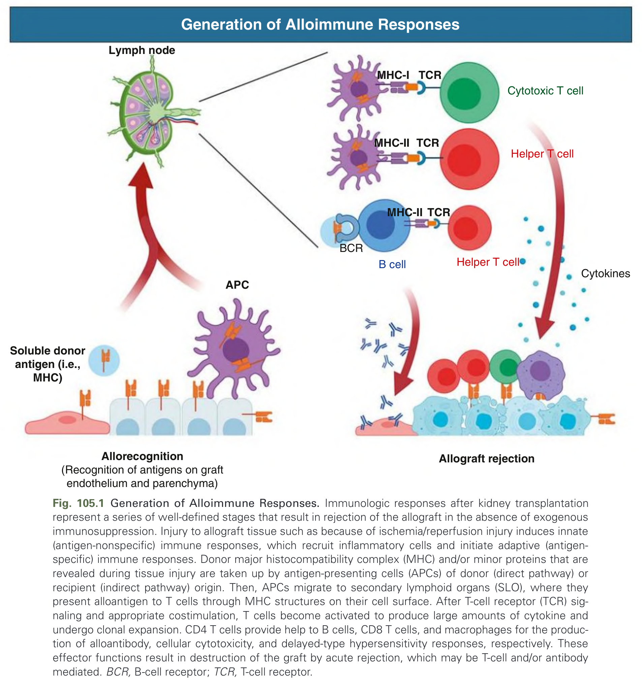
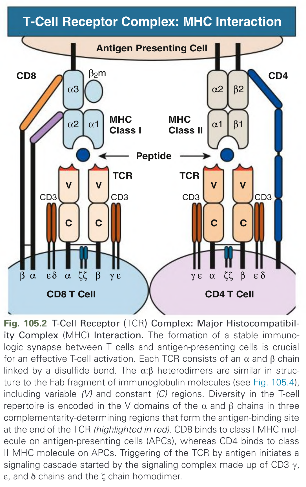
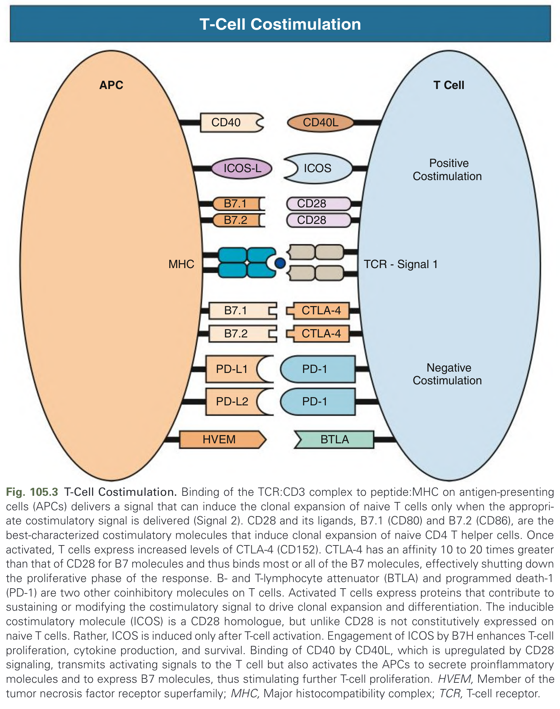
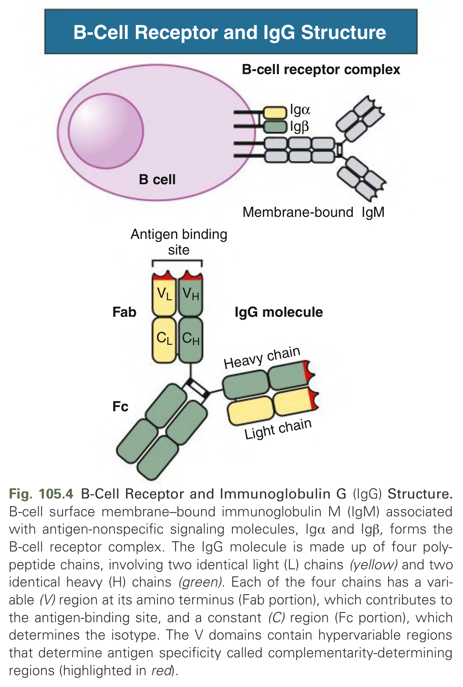
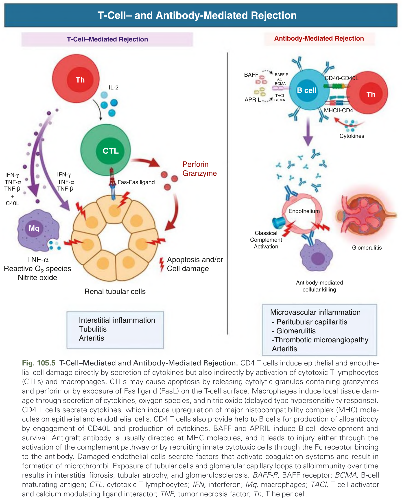
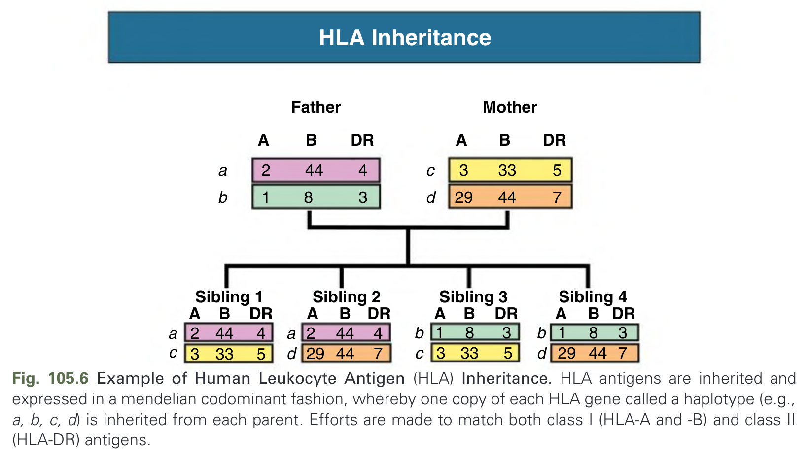
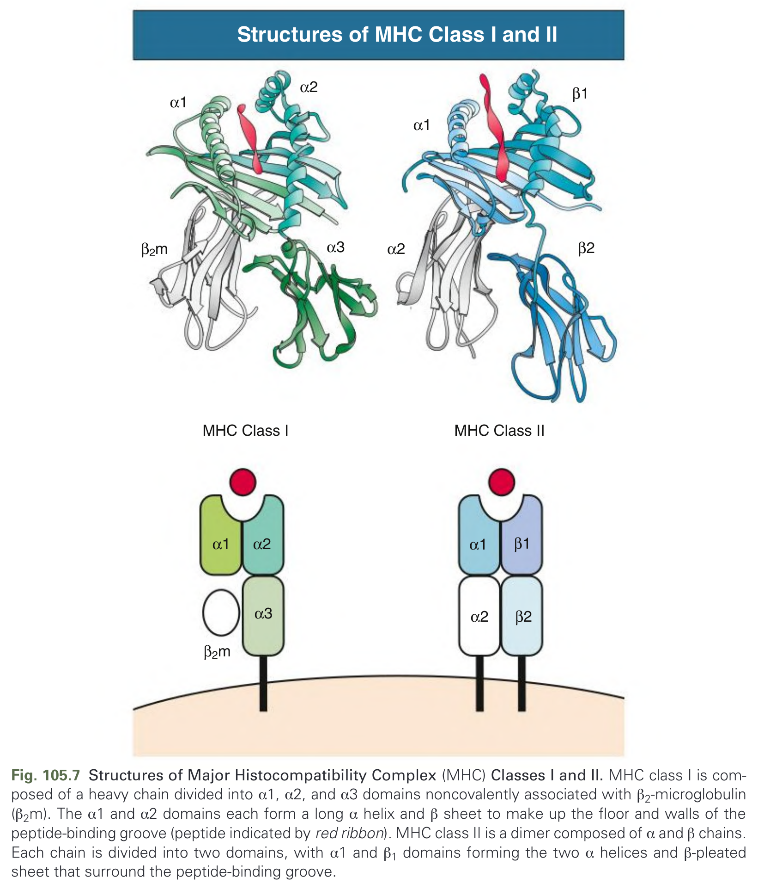
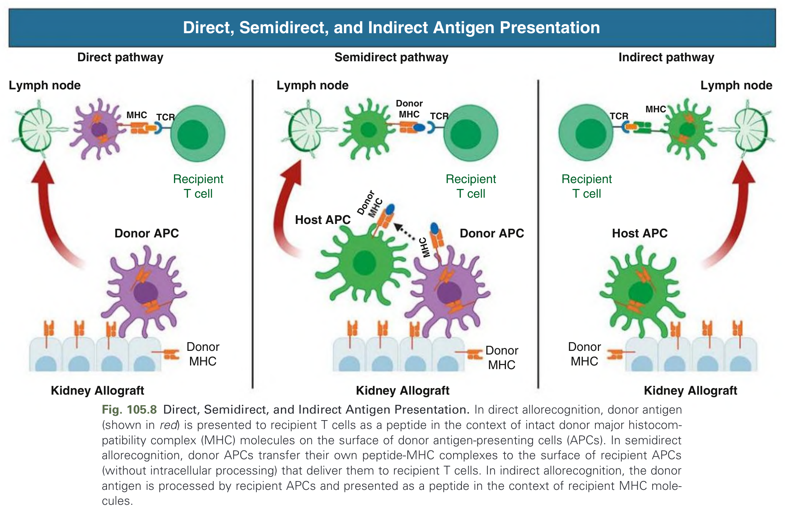
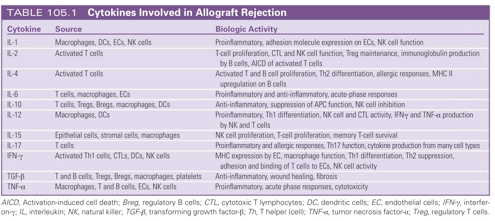
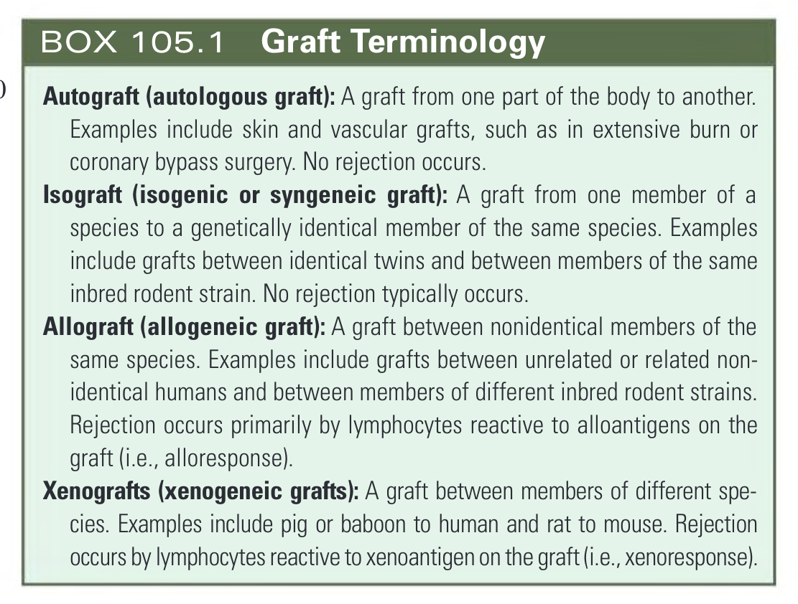

# 105. Immunologic Principles in Kidney Transplantation - Figures and Tables Index

This document lists all figures, tables and boxes extracted from `105. Immunologic Principles in Kidney Transplantation.pdf`.

## Table of Contents
- [Figures](#figures)
- [Tables](#tables)
- [Boxes](#boxes)

---

## Figures

### Fig_105_1



Fig. 105.1 Generation of Alloimmune Responses. Immunologic responses after kidney transplantation represent a series of well-defined stages that result in rejection of the allograft in the absence of exogenous immunosuppression. Injury to allograft tissue such as because of ischemia/reperfusion injury induces innate (antigen-nonspecific) immune responses, which recruit inflammatory cells and initiate adaptive (antigen-specific) immune responses. Donor major histocompatibility complex (MHC) and/or minor proteins that are revealed during tissue injury are taken up by antigen-presenting cells (APCs) of donor (direct pathway) or recipient (indirect pathway) origin. Then, APCs migrate to secondary lymphoid organs (SLO), where they present alloantigen to T cells through MHC structures on their cell surface. After T-cell receptor (TCR) signaling and appropriate costimulation, T cells become activated to produce large amounts of cytokine and undergo clonal expansion. CD4 T cells provide help to B cells, CD8 T cells, and macrophages for the production of alloantibody, cellular cytotoxicity, and delayed-type hypersensitivity responses, respectively. These effector functions result in destruction of the graft by acute rejection, which may be T-cell and/or antibody mediated. BCR, B-cell receptor; TCR, T-cell receptor.

---

### Fig_105_2



Fig. 105.2 T-Cell Receptor (TCR) Complex: Major Histocompatibility Complex (MHC) Interaction. The formation of a stable immunologic synapse between T cells and antigen-presenting cells is crucial for an effective T-cell activation. Each TCR consists of an α and β chain linked by a disulfide bond. The α:β heterodimers are similar in structure to the Fab fragment of immunoglobulin molecules (see Fig. 105.4), including variable (V) and constant (C) regions. Diversity in the T-cell repertoire is encoded in the V domains of the α and β chains in three complementarity-determining regions that form the antigen-binding site at the end of the TCR (highlighted in red). CD8 binds to class I MHC molecule on antigen-presenting cells (APCs), whereas CD4 binds to class II MHC molecule on APCs. Triggering of the TCR by antigen initiates a signaling cascade started by the signaling complex made up of CD3 γ, ε, and δ chains and the ζ chain homodimer.

---

### Fig_105_3



Fig. 105.3 T-Cell Costimulation. Binding of the TCR:CD3 complex to peptide:MHC on antigen-presenting cells (APCs) delivers a signal that can induce the clonal expansion of naive T cells only when the appropriate costimulatory signal is delivered (Signal 2). CD28 and its ligands, B7.1 (CD80) and B7.2 (CD86), are the best-characterized costimulatory molecules that induce clonal expansion of naive CD4 T helper cells. Once activated, T cells express increased levels of CTLA-4 (CD152). CTLA-4 has an affinity 10 to 20 times greater than that of CD28 for B7 molecules and thus binds most or all of the B7 molecules, effectively shutting down the proliferative phase of the response. B- and T-lymphocyte attenuator (BTLA) and programmed death-1 (PD-1) are two other coinhibitory molecules on T cells. Activated T cells express proteins that contribute to sustaining or modifying the costimulatory signal to drive clonal expansion and differentiation. The inducible costimulatory molecule (ICOS) is a CD28 homologue, but unlike CD28 is not constitutively expressed on naive T cells. Rather, ICOS is induced only after T-cell activation. Engagement of ICOS by B7H enhances T-cell proliferation, cytokine production, and survival. Binding of CD40 by CD40L, which is upregulated by CD28 signaling, transmits activating signals to the T cell but also activates the APCs to secrete proinflammatory molecules and to express B7 molecules, thus stimulating further T-cell proliferation. HVEM, Member of the tumor necrosis factor receptor superfamily; MHC, Major histocompatibility complex; TCR, T-cell receptor.

---

### Fig_105_4



Fig. 105.4 B-Cell Receptor and Immunoglobulin G (IgG) Structure. B-cell surface membrane–bound immunoglobulin M (IgM) associated with antigen-nonspecific signaling molecules, Igα and Igβ, forms the B-cell receptor complex. The IgG molecule is made up of four polypeptide chains, involving two identical light (L) chains (yellow) and two identical heavy (H) chains (green). Each of the four chains has a variable (V) region at its amino terminus (Fab portion), which contributes to the antigen-binding site, and a constant (C) region (Fc portion), which determines the isotype. The V domains contain hypervariable regions that determine antigen specificity called complementarity-determining regions (highlighted in red).

---

### Fig_105_5



Fig. 105.5 T-Cell–Mediated and Antibody-Mediated Rejection. CD4 T cells induce epithelial and endothelial cell damage directly by secretion of cytokines but also indirectly by activation of cytotoxic T lymphocytes (CTLs) and macrophages. CTLs may cause apoptosis by releasing cytolytic granules containing granzymes and perforin or by exposure of Fas ligand (FasL) on the T-cell surface. Macrophages induce local tissue damage through secretion of cytokines, oxygen species, and nitric oxide (delayed-type hypersensitivity response). CD4 T cells secrete cytokines, which induce upregulation of major histocompatibility complex (MHC) molecules on epithelial and endothelial cells. CD4 T cells also provide help to B cells for production of alloantibody by engagement of CD40L and production of cytokines. BAFF and APRIL induce B-cell development and survival. Antigraft antibody is usually directed at MHC molecules, and it leads to injury either through the activation of the complement pathway or by recruiting innate cytotoxic cells through the Fc receptor binding to the antibody. Damaged endothelial cells secrete factors that activate coagulation systems and result in formation of microthrombi. Exposure of tubular cells and glomerular capillary loops to alloimmunity over time results in interstitial fibrosis, tubular atrophy, and glomerulosclerosis. BAFF-R, BAFF receptor; BCMA, B-cell maturing antigen; CTL, cytotoxic T lymphocytes; IFN, interferon; Mq, macrophages; TACI, T cell activator and calcium modulating ligand interactor; TNF, tumor necrosis factor; Th, T helper cell.

---

### Fig_105_6



Fig. 105.6 Example of Human Leukocyte Antigen (HLA) Inheritance. HLA antigens are inherited and expressed in a mendelian codominant fashion, whereby one copy of each HLA gene called a haplotype (e.g., a, b, c, d) is inherited from each parent. Efforts are made to match both class I (HLA-A and -B) and class II (HLA-DR) antigens.

---

### Fig_105_7



Fig. 105.7 Structures of Major Histocompatibility Complex (MHC) Classes I and II. MHC class I is composed of a heavy chain divided into α1, α2, and α3 domains noncovalently associated with β2-microglobulin (β2m). The α1 and α2 domains each form a long α helix and β sheet to make up the floor and walls of the peptide-binding groove (peptide indicated by red ribbon). MHC class II is a dimer composed of α and β chains. Each chain is divided into two domains, with α1 and β1 domains forming the two α helices and β-pleated sheet that surround the peptide-binding groove.

---

### Fig_105_8



Fig. 105.8 Direct, Semidirect, and Indirect Antigen Presentation. In direct allorecognition, donor antigen (shown in red) is presented to recipient T cells as a peptide in the context of intact donor major histocompatibility complex (MHC) molecules on the surface of donor antigen-presenting cells (APCs). In semidirect allorecognition, donor APCs transfer their own peptide-MHC complexes to the surface of recipient APCs (without intracellular processing) that deliver them to recipient T cells. In indirect allorecognition, the donor antigen is processed by recipient APCs and presented as a peptide in the context of recipient MHC molecules.

---

## Tables

### Table_105_1

#### Table Image



#### Table Data (CSV: [Table_105_1.csv](Table_105_1.csv))

```markdown
| Cytokine | Source | Biologic Activity |
| :--- | :--- | :--- |
| IL-1 | Macrophages, DCs, ECs, NK cells | Proinflammatory, adhesion molecule expression on ECs, NK cell function |
| IL-2 | Activated T cells | T-cell proliferation, CTL and NK cell function, Treg maintenance, immunoglobulin production by B cells, AICD of activated T cells |
| IL-4 | Activated T cells | Activated T and B cell proliferation, Th2 differentiation, allergic responses, MHC II upregulation on B cells |
| IL-6 | T cells, macrophages, ECs | Proinflammatory and anti-inflammatory, acute-phase responses |
| IL-10 | T cells, Tregs, Bregs, macrophages, DCs | Anti-inflammatory, suppression of APC function, NK cell inhibition |
| IL-12 | Macrophages, DCs | Proinflammatory, Th1 differentiation, NK cell and CTL activity, IFN-γ and TNF-α production by NK and T cells |
| IL-15 | Epithelial cells, stromal cells, macrophages | NK cell proliferation, T-cell proliferation, memory T-cell survival |
| IL-17 | T cells | Proinflammatory and allergic responses, Th17 function, cytokine production from many cell types |
| IFN-γ | Activated Th1 cells, CTLs, DCs, NK cells | MHC expression by EC, macrophage function, Th1 differentiation, Th2 suppression, adhesion and binding of T cells to ECs, NK cell activity |
| TGF-β | T and B cells, Tregs, Bregs, macrophages, platelets | Anti-inflammatory, wound healing, fibrosis |
| TNF-α | Macrophages, T and B cells, ECs, NK cells | Proinflammatory, acute phase responses, cytotoxicity |

AICD, Activation-induced cell death; Breg, regulatory B cells; CTL, cytotoxic T lymphocytes; DC, dendritic cells; EC, endothelial cells; IFN-γ, interferon-γ; IL, interleukin; NK, natural killer; TGF-β, transforming growth factor-β; Th, T helper (cell); TNF-α, tumor necrosis factor-α; Treg, regulatory T cells.
```

TABLE 105.1 Cytokines Involved in Allograft Rejection

---

## Boxes

### Box_105_1



#### Box Text

```markdown
**Autograft (autologous graft):** A graft from one part of the body to another. Examples include skin and vascular grafts, such as in extensive burn or coronary bypass surgery. No rejection occurs.
**Isograft (isogenic or syngeneic graft):** A graft from one member of a species to a genetically identical member of the same species. Examples include grafts between identical twins and between members of the same inbred rodent strain. No rejection typically occurs.
**Allograft (allogeneic graft):** A graft between nonidentical members of the same species. Examples include grafts between unrelated or related non-identical humans and between members of different inbred rodent strains. Rejection occurs primarily by lymphocytes reactive to alloantigens on the graft (i.e., alloresponse).
**Xenografts (xenogeneic grafts):** A graft between members of different species. Examples include pig or baboon to human and rat to mouse. Rejection occurs by lymphocytes reactive to xenoantigen on the graft (i.e., xenoresponse).
```

BOX 105.1 Graft Terminology

---
