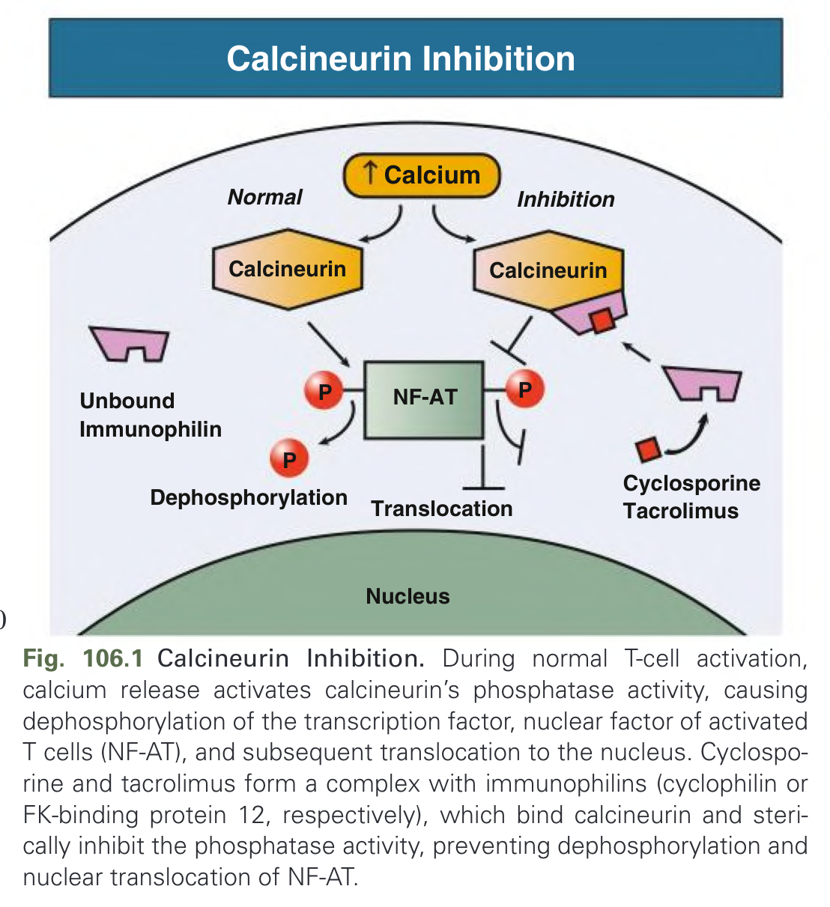
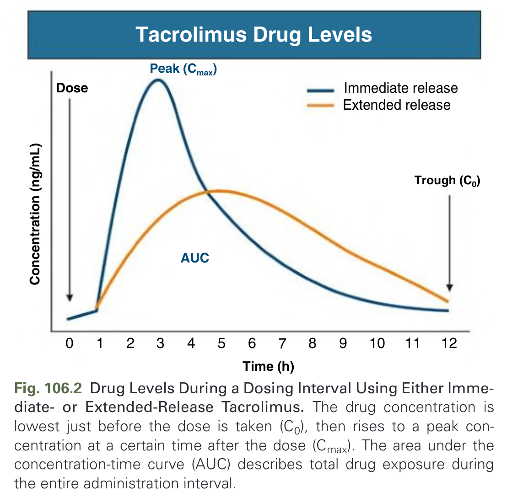
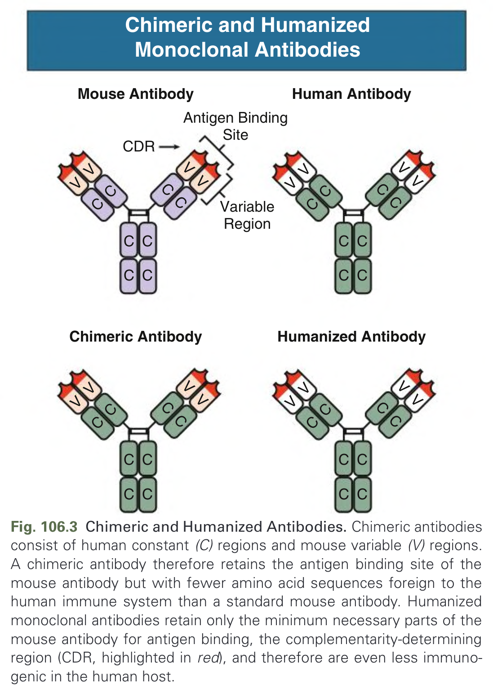
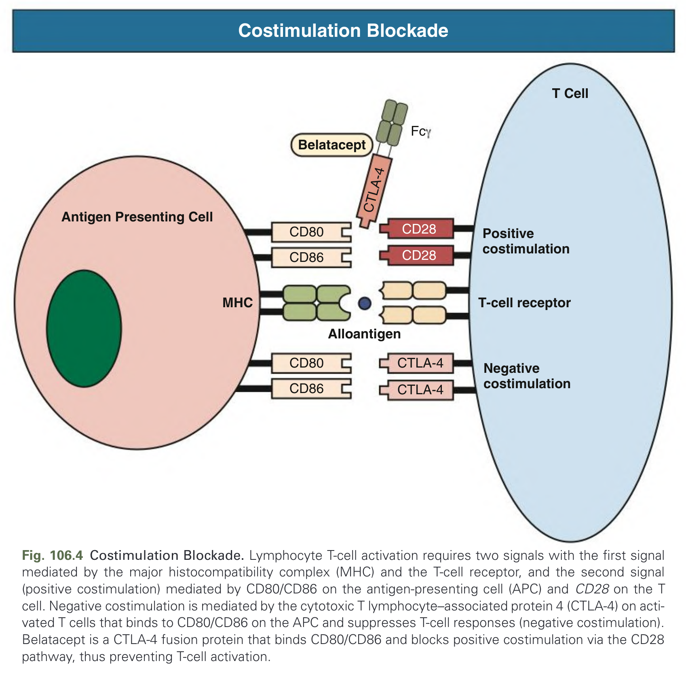
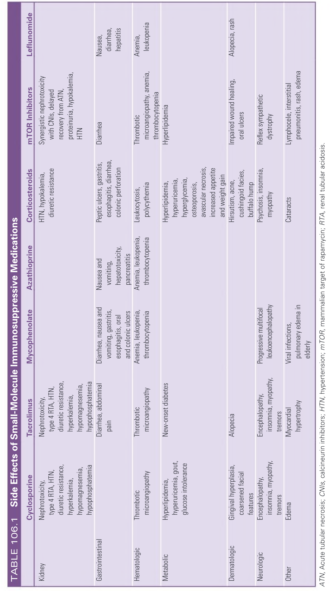
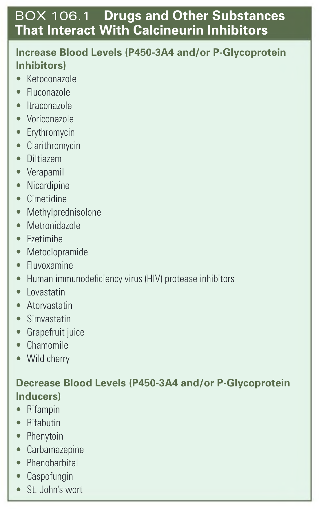
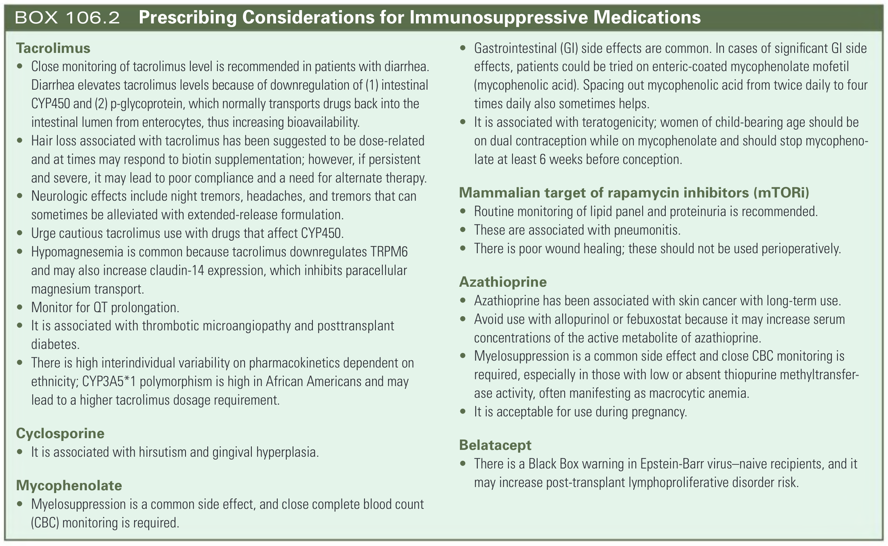

# 106. Immunosuppressive Medications in Kidney Transplantation - Figures and Tables Index

This document lists all figures, tables and boxes extracted from `106. Immunosuppressive Medications in Kidney Transplantation.pdf`.

## Table of Contents
- [Figures](#figures)
- [Tables](#tables)
- [Boxes](#boxes)

---

## Figures

### Fig_106_1



Fig. 106.1 Calcineurin Inhibition. During normal T-cell activation, calcium release activates calcineurin’s phosphatase activity, causing dephosphorylation of the transcription factor, nuclear factor of activated T cells (NF-AT), and subsequent translocation to the nucleus. Cyclosporine and tacrolimus form a complex with immunophilins (cyclophilin or FK-binding protein 12, respectively), which bind calcineurin and sterically inhibit the phosphatase activity, preventing dephosphorylation and nuclear translocation of NF-AT.

---

### Fig_106_2



Fig. 106.2 Drug Levels During a Dosing Interval Using Either Immediate- or Extended-Release Tacrolimus. The drug concentration is lowest just before the dose is taken (C0), then rises to a peak concentration at a certain time after the dose (Cmax). The area under the concentration-time curve (AUC) describes total drug exposure during the entire administration interval.

---

### Fig_106_3



Fig. 106.3 Chimeric and Humanized Antibodies. Chimeric antibodies consist of human constant (C) regions and mouse variable (V) regions. A chimeric antibody therefore retains the antigen binding site of the mouse antibody but with fewer amino acid sequences foreign to the human immune system than a standard mouse antibody. Humanized monoclonal antibodies retain only the minimum necessary parts of the mouse antibody for antigen binding, the complementarity-determining region (CDR, highlighted in red), and therefore are even less immunogenic in the human host.

---

### Fig_106_4



Fig. 106.4 Costimulation Blockade. Lymphocyte T-cell activation requires two signals with the first signal mediated by the major histocompatibility complex (MHC) and the T-cell receptor, and the second signal (positive costimulation) mediated by CD80/CD86 on the antigen-presenting cell (APC) and CD28 on the T cell. Negative costimulation is mediated by the cytotoxic T lymphocyte–associated protein 4 (CTLA-4) on activated T cells that binds to CD80/CD86 on the APC and suppresses T-cell responses (negative costimulation). Belatacept is a CTLA-4 fusion protein that binds CD80/CD86 and blocks positive costimulation via the CD28 pathway, thus preventing T-cell activation.

---

## Tables

### Table_106_1

#### Table Image



#### Table Data (CSV: [Table_106_1.csv](Table_106_1.csv))

```markdown
| | Cyclosporine | Tacrolimus | Mycophenolate | Azathioprine | Corticosteroids | mTOR Inhibitors | Leflunomide |
| :--- | :--- | :--- | :--- | :--- | :--- | :--- | :--- |
| **Kidney** | Nephrotoxicity, type 4 RTA, HTN, diuretic resistance, hyperkalemia, hypomagnesemia, hypophosphatemia | Nephrotoxicity, type 4 RTA, HTN, diuretic resistance, hyperkalemia, hypomagnesemia, hypophosphatemia | | | HTN, hypokalemia, diuretic resistance | Synergistic nephrotoxicity with CNIs, delayed recovery from ATN, proteinuria, hypokalemia, HTN | |
| **Gastrointestinal** | | Diarrhea, abdominal pain | Diarrhea, nausea and vomiting, gastritis, esophagitis, oral and colonic ulcers | Nausea and vomiting, hepatotoxicity, pancreatitis | Peptic ulcers, gastritis, esophagitis, diarrhea, colonic perforation | Diarrhea | Nausea, diarrhea, hepatitis |
| **Hematologic** | Thrombotic microangiopathy | Thrombotic microangiopathy | Anemia, leukopenia, thrombocytopenia | Anemia, leukopenia, thrombocytopenia | Leukocytosis, polycythemia | Thrombotic microangiopathy, anemia, thrombocytopenia | Anemia, leukopenia |
| **Metabolic** | Hyperlipidemia, hyperuricemia, gout, glucose intolerance | New-onset diabetes | | | Hyperlipidemia, hyperuricemia, hyperglycemia, osteoporosis, avascular necrosis, increased appetite and weight gain | Hyperlipidemia | |
| **Dermatologic** | Gingival hyperplasia, coarsened facial features | Alopecia | | | Hirsutism, acne, cushingoid facies, buffalo hump | Impaired wound healing, oral ulcers | Alopecia, rash |
| **Neurologic** | Encephalopathy, insomnia, myopathy, tremors | Encephalopathy, insomnia, myopathy, tremors | Progressive multifocal leukoencephalopathy | | Psychosis, insomnia, myopathy | Reflex sympathetic dystrophy | |
| **Other** | Edema | Myocardial hypertrophy | Viral infections, pulmonary edema in elderly | | Cataracts | Lymphocele, interstitial pneumonitis, rash, edema | |

ATN, Acute tubular necrosis; CNIs, calcineurin inhibitors; HTN, hypertension; mTOR, mammalian target of rapamycin; RTA, renal tubular acidosis.
```

TABLE 106.1 Side Effects of Small-Molecule Immunosuppressive Medications
ATN, Acute tubular necrosis; CNIs, calcineurin inhibitors; HTN, hypertension; mTOR, mammalian target of rapamycin; RTA, renal tubular acidosis.

---

## Boxes

### Box_106_1



#### Box Text

```markdown
**Increase Blood Levels (P450-3A4 and/or P-Glycoprotein Inhibitors)**
* Ketoconazole
* Fluconazole
* Itraconazole
* Voriconazole
* Erythromycin
* Clarithromycin
* Diltiazem
* Verapamil
* Nicardipine
* Cimetidine
* Methylprednisolone
* Metronidazole
* Ezetimibe
* Metoclopramide
* Fluvoxamine
* Human immunodeficiency virus (HIV) protease inhibitors
* Lovastatin
* Atorvastatin
* Simvastatin
* Grapefruit juice
* Chamomile
* Wild cherry

**Decrease Blood Levels (P450-3A4 and/or P-Glycoprotein Inducers)**
* Rifampin
* Rifabutin
* Phenytoin
* Carbamazepine
* Phenobarbital
* Caspofungin
* St. John's wort
```

BOX 106.1 Drugs and Other Substances That Interact With Calcineurin Inhibitors

---

### Box_106_2



#### Box Text

```markdown
**Tacrolimus**
* Close monitoring of tacrolimus level is recommended in patients with diarrhea. Diarrhea elevates tacrolimus levels because of downregulation of (1) intestinal CYP450 and (2) p-glycoprotein, which normally transports drugs back into the intestinal lumen from enterocytes, thus increasing bioavailability.
* Hair loss associated with tacrolimus has been suggested to be dose-related and at times may respond to biotin supplementation; however, if persistent and severe, it may lead to poor compliance and a need for alternate therapy.
* Neurologic effects include night tremors, headaches, and tremors that can sometimes be alleviated with extended-release formulation.
* Urge cautious tacrolimus use with drugs that affect CYP450.
* Hypomagnesemia is common because tacrolimus downregulates TRPM6 and may also increase claudin-14 expression, which inhibits paracellular magnesium transport.
* Monitor for QT prolongation.
* It is associated with thrombotic microangiopathy and posttransplant diabetes.
* There is high interindividual variability on pharmacokinetics dependent on ethnicity; CYP3A5*1 polymorphism is high in African Americans and may lead to a higher tacrolimus dosage requirement.

**Cyclosporine**
* It is associated with hirsutism and gingival hyperplasia.

**Mycophenolate**
* Myelosuppression is a common side effect, and close complete blood count (CBC) monitoring is required.
* Gastrointestinal (GI) side effects are common. In cases of significant Gl side effects, patients could be tried on enteric-coated mycophenolate mofetil (mycophenolic acid). Spacing out mycophenolic acid from twice daily to four times daily also sometimes helps.
* It is associated with teratogenicity; women of child-bearing age should be on dual contraception while on mycophenolate and should stop mycophenolate at least 6 weeks before conception.

**Mammalian target of rapamycin inhibitors (mTORI)**
* Routine monitoring of lipid panel and proteinuria is recommended.
* These are associated with pneumonitis.
* There is poor wound healing; these should not be used perioperatively.

**Azathioprine**
* Azathioprine has been associated with skin cancer with long-term use.
* Avoid use with allopurinol or febuxostat because it may increase serum concentrations of the active metabolite of azathioprine.
* Myelosuppression is a common side effect and close CBC monitoring is required, especially in those with low or absent thiopurine methyltransferase activity, often manifesting as macrocytic anemia.
* It is acceptable for use during pregnancy.

**Belatacept**
* There is a Black Box warning in Epstein-Barr virus-naive recipients, and it may increase post-transplant lymphoproliferative disorder risk.
```

BOX 106.2 Prescribing Considerations for Immunosuppressive Medications

---
