# 107. Evaluation and Preoperative Management of Kidney Transplant Recipient and Donor - Figures and Tables Index

This document lists all figures, tables and boxes extracted from `107. Evaluation and Preoperative Management of Kidney Transplant Recipient and Donor.pdf`.

## Table of Contents
- [Figures](#figures)
- [Tables](#tables)
- [Boxes](#boxes)

---

## Figures

### Fig_107_1

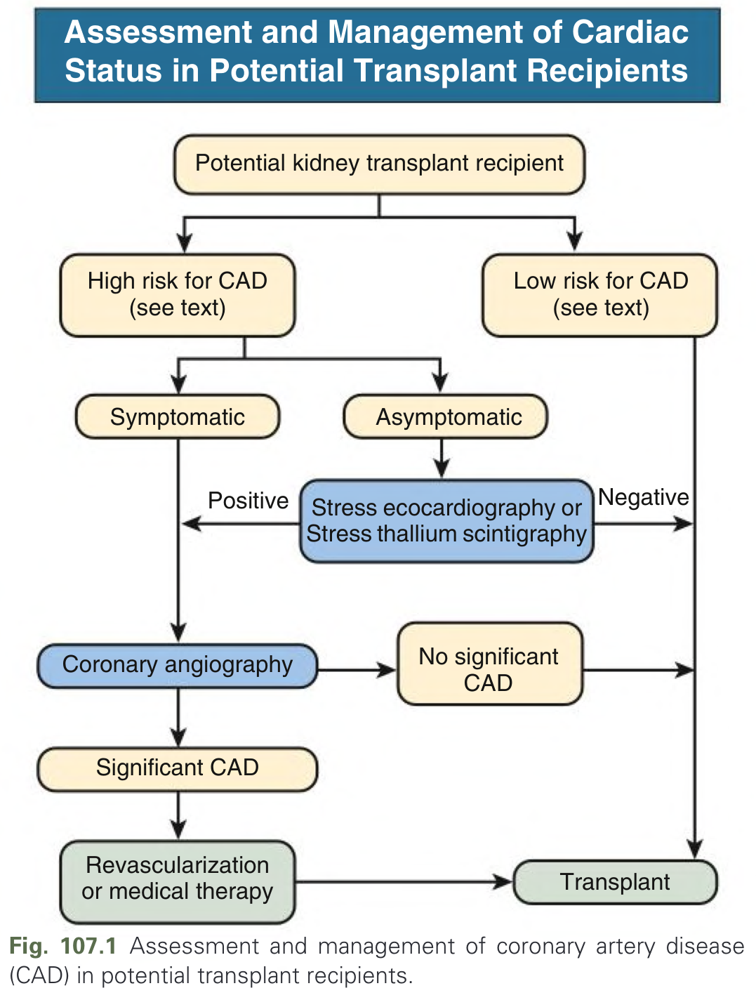

Fig. 107.1 Assessment and management of coronary artery disease (CAD) in potential transplant recipients.

---

### Fig_107_2

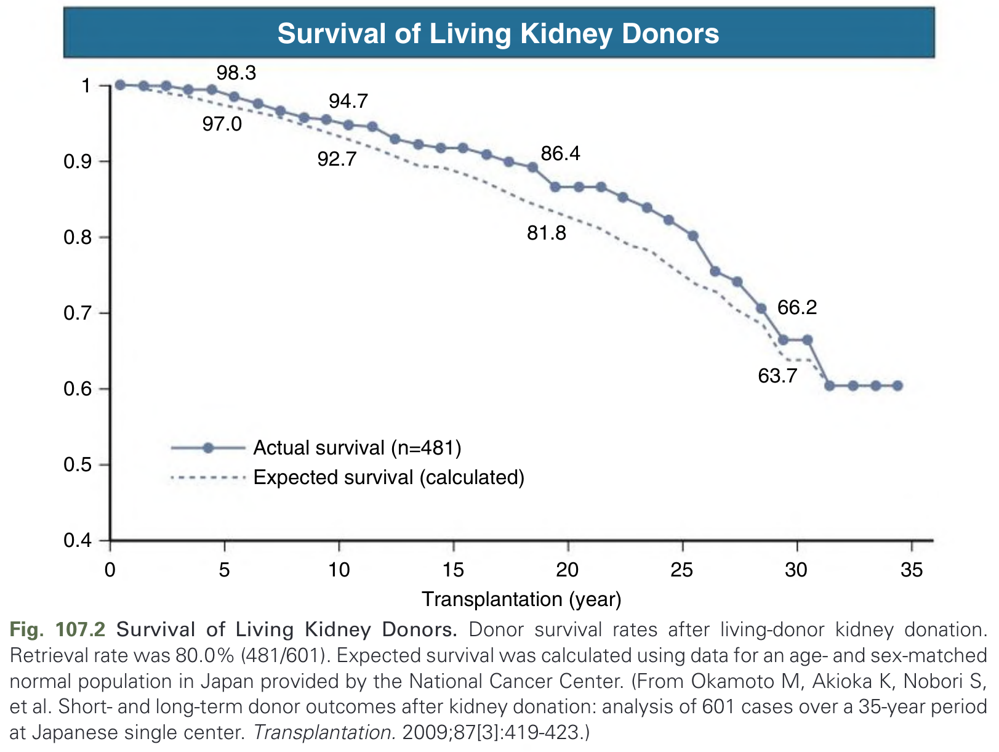

Fig. 107.2 Survival of Living Kidney Donors. Donor survival rates after living-donor kidney donation. Retrieval rate was 80.0% (481/601). Expected survival was calculated using data for an age- and sex-matched normal population in Japan provided by the National Cancer Center. (From Okamoto M, Akioka K, Nobori S, et al. Short- and long-term donor outcomes after kidney donation: analysis of 601 cases over a 35-year period at Japanese single center. Transplantation. 2009;87[3]:419-423.)

---

### Fig_107_3

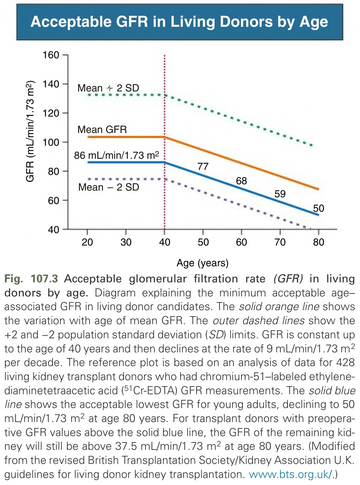

Fig. 107.3 Acceptable glomerular filtration rate (GFR) in living donors by age. Diagram explaining the minimum acceptable age-associated GFR in living donor candidates. The solid orange line shows the variation with age of mean GFR. The outer dashed lines show the +2 and −2 population standard deviation (SD) limits. GFR is constant up to the age of 40 years and then declines at the rate of 9 mL/min/1.73 m2 per decade. The reference plot is based on an analysis of data for 428 living kidney transplant donors who had chromium-51–labeled ethylene-diaminetetraacetic acid (51Cr-EDTA) GFR measurements. The solid blue line shows the acceptable lowest GFR for young adults, declining to 50 mL/min/1.73 m2 at age 80 years. For transplant donors with preoperative GFR values above the solid blue line, the GFR of the remaining kidney will still be above 37.5 mL/min/1.73 m2 at age 80 years. (Modified from the revised British Transplantation Society/Kidney Association U.K. guidelines for living donor kidney transplantation. www.bts.org.uk/.)

---

### Fig_107_4

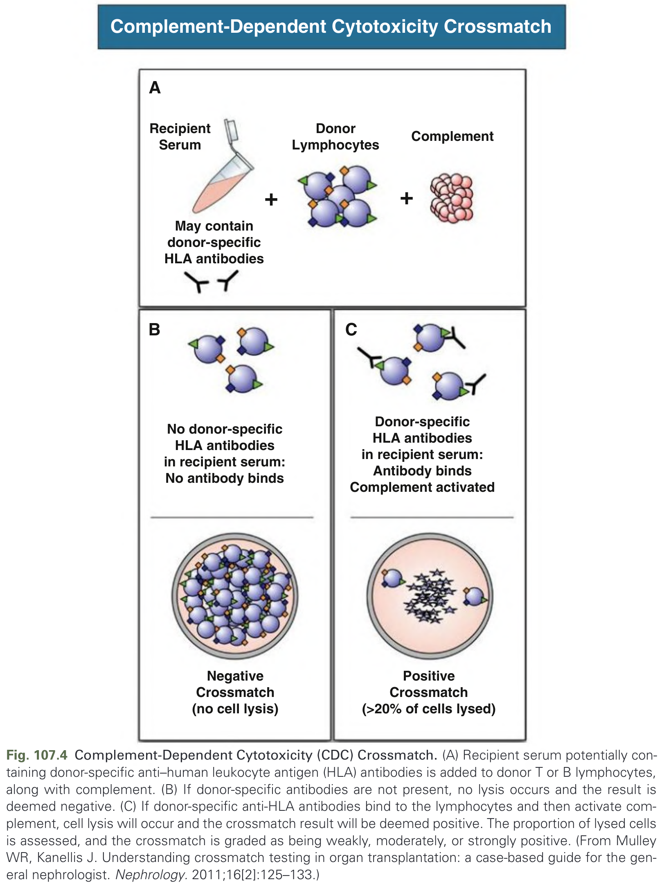

Fig. 107.4 Complement-Dependent Cytotoxicity (CDC) Crossmatch. (A) Recipient serum potentially containing donor-specific anti–human leukocyte antigen (HLA) antibodies is added to donor T or B lymphocytes, along with complement. (B) If donor-specific antibodies are not present, no lysis occurs and the result is deemed negative. (C) If donor-specific anti-HLA antibodies bind to the lymphocytes and then activate complement, cell lysis will occur and the crossmatch result will be deemed positive. The proportion of lysed cells is assessed, and the crossmatch is graded as being weakly, moderately, or strongly positive. (From Mulley WR, Kanellis J. Understanding crossmatch testing in organ transplantation: a case-based guide for the general nephrologist. Nephrology. 2011;16[2]:125–133.)

---

### Fig_107_5

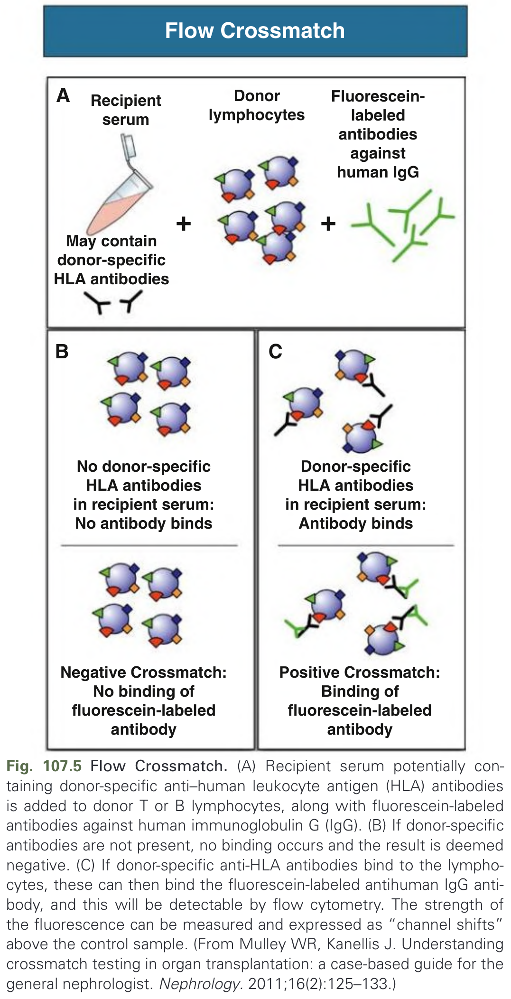

Fig. 107.5 Flow Crossmatch. (A) Recipient serum potentially containing donor-specific anti–human leukocyte antigen (HLA) antibodies is added to donor T or B lymphocytes, along with fluorescein-labeled antibodies against human immunoglobulin G (IgG). (B) If donor-specific antibodies are not present, no binding occurs and the result is deemed negative. (C) If donor-specific anti-HLA antibodies bind to the lymphocytes, these can then bind the fluorescein-labeled antihuman IgG antibody, and this will be detectable by flow cytometry. The strength of the fluorescence can be measured and expressed as “channel shifts” above the control sample. (From Mulley WR, Kanellis J. Understanding crossmatch testing in organ transplantation: a case-based guide for the general nephrologist. Nephrology. 2011;16(2):125–133.)

---

### Fig_107_6

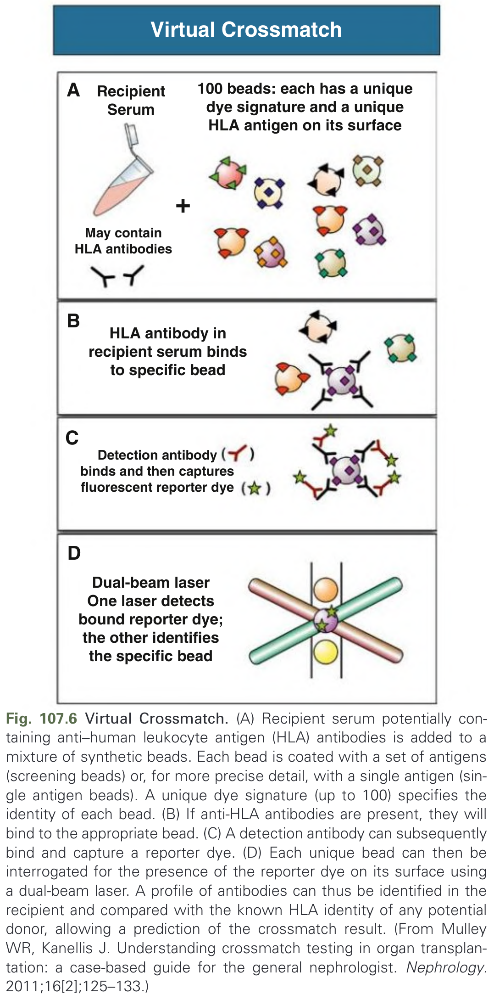

Fig. 107.6 Virtual Crossmatch. (A) Recipient serum potentially containing anti–human leukocyte antigen (HLA) antibodies is added to a mixture of synthetic beads. Each bead is coated with a set of antigens (screening beads) or, for more precise detail, with a single antigen (single antigen beads). A unique dye signature (up to 100) specifies the identity of each bead. (B) If anti-HLA antibodies are present, they will bind to the appropriate bead. (C) A detection antibody can subsequently bind and capture a reporter dye. (D) Each unique bead can then be interrogated for the presence of the reporter dye on its surface using a dual-beam laser. A profile of antibodies can thus be identified in the recipient and compared with the known HLA identity of any potential donor, allowing a prediction of the crossmatch result. (From Mulley WR, Kanellis J. Understanding crossmatch testing in organ transplantation: a case-based guide for the general nephrologist. Nephrology. 2011;16[2];125–133.)

---

## Tables

*No tables resolved for this chapter.*

## Boxes

### Box_107_1

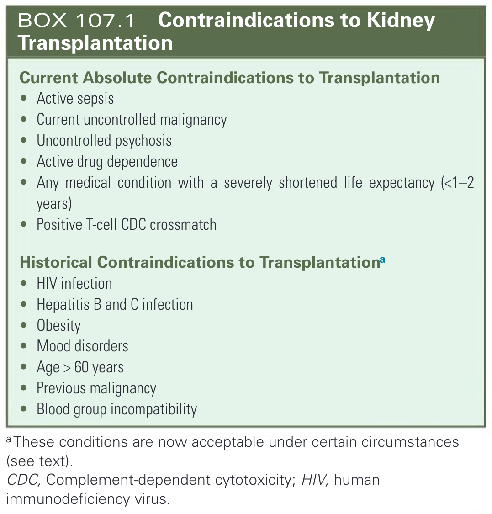

#### Box Text

```markdown
**Current Absolute Contraindications to Transplantation**
* Active sepsis
* Current uncontrolled malignancy
* Uncontrolled psychosis
* Active drug dependence
* Any medical condition with a severely shortened life expectancy (<1-2 years)
* Positive T-cell CDC crossmatch

**Historical Contraindications to Transplantationa**
* HIV infection
* Hepatitis B and C infection
* Obesity
* Mood disorders
* Age > 60 years
* Previous malignancy
* Blood group incompatibility

a These conditions are now acceptable under certain circumstances (see text).
CDC, Complement-dependent cytotoxicity; HIV, human immunodeficiency virus.
```

BOX 107.1 Contraindications to Kidney Transplantation
Historical Contraindications to Transplantationa
a These conditions are now acceptable under certain circumstances (see text).
CDC, Complement-dependent cytotoxicity; HIV, human immunodeficiency virus.

---

### Box_107_2

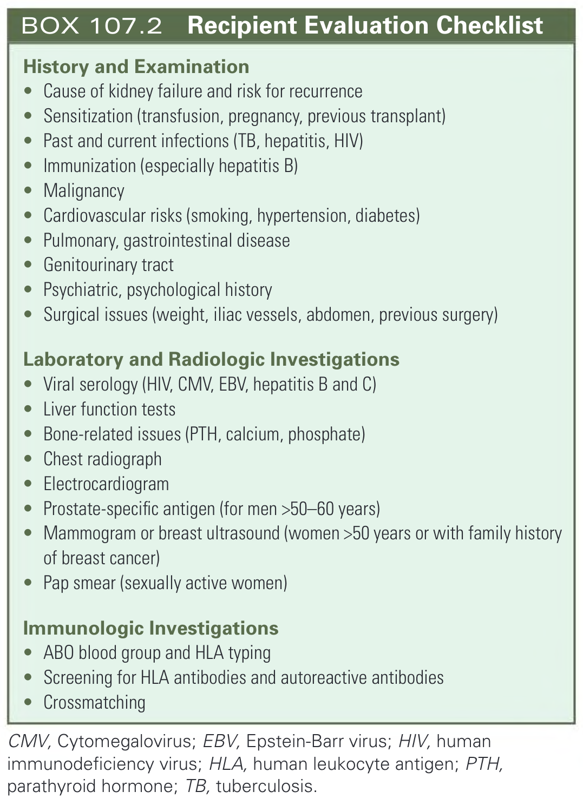

#### Box Text

```markdown
**History and Examination**
* Cause of kidney failure and risk for recurrence
* Sensitization (transfusion, pregnancy, previous transplant)
* Past and current infections (TB, hepatitis, HIV)
* Immunization (especially hepatitis B)
* Malignancy
* Cardiovascular risks (smoking, hypertension, diabetes)
* Pulmonary, gastrointestinal disease
* Genitourinary tract
* Psychiatric, psychological history
* Surgical issues (weight, iliac vessels, abdomen, previous surgery)

**Laboratory and Radiologic Investigations**
* Viral serology (HIV, CMV, EBV, hepatitis B and C)
* Liver function tests
* Bone-related issues (PTH, calcium, phosphate)
* Chest radiograph
* Electrocardiogram
* Prostate-specific antigen (for men >50-60 years)
* Mammogram or breast ultrasound (women >50 years or with family history of breast cancer)
* Pap smear (sexually active women)

**Immunologic Investigations**
* ABO blood group and HLA typing
* Screening for HLA antibodies and autoreactive antibodies
* Crossmatching

CMV, Cytomegalovirus; EBV, Epstein-Barr virus; HIV, human immunodeficiency virus; HLA, human leukocyte antigen; PTH, parathyroid hormone; TB, tuberculosis.
```

BOX 107.2 Recipient Evaluation Checklist
CMV, Cytomegalovirus; EBV, Epstein-Barr virus; HIV, human immunodeficiency virus; HLA, human leukocyte antigen; PTH, parathyroid hormone; TB, tuberculosis.

---

### Box_107_3

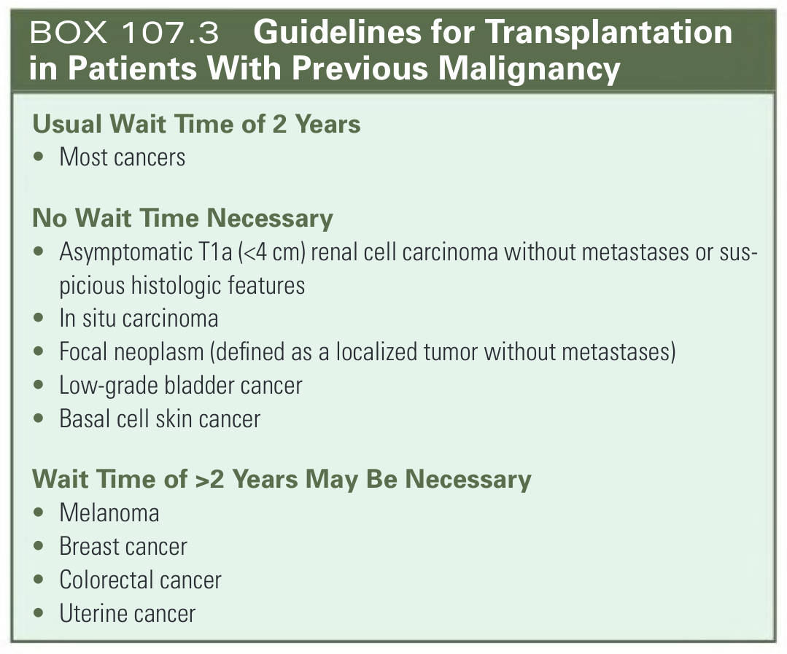

#### Box Text

```markdown
**Usual Wait Time of 2 Years**
* Most cancers

**No Wait Time Necessary**
* Asymptomatic T1a (<4 cm) renal cell carcinoma without metastases or suspicious histologic features
* In situ carcinoma
* Focal neoplasm (defined as a localized tumor without metastases)
* Low-grade bladder cancer
* Basal cell skin cancer

**Wait Time of >2 Years May Be Necessary**
* Melanoma
* Breast cancer
* Colorectal cancer
* Uterine cancer
```

BOX 107.3 Guidelines for Transplantation in Patients With Previous Malignancy

---

### Box_107_4

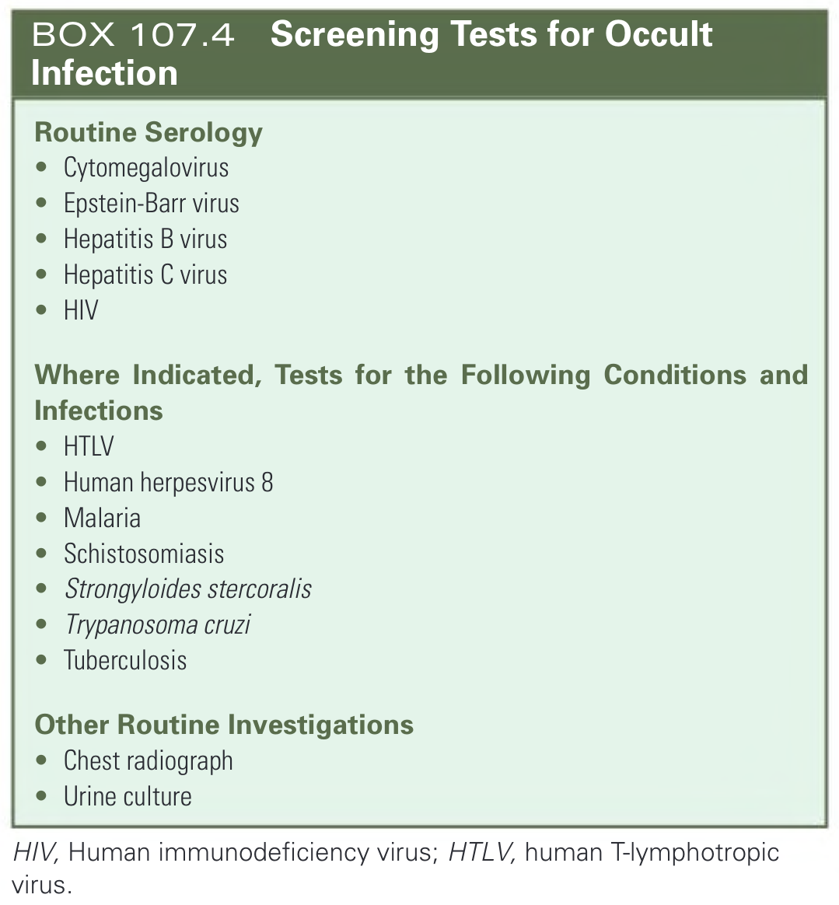

#### Box Text

```markdown
**Routine Serology**
* Cytomegalovirus
* Epstein-Barr virus
* Hepatitis B virus
* Hepatitis C virus
* HIV

**Where Indicated, Tests for the Following Conditions and Infections**
* HTLV
* Human herpesvirus 8
* Malaria
* Schistosomiasis
* Strongyloides stercoralis
* Trypanosoma cruzi
* Tuberculosis

**Other Routine Investigations**
* Chest radiograph
* Urine culture

HIV, Human immunodeficiency virus; HTLV, human T-lymphotropic virus.
```

BOX 107.4 Screening Tests for Occult Infection
HIV, Human immunodeficiency virus; HTLV, human T-lymphotropic virus.

---

### Box_107_5

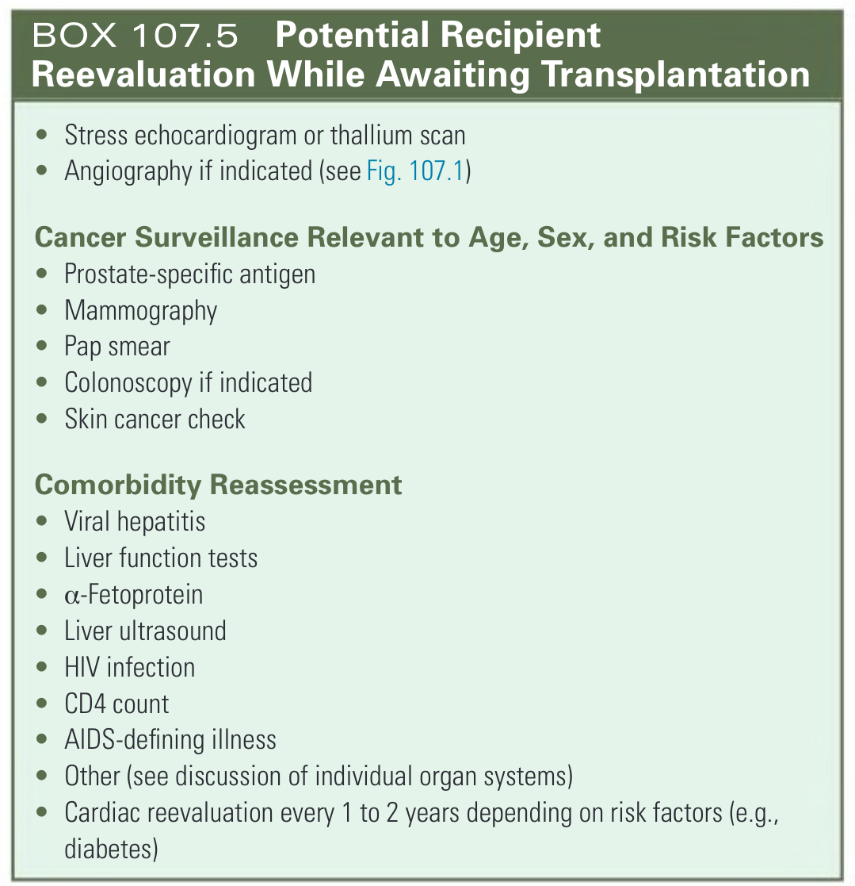

#### Box Text

```markdown
* Stress echocardiogram or thallium scan
* Angiography if indicated (see Fig. 107.1)

**Cancer Surveillance Relevant to Age, Sex, and Risk Factors**
* Prostate-specific antigen
* Mammography
* Pap smear
* Colonoscopy if indicated
* Skin cancer check

**Comorbidity Reassessment**
* Viral hepatitis
* Liver function tests
* a-Fetoprotein
* Liver ultrasound
* HIV infection
* CD4 count
* AIDS-defining illness
* Other (see discussion of individual organ systems)
* Cardiac reevaluation every 1 to 2 years depending on risk factors (e.g., diabetes)
```

BOX 107.5 Potential Recipient Reevaluation While Awaiting Transplantation

---

### Box_107_6

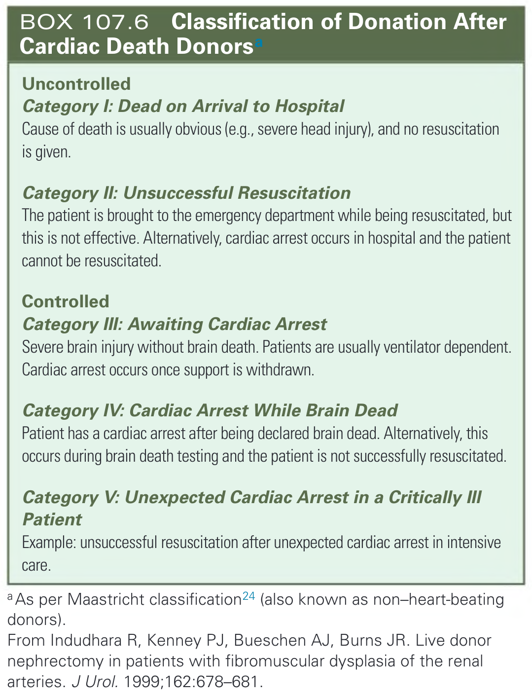

#### Box Text

```markdown
**Uncontrolled**
**Category I: Dead on Arrival to Hospital**
Cause of death is usually obvious (e.g., severe head injury), and no resuscitation is given.

**Category II: Unsuccessful Resuscitation**
The patient is brought to the emergency department while being resuscitated, but this is not effective. Alternatively, cardiac arrest occurs in hospital and the patient cannot be resuscitated.

**Controlled**
**Category III: Awaiting Cardiac Arrest**
Severe brain injury without brain death. Patients are usually ventilator dependent. Cardiac arrest occurs once support is withdrawn.

**Category IV: Cardiac Arrest While Brain Dead**
Patient has a cardiac arrest after being declared brain dead. Alternatively, this occurs during brain death testing and the patient is not successfully resuscitated.

**Category V: Unexpected Cardiac Arrest in a Critically Ill Patient**
Example: unsuccessful resuscitation after unexpected cardiac arrest in intensive care.

a As per Maastricht classification (also known as non-heart-beating donors).
From Indudhara R, Kenney PJ, Bueschen AJ, Burns JR. Live donor nephrectomy in patients with fibromuscular dysplasia of the renal arteries. J Urol. 1999;162:678-681.
```

BOX 107.6 Classification of Donation After Cardiac Death Donorsa
a As per Maastricht classification24 (also known as non–heart-beating donors).
From Indudhara R, Kenney PJ, Bueschen AJ, Burns JR. Live donor nephrectomy in patients with fibromuscular dysplasia of the renal arteries. J Urol. 1999;162:678–681.

---

### Box_107_7

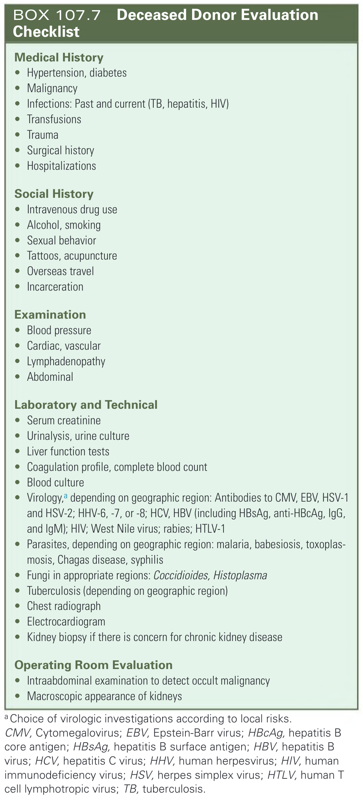

#### Box Text

```markdown
**Medical History**
* Hypertension, diabetes
* Malignancy
* Infections: Past and current (TB, hepatitis, HIV)
* Transfusions
* Trauma
* Surgical history
* Hospitalizations

**Social History**
* Intravenous drug use
* Alcohol, smoking
* Sexual behavior
* Tattoos, acupuncture
* Overseas travel
* Incarceration

**Examination**
* Blood pressure
* Cardiac, vascular
* Lymphadenopathy
* Abdominal

**Laboratory and Technical**
* Serum creatinine
* Urinalysis, urine culture
* Liver function tests
* Coagulation profile, complete blood count
* Blood culture
* Virology, depending on geographic region: Antibodies to CMV, EBV, HSV-1 and HSV-2; HHV-6, -7, or -8; HCV, HBV (including HBsAg, anti-HBcAg, IgG, and IgM); HIV; West Nile virus; rabies; HTLV-1
* Parasites, depending on geographic region: malaria, babesiosis, toxoplasmosis, Chagas disease, syphilis
* Fungi in appropriate regions: Coccidioides, Histoplasma
* Tuberculosis (depending on geographic region)
* Chest radiograph
* Electrocardiogram
* Kidney biopsy if there is concern for chronic kidney disease

**Operating Room Evaluation**
* Intraabdominal examination to detect occult malignancy
* Macroscopic appearance of kidneys

a Choice of virologic investigations according to local risks.
CMV, Cytomegalovirus; EBV, Epstein-Barr virus; HBcAg, hepatitis B core antigen; HBsAg, hepatitis B surface antigen; HBV, hepatitis B virus; HCV, hepatitis C virus; HHV, human herpesvirus; HIV, human immunodeficiency virus; HSV, herpes simplex virus; HTLV, human T cell lymphotropic virus; TB, tuberculosis.
```

BOX 107.7 Deceased Donor Evaluation Checklist
a Choice of virologic investigations according to local risks.
CMV, Cytomegalovirus; EBV, Epstein-Barr virus; HBcAg, hepatitis B core antigen; HBsAg, hepatitis B surface antigen; HBV, hepatitis B virus; HCV, hepatitis C virus; HHV, human herpesvirus; HIV, human immunodeficiency virus; HSV, herpes simplex virus; HTLV, human T cell lymphotropic virus; TB, tuberculosis.

---

### Box_107_8

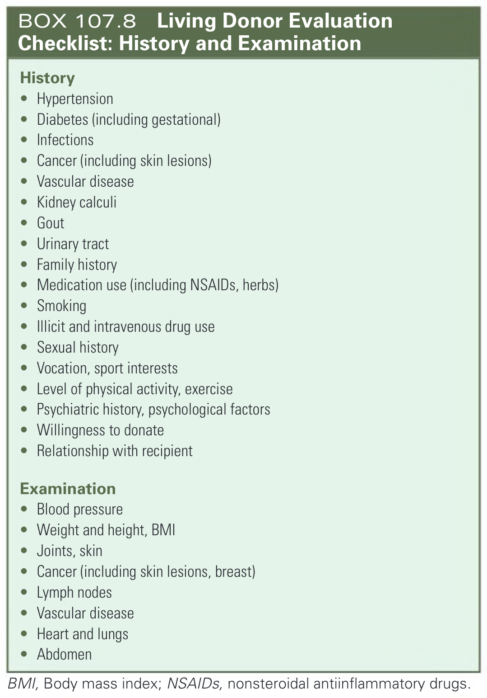

#### Box Text

```markdown
**History**
* Hypertension
* Diabetes (including gestational)
* Infections
* Cancer (including skin lesions)
* Vascular disease
* Kidney calculi
* Gout
* Urinary tract
* Family history
* Medication use (including NSAIDs, herbs)
* Smoking
* Illicit and intravenous drug use
* Sexual history
* Vocation, sport interests
* Level of physical activity, exercise
* Psychiatric history, psychological factors
* Willingness to donate
* Relationship with recipient

**Examination**
* Blood pressure
* Weight and height, BMI
* Joints, skin
* Cancer (including skin lesions, breast)
* Lymph nodes
* Vascular disease
* Heart and lungs
* Abdomen

BMI, Body mass index; NSAIDs, nonsteroidal antiinflammatory drugs.


<!-- audiobook-skip-start -->
```

BOX 107.8 Living Donor Evaluation Checklist: History and Examination
BMI, Body mass index; NSAIDs, nonsteroidal antiinflammatory drugs.

---

### Box_107_9

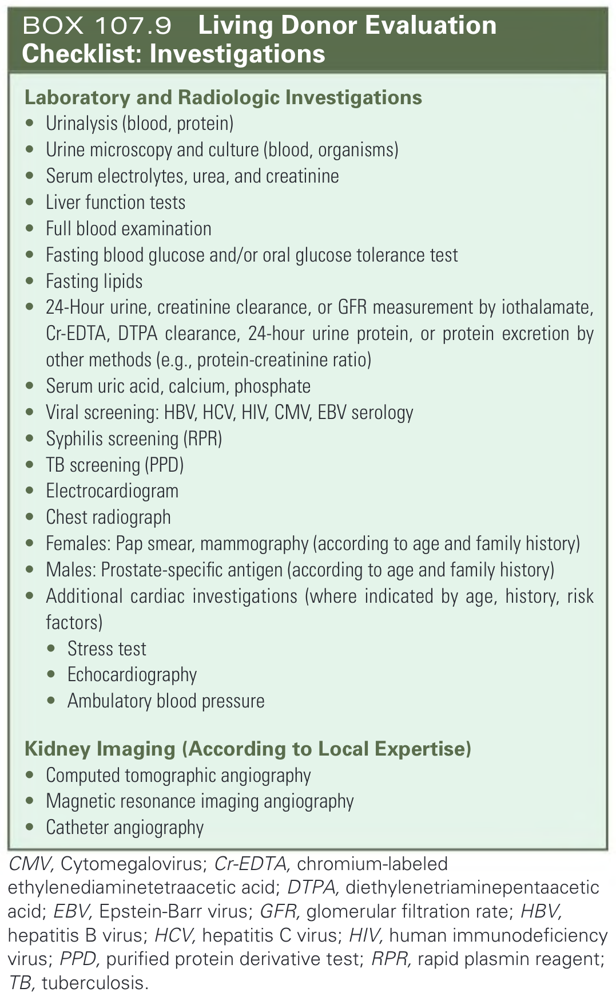

#### Box Text

```markdown
**Laboratory and Radiologic Investigations**
* Urinalysis (blood, protein)
* Urine microscopy and culture (blood, organisms)
* Serum electrolytes, urea, and creatinine
* Liver function tests
* Full blood examination
* Fasting blood glucose and/or oral glucose tolerance test
* Fasting lipids
* 24-Hour urine, creatinine clearance, or GFR measurement by iothalamate, Cr-EDTA, DTPA clearance, 24-hour urine protein, or protein excretion by other methods (e.g., protein-creatinine ratio)
* Serum uric acid, calcium, phosphate
* Viral screening: HBV, HCV, HIV, CMV, EBV serology
* Syphilis screening (RPR)
* TB screening (PPD)
* Electrocardiogram
* Chest radiograph
* Females: Pap smear, mammography (according to age and family history)
* Males: Prostate-specific antigen (according to age and family history)
* Additional cardiac investigations (where indicated by age, history, risk factors)
	* Stress test
	* Echocardiography
	* Ambulatory blood pressure

**Kidney Imaging (According to Local Expertise)**
* Computed tomographic angiography
* Magnetic resonance imaging angiography
* Catheter angiography

CMV, Cytomegalovirus; Cr-EDTA, chromium-labeled ethylenediaminetetraacetic acid; DTPA, diethylenetriaminepentaacetic acid; EBV, Epstein-Barr virus; GFR, glomerular filtration rate; HBV, hepatitis B virus; HCV, hepatitis C virus; HIV, human immunodeficiency virus; PPD, purified protein derivative test; RPR, rapid plasmin reagent; TB, tuberculosis.


#### Assessment of Kidney Function
Most centers use GFR of 80 mL/min/1.73 m² as the lower limit for donors. It is accepted that this threshold may be too low for donors younger than 40 years and too high for donors older than 60 to 65 years. An alternative approach is to consider the age-specific GFR and accept donors only if they fall within the average for this age range. This method has been recommended by the British Transplantation Society (guidelines available at www.bts.org.uk) and is presented in Fig. 107.3. An alternative approach uses the life expectancy of the donor. Based on these calculations, a 30-year-old donor would require a GFR of 123 mL/min/1.73 m²; the required GFR for a 70-year-old person would be 68 mL/min/1.73 m².

<!-- audiobook-skip-start -->
```

BOX 107.9 Living Donor Evaluation Checklist: Investigations
CMV, Cytomegalovirus; Cr-EDTA, chromium-labeled ethylenediaminetetraacetic acid; DTPA, diethylenetriaminepentaacetic acid; EBV, Epstein-Barr virus; GFR, glomerular filtration rate; HBV, hepatitis B virus; HCV, hepatitis C virus; HIV, human immunodeficiency virus; PPD, purified protein derivative test; RPR, rapid plasmin reagent; TB, tuberculosis.

---
