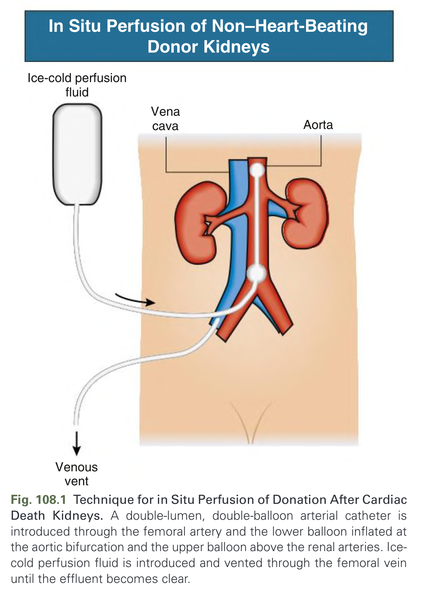
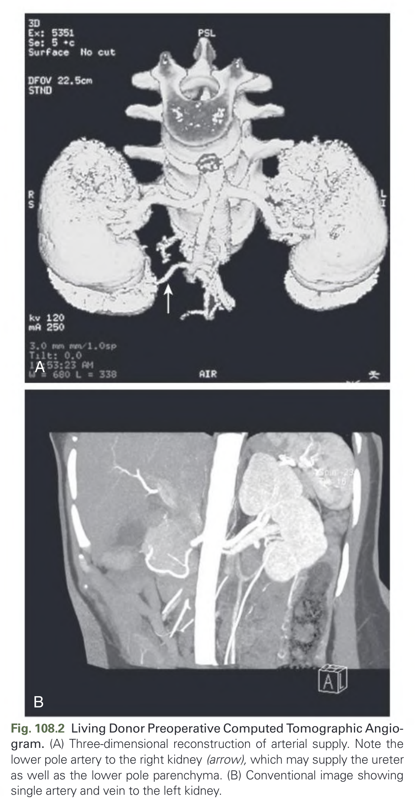
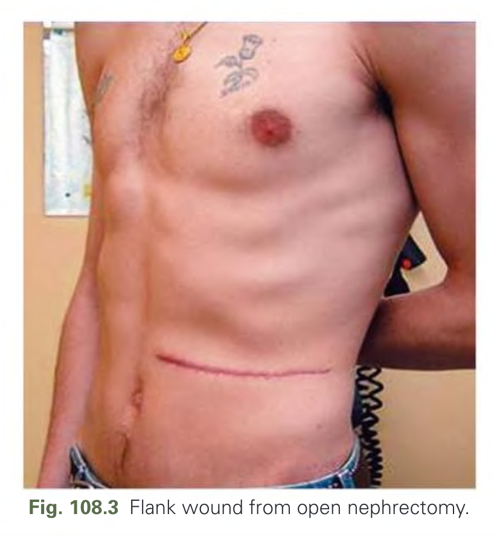
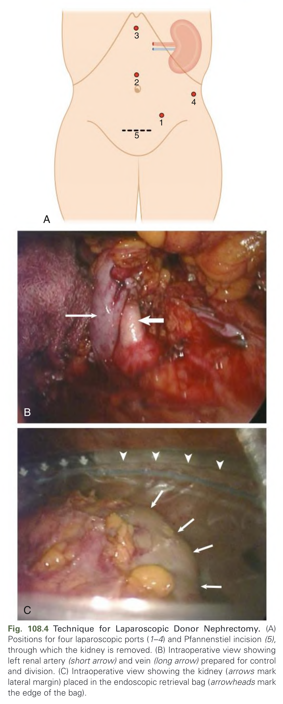
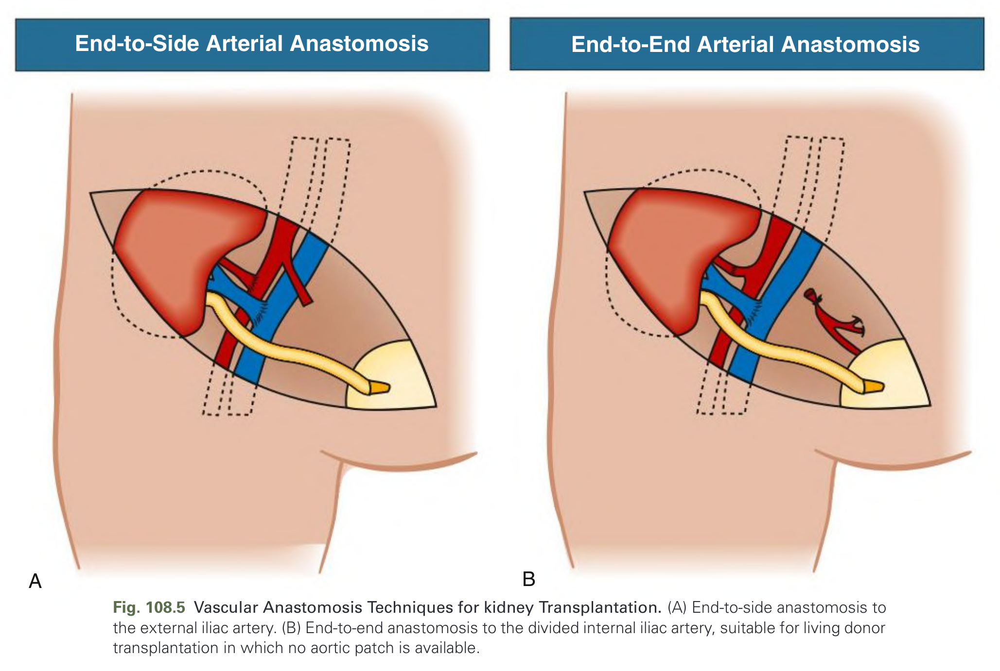
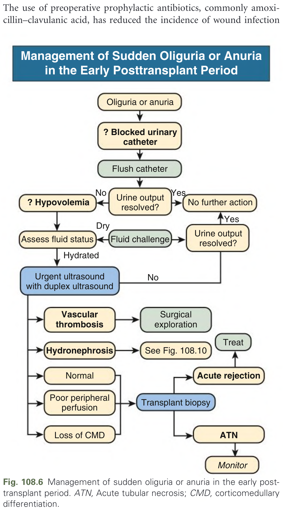
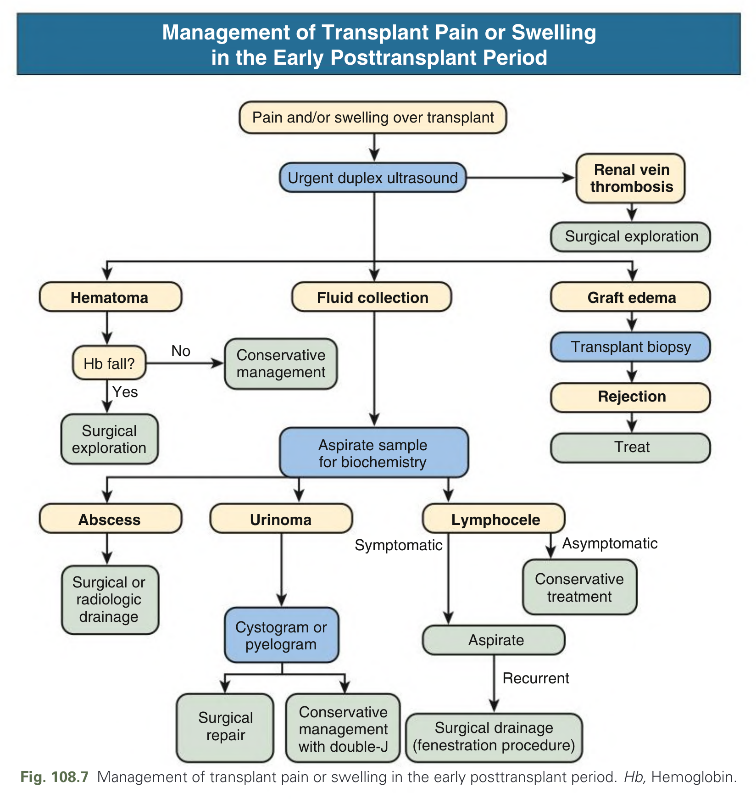
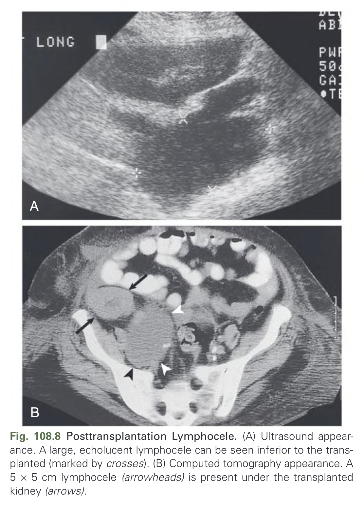
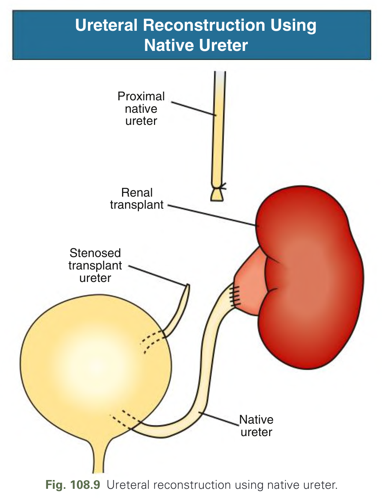
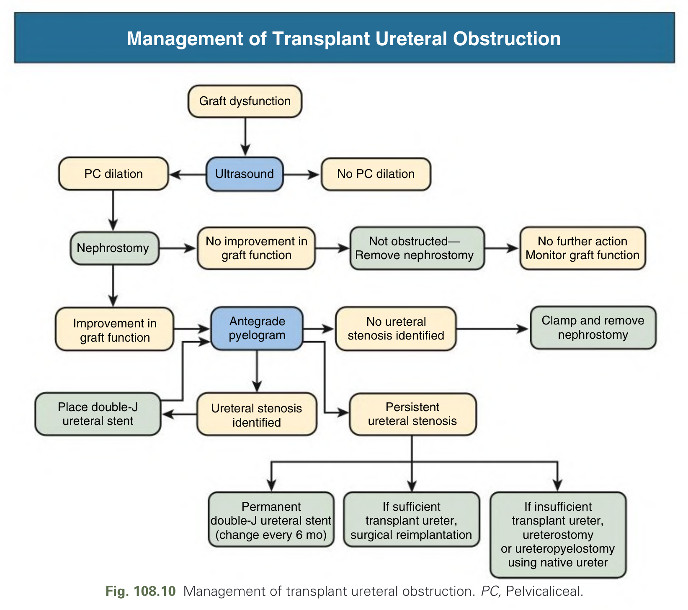

# 108. Kidney Transplantation Surgery - Figures and Tables Index

This document lists all figures, tables and boxes extracted from `108. Kidney Transplantation Surgery.pdf`.

## Table of Contents
- [Figures](#figures)
- [Tables](#tables)
- [Boxes](#boxes)

---

## Figures

### Fig_108_1



Fig. 108.1 Technique for in Situ Perfusion of Donation After Cardiac Death Kidneys. A double-lumen, double-balloon arterial catheter is introduced through the femoral artery and the lower balloon inflated at the aortic bifurcation and the upper balloon above the renal arteries. Ice-cold perfusion fluid is introduced and vented through the femoral vein until the effluent becomes clear.

---

### Fig_108_2



Fig. 108.2 Living Donor Preoperative Computed Tomographic Angiogram. (A) Three-dimensional reconstruction of arterial supply. Note the lower pole artery to the right kidney (arrow), which may supply the ureter as well as the lower pole parenchyma. (B) Conventional image showing single artery and vein to the left kidney.

---

### Fig_108_3



Fig. 108.3 Flank wound from open nephrectomy.

---

### Fig_108_4



Fig. 108.4 Technique for Laparoscopic Donor Nephrectomy. (A) Positions for four laparoscopic ports (1–4) and Pfannenstiel incision (5), through which the kidney is removed. (B) Intraoperative view showing left renal artery (short arrow) and vein (long arrow) prepared for control and division. (C) Intraoperative view showing the kidney (arrows mark lateral margin) placed in the endoscopic retrieval bag (arrowheads mark the edge of the bag).

---

### Fig_108_5



Fig. 108.5 Vascular Anastomosis Techniques for Kidney Transplantation. (A) End-to-side anastomosis to the external iliac artery. (B) End-to-end anastomosis to the divided internal iliac artery, suitable for living donor transplantation in which no aortic patch is available.

---

### Fig_108_6



Fig. 108.6 Management of sudden oliguria or anuria in the early posttransplant period. ATN, Acute tubular necrosis; CMD, corticomedullary differentiation.

---

### Fig_108_7



Fig. 108.7 Management of transplant pain or swelling in the early posttransplant period. Hb, Hemoglobin.

---

### Fig_108_8



Fig. 108.8 Posttransplantation Lymphocele. (A) Ultrasound appearance. A large, echolucent lymphocele can be seen inferior to the transplanted kidney (marked by crosses). (B) Computed tomography appearance. A 5 × 5 cm lymphocele (arrowheads) is present under the transplanted kidney (arrows).

---

### Fig_108_9



Fig. 108.9 Ureteral reconstruction using native ureter.

---

### Fig_108_10



Fig. 108.10 Management of transplant ureteral obstruction. PC, Pelvicaliceal.

---

## Tables

*No tables resolved for this chapter.*

## Boxes

### Box_108_1


#### Box Text

```markdown
*   Shorter incisions
*   Less pain
*   Shorter hospital stay
*   Shorter recovery
*   Better cosmetic appearance
```

BOX 108.1 Donor Benefits of Minimally Invasive Donor Nephrectomy

---
