# 109. Prophylaxis and Treatment of Kidney Transplant Rejection - Figures and Tables Index

This document lists all figures, tables and boxes extracted from `109. Prophylaxis and Treatment of Kidney Transplant Rejection.pdf`.

## Table of Contents
- [Figures](#figures)
- [Tables](#tables)
- [Boxes](#boxes)

---

## Figures

### Fig_109_1

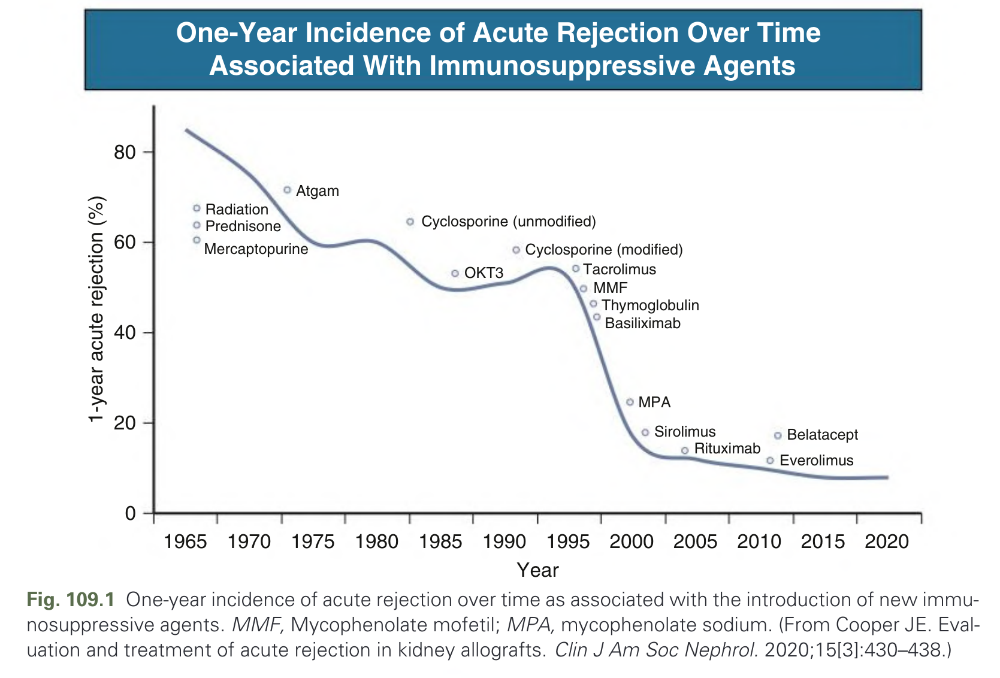

Fig. 109.1 One-year incidence of acute rejection over time as associated with the introduction of new immu- nosuppressive agents. MMF, Mycophenolate mofetil; MPA, mycophenolate sodium. (From Cooper JE. Eval- uation and treatment of acute rejection in kidney allografts. Clin J Am Soc Nephrol. 2020;15[3]:430–438.)

---

### Fig_109_2

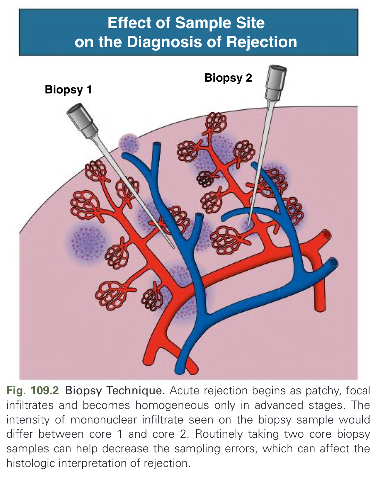

Fig. 109.2 Biopsy Technique. Acute rejection begins as patchy, focal infiltrates and becomes homogeneous only in advanced stages. The intensity of mononuclear infiltrate seen on the biopsy sample would differ between core 1 and core 2. Routinely taking two core biopsy samples can help decrease the sampling errors, which can affect the histologic interpretation of rejection.

---

### Fig_109_3

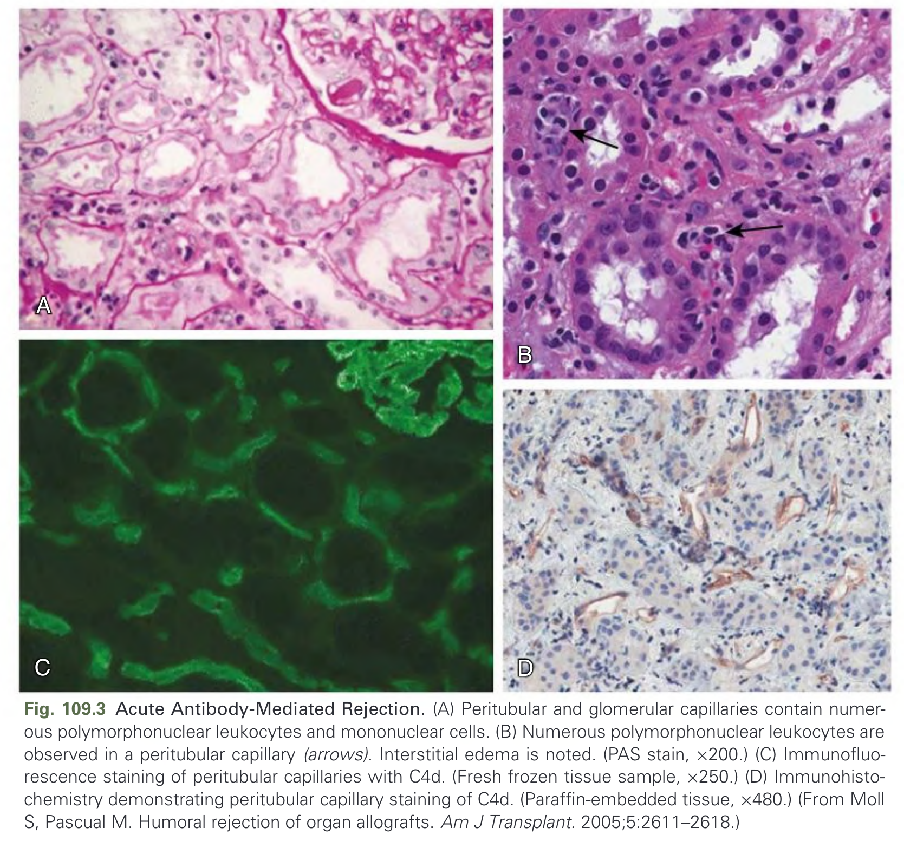

Fig. 109.3 Acute Antibody-Mediated Rejection. (A) Peritubular and glomerular capillaries contain numer- ous polymorphonuclear leukocytes and mononuclear cells. (B) Numerous polymorphonuclear leukocytes are observed in a peritubular capillary (arrows). Interstitial edema is noted. (PAS stain, ×200.) (C) Immunofluo- rescence staining of peritubular capillaries with C4d. (Fresh frozen tissue sample, ×250.) (D) Immunohisto- chemistry demonstrating peritubular capillary staining of C4d. (Paraffin-embedded tissue, ×480.) (From Moll S, Pascual M. Humoral rejection of organ allografts. Am J Transplant. 2005;5:2611–2618.)

---

### Fig_109_4

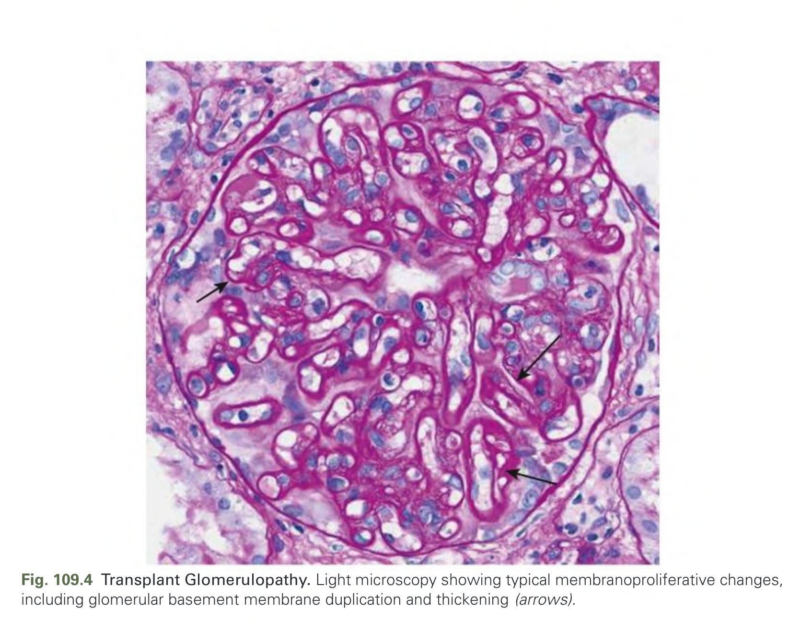

Fig. 109.4 Transplant Glomerulopathy. Light microscopy showing typical membranoproliferative changes, including glomerular basement membrane duplication and thickening (arrows).

---

### Fig_109_5

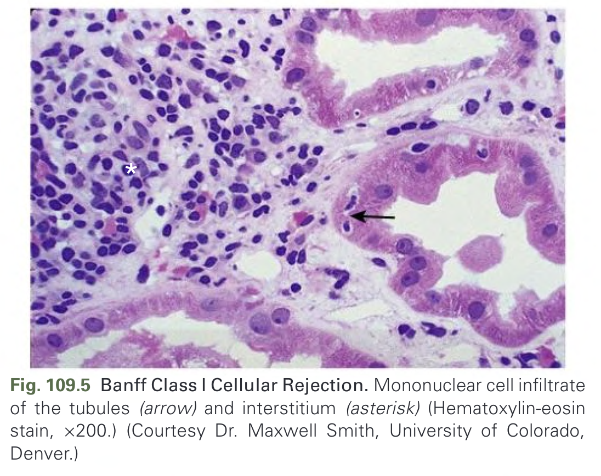

Fig. 109.5 Banff Class I Cellular Rejection. Mononuclear cell infiltrate of the tubules (arrow) and interstitium (asterisk) (Hematoxylin-eosin stain, ×200.) (Courtesy Dr. Maxwell Smith, University of Colorado, Denver.)

---

### Fig_109_6

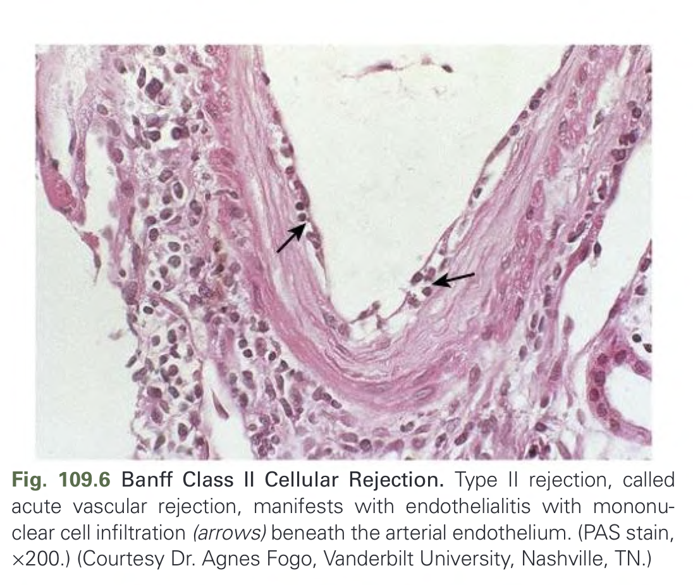

Fig. 109.6 Banff Class II Cellular Rejection. Type II rejection, called acute vascular rejection, manifests with endothelialitis with mononu- clear cell infiltration (arrows) beneath the arterial endothelium. (PAS stain, ×200.) (Courtesy Dr. Agnes Fogo, Vanderbilt University, Nashville, TN.)

---

### Fig_109_7

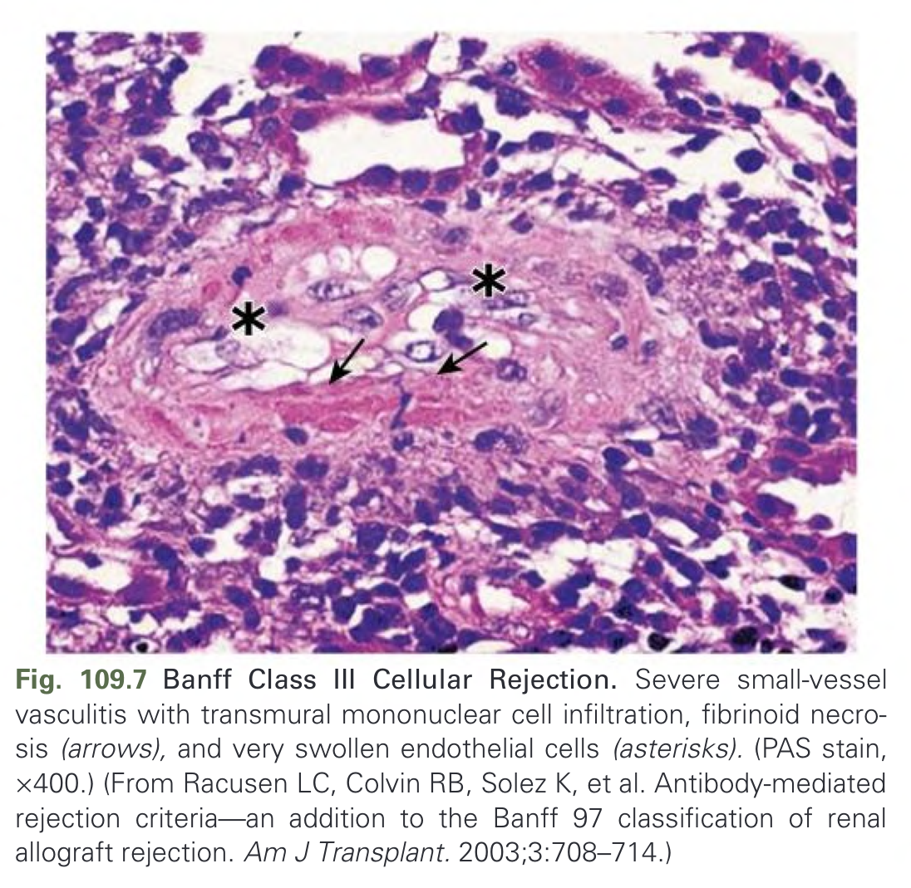

Fig. 109.7 Banff Class III Cellular Rejection. Severe small-vessel vasculitis with transmural mononuclear cell infiltration, fibrinoid necro- sis (arrows), and very swollen endothelial cells (asterisks). (PAS stain, ×400.) (From Racusen LC, Colvin RB, Solez K, et al. Antibody-mediated rejection criteria—an addition to the Banff 97 classification of renal allograft rejection. Am J Transplant. 2003;3:708–714.)

---

### Fig_109_8

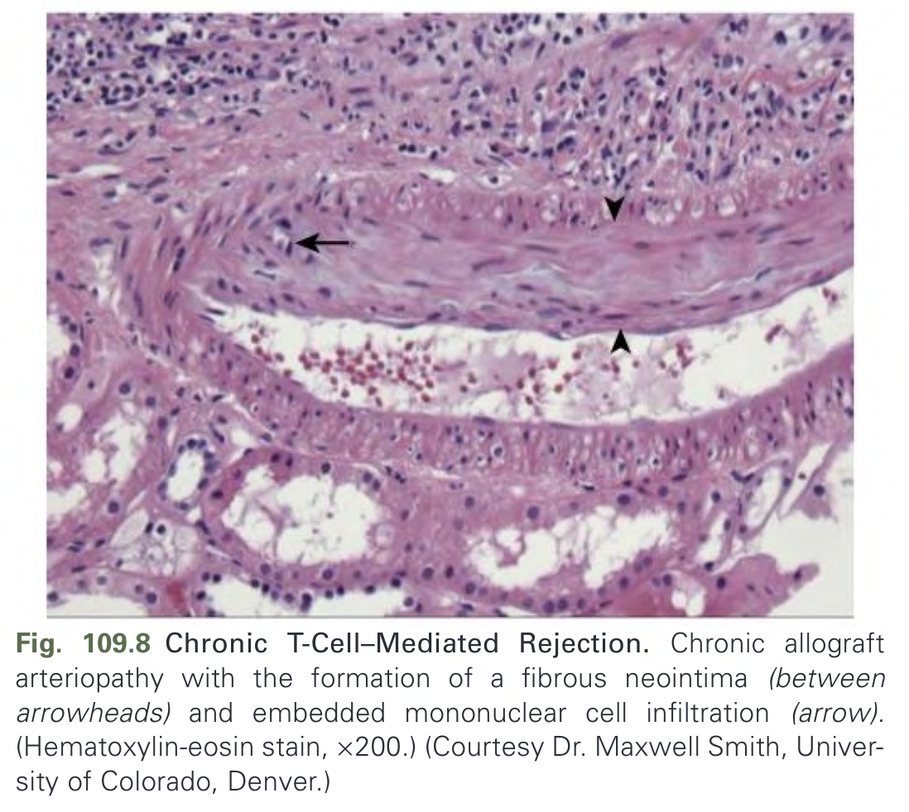

Fig. 109.8 Chronic T-Cell–Mediated Rejection. Chronic allograft arteriopathy with the formation of a fibrous neointima (between arrowheads) and embedded mononuclear cell infiltration (arrow). (Hematoxylin-eosin stain, ×200.) (Courtesy Dr. Maxwell Smith, Univer- sity of Colorado, Denver.)

---

## Tables

### Table_109_1

#### Table Image

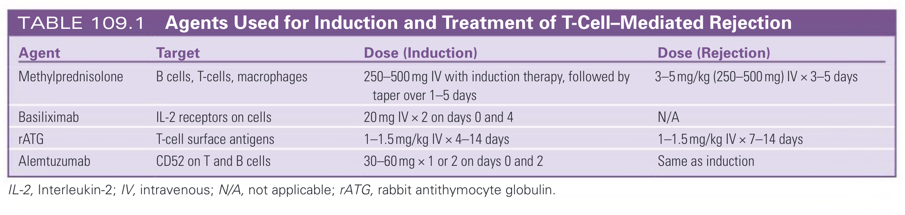

#### Table Data (CSV: [Table_109_1.csv](Table_109_1.csv))

```markdown
| Agent | Target | Dose (Induction) | Dose (Rejection) |
| :--- | :--- | :--- | :--- |
| Methylprednisolone | B cells, T-cells, macrophages | 250-500 mg IV with induction therapy, followed by taper over 1-5 days | 3-5 mg/kg (250-500 mg) IV × 3-5 days |
| Basiliximab | IL-2 receptors on cells | 20 mg IV × 2 on days 0 and 4 | N/A |
| rATG | T-cell surface antigens | 1-1.5 mg/kg IV × 4-14 days | 1-1.5mg/kg IV × 7-14 days |
| Alemtuzumab | CD52 on T and B cells | 30-60 mg × 1 or 2 on days 0 and 2 | Same as induction |

IL-2, Interleukin-2; IV, intravenous; N/A, not applicable; rATG, rabbit antithymocyte globulin.
```

TABLE 109.1 Agents Used for Induction and Treatment of T-Cell–Mediated Rejection

---

### Table_109_2

#### Table Image

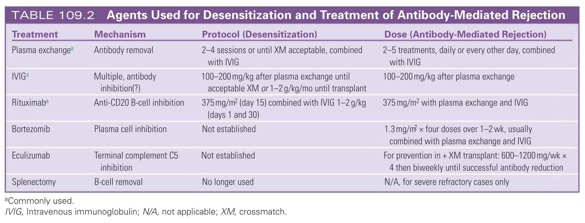

#### Table Data (CSV: [Table_109_2.csv](Table_109_2.csv))

```markdown
| Treatment | Mechanism | Protocol (Desensitization) | Dose (Antibody-Mediated Rejection) |
| :--- | :--- | :--- | :--- |
| Plasma exchangea | Antibody removal | 2-4 sessions or until XM acceptable, combined with IVIG | 2-5 treatments, daily or every other day, combined with IVIG |
| IVIGa | Multiple, antibody inhibition(?) | 100-200 mg/kg after plasma exchange until acceptable XM or 1-2 g/kg/mo until transplant | 100-200 mg/kg after plasma exchange |
| Rituximaba | Anti-CD20 B-cell inhibition | 375 mg/m² (day 15) combined with IVIG 1-2 g/kg (days 1 and 30) | 375 mg/m² with plasma exchange and IVIG |
| Bortezomib | Plasma cell inhibition | Not established | 1.3 mg/m² × four doses over 1-2 wk, usually combined with plasma exchange and IVIG |
| Eculizumab | Terminal complement C5 inhibition | Not established | For prevention in + XM transplant: 600-1200 mg/wk × 4 then biweekly until successful antibody reduction |
| Splenectomy | B-cell removal | No longer used | N/A, for severe refractory cases only |

aCommonly used.
IVIG, Intravenous immunoglobulin; N/A, not applicable; XM, crossmatch.
```

TABLE 109.2 Agents Used for Desensitization and Treatment of Antibody-Mediated Rejection

---

### Table_109_3

#### Table Image

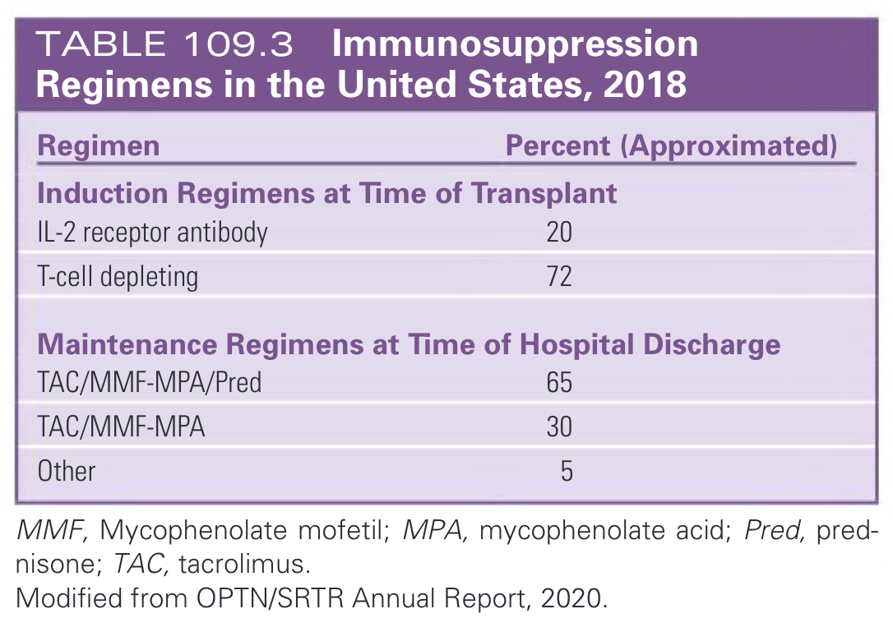

#### Table Data (CSV: [Table_109_3.csv](Table_109_3.csv))

```markdown
| Regimen | Percent (Approximated) |
| :--- | :--- |
| **Induction Regimens at Time of Transplant** | |
| IL-2 receptor antibody | 20 |
| T-cell depleting | 72 |
| **Maintenance Regimens at Time of Hospital Discharge** | |
| TAC/MMF-MPA/Pred | 65 |
| TAC/MMF-MPA | 30 |
| Other | 5 |

MMF, Mycophenolate mofetil; MPA, mycophenolate acid; Pred, prednisone; TAC, tacrolimus.
Modified from OPTN/SRTR Annual Report, 2020.
```

TABLE 109.3 Immunosuppression Regimens in the United States, 2018

---

### Table_109_4

#### Table Image

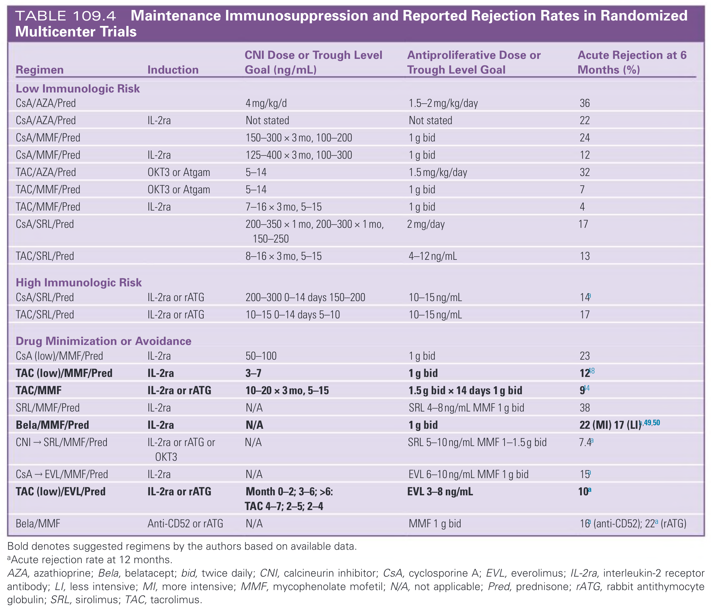

#### Table Data (CSV: [Table_109_4.csv](Table_109_4.csv))

```markdown
| Regimen | Induction | CNI Dose or Trough Level Goal (ng/mL) | Antiproliferative Dose or Trough Level Goal | Acute Rejection at 6 Months (%) |
| :--- | :--- | :--- | :--- | :--- |
| **Low Immunologic Risk** | | | | |
| CsA/AZA/Pred | | 4 mg/kg/d | 1.5-2 mg/kg/day | 36 |
| CsA/AZA/Pred | IL-2ra | Not stated | Not stated | 22 |
| CsA/MMF/Pred | | 150-300 × 3 mo, 100-200 | 1 g bid | 24 |
| CsA/MMF/Pred | IL-2ra | 125-400 × 3 mo, 100-300 | 1 g bid | 12 |
| TAC/AZA/Pred | OKT3 or Atgam | 5-14 | 1.5 mg/kg/day | 32 |
| TAC/MMF/Pred | OKT3 or Atgam | 5-14 | 1 g bid | 7 |
| TAC/MMF/Pred | IL-2ra | 7-16 × 3 mo, 5-15 | 1 g bid | 4 |
| CsA/SRL/Pred | | 200-350 × 1 mo, 200-300 × 1 mo, 150-250 | 2 mg/day | 17 |
| TAC/SRL/Pred | | 8-16 × 3 mo, 5-15 | 4-12 ng/mL | 13 |
| **High Immunologic Risk** | | | | |
| CsA/SRL/Pred | IL-2ra or rATG | 200-300 0-14 days 150-200 | 10-15 ng/mL | 14a |
| TAC/SRL/Pred | IL-2ra or rATG | 10-15 0-14 days 5-10 | 10-15 ng/mL | 17 |
| **Drug Minimization or Avoidance** | | | | |
| CsA (low)/MMF/Pred | IL-2ra | 50-100 | 1 g bid | 23 |
| **TAC (low)/MMF/Pred** | **IL-2ra** | **3-7** | **1 g bid** | **12** |
| **TAC/MMF** | **IL-2ra or rATG** | **10-20 × 3 mo, 5-15** | **1.5 g bid × 14 days 1 g bid** | **9** |
| SRL/MMF/Pred | IL-2ra | N/A | SRL 4-8 ng/mL MMF 1 g bid | 38 |
| Bela/MMF/Pred | IL-2ra | N/A | 1 g bid | 22 (MI) 17 (LI)a |
| CNI → SRL/MMF/Pred | IL-2ra or rATG or OKT3 | N/A | SRL 5-10 ng/mL MMF 1-1.5g bid | 7.4a |
| CSA → EVL/MMF/Pred | IL-2ra | N/A | EVL 6-10ng/mL MMF 1 g bid | 15a |
| **TAC (low)/EVL/Pred** | **IL-2ra or rATG** | **Month 0-2; 3-6; >6: TAC 4-7; 2-5; 2-4** | **EVL 3-8 ng/mL** | **10a** |
| Bela/MMF | Anti-CD52 or rATG | N/A | MMF 1 g bid | 16a (anti-CD52); 22a (rATG) |

Bold denotes suggested regimens by the authors based on available data.
aAcute rejection rate at 12 months.
AZA, azathioprine; Bela, belatacept; bid, twice daily; CNI, calcineurin inhibitor; CsA, cyclosporine A; EVL, everolimus; IL-2ra, interleukin-2 receptor antibody; LI, less intensive; MI, more intensive; MMF, mycophenolate mofetil; N/A, not applicable; Pred, prednisone; rATG, rabbit antithymocyte globulin; SRL, sirolimus; TAC, tacrolimus.
```

TABLE 109.4 Maintenance Immunosuppression and Reported Rejection Rates in Randomized Multicenter Trials

---

## Boxes

### Box_109_1

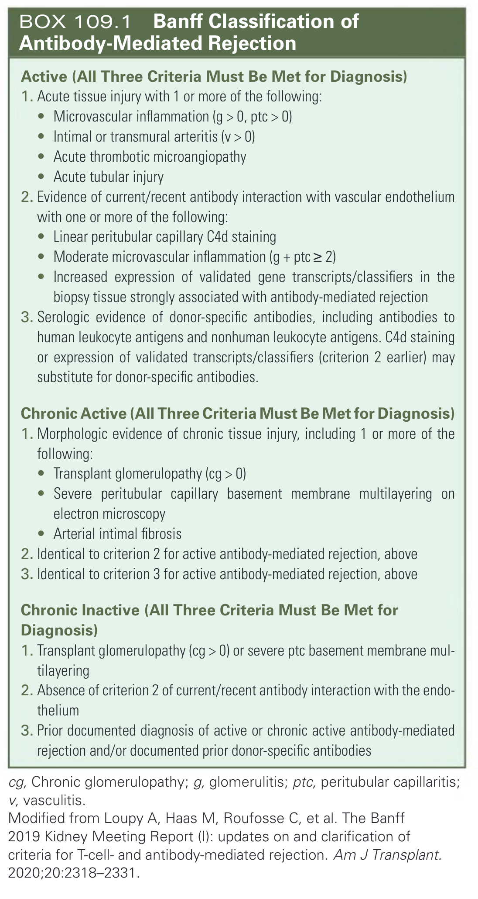

#### Box Text

```markdown
###### Box 109.1 Banff Classification of Antibody-Mediated Rejection
```

BOX 109.1 Banff Classification of Antibody-Mediated Rejection in Renal Allografts

---

### Box_109_2

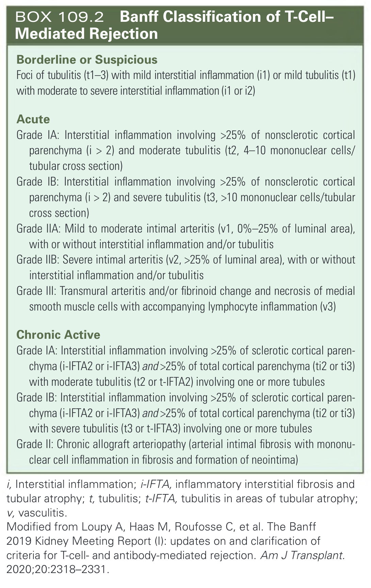

#### Box Text

```markdown
###### Box 109.2 Banff Classification of T-Cell-Mediated Rejection
```

BOX 109.2 Banff Classification of T-Cell–Mediated Rejection in Renal Allografts

---

### Box_109_3

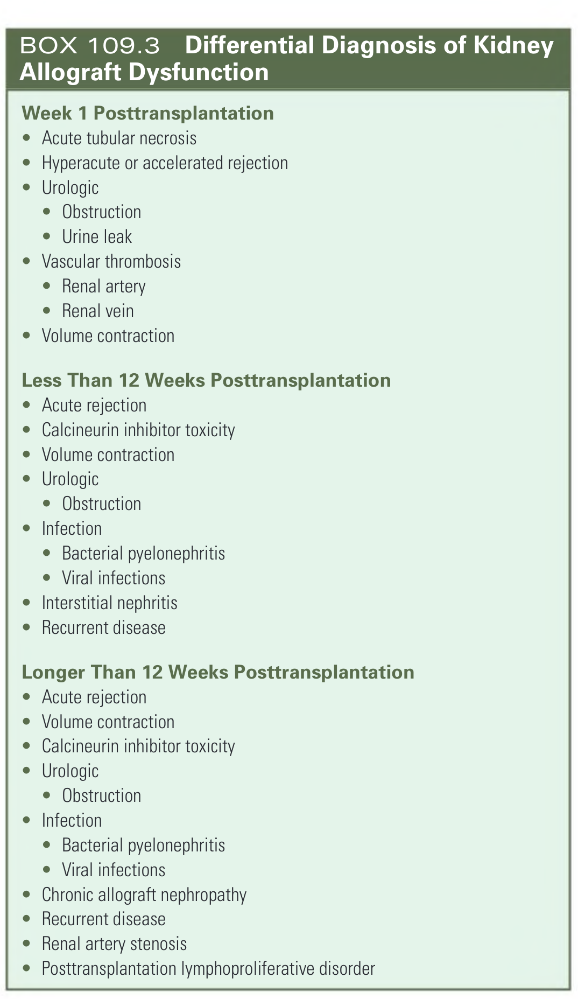

#### Box Text

```markdown
###### Box 109.3 Differential Diagnosis of Kidney Allograft Dysfunction
```

BOX 109.3 Differential Diagnosis of Kidney Allograft Dysfunction

---

### Box_109_4

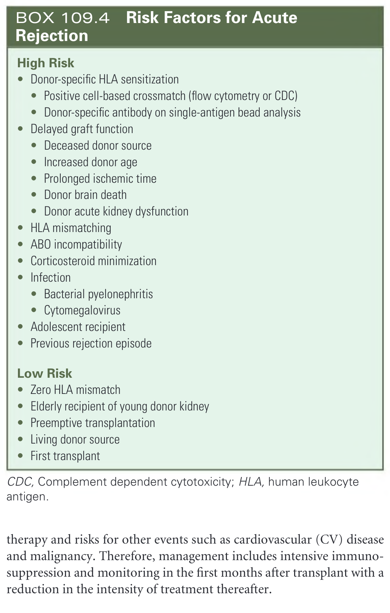

#### Box Text

```markdown
###### Box 109.4 Risk Factors for Acute Rejection
```

BOX 109.4 Risk Factors for Acute Rejection

---
