# 110. Infections and Malignancies in the Kidney Transplant Recipient - Figures and Tables Index

This document lists all figures, tables and boxes extracted from `110. Infections and Malignancies in the Kidney Transplant Recipient.pdf`.

## Table of Contents
- [Figures](#figures)
- [Tables](#tables)
- [Boxes](#boxes)

---

## Figures

### Fig_110_1

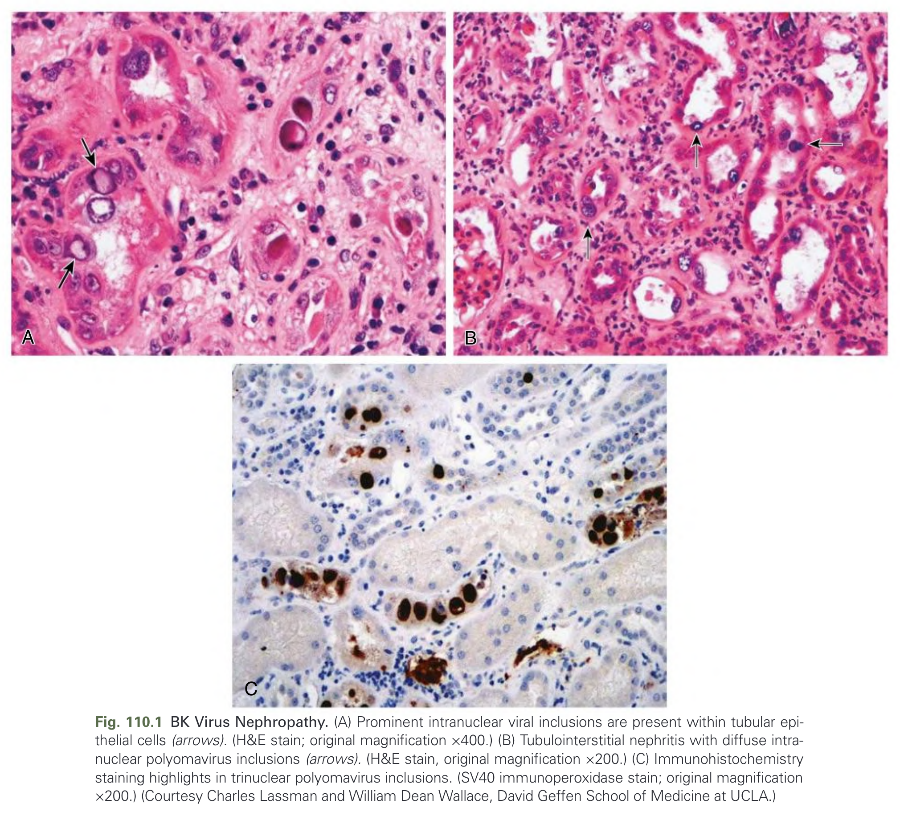

Fig. 110.1 BK Virus Nephropathy. (A) Prominent intranuclear viral inclusions are present within tubular epithelial cells (arrows). (H&E stain; original magnification ×400.) (B) Tubulointerstitial nephritis with diffuse intranuclear polyomavirus inclusions (arrows). (H&E stain, original magnification ×200.) (C) Immunohistochemistry staining highlights in trinuclear polyomavirus inclusions. (SV40 immunoperoxidase stain; original magnification ×200.) (Courtesy Charles Lassman and William Dean Wallace, David Geffen School of Medicine at UCLA.)

---

### Fig_110_2

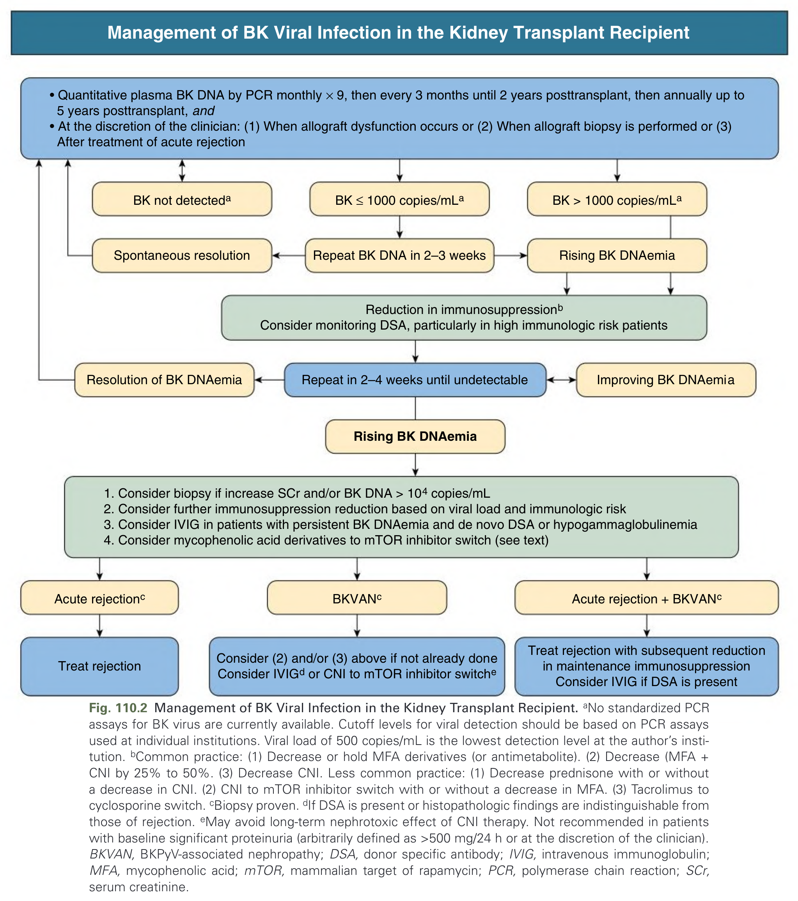

Fig. 110.2 Management of BK Viral Infection in the Kidney Transplant Recipient. aNo standardized PCR assays for BK virus are currently available. Cutoff levels for viral detection should be based on PCR assays used at individual institutions. Viral load of 500 copies/mL is the lowest detection level at the author’s institution. bCommon practice: (1) Decrease or hold MFA derivatives (or antimetabolite). (2) Decrease (MFA + CNI by 25% to 50%. (3) Decrease CNI. Less common practice: (1) Decrease prednisone with or without a decrease in CNI. (2) CNI to mTOR inhibitor switch with or without a decrease in MFA. (3) Tacrolimus to cyclosporine switch. cBiopsy proven. dIf DSA is present or histopathologic findings are indistinguishable from those of rejection. eMay avoid long-term nephrotoxic effect of CNI therapy. Not recommended in patients with baseline significant proteinuria (arbitrarily defined as >500 mg/24 h or at the discretion of the clinician). BKVAN, BKPyV-associated nephropathy; DSA, donor specific antibody; IVIG, intravenous immunoglobulin; MFA, mycophenolic acid; mTOR, mammalian target of rapamycin; PCR, polymerase chain reaction; SCr, serum creatinine.

---

### Fig_110_3

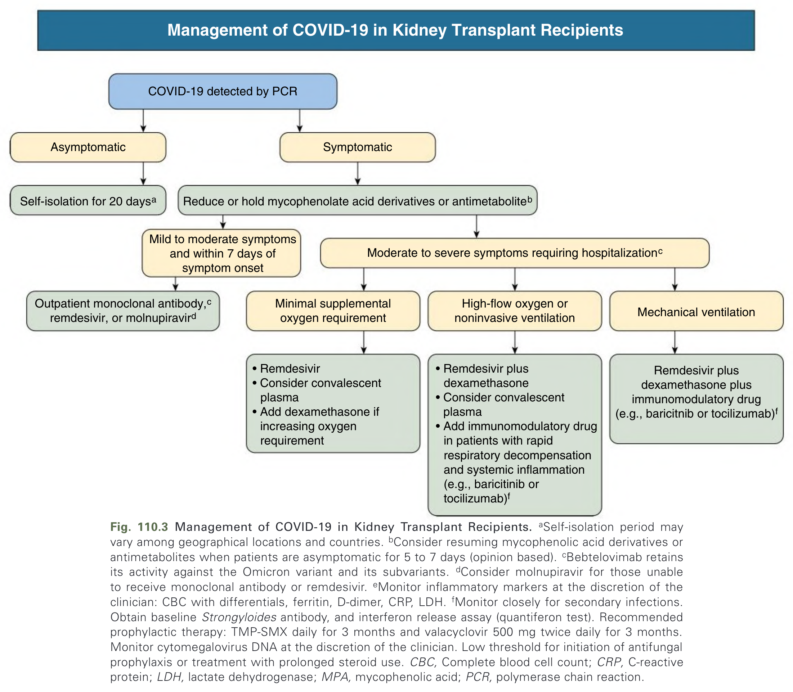

Fig. 110.3 Management of COVID-19 in Kidney Transplant Recipients. aSelf-isolation period may vary among geographical locations and countries. bConsider resuming mycophenolic acid derivatives or antimetabolites when patients are asymptomatic for 5 to 7 days (opinion based). cBebtelovimab retains its activity against the Omicron variant and its subvariants. dConsider molnupiravir for those unable to receive monoclonal antibody or remdesivir. eMonitor inflammatory markers at the discretion of the clinician: CBC with differentials, ferritin, D-dimer, CRP, LDH. fMonitor closely for secondary infections. Obtain baseline Strongyloides antibody, and interferon release assay (quantiferon test). Recommended prophylactic therapy: TMP-SMX daily for 3 months and valacyclovir 500 mg twice daily for 3 months. Monitor cytomegalovirus DNA at the discretion of the clinician. Low threshold for initiation of antifungal prophylaxis or treatment with prolonged steroid use. CBC, Complete blood cell count; CRP, C-reactive protein; LDH, lactate dehydrogenase; MPA, mycophenolic acid; PCR, polymerase chain reaction.

---

### Fig_110_4

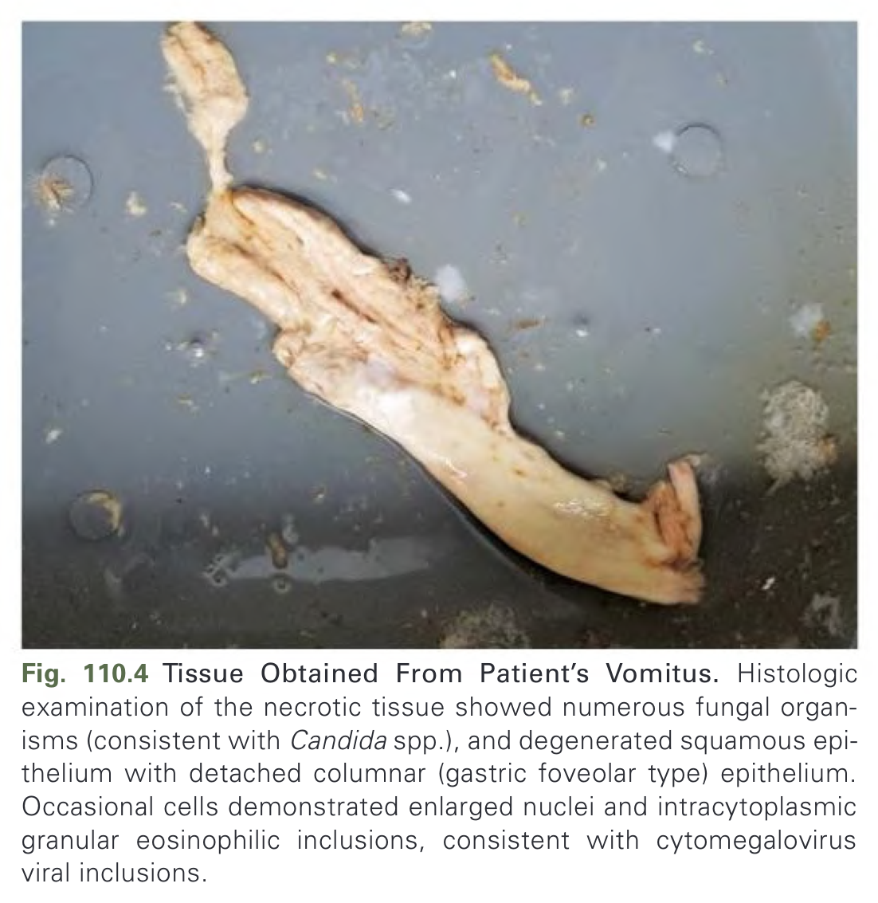

Fig. 110.4 Tissue Obtained From Patient’s Vomitus. Histologic examination of the necrotic tissue showed numerous fungal organisms (consistent with Candida spp.), and degenerated squamous epithelium with detached columnar (gastric foveolar type) epithelium. Occasional cells demonstrated enlarged nuclei and intracytoplasmic granular eosinophilic inclusions, consistent with cytomegalovirus viral inclusions.

---

## Tables

### Table_110_1

#### Table Image

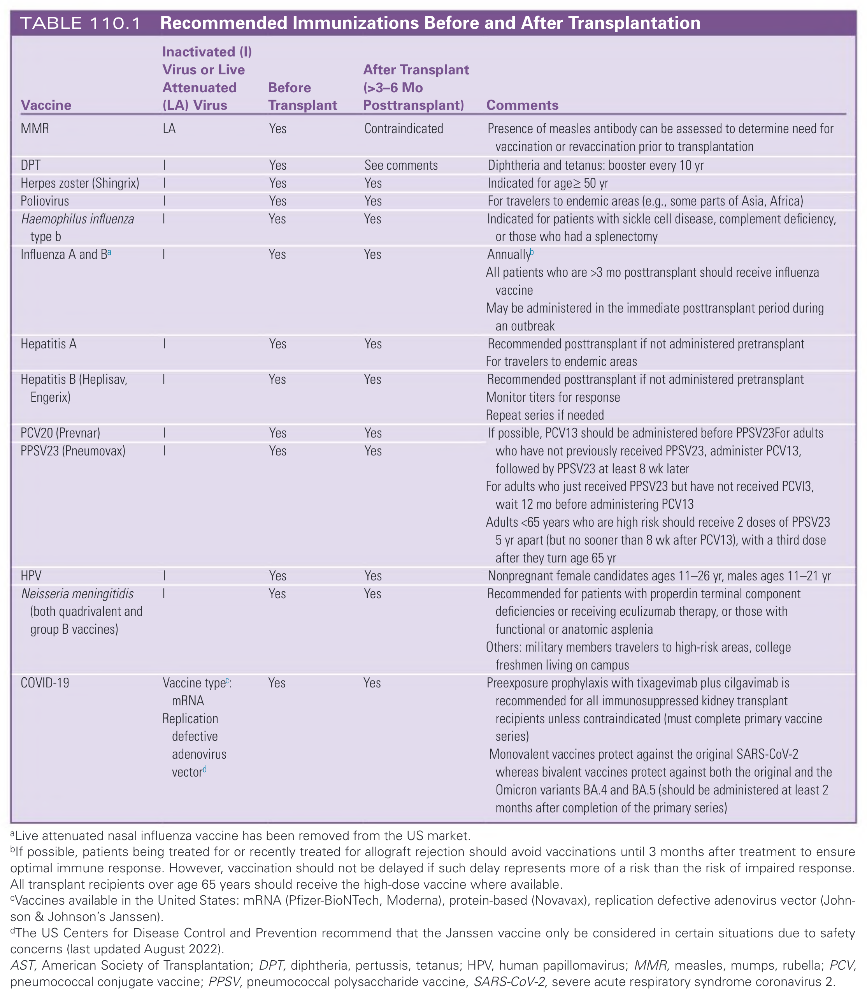

#### Table Data (CSV: [Table_110_1.csv](Table_110_1.csv))

```markdown
| Vaccine | Inactivated (I) Virus or Live Attenuated (LA) Virus | Before Transplant | After Transplant (>3-6 Mo Posttransplant) | Comments |
| :--- | :--- | :--- | :--- | :--- |
| MMR | LA | Yes | Contraindicated | Presence of measles antibody can be assessed to determine need for vaccination or revaccination prior to transplantation |
| DPT | I | Yes | See comments | Diphtheria and tetanus: booster every 10 yr |
| Herpes zoster (Shingrix) | I | Yes | Yes | Indicated for age≥ 50 yr |
| Poliovirus | I | Yes | Yes | For travelers to endemic areas (e.g., some parts of Asia, Africa) |
| Haemophilus influenza type b | I | Yes | Yes | Indicated for patients with sickle cell disease, complement deficiency, or those who had a splenectomy |
| Influenza A and Ba | I | Yes | Yes | Annuallyᵇ. All patients who are >3 mo posttransplant should receive influenza vaccine. May be administered in the immediate posttransplant period during an outbreak |
| Hepatitis A | I | Yes | Yes | Recommended posttransplant if not administered pretransplant. For travelers to endemic areas |
| Hepatitis B (Heplisav, Engerix) | I | Yes | Yes | Recommended posttransplant if not administered pretransplant. Monitor titers for response. Repeat series if needed |
| PCV20 (Prevnar) | I | Yes | Yes | If possible, PCV13 should be administered before PPSV23For adults who have not previously received PPSV23, administer PCV13, followed by PPSV23 at least 8 wk later |
| PPSV23 (Pneumovax) | I | Yes | Yes | For adults who just received PPSV23 but have not received PCVI3, wait 12 mo before administering PCV13. Adults <65 years who are high risk should receive 2 doses of PPSV23 5 yr apart (but no sooner than 8 wk after PCV13), with a third dose after they turn age 65 yr |
| HPV | I | Yes | Yes | Nonpregnant female candidates ages 11-26 yr, males ages 11-21 yr |
| Neisseria meningitidis (both quadrivalent and group B vaccines) | I | Yes | Yes | Recommended for patients with properdin terminal component deficiencies or receiving eculizumab therapy, or those with functional or anatomic asplenia. Others: military members travelers to high-risk areas, college freshmen living on campus |
| COVID-19 | Vaccine typeᶜ: mRNA, Replication defective adenovirus vectorᵈ | Yes | Yes | Preexposure prophylaxis with tixagevimab plus cilgavimab is recommended for all immunosuppressed kidney transplant recipients unless contraindicated (must complete primary vaccine series). Monovalent vaccines protect against the original SARS-CoV-2 whereas bivalent vaccines protect against both the original and the Omicron variants BA.4 and BA.5 (should be administered at least 2 months after completion of the primary series) |

aLive attenuated nasal influenza vaccine has been removed from the US market.
ᵇIf possible, patients being treated for or recently treated for allograft rejection should avoid vaccinations until 3 months after treatment to ensure optimal immune response. However, vaccination should not be delayed if such delay represents more of a risk than the risk of impaired response. All transplant recipients over age 65 years should receive the high-dose vaccine where available.
ᶜVaccines available in the United States: mRNA (Pfizer-BioNTech, Moderna), protein-based (Novavax), replication defective adenovirus vector (Johnson & Johnson's Janssen).
ᵈThe US Centers for Disease Control and Prevention recommend that the Janssen vaccine only be considered in certain situations due to safety concerns (last updated August 2022).
AST, American Society of Transplantation; DPT, diphtheria, pertussis, tetanus; HPV, human papillomavirus; MMR, measles, mumps, rubella; PCV, pneumococcal conjugate vaccine; PPSV, pneumococcal polysaccharide vaccine, SARS-CoV-2, severe acute respiratory syndrome coronavirus 2.
```

TABLE 110.1 Recommended Immunizations Before and After Transplantation
aLive attenuated nasal influenza vaccine has been removed from the US market.
bIf possible, patients being treated for or recently treated for allograft rejection should avoid vaccinations until 3 months after treatment to ensure optimal immune response. However, vaccination should not be delayed if such delay represents more of a risk than the risk of impaired response. All transplant recipients over age 65 years should receive the high-dose vaccine where available.
cVaccines available in the United States: mRNA (Pfizer-BioNTech, Moderna), protein-based (Novavax), replication defective adenovirus vector (Johnson & Johnson’s Janssen).
dThe US Centers for Disease Control and Prevention recommend that the Janssen vaccine only be considered in certain situations due to safety concerns (last updated August 2022).
AST, American Society of Transplantation; DPT, diphtheria, pertussis, tetanus; HPV, human papillomavirus; MMR, measles, mumps, rubella; PCV, pneumococcal conjugate vaccine; PPSV, pneumococcal polysaccharide vaccine; SARS-CoV-2, severe acute respiratory syndrome coronavirus 2.

---

### Table_110_2

#### Table Image

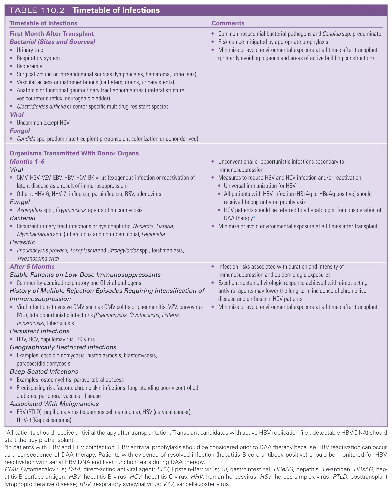

#### Table Data (CSV: [Table_110_2.csv](Table_110_2.csv))

```markdown
| Timetable of Infections | Comments |
| :--- | :--- |
| **First Month After Transplant** | |
| **Bacterial (Sites and Sources)** | • Common nosocomial bacterial pathogens and Candida spp. predominate<br>• Risk can be mitigated by appropriate prophylaxis<br>• Minimize or avoid environmental exposure at all times after transplant (primarily avoiding pigeons and areas of active building construction) |
| • Urinary tract | |
| • Respiratory system | |
| • Bacteremia | |
| • Surgical wound or intraabdominal sources (lymphoceles, hematoma, urine leak) | |
| • Vascular access or instrumentations (catheters, drains, urinary stents) | |
| • Anatomic or functional genitourinary tract abnormalities (ureteral stricture, vesicoureteric reflux, neurogenic bladder) | |
| • Clostridioides difficile or center-specific multidrug-resistant species | |
| **Viral** | |
| • Uncommon except HSV | |
| **Fungal** | |
| • Candida spp. predominate (recipient pretransplant colonization or donor derived) | |
| **Organisms Transmitted With Donor Organs Months 1-6** | • Unconventional or opportunistic infections secondary to immunosuppression<br>• Measures to reduce HBV and HCV infection and/or reactivation<br>• Universal immunization for HBV<br>• All patients with HBV infection (HBsAg or HBeAg positive) should receive lifelong antiviral prophylaxisa<br>• HCV patients should be referred to a hepatologist for consideration of DAA therapyb<br>• Minimize or avoid environmental exposure at all times after transplant |
| **Viral** | |
| • CMV, HSV, VZV, EBV, HBV, HCV, BK virus (exogenous infection or reactivation of latent disease as a result of immunosuppression) | |
| • Others: HHV-6, HHV-7, influenza, parainfluenza, RSV, adenovirus | |
| **Fungal** | |
| • Aspergillus spp., Cryptococcus, agents of mucormycosis | |
| **Bacterial** | |
| • Recurrent urinary tract infections or pyelonephritis, Nocardia, Listeria, Mycobacterium spp. (tuberculous and nontuberculous), Legionella | |
| **Parasitic** | |
| • Pneumocystis jirovecii, Toxoplasma and Strongyloides spp., leishmaniasis, Trypanosoma cruzi | |
| **After 6 Months** | • Infection risks associated with duration and intensity of immunosuppression and epidemiologic exposures<br>• Excellent sustained virologic response achieved with direct-acting antiviral agents may lower the long-term incidence of chronic liver disease and cirrhosis in HCV patients<br>• Minimize or avoid environmental exposure at all times after transplant |
| **Stable Patients on Low-Dose Immunosuppressants** | |
| • Community-acquired respiratory and GI viral pathogens | |
| **History of Multiple Rejection Episodes Requiring Intensification of Immunosuppression** | |
| • Viral infections (invasive CMV such as CMV colitis or pneumonitis, VZV, parvovirus B19), late opportunistic infections (Pneumocystis, Cryptococcus, Listeria, nocardiosis), tuberculosis | |
| **Persistent Infections** | |
| • HBV, HCV, papillomavirus, BK virus | |
| **Geographically Restricted Infections** | |
| • Examples: coccidioidomycosis, histoplasmosis, blastomycosis, paracoccidioidomycosis | |
| **Deep-Seated Infections** | |
| • Examples: osteomyelitis, paravertebral abscess<br>• Predisposing risk factors: chronic skin infections, long-standing poorly controlled diabetes, peripheral vascular disease | |
| **Associated With Malignancies** | |
| • EBV (PTLD), papilloma virus (squamous cell carcinoma), HSV (cervical cancer), HHV-8 (Kaposi sarcoma) | |

aAll patients should receive antiviral therapy after transplantation. Transplant candidates with active HBV replication (i.e., detectable HBV DNA) should start therapy pretransplant.
bIn patients with HBV and HCV coinfection, HBV antiviral prophylaxis should be considered prior to DAA therapy because HBV reactivation can occur as a consequence of DAA therapy. Patients with evidence of resolved infection (hepatitis B core antibody positive) should be monitored for HBV reactivation with serial HBV DNA and liver function tests during DAA therapy.
CMV, Cytomegalovirus; DAA, direct-acting antiviral agent; EBV, Epstein-Barr virus; GI, gastrointestinal; HBeAG, hepatitis B e-antigen; HBsAG, hepatitis B surface antigen; HBV, hepatitis B virus; HCV, hepatitis C virus; HHV, human herpesvirus; HSV, herpes simplex virus; PTLD, posttransplant lymphoproliferative disease; RSV, respiratory syncytial virus; VZV, varicella zoster virus.
```

TABLE 110.2 Timetable of Infections
aAll patients should receive antiviral therapy after transplantation. Transplant candidates with active HBV replication (i.e., detectable HBV DNA) should start therapy pretransplant.
bIn patients with HBV and HCV coinfection, HBV antiviral prophylaxis should be considered prior to DAA therapy because HBV reactivation can occur as a consequence of DAA therapy. Patients with evidence of resolved infection (hepatitis B core antibody positive) should be monitored for HBV reactivation with serial HBV DNA and liver function tests during DAA therapy.
CMV, Cytomegalovirus; DAA, direct-acting antiviral agent; EBV, Epstein-Barr virus; GI, gastrointestinal; HBeAG, hepatitis B e-antigen; HBsAG, hepatitis B surface antigen; HBV, hepatitis B virus; HCV, hepatitis C virus; HHV, human herpesvirus; HSV, herpes simplex virus; PTLD, posttransplant lymphoproliferative disease; RSV, respiratory syncytial virus; VZV, varicella zoster virus.

---

### Table_110_3

#### Table Image

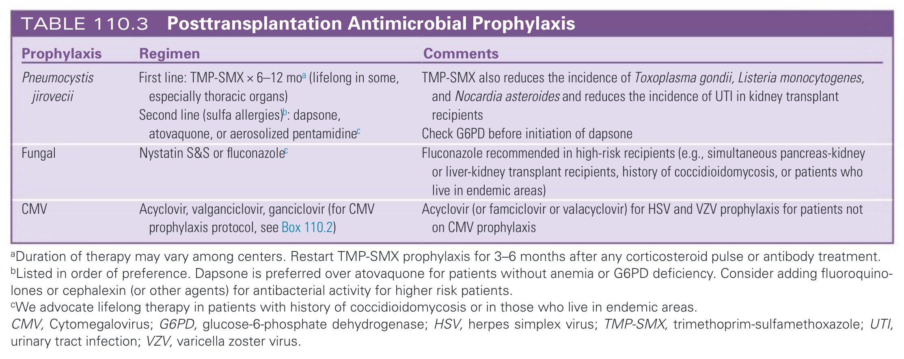

#### Table Data (CSV: [Table_110_3.csv](Table_110_3.csv))

```markdown
| Prophylaxis | Regimen | Comments |
| :--- | :--- | :--- |
| Pneumocystis jirovecii | First line: TMP-SMX × 6-12 moᵃ (lifelong in some, especially thoracic organs)<br>Second line (sulfa allergies)ᵇ: dapsone, atovaquone, or aerosolized pentamidineᶜ | TMP-SMX also reduces the incidence of Toxoplasma gondii, Listeria monocytogenes, and Nocardia asteroides and reduces the incidence of UTI in kidney transplant recipients<br>Check G6PD before initiation of dapsone |
| Fungal | Nystatin S&S or fluconazoleᶜ | Fluconazole recommended in high-risk recipients (e.g., simultaneous pancreas-kidney or liver-kidney transplant recipients, history of coccidioidomycosis, or patients who live in endemic areas) |
| CMV | Acyclovir, valganciclovir, ganciclovir (for CMV prophylaxis protocol, see Box 110.2) | Acyclovir (or famciclovir or valacyclovir) for HSV and VZV prophylaxis for patients not on CMV prophylaxis |

aDuration of therapy may vary among centers. Restart TMP-SMX prophylaxis for 3-6 months after any corticosteroid pulse or antibody treatment.
bListed in order of preference. Dapsone is preferred over atovaquone for patients without anemia or G6PD deficiency. Consider adding fluoroquinolones or cephalexin (or other agents) for antibacterial activity for higher risk patients.
cWe advocate lifelong therapy in patients with history of coccidioidomycosis or in those who live in endemic areas.
CMV, Cytomegalovirus; G6PD, glucose-6-phosphate dehydrogenase; HSV, herpes simplex virus; TMP-SMX, trimethoprim-sulfamethoxazole; UTI, urinary tract infection; VZV, varicella zoster virus.
```

TABLE 110.3 Posttransplantation Antimicrobial Prophylaxis
aDuration of therapy may vary among centers. Restart TMP-SMX prophylaxis for 3–6 months after any corticosteroid pulse or antibody treatment.
bListed in order of preference. Dapsone is preferred over atovaquone for patients without anemia or G6PD deficiency. Consider adding fluoroquinolones or cephalexin (or other agents) for antibacterial activity for higher risk patients.
cWe advocate lifelong therapy in patients with history of coccidioidomycosis or in those who live in endemic areas.
CMV, Cytomegalovirus; G6PD, glucose-6-phosphate dehydrogenase; HSV, herpes simplex virus; TMP-SMX, trimethoprim-sulfamethoxazole; UTI, urinary tract infection; VZV, varicella zoster virus.

---

### Table_110_4

#### Table Image

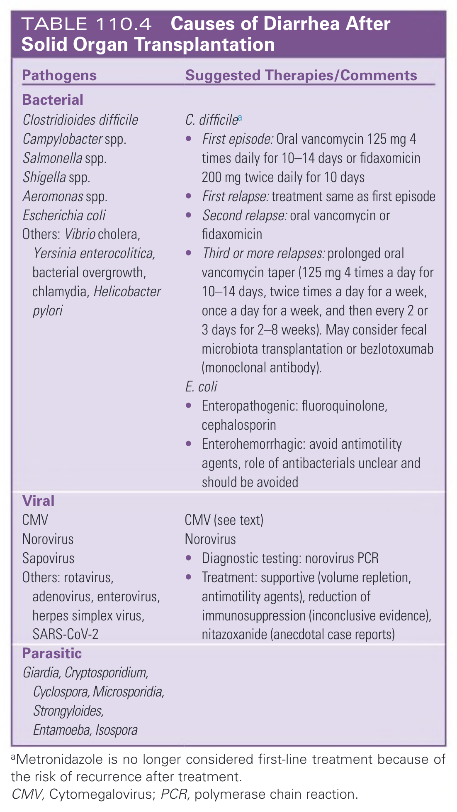

#### Table Data (CSV: [Table_110_4.csv](Table_110_4.csv))

```markdown
| Pathogens | Suggested Therapies/Comments |
| :--- | :--- |
| **Bacterial** | |
| Clostridioides difficile | **C. difficilea**<br>• First episode: Oral vancomycin 125 mg 4 times daily for 10-14 days or fidaxomicin 200 mg twice daily for 10 days<br>• First relapse: treatment same as first episode<br>• Second relapse: oral vancomycin or fidaxomicin<br>• Third or more relapses: prolonged oral vancomycin taper (125 mg 4 times a day for 10-14 days, twice times a day for a week, once a day for a week, and then every 2 or 3 days for 2-8 weeks). May consider fecal microbiota transplantation or bezlotoxumab (monoclonal antibody). |
| Campylobacter spp. | |
| Salmonella spp. | |
| Shigella spp. | |
| Aeromonas spp. | |
| Escherichia coli | **E. coli**<br>• Enteropathogenic: fluoroquinolone, cephalosporin<br>• Enterohemorrhagic: avoid antimotility agents, role of antibacterials unclear and should be avoided |
| Others: Vibrio cholera, Yersinia enterocolitica, bacterial overgrowth, chlamydia, Helicobacter pylori | |
| **Viral** | |
| CMV | CMV (see text) |
| Norovirus | **Norovirus**<br>• Diagnostic testing: norovirus PCR<br>• Treatment: supportive (volume repletion, antimotility agents), reduction of immunosuppression (inconclusive evidence), nitazoxanide (anecdotal case reports) |
| Sapovirus | |
| Others: rotavirus, adenovirus, enterovirus, herpes simplex virus, SARS-CoV-2 | |
| **Parasitic** | |
| Giardia, Cryptosporidium, Cyclospora, Microsporidia, Strongyloides, Entamoeba, Isospora | |

aMetronidazole is no longer considered first-line treatment because of the risk of recurrence after treatment.
CMV, Cytomegalovirus; PCR, polymerase chain reaction.
```

TABLE 110.4 Causes of Diarrhea After Solid Organ Transplantation
aMetronidazole is no longer considered first-line treatment because of the risk of recurrence after treatment.
CMV, Cytomegalovirus; PCR, polymerase chain reaction.

---

### Table_110_5

#### Table Image

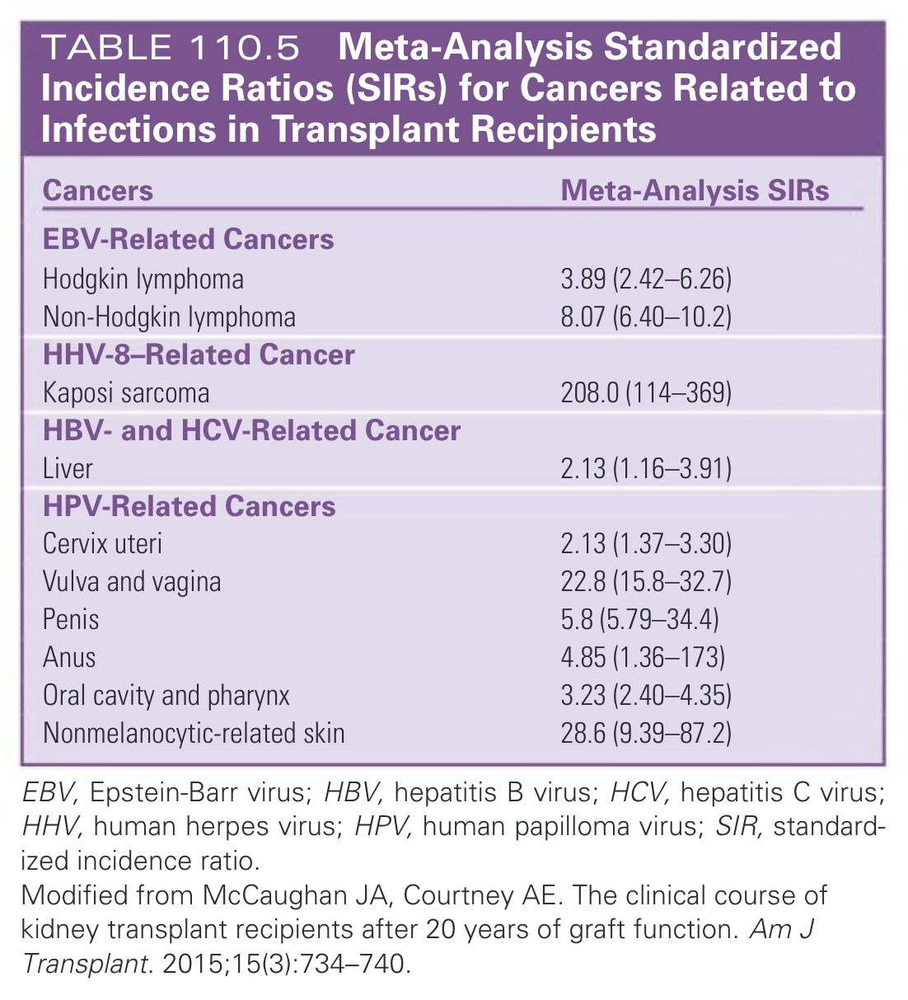

#### Table Data (CSV: [Table_110_5.csv](Table_110_5.csv))

```markdown
| Cancers | Meta-Analysis SIRs |
| :--- | :--- |
| **EBV-Related Cancers** | |
| Hodgkin lymphoma | 3.89 (2.42-6.26) |
| Non-Hodgkin lymphoma | 8.07 (6.40-10.2) |
| **HHV-8-Related Cancer** | |
| Kaposi sarcoma | 208.0 (114-369) |
| **HBV- and HCV-Related Cancer** | |
| Liver | 2.13 (1.16-3.91) |
| **HPV-Related Cancers** | |
| Cervix uteri | 2.13 (1.37-3.30) |
| Vulva and vagina | 22.8 (15.8-32.7) |
| Penis | 5.8 (5.79-34.4) |
| Anus | 4.85 (1.36-173) |
| Oral cavity and pharynx | 3.23 (2.40-4.35) |
| Nonmelanocytic-related skin | 28.6 (9.39-87.2) |

EBV, Epstein-Barr virus; HBV, hepatitis B virus; HCV, hepatitis C virus; HHV, human herpes virus; HPV, human papilloma virus; SIR, standardized incidence ratio.
Modified from McCaughan JA, Courtney AE. The clinical course of kidney transplant recipients after 20 years of graft function. Am J Transplant. 2015;15(3):734-740.
```

TABLE 110.5 Meta-Analysis Standardized Incidence Ratios (SIRs) for Cancers Related to Infections in Transplant Recipients
EBV, Epstein-Barr virus; HBV, hepatitis B virus; HCV, hepatitis C virus; HHV, human herpes virus; HPV, human papilloma virus; SIR, standardized incidence ratio.
Modified from McCaughan JA, Courtney AE. The clinical course of kidney transplant recipients after 20 years of graft function. Am J Transplant. 2015;15(3):734–740.

---

### Table_110_6

#### Table Image

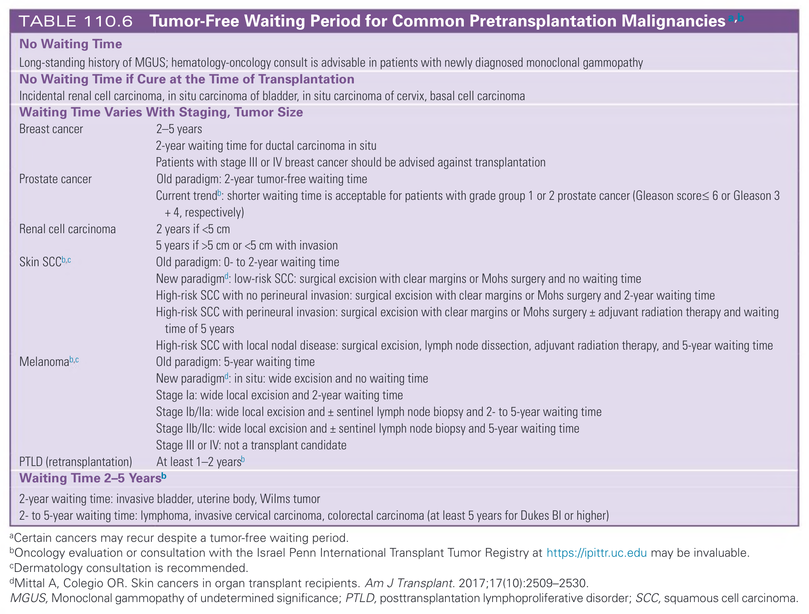

#### Table Data (CSV: [Table_110_6.csv](Table_110_6.csv))

```markdown
| | |
| :--- | :--- |
| **No Waiting Time** | Long-standing history of MGUS; hematology-oncology consult is advisable in patients with newly diagnosed monoclonal gammopathy |
| **No Waiting Time if Cure at the Time of Transplantation** | Incidental renal cell carcinoma, in situ carcinoma of bladder, in situ carcinoma of cervix, basal cell carcinoma |
| **Waiting Time Varies With Staging, Tumor Size** | |
| Breast cancer | 2-5 years<br>2-year waiting time for ductal carcinoma in situ<br>Patients with stage III or IV breast cancer should be advised against transplantation |
| Prostate cancer | Old paradigm: 2-year tumor-free waiting time<br>Current trendᵇ: shorter waiting time is acceptable for patients with grade group 1 or 2 prostate cancer (Gleason score≤ 6 or Gleason 3 + 4, respectively) |
| Renal cell carcinoma | 2 years if <5 cm<br>5 years if >5 cm or <5 cm with invasion |
| Skin SCCᵇ,ᶜ | Old paradigm: 0- to 2-year waiting time<br>New paradigmᵈ: low-risk SCC: surgical excision with clear margins or Mohs surgery and no waiting time<br>High-risk SCC with no perineural invasion: surgical excision with clear margins or Mohs surgery and 2-year waiting time<br>High-risk SCC with perineural invasion: surgical excision with clear margins or Mohs surgery ± adjuvant radiation therapy and waiting time of 5 years<br>High-risk SCC with local nodal disease: surgical excision, lymph node dissection, adjuvant radiation therapy, and 5-year waiting time |
| Melanomaᵇ,ᶜ | Old paradigm: 5-year waiting time<br>New paradigmᵈ: in situ: wide excision and no waiting time<br>Stage Ia: wide local excision and 2-year waiting time<br>Stage Ib/IIa: wide local excision and ± sentinel lymph node biopsy and 2- to 5-year waiting time<br>Stage IIb/IIc: wide local excision and ± sentinel lymph node biopsy and 5-year waiting time<br>Stage III or IV: not a transplant candidate |
| PTLD (retransplantation) | At least 1-2 yearsᵇ |
| **Waiting Time 2-5 Yearsᵇ** | 2-year waiting time: invasive bladder, uterine body, Wilms tumor<br>2- to 5-year waiting time: lymphoma, invasive cervical carcinoma, colorectal carcinoma (at least 5 years for Dukes Bl or higher) |

aCertain cancers may recur despite a tumor-free waiting period.
bOncology evaluation or consultation with the Israel Penn International Transplant Tumor Registry at https://ipittr.uc.edu may be invaluable.
cDermatology consultation is recommended.
dMittal A, Colegio OR. Skin cancers in organ transplant recipients. Am J Transplant. 2017;17(10):2509-2530.
MGUS, Monoclonal gammopathy of undetermined significance; PTLD, posttransplantation lymphoproliferative disorder; SCC, squamous cell carcinoma.
```

TABLE 110.6 Tumor-Free Waiting Period for Common Pretransplantation Malignancies a,b
aCertain cancers may recur despite a tumor-free waiting period.
bOncology evaluation or consultation with the Israel Penn International Transplant Tumor Registry at https://ipittr.uc.edu may be invaluable.
cDermatology consultation is recommended.
dMittal A, Colegio OR. Skin cancers in organ transplant recipients. Am J Transplant. 2017;17(10):2509–2530.
MGUS, Monoclonal gammopathy of undetermined significance; PTLD, posttransplantation lymphoproliferative disorder; SCC, squamous cell carcinoma.

---

### Table_110_7

#### Table Image

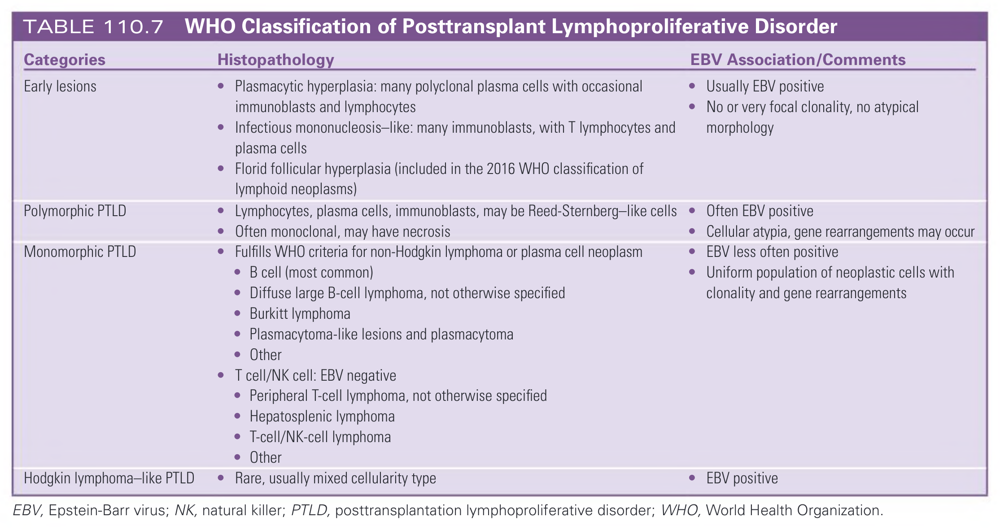

#### Table Data (CSV: [Table_110_7.csv](Table_110_7.csv))

```markdown
| Categories | Histopathology | EBV Association/Comments |
| :--- | :--- | :--- |
| Early lesions | • Plasmacytic hyperplasia: many polyclonal plasma cells with occasional immunoblasts and lymphocytes<br>• Infectious mononucleosis-like: many immunoblasts, with T lymphocytes and plasma cells<br>• Florid follicular hyperplasia (included in the 2016 WHO classification of lymphoid neoplasms) | • Usually EBV positive<br>• No or very focal clonality, no atypical morphology |
| Polymorphic PTLD | • Lymphocytes, plasma cells, immunoblasts, may be Reed-Sternberg-like cells<br>• Often monoclonal, may have necrosis | • Often EBV positive<br>• Cellular atypia, gene rearrangements may occur |
| Monomorphic PTLD | • Fulfills WHO criteria for non-Hodgkin lymphoma or plasma cell neoplasm<br>• B cell (most common)<br>• Diffuse large B-cell lymphoma, not otherwise specified<br>• Burkitt lymphoma<br>• Plasmacytoma-like lesions and plasmacytoma<br>• Other<br>• T cell/NK cell: EBV negative<br>• Peripheral T-cell lymphoma, not otherwise specified<br>• Hepatosplenic lymphoma<br>• T-cell/NK-cell lymphoma<br>• Other | • EBV less often positive<br>• Uniform population of neoplastic cells with clonality and gene rearrangements |
| Hodgkin lymphoma-like PTLD | • Rare, usually mixed cellularity type | • EBV positive |

EBV, Epstein-Barr virus; NK, natural killer; PTLD, posttransplantation lymphoproliferative disorder; WHO, World Health Organization.
```

TABLE 110.7 WHO Classification of Posttransplant Lymphoproliferative Disorder
EBV, Epstein-Barr virus; NK, natural killer; PTLD, posttransplantation lymphoproliferative disorder; WHO, World Health Organization.

---

### Table_110_8

#### Table Image

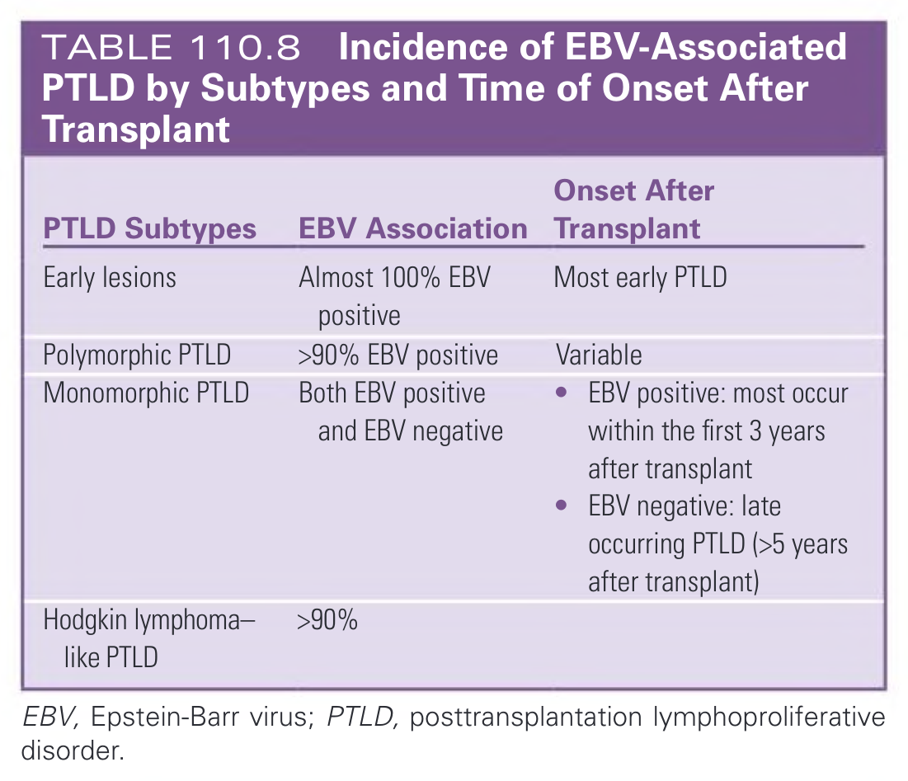

#### Table Data (CSV: [Table_110_8.csv](Table_110_8.csv))

```markdown
| PTLD Subtypes | EBV Association | Onset After Transplant |
| :--- | :--- | :--- |
| Early lesions | Almost 100% EBV positive | Most early PTLD |
| Polymorphic PTLD | >90% EBV positive | Variable |
| Monomorphic PTLD | Both EBV positive and EBV negative | • EBV positive: most occur within the first 3 years after transplant<br>• EBV negative: late occurring PTLD (>5 years after transplant) |
| Hodgkin lymphoma-like PTLD | >90% | |

EBV, Epstein-Barr virus; PTLD, posttransplantation lymphoproliferative disorder.
```

TABLE 110.8 Incidence of EBV-Associated PTLD by Subtypes and Time of Onset After Transplant
EBV, Epstein-Barr virus; PTLD, posttransplantation lymphoproliferative disorder.

---

### Table_110_9

#### Table Image

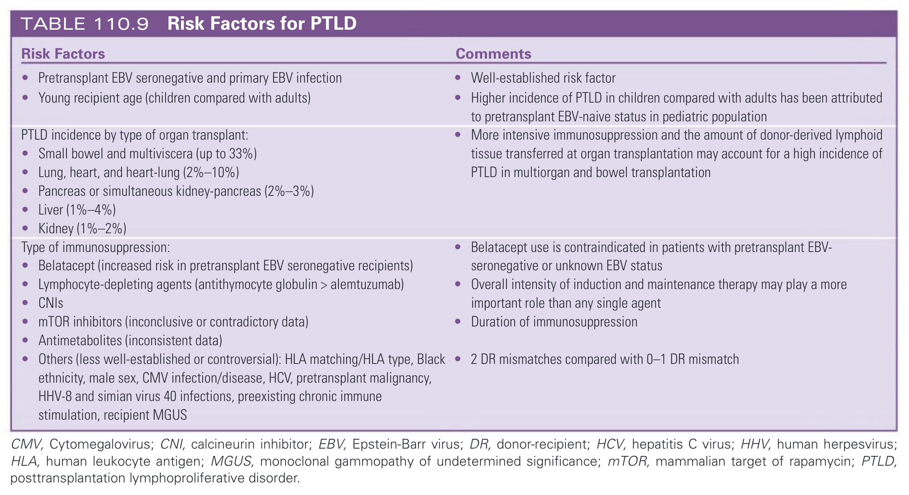

#### Table Data (CSV: [Table_110_9.csv](Table_110_9.csv))

```markdown
| Risk Factors | Comments |
| :--- | :--- |
| • Pretransplant EBV seronegative and primary EBV infection | • Well-established risk factor |
| • Young recipient age (children compared with adults) | • Higher incidence of PTLD in children compared with adults has been attributed to pretransplant EBV-naive status in pediatric population |
| PTLD incidence by type of organ transplant:<br>• Small bowel and multiviscera (up to 33%)<br>• Lung, heart, and heart-lung (2%-10%)<br>• Pancreas or simultaneous kidney-pancreas (2%-3%)<br>• Liver (1%-4%)<br>• Kidney (1%-2%) | • More intensive immunosuppression and the amount of donor-derived lymphoid tissue transferred at organ transplantation may account for a high incidence of PTLD in multiorgan and bowel transplantation |
| Type of immunosuppression:<br>• Belatacept (increased risk in pretransplant EBV seronegative recipients)<br>• Lymphocyte-depleting agents (antithymocyte globulin > alemtuzumab)<br>• CNIs<br>• mTOR inhibitors (inconclusive or contradictory data)<br>• Antimetabolites (inconsistent data) | • Belatacept use is contraindicated in patients with pretransplant EBV-seronegative or unknown EBV status<br>• Overall intensity of induction and maintenance therapy may play a more important role than any single agent<br>• Duration of immunosuppression |
| • Others (less well-established or controversial): HLA matching/HLA type, Black ethnicity, male sex, CMV infection/disease, HCV, pretransplant malignancy, HHV-8 and simian virus 40 infections, preexisting chronic immune stimulation, recipient MGUS | • 2 DR mismatches compared with 0-1 DR mismatch |

CMV, Cytomegalovirus; CNI, calcineurin inhibitor; EBV, Epstein-Barr virus; DR, donor-recipient; HCV, hepatitis C virus; HHV, human herpesvirus; HLA, human leukocyte antigen; MGUS, monoclonal gammopathy of undetermined significance; mTOR, mammalian target of rapamycin; PTLD, posttransplantation lymphoproliferative disorder.
```

TABLE 110.9 Risk Factors for PTLD
CMV, Cytomegalovirus; CNI, calcineurin inhibitor; EBV, Epstein-Barr virus; DR, donor-recipient; HCV, hepatitis C virus; HHV, human herpesvirus; HLA, human leukocyte antigen; MGUS, monoclonal gammopathy of undetermined significance; mTOR, mammalian target of rapamycin; PTLD, posttransplantation lymphoproliferative disorder.

---

### Table_110_10

#### Table Image

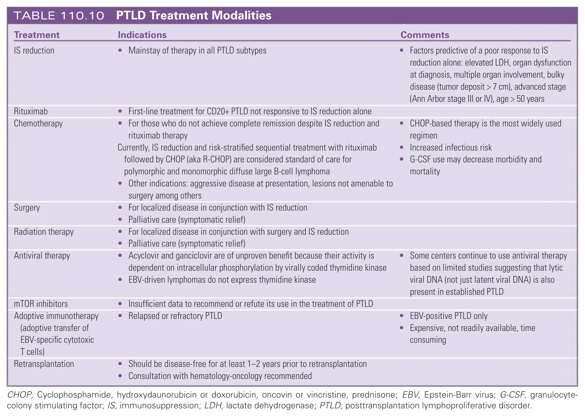

#### Table Data (CSV: [Table_110_10.csv](Table_110_10.csv))

```markdown
| Treatment | Indications | Comments |
| :--- | :--- | :--- |
| IS reduction | • Mainstay of therapy in all PTLD subtypes | • Factors predictive of a poor response to IS reduction alone: elevated LDH, organ dysfunction at diagnosis, multiple organ involvement, bulky disease (tumor deposit > 7 cm), advanced stage (Ann Arbor stage III or IV), age > 50 years |
| Rituximab | • First-line treatment for CD20+ PTLD not responsive to IS reduction alone | |
| Chemotherapy | • For those who do not achieve complete remission despite IS reduction and rituximab therapy<br>Currently, IS reduction and risk-stratified sequential treatment with rituximab followed by CHOP (aka R-CHOP) are considered standard of care for polymorphic and monomorphic diffuse large B-cell lymphoma<br>• Other indications: aggressive disease at presentation, lesions not amenable to surgery among others | • CHOP-based therapy is the most widely used regimen<br>• Increased infectious risk<br>• G-CSF use may decrease morbidity and mortality |
| Surgery | • For localized disease in conjunction with IS reduction<br>• Palliative care (symptomatic relief) | |
| Radiation therapy | • For localized disease in conjunction with surgery and IS reduction<br>• Palliative care (symptomatic relief) | |
| Antiviral therapy | • Acyclovir and ganciclovir are of unproven benefit because their activity is dependent on intracellular phosphorylation by virally coded thymidine kinase<br>• EBV-driven lymphomas do not express thymidine kinase | • Some centers continue to use antiviral therapy based on limited studies suggesting that lytic viral DNA (not just latent viral DNA) is also present in established PTLD |
| mTOR inhibitors | • Insufficient data to recommend or refute its use in the treatment of PTLD | |
| Adoptive immunotherapy (adoptive transfer of EBV-specific cytotoxic T cells) | • Relapsed or refractory PTLD | • EBV-positive PTLD only<br>• Expensive, not readily available, time consuming |
| Retransplantation | • Should be disease-free for at least 1-2 years prior to retransplantation<br>• Consultation with hematology-oncology recommended | |

CHOP, Cyclophosphamide, hydroxydaunorubicin or doxorubicin, oncovin or vincristine, prednisone; EBV, Epstein-Barr virus; G-CSF, granulocyte-colony stimulating factor; IS, immunosuppression; LDH, lactate dehydrogenase; PTLD, posttransplantation lymphoproliferative disorder.
```

TABLE 110.10 PTLD Treatment Modalities
CHOP, Cyclophosphamide, hydroxydaunorubicin or doxorubicin, oncovin or vincristine, prednisone; EBV, Epstein-Barr virus; G-CSF, granulocyte-colony stimulating factor; IS, immunosuppression; LDH, lactate dehydrogenase; PTLD, posttransplantation lymphoproliferative disorder.

---

## Boxes

### Box_110_1

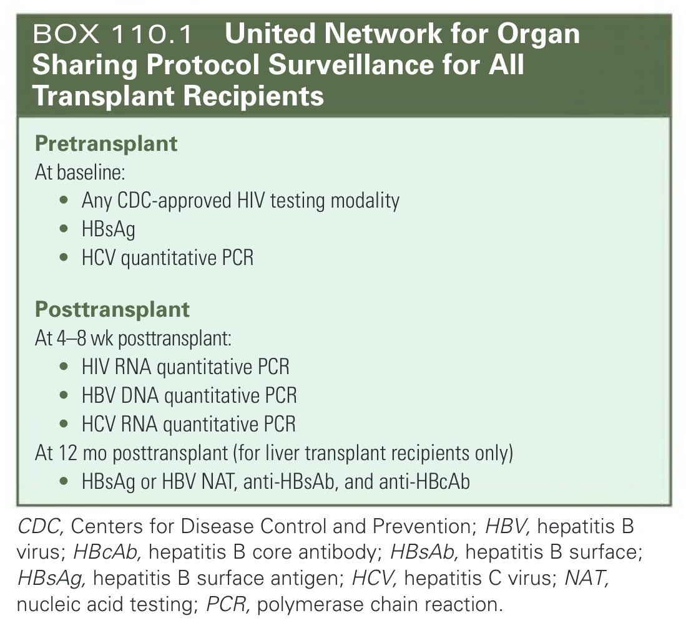

#### Box Text

```markdown
**Pretransplant**
At baseline:
*   Any CDC-approved HIV testing modality
*   HBsAg
*   HCV quantitative PCR

**Posttransplant**
At 4-8 wk posttransplant:
*   HIV RNA quantitative PCR
*   HBV DNA quantitative PCR
*   HCV RNA quantitative PCR
At 12 mo posttransplant (for liver transplant recipients only)
*   HBsAg or HBV NAT, anti-HBsAb, and anti-HBcAb

CDC, Centers for Disease Control and Prevention; HBV, hepatitis B virus; HBcAb, hepatitis B core antibody; HBsAb, hepatitis B surface; HBsAg, hepatitis B surface antigen; HCV, hepatitis C virus; NAT, nucleic acid testing; PCR, polymerase chain reaction.
```

BOX 110.1 United Network for Organ Sharing Protocol Surveillance for All Transplant Recipients
CDC, Centers for Disease Control and Prevention; HBV, hepatitis B virus; HBcAb, hepatitis B core antibody; HBsAb, hepatitis B surface; HBsAg, hepatitis B surface antigen; HCV, hepatitis C virus; NAT, nucleic acid testing; PCR, polymerase chain reaction.

---

### Box_110_2

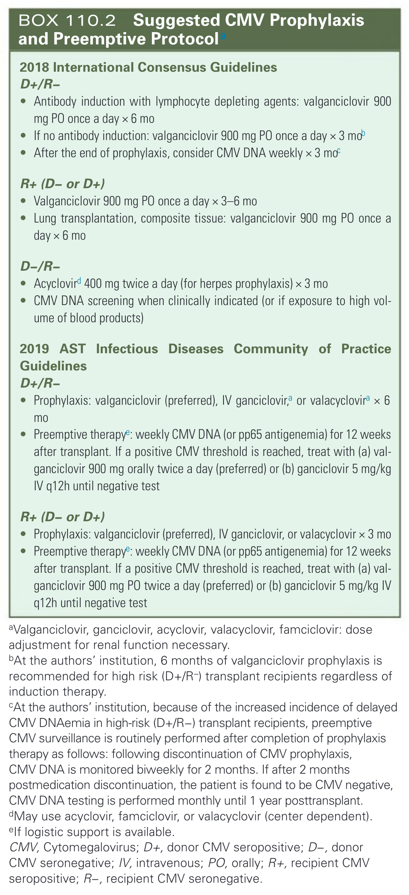

#### Box Text

```markdown
**2018 International Consensus Guidelines**
**D+/R-**
*   Antibody induction with lymphocyte depleting agents: valganciclovir 900 mg PO once a day × 6 mo
*   If no antibody induction: valganciclovir 900 mg PO once a day × 3 mob
*   After the end of prophylaxis, consider CMV DNA weekly × 3 mo

**R+ (D- or D+)**
*   Valganciclovir 900 mg PO once a day × 3-6 mo
*   Lung transplantation, composite tissue: valganciclovir 900 mg PO once a day x 6 mo

**D-/R-**
*   Acyclovird 400 mg twice a day (for herpes prophylaxis) × 3 mo
*   CMV DNA screening when clinically indicated (or if exposure to high volume of blood products)

**2019 AST Infectious Diseases Community of Practice Guidelines**
**D+/R-**
*   Prophylaxis: valganciclovir (preferred), IV ganciclovir, or valacyclovira × 6 mo
*   Preemptive therapyᶜ: weekly CMV DNA (or pp65 antigenemia) for 12 weeks after transplant. If a positive CMV threshold is reached, treat with (a) valganciclovir 900 mg orally twice a day (preferred) or (b) ganciclovir 5 mg/kg IV q12h until negative test

**R+ (D- or D+)**
*   Prophylaxis: valganciclovir (preferred), IV ganciclovir, or valacyclovir × 3 mo
*   Preemptive therapyᵉ: weekly CMV DNA (or pp65 antigenemia) for 12 weeks after transplant. If a positive CMV threshold is reached, treat with (a) valganciclovir 900 mg PO twice a day (preferred) or (b) ganciclovir 5 mg/kg IV q12h until negative test

aValganciclovir, ganciclovir, acyclovir, valacyclovir, famciclovir: dose adjustment for renal function necessary.
bAt the authors' institution, 6 months of valganciclovir prophylaxis is recommended for high risk (D+/R-) transplant recipients regardless of induction therapy.
cAt the authors' institution, because of the increased incidence of delayed CMV DNAemia in high-risk (D+/R-) transplant recipients, preemptive CMV surveillance is routinely performed after completion of prophylaxis therapy as follows: following discontinuation of CMV prophylaxis, CMV DNA is monitored biweekly for 2 months. If after 2 months postmedication discontinuation, the patient is found to be CMV negative, CMV DNA testing is performed monthly until 1 year posttransplant.
dMay use acyclovir, famciclovir, or valacyclovir (center dependent).
eIf logistic support is available.
CMV, Cytomegalovirus; D+, donor CMV seropositive; D-, donor CMV seronegative; IV, intravenous; PO, orally; R+, recipient CMV seropositive; R-, recipient CMV seronegative.
```

BOX 110.2 Suggested CMV Prophylaxis and Preemptive Protocol
aValganciclovir, ganciclovir, acyclovir, valacyclovir, famciclovir: dose adjustment for renal function necessary.
bAt the authors’ institution, 6 months of valganciclovir prophylaxis is recommended for high risk (D+/R−) transplant recipients regardless of induction therapy.
cAt the authors’ institution, because of the increased incidence of delayed CMV DNAemia in high-risk (D+/R−) transplant recipients, preemptive CMV surveillance is routinely performed after completion of prophylaxis therapy as follows: following discontinuation of CMV prophylaxis, CMV DNA is monitored biweekly for 2 months. If after 2 months postmedication discontinuation, the patient is found to be CMV negative, CMV DNA testing is performed monthly until 1 year posttransplant.
dMay use acyclovir, famciclovir, or valacyclovir (center dependent).
eIf logistic support is available.
CMV, Cytomegalovirus; D+, donor CMV seropositive; D−, donor CMV seronegative; IV, intravenous; PO, orally; R+, recipient CMV seropositive; R−, recipient CMV seronegative.

---

### Box_110_3

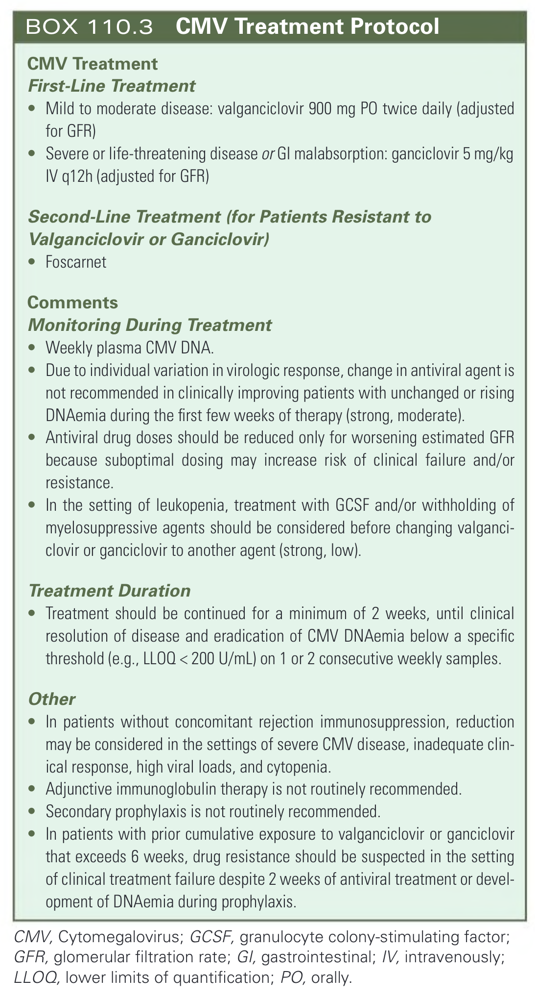

#### Box Text

```markdown
**CMV Treatment**
**First-Line Treatment**
*   Mild to moderate disease: valganciclovir 900 mg PO twice daily (adjusted for GFR)
*   Severe or life-threatening disease or Gl malabsorption: ganciclovir 5 mg/kg IV q12h (adjusted for GFR)

**Second-Line Treatment (for Patients Resistant to Valganciclovir or Ganciclovir)**
*   Foscarnet

**Comments**
**Monitoring During Treatment**
*   Weekly plasma CMV DNA.
*   Due to individual variation in virologic response, change in antiviral agent is not recommended in clinically improving patients with unchanged or rising DNAemia during the first few weeks of therapy (strong, moderate).
*   Antiviral drug doses should be reduced only for worsening estimated GFR because suboptimal dosing may increase risk of clinical failure and/or resistance.
*   In the setting of leukopenia, treatment with GCSF and/or withholding of myelosuppressive agents should be considered before changing valganciclovir or ganciclovir to another agent (strong, low).

**Treatment Duration**
*   Treatment should be continued for a minimum of 2 weeks, until clinical resolution of disease and eradication of CMV DNAemia below a specific threshold (e.g., LLOQ < 200 U/mL) on 1 or 2 consecutive weekly samples.

**Other**
*   In patients without concomitant rejection immunosuppression, reduction may be considered in the settings of severe CMV disease, inadequate clinical response, high viral loads, and cytopenia.
*   Adjunctive immunoglobulin therapy is not routinely recommended.
*   Secondary prophylaxis is not routinely recommended.
*   In patients with prior cumulative exposure to valganciclovir or ganciclovir that exceeds 6 weeks, drug resistance should be suspected in the setting of clinical treatment failure despite 2 weeks of antiviral treatment or development of DNAemia during prophylaxis.

CMV, Cytomegalovirus; GCSF, granulocyte colony-stimulating factor; GFR, glomerular filtration rate; Gl, gastrointestinal; IV, intravenously; LLOQ, lower limits of quantification; PO, orally.
```

BOX 110.3 CMV Treatment Protocol
CMV, Cytomegalovirus; GCSF, granulocyte colony-stimulating factor; GFR, glomerular filtration rate; GI, gastrointestinal; IV, intravenously; LLOQ, lower limits of quantification; PO, orally.

---
