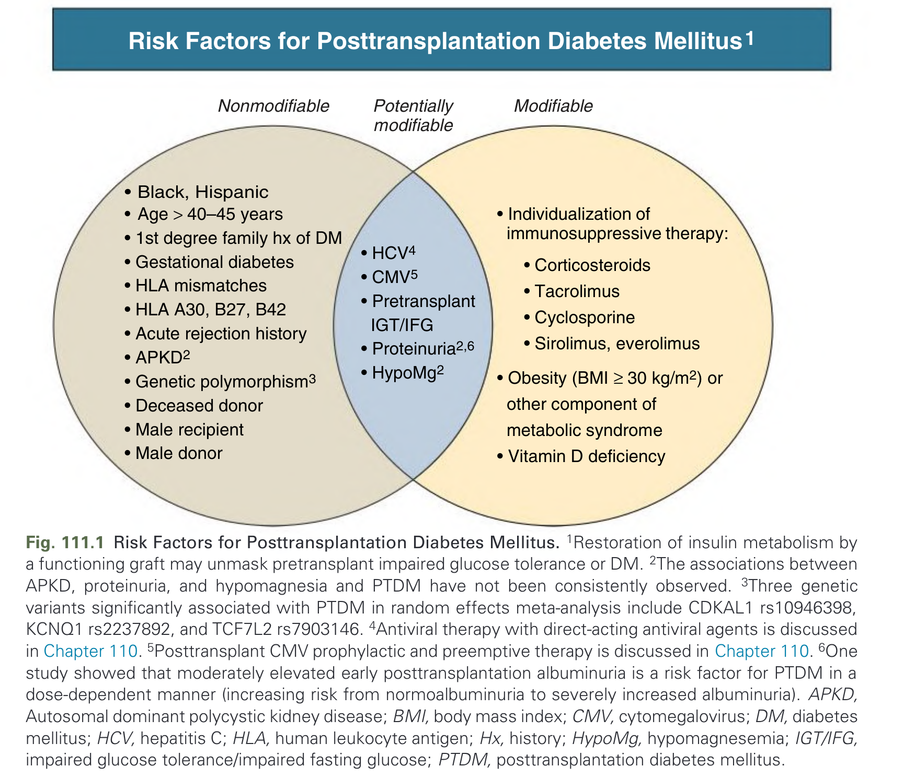
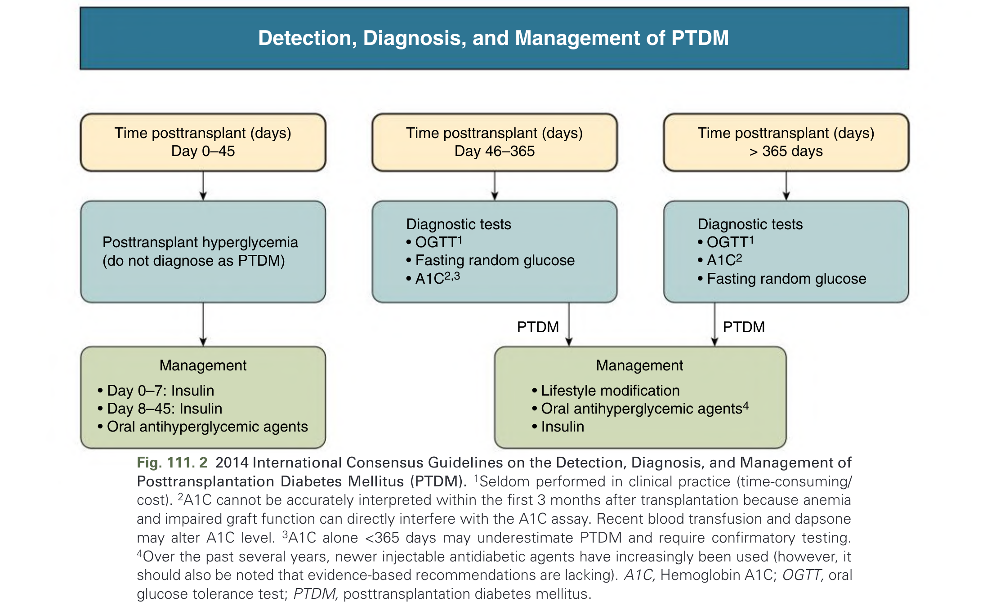
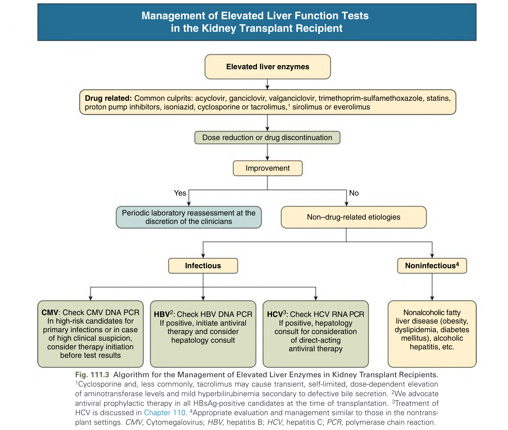
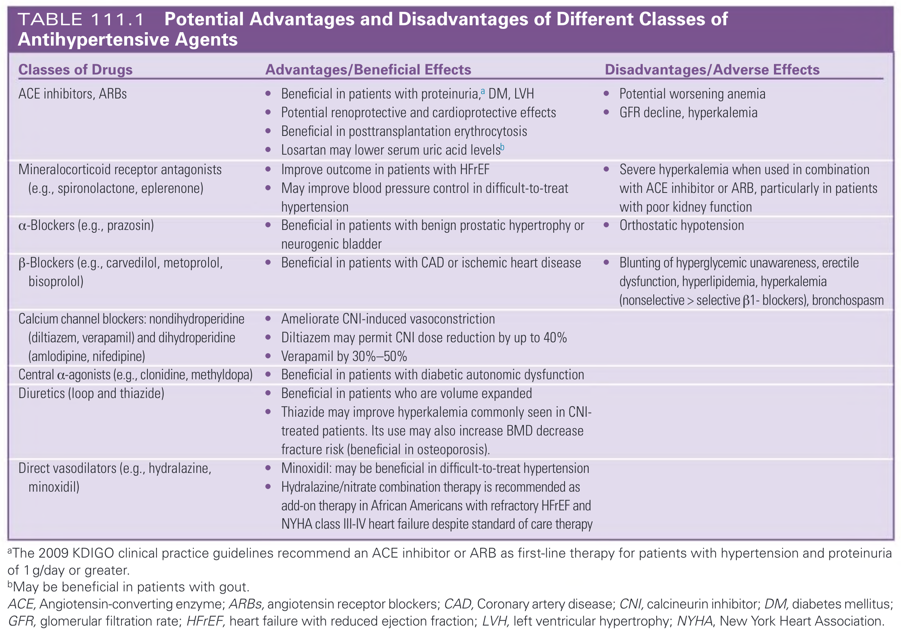
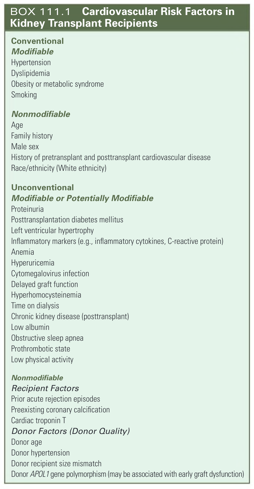
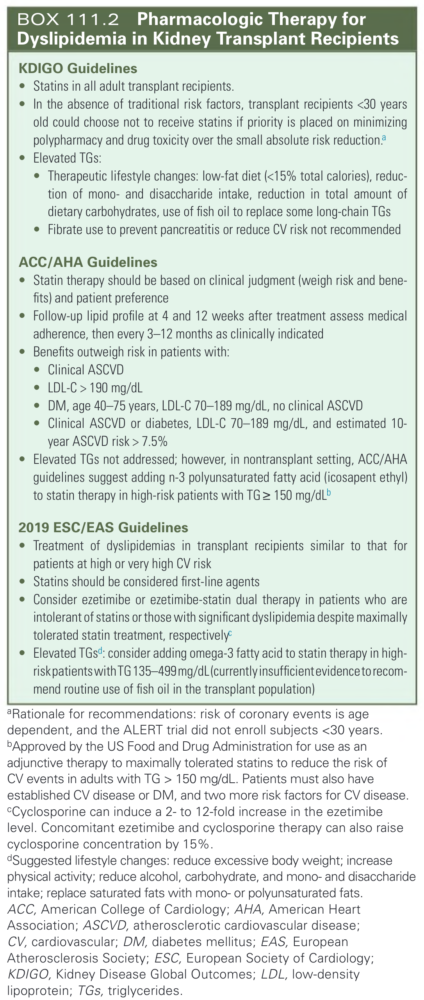

# 111. Cardiovascular Disease and Metabolic Abnormalities in the Kidney Transplant Recipient - Figures and Tables Index

This document lists all figures, tables and boxes extracted from `111. Cardiovascular Disease and Metabolic Abnormalities in the Kidney Transplant Recipient.pdf`.

## Table of Contents
- [Figures](#figures)
- [Tables](#tables)
- [Boxes](#boxes)

---

## Figures

### Fig_111_1



Fig. 111.1 Risk Factors for Posttransplantation Diabetes Mellitus. 1Restoration of insulin metabolism by a functioning graft may unmask pretransplant impaired glucose tolerance or DM. 2The associations between APKD, proteinuria, and hypomagnesia and PTDM have not been consistently observed. 3Three genetic variants significantly associated with PTDM in random effects meta-analysis include CDKAL1 rs10946398, KCNQ1 rs2237892, and TCF7L2 rs7903146. 4Antiviral therapy with direct-acting antiviral agents is discussed in Chapter 110. 5Posttransplant CMV prophylactic and preemptive therapy is discussed in Chapter 110. 6One study showed that moderately elevated early posttransplantation albuminuria is a risk factor for PTDM in a dose-dependent manner (increasing risk from normoalbuminuria to severely increased albuminuria). APKD, Autosomal dominant polycystic kidney disease; BMI, body mass index; CMV, cytomegalovirus; DM, diabetes mellitus; HCV, hepatitis C; HLA, human leukocyte antigen; Hx, history; HypoMg, hypomagnesemia; IGT/IFG, impaired glucose tolerance/impaired fasting glucose; PTDM, posttransplantation diabetes mellitus.

---

### Fig_111_2



Fig. 111. 2 2014 International Consensus Guidelines on the Detection, Diagnosis, and Management of Posttransplantation Diabetes Mellitus (PTDM). 1Seldom performed in clinical practice (time-consuming/ cost). 2A1C cannot be accurately interpreted within the first 3 months after transplantation because anemia and impaired graft function can directly interfere with the A1C assay. Recent blood transfusion and dapsone may alter A1C level. 3A1C alone <365 days may underestimate PTDM and require confirmatory testing. 4Over the past several years, newer injectable antidiabetic agents have increasingly been used (however, it should also be noted that evidence-based recommendations are lacking). A1C, Hemoglobin A1C; OGTT, oral glucose tolerance test; PTDM, posttransplantation diabetes mellitus.

---

### Fig_111_3



Fig. 111.3 Algorithm for the Management of Elevated Liver Enzymes in Kidney Transplant Recipients. 1Cyclosporine and, less commonly, tacrolimus may cause transient, self-limited, dose-dependent elevation of aminotransferase levels and mild hyperbilirubinemia secondary to defective bile secretion. 2We advocate antiviral prophylactic therapy in all HBsAg-positive candidates at the time of transplantation. 3Treatment of HCV is discussed in Chapter 110. 4Appropriate evaluation and management similar to those in the nontrans- plant settings. CMV, Cytomegalovirus; HBV, hepatitis B; HCV, hepatitis C; PCR, polymerase chain reaction.

---

## Tables

### Table_111_1

#### Table Image



#### Table Data (CSV: [Table_111_1.csv](Table_111_1.csv))

```markdown
| Classes of Drugs | Advantages/Beneficial Effects | Disadvantages/Adverse Effects |
| :--- | :--- | :--- |
| ACE inhibitors, ARBs | • Beneficial in patients with proteinuria,a DM, LVH<br>• Potential renoprotective and cardioprotective effects<br>• Beneficial in posttransplantation erythrocytosis<br>• Losartan may lower serum uric acid levelsb | • Potential worsening anemia<br>• GFR decline, hyperkalemia |
| Mineralocorticoid receptor antagonists (e.g., spironolactone, eplerenone) | • Improve outcome in patients with HFrEF<br>• May improve blood pressure control in difficult-to-treat hypertension | • Severe hyperkalemia when used in combination with ACE inhibitor or ARB, particularly in patients with poor kidney function |
| α-Blockers (e.g., prazosin) | • Beneficial in patients with benign prostatic hypertrophy or neurogenic bladder | • Orthostatic hypotension |
| β-Blockers (e.g., carvedilol, metoprolol, bisoprolol) | • Beneficial in patients with CAD or ischemic heart disease | • Blunting of hyperglycemic unawareness, erectile dysfunction, hyperlipidemia, hyperkalemia (nonselective > selective β1- blockers), bronchospasm |
| Calcium channel blockers: nondihydroperidine (diltiazem, verapamil) and dihydroperidine (amlodipine, nifedipine) | • Ameliorate CNI-induced vasoconstriction<br>• Diltiazem may permit CNI dose reduction by up to 40%<br>• Verapamil by 30%-50% | |
| Central α-agonists (e.g., clonidine, methyldopa) | • Beneficial in patients with diabetic autonomic dysfunction | |
| Diuretics (loop and thiazide) | • Beneficial in patients who are volume expanded<br>• Thiazide may improve hyperkalemia commonly seen in CNI-treated patients. Its use may also increase BMD decrease fracture risk (beneficial in osteoporosis). | |
| Direct vasodilators (e.g., hydralazine, minoxidil) | • Minoxidil: may be beneficial in difficult-to-treat hypertension<br>• Hydralazine/nitrate combination therapy is recommended as add-on therapy in African Americans with refractory HFrEF and NYHA class III-IV heart failure despite standard of care therapy | |

aThe 2009 KDIGO clinical practice guidelines recommend an ACE inhibitor or ARB as first-line therapy for patients with hypertension and proteinuria of 1 g/day or greater.
bMay be beneficial in patients with gout.
ACE, Angiotensin-converting enzyme; ARBs, angiotensin receptor blockers; CAD, Coronary artery disease; CNI, calcineurin inhibitor; DM, diabetes mellitus; GFR, glomerular filtration rate; HFrEF, heart failure with reduced ejection fraction; LVH, left ventricular hypertrophy; NYHA, New York Heart Association.
```

TABLE 111.1 Potential Advantages and Disadvantages of Different Classes of Antihypertensive Agents

---

## Boxes

### Box_111_1



#### Box Text

```markdown
**Conventional**
**Modifiable**
* Hypertension
* Dyslipidemia
* Obesity or metabolic syndrome
* Smoking

**Nonmodifiable**
* Age
* Family history
* Male sex
* History of pretransplant and posttransplant cardiovascular disease
* Race/ethnicity (White ethnicity)

**Unconventional**
**Modifiable or Potentially Modifiable**
* Proteinuria
* Posttransplantation diabetes mellitus
* Left ventricular hypertrophy
* Inflammatory markers (e.g., inflammatory cytokines, C-reactive protein)
* Anemia
* Hyperuricemia
* Cytomegalovirus infection
* Delayed graft function
* Hyperhomocysteinemia
* Time on dialysis
* Chronic kidney disease (posttransplant)
* Low albumin
* Obstructive sleep apnea
* Prothrombotic state
* Low physical activity

**Nonmodifiable**
**Recipient Factors**
* Prior acute rejection episodes
* Preexisting coronary calcification
* Cardiac troponin T

**Donor Factors (Donor Quality)**
* Donor age
* Donor hypertension
* Donor recipient size mismatch
* Donor APOL 1 gene polymorphism (may be associated with early graft dysfunction)
```

BOX 111.1 Cardiovascular Risk Factors in Kidney Transplant Recipients

---

### Box_111_2



#### Box Text

```markdown
**KDIGO Guidelines**
* Statins in all adult transplant recipients.
* In the absence of traditional risk factors, transplant recipients <30 years old could choose not to receive statins if priority is placed on minimizing polypharmacy and drug toxicity over the small absolute risk reduction.a
* Elevated TGs:
* Therapeutic lifestyle changes: low-fat diet (<15% total calories), reduction of mono- and disaccharide intake, reduction in total amount of dietary carbohydrates, use of fish oil to replace some long-chain TGs
* Fibrate use to prevent pancreatitis or reduce CV risk not recommended

**ACC/AHA Guidelines**
* Statin therapy should be based on clinical judgment (weigh risk and benefits) and patient preference
* Follow-up lipid profile at 4 and 12 weeks after treatment assess medical adherence, then every 3-12 months as clinically indicated
* Benefits outweigh risk in patients with:
* Clinical ASCVD
* LDL-C > 190 mg/dL
* DM, age 40-75 years, LDL-C 70-189 mg/dL, no clinical ASCVD
* Clinical ASCVD or diabetes, LDL-C 70-189 mg/dL, and estimated 10-year ASCVD risk > 7.5%
* Elevated TGs not addressed; however, in nontransplant setting, ACC/AHA guidelines suggest adding n-3 polyunsaturated fatty acid (icosapent ethyl) to statin therapy in high-risk patients with TG≥ 150 mg/dLb

**2019 ESC/EAS Guidelines**
* Treatment of dyslipidemias in transplant recipients similar to that for patients at high or very high CV risk
* Statins should be considered first-line agents
* Consider ezetimibe or ezetimibe-statin dual therapy in patients who are intolerant of statins or those with significant dyslipidemia despite maximally tolerated statin treatment, respectively
* Elevated TGsd: consider adding omega-3 fatty acid to statin therapy in high-risk patients with TG 135–499mg/dL (currently insufficient evidence to recommend routine use of fish oil in the transplant population)

aRationale for recommendations: risk of coronary events is age dependent, and the ALERT trial did not enroll subjects <30 years.
bApproved by the US Food and Drug Administration for use as an adjunctive therapy to maximally tolerated statins to reduce the risk of CV events in adults with TG > 150 mg/dL. Patients must also have established CV disease or DM, and two more risk factors for CV disease.
Cyclosporine can induce a 2- to 12-fold increase in the ezetimibe level. Concomitant ezetimibe and cyclosporine therapy can also raise cyclosporine concentration by 15%.
dSuggested lifestyle changes: reduce excessive body weight; increase physical activity; reduce alcohol, carbohydrate, and mono- and disaccharide intake; replace saturated fats with mono- or polyunsaturated fats.
ACC, American College of Cardiology; AHA, American Heart Association; ASCVD, atherosclerotic cardiovascular disease; CV, cardiovascular; DM, diabetes mellitus; EAS, European Atherosclerosis Society; ESC, European Society of Cardiology; KDIGO, Kidney Disease Global Outcomes; LDL, low-density lipoprotein; TGs, triglycerides.
```

BOX 111.2 Pharmacologic Therapy for Dyslipidemia in Kidney Transplant Recipients

---
