# 112. Chronic Allograft Injury - Figures and Tables Index

This document lists all figures, tables and boxes extracted from `112. Chronic Allograft Injury.pdf`.

## Table of Contents
- [Figures](#figures)
- [Tables](#tables)
- [Boxes](#boxes)

---

## Figures

### Fig_112_1

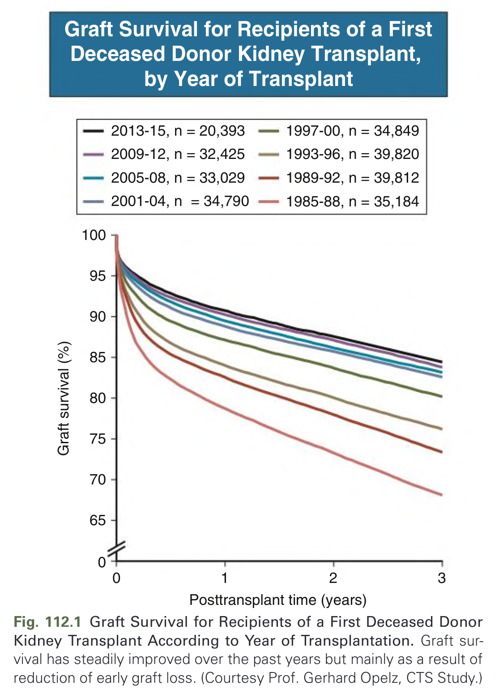

Fig. 112.1 Graft Survival for Recipients of a First Deceased Donor Kidney Transplant According to Year of Transplantation. Graft survival has steadily improved over the past years but mainly as a result of reduction of early graft loss. (Courtesy Prof. Gerhard Opelz, CTS Study.)

---

### Fig_112_2

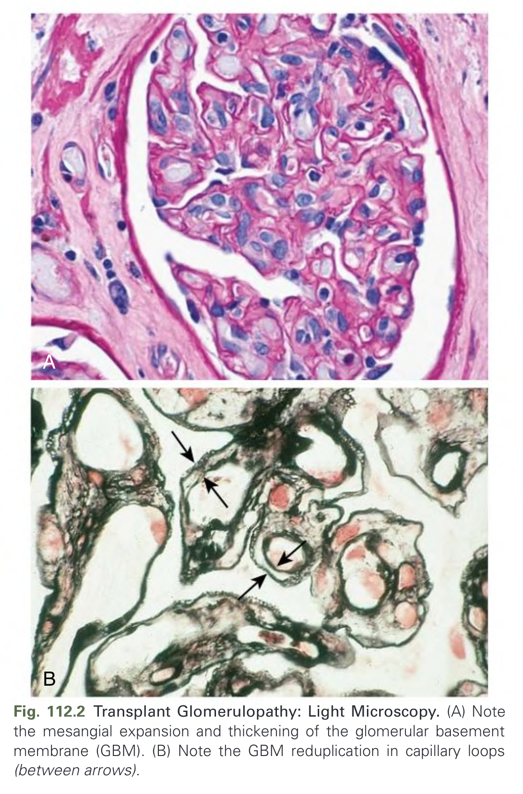

Fig. 112.2 Transplant Glomerulopathy: Light Microscopy. (A) Note the mesangial expansion and thickening of the glomerular basement membrane (GBM). (B) Note the GBM reduplication in capillary loops (between arrows).

---

### Fig_112_3

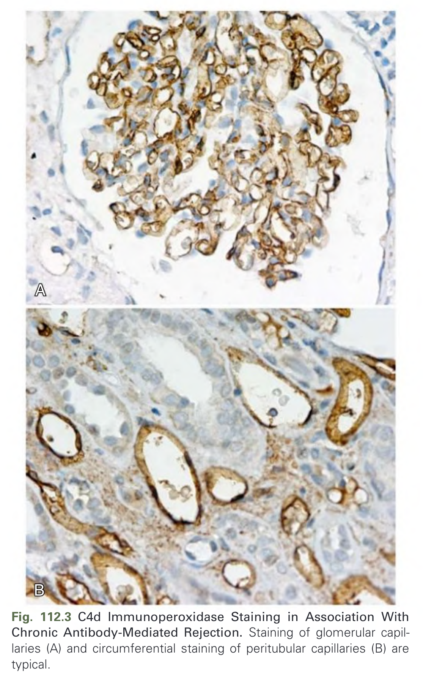

Fig. 112.3 C4d Immunoperoxidase Staining in Association With Chronic Antibody-Mediated Rejection. Staining of glomerular capillaries (A) and circumferential staining of peritubular capillaries (B) are typical.

---

### Fig_112_4

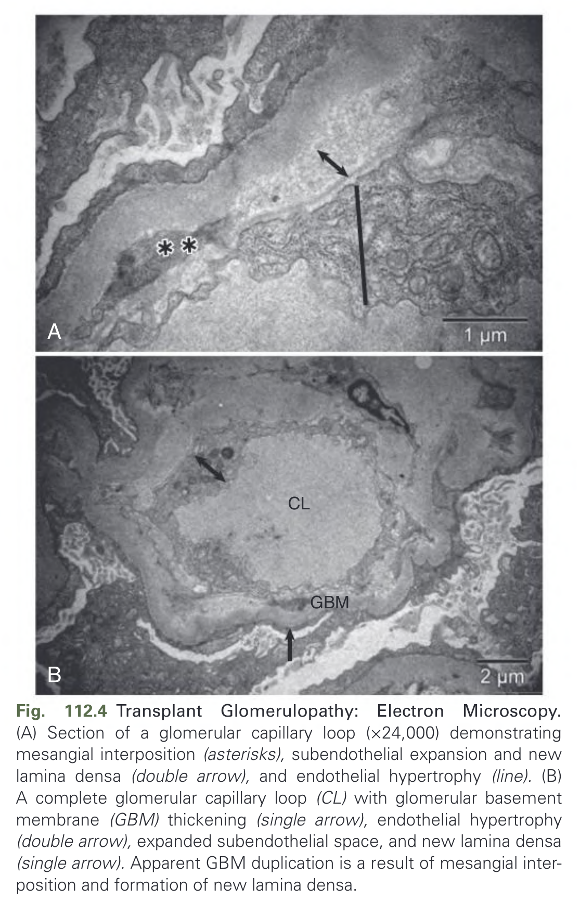

Fig. 112.4 Transplant Glomerulopathy: Electron Microscopy. (A) Section of a glomerular capillary loop (×24,000) demonstrating mesangial interposition (asterisks), subendothelial expansion and new lamina densa (double arrow), and endothelial hypertrophy (line). (B) A complete glomerular capillary loop (CL) with glomerular basement membrane (GBM) thickening (single arrow), endothelial hypertrophy (double arrow), expanded subendothelial space, and new lamina densa (single arrow). Apparent GBM duplication is a result of mesangial interposition and formation of new lamina densa.

---

### Fig_112_5

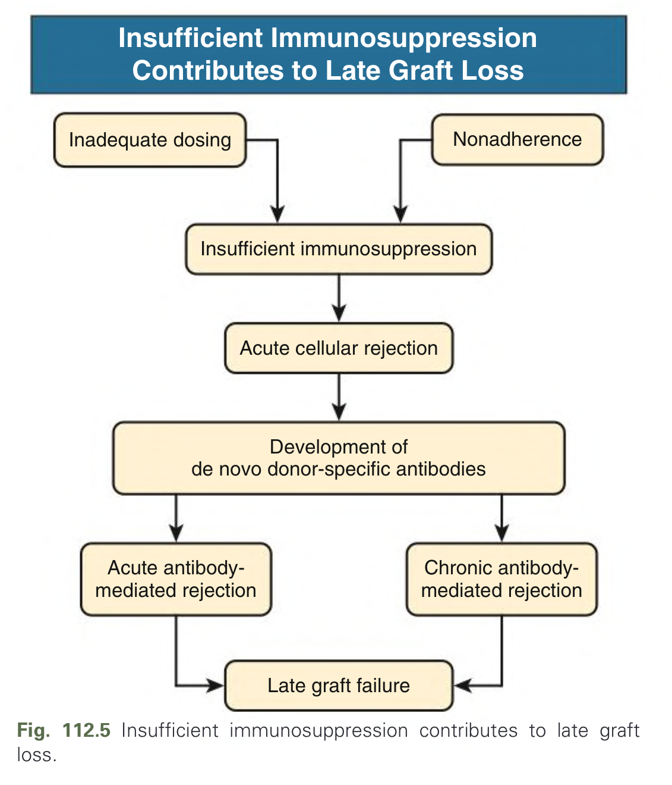

Fig. 112.5 Insufficient immunosuppression contributes to late graft loss.

---

### Fig_112_6

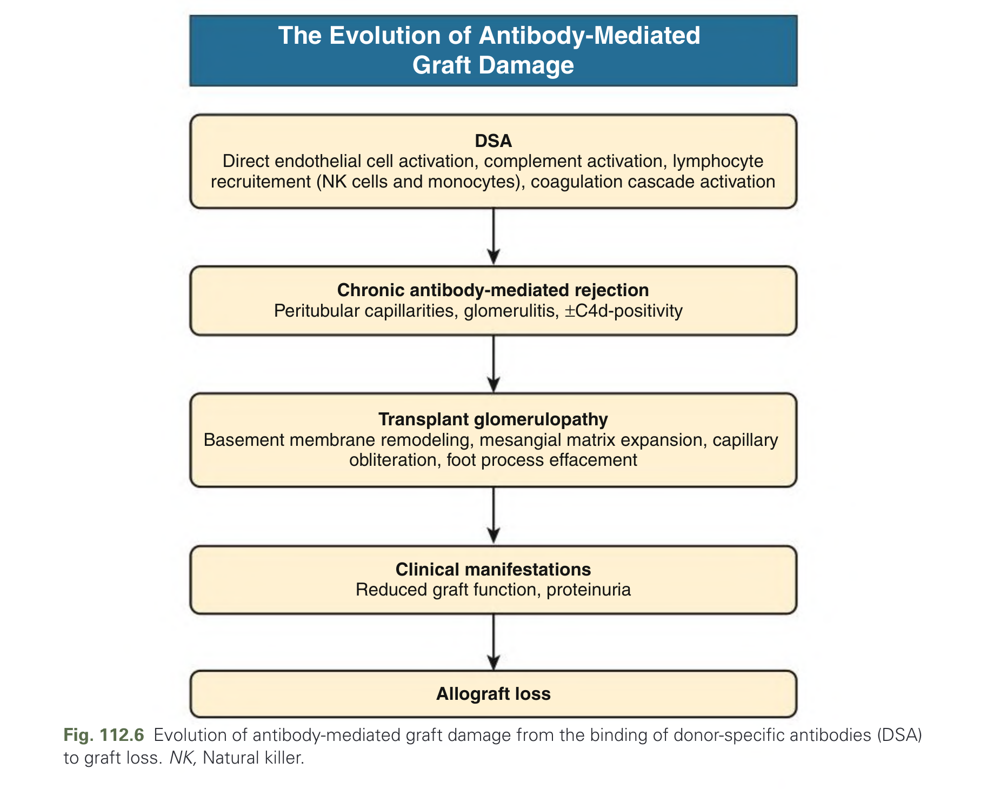

Fig. 112.6 Evolution of antibody-mediated graft damage from the binding of donor-specific antibodies (DSA) to graft loss. NK, Natural killer.

---

### Fig_112_7

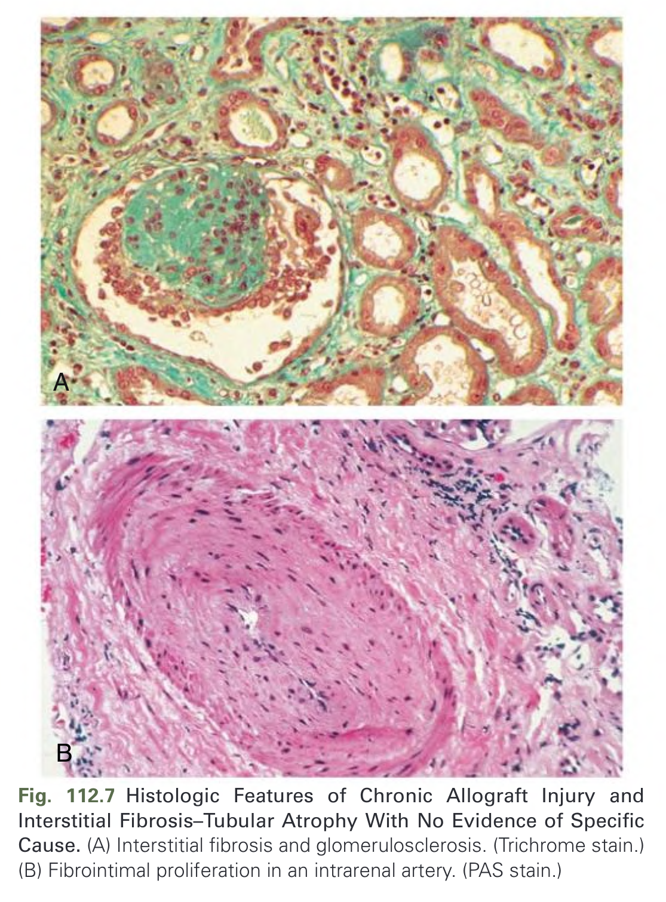

Fig. 112.7 Histologic Features of Chronic Allograft Injury and Interstitial Fibrosis–Tubular Atrophy With No Evidence of Specific Cause. (A) Interstitial fibrosis and glomerulosclerosis. (Trichrome stain.) (B) Fibrointimal proliferation in an intrarenal artery. (PAS stain.)

---

## Tables

### Table_112_1

#### Table Image

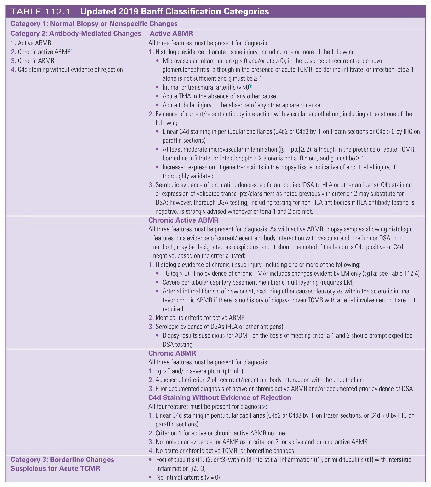

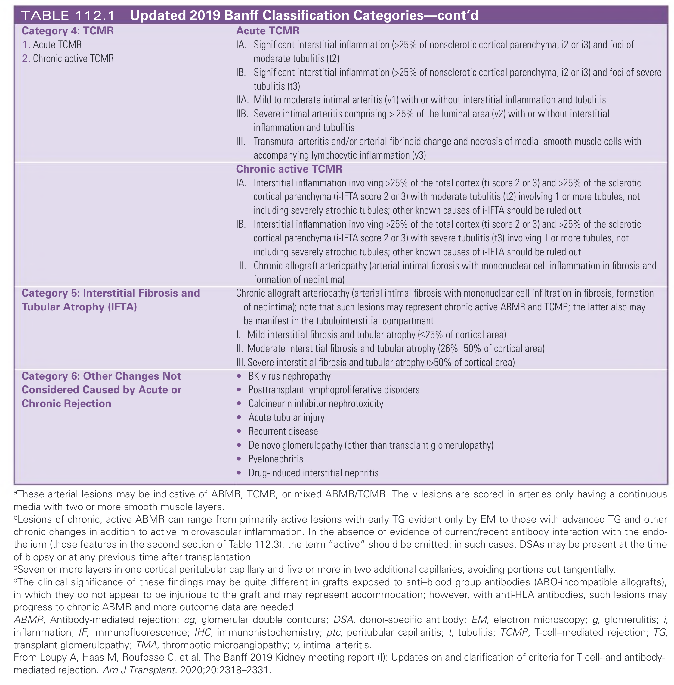

#### Table Data (CSV: [Table_112_1.csv](Table_112_1.csv))

```markdown
| Category | Diagnostic Criteria |
|---|---|
| Category 1: Normal Biopsy or Nonspecific Changes |  |
| Category 2: Antibody-Mediated Changes | *   1. Active ABMR<br>*   2. Chronic active ABMRb<br>*   3. Chronic ABMR<br>*   4. C4d staining without evidence of rejection<br>**Active ABMR**<br>All three features must be present for diagnosis.<br>1.  Histologic evidence of acute tissue injury, including one or more of the following:<br>*   Microvascular inflammation (g > 0 and/or ptc > 0), in the absence of recurrent or de novo glomerulonephritis, although in the presence of acute TCMR, borderline infiltrate, or infection, ptc≥ 1 alone is not sufficient and g must be ≥ 1<br>*   Intimal or transmural arteritis (v >0)a<br>*   Acute TMA in the absence of any other cause<br>*   Acute tubular injury in the absence of any other apparent cause<br>2.  Evidence of current/recent antibody interaction with vascular endothelium, including at least one of the following:<br>*   Linear C4d staining in peritubular capillaries (C4d2 or C4d3 by IF on frozen sections or C4d > 0 by IHC on paraffin sections)<br>*   At least moderate microvascular inflammation ([g + ptc] ≥ 2), although in the presence of acute TCMR, borderline infiltrate, or infection; ptc ≥ 2 alone is not sufficient, and g must be ≥ 1<br>*   Increased expression of gene transcripts in the biopsy tissue indicative of endothelial injury, if thoroughly validated<br>3.  Serologic evidence of circulating donor-specific antibodies (DSA to HLA or other antigens). C4d staining or expression of validated transcripts/classifiers as noted previously in criterion 2 may substitute for DSA; however, thorough DSA testing, including testing for non-HLA antibodies if HLA antibody testing is negative, is strongly advised whenever criteria 1 and 2 are met.<br>**Chronic Active ABMR**<br>All three features must be present for diagnosis. As with active ABMR, biopsy samples showing histologic features plus evidence of current/recent antibody interaction with vascular endothelium or DSA, but not both, may be designated as suspicious, and it should be noted if the lesion is C4d positive or C4d negative, based on the criteria listed:<br>1.  Histologic evidence of chronic tissue injury, including one or more of the following:<br>*   TG (cg > 0), if no evidence of chronic TMA; includes changes evident by EM only (cg1a; see Table 112.4)<br>*   Severe peritubular capillary basement membrane multilayering (requires EM)c<br>*   Arterial intimal fibrosis of new onset, excluding other causes; leukocytes within the sclerotic intima favor chronic ABMR if there is no history of biopsy-proven TCMR with arterial involvement but are not required<br>2.  Identical to criteria for active ABMR<br>3.  Serologic evidence of DSAs (HLA or other antigens):<br>*   Biopsy results suspicious for ABMR on the basis of meeting criteria 1 and 2 should prompt expedited DSA testing<br>**Chronic ABMR**<br>All three features must be present for diagnosis:<br>1.  cg > 0 and/or severe ptcml (ptcml1)<br>2.  Absence of criterion 2 of recurrent/recent antibody interaction with the endothelium<br>3.  Prior documented diagnosis of active or chronic active ABMR and/or documented prior evidence of DSA<br>**C4d Staining Without Evidence of Rejection**<br>All four features must be present for diagnosisd:<br>1.  Linear C4d staining in peritubular capillaries (C4d2 or C4d3 by IF on frozen sections, or C4d > 0 by IHC on paraffin sections)<br>2.  Criterion 1 for active or chronic active ABMR not met<br>3.  No molecular evidence for ABMR as in criterion 2 for active and chronic active ABMR<br>4.  No acute or chronic active TCMR, or borderline changes |
| Category 3: Borderline Changes Suspicious for Acute TCMR | *   Foci of tubulitis (t1, t2, or t3) with mild interstitial inflammation (i1), or mild tubulitis (t1) with interstitial inflammation (i2, i3)<br>*   No intimal arteritis (v = 0) |
| Category 4: TCMR | *   1. Acute TCMR<br>*   2. Chronic active TCMR<br>**Acute TCMR**<br>*   IA. Significant interstitial inflammation (>25% of nonsclerotic cortical parenchyma, i2 or i3) and foci of moderate tubulitis (t2)<br>*   IB. Significant interstitial inflammation (>25% of nonsclerotic cortical parenchyma, i2 or i3) and foci of severe tubulitis (t3)<br>*   IIA. Mild to moderate intimal arteritis (v1) with or without interstitial inflammation and tubulitis<br>*   IIB. Severe intimal arteritis comprising > 25% of the luminal area (v2) with or without interstitial inflammation and tubulitis<br>*   III. Transmural arteritis and/or arterial fibrinoid change and necrosis of medial smooth muscle cells with accompanying lymphocytic inflammation (v3)<br>**Chronic active TCMR**<br>*   IA. Interstitial inflammation involving >25% of the total cortex (ti score 2 or 3) and >25% of the sclerotic cortical parenchyma (i-IFTA score 2 or 3) with moderate tubulitis (t2) involving 1 or more tubules, not including severely atrophic tubules; other known causes of i-IFTA should be ruled out<br>*   IB. Interstitial inflammation involving >25% of the total cortex (ti score 2 or 3) and >25% of the sclerotic cortical parenchyma (i-IFTA score 2 or 3) with severe tubulitis (t3) involving 1 or more tubules, not including severely atrophic tubules; other known causes of i-IFTA should be ruled out<br>*   II. Chronic allograft arteriopathy (arterial intimal fibrosis with mononuclear cell inflammation in fibrosis and formation of neointima) |
| Category 5: Interstitial Fibrosis and Tubular Atrophy (IFTA) | *   Chronic allograft arteriopathy (arterial intimal fibrosis with mononuclear cell infiltration in fibrosis, formation of neointima); note that such lesions may represent chronic active ABMR and TCMR; the latter also may be manifest in the tubulointerstitial compartment<br>*   I. Mild interstitial fibrosis and tubular atrophy (≤25% of cortical area)<br>*   II. Moderate interstitial fibrosis and tubular atrophy (26%-50% of cortical area)<br>*   III. Severe interstitial fibrosis and tubular atrophy (>50% of cortical area) |
| Category 6: Other Changes Not Considered Caused by Acute or Chronic Rejection | *   BK virus nephropathy<br>*   Posttransplant lymphoproliferative disorders<br>*   Calcineurin inhibitor nephrotoxicity<br>*   Acute tubular injury<br>*   Recurrent disease<br>*   De novo glomerulopathy (other than transplant glomerulopathy)<br>*   Pyelonephritis<br>*   Drug-induced interstitial nephritis<br>aThese arterial lesions may be indicative of ABMR, TCMR, or mixed ABMR/TCMR. The v lesions are scored in arteries only having a continuous media with two or more smooth muscle layers.<br>bLesions of chronic, active ABMR can range from primarily active lesions with early TG evident only by EM to those with advanced TG and other chronic changes in addition to active microvascular inflammation. In the absence of evidence of current/recent antibody interaction with the endothelium (those features in the second section of Table 112.3), the term "active" should be omitted; in such cases, DSAs may be present at the time of biopsy or at any previous time after transplantation.<br>cSeven or more layers in one cortical peritubular capillary and five or more in two additional capillaries, avoiding portions cut tangentially.<br>dThe clinical significance of these findings may be quite different in grafts exposed to anti-blood group antibodies (ABO-incompatible allografts), in which they do not appear to be injurious to the graft and may represent accommodation; however, with anti-HLA antibodies, such lesions may progress to chronic ABMR and more outcome data are needed.<br>ABMR, Antibody-mediated rejection; cg, glomerular double contours; DSA, donor-specific antibody; EM, electron microscopy; g, glomerulitis; i, inflammation; IF, immunofluorescence; IHC, immunohistochemistry; ptc, peritubular capillaritis; t, tubulitis; TCMR, T-cell-mediated rejection; TG, transplant glomerulopathy; TMA, thrombotic microangiopathy; v, intimal arteritis.<br>From Loupy A, Haas M, Roufosse C, et al. The Banff 2019 Kidney meeting report (I): Updates on and clarification of criteria for T cell- and antibody-mediated rejection. Am J Transplant. 2020;20:2318-2331. |
```

TABLE 112.1 Updated 2019 Banff Classification Categories

---

## Boxes

### Box_112_1

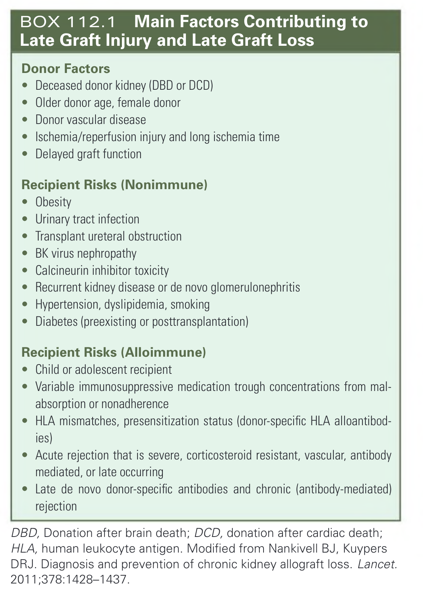

#### Box Text

```markdown
**Donor Factors**
*   Deceased donor kidney (DBD or DCD)
*   Older donor age, female donor
*   Donor vascular disease
*   Ischemia/reperfusion injury and long ischemia time
*   Delayed graft function

**Recipient Risks (Nonimmune)**
*   Obesity
*   Urinary tract infection
*   Transplant ureteral obstruction
*   BK virus nephropathy
*   Calcineurin inhibitor toxicity
*   Recurrent kidney disease or de novo glomerulonephritis
*   Hypertension, dyslipidemia, smoking
*   Diabetes (preexisting or posttransplantation)

**Recipient Risks (Alloimmune)**
*   Child or adolescent recipient
*   Variable immunosuppressive medication trough concentrations from malabsorption or nonadherence
*   HLA mismatches, presensitization status (donor-specific HLA alloantibodies)
*   Acute rejection that is severe, corticosteroid resistant, vascular, antibody mediated, or late occurring
*   Late de novo donor-specific antibodies and chronic (antibody-mediated) rejection

DBD, Donation after brain death; DCD, donation after cardiac death; HLA, human leukocyte antigen. Modified from Nankivell BJ, Kuypers DRJ. Diagnosis and prevention of chronic kidney allograft loss. Lancet. 2011;378:1428-1437.
```

BOX 112.1 Main Factors Contributing to Late Graft Injury and Late Graft Loss

---

### Box_112_2

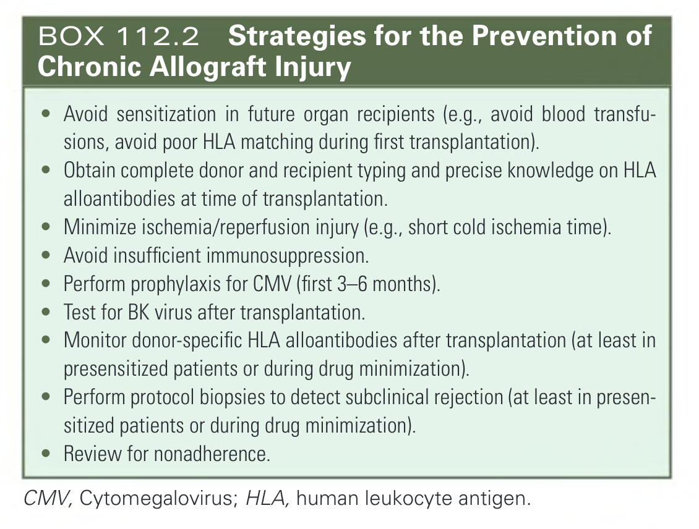

#### Box Text

```markdown
*   Avoid sensitization in future organ recipients (e.g., avoid blood transfusions, avoid poor HLA matching during first transplantation).
*   Obtain complete donor and recipient typing and precise knowledge on HLA alloantibodies at time of transplantation.
*   Minimize ischemia/reperfusion injury (e.g., short cold ischemia time).
*   Avoid insufficient immunosuppression.
*   Perform prophylaxis for CMV (first 3-6 months).
*   Test for BK virus after transplantation.
*   Monitor donor-specific HLA alloantibodies after transplantation (at least in presensitized patients or during drug minimization).
*   Perform protocol biopsies to detect subclinical rejection (at least in presensitized patients or during drug minimization).
*   Review for nonadherence.

CMV, Cytomegalovirus; HLA, human leukocyte antigen.
```

BOX 112.2 Strategies for the Prevention of Chronic Allograft Injury

---

### Box_112_3

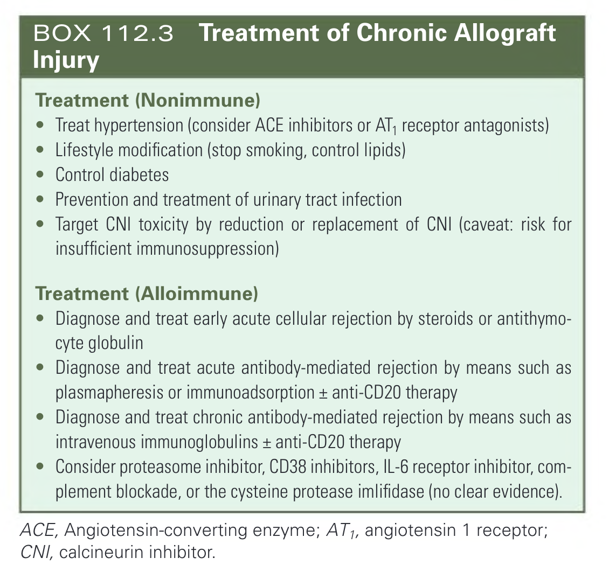

#### Box Text

```markdown
**Treatment (Nonimmune)**
*   Treat hypertension (consider ACE inhibitors or AT, receptor antagonists)
*   Lifestyle modification (stop smoking, control lipids)
*   Control diabetes
*   Prevention and treatment of urinary tract infection
*   Target CNI toxicity by reduction or replacement of CNI (caveat: risk for insufficient immunosuppression)

**Treatment (Alloimmune)**
*   Diagnose and treat early acute cellular rejection by steroids or antithymocyte globulin
*   Diagnose and treat acute antibody-mediated rejection by means such as plasmapheresis or immunoadsorption + anti-CD20 therapy
*   Diagnose and treat chronic antibody-mediated rejection by means such as intravenous immunoglobulins ± anti-CD20 therapy
*   Consider proteasome inhibitor, CD38 inhibitors, IL-6 receptor inhibitor, complement blockade, or the cysteine protease imlifidase (no clear evidence).

ACE, Angiotensin-converting enzyme; AT1, angiotensin 1 receptor; CNI, calcineurin inhibitor.
```

BOX 112.3 Treatment of Chronic Allograft Injury

---
