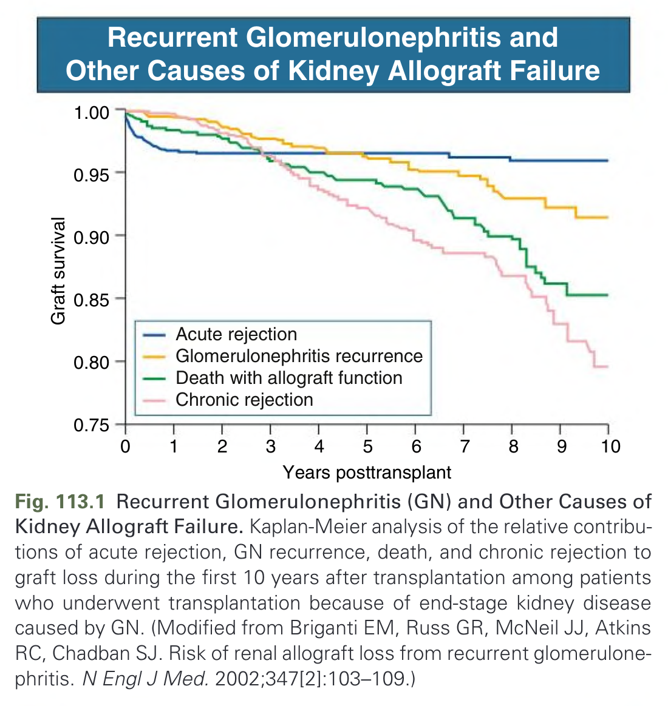
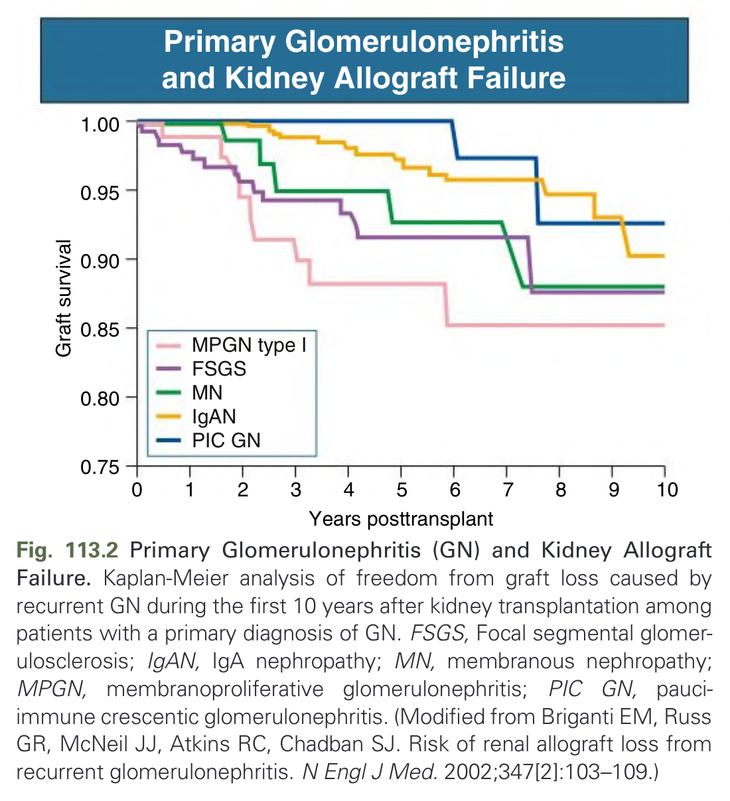
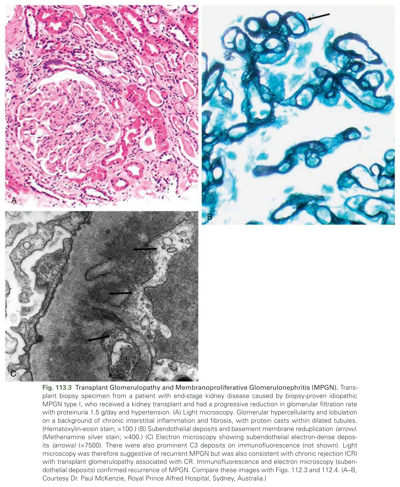
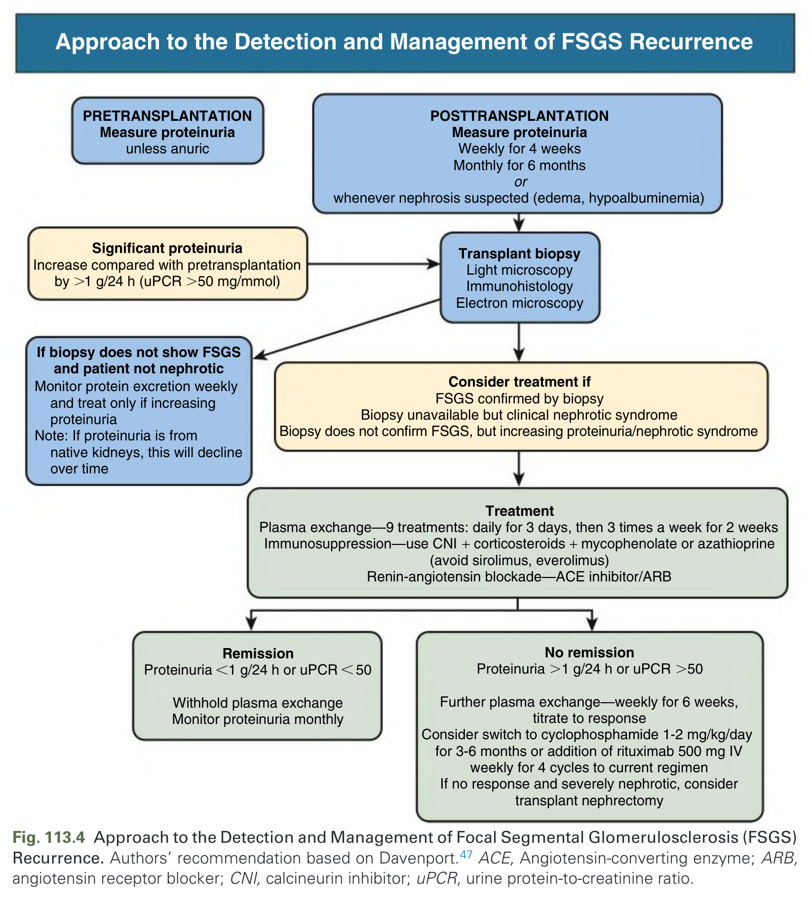
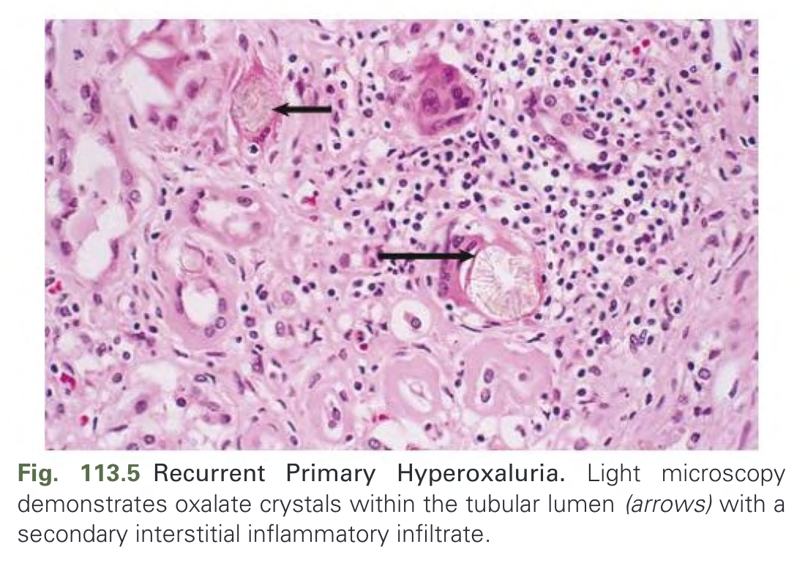
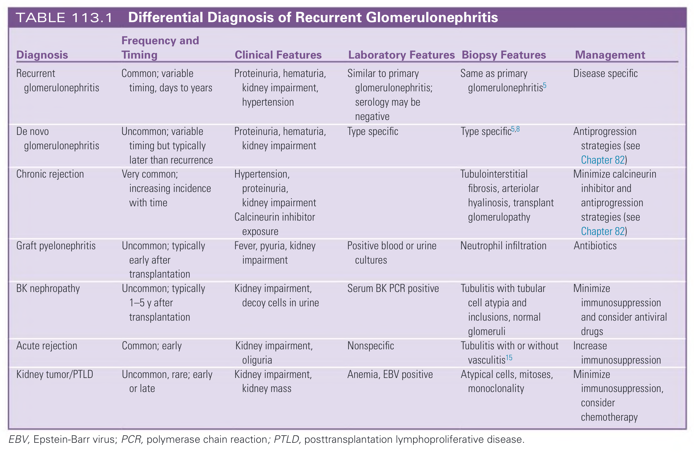
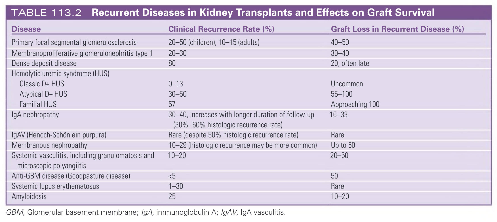

# 113. Recurrent Disease in Kidney Transplantation - Figures and Tables Index

This document lists all figures, tables and boxes extracted from `113. Recurrent Disease in Kidney Transplantation.pdf`.

## Table of Contents
- [Figures](#figures)
- [Tables](#tables)
- [Boxes](#boxes)

---

## Figures

### Fig_113_1



Fig. 113.1 Recurrent Glomerulonephritis (GN) and Other Causes of Kidney Allograft Failure. Kaplan-Meier analysis of the relative contributions of acute rejection, GN recurrence, death, and chronic rejection to graft loss during the first 10 years after transplantation among patients who underwent transplantation because of end-stage kidney disease caused by GN. (Modified from Briganti EM, Russ GR, McNeil JJ, Atkins RC, Chadban SJ. Risk of renal allograft loss from recurrent glomerulonephritis. N Engl J Med. 2002;347[2]:103–109.)

---

### Fig_113_2



Fig. 113.2 Primary Glomerulonephritis (GN) and Kidney Allograft Failure. Kaplan-Meier analysis of freedom from graft loss caused by recurrent GN during the first 10 years after kidney transplantation among patients with a primary diagnosis of GN. FSGS, Focal segmental glomerulosclerosis; IgAN, IgA nephropathy; MN, membranous nephropathy; MPGN, membranoproliferative glomerulonephritis; PIC GN, pauci-immune crescentic glomerulonephritis. (Modified from Briganti EM, Russ GR, McNeil JJ, Atkins RC, Chadban SJ. Risk of renal allograft loss from recurrent glomerulonephritis. N Engl J Med. 2002;347[2]:103–109.)

---

### Fig_113_3



Fig. 113.3 Transplant Glomerulopathy and Membranoproliferative Glomerulonephritis (MPGN). Transplant biopsy specimen from a patient with end-stage kidney disease caused by biopsy-proven idiopathic MPGN type I, who received a kidney transplant and had a progressive reduction in glomerular filtration rate with proteinuria 1.5 g/day and hypertension. (A) Light microscopy. Glomerular hypercellularity and lobulation on a background of chronic interstitial inflammation and fibrosis, with protein casts within dilated tubules. (Hematoxylin-eosin stain; ×100.) (B) Subendothelial deposits and basement membrane reduplication (arrow). (Methenamine silver stain; ×400.) (C) Electron microscopy showing subendothelial electron-dense deposits (arrows) (×7500). There were also prominent C3 deposits on immunofluorescence (not shown). Light microscopy was therefore suggestive of recurrent MPGN but was also consistent with chronic rejection (CR) with transplant glomerulopathy associated with CR. Immunofluorescence and electron microscopy (subendothelial deposits) confirmed recurrence of MPGN. Compare these images with Figs. 112.3 and 112.4. (A–B, Courtesy Dr. Paul McKenzie, Royal Prince Alfred Hospital, Sydney, Australia.)

---

### Fig_113_4



Fig. 113.4 Approach to the Detection and Management of Focal Segmental Glomerulosclerosis (FSGS) Recurrence. Authors’ recommendation based on Davenport.47 ACE, Angiotensin-converting enzyme; ARB, angiotensin receptor blocker; CNI, calcineurin inhibitor; uPCR, urine protein-to-creatinine ratio.

---

### Fig_113_5



Fig. 113.5 Recurrent Primary Hyperoxaluria. Light microscopy demonstrates oxalate crystals within the tubular lumen (arrows) with a secondary interstitial inflammatory infiltrate.

---

## Tables

### Table_113_1

#### Table Image



#### Table Data (CSV: [Table_113_1.csv](Table_113_1.csv))

```markdown
| Diagnosis | Frequency and Timing | Clinical Features | Laboratory Features | Biopsy Features | Management |
| :--- | :--- | :--- | :--- | :--- | :--- |
| Recurrent glomerulonephritis | Common; variable timing, days to years | Proteinuria, hematuria, kidney impairment, hypertension | Similar to primary glomerulonephritis; serology may be negative | Same as primary glomerulonephritis | Disease specific |
| De novo glomerulonephritis | Uncommon; variable timing but typically later than recurrence | Proteinuria, hematuria, kidney impairment | Type specific | Type specific | Antiprogression strategies (see Chapter 82) |
| Chronic rejection | Very common; increasing incidence with time | Hypertension, proteinuria, kidney impairment Calcineurin inhibitor exposure | | Tubulointerstitial fibrosis, arteriolar hyalinosis, transplant glomerulopathy | Minimize calcineurin inhibitor and antiprogression strategies (see Chapter 82) |
| Graft pyelonephritis | Uncommon; typically early after transplantation | Fever, pyuria, kidney impairment | Positive blood or urine cultures | Neutrophil infiltration | Antibiotics |
| BK nephropathy | Uncommon; typically 1-5 y after transplantation | Kidney impairment, decoy cells in urine | Serum BK PCR positive | Tubulitis with tubular cell atypia and inclusions, normal glomeruli | Minimize immunosuppression and consider antiviral drugs |
| Acute rejection | Common; early | Kidney impairment, oliguria | Nonspecific | Tubulitis with or without vasculitis | Increase immunosuppression |
| Kidney tumor/PTLD | Uncommon, rare; early or late | Kidney impairment, kidney mass | Anemia, EBV positive | Atypical cells, mitoses, monoclonality | Minimize immunosuppression, consider chemotherapy |
EBV, Epstein-Barr virus; PCR, polymerase chain reaction; PTLD, posttransplantation lymphoproliferative disease.
```

TABLE 113.1 Differential Diagnosis of Recurrent Glomerulonephritis

---

### Table_113_2

#### Table Image



#### Table Data (CSV: [Table_113_2.csv](Table_113_2.csv))

```markdown
| Disease | Clinical Recurrence Rate (%) | Graft Loss in Recurrent Disease (%) |
| :--- | :--- | :--- |
| Primary focal segmental glomerulosclerosis | 20-50 (children), 10-15 (adults) | 40-50 |
| Membranoproliferative glomerulonephritis type 1 | 20-30 | 30-40 |
| Dense deposit disease | 80 | 20, often late |
| Hemolytic uremic syndrome (HUS) | | |
| Classic D+ HUS | 0-13 | Uncommon |
| Atypical D- HUS | 30-50 | 55-100 |
| Familial HUS | 57 | Approaching 100 |
| IgA nephropathy | 30-40, increases with longer duration of follow-up (30%-60% histologic recurrence rate) | 16-33 |
| IgAV (Henoch-Schönlein purpura) | Rare (despite 50% histologic recurrence rate) | Rare |
| Membranous nephropathy | 10-29 (histologic recurrence may be more common) | Up to 50 |
| Systemic vasculitis, including granulomatosis and microscopic polyangiitis | 10-20 | 20-50 |
| Anti-GBM disease (Goodpasture disease) | <5 | 50 |
| Systemic lupus erythematosus | 1-30 | Rare |
| Amyloidosis | 25 | 10-20 |
GBM, Glomerular basement membrane; IgA, immunoglobulin A; IgAV, IgA vasculitis.
```

TABLE 113.2 Recurrent Diseases in Kidney Transplants and Effects on Graft Survival

---

## Boxes

*No boxes resolved for this chapter.*
