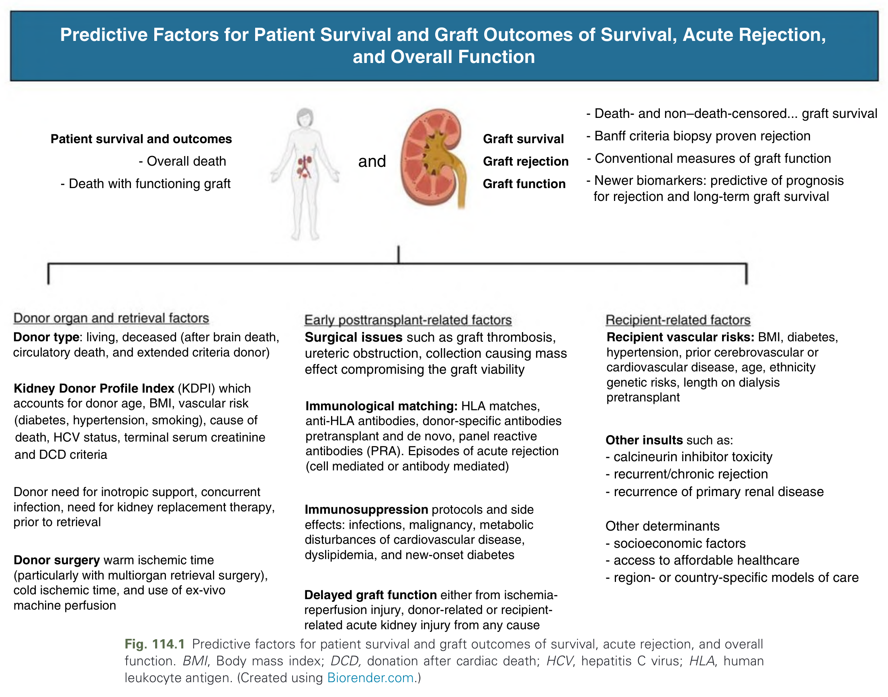
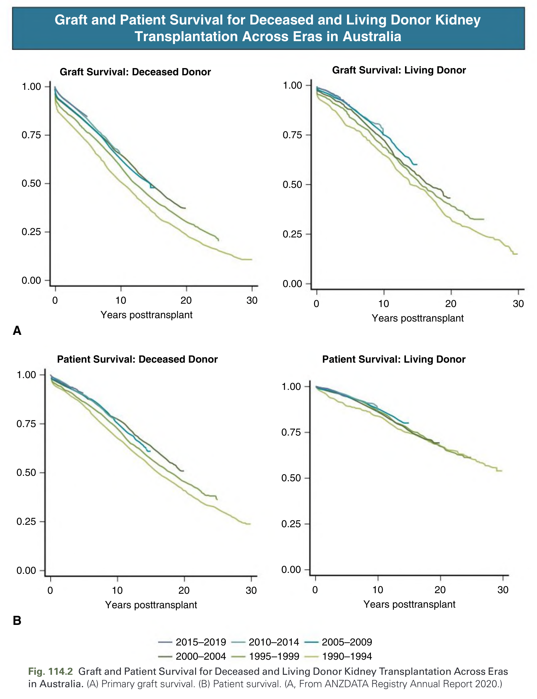
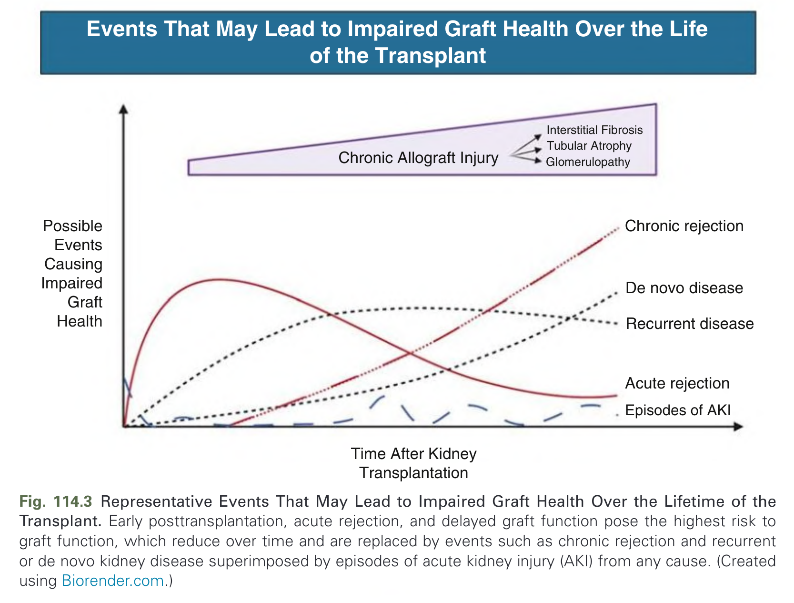
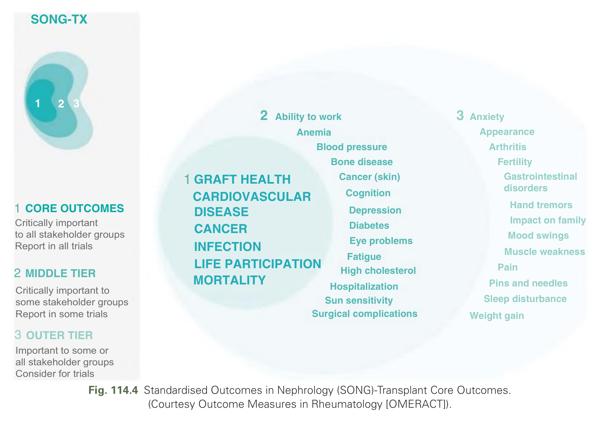
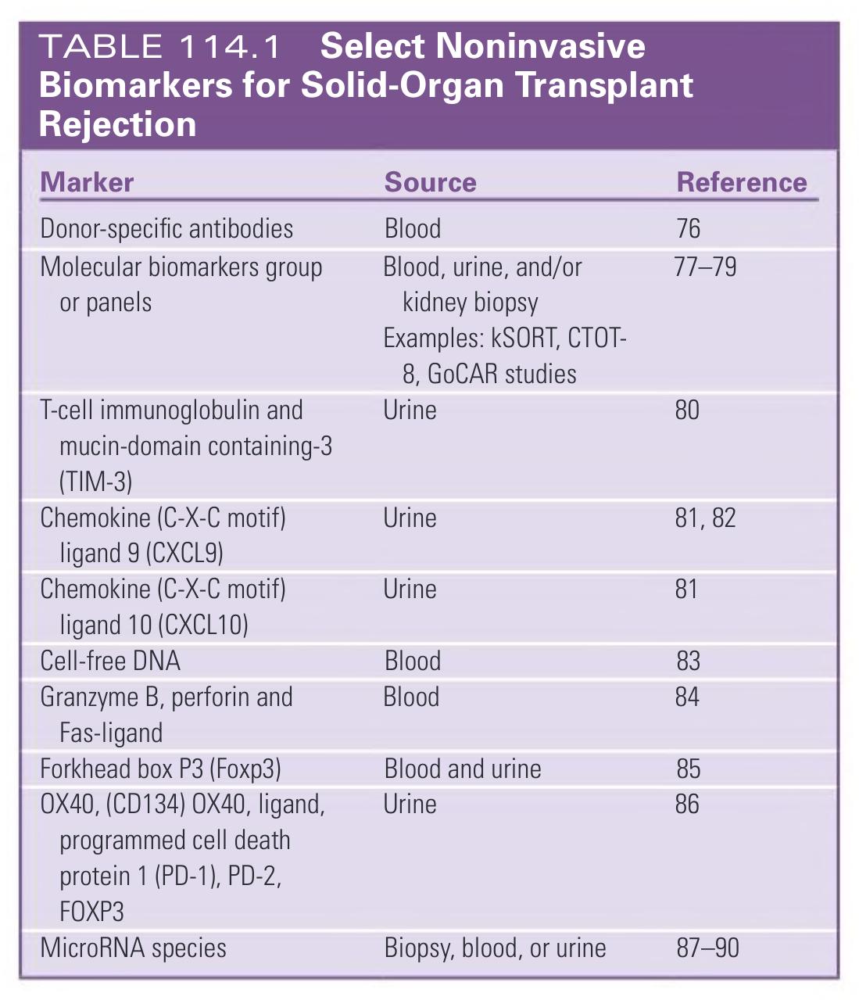
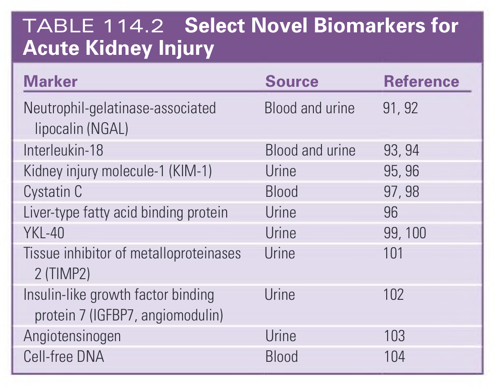

# 114. Outcomes of Kidney Transplantation- Identification, Measures, and Evaluation - Figures and Tables Index

This document lists all figures, tables and boxes extracted from `114. Outcomes of Kidney Transplantation- Identification, Measures, and Evaluation.pdf`.

## Table of Contents
- [Figures](#figures)
- [Tables](#tables)
- [Boxes](#boxes)

---

## Figures

### Fig_114_1



Fig. 114.1 Predictive factors for patient survival and graft outcomes of survival, acute rejection, and overall function. BMI, Body mass index; DCD, donation after cardiac death; HCV, hepatitis C virus; HLA, human leukocyte antigen. (Created using Biorender.com.)

---

### Fig_114_2



Fig. 114.2 Graft and Patient Survival for Deceased and Living Donor Kidney Transplantation Across Eras in Australia. (A) Primary graft survival. (B) Patient survival. (A, From ANZDATA Registry Annual Report 2020.)

---

### Fig_114_3



Fig. 114.3 Representative Events That May Lead to Impaired Graft Health Over the Lifetime of the Transplant. Early posttransplantation, acute rejection, and delayed graft function pose the highest risk to graft function, which reduce over time and are replaced by events such as chronic rejection and recurrent or de novo kidney disease superimposed by episodes of acute kidney injury (AKI) from any cause. (Created using Biorender.com.)

---

### Fig_114_4



Fig. 114.4 Standardised Outcomes in Nephrology (SONG)-Transplant Core Outcomes. (Courtesy Outcome Measures in Rheumatology [OMERACT]).

---

## Tables

### Table_114_1

#### Table Image



#### Table Data (CSV: [Table_114_1.csv](Table_114_1.csv))

```markdown
| Marker | Source | Reference |
| :--- | :--- | :--- |
| Donor-specific antibodies | Blood | 76 |
| Molecular biomarkers group or panels | Blood, urine, and/or kidney biopsy<br>Examples: kSORT, CTOT-8, GoCAR studies | 77-79 |
| T-cell immunoglobulin and mucin-domain containing-3 (TIM-3) | Urine | 80 |
| Chemokine (C-X-C motif) ligand 9 (CXCL9) | Urine | 81, 82 |
| Chemokine (C-X-C motif) ligand 10 (CXCL10) | Urine | 81 |
| Cell-free DNA | Blood | 83 |
| Granzyme B, perforin and Fas-ligand | Blood | 84 |
| Forkhead box P3 (Foxp3) | Blood and urine | 85 |
| OX40, (CD134) OX40, ligand, programmed cell death protein 1 (PD-1), PD-2, FOXP3 | Urine | 86 |
| MicroRNA species | Biopsy, blood, or urine | 87-90 |
```

TABLE 114.1 Select Noninvasive Biomarkers for Solid-Organ Transplant Rejection

---

### Table_114_2

#### Table Image



#### Table Data (CSV: [Table_114_2.csv](Table_114_2.csv))

```markdown
| Marker | Source | Reference |
| :--- | :--- | :--- |
| Neutrophil-gelatinase-associated lipocalin (NGAL) | Blood and urine | 91, 92 |
| Interleukin-18 | Blood and urine | 93, 94 |
| Kidney injury molecule-1 (KIM-1) | Urine | 95, 96 |
| Cystatin C | Blood | 97, 98 |
| Liver-type fatty acid binding protein | Urine | 96 |
| YKL-40 | Urine | 99, 100 |
| Tissue inhibitor of metalloproteinases 2 (TIMP2) | Urine | 101 |
| Insulin-like growth factor binding protein 7 (IGFBP7, angiomodulin) | Urine | 102 |
| Angiotensinogen | Urine | 103 |
| Cell-free DNA | Blood | 104 |
```

TABLE 114.2 Select Novel Biomarkers for Acute Kidney Injury

---

## Boxes

*No boxes resolved for this chapter.*
