# KDIGO-2009-Transplant-Recipient-Guideline-English - Figures and Tables Index

This document lists all figures and tables extracted from `KDIGO-2009-Transplant-Recipient-Guideline-English.pdf`.

## Table of Contents
- [Figures](#figures)
- [Tables](#tables)

---

## Figures

### Fig_1

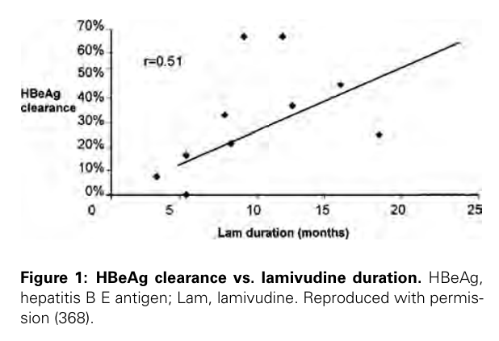

Figure 1 HBeAg clearance vs. lamivudine duration.

---

### Fig_2

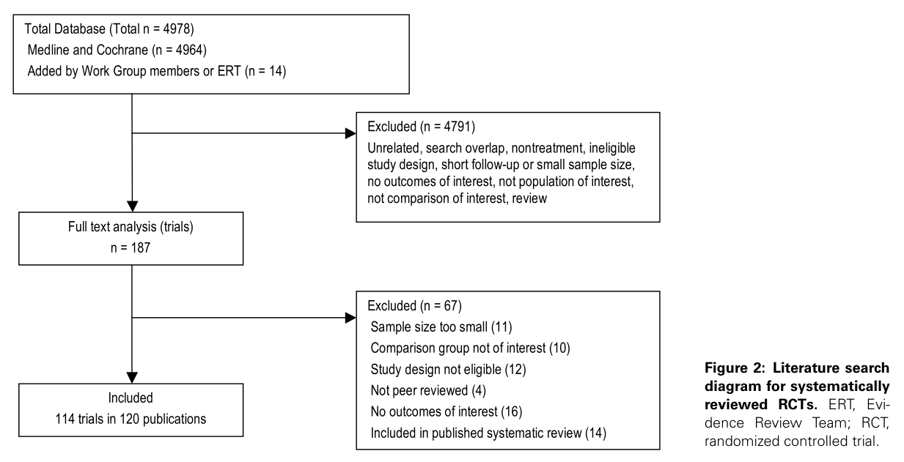

Figure 2 Literature search diagram for systematically reviewed RCTs.

---

## Tables

### Table_1

#### Table Image

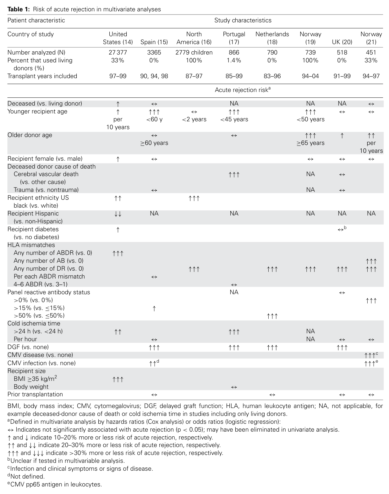

#### Table Data (CSV: [Table_1.csv](Table_1.csv))

```markdown
| Table Text (OCR) |
| :--- |
| Table 1: Risk of acute rejection in multivariate analyses Patient characteristic  Study characteristics    Country of study  United States (14)  Spain (15)  North America (16)  Portugal (17)  Netherlands (18)  Norway (19)    UK (20)  Norway (21)    Number analyzed (N)  27377  3365  2779 children    866  790  739  518  451    Percent that used living donors (%)  33%  0%  100%  1.4%    0%  100%  0%  33%    Transplant years included  97-99  90,94,98  87-97  85-99    83-96  94-04  91-99  94-97            Acute rejection riska              Deceased (vs. living donor)  ↑  ↔      NA    NA  NA  ↔    Younger recipient age  ↑  ↑↑↑  ↔    ↑↑↑    ↑↑↑  ↔  ↔      per 10 years  <60 y  <2 years    <45 years    <50 years        Older donor age    ↔ ≥60 years      ↔    ↑↑↑ ≥65 years  ↑  ↑↑    Recipient female (vs. male)                  per 10 years    Deceased donor cause of death  ↑  ↔          ↔  ↔  ↔    Cerebral vascular death (vs. other cause)          ↑↑↑    NA  ↔      Trauma (vs. nontrauma) Recipient ethnicity US  ↑↑  ↔  ↑↑↑        NA  ↔      black (vs. white) Recipient Hispanic  ↓  NA      NA    NA  NA  NA    (vs. non-Hispanic) Recipient diabetes                      (vs. no diabetes) HLA mismatches  ↑              b      Any number of ABDR (vs. 0)  ↑↑↑                    Any number of AB (vs. 0) Any number of DR (vs. 0)      ↑↑↑      ↑↑↑  ↑↑↑  ↑↑↑  ↑↑↑ ↑↑↑    Per each ABDR mismatch    ↔                  4–6 ABDR (vs. 3–1) Panel reactive antibody status        ↔ NA        ↔      >0% (vs.0%) >15% (vs. ≤15%)                  ↑↑↑    >50% (vs. ≤50%)    ↑        ↑↑↑          Cold ischemia time >24 h (vs. <24 h)                      Per hour  ↑↑  ↔      ↑↑↑    NA        DGF (vs. none)    ↑↑↑          NA  ↔  ↔    CMV disease (vs. none)          ↑↑↑  ↑↑↑    ↑↑↑  ↑↑↑℃    CMV infection (vs. none)    ↑↑d                                    ↑↑↑e    Recipient size                      BMI ≥35 kg/m²  ↑↑↑                                          Body weight                      Prior transplantation    ↔      ↔ <sup>a</sup>Defined in multivariate analysis by hazards ratios (Cox analysis) or odds ratios (logistic regression): aDefined in multivariate analysis by hazards ratios (Cox analysis) or odds ratios (logistic regression) BMI, body mass index; CMV, cytomegalovirus; DGF, delayed graft function; HLA, human leukocyte antigen; NA, not applicable, fo example deceased-donor cause of death or cold ischemia time in studies including only living donors. Indicates not significantly associated with acute rejection (p < 0.05); may have been eliminated in univariate analysis. and indicate 10–20% more or less risk of acute rejection, respectively. and indicate 20–30% more or less risk of acute rejection, respectively. and indicate >30% more or less risk of acute rejection, respectively. <sup>b</sup>Unclear if tested in multivariable analysis. <sup>c</sup>Infection and clinical symptoms or signs of disease. <sup>d</sup>Not defined. <sup>e</sup>CMV pp65 antigen in leukocytes. |
```

Table 1 Risk of acute rejection in multivariate analyses

---

### Table_2

#### Table Image

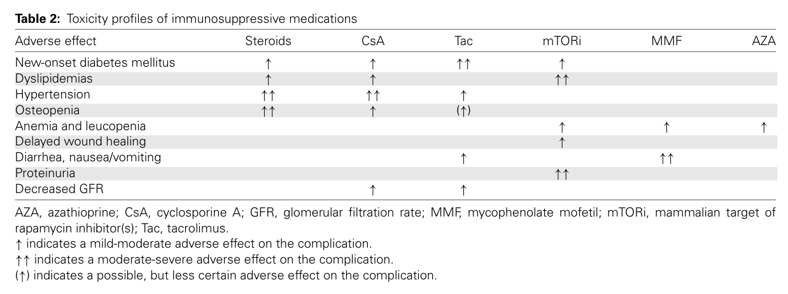

#### Table Data (CSV: [Table_2.csv](Table_2.csv))

```markdown
| Table Text (OCR) |
| :--- |
| Table 2: Toxicity profiles of immunosuppressive medications Adverse effect  Steroids  CsA  Tac  mTORi  MMF  AZA    New-onset diabetes mellitus  ↑  ↑  ↑↑  ↑        Dyslipidemias  ↑  ↑    ↑↑        Hypertension  ↑↑  ↑↑  ↑          Osteopenia  ↑↑  ↑  (↑)          Anemia and leucopenia        ↑  ↑  ↑    Delayed wound healing        ↑        Diarrhea, nausea/vomiting      ↑    ↑↑      Proteinuria        ↑↑        Decreased GFR    ↑  ↑ AZA, azathioprine; CsA, cyclosporine A; GFR, glomerular filtration rate; MMF, mycophenolate mofetil; mTORi, mammalian target of rapamycin inhibitor(s); Tac, tacrolimus. indicates a mild-moderate adverse effect on the complication. indicates a moderate-severe adverse effect on the complication. ( ) indicates a possible, but less certain adverse effect on the complication. |
```

Table 2 Toxicity profiles of immunosuppressive medications

---

### Table_3

#### Table Image

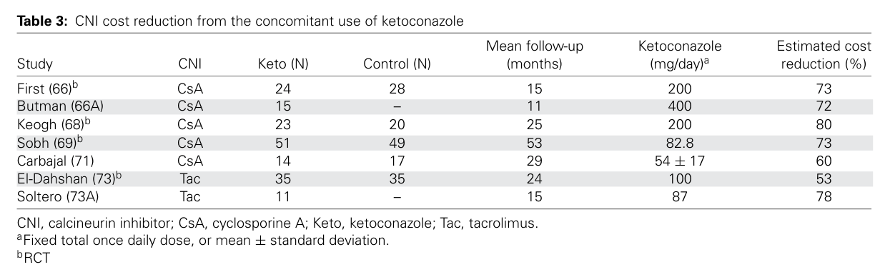

#### Table Data (CSV: [Table_3.csv](Table_3.csv))

```markdown
| Table Text (OCR) |
| :--- |
| Table 3: CNI cost reduction from the concomitant use of ketoconazole Mean follow-up Ketoconazole (mg/day)a  Estimated cost reduction (%)    Study First (66)b  CNI CsA  Keto (N) 24  Control (N) 28  (months) 15  200  73    Butman (66A)  CsA  15  一  11  400  72    Keogh (68)b  CsA  23  20  25  200  80    Sobh (69)b  CsA  51  49  53  82.8  73    Carbajal (71)  CsA  14  17  29  54 ± 17  60    El-Dahshan (73)b  Tac  35  35  24  100  53    Soltero (73A)  Tac  11  一  15  87  78 CNI, calcineurin inhibitor; CsA, cyclosporine A; Keto, ketoconazole; Tac, tacrolimus. <sup>a</sup>Fixed total once daily dose, or mean standard deviation. <sup>b</sup>RCT |
```

Table 3 CNI cost reduction from the concomitant use of ketoconazole

---

### Table_4

#### Table Image

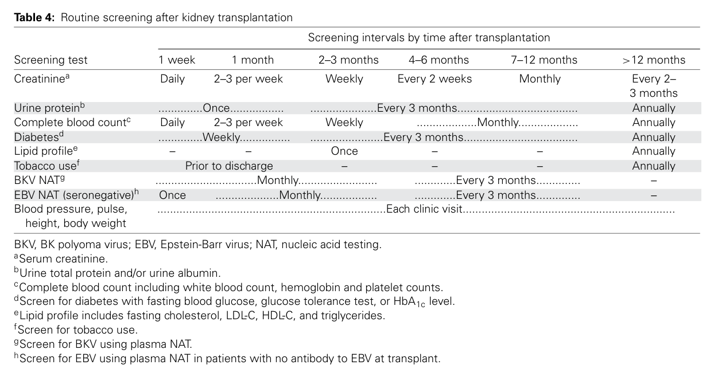

#### Table Data (CSV: [Table_4.csv](Table_4.csv))

```markdown
| Table Text (OCR) |
| :--- |
| images/3c2857c8a1153b7db7725b9de68581e6286f0fd725a75e39815bf5a27be26f5e.jpg Chapter 8 Table 4: Routine screening after kidney transplantation BKV, BK polyoma virus; EBV, Epstein-Barr virus; NAT, nucleic acid testing. <sup>a</sup>Serum creatinine. <sup>b</sup>Urine total protein and/or urine albumin. <sup>c</sup>Complete blood count including white blood count, hemoglobin and platelet counts. <sup>d</sup>Screen for diabetes with fasting blood glucose, glucose tolerance test, or HbA<sub>1c</sub> level. <sup>e</sup>Lipid profile includes fasting cholesterol, LDL-C, HDL-C, and triglycerides. <sup>f</sup>Screen for tobacco use. <sup>g</sup>Screen for BKV using plasma NAT. <sup>h</sup>Screen for EBV using plasma NAT in patients with no antibody to EBV at transplant. <table><tr><td rowspan="2">Screening test</td><td colspan="6">Screening intervals by time after transplantation</td></tr><tr><td>1 week</td><td>1 month</td><td>2–3 months</td><td>4–6 months</td><td>7-12 months</td><td>&gt;12 months</td></tr><tr><td>Creatinineª</td><td>Daily</td><td>2–3 per week</td><td>Weekly</td><td>Every 2 weeks</td><td>Monthly</td><td>Every 2-</td></tr><tr><td>Urine proteinb</td><td>.Once..</td><td></td><td></td><td>.Every 3 months.....</td><td></td><td>3 months Annually</td></tr><tr><td>Complete blood countº</td><td>Daily</td><td>2–3 per week</td><td>Weekly</td><td></td><td>.Monthly.</td><td>Annually</td></tr><tr><td>Diabetesd</td><td></td><td>..Weekly...</td><td></td><td>.Every 3 months.</td><td></td><td>Annually</td></tr><tr><td>Lipid profilee</td><td></td><td></td><td>Once</td><td></td><td></td><td>Annually</td></tr><tr><td>Tobacco usef</td><td>Prior to discharge</td><td></td><td></td><td></td><td></td><td>Annually</td></tr><tr><td>BKV NAT9</td><td></td><td>..Monthly..</td><td></td><td></td><td>.Every 3 months..</td><td></td></tr><tr><td>EBV NAT (seronegative)h</td><td>Once</td><td>.Monthly..</td><td></td><td></td><td>.Every 3 months.</td><td></td></tr><tr><td>Blood pressure, pulse,</td><td></td><td></td><td></td><td>.Each clinic visit..</td><td></td><td></td></tr></table> complex_table |
```

Table 4 Routine screening after kidney transplantation

---

### Table_5

#### Table Image

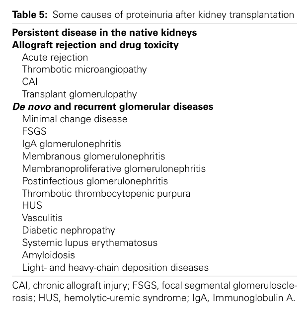

#### Table Data (CSV: [Table_5.csv](Table_5.csv))

```markdown
| Table Text (OCR) |
| :--- |
| Table 5: Some causes of proteinuria after kidney transplantation Persistent disease in the native kidneys Allograft rejection and drug toxicity    Acute rejection    Thrombotic microangiopathy    CAI Transplant glomerulopathy    De novo and recurrent glomerular diseases    Minimal change disease FSGS    IgA glomerulonephritis    Membranous glomerulonephritis    Membranoproliferative glomerulonephritis Postinfectious glomerulonephritis    Thrombotic thrombocytopenic purpura    HUS    Vasculitis    Diabetic nephropathy Systemic lupus erythematosus Amyloidosis CAI, chronic allograft injury; FSGS, focal segmental glomeruloscle- rosis; HUS, hemolytic-uremic syndrome; IgA, Immunoglobulin A. |
```

Table 5 Some causes of proteinuria after kidney transplantation

---

### Table_6

#### Table Image

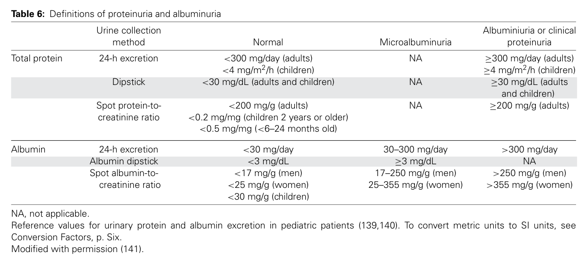

#### Table Data (CSV: [Table_6.csv](Table_6.csv))

```markdown
| Table Text (OCR) |
| :--- |
| Table 6: Definitions of proteinuria and albuminuria Urine collection method  Normal  Microalbuminuria  Albuminiuria or clinical proteinuria    Total protein  24-h excretion        <300 mg/day (adults) <4 mg/m²/h (children)  NA  ≥300 mg/day (adults) ≥4 mg/m²/h (children)      Dipstick  <30 mg/dL (adults and children)  NA  ≥30 mg/dL (adults and children)      Spot protein-to- creatinine ratio  <200 mg/g (adults) <0.2 mg/mg (children 2 years or older)  NA  ≥200 mg/g (adults)        <0.5 mg/mg (<6–24 months old)        Albumin  24-h excretion  <30 mg/day  30–300 mg/day  >300 mg/day      Albumin dipstick  <3 mg/dL  ≥3 mg/dL  NA      Spot albumin-to-  <17 mg/g (men)  17–250 mg/g (men)  >250 mg/g (men)      creatinine ratio  <25 mg/g (women) <30 mg/g (children)  25–355 mg/g (women)  >355 mg/g (women) NA, not applicable. Reference values for urinary protein and albumin excretion in pediatric patients (139,140). To convert metric units to SI units, see Conversion Factors, p. Six. Modified with permission (141). |
```

Table 6 Definitions of proteinuria and albuminuria

---

### Table_7

#### Table Image

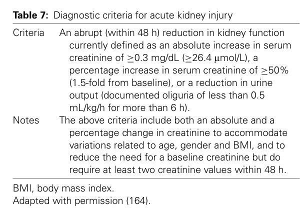

#### Table Data (CSV: [Table_7.csv](Table_7.csv))

```markdown
| Table Text (OCR) |
| :--- |
| Table 7: Diagnostic criteria for acute kidney injury Criteria An abrupt (within 48 h) reduction in kidney function currently defined as an absolute increase in serum creatinine of 0.3 mg/dL ( 26.4 lmol/L), a percentage increase in serum creatinine of 50% (1.5-fold from baseline), or a reduction in urine output (documented oliguria of less than 0.5 mL/kg/h for more than 6 h). The above criteria include both an absolute and a percentage change in creatinine to accommodate variations related to age, gender and BMI, and to reduce the need for a baseline creatinine but do require at least two creatinine values within 48 h. BMI, body mass index. Adapted with permission (164). |
```

Table 7 Diagnostic criteria for acute kidney injury

---

### Table_8

#### Table Image

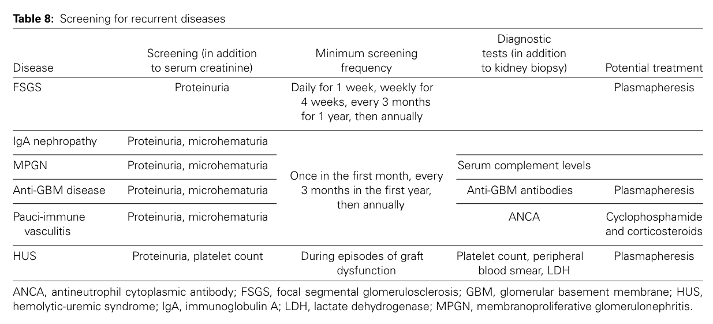

#### Table Data (CSV: [Table_8.csv](Table_8.csv))

```markdown
| Table Text (OCR) |
| :--- |
| Table 8: Screening for recurrent diseases Diagnostic      Screening (in addition  Minimum screening  tests (in addition      Disease FSGS  to serum creatinine)  frequency  to kidney biopsy)  Potential treatment      Proteinuria  Daily for 1 week, weekly for 4 weeks, every 3 months for 1 year, then annually    Plasmapheresis    Proteinuria, microhematuria      IgA nephropathy MPGN  Proteinuria, microhematuria  Once in the first month, every 3 months in the first year, then annually  Serum complement levels                Anti-GBM disease  Proteinuria, microhematuria  Anti-GBM antibodies  Plasmapheresis    Pauci-immune vasculitis  Proteinuria, microhematuria  ANCA  Cyclophosphamide and corticosteroids    HUS  Proteinuria, platelet count  During episodes of graft  Platelet count, peripheral  Plasmapheresis ANCA, antineutrophil cytoplasmic antibody; FSGS, focal segmental glomerulosclerosis; GBM, glomerular basement membrane; HUS, hemolytic-uremic syndrome; IgA, immunoglobulin A; LDH, lactate dehydrogenase; MPGN, membranoproliferative glomerulonephritis. |
```

Table 8 Screening for recurrent diseases

---

### Table_9

#### Table Image

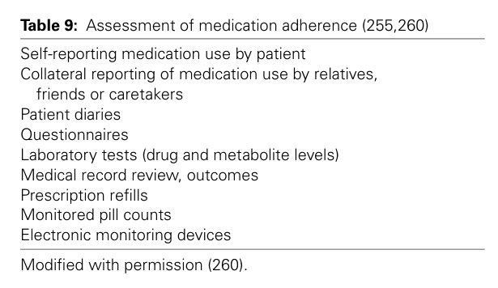

#### Table Data (CSV: [Table_9.csv](Table_9.csv))

```markdown
| Table Text (OCR) |
| :--- |
| Table 9: Assessment of medication adherence (255,260) Self-reporting medication use by patient Collateral reporting of medication use by relatives, friends or caretakers    Patient diaries    Questionnaires Laboratory tests (drug and metabolite levels)    Medical record review, outcomes    Prescription refills    Monitored pill counts    Electronic monitoring devices Modified with permission (260). |
```

Table 9 Assessment of medication adherence

---

### Table_10

#### Table Image

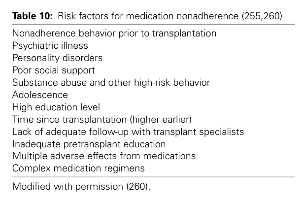

#### Table Data (CSV: [Table_10.csv](Table_10.csv))

```markdown
| Table Text (OCR) |
| :--- |
| Table 10: Risk factors for medication nonadherence (255,260) Nonadherence behavior prior to transplantation Psychiatric illness Personality disorders    Poor social support Substance abuse and other high-risk behavior Adolescence    High education level Time since transplantation (higher earlier)        Lack of adequate follow-up with transplant specialists Inadequate pretransplant education Multiple adverse effects from medications |
```

Table 10 Risk factors for medication nonadherence

---

### Table_11

#### Table Image

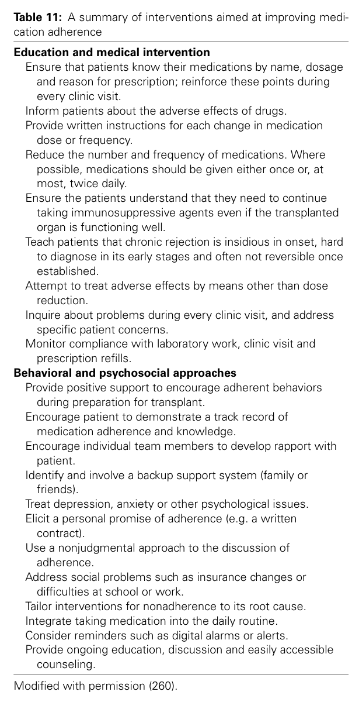

#### Table Data (CSV: [Table_11.csv](Table_11.csv))

```markdown
| Table Text (OCR) |
| :--- |
| Table 11: A summary of interventions aimed at improving medi- cation adherence Education and medical intervention Ensure that patients know their medications by name, dosage    and reason for prescription; reinforce these points during every clinic visit. Inform patients about the adverse effects of drugs.    Provide written instructions for each change in medication dose or frequency. Reduce the number and frequency of medications. Where    possible, medications should be given either once or, at most, twice daily.    Ensure the patients understand that they need to continue taking immunosuppressive agents even if the transplanted organ is functioning well.    Teach patients that chronic rejection is insidious in onset, hard to diagnose in its early stages and often not reversible once established.    Attempt to treat adverse effects by means other than dose reduction.    Inquire about problems during every clinic visit, and address specific patient concerns.    Monitor compliance with laboratory work, clinic visit and prescription refills.    Behavioral and psychosocial approaches Provide positive support to encourage adherent behaviors    during preparation for transplant.    Encourage patient to demonstrate a track record of medication adherence and knowledge.    Encourage individual team members to develop rapport with patient.    Identify and involve a backup support system (family or friends).    Treat depression, anxiety or other psychological issues. Elicit a personal promise of adherence (e.g. a written    contract). Use a nonjudgmental approach to the discussion of    adherence. Address social problems such as insurance changes or    difficulties at school or work. Tailor interventions for nonadherence to its root cause. Integrate taking medication into the daily routine. Modified with permission (260). |
```

Table 11 A summary of interventions aimed at improving medication adherence

---

### Table_12

#### Table Image

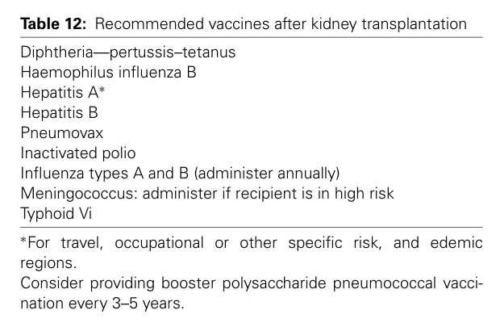

#### Table Data (CSV: [Table_12.csv](Table_12.csv))

```markdown
| Table Text (OCR) |
| :--- |
| Table 12: Recommended vaccines after kidney transplantation Diphtheria—pertussis-tetanus Haemophilus influenza B Hepatitis A* Hepatitis B ∗For travel, occupational or other specific risk, and edemic regions. Consider providing booster polysaccharide pneumococcal vacci- nation every 3–5 years. |
```

Table 12 Recommended vaccines after kidney transplantation

---

### Table_13

#### Table Image

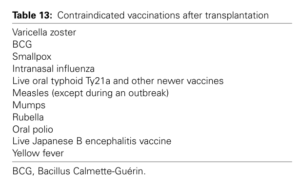

#### Table Data (CSV: [Table_13.csv](Table_13.csv))

```markdown
| Table Text (OCR) |
| :--- |
| Table 13: Contraindicated vaccinations after transplantation Varicella zoster BCG    Smallpox    Intranasal influenza    Live oral typhoid Ty21a and other newer vaccines    Measles (except during an outbreak)    Mumps    Rubella    Oral polio    Live Japanese B encephalitis vaccine    Yellow fever    BCG, Bacillus Calmette-Guérin. |
```

Table 13 Contraindicated vaccinations after transplantation

---

### Table_14

#### Table Image

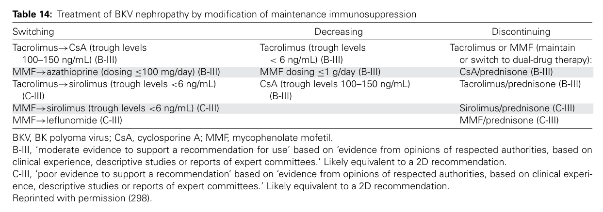

#### Table Data (CSV: [Table_14.csv](Table_14.csv))

```markdown
| Table Text (OCR) |
| :--- |
| Table 14: Treatment of BKV nephropathy by modification of maintenance immunosuppression Switching  Decreasing  Discontinuing    Tacrolimus→CsA (trough levels  Tacrolimus (trough levels  Tacrolimus or MMF (maintain    100–150 ng/mL) (B-III)  < 6 ng/mL) (B-III)  or switch to dual-drug therapy):    MMF→azathioprine (dosing ≤100 mg/day) (B-III) Tacrolimus→sirolimus (trough levels <6 ng/mL)  MMF dosing ≤1 g/day (B-III)  CsA/prednisone (B-III)    (C-III)  CsA (trough levels 100–150 ng/mL) (B-III)  Tacrolimus/prednisone (B-III)    MMF→sirolimus (trough levels <6 ng/mL) (C-III)    Sirolimus/prednisone (C-III)    MMF→leflunomide (C-III)    MMF/prednisone (C-III) BKV, BK polyoma virus; CsA, cyclosporine A; MMF, mycophenolate mofetil. B-III, ‘moderate evidence to support a recommendation for use’ based on ‘evidence from opinions of respected authorities, based on clinical experience, descriptive studies or reports of expert committees.’ Likely equivalent to a 2D recommendation. C-III, ‘poor evidence to support a recommendation’ based on ‘evidence from opinions of respected authorities, based on clinical experi ence, descriptive studies or reports of expert committees.’ Likely equivalent to a 2D recommendation. Reprinted with permission (298). |
```

Table 14 Treatment of BKV nephropathy by modification of maintenance immunosuppression

---

### Table_15

#### Table Image

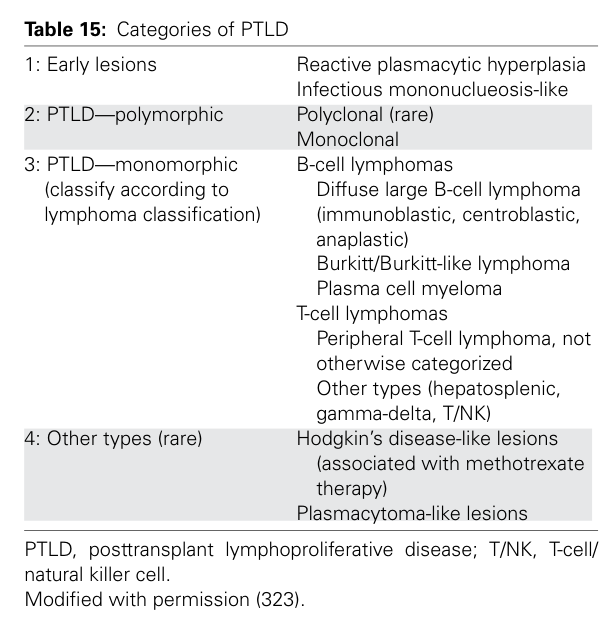

#### Table Data (CSV: [Table_15.csv](Table_15.csv))

```markdown
| Table Text (OCR) |
| :--- |
| Table 15: Categories of PTLD 1: Early lesions  Reactive plasmacytic hyperplasia Infectious mononuclueosis-like    2: PTLD—polymorphic 3: PTLD—monomorphic  Polyclonal (rare) Monoclonal B-cell lymphomas    (classify according to lymphoma classification)  Diffuse large B-cell lymphoma (immunoblastic, centroblastic, anaplastic) Burkitt/Burkitt-like lymphoma Plasma cell myeloma T-cell lymphomas Peripheral T-cell lymphoma, not otherwise categorized Other types (hepatosplenic, gamma-delta, T/NK)    4: Other types (rare)  Hodgkin's disease-like lesions (associated with methotrexate therapy) Plasmacytoma-like lesions PTLD, posttransplant lymphoproliferative disease; T/NK, T-cell/ natural killer cell. Modified with permission (323). |
```

Table 15 Categories of PTLD

---

### Table_16

#### Table Image

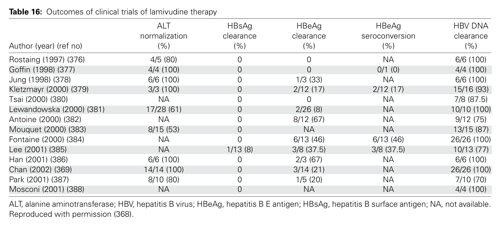

#### Table Data (CSV: [Table_16.csv](Table_16.csv))

```markdown
| Table Text (OCR) |
| :--- |
| Table 16: Outcomes of clinical trials of lamivudine therapy ALT normalization  HBsAg clearance  HBeAg clearance  HBeAg seroconversion  HBV DNA clearance    Author (year) (ref no)  (%) 4/5 (80)  (%) 0  (%) 0  (%) NA  (%) 6/6 (100)    Rostaing (1997) (376) Goffin (1998) (377)  4/4 (100)  0  0  0/1 (0)  4/4 (100)    Jung (1998) (378)  6/6 (100)  0  1/3 (33)  NA  6/6 (100)    Kletzmayr (2000) (379)  3/3 (100)  0  2/12 (17)  2/12 (17)  15/16 (93)    Tsai (2000) (380)  NA  0  0  NA  7/8 (87.5)    Lewandowska (2000) (381)  17/28 (61)  0  2/26 (8)  NA  10/10 (100)    Antoine (2000) (382)  NA  0  8/12 (67)  NA  9/12 (75)    Mouquet (2000) (383)  8/15 (53)  0  NA  NA  13/15 (87)    Fontaine (2000) (384)  NA  0  6/13 (46)  6/13 (46)  26/26 (100)    Lee (2001) (385)  NA  1/13 (8)  3/8 (37.5)  3/8 (37.5)  10/13 (77)    Han (2001) (386)  6/6 (100)  0  2/3 (67)  NA  6/6 (100)    Chan (2002) (369)  14/14 (100)  0  3/14 (21)  NA  26/26 (100)    Park (2001) (387)  8/10 (80)  0  1/5 (20)  NA  7/10 (70)    Mosconi (2001) (388)  NA  0  NA  NA  4/4 (100) ALT, alanine aminotransferase; HBV, hepatitis B virus; HBeAg, hepatitis B E antigen; HBsAg, hepatitis B surface antigen; NA, not available. Reproduced with permission (368). |
```

Table 16 Outcomes of clinical trials of lamivudine therapy

---

### Table_17

#### Table Image

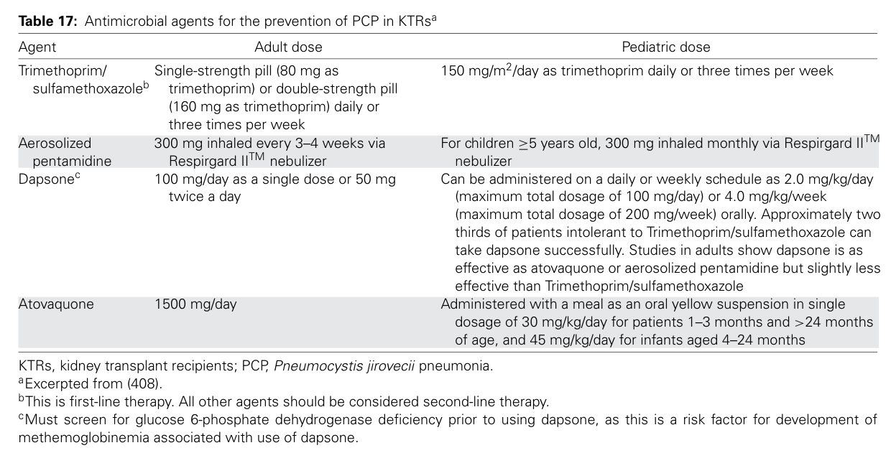

#### Table Data (CSV: [Table_17.csv](Table_17.csv))

```markdown
| Table Text (OCR) |
| :--- |
| Table 17: Antimicrobial agents for the prevention of PCP in KTRs<sup>a</sup> Agent  Adult dose  Pediatric dose    Trimethoprim/ sulfamethoxazoleb  Single-strength pill (80 mg as trimethoprim) or double-strength pill (160 mg as trimethoprim) daily or three times per week  150 mg/m²/day as trimethoprim daily or three times per week    Aerosolized pentamidine Dapsonec  300 mg inhaled every 3–4 weeks via Respirgard IITM nebulizer 100 mg/day as a single dose or 50 mg  For children ≥5 years old, 300 mg inhaled monthly via Respirgard II™M nebulizer Can be administered on a daily or weekly schedule as 2.0 mg/kg/day      twice a day  (maximum total dosage of 100 mg/day) or 4.0 mg/kg/week (maximum total dosage of 200 mg/week) orally. Approximately two thirds of patients intolerant to Trimethoprim/sulfamethoxazole can take dapsone successfully. Studies in adults show dapsone is as effective as atovaquone or aerosolized pentamidine but slightly less effective than Trimethoprim/sulfamethoxazole    Atovaquone  1500 mg/day  Administered with a meal as an oral yellow suspension in single dosage of 30 mg/kg/day for patients 1–3 months and >24 months of age, and 45 mg/kg/day for infants aged 4–24 months KTRs, kidney transplant recipients; PCP,   pneumonia. <sup>a</sup>Excerpted from (408). <sup>b</sup>This is first-line therapy. All other agents should be considered second-line therapy. <sup>c</sup>Must screen for glucose 6-phosphate dehydrogenase deficiency prior to using dapsone, as this is a risk factor for development of methemoglobinemia associated with use of dapsone. |
```

Table 17 Antimicrobial agents for the prevention of PCP in KTRs

---

### Table_18

#### Table Image

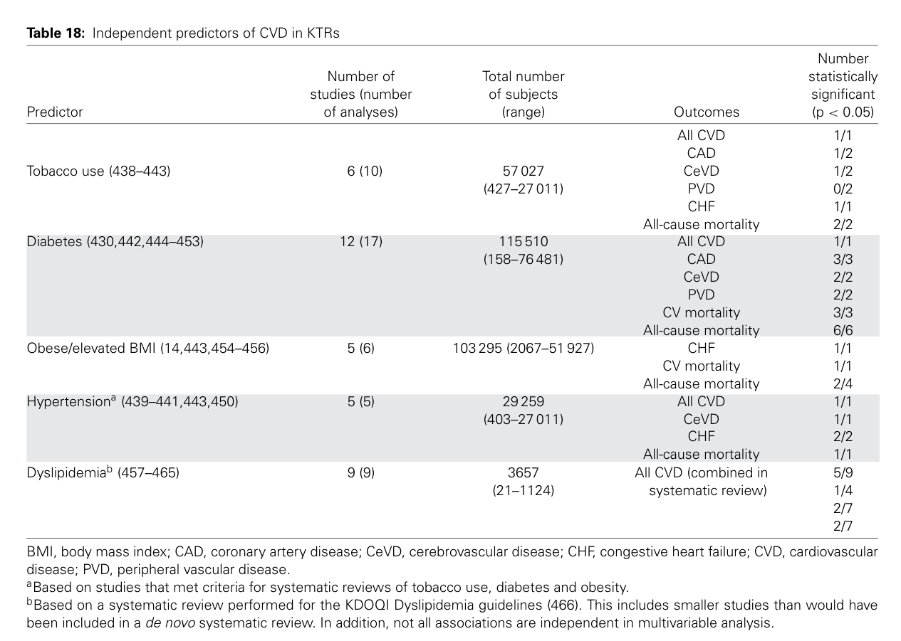

#### Table Data (CSV: [Table_18.csv](Table_18.csv))

```markdown
| Table Text (OCR) |
| :--- |
| Table 18: Independent predictors of CVD in KTRs Number    Predictor  Number of studies (number of analyses)  Total number    statistically    of subjects    significant    (range)  Outcomes  (p < 0.05)    Tobacco use (438–443)  6 (10)    All CVD CAD  1/1 1/2    57 027  CeVD          1/2    (427–27011)  PVD  0/2      CHF  1/1    Diabetes (430,442,444–453)  12 (17)  115510  All-cause mortality AlI CVD  2/2 1/1    (158–76481)  CAD  3/3      CeVD  2/2      PVD  2/2      CV mortality  3/3    Obese/elevated BMI (14,443,454–456)  5 (6)    All-cause mortality  6/6    103 295 (2067–51 927)  CHF  1/1      CV mortality  1/1    Hypertension³ (439–441,443,450)  5 (5)    All-cause mortality  2/4    29259  AlI CVD  1/1    (403–27011)  CeVD  1/1    Dyslipidemiab (457–465)  9 (9)    CHF All-cause mortality  2/2 1/1    3657  All CVD (combined in  5/9            (21-1124)  systematic review)  1/4            2/7          2/7 |
```

Table 18 Independent predictors of CVD in KTRs

---

### Table_19

#### Table Image

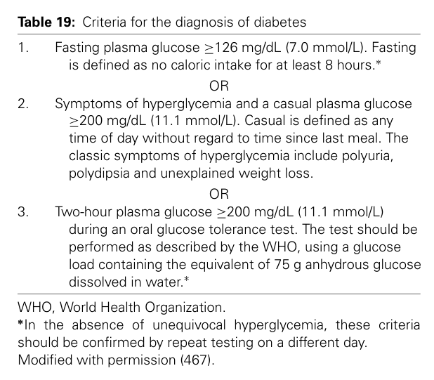

#### Table Data (CSV: [Table_19.csv](Table_19.csv))

```markdown
| Table Text (OCR) |
| :--- |
| Table 19: Criteria for the diagnosis of diabetes 1. Fasting plasma glucose 126 mg/dL (7.0 mmol/L). Fasting is defined as no caloric intake for at least 8 hours.∗ 2. Symptoms of hyperglycemia and a casual plasma glucose 200 mg/dL (11.1 mmol/L). Casual is defined as any time of day without regard to time since last meal. The classic symptoms of hyperglycemia include polyuria, polydipsia and unexplained weight loss. 3. Two-hour plasma glucose 200 mg/dL (11.1 mmol/L) during an oral glucose tolerance test. The test should be performed as described by the WHO, using a glucose load containing the equivalent of 75 g anhydrous glucose dissolved in water.∗ ∗In the absence of unequivocal hyperglycemia, these criteria should be confirmed by repeat testing on a different day. Modified with permission (467). |
```

Table 19 Criteria for the diagnosis of diabetes

---

### Table_20

#### Table Image

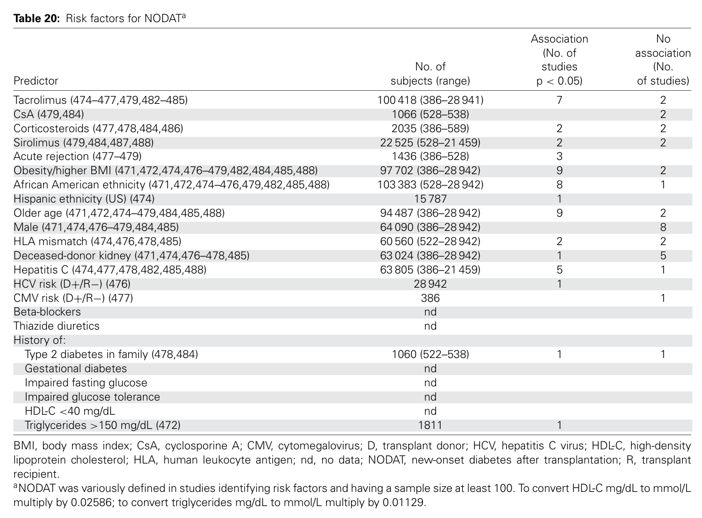

#### Table Data (CSV: [Table_20.csv](Table_20.csv))

```markdown
| Table Text (OCR) |
| :--- |
| Table 20: Risk factors for NODAT<sup>a</sup> Predictor  No. of subjects (range)  Association (No. of studies p < 0.05)  No association (No. of studies)    Tacrolimus (474–477,479,482–485)  100 418 (386–28 941)  7  2    CsA (479,484)  1066 (528–538)    2    Corticosteroids (477,478,484,486)  2035 (386–589)  2  2    Sirolimus (479,484,487,488)  22 525 (528–21 459)  2  2    Acute rejection (477–479)  1436 (386–528)  3      Obesity/higher BMI (471,472,474,476–479,482,484,485,488)  97 702 (386–28942)  9  2    African American ethnicity (471,472,474–476,479,482,485,488)  103 383 (528–28 942)  8  1    Hispanic ethnicity (US) (474)  15787  1      Older age (471,472,474–479,484,485,488)  94 487 (386–28 942)  9  2    Male (471,474,476–479,484,485)  64 090 (386–28 942)    8    HLA mismatch (474,476,478,485)  60 560 (522–28 942)  2  2    Deceased-donor kidney (471,474,476–478,485)  63 024 (386–28 942)  1  5    Hepatitis C (474,477,478,482,485,488)  63 805 (386–21 459)  5  1    HCV risk (D+/R-) (476)  28942  1      CMV risk (D+/R-) (477)  386    1    Beta-blockers  nd        Thiazide diuretics  nd        History of:          Type 2 diabetes in family (478,484)  1060 (522–538)  1  1    Gestational diabetes  nd        Impaired fasting glucose  nd        Impaired glucose tolerance  nd        HDL-C <40 mg/dL  nd        Triglycerides >150 mg/dL (472)  1811  1 BMI, body mass index; CsA, cyclosporine A; CMV, cytomegalovirus; D, transplant donor; HCV, hepatitis C virus; HDL-C, high-density lipoprotein cholesterol; HLA, human leukocyte antigen; nd, no data; NODAT, new-onset diabetes after transplantation; R, transplant recipient. <sup>a</sup>NODAT was variously defined in studies identifying risk factors and having a sample size at least 100. To convert HDL-C mg/dL to mmol/L multiply by 0.02586; to convert triglycerides mg/dL to mmol/L multiply by 0.01129. |
```

Table 20 Risk factors for NODAT

---

### Table_21

#### Table Image

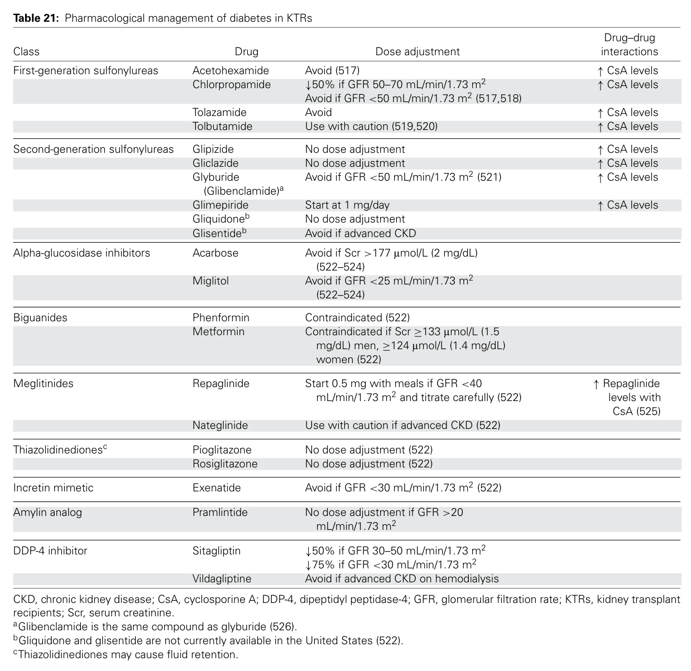

#### Table Data (CSV: [Table_21.csv](Table_21.csv))

```markdown
| Table Text (OCR) |
| :--- |
| Table 21: Pharmacological management of diabetes in KTRs Class  Drug  Dose adjustment  Drug-drug interactions    First-generation sulfonylureas  Acetohexamide  Avoid (517)  ↑ CsA levels      Chlorpropamide  ↓50% if GFR 50–70 mL/min/1.73 m² Avoid if GFR <50 mL/min/1.73 m² (517,518)  ↑ CsA levels      Tolazamide  Avoid  ↑CsA levels      Tolbutamide  Use with caution (519,520)  ↑ CsA levels    Second-generation sulfonylureas  Glipizide  No dose adjustment  ↑ CsA levels      Gliclazide  No dose adjustment  ↑ CsA levels      Glyburide (Glibenclamide)a  Avoid if GFR <50 mL/min/1.73 m² (521)  ↑ CsA levels      Glimepiride  Start at 1 mg/day  ↑ CsA levels      Gliquidoneb  No dose adjustment        Glisentideb  Avoid if advanced CKD      Alpha-glucosidase inhibitors  Acarbose  Avoid if Scr >177 μmol/L (2 mg/dL) (522–524)        Miglitol  Avoid if GFR <25 mL/min/1.73 m² (522–524)      Biguanides  Phenformin  Contraindicated (522) Contraindicated if Scr ≥133 μmol/L (1.5        Metformin  mg/dL) men, ≥124 μmol/L (1.4 mg/dL) women (522)      Meglitinides  Repaglinide  Start 0.5 mg with meals if GFR <40 mL/min/1.73 m² and titrate carefully (522)  ↑Repaglinide levels with CsA (525)      Nateglinide  Use with caution if advanced CKD (522)      Thiazolidinedionesº  Pioglitazone Rosiglitazone  No dose adjustment (522) No dose adjustment (522)      Incretin mimetic          Amylin analog  Exenatide Pramlintide  Avoid if GFR <30 mL/min/1.73 m² (522) No dose adjustment if GFR >20          mL/min/1.73 m²      DDP-4 inhibitor  Sitagliptin  ↓50% if GFR 30–50 mL/min/1.  7 3 { \mathrm m } ^ { 2 }           ↓75% if GFR <30 mL/min/1.73 m² CKD, chronic kidney disease; CsA, cyclosporine A; DDP-4, dipeptidyl peptidase-4; GFR, glomerular filtration rate; KTRs, kidney transplant recipients; Scr, serum creatinine. <sup>a</sup>Glibenclamide is the same compound as glyburide (526). <sup>b</sup>Gliquidone and glisentide are not currently available in the United States (522). <sup>c</sup>Thiazolidinediones may cause fluid retention. |
```

Table 21 Pharmacological management of diabetes in KTRs

---

### Table_22

#### Table Image

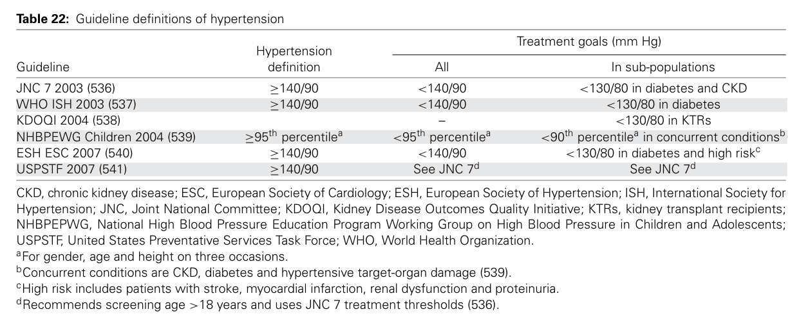

#### Table Data (CSV: [Table_22.csv](Table_22.csv))

```markdown
| Table Text (OCR) |
| :--- |
| Table 22: Guideline definitions of hypertension Hypertension definition  Treatment goals (mm Hg)    All  In sub-populations    JNC 7 2003 (536)  ≥140/90  <140/90  <130/80 in diabetes and CKD    WHO ISH 2003 (537)  ≥140/90  <140/90  <130/80 in diabetes    KDOQI 2004 (538)      <130/80 in KTRs    NHBPEWG Children 2004 (539)  ≥95th percentileª  <95th percentilea  <90th percentileª in concurrent conditionsb    ESH ESC 2007 (540)  ≥140/90  <140/90  <130/80 in diabetes and high riskº    USPSTF 2007 (541)  ≥140/90  See JNC 7d  See JNC 7d CKD, chronic kidney disease; ESC, European Society of Cardiology; ESH, European Society of Hypertension; ISH, International Society for Hypertension; JNC, Joint National Committee; KDOQI, Kidney Disease Outcomes Quality Initiative; KTRs, kidney transplant recipients; NHBPEPWG, National High Blood Pressure Education Program Working Group on High Blood Pressure in Children and Adolescents; USPSTF, United States Preventative Services Task Force; WHO, World Health Organization. <sup>a</sup>For gender, age and height on three occasions. <sup>b</sup>Concurrent conditions are CKD, diabetes and hypertensive target-organ damage (539). <sup>c</sup>High risk includes patients with stroke, myocardial infarction, renal dysfunction and proteinuria. <sup>d</sup>Recommends screening age >18 years and uses JNC 7 treatment thresholds (536). |
```

Table 22 Guideline definitions of hypertension

---

### Table_23

#### Table Image

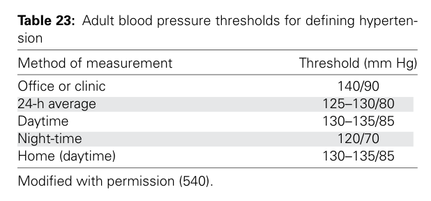

#### Table Data (CSV: [Table_23.csv](Table_23.csv))

```markdown
| Table Text (OCR) |
| :--- |
| Table 23: Adult blood pressure thresholds for defining hyperten- sion Method of measurement  Threshold (mm Hg)    Office or clinic  140/90    24-h average  125-130/80    Daytime  130-135/85    Night-time  120/70    Home (daytime)  130-135/85 Modified with permission (540). |
```

Table 23 Adult blood pressure thresholds for defining hypertension

---

### Table_24

#### Table Image

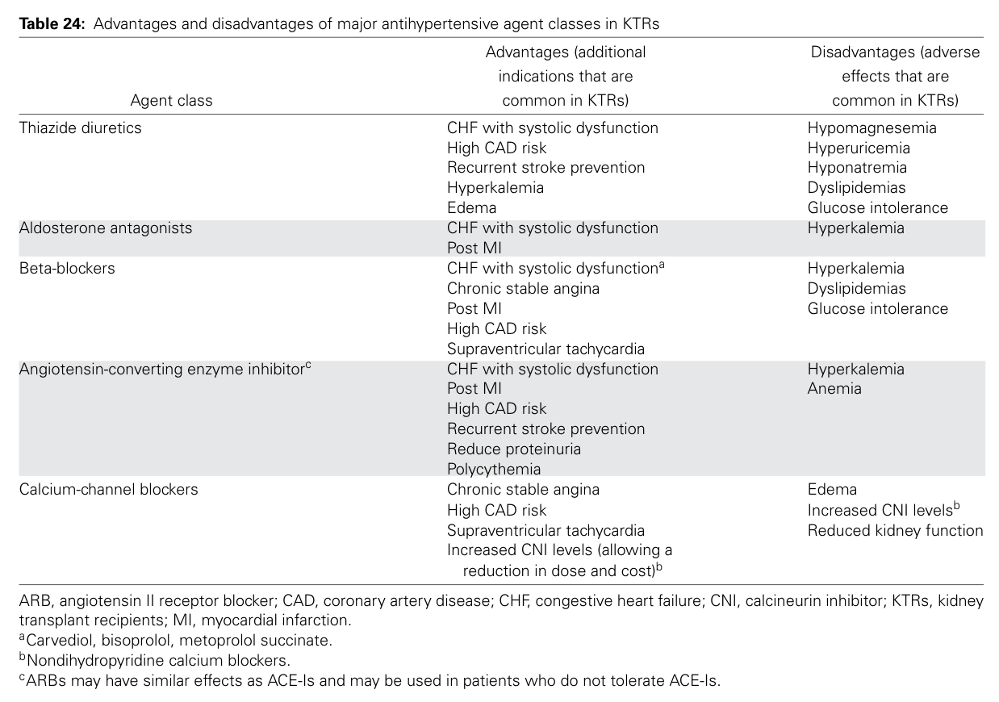

#### Table Data (CSV: [Table_24.csv](Table_24.csv))

```markdown
| Table Text (OCR) |
| :--- |
| Table 24: Advantages and disadvantages of major antihypertensive agent classes in KTRs Advantages (additional indications that are  Disadvantages (adverse effects that are    Agent class Thiazide diuretics  common in KTRs)  common in KTRs)    CHF with systolic dysfunction  Hypomagnesemia    High CAD risk  Hyperuricemia      Recurrent stroke prevention  Hyponatremia    Hyperkalemia  Dyslipidemias    Edema CHF with systolic dysfunction  Glucose intolerance Hyperkalemia    Aldosterone antagonists Beta-blockers  Post MI      CHF with systolic dysfunctionª Chronic stable angina  Hyperkalemia    Post MI  Dyslipidemias Glucose intolerance    Angiotensin-converting enzyme inhibitorc  High CAD risk Supraventricular tachycardia      CHF with systolic dysfunction  Hyperkalemia    Post MI High CAD risk  Anemia    Calcium-channel blockers  Reduce proteinuria      Polycythemia Chronic stable angina      High CAD risk  Edema Increased CNI levelsb ARB, angiotensin II receptor blocker; CAD, coronary artery disease; CHF, congestive heart failure; CNI, calcineurin inhibitor; KTRs, kidney transplant recipients; MI, myocardial infarction. <sup>a</sup>Carvediol, bisoprolol, metoprolol succinate. <sup>b</sup>Nondihydropyridine calcium blockers. <sup>c</sup>ARBs may have similar effects as ACE-Is and may be used in patients who do not tolerate ACE-Is. |
```

Table 24 Advantages and disadvantages of major antihypertensive agent classes in KTRs

---

### Table_25

#### Table Image

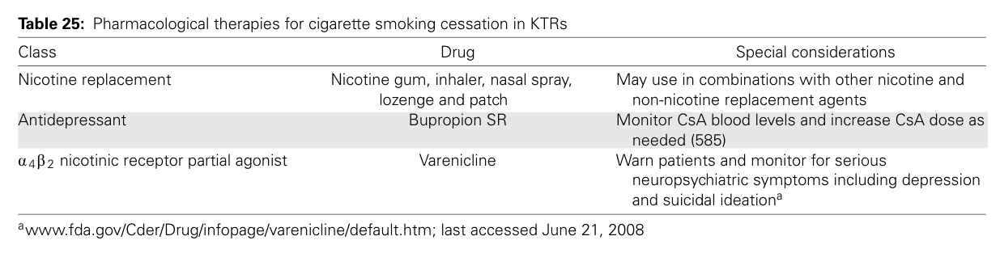

#### Table Data (CSV: [Table_25.csv](Table_25.csv))

```markdown
| Table Text (OCR) |
| :--- |
| Table 25: Pharmacological therapies for cigarette smoking cessation in KTRs Class  Drug  Special considerations    Nicotine replacement  Nicotine gum, inhaler, nasal spray, lozenge and patch  May use in combinations with other nicotine and non-nicotine replacement agents    Antidepressant  Bupropion SR  Monitor CsA blood levels and increase CsA dose as needed (585)    α4β2 nicotinic receptor partial agonist  Varenicline  Warn patients and monitor for serious neuropsychiatric symptoms including depression and suicidal ideationª <sup>a</sup>www.fda.gov/Cder/Drug/infopage/varenicline/default.htm; last accessed June 21, 2008 |
```

Table 25 Pharmacological therapies for cigarette smoking cessation in KTRs

---

### Table_26

#### Table Image

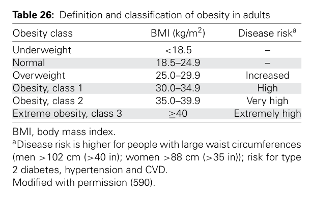

#### Table Data (CSV: [Table_26.csv](Table_26.csv))

```markdown
| Table Text (OCR) |
| :--- |
| Table 26: Definition and classification of obesity in adults Obesity class  BMI (kg/m²)  Disease riskª    Underweight  <18.5  一    Normal  18.5-24.9      Overweight  25.0-29.9  Increased    Obesity, class 1  30.0-34.9  High    Obesity, class 2  35.0-39.9  Very high    Extreme obesity, class 3  ≥40  Extremely high BMI, body mass index. <sup>a</sup>Disease risk is higher for people with large waist circumferences (men >102 cm (>40 in); women >88 cm (>35 in)); risk for type 2 diabetes, hypertension and CVD. Modified with permission (590). |
```

Table 26 Definition and classification of obesity in adults

---

### Table_27

#### Table Image

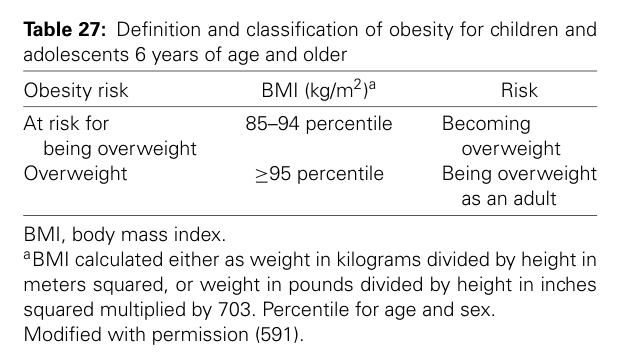

#### Table Data (CSV: [Table_27.csv](Table_27.csv))

```markdown
| Table Text (OCR) |
| :--- |
| Table 27: Definition and classification of obesity for children and adolescents 6 years of age and older Obesity risk  BMI (kg/m²)a  Risk    At risk for  85–94 percentile  Becoming    being overweight    overweight    Overweight  ≥95 percentile  Being overweight as an adult BMI, body mass index. <sup>a</sup>BMI calculated either as weight in kilograms divided by height in meters squared, or weight in pounds divided by height in inches squared multiplied by 703. Percentile for age and sex. Modified with permission (591). |
```

Table 27 Definition and classification of obesity for children and adolescents 6 years of age and older

---

### Table_28

#### Table Image

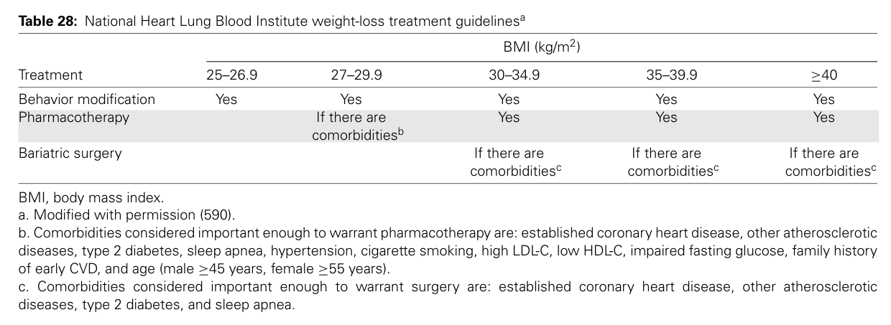

#### Table Data (CSV: [Table_28.csv](Table_28.csv))

```markdown
| Table Text (OCR) |
| :--- |
| Table 28: National Heart Lung Blood Institute weight-loss treatment guidelines<sup>a</sup> BMI (kg/m²)    Treatment  25-26.9  27-29.9  30-34.9  35-39.9  ≥40    Behavior modification  Yes  Yes  Yes  Yes  Yes    Pharmacotherapy    If there are comorbiditiesb  Yes  Yes  Yes    Bariatric surgery      If there are comorbiditiesc  If there are comorbiditiesº  If there are comorbiditiesc BMI, body mass index. a. Modified with permission (590). b. Comorbidities considered important enough to warrant pharmacotherapy are: established coronary heart disease, other atherosclerotic diseases, type 2 diabetes, sleep apnea, hypertension, cigarette smoking, high LDL-C, low HDL-C, impaired fasting glucose, family history of early CVD, and age (male 45 years, female 55 years). c. Comorbidities considered important enough to warrant surgery are: established coronary heart disease, other atherosclerotic diseases, type 2 diabetes, and sleep apnea. |
```

Table 28 National Heart Lung Blood Institute weight-loss treatment guidelines

---

### Table_29

#### Table Image

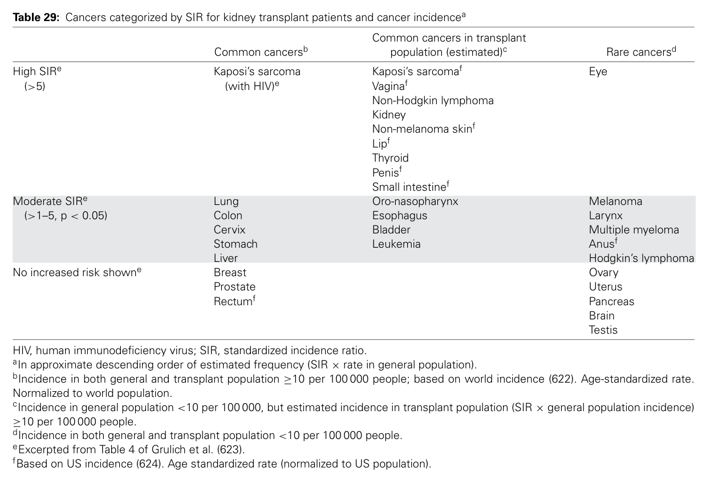

#### Table Data (CSV: [Table_29.csv](Table_29.csv))

```markdown
| Table Text (OCR) |
| :--- |
| Table 29: Cancers categorized by SIR for kidney transplant patients and cancer incidence<sup>a</sup> Common cancers in transplant Common cancersb population (estimated)c  Rare cancersd    High SIRe Kaposi's sarcoma (>5) (with HIV)e  Kaposi's sarcomaf Vaginaf Non-Hodgkin lymphoma  Eye    Moderate SIRe Lung  Kidney Non-melanoma skinf Lipf Thyroid Penis{ Small intestinef      (>1–5, ρ < 0.05)  Colon  Oro-nasopharynx Esophagus    Melanoma Larynx    Cervix  Bladder    Multiple myeloma    Stomach  Leukemia    Anusf    Liver      Hodgkin's lymphoma    No increased risk shownº Breast Prostate Rectumf    Ovary Uterus Pancreas HIV, human immunodeficiency virus; SIR, standardized incidence ratio. <sup>a</sup>In approximate descending order of estimated frequency (SIR rate in general population). <sup>b</sup>Incidence in both general and transplant population 10 per 100 000 people; based on world incidence (622). Age-standardized rate. Normalized to world population. <sup>c</sup>Incidence in general population <10 per 100 000, but estimated incidence in transplant population (SIR general population incidence) 10 per 100 000 people. <sup>d</sup>Incidence in both general and transplant population <10 per 100 000 people. <sup>e</sup>Excerpted from Table 4 of Grulich et al. (623). <sup>f</sup>Based on US incidence (624). Age standardized rate (normalized to US population). |
```

Table 29 Cancers categorized by SIR for kidney transplant patients and cancer incidence

---

### Table_30

#### Table Image

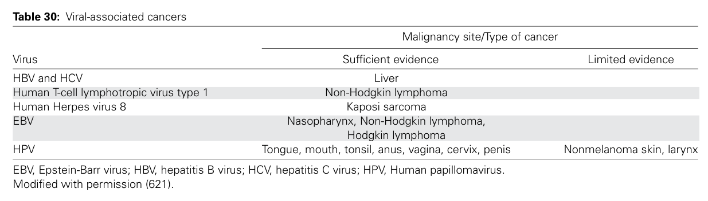

#### Table Data (CSV: [Table_30.csv](Table_30.csv))

```markdown
| Table Text (OCR) |
| :--- |
| Table 30: Viral-associated cancers Virus  Malignancy site/Type of cancer    Sufficient evidence  Limited evidence    HBV and HCV  Liver      Human T-cell lymphotropic virus type 1  Non-Hodgkin lymphoma      Human Herpes virus 8  Kaposi sarcoma      EBV  Nasopharynx, Non-Hodgkin lymphoma,      HPV  Hodgkin lymphoma Tongue, mouth, tonsil, anus, vagina, cervix, penis  Nonmelanoma skin, larynx EBV, Epstein-Barr virus; HBV, hepatitis B virus; HCV, hepatitis C virus; HPV, Human papillomavirus. Modified with permission (621). |
```

Table 30 Viral-associated cancers

---

### Table_31

#### Table Image

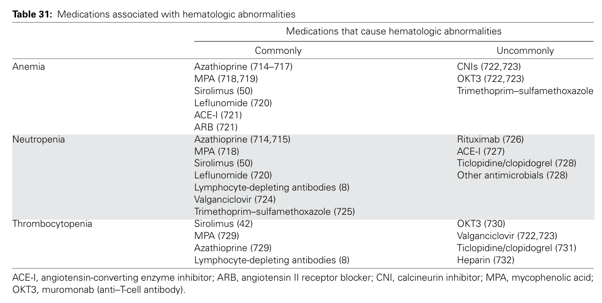

#### Table Data (CSV: [Table_31.csv](Table_31.csv))

```markdown
| Table Text (OCR) |
| :--- |
| Table 31: Medications associated with hematologic abnormalities Medications that cause hematologic abnormalities    Commonly  Uncommonly    Anemia  Azathioprine (714–717)  CNIs (722,723)    MPA (718,719)  OKT3 (722,723)    Sirolimus (50)  Trimethoprim-sulfamethoxazole    Leflunomide (720)      ACE-I (721)      Neutropenia  ARB (721) Azathioprine (714,715)  Rituximab (726)    MPA (718)  ACE-I (727)    Sirolimus (50)  Ticlopidine/clopidogrel (728)    Leflunomide (720)      Lymphocyte-depleting antibodies (8)  Other antimicrobials (728)    Valganciclovir (724)    Thrombocytopenia  Trimethoprim-sulfamethoxazole (725)  OKT3 (730)    Sirolimus (42)      MPA (729)  Valganciclovir (722,723)    Azathioprine (729) Lymphocyte-depleting antibodies (8)  Ticlopidine/clopidogrel (731) ACE-I, angiotensin-converting enzyme inhibitor; ARB, angiotensin II receptor blocker; CNI, calcineurin inhibitor; MPA, mycophenolic acid; OKT3, muromonab (anti–T-cell antibody). |
```

Table 31 Medications associated with hematologic abnormalities

---

### Table_32

#### Table Images (4 Parts)

- **Part 1 (Page 127)**:
  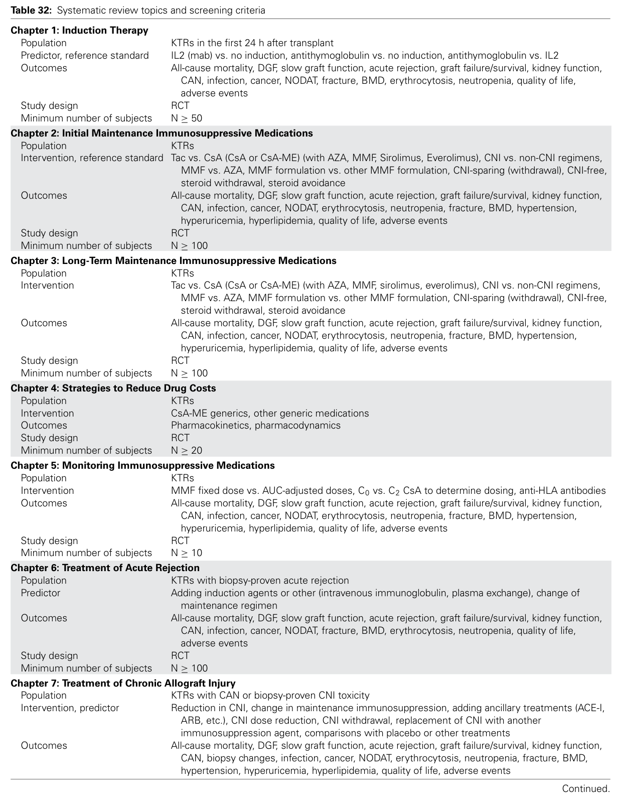

- **Part 2 (Page 128)**:
  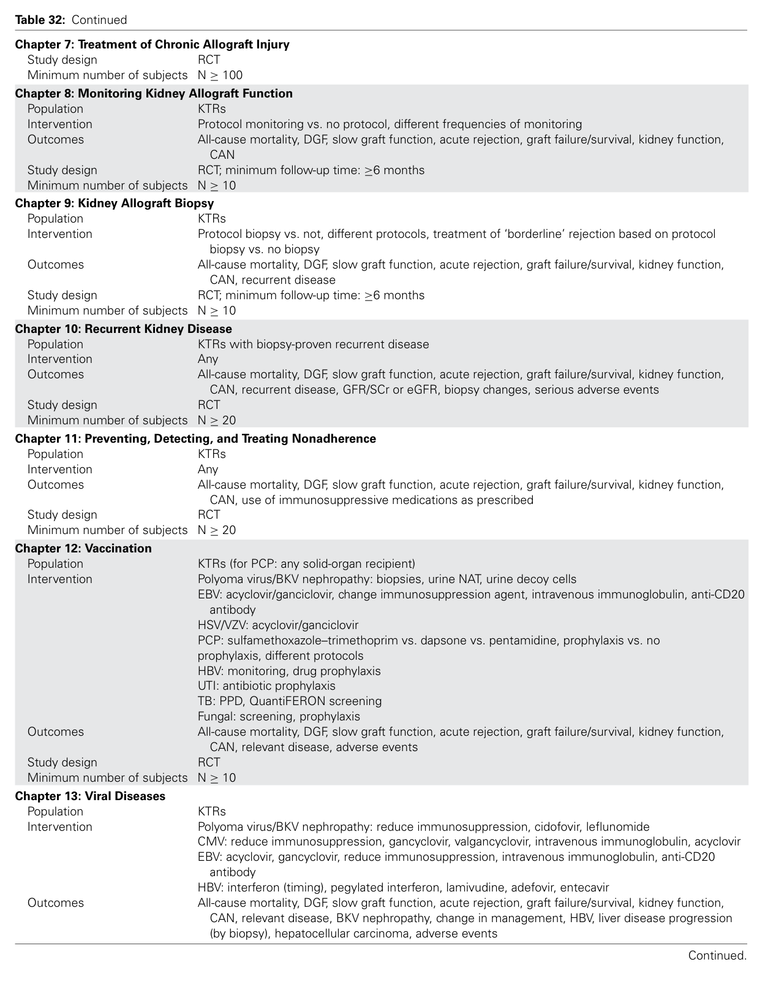

- **Part 3 (Page 129)**:
  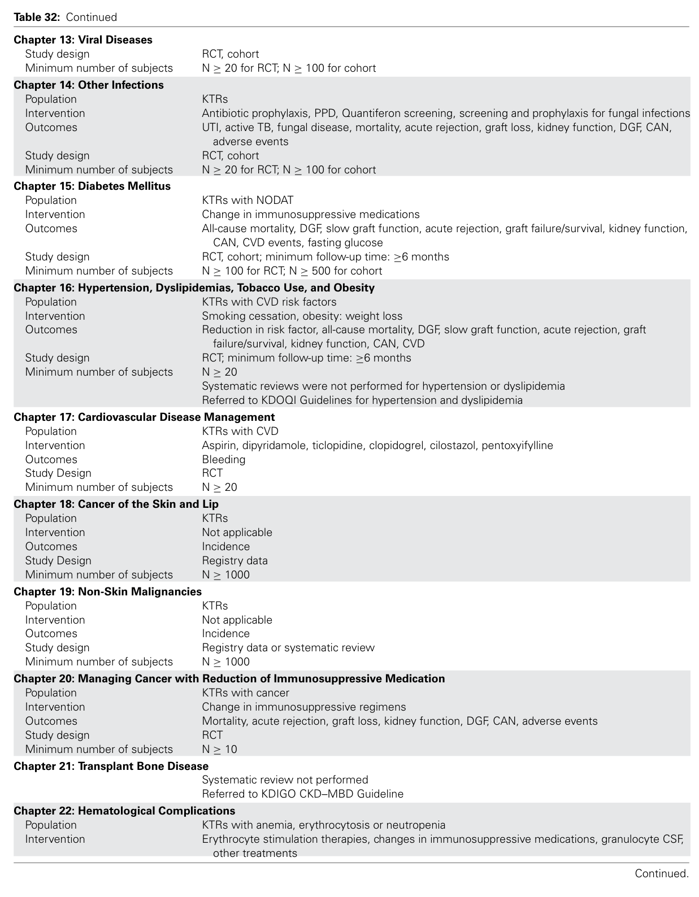

- **Part 4 (Page 130)**:
  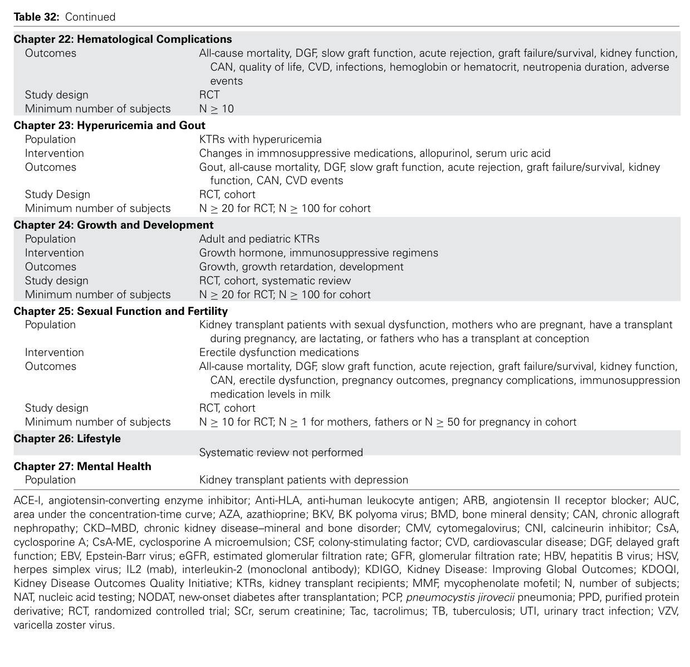

#### Table Data (CSV: [Table_32.csv](Table_32.csv))

```markdown
| Table Text (OCR) |
| :--- |
| images/e159a21d6e93839892c82cdd1e050476656329840ada86e2b4468d693e4ae222.jpg Table 32: Systematic review topics and screening criteria <table><tr><td>Chapter 1: Induction Therapy</td><td></td></tr><tr><td>Population</td><td>KTRs in the first 24 h after transplant</td></tr><tr><td>Predictor, reference standard</td><td>IL2 (mab) vs. no induction, antithymoglobulin vs. no induction, antithymoglobulin vs. IL2</td></tr><tr><td>Outcomes</td><td>All-cause mortality, DGF, slow graft function, acute rejection, graft failure/survival, kidney function, CAN, infection, cancer, NODAT, fracture, BMD, erythrocytosis, neutropenia, quality of life,</td></tr><tr><td>Study design</td><td>adverse events RCT</td></tr><tr><td>Minimum number of subjects</td><td>N≥ 50</td></tr></table> simple_table Chapter 2: Initial Maintenance Immunosuppressive Medications images/a35fb1225216ba535747f0ab1796776657da9fc3fe658e092d1bff0e7817b795.jpg <table><tr><td>Population</td><td>KTRs</td></tr><tr><td></td><td>Intervention, reference standard Tac vs. CsA (CsA or CsA-ME) (with AZA, MMF, Sirolimus, Everolimus), CNI vs. non-CNI regimens, MMF vs. AZA, MMF formulation vs. other MMF formulation, CNI-sparing (withdrawal), CNI-free, steroid withdrawal, steroid avoidance</td></tr><tr><td>Outcomes</td><td>All-cause mortality, DGF, slow graft function, acute rejection, graft failure/survival, kidney function, CAN, infection, cancer, NODAT, erythrocytosis, neutropenia, fracture, BMD, hypertension,</td></tr><tr><td>Study design</td><td>hyperuricemia, hyperlipidemia, quality of life, adverse events</td></tr><tr><td>Minimum number of subjects</td><td>RCT N≥ 100</td></tr></table> simple_table Chapter 3: Long-Term Maintenance Immunosuppressive Medications images/e8259cc5363a0d6916f60c136f0f2d64ec10a5705de409fa55f5e112c56a3ac3.jpg <table><tr><td>Population</td><td>KTRs</td></tr><tr><td>Intervention</td><td>Tac vs. CsA (CsA or CsA-ME) (with AZA, MMF, sirolimus, everolimus), CNI vs. non-CNI regimens, MMF vs. AZA, MMF formulation vs. other MMF formulation, CNI-sparing (withdrawal), CNI-free, steroid withdrawal, steroid avoidance</td></tr><tr><td>Outcomes</td><td>All-cause mortality, DGF, slow graft function, acute rejection, graft failure/survival, kidney function, CAN, infection, cancer, NODAT, erythrocytosis, neutropenia, fracture, BMD, hypertension,</td></tr><tr><td>Study design</td><td>hyperuricemia, hyperlipidemia, quality of life, adverse events RCT</td></tr><tr><td>Minimum number of subjects</td><td>N≥ 100</td></tr></table> simple_table images/7fa76f9137c9875a78d55476379cbf283a37219c80ac2cdf19af57fa4764cd78.jpg <table><tr><td colspan="2">Chapter 4: Strategies to Reduce Drug Costs</td></tr><tr><td>Population</td><td>KTRs</td></tr><tr><td>Intervention</td><td>CsA-ME generics, other generic medications</td></tr><tr><td>Outcomes</td><td>Pharmacokinetics, pharmacodynamics</td></tr><tr><td>Study design</td><td>RCT</td></tr><tr><td>Minimum number of subjects</td><td>N≥ 20</td></tr></table> complex_table images/03c1826dcddae527484689d3c31774823029a1043a2cac75c60b85f9cd836de9.jpg <table><tr><td colspan="2">Chapter 5: Monitoring Immunosuppressive Medications</td></tr><tr><td>Population KTRs</td><td></td></tr><tr><td>Intervention Outcomes</td><td>MMF fixed dose vs. AUC-adjusted doses, C0 vs. C₂ CsA to determine dosing, anti-HLA antibodies All-cause mortality, DGF, slow graft function, acute rejection, graft failure/survival, kidney function,</td></tr><tr><td></td><td>CAN, infection, cancer, NODAT, erythrocytosis, neutropenia, fracture, BMD, hypertension, hyperuricemia, hyperlipidemia, quality of life, adverse events</td></tr><tr><td>Study design</td><td>RCT</td></tr><tr><td>Minimum number of subjects</td><td>N≥10</td></tr></table> complex_table images/a0f30200575330d0f02f3d6ec9ce9addb20584c02d6c1a9d83f62da8ade7ddcb.jpg <table><tr><td colspan="2">Chapter 6: Treatment of Acute Rejection</td></tr><tr><td>Population</td><td>KTRs with biopsy-proven acute rejection</td></tr><tr><td>Predictor</td><td>Adding induction agents or other (intravenous immunoglobulin, plasma exchange), change of maintenance regimen</td></tr><tr><td>Outcomes</td><td>All-cause mortality, DGF, slow graft function, acute rejection, graft failure/survival, kidney function, CAN, infection, cancer, NODAT, fracture, BMD, erythrocytosis, neutropenia, quality of life, adverse events</td></tr><tr><td>Study design RCT</td><td></td></tr><tr><td>Minimum number of subjects N≥100</td><td></td></tr></table> complex_table Chapter 7: Treatment of Chronic Allograft Injury images/9089ff1cbfa88ff11a3f892f456beb7297eb2daf6a673729d9e95fa44389a3d8.jpg <table><tr><td>Population</td><td>KTRs with CAN or biopsy-proven CNI toxicity</td></tr><tr><td>Intervention, predictor</td><td>Reduction in CNI, change in maintenance immunosuppression, adding ancillary treatments (ACE-I, ARB, etc.), CNI dose reduction, CNI withdrawal, replacement of CNI with another</td></tr><tr><td>Outcomes</td><td>immunosuppression agent, comparisons with placebo or other treatments All-cause mortality, DGF, slow graft function, acute rejection, graft failure/survival, kidney function, CAN, biopsy changes, infection, cancer, NODAT, erythrocytosis, neutropenia, fracture, BMD,</td></tr><tr><td colspan="2">Chapter 7: Treatment of Chronic Allograft Injury</td></tr><tr><td>Study design</td><td>RCT</td></tr><tr><td>Minimum number of subjects N ≥ 100</td><td></td></tr><tr><td>Chapter 8: Monitoring Kidney Allograft Function</td><td></td></tr><tr><td>Population</td><td>KTRs</td></tr><tr><td>Intervention</td><td>Protocol monitoring vs. no protocol, different frequencies of monitoring</td></tr><tr><td>Outcomes</td><td>All-cause mortality, DGF, slow graft function, acute rejection, graft failure/survival, kidney function,</td></tr><tr><td>Study design</td><td>CAN RCT; minimum follow-up time: ≥6 months</td></tr><tr><td>Minimum number of subjects N ≥ 10</td><td></td></tr><tr><td colspan="2">Chapter 9: Kidney Allograft Biopsy KTRs</td></tr><tr><td>Population</td><td>Protocol biopsy vs. not, different protocols, treatment of 'borderline' rejection based on protocol</td></tr><tr><td>Intervention</td><td>biopsy vs. no biopsy</td></tr><tr><td>Outcomes</td><td>All-cause mortality, DGF, slow graft function, acute rejection, graft failure/survival, kidney function, CAN, recurrent disease</td></tr><tr><td>Study design</td><td>RCT; minimum follow-up time: ≥6 months</td></tr><tr><td>Minimum number of subjects N ≥ 10</td><td></td></tr><tr><td>Chapter 10: Recurrent Kidney Disease</td><td>KTRs with biopsy-proven recurrent disease</td></tr><tr><td>Population Intervention</td><td>Any</td></tr><tr><td>Outcomes</td><td>All-cause mortality, DGF, slow graft function, acute rejection, graft failure/survival, kidney function,</td></tr><tr><td></td><td>CAN, recurrent disease, GFR/SCr or eGFR, biopsy changes, serious adverse events</td></tr><tr><td>Study design</td><td>RCT</td></tr><tr><td>Minimum number of subjects N ≥ 20</td><td></td></tr><tr><td>Chapter 11: Preventing, Detecting, and Treating Nonadherence</td><td>KTRs</td></tr><tr><td>Population Intervention</td><td>Any</td></tr><tr><td>Outcomes</td><td>All-cause mortality, DGF, slow graft function, acute rejection, graft failure/survival, kidney function,</td></tr><tr><td></td><td>CAN, use of immunosuppressive medications as prescribed RCT</td></tr><tr><td>Study design Minimum number of subjects N ≥ 20</td><td></td></tr><tr><td>Chapter 12: Vaccination</td><td></td></tr><tr><td>Population Intervention</td><td>KTRs (for PCP: any solid-organ recipient) Polyoma virus/BKV nephropathy: biopsies, urine NAT, urine decoy cells</td></tr><tr><td></td><td>EBV: acyclovir/ganciclovir, change immunosuppression agent, intravenous immunoglobulin, anti-CD20 antibody</td></tr><tr><td></td><td>HSV/VZV: acyclovir/ganciclovir PCP: sulfamethoxazole-trimethoprim vs. dapsone vs. pentamidine, prophylaxis vs. no</td></tr><tr><td></td><td>prophylaxis, different protocols HBV: monitoring, drug prophylaxis</td></tr><tr><td></td><td>UTI: antibiotic prophylaxis</td></tr><tr><td></td><td>TB: PPD, QuantiFERON screening Fungal: screening, prophylaxis</td></tr><tr><td>Outcomes</td><td>All-cause mortality, DGF, slow graft function, acute rejection, graft failure/survival, kidney function,</td></tr><tr><td></td><td>CAN, relevant disease, adverse events RCT</td></tr><tr><td>Study design Minimum number of subjects N ≥ 10</td><td></td></tr><tr><td></td><td></td></tr><tr><td>Chapter 13: Viral Diseases</td><td></td></tr><tr><td>Population</td><td>KTRs</td></tr><tr><td>Intervention</td><td>Polyoma virus/BKV nephropathy: reduce immunosuppression, cidofovir, leflunomide</td></tr><tr><td></td><td></td></tr><tr><td></td><td>CMV: reduce immunosuppression, gancyclovir, valgancyclovir, intravenous immunoglobulin, acyclovir</td></tr><tr><td></td><td></td></tr><tr><td></td><td>EBV: acyclovir, gancyclovir, reduce immunosuppression, intravenous immunoglobulin, anti-CD20</td></tr><tr><td></td><td></td></tr><tr><td></td><td></td></tr><tr><td></td><td></td></tr><tr><td></td><td></td></tr><tr><td></td><td>antibody</td></tr><tr><td></td><td></td></tr><tr><td></td><td></td></tr><tr><td></td><td></td></tr><tr><td></td><td>HBV: interferon (timing), pegylated interferon, lamivudine, adefovir, entecavir</td></tr><tr><td></td><td></td></tr><tr><td></td><td></td></tr><tr><td></td><td></td></tr><tr><td></td><td></td></tr><tr><td></td><td></td></tr><tr><td></td><td></td></tr><tr><td></td><td></td></tr><tr><td></td><td></td></tr><tr><td></td><td></td></tr><tr><td>Outcomes</td><td></td></tr><tr><td></td><td></td></tr><tr><td></td><td></td></tr><tr><td></td><td></td></tr><tr><td></td><td></td></tr><tr><td></td><td></td></tr><tr><td></td><td></td></tr><tr><td></td><td></td></tr><tr><td></td><td>All-cause mortality, DGF, slow graft function, acute rejection, graft failure/survival, kidney function,</td></tr></table> complex_table Continued. images/ simple_table Continued. images/59fa47645179d52f6b630180b7e5cc983995e90986c5e772caab68779bdf5a7c.jpg Table 32: Continued ACE-I, angiotensin-converting enzyme inhibitor; Anti-HLA, anti-human leukocyte antigen; ARB, angiotensin II receptor blocker; AUC, area under the concentration-time curve; AZA, azathioprine; BKV, BK polyoma virus; BMD, bone mineral density; CAN, chronic allograf nephropathy; CKD–MBD, chronic kidney disease–mineral and bone disorder; CMV, cytomegalovirus; CNI, calcineurin inhibitor; CsA, cyclosporine A; CsA-ME, cyclosporine A microemulsion; CSF, colony-stimulating factor; CVD, cardiovascular disease; DGF, delayed graf function; EBV, Epstein-Barr virus; eGFR, estimated glomerular filtration rate; GFR, glomerular filtration rate; HBV, hepatitis B virus; HSV, herpes simplex virus; IL2 (mab), interleukin-2 (monoclonal antibody); KDIGO, Kidney Disease: Improving Global Outcomes; KDOQI, Kidney Disease Outcomes Quality Initiative; KTRs, kidney transplant recipients; MMF, mycophenolate mofetil; N, number of subjects; NAT, nucleic acid testing; NODAT, new-onset diabetes after transplantation; PCP, pneumonia; PPD, purified protein derivative; RCT, randomized controlled trial; SCr, serum creatinine; Tac, tacrolimus; TB, tuberculosis; UTI, urinary tract infection; VZV, varicella zoster virus. <table><tr><td>Chapter 13: Viral Diseases</td><td></td></tr><tr><td>Study design</td><td>RCT, cohort</td></tr><tr><td>Minimum number of subjects</td><td>N ≥ 20 for RCT; N ≥ 100 for cohort</td></tr><tr><td colspan="2">Chapter 14: Other Infections</td></tr><tr><td>Population</td><td>KTRs</td></tr><tr><td>Intervention Outcomes</td><td>Antibiotic prophylaxis, PPD, Quantiferon screening, screening and prophylaxis for fungal infections UTI, active TB, fungal disease, mortality, acute rejection, graft loss, kidney function, DGF, CAN,</td></tr><tr><td></td><td>adverse events</td></tr><tr><td>Study design</td><td>RCT, cohort N ≥ 20 for RCT; N ≥ 100 for cohort</td></tr><tr><td colspan="2">Minimum number of subjects Chapter 15: Diabetes Mellitus</td></tr><tr><td></td><td>KTRs with NODAT</td></tr><tr><td>Population Intervention</td><td>Change in immunosuppressive medications</td></tr><tr><td>Outcomes</td><td>All-cause mortality, DGF, slow graft function, acute rejection, graft failure/survival, kidney function,</td></tr><tr><td></td><td>CAN, CVD events, fasting glucose</td></tr><tr><td>Study design</td><td>RCT, cohort; minimum follow-up time: ≥6 months</td></tr><tr><td colspan="2">Minimum number of subjects N ≥ 100 for RCT; N ≥ 500 for cohort</td></tr><tr><td>Chapter 16: Hypertension, Dyslipidemias, Tobacco Use, and Obesity Population</td><td>KTRs with CVD risk factors</td></tr><tr><td>Intervention</td><td>Smoking cessation, obesity: weight loss</td></tr><tr><td>Outcomes</td><td>Reduction in risk factor, all-cause mortality, DGF, slow graft function, acute rejection, graft failure/survival, kidney function, CAN, CVD</td></tr><tr><td>Study design</td><td>RCT; minimum follow-up time: ≥6 months</td></tr><tr><td>Minimum number of subjects</td><td>N≥ 20</td></tr><tr><td></td><td>Systematic reviews were not performed for hypertension or dyslipidemia Referred to KDOQI Guidelines for hypertension and dyslipidemia</td></tr><tr><td colspan="2">Chapter 17: Cardiovascular Disease Management</td></tr><tr><td>Population</td><td>KTRs with CVD</td></tr><tr><td>Intervention</td><td>Aspirin, dipyridamole, ticlopidine, clopidogrel, cilostazol, pentoxyifylline</td></tr><tr><td>Outcomes</td><td>Bleeding</td></tr><tr><td>Study Design</td><td>RCT</td></tr><tr><td>Minimum number of subjects</td><td>N≥ 20</td></tr><tr><td colspan="2">Chapter 18: Cancer of the Skin and Lip</td></tr><tr><td>Population</td><td>KTRs</td></tr><tr><td>Intervention</td><td>Not applicable</td></tr><tr><td>Outcomes</td><td>Incidence</td></tr><tr><td>Study Design</td><td>Registry data</td></tr><tr><td>Minimum number of subjects</td><td>N≥1000</td></tr><tr><td colspan="2">Chapter 19: Non-Skin Malignancies</td></tr><tr><td>Population</td><td>KTRs</td></tr><tr><td>Intervention</td><td>Not applicable</td></tr><tr><td>Outcomes</td><td>Incidence</td></tr><tr><td>Study design</td><td>Registry data or systematic review</td></tr><tr><td>Minimum number of subjects</td><td>N≥ 1000</td></tr><tr><td colspan="2">Chapter 20: Managing Cancer with Reduction of Immunosuppressive Medication</td></tr><tr><td>Population</td><td>KTRs with cancer</td></tr><tr><td>Intervention</td><td>Change in immunosuppressive regimens</td></tr><tr><td>Outcomes</td><td>Mortality, acute rejection, graft loss, kidney function, DGF, CAN, adverse events</td></tr><tr><td>Study design</td><td>RCT</td></tr><tr><td colspan="2">Minimum number of subjects N≥10</td></tr><tr><td>Chapter 21: Transplant Bone Disease</td><td></td></tr><tr><td></td><td>Systematic review not performed Referred to KDIGO CKD-MBD Guideline</td></tr><tr><td colspan="2">Chapter 22: Hematological Complications</td></tr><tr><td>Population</td><td>KTRs with anemia, erythrocytosis or neutropenia</td></tr><tr><td>Intervention</td><td>Erythrocyte stimulation therapies, changes in immunosuppressive medications, granulocyte CSF,</td></tr><tr><td></td><td>other treatments</td></tr><tr><td colspan="2">Chapter 22: Hematological Complications</td></tr><tr><td>Outcomes</td><td>All-cause mortality, DGF, slow graft function, acute rejection, graft failure/survival, kidney function, CAN, quality of life, CVD, infections, hemoglobin or hematocrit, neutropenia duration, adverse</td></tr><tr><td>Study design</td><td>events RCT</td></tr><tr><td>Minimum number of subjects</td><td> $\Nu \geq 1 0$ </td></tr><tr><td colspan="2">Chapter 23: Hyperuricemia and Gout</td></tr><tr><td>Population</td><td>KTRs with hyperuricemia</td></tr><tr><td>Intervention</td><td>Changes in immnosuppressive medications, allopurinol, serum uric acid</td></tr><tr><td>Outcomes</td><td>Gout, all-cause mortality, DGF, slow graft function, acute rejection, graft failure/survival, kidney function, CAN, CVD events</td></tr><tr><td>Study Design</td><td>RCT, cohort</td></tr><tr><td>Minimum number of subjects</td><td>N ≥ 20 for  ${ \mathsf { R C T } } ; { \mathsf { N } } \geq 1 0 0$  for cohort</td></tr><tr><td colspan="2">Chapter 24: Growth and Development</td></tr><tr><td>Population</td><td>Adult and pediatric KTRs</td></tr><tr><td>Intervention Outcomes</td><td>Growth hormone, immunosuppressive regimens</td></tr><tr><td>Study design</td><td>Growth, growth retardation, development</td></tr><tr><td></td><td>RCT, cohort, systematic review  $\mathsf { R C T } ; \mathsf { N } \geq 1 0 0$  for cohort</td></tr><tr><td colspan="2">Minimum number of subjects N ≥ 20 for Chapter 25: Sexual Function and Fertility</td></tr><tr><td>Population</td><td>Kidney transplant patients with sexual dysfunction, mothers who are pregnant, have a transplant during pregnancy, are lactating, or fathers who has a transplant at conception</td></tr><tr><td>Intervention Outcomes</td><td>Erectile dysfunction medications</td></tr><tr><td></td><td>All-cause mortality, DGF, slow graft function, acute rejection, graft failure/survival, kidney function, CAN, erectile dysfunction, pregnancy outcomes, pregnancy complications, immunosuppression medication levels in milk</td></tr><tr><td>Study design</td><td>RCT, cohort</td></tr><tr><td>Minimum number of subjects Chapter 26: Lifestyle</td><td> $\mathsf { N } \geq 1 0 \mathrm { f o r } \mathsf { R C T } ; \mathsf { N } \geq 1$  for mothers, fathers or  $N \geq 5 0$  for pregnancy in cohort</td></tr><tr><td colspan="2"></td></tr><tr><td>Chapter 27: Mental Health Population</td><td>Kidney transplant patients with depression</td></tr></table> complex_table images/ simple_table |
```

Table 32 Systematic review topics and screening criteria

---

### Table_33

#### Table Image

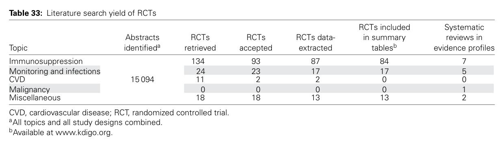

#### Table Data (CSV: [Table_33.csv](Table_33.csv))

```markdown
| Table Text (OCR) |
| :--- |
| Table 33: Literature search yield of RCTs RCTs included Systematic reviews in evidence profiles    Topic  Abstracts identifiedª  RCTs retrieved  RCTs accepted  RCTs data- extracted  in summary tablesb    Immunosuppression    87  84      Monitoring and infections CVD  15094  134  93      7    24  23  17  17 0  5 0      11  2  2 0  0  1    Malignancy Miscellaneous  0 18  0 18  13  13  2 CVD, cardiovascular disease; RCT, randomized controlled trial. <sup>a</sup>All topics and all study designs combined. <sup>b</sup>Available at www.kdigo.org. |
```

Table 33 Literature search yield of RCTs

---

### Table_34

#### Table Image

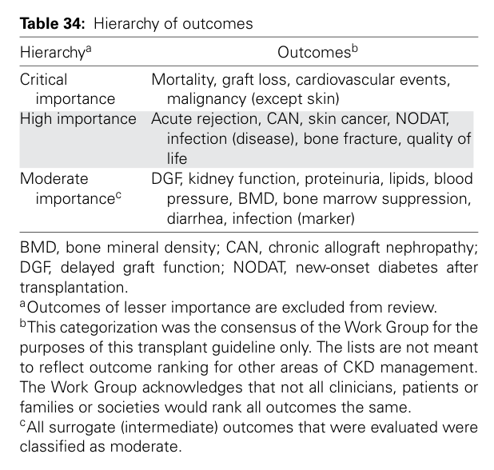

#### Table Data (CSV: [Table_34.csv](Table_34.csv))

```markdown
| Table Text (OCR) |
| :--- |
| Table 34: Hierarchy of outcomes Hierarchyª  Outcomesb    Critical importance High importance  Mortality, graft loss, cardiovascular events, malignancy (except skin)      Acute rejection, CAN, skin cancer, NODAT, infection (disease), bone fracture, quality of life    Moderate importancec  DGF, kidney function, proteinuria, lipids, blood pressure, BMD, bone marrow suppression, diarrhea, infection (marker) BMD, bone mineral density; CAN, chronic allograft nephropathy; DGF, delayed graft function; NODAT, new-onset diabetes after transplantation. <sup>a</sup>Outcomes of lesser importance are excluded from review. <sup>b</sup>This categorization was the consensus of the Work Group for the purposes of this transplant guideline only. The lists are not meant to reflect outcome ranking for other areas of CKD management. The Work Group acknowledges that not all clinicians, patients or families or societies would rank all outcomes the same. <sup>c</sup>All surrogate (intermediate) outcomes that were evaluated were classified as moderate. |
```

Table 34 Hierarchy of outcomes

---

### Table_35

#### Table Image

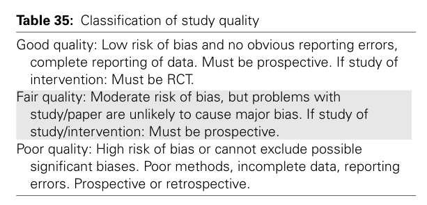

#### Table Data (CSV: [Table_35.csv](Table_35.csv))

```markdown
| Table Text (OCR) |
| :--- |
| Table 35: Classification of study quality Good quality: Low risk of bias and no obvious reporting errors, complete reporting of data. Must be prospective. If study of intervention: Must be RCT.    Fair quality: Moderate risk of bias, but problems with study/paper are unlikely to cause major bias. If study of study/intervention: Must be prospective.    Poor quality: High risk of bias or cannot exclude possible significant biases. Poor methods, incomplete data, reporting errors. Prospective or retrospective. |
```

Table 35 Classification of study quality

---

### Table_36

#### Table Images (2 Parts)

- **Part 1 (Page 133)**:
  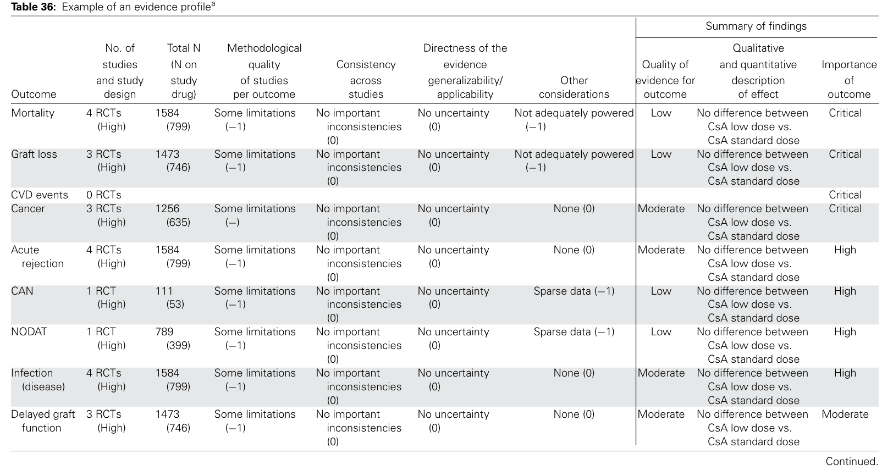

- **Part 2 (Page 134)**:
  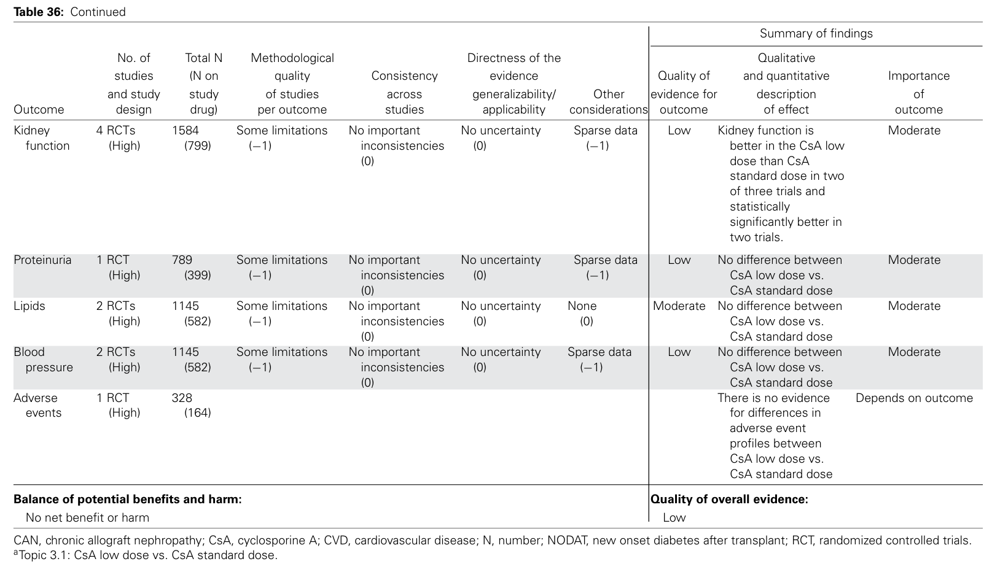

#### Table Data (CSV: [Table_36.csv](Table_36.csv))

```markdown
| Table Text (OCR) |
| :--- |
| images/f2953c2c959a01e9b1da31fe1939c4cc773d136df3ce1e0689f82bb19484c444.jpg Table 36: Example of an evidence profilea <table><tr><td></td><td>No. of studies and study design</td><td>Total N (N on study drug)</td><td>Methodological quality of studies per outcome</td><td>Consistency across studies</td><td>Directness of the evidence generalizability/ applicability</td><td>Other</td><td>Quality of evidence for</td><td>Summary of findings Qualitative and quantitative description of effect</td><td>Importance of</td></tr><tr><td>Mortality</td><td>4 RCTs (High)</td><td>1584 (799)</td><td>Some limitations (-1)</td><td>No important inconsistencies (0)</td><td>No uncertainty (0)</td><td>Not adequately powered (-1)</td><td>Low</td><td>No difference between CsA low dose vs. CsA standard dose</td><td>Critical</td></tr><tr><td>Graft loss</td><td>3 RCTs (High)</td><td>1473 (746)</td><td>Some limitations (-1)</td><td>No important inconsistencies</td><td>No uncertainty (0)</td><td>Not adequately powered (-1)</td><td>Low</td><td>No difference between CsA low dose vs. CsA standard dose</td><td>Critical</td></tr><tr><td>CVD events Cancer</td><td>0 RCTs 3 RCTs</td><td>1256</td><td>Some limitations</td><td>(0) No important</td><td>No uncertainty</td><td>None (0)</td><td></td><td>Moderate No difference between</td><td>Critical Critical</td></tr><tr><td></td><td>(High)</td><td>(635)</td><td>(-)</td><td>inconsistencies (0) No important</td><td>(0)</td><td></td><td></td><td>CsA low dose vs. CsA standard dose Moderate No difference between</td><td></td></tr><tr><td>Acute rejection</td><td>4 RCTs (High)</td><td>1584 (799)</td><td>Some limitations (-1)</td><td>inconsistencies (0)</td><td>No uncertainty (0)</td><td>None (0)</td><td></td><td>CsA low dose vs. CsA standard dose No difference between</td><td>High</td></tr><tr><td>CAN</td><td>1 RCT (High)</td><td>111 (53)</td><td>Some limitations (-1)</td><td>No important inconsistencies (0) No important</td><td>No uncertainty (0)</td><td>Sparse data (—1)</td><td>Low</td><td>CsA low dose vs. CsA standard dose No difference between</td><td>High</td></tr><tr><td>NODAT</td><td>1 RCT (High)</td><td>789 (399)</td><td>Some limitations (-1)</td><td>inconsistencies (0) No important</td><td>No uncertainty (0)</td><td>Sparse data (—1)</td><td>Low</td><td>CsA low dose vs. CsA standard dose Moderate No difference between</td><td>High High</td></tr><tr><td>Infection (disease)</td><td>4 RCTs (High)</td><td>1584 (799)</td><td>Some limitations (-1)</td><td>inconsistencies (0) No important</td><td>(0)</td><td>None (0)</td><td></td><td>CsA low dose vs. CsA standard dose No difference between</td><td>Moderate</td></tr><tr><td>Delayed graft 3 RCTs function</td><td>(High)</td><td>1473 (746)</td><td>Some limitations (-1)</td><td>inconsistencies (0)</td><td>No uncertainty (0)</td><td>None (0)</td><td>Moderate</td><td>CsA low dose vs. CsA standard dose</td><td></td></tr><tr><td rowspan="2">lable 3b: Continued No. of studies (N on and study study</td><td rowspan="2">Total N</td><td rowspan="2">Methodological quality</td><td rowspan="2">Consistency</td><td rowspan="2">Directness of the</td><td rowspan="2">evidence</td><td colspan="3">Summary of findings</td></tr><tr><td>Quality of evidence for considerations outcome</td><td>Qualitative and quantitative description of effect</td><td>Importance of outcome</td></tr><tr><td>Outcome Kidney function</td><td>design 4 RCTs (High)</td><td>drug) 1584 (799)</td><td>per outcome Some limitations (-1)</td><td>studies No important inconsistencies (0)</td><td>applicability No uncertainty (0)</td><td>Sparse data (-1)</td><td>Low Kidney function is</td><td>better in the CsA low dose than CsA standard dose in two of three trials and statistically</td><td>Moderate</td></tr><tr><td>Proteinuria</td><td>1 RCT (High)</td><td>789 (399)</td><td>Some limitations (-1)</td><td>No important inconsistencies (0)</td><td>No uncertainty (0)</td><td>Sparse data (-1)</td><td>Low</td><td>significantly better in two trials. No difference between CsA low dose vs.</td><td>Moderate</td></tr><tr><td>Lipids</td><td>2 RCTs (High)</td><td>1145 (582)</td><td>Some limitations (-1)</td><td>No important inconsistencies (0)</td><td>No uncertainty (0)</td><td>None (0)</td><td></td><td>CsA standard dose Moderate No difference between CsA low dose vs. CsA standard dose</td><td>Moderate</td></tr><tr><td>Blood pressure</td><td>2 RCTs (High)</td><td>1145 (582)</td><td>Some limitations (-1)</td><td>No important inconsistencies (0)</td><td>No uncertainty (0)</td><td>Sparse data (-1)</td><td>Low</td><td>No difference between CsA low dose vs. CsA standard dose</td><td>Moderate</td></tr><tr><td>Adverse events</td><td>1 RCT (High)</td><td>328 (164)</td><td></td><td></td><td></td><td></td><td></td><td>There is no evidence for differences in adverse event profiles between CsA low dose vs. CsA standard dose</td><td>Depends on outcome</td></tr><tr><td colspan="8">Balance of potential benefits and harm: No net benefit or harm</td><td colspan="2">Quality of overall evidence: Low</td></tr><tr><td colspan="8">CAN, chronic allograft nephropathy; CsA, cyclosporine A; CVD, cardiovascular disease; N, number; NODAT, new onset diabetes after transplant; RCT, randomized controlled trials.</td></tr></table> complex_table images/ simple_table |
```

Table 36 Example of an evidence profile

---

### Table_37

#### Table Image

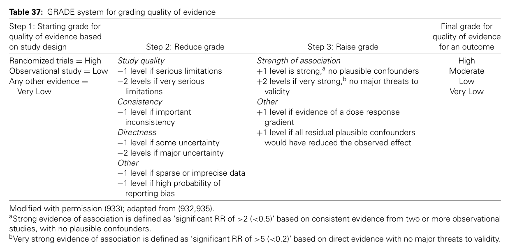

#### Table Data (CSV: [Table_37.csv](Table_37.csv))

```markdown
| Table Text (OCR) |
| :--- |
| Table 37: GRADE system for grading quality of evidence Step 1: Starting grade for quality of evidence based on study design    Step 3: Raise grade  Final grade for quality of evidence for an outcome    Randomized trials = High Observational study = Low Any other evidence = Very Low  Step 2: Reduce grade Study quality  Strength of association  High    —1 level if serious limitations —2 levels if very serious  +1 level is strong,ª no plausible confounders +2 levels if very strong,b no major threats to  Moderate    limitations  validity  Low Very Low    Consistency —1 level if important inconsistency  Other +1 level if evidence of a dose response      Directness —1 level if some uncertainty —2 levels if major uncertainty  gradient +1 level if all residual plausible confounders would have reduced the observed effect Modified with permission (933); adapted from (932,935). <sup>a</sup>Strong evidence of association is defined as ‘significant RR of > 2 \ ( < 0 . 5 ) ^ { \prime } based on consistent evidence from two or more observationa studies, with no plausible confounders. <sup>b</sup>Very strong evidence of association is defined as ‘significant RR of > 5 \ : ( < 0 . 2 ) ^ { \prime } based on direct evidence with no major threats to validity. |
```

Table 37 GRADE system for grading quality of evidence

---

### Table_38

#### Table Image

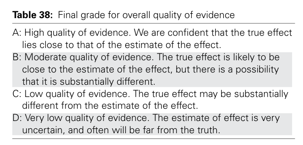

#### Table Data (CSV: [Table_38.csv](Table_38.csv))

```markdown
| Table Text (OCR) |
| :--- |
| Table 38: Final grade for overall quality of evidence A: High quality of evidence. We are confident that the true effect lies close to that of the estimate of the effect.    B: Moderate quality of evidence. The true effect is likely to be close to the estimate of the effect, but there is a possibility that it is substantially different.    C: Low quality of evidence. The true effect may be substantially different from the estimate of the effect.    D: Very low quality of evidence. The estimate of effect is very uncertain, and often will be far from the truth. |
```

Table 38 Final grade for overall quality of evidence

---

### Table_39

#### Table Image

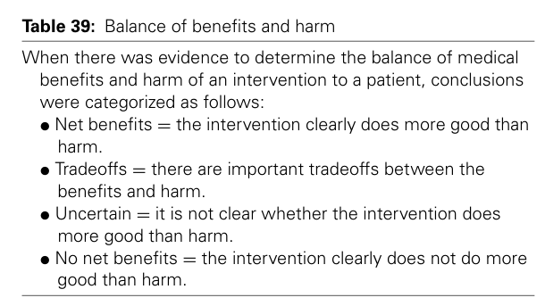

#### Table Data (CSV: [Table_39.csv](Table_39.csv))

```markdown
| Table Text (OCR) |
| :--- |
| Table 39: Balance of benefits and harm When there was evidence to determine the balance of medical benefits and harm of an intervention to a patient, conclusions were categorized as follows: Net benefits the intervention clearly does more good than harm. Tradeoffs there are important tradeoffs between the benefits and harm. Uncertain it is not clear whether the intervention does more good than harm. No net benefits the intervention clearly does not do more good than harm. |
```

Table 39 Balance of benefits and harm

---

### Table_40

#### Table Image

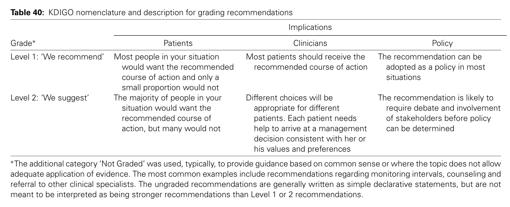

#### Table Data (CSV: [Table_40.csv](Table_40.csv))

```markdown
| Table Text (OCR) |
| :--- |
| Table 40: KDIGO nomenclature and description for grading recommendations Grade*  Implications    Patients  Clinicians  Policy    Level 1: 'We recommend' Level 2: 'We suggest'  Most people in your situation would want the recommended course of action and only a small proportion would not The majority of people in your  Most patients should receive the recommended course of action Different choices will be  The recommendation can be adopted as a policy in most situations The recommendation is likely to ∗The additional category ‘Not Graded’ was used, typically, to provide guidance based on common sense or where the topic does not allow adequate application of evidence. The most common examples include recommendations regarding monitoring intervals, counseling and referral to other clinical specialists. The ungraded recommendations are generally written as simple declarative statements, but are not meant to be interpreted as being stronger recommendations than Level 1 or 2 recommendations. |
```

Table 40 KDIGO nomenclature and description for grading recommendations

---

### Table_41

#### Table Image

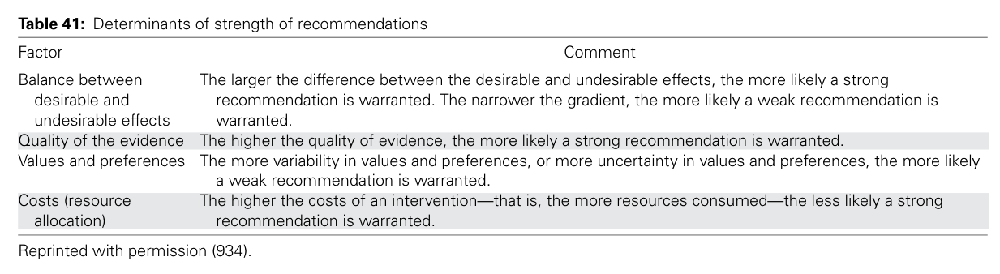

#### Table Data (CSV: [Table_41.csv](Table_41.csv))

```markdown
| Table Text (OCR) |
| :--- |
| Table 41: Determinants of strength of recommendations Factor  Comment    Balance between desirable and  The larger the difference between the desirable and undesirable effects, the more likely a strong    undesirable effects  recommendation is warranted. The narrower the gradient, the more likely a weak recommendation is warranted.    Quality of the evidence Values and preferences  The higher the quality of evidence, the more likely a strong recommendation is warranted.    Costs (resource  The more variability in values and preferences, or more uncertainty in values and preferences, the more likely a weak recommendation is warranted.    allocation)  The higher the costs of an intervention—that is, the more resources consumed—the less likely a strong recommendation is warranted. Reprinted with permission (934). |
```

Table 41 Determinants of strength of recommendations

---
