# KDIGO-2012-Anemia-Guideline-English - Figures and Tables Index

This document lists all figures and tables extracted from `KDIGO-2012-Anemia-Guideline-English.pdf`.

## Table of Contents
- [Figures](#figures)
- [Tables](#tables)

---

## Figures

### Fig_1

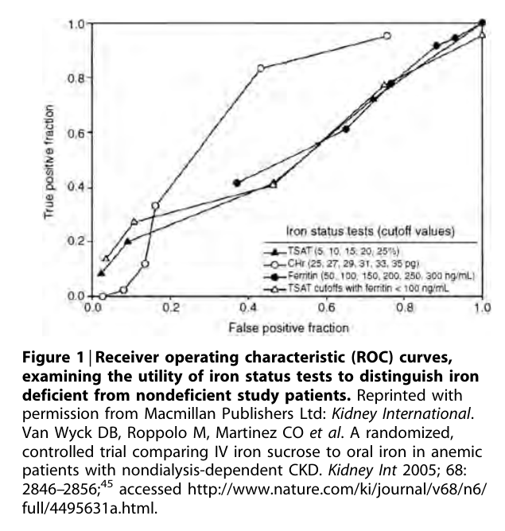

Figure 1 Receiver operating characteristic (ROC) curves, examining the utility of iron status tests to distinguish iron deficient from nondeficient study patients

---

### Fig_2

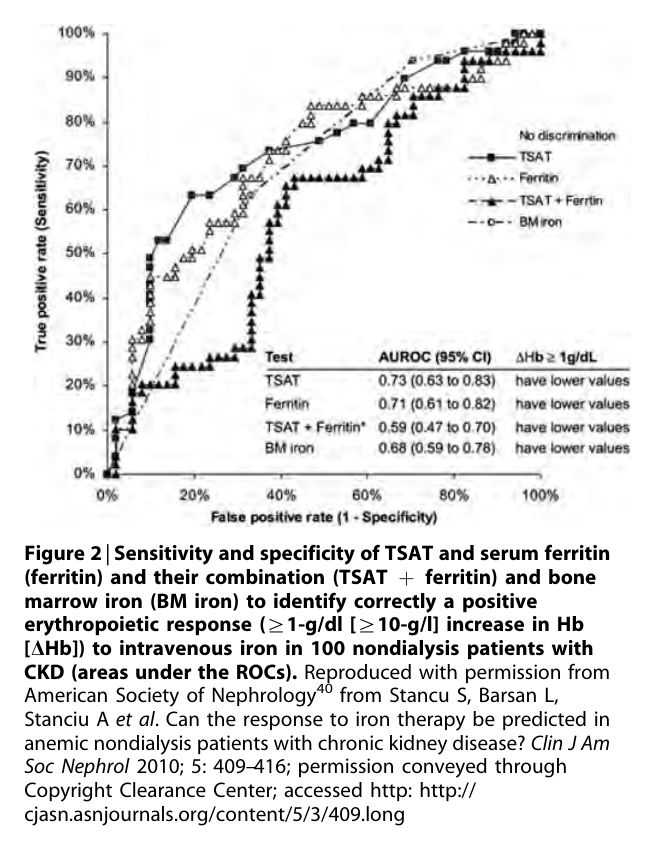

Figure 2 Sensitivity and specificity of TSAT and serum ferritin and their combination (TSAT + ferritin) and bone marrow iron (BM iron) to identify correctly a positive erythropoietic response (Z1-g/dl [Z10-g/l] increase in Hb [DHb]) to intravenous iron in 100 nondialysis patients with CKD (areas under the ROCs)

---

### Fig_3

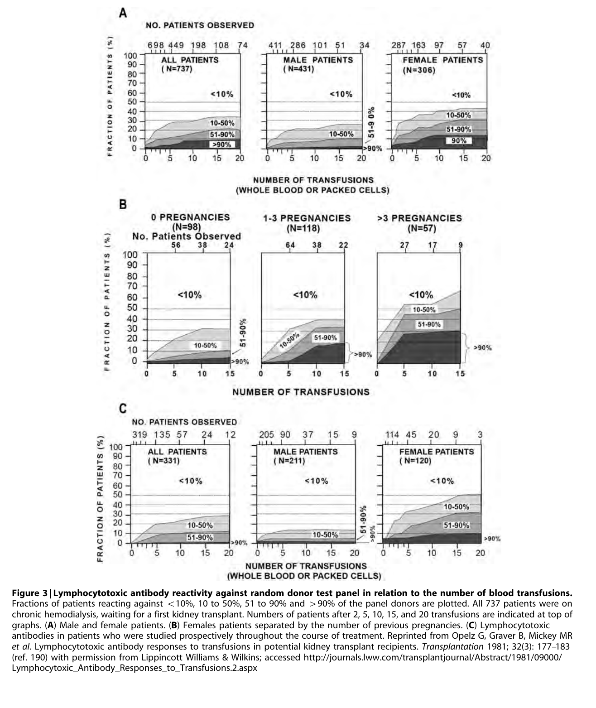

Figure 3 Lymphocytotoxic antibody reactivity against random donor test panel in relation to the number of blood transfusions

---

### Fig_4

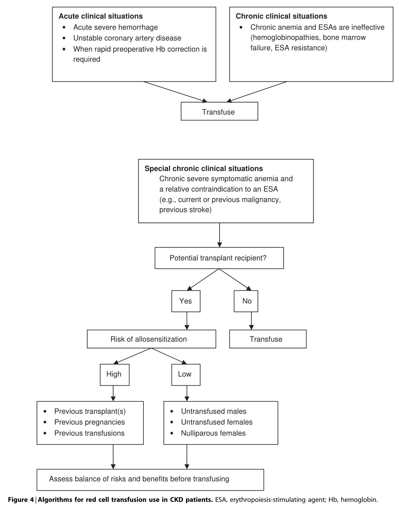

Figure 4 Algorithms for red cell transfusion use in CKD patients

---

## Tables

### Table_1

#### Table Image

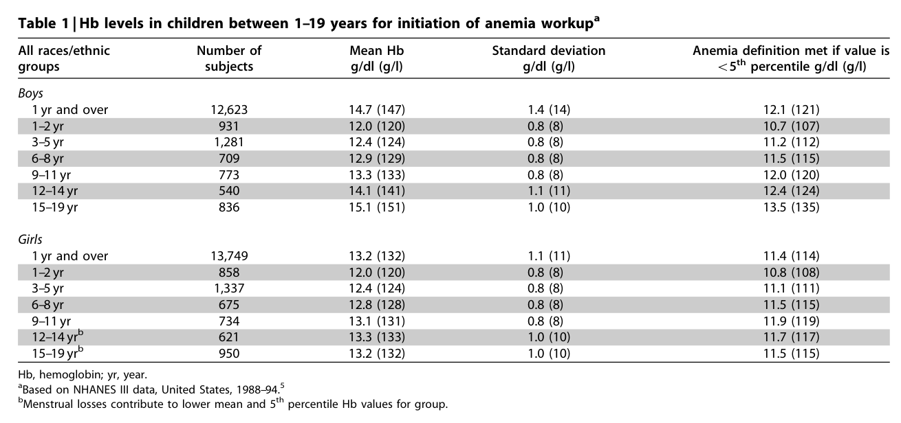

#### Table Data (CSV: [Table_1.csv](Table_1.csv))

```markdown
| Table Text (OCR) |
| :--- |
| Table 1 \| Hb levels in children between 1–19 years for initiation of anemia workup<sup>a</sup> All races/ethnic groups  Number of subjects  Mean Hb g/dl (g/l)  Standard deviation g/dl (g/l)  Anemia definition met if value is  < 5 ^ { \mathrm { t h } }  percentile g/dl (g/l)    Boys            1 yr and over  12,623  14.7 (147)  1.4 (14)  12.1 (121)    1-2yr  931  12.0 (120)  0.8 (8)  10.7 (107)    3-5 yr  1,281  12.4 (124)  0.8 (8)  11.2 (112)    6-8 yr  709  12.9 (129)  0.8 (8)  11.5 (115)    9–11 yr  773  13.3 (133)  0.8 (8)  12.0 (120)    12-14 yr  540  14.1 (141)  1.1 (11)  12.4 (124)    15-19 yr  836  15.1 (151)  1.0 (10)  13.5 (135)    Girls            1 yr and over  13,749  13.2 (132)  1.1 (11)  11.4 (114)    1-2yr  858  12.0 (120)  0.8 (8)  10.8 (108)    3-5 yr  1,337  12.4 (124)  0.8 (8)  11.1 (111)    6-8 yr  675  12.8 (128)  0.8 (8)  11.5 (115)    9-11 yr  734  13.1 (131)  0.8 (8)  11.9 (119)    12-14yrb  621  13.3 (133)  1.0 (10)  11.7 (117)    15-19 yrb  950  13.2 (132)  1.0 (10)  11.5 (115) Hb, hemoglobin; yr, year. <sup>a</sup>Based on NHANES III data, United States, 1988–94.<sup>5</sup> <sup>b</sup>Menstrual losses contribute to lower mean and 5<sup>th</sup> percentile Hb values for group. |
```

Table 1 Hb levels in children between 1–19 years for initiation of anemia workup 289

---

### Table_2

#### Table Image

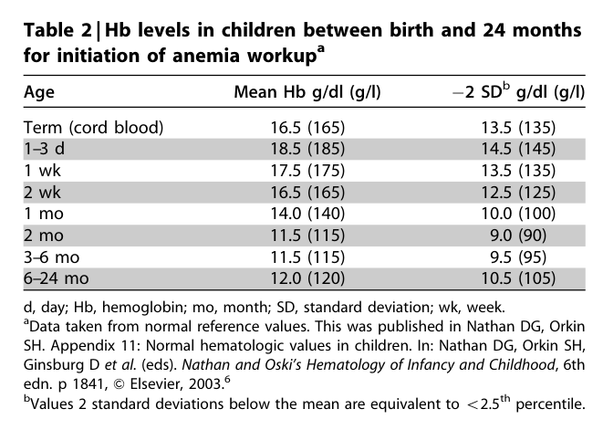

#### Table Data (CSV: [Table_2.csv](Table_2.csv))

```markdown
| Table Text (OCR) |
| :--- |
| Table 2 \| Hb levels in children between birth and 24 months for initiation of anemia workup<sup>a</sup> Age  Mean Hb g/dl (g/l)  −2 SDb g/dl (g/l)    Term (cord blood)  16.5 (165)  13.5 (135)    1-3 d  18.5 (185)  14.5 (145)    1wk  17.5 (175)  13.5 (135)    2 wk  16.5 (165)  12.5 (125)    1 mo  14.0 (140)  10.0 (100)    2 mo  11.5 (115)  9.0 (90)    3-6 mo  11.5 (115)  9.5 (95)    6–24 mo  12.0 (120)  10.5 (105) d, day; Hb, hemoglobin; mo, month; SD, standard deviation; wk, week. <sup>a</sup>Data taken from normal reference values. This was published in Nathan DG, Orkin SH. Appendix 11: Normal hematologic values in children. In: Nathan DG, Orkin SH, Ginsburg D et al. (eds). Nathan and Oski’s Hematology of Infancy and Childhood, 6th edn. p 1841, <sup>&</sup> Elsevier, 2003.<sup>6</sup> <sup>b</sup>Values 2 standard deviations below the mean are equivalent to < 2 . 5 ^ { \mathrm { t h } } percentile. |
```

Table 2 Hb levels in children between birth and 24 months for initiation of anemia workup 307

---

### Table_3

#### Table Image

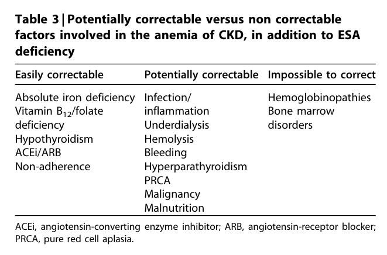

#### Table Data (CSV: [Table_3.csv](Table_3.csv))

```markdown
| Table Text (OCR) |
| :--- |
| Table 3 \| Potentially correctable versus non correctable factors involved in the anemia of CKD, in addition to ESA deficiency Easily correctable  Potentially correctable Impossible to correct      Absolute iron deficiency  Infection/  Hemoglobinopathies    Vitamin B1₂/folate  inflammation  Bone marrow    deficiency  Underdialysis  disorders    Hypothyroidism  Hemolysis      ACEi/ARB  Bleeding      Non-adherence  Hyperparathyroidism PRCA        Malignancy                Malnutrition ACEi, angiotensin-converting enzyme inhibitor; ARB, angiotensin-receptor blocker; PRCA, pure red cell aplasia. |
```

Table 3 Potentially correctable versus non correctable factors involved in the anemia of CKD, in addition to ESA deficiency 308

---

### Table_4

#### Table Image

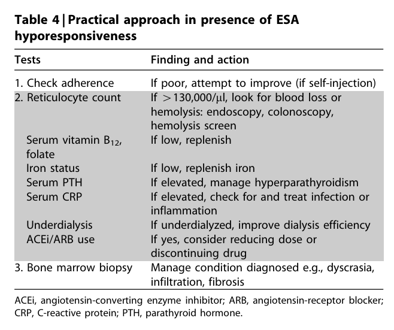

#### Table Data (CSV: [Table_4.csv](Table_4.csv))

```markdown
| Table Text (OCR) |
| :--- |
| Table 4 \| Practical approach in presence of ESA hyporesponsiveness Tests  Finding and action    1. Check adherence  If poor, attempt to improve (if self-injection)    2. Reticulocyte count  If > 130,000/μl, look for blood loss or hemolysis: endoscopy, colonoscopy,    Serum vitamin  \mathsf { B } _ { 1 2 } ,   hemolysis screen If low, replenish    folate Iron status  If low, replenish iron    Serum PTH  If elevated, manage hyperparathyroidism    Serum CRP  If elevated, check for and treat infection or inflammation    Underdialysis  If underdialyzed, improve dialysis efficiency    ACEi/ARB use  If yes, consider reducing dose or discontinuing drug    3. Bone marrow biopsy  Manage condition diagnosed e.g., dyscrasia, infiltration, fibrosis ACEi, angiotensin-converting enzyme inhibitor; ARB, angiotensin-receptor blocker; CRP, C-reactive protein; PTH, parathyroid hormone. |
```

Table 4 Practical approach in presence of ESA hyporesponsiveness 312

---

### Table_5

#### Table Image

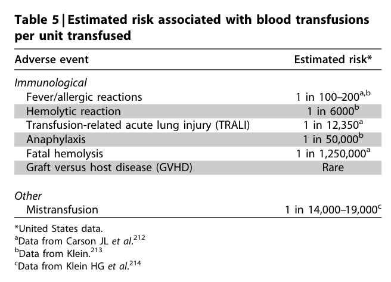

#### Table Data (CSV: [Table_5.csv](Table_5.csv))

```markdown
| Table Text (OCR) |
| :--- |
| Table 5 \| Estimated risk associated with blood transfusions per unit transfused Adverse event  Estimated risk*    Immunological      Fever/allergic reactions  1 in 100–200a,b    Hemolytic reaction  1 in 6000b    Transfusion-related acute lung injury (TRALI)  1 in 12,350ª    Anaphylaxis  1 in 50,000b    Fatal hemolysis  1 in 1,250,000ª    Graft versus host disease (GVHD)  Rare *United States data. <sup>a</sup>Data from Carson JL et a / . ^ { 2 1 2 } <sup>b</sup>Data from Klein.<sup>213</sup> <sup>c</sup>Data from Klein HG et a / . ^ { 2 1 4 } |
```

Table 5 Estimated risk associated with blood transfusions per unit transfused 312

---

### Table_6

#### Table Image

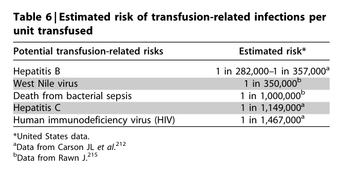

#### Table Data (CSV: [Table_6.csv](Table_6.csv))

```markdown
| Table Text (OCR) |
| :--- |
| Table 6 \| Estimated risk of transfusion-related infections per unit transfused Potential transfusion-related risks  Estimated risk*    Hepatitis B  1 in 282,000–1 in 357,000ª    West Nile virus  1 in 350,000b    Death from bacterial sepsis  1 in 1,000,000b    Hepatitis C  1 in 1,149,000ª    Human immunodeficiency virus (HIV)  1 in 1,467,000ª *United States data. <sup>a</sup>Data from Carson \mathbb { L } e t a l . ^ { 2 1 2 } <sup>b</sup>Data from Rawn J.<sup>215</sup> |
```

Table 6 Estimated risk of transfusion-related infections per unit transfused 314

---

### Table_7

#### Table Image

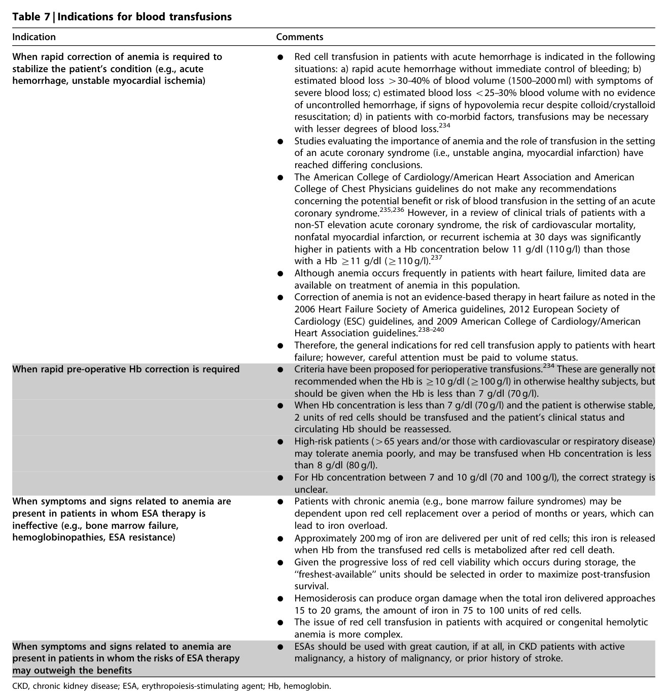

#### Table Data (CSV: [Table_7.csv](Table_7.csv))

```markdown
| Table Text (OCR) |
| :--- |
| Table 7 \| Indications for blood transfusions Indication  Comments    When rapid correction of anemia is required to stabilize the patient's condition (e.g., acute hemorrhage, unstable myocardial ischemia)  Red cell transfusion in patients with acute hemorrhage is indicated in the following situations: a) rapid acute hemorrhage without immediate control of bleeding; b) estimated blood loss >30-40% of blood volume (1500–2000 ml) with symptoms of severe blood loss; c) estimated blood loss <25–30% blood volume with no evidence    of uncontrolled hemorrhage, if signs of hypovolemia recur despite colloid/crystalloid resuscitation; d) in patients with co-morbid factors, transfusions may be necessary with lesser degrees of blood loss.234 Studies evaluating the importance of anemia and the role of transfusion in the setting    of an acute coronary syndrome (i.e., unstable angina, myocardial infarction) have reached differing conclusions. The American College of Cardiology/American Heart Association and American    College of Chest Physicians guidelines do not make any recommendations concerning the potential benefit or risk of blood transfusion in the setting of an acute coronary syndrome.235,236 However, in a review of clinical trials of patients with a non-ST elevation acute coronary syndrome, the risk of cardiovascular mortality,    nonfatal myocardial infarction, or recurrent ischemia at 30 days was significantly higher in patients with a Hb concentration below 11 g/dl (110 g/l) than those with a Hb ≥11 g/dl (≥110 g/l).237 Although anemia occurs frequently in patients with heart failure, limited data are    available on treatment of anemia in this population. Correction of anemia is not an evidence-based therapy in heart failure as noted in the 2006 Heart Failure Society of America guidelines, 2012 European Society of    When rapid pre-operative Hb correction is required  Cardiology (ESC) guidelines, and 2009 American College of Cardiology/American Heart Association guidelines.238-240 Therefore, the general indications for red cell transfusion apply to patients with heart    failure; however, careful attention must be paid to volume status. Criteria have been proposed for perioperative transfusions.234 These are generally not    recommended when the Hb is ≥ 10 g/dl (≥ 100 g/l) in otherwise healthy subjects, but should be given when the Hb is less than 7 g/dl (70 g/l).    When Hb concentration is less than 7 g/dl (70 g/l) and the patient is otherwise stable, 2 units of red cells should be transfused and the patient's clinical status and circulating Hb should be reassessed.    High-risk patients (>65 years and/or those with cardiovascular or respiratory disease) may tolerate anemia poorly, and may be transfused when Hb concentration is less than 8 g/dl (80 g/l).    When symptoms and signs related to anemia are present in patients in whom ESA therapy is ineffective (e.g., bone marrow failure,  For Hb concentration between 7 and 10 g/dl (70 and 100 g/l), the correct strategy is unclear.    dependent upon red cell replacement over a period of months or years, which can lead to iron overload.    Approximately 200 mg of iron are delivered per unit of red cells; this iron is released when Hb from the transfused red cells is metabolized after red cell death. Given the progressive loss of red cell viability which occurs during storage, the    “freshest-available" units should be selected in order to maximize post-transfusion survival. Hemosiderosis can produce organ damage when the total iron delivered approaches    15 to 20 grams, the amount of iron in 75 to 100 units of red cells. The issue of red cell transfusion in patients with acquired or congenital hemolytic    anemia is more complex. When symptoms and signs related to anemia are    present in patients in whom the risks of ESA therapy may outweigh the benefits  ESAs should be used with great caution, if at all, in CKD patients with active malignancy, a history of malignancy, or prior history of stroke. CKD, chronic kidney disease; ESA, erythropoiesis-stimulating agent; Hb, hemoglobin. |
```

Table 7 Indications for blood transfusions 318

---

### Table_8

#### Table Image

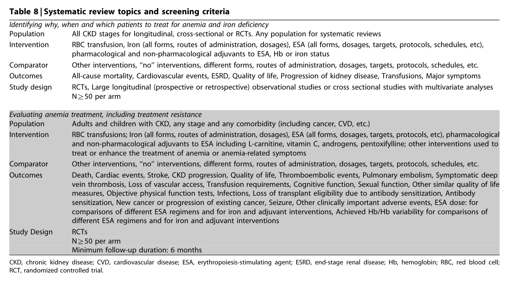

#### Table Data (CSV: [Table_8.csv](Table_8.csv))

```markdown
| Table Text (OCR) |
| :--- |
| Table 8 \| Systematic review topics and screening criteria Identifying why, when and which patients to treat for anemia and iron deficiency    Population  All CKD stages for longitudinal, cross-sectional or RCTs. Any population for systematic reviews    Intervention  RBC transfusion, Iron (all forms, routes of administration, dosages), ESA (all forms, dosages, targets, protocols, schedules, etc), pharmacological and non-pharmacological adjuvants to ESA, Hb or iron status    Comparator  Other interventions, "no" interventions, different forms, routes of administration, dosages, targets, protocols, schedules, etc.    Outcomes Study design  All-cause mortality, Cardiovascular events, ESRD, Quality of life, Progression of kidney disease, Transfusions, Major symptoms RCTs, Large longitudinal (prospective or retrospective) observational studies or cross sectional studies with multivariate analyses    Evaluating anemia treatment, including treatment resistance  N≥50 per arm    Adults and children with CKD, any stage and any comorbidity (including cancer, CVD, etc.)    Population Intervention  RBC transfusions; Iron (all forms, routes of administration, dosages), ESA (all forms, dosages, targets, protocols, etc), pharmacological and non-pharmacological adjuvants to ESA including L-carnitine, vitamin C, androgens, pentoxifylline; other interventions used to      treat or enhance the treatment of anemia or anemia-related symptoms    Comparator Outcomes  Other interventions, "no" interventions, different forms, routes of administration, dosages, targets, protocols, schedules, etc. Death, Cardiac events, Stroke, CKD progression, Quality of life, Thromboembolic events, Pulmonary embolism, Symptomatic deep vein thrombosis, Loss of vascular access, Transfusion requirements, Cognitive function, Sexual function, Other similar quality of life      measures, Objective physical function tests, Infections, Loss of transplant eligibility due to antibody sensitization, Antibody sensitization, New cancer or progression of existing cancer, Seizure, Other clinically important adverse events, ESA dose: for comparisons of different ESA regimens and for iron and adjuvant interventions, Achieved Hb/Hb variability for comparisons of    Study Design  different ESA regimens and for iron and adjuvant interventions RCTs N≥50 per arm CKD, chronic kidney disease; CVD, cardiovascular disease; ESA, erythropoiesis-stimulating agent; ESRD, end-stage renal disease; Hb, hemoglobin; RBC, red blood cell; RCT, randomized controlled trial. |
```

Table 8 Systematic review topics and screening criteria 318

---

### Table_9

#### Table Image

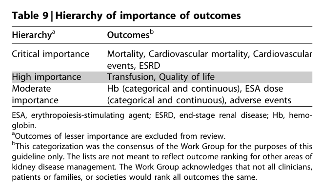

#### Table Data (CSV: [Table_9.csv](Table_9.csv))

```markdown
| Table Text (OCR) |
| :--- |
| Table 9 \| Hierarchy of importance of outcomes Hierarchyª  Outcomesb    Critical importance  Mortality, Cardiovascular mortality, Cardiovascular events, ESRD    High importance  Transfusion, Quality of life    Moderate importance  Hb (categorical and continuous), ESA dose (categorical and continuous), adverse events ESA, erythropoiesis-stimulating agent; ESRD, end-stage renal disease; Hb, hemo- globin. <sup>a</sup>Outcomes of lesser importance are excluded from review. <sup>b</sup>This categorization was the consensus of the Work Group for the purposes of this guideline only. The lists are not meant to reflect outcome ranking for other areas of kidney disease management. The Work Group acknowledges that not all clinicians, patients or families, or societies would rank all outcomes the same. |
```

Table 9 Hierarchy of importance of outcomes 319

---

### Table_10

#### Table Image

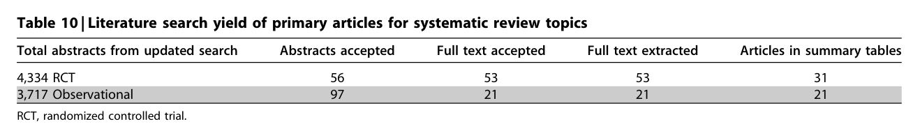

#### Table Data (CSV: [Table_10.csv](Table_10.csv))

```markdown
| Table Text (OCR) |
| :--- |
| Table 10 \| Literature search yield of primary articles for systematic review topics Total abstracts from updated search  Abstracts accepted  Full text accepted  Full text extracted  Articles in summary tables    4,334 RCT  56  53  53  31    3,717 Observational  97  21  21  21 RCT, randomized controlled trial. |
```

Table 10 Literature search yield of primary articles for systematic review topics 319

---

### Table_11

#### Table Image

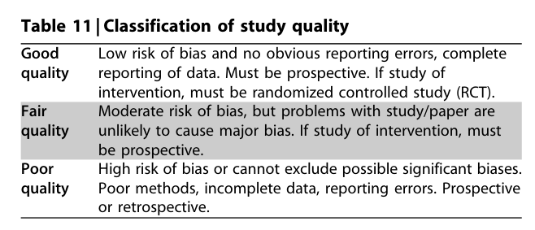

#### Table Data (CSV: [Table_11.csv](Table_11.csv))

```markdown
| Table Text (OCR) |
| :--- |
| Table 11 \| Classification of study quality Good quality  Low risk of bias and no obvious reporting errors, complete reporting of data. Must be prospective. If study of intervention, must be randomized controlled study (RCT).    Fair quality  Moderate risk of bias, but problems with study/paper are unlikely to cause major bias. If study of intervention, must be prospective.    Poor quality  High risk of bias or cannot exclude possible significant biases. Poor methods, incomplete data, reporting errors. Prospective or retrospective. |
```

Table 11 Classification of study quality 320

---

### Table_12

#### Table Image

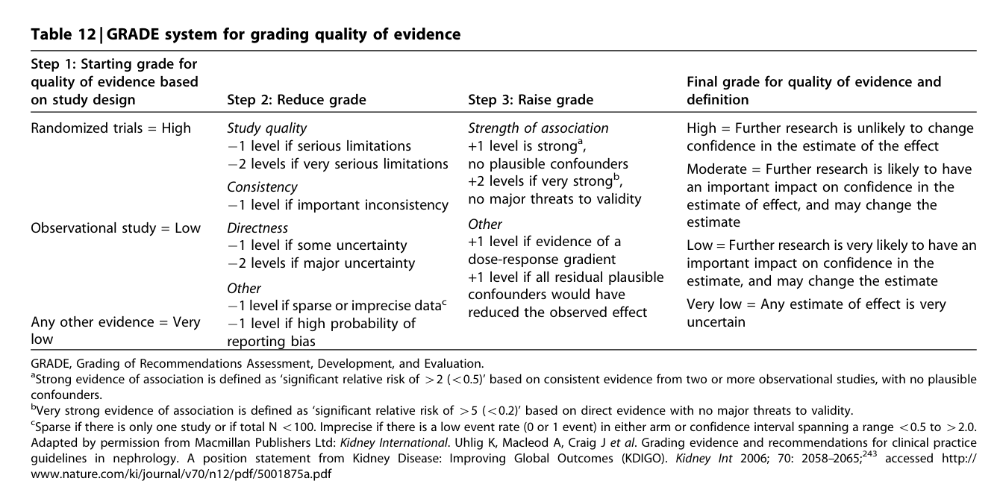

#### Table Data (CSV: [Table_12.csv](Table_12.csv))

```markdown
| Table Text (OCR) |
| :--- |
| Table 12 \| GRADE system for grading quality of evidence Step 1: Starting grade for quality of evidence based  Final grade for quality of evidence and definition    on study design Randomized trials = High  Step 2: Reduce grade Study quality  Step 3: Raise grade Strength of association      —1 level if serious limitations —2 levels if very serious limitations  +1 level is strongª, no plausible confounders  High = Further research is unlikely to change confidence in the estimate of the effect    Consistency —1 level if important inconsistency  +2 ievels if very strongb, no major threats to validity  Moderate = Further research is likely to have an important impact on confidence in the estimate of effect, and may change the    Directness —1 level if some uncertainty  Other +1 level if evidence of a  estimate Low = Further research is very likely to have an      —2 levels if major uncertainty Other  dose-response gradient +1 level if all residual plausible  important impact on confidence in the estimate, and may change the estimate    —1 level if sparse or imprecise datac  confounders would have reduced the observed effect  Very low = Any estimate of effect is very    Any other evidence = Very low  —1 level if high probability of reporting bias    uncertain GRADE, Grading of Recommendations Assessment, Development, and Evaluation. |
```

Table 12 GRADE system for grading quality of evidence 320

---

### Table_13

#### Table Image

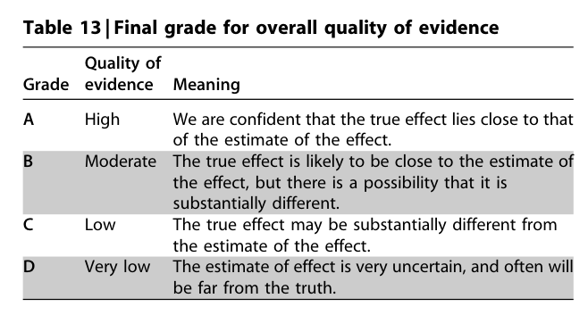

#### Table Data (CSV: [Table_13.csv](Table_13.csv))

```markdown
| Table Text (OCR) |
| :--- |
| Table 13 \| Final grade for overall quality of evidence Grade  Quality of evidence  Meaning    A  High  We are confident that the true effect lies close to that of the estimate of the effect.    B  Moderate  The true effect is likely to be close to the estimate of the effect, but there is a possibility that it is substantially different.    C  Low  The true effect may be substantially different from the estimate of the effect.    D  Very low  The estimate of effect is very uncertain, and often will be far from the truth. |
```

Table 13 Final grade for overall quality of evidence 321

---

### Table_14

#### Table Image

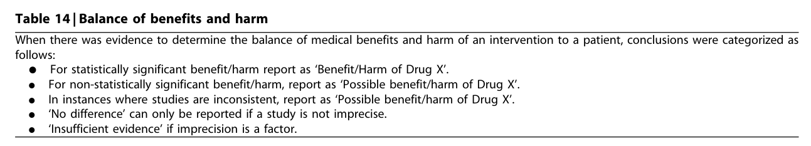

#### Table Data (CSV: [Table_14.csv](Table_14.csv))

```markdown
| Table Text (OCR) |
| :--- |
| Table 14 \| Balance of benefits and harm When there was evidence to determine the balance of medical benefits and harm of an intervention to a patient, conclusions were categorized as follows: K For statistically significant benefit/harm report as ‘Benefit/Harm of Drug X’. K For non-statistically significant benefit/harm, report as ‘Possible benefit/harm of Drug X’. K In instances where studies are inconsistent, report as ‘Possible benefit/harm of Drug X’. K ‘No difference’ can only be reported if a study is not imprecise. K ‘Insufficient evidence’ if imprecision is a factor. |
```

Table 14 Balance of benefits and harm 321

---

### Table_15

#### Table Image

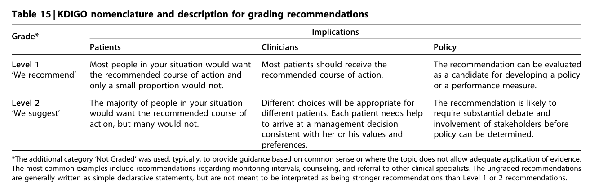

#### Table Data (CSV: [Table_15.csv](Table_15.csv))

```markdown
| Table Text (OCR) |
| :--- |
| Table 15 \| KDIGO nomenclature and description for grading recommendations Grade*  Implications    Patients  Clinicians  Policy    Level 1 'We recommend'  Most people in your situation would want the recommended course of action and  Most patients should receive the recommended course of action.  The recommendation can be evaluated as a candidate for developing a policy    Level 2  only a small proportion would not. The majority of people in your situation  Different choices will be appropriate for different patients. Each patient needs help  or a performance measure. The recommendation is likely to require substantial debate and    'We suggest'  would want the recommended course of action, but many would not.  to arrive at a management decision consistent with her or his values and preferences.  involvement of stakeholders before policy can be determined. *The additional category ‘Not Graded’ was used, typically, to provide guidance based on common sense or where the topic does not allow adequate application of evidence. The most common examples include recommendations regarding monitoring intervals, counseling, and referral to other clinical specialists. The ungraded recommendations are generally written as simple declarative statements, but are not meant to be interpreted as being stronger recommendations than Level 1 or 2 recommendations. |
```

Table 15 KDIGO nomenclature and description for grading recommendations 321

---

### Table_16

#### Table Image

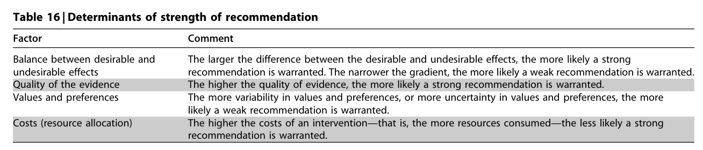

#### Table Data (CSV: [Table_16.csv](Table_16.csv))

```markdown
| Table Text (OCR) |
| :--- |
| Table 16 \| Determinants of strength of recommendation Factor  Comment    Balance between desirable and  The larger the difference between the desirable and undesirable effects, the more likely a strong    undesirable effects Quality of the evidence  recommendation is warranted. The narrower the gradient, the more likely a weak recommendation is warranted. The higher the quality of evidence, the more likely a strong recommendation is warranted.    Values and preferences  The more variability in values and preferences, or more uncertainty in values and preferences, the more    Costs (resource allocation)  likely a weak recommendation is warranted. The higher the costs of an intervention—that is, the more resources consumed—the less likely a strong      recommendation is warranted. |
```

Table 16 Determinants of strength of recommendation 322

---

### Table_17

#### Table Images (2 Parts)

- **Part 1 (Page 51)**:
  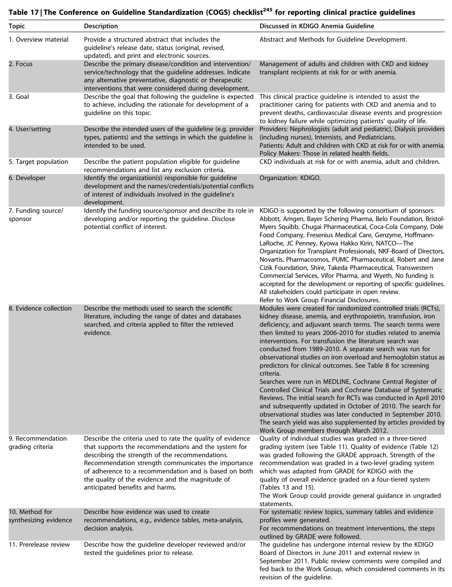

- **Part 2 (Page 52)**:
  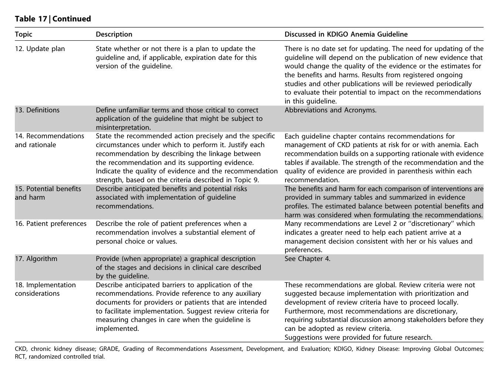

#### Table Data (CSV: [Table_17.csv](Table_17.csv))

```markdown
| Table Text (OCR) |
| :--- |
| images/6fa9906c4853f0c6787234b48860bc1cbcba164776636e9c24aa298627bb94f8.jpg Table 17 \| The Conference on Guideline Standardization (COGS) checklist<sup>245</sup> for reporting clinical practice guidelines <table><tr><td rowspan=1 colspan=4>Topic                 Description                                             Discussed in KDIGO Anemia Guideline</td></tr><tr><td rowspan=1 colspan=4>1. Overview material    Provide a structured abstract that includes the            Abstract and Methods for Guideline Development.guideline&#x27;s release date, status (original, revised,updated), and print and electronic sources.</td></tr><tr><td rowspan=1 colspan=1>2. Focus</td><td rowspan=2 colspan=3>Describe the primary disease/condition and intervention/ Management of adults and children with CKD and kidneyservice/technology that the guideline addresses. Indicate transplant recipients at risk for or with anemia.any alternative preventative, diagnostic or therapeuticinterventions that were considered during development.</td></tr><tr><td rowspan=1 colspan=1></td></tr><tr><td rowspan=1 colspan=1>3. Goal</td><td rowspan=2 colspan=3>Describe the goal that following the guideline is expected This clinical practice quideline is intended to assist theto achieve, including the rationale for development of a  practitioner caring for patients with CKD and anemia and toguideline on this topic.                                  prevent deaths, cardiovascular disease events and progressionto kidney failure while optimizing patients&#x27; quality of life.</td></tr><tr><td rowspan=1 colspan=1></td></tr><tr><td rowspan=1 colspan=1>4. User/setting</td><td rowspan=2 colspan=2>Describe the intended users of the guideline (e.g. providertypes, patients) and the settings in which the guideline isintended to be used.</td><td rowspan=2 colspan=1>Providers: Nephrologists (adult and pediatric), Dialysis providers(including nurses), Internists, and Pediatricians.Patients: Adult and children with CKD at risk for or with anemia.Policy Makers: Those in related health fields.</td></tr><tr><td rowspan=1 colspan=1></td></tr><tr><td rowspan=1 colspan=1>5. Target population</td><td rowspan=1 colspan=2>Describe the patient population eligible for guidelinerecommendations and list any exclusion criteria.</td><td rowspan=1 colspan=1>CKD individuals at risk for or with anemia, adult and children.</td></tr><tr><td rowspan=1 colspan=1>6. Developer</td><td rowspan=2 colspan=2>Identify the organization(s) responsible for guidelinedevelopment and the names/credentials/potential conflictsof interest of individuals involved in the guideline&#x27;sdevelopment.</td><td rowspan=2 colspan=1>Organization: KDIGO.</td></tr><tr><td rowspan=1 colspan=1></td></tr><tr><td rowspan=4 colspan=3>Identify the funding source/sponsor and describe its role isponsor               developing and/or reporting the guideline. Disclosepotential conflict of interest.</td><td rowspan=1 colspan=1>7. Funding source/</td></tr><tr><td rowspan=1 colspan=1>sponsor</td><td></td></tr><tr><td rowspan=1 colspan=1>Myers</td></tr><tr><td rowspan=1 colspan=1></td></tr><tr><td rowspan=4 colspan=3>8. Evidence collection  Describe the methods used to search the scientificliterature, including the range of dates and databasessearched, and criteria applied to filter the retrievedevidence.</td><td rowspan=2 colspan=1>Modules were created for randomized controlled trials (RCTs),kidney disease, anemia, and erythropoietin, transfusion, irondeficiency, and adjuvant search terms. The search terms werethen limited to years 2006–2010 for studies related to anemiainterventions. For transfusion the literature search wasconducted from 1989–2010. A separate search was run forobservational studies on iron overload and hemoglobin status as</td></tr><tr><td rowspan=1 colspan=1>then li</td></tr><tr><td rowspan=2 colspan=1>predictors for clinical outcomes. See Table 8 for screeningcriteria.Searches were run in MEDLINE, Cochrane Central Register ofControlled Clinical Trials and Cochrane Database of SystematicReviews. The initial search for RCTs was conducted in April 2010and subsequently updated in October of 2010. The search forobservational studies was later conducted in September 2010.The search yield was also supplemented by articles provided byWork Group members through March 2012.</td></tr><tr><td rowspan=1 colspan=1></td></tr><tr><td rowspan=9 colspan=3>9. Recommendation    Describe the criteria used to rate the quality of evidencegrading criteria         that supports the recommendations and the system fordescribing the strength of the recommendations.Recommendation strength communicates the importanceof adherence to a recommendation and is based on boththe quality of the evidence and the magnitude ofanticipated benefits and harms.</td><td rowspan=9 colspan=1>Quality of individual studies was graded in a three-tieredgrading system (see Table 11). Quality of evidence (Table 12)was graded following the GRADE approach. Strength of therecommendation was graded in a two-level grading systemwhich was adapted from GRADE for KDIGO with thequality of overall evidence graded on a four-tiered system(Tables 13 and 15).The Work Group could provide general guidance in ungradedstatements.</td></tr><tr><td rowspan=1 colspan=1>grading syst</td></tr><tr><td rowspan=1 colspan=1>whi</td></tr><tr><td rowspan=2 colspan=1></td></tr><tr><td rowspan=1 colspan=1>h was a</td></tr><tr><td rowspan=2 colspan=1></td><td rowspan=2 colspan=1></td></tr><tr><td rowspan=1 colspan=1>quality of ov</td></tr><tr><td rowspan=1 colspan=1></td></tr><tr><td rowspan=1 colspan=1>Th</td></tr><tr><td rowspan=1 colspan=3>10. Method for         Describe how evidence was used to createsynthesizing evidence  recommendations, e.g., evidence tables, meta-analysis,decision analysis.</td><td rowspan=1 colspan=1>For systematic review topics, summary tables and evidenceprofiles were generated.For recommendations on treatment interventions, the stepsoutlined by GRADE were followed.</td></tr><tr><td rowspan=1 colspan=3>11. Prerelease review   Describe how the guideline developer reviewed and/ortested the guidelines prior to release.</td><td rowspan=1 colspan=1>The guideline has undergone internal review by the KDIGOBoard of Directors in June 2011 and external review inSeptember 2011. Public review comments were compiled andfed back to the Work Group, which considered comments in itsrevision of the guideline.</td></tr></table> complex_table images/d58822f8a121f625999427195338ff54da8207e14e82cf5708e75212032db32d.jpg Table 17 \| Continued CKD, chronic kidney disease; GRADE, Grading of Recommendations Assessment, Development, and Evaluation; KDIGO, Kidney Disease: Improving Global Outcomes; RCT, randomized controlled trial. <table><tr><td>Topic</td><td>Description</td><td>Discussed in KDIGO Anemia Guideline</td></tr><tr><td>12. Update plan</td><td>State whether or not there is a plan to update the guideline and, if applicable, expiration date for this version of the guideline.</td><td>There is no date set for updating. The need for updating of the guideline will depend on the publication of new evidence that would change the quality of the evidence or the estimates for the benefits and harms. Results from registered ongoing studies and other publications will be reviewed periodically to evaluate their potential to impact on the recommendations</td></tr><tr><td>13. Definitions</td><td>Define unfamiliar terms and those critical to correct application of the guideline that might be subject to misinterpretation.</td><td>Abbreviations and Acronyms.</td></tr><tr><td>14. Recommendations and rationale</td><td>State the recommended action precisely and the specific circumstances under which to perform it. Justify each recommendation by describing the linkage between the recommendation and its supporting evidence. Indicate the quality of evidence and the recommendation strength, based on the criteria described in Topic 9.</td><td>Each guideline chapter contains recommendations for management of CKD patients at risk for or with anemia. Each recommendation builds on a supporting rationale with evidence tables if available. The strength of the recommendation and the quality of evidence are provided in parenthesis within each recommendation.</td></tr><tr><td>15. Potential benefits and harm</td><td>Describe anticipated benefits and potential risks associated with implementation of guideline recommendations.</td><td>The benefits and harm for each comparison of interventions are provided in summary tables and summarized in evidence profiles. The estimated balance between potential benefits and harm was considered when formulating the recommendations.</td></tr><tr><td>16. Patient preferences</td><td>Describe the role of patient preferences when a recommendation involves a substantial element of personal choice or values.</td><td>Many recommendations are Level 2 or &quot;discretionary&quot; which indicates a greater need to help each patient arrive at a management decision consistent with her or his values and preferences.</td></tr><tr><td>17. Algorithm</td><td>Provide (when appropriate) a graphical description of the stages and decisions in clinical care described by the guideline.</td><td>See Chapter 4. These recommendations are global. Review criteria were not</td></tr><tr><td>18. Implementation considerations</td><td>Describe anticipated barriers to application of the recommendations. Provide reference to any auxiliary documents for providers or patients that are intended to facilitate implementation. Suggest review criteria for measuring changes in care when the guideline is implemented.</td><td>suggested because implementation with prioritization and development of review criteria have to proceed locally. Furthermore, most recommendations are discretionary, requiring substantial discussion among stakeholders before they can be adopted as review criteria. Suggestions were provided for future research.</td></tr></table> simple_table |
```

Table 17 The Conference on Guideline Standardization (COGS) checklist for reporting clinical practice guidelines

---
